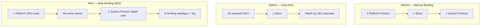
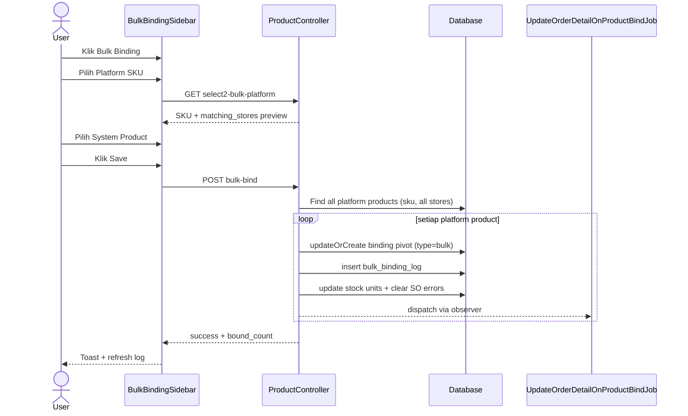

# Bulk Binding — Requirement & Perbandingan Before / After

**Modul:** OmniChannel — Manage Platform Product  
**Versi Dokumen:** 1.0  
**Tanggal Update:** 18 Juni 2026  
**Audience:** PM, Operations, QA, Developer  
**Status:** Proposal implementasi (backend partial, frontend belum ada)

---

## Daftar Isi

1. [Ringkasan untuk PM](#1-ringkasan-untuk-pm)
2. [Tiga Metode Binding Saat Ini](#2-tiga-metode-binding-saat-ini)
3. [Perbandingan Before vs After](#3-perbandingan-before-vs-after)
4. [Fitur Baru: Bulk Binding (Spesifikasi)](#4-fitur-baru-bulk-binding-spesifikasi)
5. [UI/UX — Sidebar Bulk Binding](#5-uiux--sidebar-bulk-binding)
6. [Aturan Bisnis & Validasi](#6-aturan-bisnis--validasi)
7. [Bulk Binding Log](#7-bulk-binding-log)
8. [Implementasi Teknis](#8-implementasi-teknis)
9. [Gap Analysis — Kode yang Sudah Ada vs Yang Dibutuhkan](#9-gap-analysis--kode-yang-sudah-ada-vs-yang-dibutuhkan)
10. [Test Plan](#10-test-plan)
11. [FAQ](#11-faq)

---

## 1. Ringkasan untuk PM

### Masalah yang ingin diselesaikan

Saat ini, binding platform product ke system product dilakukan **per baris** (manual) atau **per toko** dengan SKU match otomatis (auto-bind). Jika satu SKU marketplace dipakai di **15 toko**, user harus bind **15 kali** — padahal SKU code-nya sama persis.

**Bulk Binding** memungkinkan user memilih **satu SKU platform** dan **satu system product**, lalu sistem mengikat **semua platform product dengan SKU yang sama di seluruh toko aktif** sekaligus.

### Prinsip perubahan

| Metode | Perubahan? |
|--------|------------|
| Manual binding (per baris di Platform Product) | ❌ **Tidak ada perubahan** |
| Auto-bind (tombol + setelah sync + schedule) | ❌ **Tidak ada perubahan** |
| **Bulk Binding** | ✅ **Fitur baru** |

### Nilai bisnis

- Mengurangi waktu setup multi-store dari N kali bind → 1 kali aksi
- Log terpusat: terlihat SKU platform di-bind di store mana saja, oleh siapa, kapan
- Operasional lebih konsisten antar toko untuk SKU yang sama

---

## 2. Tiga Metode Binding Saat Ini

### 2.1 Manual Binding (per Platform Product)

| Aspek | Detail |
|-------|--------|
| **Lokasi UI** | Manage Platform Product → buka satu produk → modal/tab Binding |
| **API** | `PUT /api/omnichannel/product-platform/{id}/binding` |
| **Scope** | **1 platform product** di **1 store** |
| **Input** | Pilih System Product (atau kosongkan untuk unbind) |
| **Matching** | User memilih manual — tidak pakai SKU match |
| **Validasi** | Fix Asset ditolak · Random product butuh konfirmasi · COA group check |
| **Efek samping** | Salin unit stok · `handleErrorFlagBinding()` · `UpdateOrderDetailOnProductBindJob` · audit log bind/unbind |
| **type_binding** | Tidak di-set (null) |

### 2.2 Auto-bind (tombol)

| Aspek | Detail |
|-------|--------|
| **Lokasi UI** | Manage Platform Product → tombol Auto-bind (pilih store) |
| **API** | `POST /api/omnichannel/product-platform/auto-bind` |
| **Scope** | **Semua platform product belum bind** di **store yang dipilih** |
| **Matching** | SKU platform = SKU system product (case-insensitive, opsi `-random` → `-acak`) |
| **Proses** | Async batch job per store (`AutobindBatchJob` → `AutobindSingleJob`) |
| **Skip** | Parent platform product · Fix Asset · inactive system product · parent system product |
| **type_binding** | Tidak di-set di job saat ini |

### 2.3 Auto-bind (schedule / setelah sync)

| Aspek | Detail |
|-------|--------|
| **Trigger** | Setelah product sync selesai (`ProductSynchronizationAfterCommitObserver`) · cron product sync |
| **Job** | `AutobindBatchJob` dengan sync type `AFTER_SYNC_BIND` |
| **Scope & matching** | Sama dengan auto-bind tombol — **per store**, SKU match otomatis |
| **Perubahan** | ❌ Tidak diubah oleh fitur Bulk Binding |

---

## 3. Perbandingan Before vs After

### 3.1 Tabel perbandingan metode binding

| Kriteria | Manual (Before = After) | Auto-bind (Before = After) | Bulk Binding (Before → After) |
|----------|-------------------------|------------------------------|-------------------------------|
| **Status** | Sudah ada | Sudah ada | **Belum ada di UI** (backend partial) |
| **Entry point** | Modal per produk | Tombol + schedule | **Tombol Bulk Binding → sidebar** |
| **Scope** | 1 SKU × 1 store | Semua unbound SKU × 1 store | **1 SKU code × semua store** |
| **Cara pilih system product** | User pilih manual | Sistem match by SKU | **User pilih manual** |
| **Cara pilih platform product** | Implisit (baris yang dibuka) | Semua unbound di store | **User pilih SKU dari dropdown** |
| **Cross-store** | ❌ | ❌ | ✅ |
| **Butuh SKU sama persis** | ❌ | ✅ (auto match) | ✅ (platform SKU code) |
| **Log khusus** | Audit bind/unbind per produk | `ProductAutoBindLog` per batch | **`Bulk Binding Log`** (baru) |
| **Unbind** | ✅ (kosongkan system product) | ❌ | ❌ (out of scope v1 — hanya bind/update) |

### 3.2 Before — alur binding multi-store (15 toko, SKU sama)

```
User buka Platform Product Store A  → bind manual → selesai 1/15
User buka Platform Product Store B  → bind manual → selesai 2/15
...
User buka Platform Product Store O  → bind manual → selesai 15/15

ATAU

User auto-bind Store A → hanya match SKU identik di Store A
User auto-bind Store B → ulang untuk store berikutnya
(repeat 15x jika mau semua toko)
```

**Pain point:** Repetitif, rawan inkonsistensi (Store A bind ke SKU-A, Store B bind ke SKU-B).

### 3.3 After — alur dengan Bulk Binding

```
User klik "Bulk Binding" di Manage Platform Product
         ↓
Sidebar: pilih Platform SKU  "TSHIRT-RED-L"
         pilih System Product "TSHIRT-RED-L" (internal)
         ↓ (preview) sistem tampilkan: SKU ini ada di Store A, B, C ... (15 toko)
         ↓
Klik Save
         ↓
Sistem bind semua platform product dengan SKU "TSHIRT-RED-L"
di seluruh toko aktif company → ke system product yang dipilih
         ↓
Log mencatat 15 baris: per store, per platform product id, updated by/at
```

**Manual & Auto-bind tetap ada** untuk kasus lain (bind per baris, atau match otomatis per toko).

### 3.4 Diagram perbandingan scope



---

## 4. Fitur Baru: Bulk Binding (Spesifikasi)

### 4.1 User story

> Sebagai operator OmniChannel, saya ingin memilih satu SKU platform dan satu system product, lalu mengikat semua listing dengan SKU yang sama di seluruh toko sekaligus, agar saya tidak perlu binding satu per satu di 15 toko.

### 4.2 Acceptance criteria

| # | Kriteria |
|---|----------|
| AC-1 | Tombol **Bulk Binding** tersedia di halaman Manage Platform Product |
| AC-2 | Klik tombol membuka **sidebar** dengan 2 field: Platform Product SKU + System Product |
| AC-3 | Opsi Platform Product = daftar SKU unik dari semua platform product company |
| AC-4 | Opsi System Product = master system product tipe **Single** dan **Variant** (bukan Parent) |
| AC-5 | Saat user memilih Platform SKU, sidebar menampilkan **preview/log** store mana saja SKU tersebut ada |
| AC-6 | Klik Save → semua platform product dengan SKU **sama persis** di **semua toko aktif** ter-bind ke system product terpilih |
| AC-7 | Setiap hasil bind tercatat di **Bulk Binding Log** dengan kolom lengkap |
| AC-8 | Manual binding & auto-bind **tidak berubah** perilakunya |

### 4.3 Out of scope (v1)

- Bulk unbind (lepaskan binding massal)
- Bulk binding multiple SKU sekaligus (1 aksi = 1 SKU platform)
- Bind PARENT platform product (hanya SKU leaf: SINGLE & VARIANT)
- Override binding toko yang tidak authorized (hanya toko aktif company)

---

## 5. UI/UX — Sidebar Bulk Binding

### 5.1 Layout sidebar

```
┌─────────────────────────────────────────┐
│  Bulk Binding                        ✕  │
├─────────────────────────────────────────┤
│                                         │
│  Platform Product *                     │
│  [ Select SKU platform ▼ ]              │
│                                         │
│  Binded to System Product *             │
│  [ Select system product ▼ ]            │
│                                         │
│  ── Preview / Log (read-only) ──        │
│  ┌───────────────────────────────────┐  │
│  │ SKU ini ditemukan di 15 store:     │  │
│  │ • Toko Shopee A (Shopee)           │  │
│  │ • Toko Shopee B (Shopee)           │  │
│  │ • ...                              │  │
│  └───────────────────────────────────┘  │
│                                         │
│              [ Cancel ]  [ Save ]       │
└─────────────────────────────────────────┘
```

### 5.2 Perilaku field

| Field | Komponen | Sumber data | Catatan |
|-------|----------|-------------|---------|
| **Platform Product** | Select2 / Multiselect | `GET .../select2-bulk-platform` | Satu SKU unik; search by SKU/name |
| **Binded to System Product** | `SystemProductSelect` | `GET supplychain/product/select2?is_parent=false` | Single + Variant only; exclude parent |
| **Preview log** | List read-only | Response `matching_stores` dari select2 | Update saat platform SKU berubah |

### 5.3 Setelah Save berhasil

- Toast sukses: *"Platform products successfully bound to system product."*
- Preview/log di sidebar refresh atau redirect ke tab **Bulk Binding Log**
- DataList Platform Product refresh (status Binded ter-update)

### 5.4 Halaman / tab Bulk Binding Log

Bisa berupa:
- **Tab di sidebar** setelah save, atau
- **Sub-halaman / modal log** di Manage Platform Product

Menampilkan DataList dengan kolom sesuai §7.

---

## 6. Aturan Bisnis & Validasi

### 6.1 Validasi input (samakan dengan manual binding)

| Validasi | Manual (existing) | Bulk Binding (wajib) |
|----------|-------------------|----------------------|
| Permission `update` Platform Product | ✅ | ✅ |
| System Product exists | ✅ | ✅ |
| System Product owner = company aktif | — | ✅ (sudah di backend) |
| Fix Asset COA Group | ✅ ditolak | ✅ **perlu ditambahkan** |
| Random product mismatch | ✅ butuh konfirmasi | ⚠️ v1: tolak atau flag konfirmasi |
| Platform product adalah PARENT | N/A (UI hide) | ✅ **skip / tolak** |

### 6.2 Scope pencarian platform product saat bind

Saat user pilih Platform SKU = `ABC-123`, sistem mencari:

```
SELECT omni_products.*
FROM omni_products
JOIN omni_stores ON ...
WHERE omni_products.sku = 'ABC-123'        -- sama persis (case-sensitive DB)
  AND store.default_company_owner = {company}
  AND store.status = 1
  AND store.authorization_status = 1       -- perlu ditambahkan di backend
  AND platform product BUKAN parent        -- product_child_count = 0
```

**Catatan PM:** Matching SKU **sama persis** — `ABC-123` ≠ `abc-123` jika data di DB berbeda case.

### 6.3 Efek setelah bind (per platform product yang ter-match)

Sama seperti manual binding per baris:

| Efek | Jalan? |
|------|--------|
| `ProductBindingPivot` create/update | ✅ |
| `type_binding = 'bulk'` | ✅ |
| Salin `stock_unit_id`, conversion, base unit | ✅ |
| `handleErrorFlagBinding()` — clear bind-error di SO | ✅ |
| `UpdateOrderDetailOnProductBindJob` via observer | ✅ |
| Audit log bind/unbind (`ProductBindingObserver`) | ✅ |

### 6.4 System Product — filter Single & Variant

| Tipe System Product | Boleh dipilih di Bulk Binding? |
|---------------------|-------------------------------|
| **Single** (bukan parent, bukan variant child) | ✅ |
| **Variant** (punya parent di product tree) | ✅ |
| **Parent** (punya child variant) | ❌ |

**Implementasi select:** `SystemProductSelect` dengan `:is-parent="false"`  
→ mengecualikan produk yang menjadi parent di variant tree, tetap memuat single + variant child.

---

## 7. Bulk Binding Log

### 7.1 Tujuan log

Mencatat **setiap perubahan binding** yang dilakukan lewat fitur Bulk Binding, sehingga tim bisa menjawab:

- SKU platform mana yang di-bind?
- Di **store mana** saja binding di-update?
- Ke **system product** apa?
- **Siapa** yang melakukan dan **kapan**?

### 7.2 Kolom log (requirement PM)

| Kolom | Isi | Contoh |
|-------|-----|--------|
| **Platform SKU** | Kode SKU platform | `TSHIRT-RED-L` |
| **Platform Product ID** | ID internal `omni_products.id` | `10482` |
| **Store** | Nama toko | `Toko Shopee Official` |
| **System Product** | SKU system product hasil bind | `TSHIRT-RED-L` |
| **Updated By** | User yang klik Save di Bulk Binding | `Budi Santoso` |
| **Updated At** | Waktu aksi | `18-06-2026 14:32:10` |

### 7.3 Before vs After — pendekatan log

| Aspek | Backend saat ini (partial) | Target (After) |
|-------|---------------------------|----------------|
| **Sumber data** | Query `omni_product_binding_pivots` WHERE `type_binding = 'bulk'` | **Dedicated log table** (append-only) |
| **Platform Product ID** | ❌ Tidak ditampilkan | ✅ Kolom `product_omni_id` |
| **Updated By** | ❌ Tidak ditampilkan | ✅ `created_by` / join `users` |
| **Updated At** | Hanya `created_at` | ✅ `created_at` (= waktu aksi bulk) |
| **Re-bind history** | ❌ Pivot lama di-delete → histori hilang | ✅ Log baru tetap append |
| **Export Excel** | ✅ Sudah ada (4 kolom) | ✅ Perluas ke 6 kolom |

### 7.4 Rekomendasi tabel log baru

```
omni_bulk_binding_logs
├── id
├── bulk_binding_batch_id      -- UUID per klik Save (1 batch = 1 aksi user)
├── product_omni_id            -- FK omni_products
├── platform_sku               -- denormalized untuk search cepat
├── store_id                   -- FK omni_stores
├── product_system_id          -- FK scm_products
├── system_sku                 -- denormalized
├── created_by                 -- user yang save
├── created_at
└── owned_by                   -- company
```

**Kenapa tabel terpisah?** Pivot binding bisa di-update/di-delete saat re-bind. Log harus **append-only** agar histori audit tidak hilang.

### 7.5 Preview vs Log permanen

| Area | Fungsi | Kapan muncul |
|------|--------|--------------|
| **Preview di sidebar** | Informasi store yang **akan** ter-bind | Saat user pilih Platform SKU (sebelum Save) |
| **Bulk Binding Log** | Record **setelah** Save | Permanent, bisa difilter & di-export |

---

## 8. Implementasi Teknis

### 8.1 API — existing vs new

| Endpoint | Status | Perubahan |
|----------|--------|-----------|
| `PUT {id}/binding` | ✅ Existing | ❌ Tidak diubah |
| `POST auto-bind` | ✅ Existing | ❌ Tidak diubah |
| `GET select2-bulk-platform` | ✅ Existing | ⚠️ Enhance: filter parent SKU, return `product_omni_id` |
| `POST bulk-bind` | ✅ Existing | ⚠️ Hardening validasi + tulis log table |
| `GET bulk-binding-logs` | ✅ Existing | ⚠️ Query dari log table baru + kolom lengkap |
| `GET bulk-binding-logs/export-excel` | ✅ Existing | ⚠️ Sesuaikan kolom export |

### 8.2 Request / Response — Bulk Bind

**Request:**
```json
POST /api/omnichannel/product-platform/bulk-bind
{
  "platform_sku": "TSHIRT-RED-L",
  "system_product_id": 5021
}
```

**Response sukses:**
```json
{
  "status": { "error": 0 },
  "message": "Platform products successfully bound to system product.",
  "data": {
    "batch_id": "uuid",
    "bound_count": 15,
    "stores": ["Toko A", "Toko B", "..."]
  }
}
```

### 8.3 Backend — refactor `bulk_bind()` (target)

```
bulk_bind(request):
  1. Validasi permission + input
  2. Validasi system product (exists, owner, bukan Fix Asset, bukan parent)
  3. Query platform products: sku exact match, all active+authorized stores, skip parent
  4. Jika kosong → error
  5. DB::transaction:
     foreach product:
       - updateOrCreate ProductBindingPivot (type_binding = 'bulk')
       - handleErrorFlagBinding()
       - update stock unit fields
       - insert BulkBindingLog row
  6. Return success + bound_count
```

**Perbaikan dari kode saat ini:**
- Ganti `delete()` + `create()` → `updateOrCreate()` (lebih aman, observer konsisten)
- Tambah filter `authorization_status` pada store
- Skip platform product parent (`product_child_count > 0`)
- Tambah validasi Fix Asset & random (selaras manual)
- Tulis ke `omni_bulk_binding_logs` (bukan hanya pivot)

### 8.4 Frontend — file baru / ubah

| File | Aksi |
|------|------|
| `ProductPlatform/DataList.vue` | Tambah tombol Bulk Binding |
| `ProductPlatform/components/BulkBindingSidebar.vue` | **Baru** — sidebar form + preview |
| `ProductPlatform/components/BulkBindingLogList.vue` | **Baru** — datalist log |
| `ProductPlatform/components/PlatformProductSkuSelect.vue` | **Baru** (opsional) — wrapper select2-bulk-platform |
| `SystemProductSelect.vue` | Reuse dengan `is-parent="false"` |

### 8.5 Sequence diagram — Bulk Binding



---

## 9. Gap Analysis — Kode yang Sudah Ada vs Yang Dibutuhkan

### 9.1 Sudah ada di backend ✅

| Item | Lokasi |
|------|--------|
| Route `POST bulk-bind` | `Modules/OmniChannel/Routes/api.php` |
| Route `GET select2-bulk-platform` | idem |
| Route bulk-binding-logs + export | idem |
| Method `bulk_bind()` | `ProductController` ~L3403 |
| Method `select2BulkPlatform()` | `ProductController` ~L3344 |
| Method `bulkBindingLogs()` | `ProductController` ~L3469 |
| Kolom `type_binding` enum `bulk` | migration `omni_product_binding_pivots` |
| Export job | `BulkBindingLogExportJob` |

### 9.2 Belum ada / perlu perbaikan ❌

| Item | Prioritas | Catatan |
|------|-----------|---------|
| **Frontend sidebar Bulk Binding** | P0 | Belum ada sama sekali di `olshoperp-frontend` |
| **Tabel `omni_bulk_binding_logs`** | P0 | Log dari pivot tidak cukup untuk audit |
| **Kolom log: platform product id** | P0 | Requirement PM |
| **Kolom log: updated by** | P0 | Join user name |
| **Filter `authorization_status` di bulk_bind** | P1 | Saat ini hanya `store.status = 1` |
| **Skip PARENT platform product** | P1 | Parent tidak boleh di-bind |
| **Validasi Fix Asset** | P1 | Selaras manual binding |
| **Validasi Random product** | P2 | Konfirmasi atau block |
| **`updateOrCreate` vs delete+create** | P1 | Hindari kehilangan observer edge case |
| **Set `type_binding` di manual ('manual')** | P3 | Opsional — improvement terpisah |
| **Set `type_binding` di auto-bind ('auto')** | P3 | Opsional — improvement terpisah |

### 9.3 Perbandingan `bulk_bind` existing vs target

| Aspek | Existing (now) | Target (after) |
|-------|----------------|----------------|
| Match SKU all stores | ✅ `where('sku', $platform_sku)` | ✅ sama |
| Store filter | `status = 1` only | `status = 1` + `authorization_status = 1` |
| Skip parent platform | ❌ | ✅ |
| Fix Asset check | ❌ | ✅ |
| Random check | ❌ | ✅ / konfirmasi |
| Binding upsert | delete + create | `updateOrCreate` |
| Audit log | pivot `type_binding=bulk` | dedicated log table |
| Log columns | 4 kolom | 6 kolom (+ product id, updated by) |
| Frontend | ❌ | ✅ sidebar + log page |

---

## 10. Test Plan

### 10.1 Regression — tidak boleh berubah

| # | Skenario | Expected |
|---|----------|----------|
| R-1 | Manual bind 1 platform product | Sama seperti sebelumnya |
| R-2 | Manual unbind | Sama seperti sebelumnya |
| R-3 | Auto-bind via tombol (pilih store) | Sama seperti sebelumnya |
| R-4 | Auto-bind setelah product sync | Sama seperti sebelumnya |

### 10.2 Bulk Binding — happy path

| # | Skenario | Expected |
|---|----------|----------|
| B-1 | SKU ada di 15 store, Save bulk bind | 15 pivot ter-update, 15 baris log |
| B-2 | SKU hanya ada di 1 store | 1 binding, log 1 baris |
| B-3 | Pilih system product variant child | Bind berhasil |
| B-4 | SO platform dengan bind-error untuk SKU tersebut | Error hilang setelah bulk bind |

### 10.3 Bulk Binding — edge & negative

| # | Skenario | Expected |
|---|----------|----------|
| B-5 | SKU tidak ditemukan di store manapun | Error message jelas |
| B-6 | System product Fix Asset | Ditolak |
| B-7 | Platform product parent (bukan variant) | Di-skip / tidak ikut bind |
| B-8 | Store unauthorized tapi status aktif | Tidak ikut bind |
| B-9 | Re-bind SKU yang sama ke system product lain | Binding ter-update + **log baru** (histori tetap ada) |
| B-10 | User tanpa permission update | 403 |

---

## 11. FAQ

**Q: Apakah manual binding dan auto-bind berubah?**  
A: Tidak. Keduanya tetap berfungsi seperti sekarang.

**Q: Apa beda Bulk Binding dengan Auto-bind?**  
A: Auto-bind = per store, match SKU otomatis, hanya produk belum bind. Bulk Binding = cross-store, user **memilih** system product secara eksplisit, untuk SKU platform tertentu.

**Q: Apakah case SKU dibedakan?**  
A: Ya — matching `sku` di database **sama persis**. `ABC` dan `abc` dianggap berbeda jika data di DB berbeda.

**Q: Bagaimana dengan produk PARENT di marketplace?**  
A: Tidak di-bind lewat bulk. User bind tiap VARIANT-nya, atau gunakan manual per variant.

**Q: Apakah bulk binding bisa unbind?**  
A: Tidak di v1. Unbind tetap per baris via manual binding.

**Q: Kenapa perlu log terpisah dari pivot binding?**  
A: Pivot bisa di-overwrite saat re-bind. Log audit harus tetap ada untuk compliance dan troubleshooting.

**Q: Backend sudah jadi?**  
A: Sebagian — API `bulk-bind` dan log endpoint sudah ada, tetapi perlu hardening validasi, log table baru, dan **seluruh frontend belum dibuat**.

---

## Lampiran — Referensi Kode

| Area | File |
|------|------|
| Manual binding | `ProductController::binding()` |
| Auto-bind | `ProductController::auto_bind()`, `CanAutoBind` |
| Bulk bind (partial) | `ProductController::bulk_bind()` |
| Select platform SKU | `ProductController::select2BulkPlatform()` |
| Binding pivot | `ProductBindingPivot`, `type_binding` |
| Observer / backfill SO | `ProductBindingObserver`, `UpdateOrderDetailOnProductBindJob` |
| UI binding manual | `BindingForm.vue` |
| Dokumen terkait | [Platform Product Binding Glossary](./platform-product-binding-glossary.md) |

---

**Dokumen terkait:**

- [Platform Product Binding Glossary](./platform-product-binding-glossary.md)
- [Platform Product Sync Pipeline](./platform-product-sync-newrequirement.md)
