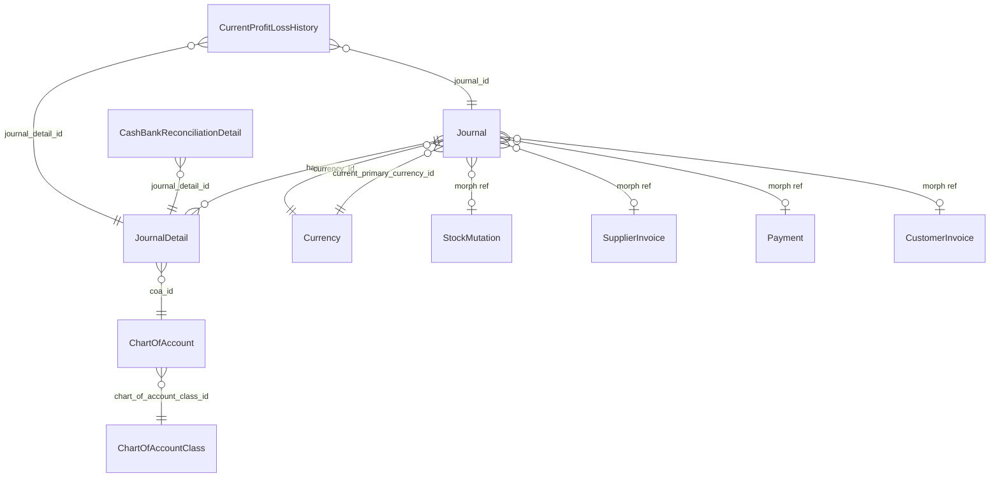

# General Ledger Report — Requirement Detail (AS-IS & TO-BE)

**Modul:** Accounting  
**Versi Dokumen:** 1.0  
**Tanggal:** 19 Juni 2026  
**Audience:** PM, QA, Support, Developer (Backend & Frontend)  
**Scope:** UI General Ledger, Export Excel, helper `JournalReport`, relasi journal & COA

---

## Daftar Isi

1. [Ringkasan Eksekutif](#1-ringkasan-eksekutif)
2. [AS-IS — Kondisi Saat Ini](#2-as-is--kondisi-saat-ini)
3. [Penjelasan Opening Balance & Ending Balance (AS-IS)](#3-penjelasan-opening-balance--ending-balance-as-is)
4. [Relasi Data & Dependensi](#4-relasi-data--dependensi)
5. [TO-BE — Improvement yang Akan Dikembangkan](#5-to-be--improvement-yang-akan-dikembangkan)
6. [Perbandingan AS-IS vs TO-BE](#6-perbandingan-as-is-vs-to-be)
7. [Acceptance Criteria TO-BE](#7-acceptance-criteria-to-be)
8. [Referensi File Codebase](#8-referensi-file-codebase)

---

## 1. Ringkasan Eksekutif

**General Ledger (GL)** adalah laporan transaksi jurnal per Chart of Account (COA) dalam periode tertentu. Data bersumber dari **journal detail** yang journal header-nya berstatus **Approved**. Laporan di-grouping per COA, menampilkan baris transaksi (debit/credit) dan kolom saldo.

**Gap utama AS-IS:**

| Area | Kondisi |
|------|---------|
| Group header COA | Hanya menampilkan `COA Code \| COA Name`, **tanpa** total debit/credit/ending balance per grup |
| Kolom Opening/Ending Balance (UI) | Nilai **sama di setiap baris** dalam satu COA (bukan running balance per transaksi) |
| Perhitungan saldo vs posisi COA class | **Tidak konsisten** — adjustment `Passiva` hanya di sebagian kode (export job & coa_title), tidak di kolom UI |
| Export Excel | Opening/Ending Balance per baris = saldo COA level (bukan running balance); format kolom berbeda dari kebutuhan bisnis |

**TO-BE** menambahkan akumulasi debit/credit/ending balance di group header COA (berdasarkan posisi COA class), dan running ending balance per baris di export.

---

## 2. AS-IS — Kondisi Saat Ini

### 2.1 Akses & Filter

| Aspek | Detail |
|-------|--------|
| **Menu UI** | FA → Report → General Ledger (`/accounting/general-ledger`) |
| **API datalist** | `GET /api/accounting/general-ledger` |
| **Policy** | `GeneralLedgerPolicy` — menu link `accounting/general-ledger` |
| **Filter periode** | Advanced Filter (SearchBuilder) kolom `trx_date_formatted`, kondisi default: **bulan berjalan** (`startOfMonth` s/d `endOfMonth`) |
| **Filter COA** | Opsional via SearchBuilder (`coa_formatted`, `coa_name_formatted`) — **tidak wajib** pilih COA sebelum load |
| **Company scope** | `journal.owned_by = getCompany(true)` |
| **Status transaksi** | Hanya `transaction_status = Approved` (`MainModel::TS_APPROVED`) |

**Catatan teknis filter periode:**

- Query utama (`mainQuery`) **tidak** menerapkan filter tanggal untuk GL report biasa (bukan Cash Bank Reconciliation).
- Filter tanggal diterapkan oleh **DataTables SearchBuilder** di request API (`searchBuilder.criteria` pada kolom `trx_date_formatted`).
- Helper `resolveStartEndDate()` membaca periode dari: (1) param `period`, (2) param `start`/`end`, atau (3) SearchBuilder criteria tanggal — dipakai untuk perhitungan Opening/Ending Balance.

### 2.2 Sumber Data & Query Utama

Data diambil dari `JournalDetail` dengan join:

```
JournalDetail
  → Journal (header, approved, company)
  → ChartOfAccount (code, name)
  → ChartOfAccountClass (position: Activa / Passiva)
  → Currency (journal currency)
  → LEFT JOIN referensi transaksi (StockMutation, SupplierInvoice, Payment, CustomerInvoice)
```

**Urutan data:** `coa_id ASC`, `transaction_date ASC`

**Special case — Current Profit/Loss:**

Jika company punya COA "Current Profit/Loss", query utama di-**UNION** dengan baris dari `CurrentProfitLossHistory` yang `coa_id`-nya di-replace ke COA Current Profit/Loss. Ini agar mutasi laba rugi berjalan tampil di COA tersebut.

### 2.3 Mapping Kolom UI (AS-IS)

| Kolom UI | Field API | Sumber Data | Catatan |
|----------|-----------|-------------|---------|
| **TRX. DATE** | `trx_date_formatted` | `accounting_journals.transaction_date` | Format `d-m-Y H:i:s` |
| **TRX. CODE** | `code_formatted` | `accounting_journals.code` | Link ke `/journal/edit/{journal_id}` |
| **JOURNAL TYPE** | `type_formatted` (hidden) | `journals.transaction_reference_text` | Default: "Manual Entry Formatted" jika kosong |
| **TRX. REF.** | `reference_formatted` | Polymorphic `transaction_reference` → `code` | Supplier Invoice, Payment, Customer Invoice, Stock Mutation, dll. |
| **DESCRIPTION** | `description` | `accounting_journal_details.description` | |
| **FOREIGN** | `foreign_amount_formatted` | `debit_foreign` atau `credit_foreign` (whichever ≠ 0) | Ditampilkan dengan currency code; tampil jika ada nilai foreign |
| **DEBIT** | `debit_amount_formatted` | `accounting_journal_details.debit` | **Primary currency** — sudah dikonversi saat simpan jika journal foreign |
| **CREDIT** | `credit_amount_formatted` | `accounting_journal_details.credit` | **Primary currency** — sudah dikonversi saat simpan jika journal foreign |

**Kolom export-only (via `exportUsing`, tidak tampil di UI table):**

| Kolom Export | Field API | Sumber |
|--------------|-----------|--------|
| Currency | `journal_currency` | `currencies.code` dari journal header |
| Foreign (numeric) | `foreign_amount` | `debit_foreign` atau `credit_foreign` |
| Debit (numeric) | `debit` | `journal_details.debit` |
| Credit (numeric) | `credit` | `journal_details.credit` |
| Opening Balance | `opening_balance` | `JournalReport::getBeginningBalance()` |
| Ending Balance | `ending_balance` | `JournalReport::getEndingBalance()` |

### 2.4 Konversi Currency (Debit/Credit vs Foreign)

Saat journal detail **disimpan** (`JournalDetailController@store`):

```
isForeign = (journal.current_primary_currency_id != journal.currency_id) OR (journal.exchange_rate != 1)

Jika isForeign:
  debit  = input_debit  × journal.exchange_rate   → disimpan ke kolom debit
  credit = input_credit × journal.exchange_rate   → disimpan ke kolom credit
  debit_foreign  = input_debit                    → disimpan ke kolom debit_foreign
  credit_foreign = input_credit                   → disimpan ke kolom credit_foreign

Jika primary:
  debit/credit = input langsung
  debit_foreign/credit_foreign = 0
```

**Implikasi untuk GL report:** Kolom **Debit** dan **Credit** di report selalu dalam **primary currency**. Kolom **Foreign** menampilkan nilai asli foreign currency. Report **tidak** melakukan konversi ulang — konversi sudah terjadi di level persistensi.

**Resolusi currency code untuk kolom Foreign:**

| Journal Type (`transaction_reference_text`) | Currency code yang dipakai |
|---------------------------------------------|----------------------------|
| Supplier Invoice | Currency Supplier Invoice |
| Payment to Supplier / Debit Note | Currency Payment |
| Lainnya | Currency journal header |

### 2.5 Grouping per COA (AS-IS)

| Aspek | Perilaku |
|-------|----------|
| **Mekanisme UI** | DataTables RowGroup, `dataSrc: "coa_title"` |
| **Isi group header** | `{coa_code} \| {coa_name}` saja (bold) |
| **Total debit/credit grup** | ❌ Tidak ada |
| **Ending balance grup** | ❌ Tidak ada (meskipun backend menghitung `$beginningBalance` & `$endingBalance` di `coa_title`, nilai tersebut **tidak dirender** ke HTML) |

### 2.6 Export Excel (AS-IS)

| Aspek | Detail |
|-------|--------|
| **Trigger** | Export All via `GET /api/accounting/general-ledger/export-excel` |
| **Job** | `GeneralLedgerExportJob` (batch, chunk 5000 records) |
| **Class export** | `GeneralLedgerExport` |
| **Tracking file** | `accounting_general_ledger_export_files` |

**Format kolom export (flat, per baris journal detail):**

| # | Header | Sumber |
|---|--------|--------|
| A | COA Code | `coa.code` |
| B | COA Name | `coa.name` |
| C | GL Trx. Code | `journal.code` |
| D | Trx. Date | `journal.transaction_date` |
| E | Journal Type | `transaction_reference_text` atau "Manual Journal Entry" |
| F | Trx. Ref | `transaction_reference.code` |
| G | Description | `journal_detail.description` |
| H | Currency | `journal.currency.code` |
| I | Foreign | `debit_foreign` atau `credit_foreign` |
| J | Debit | `journal_detail.debit` |
| K | Credit | `journal_detail.credit` |
| L | Opening Balance | `JournalReport::getBeginningBalance(coa_id, start)` |
| M | Ending Balance | `JournalReport::getEndingBalance(coa_id, start, end)` — jika COA class position = `Passiva`, dikali **-1** |

**Catatan export AS-IS:**

- Export **tidak** di-grouping per COA di file Excel (flat list, COA code/name diulang setiap baris).
- Opening Balance & Ending Balance **sama** untuk semua baris dalam COA yang sama.
- Ending Balance export menerapkan adjustment Passiva; Opening Balance **tidak**.
- File legacy `GeneralLedgerExportAll.php` (grouped layout) ada di codebase tapi **bukan** path export aktif saat ini.

---

## 3. Penjelasan Opening Balance & Ending Balance (AS-IS)

### 3.1 Definisi

Semua perhitungan saldo menggunakan helper **`App\Helpers\Accounting\JournalReport`**, dengan currency **primary** (kolom `debit`/`credit`, bukan `debit_foreign`/`credit_foreign`).

| Konsep | Function | Formula |
|--------|----------|---------|
| **Opening Balance (Beginning)** | `getBeginningBalance($coaId, $startDate)` | `SUM(debit) - SUM(credit)` dari journal detail COA tersebut, journal approved, dengan `transaction_date < startDate` |
| **Mutasi periode** | `getInPeriodBalance($coaId, $startDate, $endDate)` | `SUM(debit) - SUM(credit)` journal approved, `transaction_date BETWEEN startDate AND endDate` |
| **Ending Balance** | `getEndingBalance($coaId, $startDate, $endDate)` | `getBeginningBalance + getInPeriodBalance` |

### 3.2 Scope Perhitungan

| Parameter | Nilai AS-IS |
|-----------|-------------|
| Status journal | Approved only (`approved = 1`) |
| Level agregasi | Per **COA leaf** (per `coa_id` pada journal detail) |
| Periode opening | Semua transaksi **sebelum** `startDate` (bukan awal fiscal period otomatis) |
| Periode ending | Opening + mutasi dari `startDate` s/d `endDate` |
| Company filter | Via relasi journal (implicit melalui data journal detail yang di-query) |

### 3.3 Perilaku di UI vs Export

| Lokasi | Opening Balance | Ending Balance | Adjustment Passiva |
|--------|-----------------|----------------|-------------------|
| Kolom UI (`opening_balance`, `ending_balance`) | COA-level, sama tiap baris | COA-level, sama tiap baris | ❌ Tidak |
| Group header (`coa_title`) | Dihitung tapi **tidak ditampilkan** | Dihitung, Passiva × -1, tapi **tidak ditampilkan** | ⚠️ Partial (tidak visible) |
| Export job | COA-level, sama tiap baris | COA-level, Passiva × -1 | ⚠️ Ending only |

### 3.4 Bukan Running Balance

**AS-IS tidak menghitung running balance per baris transaksi.**

Contoh COA Activa, opening = 0, periode Jan 2026:

| Row | Debit | Credit | Ending Balance (AS-IS) |
|-----|-------|--------|------------------------|
| Trx 1 | 100.000 | 0 | **100.000** (COA total, bukan 100.000 running) |
| Trx 2 | 0 | 30.000 | **70.000** (COA total, bukan 70.000 running) |
| Trx 3 | 45.000 | 0 | **115.000** (COA total, bukan 115.000 running) |

Semua baris menampilkan **115.000** (ending balance COA), bukan saldo kumulatif per transaksi.

### 3.5 Posisi COA Class (7 Class AS-IS)

Data master dari `ChartOfAccountClassSeeder`:

| # | Class | Code | Position |
|---|-------|------|----------|
| 1 | Assets | AST | **Activa** |
| 2 | Liabilities | LBL | **Passiva** |
| 3 | Equity | EQ | **Passiva** |
| 4 | Revenue | INC | **Passiva** |
| 5 | Expense | EXP | **Activa** |
| 6 | Cost of Goods Sold | COGS | **Activa** |
| 7 | Other Revenue & Expenses | ORE | **Passiva** |

**Position disimpan di:** `accounting_chart_of_account_classes.position`  
**Relasi ke COA:** `accounting_chart_of_accounts.chart_of_account_class_id`

**AS-IS tidak menerapkan formula position secara konsisten:**

```
Activa  → balance = debit - credit   (implicit di JournalReport)
Passiva → balance = credit - debit   (= (debit - credit) × -1)
```

Formula Passiva hanya diterapkan parsial di export ending balance & perhitungan coa_title (yang tidak ditampilkan).

---

## 4. Relasi Data & Dependensi

### 4.1 Entity Relationship Diagram



### 4.2 Tabel Database Kunci

| Tabel | Peran di GL Report |
|-------|-------------------|
| `accounting_journals` | Header: tanggal, code, status, currency, exchange_rate, referensi transaksi |
| `accounting_journal_details` | Detail: coa_id, debit, credit, debit_foreign, credit_foreign, description |
| `accounting_chart_of_accounts` | COA code, name, class |
| `accounting_chart_of_account_classes` | Class name, **position** (Activa/Passiva) |
| `accounting_current_profit_loss_histories` | Remap journal detail ke COA Current Profit/Loss |
| `accounting_general_ledger_export_files` | Tracking async export |
| `gs_currencies` | Currency code journal & referensi |

### 4.3 Relasi yang Harus Diperhatikan

| Relasi | Dampak jika Berubah |
|--------|---------------------|
| **Journal → JournalDetail** | Perubahan status journal (unapprove/void) langsung affect data GL |
| **JournalDetail → COA → COA Class** | Perubahan class/position COA affect perhitungan ending balance TO-BE |
| **Journal → Currency + exchange_rate** | Affect nilai debit/credit (primary) vs foreign |
| **Journal → transaction_reference (morph)** | Affect TRX REF, Journal Type, dan currency foreign display |
| **CurrentProfitLossHistory** | Baris laba rugi berjalan tampil di COA Current Profit/Loss, bukan COA asli |
| **Company scope (`owned_by`)** | Data terisolasi per company token |
| **Soft delete** | Journal soft-deleted di-exclude via `whereNull(deleted_at)` |

### 4.4 Function & Helper yang Terlibat

| Function / Class | Lokasi | Fungsi |
|------------------|--------|--------|
| `JournalReport::getBeginningBalance` | `app/Helpers/Accounting/JournalReport.php` | Opening balance per COA |
| `JournalReport::getEndingBalance` | idem | Ending balance per COA |
| `JournalReport::getInPeriodDebit/Credit` | idem | Agregasi mutasi periode |
| `resolveStartEndDate` | `app/Helpers/MainHelper.php` | Resolve periode dari request/filter |
| `getProfitLossCoaIds` | `app/Helpers/Accounting/AccontingHelper.php` | ID COA Current & Retained Profit/Loss |
| `CurrencyProcess::getPrimaryCurrencyRow` | General Setting | Primary currency code |
| `GeneralLedgerController::mainQuery` | Controller | Query builder utama |
| `GeneralLedgerController::index` | Controller | Datalist + kolom computed |
| `GeneralLedgerExportJob` | Jobs | Async export processing |

### 4.5 Integrasi Frontend

| File | Peran |
|------|-------|
| `olshoperp-frontend/src/pages/Accounting/Report/GeneralLedger/DataList.vue` | UI table, kolom, row group, export config |
| `DataTablesV3.vue` | SearchBuilder, advanced filter, export all |
| `ExportFileTable.vue` | Download & progress export |

**Validasi frontend AS-IS:** Default filter periode bulan berjalan via SearchBuilder. Export params include `period` & `coas` (legacy methods masih ada di component).

---

## 5. TO-BE — Improvement yang Akan Dikembangkan

### 5.1 Group Header COA — Akumulasi Total (Improvement #1)

**Lokasi:** UI General Ledger, baris group header per COA (RowGroup `coa_title`)

**Tambahan informasi di group header:**

| Field | Definisi | Scope Periode |
|-------|----------|---------------|
| **Total Debit** | `SUM(journal_detail.debit)` untuk COA ini | Selected period only |
| **Total Credit** | `SUM(journal_detail.credit)` untuk COA ini | Selected period only |
| **Ending Balance (grup)** | Berdasarkan posisi COA class | Selected period (opening + mutasi periode) |

**Formula Ending Balance grup berdasarkan COA Class Position:**

```
// Ambil position dari COA → ChartOfAccountClass.position
total_debit_period  = SUM(debit)  WHERE coa_id = X AND date BETWEEN start AND end AND approved
total_credit_period = SUM(credit) WHERE coa_id = X AND date BETWEEN start AND end AND approved
opening_balance     = getBeginningBalance(coa_id, start_date)

IF position = 'Activa':
    ending_balance_group = opening_balance + total_debit_period - total_credit_period

IF position = 'Passiva':
    ending_balance_group = opening_balance + total_credit_period - total_debit_period
    // equivalently: opening_balance - (total_debit_period - total_credit_period) dengan opening sudah disesuaikan
```

**Rekomendasi implementasi:** Buat helper baru, mis. `JournalReport::getEndingBalanceWithPosition($coaId, $startDate, $endDate, $position)` agar konsisten di UI & export.

**Mapping 7 COA Class:**

| Position | Classes |
|----------|---------|
| **Activa** | Assets (AST), Expense (EXP), Cost of Goods Sold (COGS) |
| **Passiva** | Liabilities (LBL), Equity (EQ), Revenue (INC), Other Revenue & Expenses (ORE) |

**Contoh tampilan group header TO-BE:**

```
1101 | Kas Bank BCA
Total Debit: Rp 145.000,00 | Total Credit: Rp 30.000,00 | Ending Balance: Rp 115.000,00
```

### 5.2 Export — Running Ending Balance per Baris (Improvement #2)

**Lokasi:** Export Excel (`GeneralLedgerExportJob` + `GeneralLedgerExport`)

**Perubahan format export TO-BE:**

1. **Tetap** kolom flat per baris (atau optional grouped — keputusan UX).
2. **Opening Balance** baris pertama per COA = opening balance COA (sebelum periode).
3. **Ending Balance per baris** = **running balance** kumulatif, selaras dengan debit/credit baris tersebut.

**Algoritma running balance per COA:**

```
running_balance = opening_balance_adjusted  // based on COA class position

UNTUK setiap journal_detail dalam COA (urut transaction_date ASC):
    IF position = 'Activa':
        running_balance = running_balance + debit - credit
    IF position = 'Passiva':
        running_balance = running_balance + credit - debit

    ending_balance_row = running_balance
```

**Contoh Activa (position = Activa, opening = 0):**

| Row | Debit | Credit | Ending Balance (TO-BE) |
|-----|-------|--------|------------------------|
| 1 | 100.000 | 0 | 100.000 |
| 2 | 0 | 30.000 | 70.000 |
| 3 | 45.000 | 0 | 115.000 |

**Verifikasi:** Ending balance baris terakhir per COA **harus sama** dengan Ending Balance grup di UI (Improvement #1).

**Contoh Passiva (position = Passiva, opening = 50.000):**

| Row | Debit | Credit | Ending Balance (TO-BE) |
|-----|-------|--------|------------------------|
| 1 | 0 | 20.000 | 70.000 |
| 2 | 10.000 | 0 | 60.000 |

### 5.3 Konsistensi Position di Semua Output

| Output | TO-BE Requirement |
|--------|-------------------|
| UI group header | Total debit, total credit, ending balance dengan position |
| UI kolom per baris (opsional future) | Running balance — **out of scope** kecuali diminta |
| Export Opening Balance | Position-aware opening (Passiva: credit - debit historis) |
| Export Ending Balance | Running balance per baris, position-aware |
| Export group total row (opsional) | Match UI group header |

### 5.4 Edge Cases TO-BE

| Case | Expected Behavior |
|------|-------------------|
| COA tanpa transaksi di periode | Group tidak muncul (AS-IS behavior) atau muncul dengan total 0 — **konfirmasi PM** |
| Current Profit/Loss COA | Gunakan union query existing; running balance hitung dari baris yang ditampilkan |
| Journal foreign currency | Debit/credit primary (sudah converted); foreign column tetap as-is |
| Unapprove journal setelah export | Export async — data snapshot saat job jalan |
| COA class position berubah | Pakai position **saat report di-generate** (current master data) |
| Multiple transaksi same timestamp | Urutan secondary sort: `journal_detail.id ASC` (definisikan tie-breaker) |

---

## 6. Perbandingan AS-IS vs TO-BE

| Aspek | AS-IS | TO-BE |
|-------|-------|-------|
| Group header COA | Code \| Name only | + Total Debit, Total Credit, Ending Balance |
| Ending balance formula | `debit - credit` (tanpa position konsisten) | Position-aware: Activa = D-C, Passiva = C-D |
| Ending balance per baris UI | COA total (sama semua baris) | Tetap COA total (kecuali diminta running di UI) |
| Ending balance export | COA total (sama semua baris) | **Running balance** per baris |
| Opening balance export | `debit - credit` historis | Position-aware opening |
| Passiva adjustment | Partial (export ending only) | Konsisten semua output |
| Helper baru | — | `getEndingBalanceWithPosition`, `getRunningBalanceRows` (recommended) |

---

## 7. Acceptance Criteria TO-BE

### 7.1 UI Group Header

- [ ] Setiap group COA menampilkan Total Debit periode terpilih
- [ ] Setiap group COA menampilkan Total Credit periode terpilih
- [ ] Ending Balance grup = opening (position-aware) + mutasi periode (position-aware)
- [ ] Nilai grup cocok dengan agregasi baris detail di bawahnya
- [ ] Periode grup mengikuti advanced filter tanggal yang aktif

### 7.2 Export Excel

- [ ] Kolom Opening Balance baris pertama per COA = opening position-aware
- [ ] Kolom Ending Balance = running balance per baris
- [ ] Ending balance baris terakhir per COA = Ending Balance grup di UI
- [ ] Formula Activa: running += debit - credit
- [ ] Formula Passiva: running += credit - debit
- [ ] Urutan baris per COA: `transaction_date ASC`, tie-breaker `id ASC`
- [ ] Export respect filter periode & COA dari request

### 7.3 Regression

- [ ] Hanya journal Approved yang muncul
- [ ] Company scoping tetap benar
- [ ] Current Profit/Loss union tetap berfungsi
- [ ] Foreign currency display tidak berubah
- [ ] Primary currency debit/credit tidak double-convert

---

## 8. Referensi File Codebase

### Backend (`olshoperp`)

| File | Peran |
|------|-------|
| `Modules/Accounting/Http/Controllers/GeneralLedgerController.php` | Controller utama, query, kolom datalist |
| `app/Helpers/Accounting/JournalReport.php` | Semua perhitungan saldo |
| `Modules/Accounting/Jobs/GeneralLedgerExportJob.php` | Export async job |
| `Modules/Accounting/Exports/GeneralLedgerExport.php` | Excel column mapping |
| `Modules/Accounting/Entities/Journal.php` | Model journal header |
| `Modules/Accounting/Entities/JournalDetail.php` | Model journal detail |
| `Modules/Accounting/Entities/ChartOfAccount.php` | Model COA |
| `Modules/Accounting/Entities/ChartOfAccountClass.php` | Model COA class (position) |
| `Modules/Accounting/Entities/CurrentProfitLossHistory.php` | Laba rugi berjalan |
| `Modules/Accounting/Database/Seeders/ChartOfAccountClassSeeder.php` | 7 COA class master |
| `Modules/Accounting/Http/Controllers/JournalDetailController.php` | Konversi currency saat save |
| `Modules/Accounting/Routes/api.php` | Route GL API |
| `app/Helpers/MainHelper.php` → `resolveStartEndDate` | Resolve periode |

### Frontend (`olshoperp-frontend`)

| File | Peran |
|------|-------|
| `src/pages/Accounting/Report/GeneralLedger/DataList.vue` | UI GL report |
| `src/components/project/DataTables/DataTablesV3.vue` | DataTable engine |
| `src/components/project/DataTables/ExportFileTable.vue` | Export file list |

### Report Terkait (Referensi Pola)

| Report | Relevansi |
|--------|-----------|
| Trial Balance | Agregasi beginning/in-period/ending debit & credit per COA |
| Balance Sheet | Position-aware balance via `chart_of_account_class` |
| Cash Bank Reconciliation GL | Reuse `GeneralLedgerController` dengan flag reconciliation |

---

*Dokumen ini dibuat berdasarkan analisis codebase per 19 Juni 2026. Update dokumen ini setelah implementasi TO-BE selesai.*
