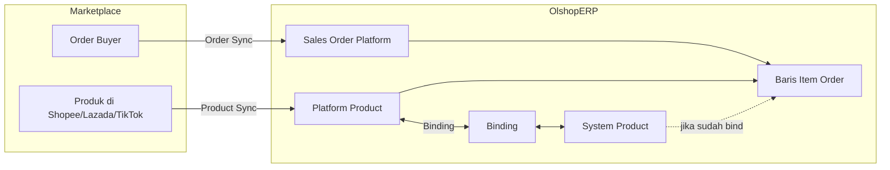
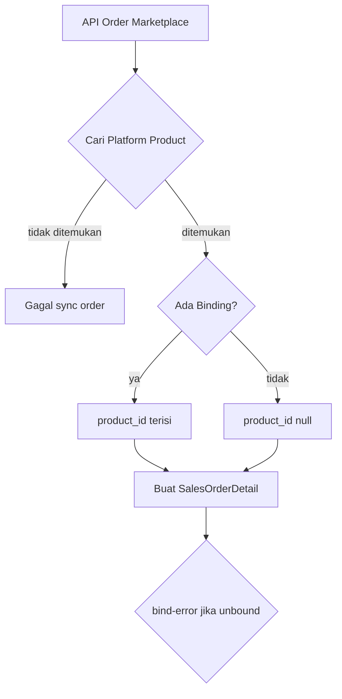

# Platform Product Binding & Sales Order Platform

**Modul:** OmniChannel  
**Versi Dokumen:** 2.0  
**Tanggal Update:** 18 Juni 2026  
**Audience:** PM, Operations, QA, Support, Developer  
**Status:** Sesuai perilaku sistem saat ini (as-is)

---

## Daftar Isi

1. [Ringkasan untuk PM](#1-ringkasan-untuk-pm)
2. [Konsep Utama (Glossary)](#2-konsep-utama-glossary)
3. [Bagaimana Binding Bekerja](#3-bagaimana-binding-bekerja)
4. [Tipe SKU di Platform Product](#4-tipe-sku-di-platform-product)
5. [Hubungan dengan Sales Order Platform](#5-hubungan-dengan-sales-order-platform)
6. [Dampak Binding ke Operasional Harian](#6-dampak-binding-ke-operasional-harian)
7. [Skenario Umum (Playbook)](#7-skenario-umum-playbook)
8. [Aturan & Pembatasan](#8-aturan--pembatasan)
9. [Error & Status yang Perlu Diketahui](#9-error--status-yang-perlu-diketahui)
10. [FAQ](#10-faq)
11. [Lampiran Teknis (Developer)](#11-lampiran-teknis-developer)

---

## 1. Ringkasan untuk PM

### Apa masalah yang diselesaikan binding?

Marketplace (Shopee, Lazada, TikTok, dll.) punya **SKU sendiri**. Gudang dan akuntansi OlshopERP punya **SKU internal (System Product)**. **Binding** adalah langkah menghubungkan keduanya agar:

- Pesanan dari marketplace bisa diproses (picking, packing, stok keluar)
- Stok internal bisa di-push ke marketplace
- Laporan stok dan fulfillment konsisten

### Analogi sederhana

| Dunia Marketplace | Dunia OlshopERP | Peran Binding |
|-------------------|-----------------|---------------|
| Produk di toko Shopee | System Product di SCM | Menjadi "jembatan" |
| Order masuk dari buyer | Sales Order Platform | Butuh tahu produk internal mana yang dikirim |
| Stok di etalase marketplace | ATS di gudang | Di-update lewat produk yang sudah terikat |

### Alur besar (end-to-end)

```
Sync Produk Platform  →  Binding (manual / auto)  →  Sync Order Platform  →  Approve & Fulfill
        ↓                        ↓                          ↓
  SKU muncul di            SKU marketplace              Order tahu item
  Manage Platform          terhubung ke SKU             marketplace mana,
  Product                  internal                     lalu ke SKU internal
```

**Poin penting:** Order **bisa masuk** meski produk belum di-bind, tetapi order **tidak bisa diproses** (approve/wave) sampai binding selesai.

---

## 2. Konsep Utama (Glossary)

| Istilah | Penjelasan Singkat | Di Mana Terlihat di UI |
|---------|-------------------|------------------------|
| **Platform Product** | Salinan produk dari marketplace yang sudah di-sync ke OlshopERP | Menu **Manage Platform Product** |
| **System Product** | Master produk internal (stok, harga, pajak, bundle) | Menu **System Product** (SCM) |
| **Binding** | Hubungan resmi: 1 SKU marketplace ↔ 1 SKU internal, per toko | Kolom status **Binded / Not Binded**, modal Binding |
| **Store** | Satu akun marketplace yang sudah di-authorize | Pengaturan toko OmniChannel |
| **Sales Order Platform** | Pesanan penjualan yang berasal dari marketplace | Menu Sales Order (tipe Platform) |
| **Sales Order General** | Pesanan manual/internal — **tidak** lewat marketplace | Menu Sales Order (tipe General) |
| **Auto-bind** | Sistem otomatis mencocokkan SKU marketplace dengan SKU internal yang sama | Tombol Auto-bind di Manage Platform Product |
| **Unbind** | Memutus hubungan binding | Kosongkan pilihan System Product di modal Binding |
| **Fake Stock** | Stok manual di platform product — push stok tanpa binding | Pengaturan stok di Platform Product |
| **ATS** | Stok tersedia untuk dijual (Available To Sell) dari System Product | Kolom ATS di System Product |
| **bind-error** | Error pada order: produk marketplace belum terhubung ke produk internal | Filter error di Sales Order Platform |

---

## 3. Bagaimana Binding Bekerja

### 3.1 Manual Binding

**Siapa:** User dengan permission update Platform Product  
**Di mana:** Manage Platform Product → buka produk → tab/modal **Binding**  
**Langkah:**

1. Pilih **System Product** yang sesuai
2. Simpan
3. Sistem menyalin pengaturan unit stok dari System Product ke Platform Product
4. Order yang sebelumnya tertahan karena belum bind otomatis diperbaiki (backfill)

**Unbind:** Kosongkan pilihan System Product → simpan. Binding dihapus; pengaturan unit stok platform di-reset.

### 3.2 Auto-bind

**Kapan jalan:**

- Setelah sync produk platform selesai (otomatis di background)
- Saat user klik tombol **Auto-bind** di Manage Platform Product

**Aturan pencocokan:**

| Kriteria | Keterangan |
|----------|------------|
| SKU sama | Case-insensitive (huruf besar/kecil diabaikan) |
| System Product aktif | Produk inactive tidak ikut dicocokkan |
| Bukan Fix Asset | Produk dengan COA Group "Fix Asset" tidak bisa di-bind |
| Bukan parent variant | Hanya SKU leaf (bukan parent System Product) |
| Belum terikat | Hanya produk yang statusnya Not Binded |

**Catatan Random SKU:** Jika System Product bertipe Random, SKU platform harus mengandung kata "random" (atau perlu konfirmasi khusus).

### 3.3 Apa yang terjadi setelah binding?

| Area | Perubahan |
|------|-----------|
| Status UI | **Not Binded** → **Binded** |
| Unit stok platform | Disalin dari System Product |
| Order tertunda | Baris order yang menunggu produk internal otomatis terisi |
| Error order | Flag **bind-error** dihapus (jika penyebabnya hanya binding) |
| Push stok | Bisa memakai ATS dari System Product (kecuali pakai Fake Stock) |
| Audit | Tercatat log bind/unbind di kedua sisi produk |

---

## 4. Tipe SKU di Platform Product

Marketplace sering punya produk dengan varian (ukuran, warna). OlshopERP mengelompokkan SKU platform menjadi 3 tipe:

| Tipe | Arti | Bisa di-bind? | Status "Binded" |
|------|------|---------------|-----------------|
| **SINGLE** | Produk tunggal tanpa varian | ✅ Ya, langsung | Jika baris ini sendiri sudah terikat |
| **VARIANT** | Varian dari produk parent (mis. Size L) | ✅ Ya, per varian | Jika varian ini sudah terikat |
| **PARENT** | Induk yang punya banyak varian | ❌ Tidak (di UI) | Jika **semua** varian di bawahnya sudah terikat |

**Implikasi untuk PM:**

- User **tidak** meng-bind produk PARENT — yang di-bind adalah tiap **VARIANT**-nya.
- Status PARENT "Binded" adalah **ringkasan**: semua anak sudah terikat.
- VARIANT **tidak bisa dihapus** satu per satu; hapus lewat PARENT atau biarkan sync yang mengelola.

---

## 5. Hubungan dengan Sales Order Platform

### 5.1 Dua jenis Sales Order

| | Sales Order Platform | Sales Order General |
|--|---------------------|---------------------|
| **Sumber** | Marketplace (Shopee, Lazada, TikTok, dll.) | Input manual di OlshopERP |
| **Identitas unik** | Nomor order marketplace + platform + toko | Kode SO internal |
| **Produk di baris order** | Selalu ada **Platform Product**; **System Product** bisa kosong dulu | Langsung **System Product** |
| **Bisa hapus baris produk?** | ❌ Tidak (user) | ✅ Ya (sesuai aturan SO) |

### 5.2 Isi satu baris order platform

Setiap item yang dibeli buyer disimpan dengan dua referensi produk:

| Referensi | Wajib? | Kapan terisi? | Fungsi |
|-----------|--------|---------------|--------|
| **Platform Product** | ✅ Selalu | Saat order di-sync dari marketplace | Mengetahui SKU mana di marketplace |
| **System Product** | ⚠️ Bisa kosong sementara | Saat binding sudah ada (sync atau belakangan) | Mengetahui SKU internal untuk stok & fulfillment |

**Intinya:** Order platform selalu "tahu" produk marketplace-nya. Produk internal baru terisi setelah binding ada.

### 5.3 Alur saat order masuk dari marketplace

```
1. Buyer checkout di marketplace
         ↓
2. OlshopERP sync order (manual / terjadwal)
         ↓
3. Sistem cari Platform Product yang cocok (per toko + ID item + ID varian)
         ↓
   ┌─────┴─────┐
   │ Tidak     │ Ditemukan
   │ ditemukan │
   ↓           ↓
 Sync GAGAL   Buat / update Sales Order Platform
 (produk      + baris detail per item
  belum       + isi Platform Product (selalu)
  di-sync)    + isi System Product (jika sudah bind)
              + jika belum bind → System Product kosong → bind-error
```

### 5.4 Alur jika binding dilakukan setelah order masuk

```
Order sudah ada (System Product masih kosong)
         ↓
User / Auto-bind menghubungkan Platform Product ↔ System Product
         ↓
Sistem otomatis (background):
  • Mengisi System Product di baris order yang tertunda
  • Menghapus error bind-error
  • Mengatur pajak & komponen bundle (jika perlu)
         ↓
Order siap diproses — TIDAK perlu re-sync order
```

### 5.5 Produk Bundle & Random

| Kasus | Perilaku di Order Platform |
|-------|---------------------------|
| **Bundle** | Baris utama mengacu ke Platform Product; komponen bundle muncul sebagai baris anak (child) di dalam order |
| **Random** | Baris order masuk ke tabel khusus **Random** (bukan baris produk biasa) |

### 5.6 Diagram relasi (ringkas)



---

## 6. Dampak Binding ke Operasional Harian

### Matriks: apa yang butuh binding?

| Aktivitas | Perlu Platform Product sudah di-sync? | Perlu Binding? | Jika belum |
|-----------|--------------------------------------|----------------|------------|
| Order masuk dari marketplace | ✅ Ya | ❌ Tidak wajib saat sync | Order gagal masuk jika produk platform belum ada |
| Approve Sales Order Platform | ✅ Ya | ✅ Ya | Error **bind-error** |
| Wave / Picking / Packing | ✅ Ya | ✅ Ya | Validasi gagal |
| Push stok ke marketplace (normal) | ✅ Ya | ✅ Ya | Push gagal |
| Push stok dengan Fake Stock | ✅ Ya | ❌ Tidak | Pakai nilai Fake Stock |
| Sales Return platform | ✅ Ya | ✅ Ya | Error jika belum terikat |

### Push stok ke marketplace

Sistem menentukan jumlah stok yang di-push dengan prioritas:

1. **Fake Stock** — jika di-set manual di Platform Product → pakai nilai ini
2. **ATS System Product** — jika sudah bind → dihitung dari stok tersedia, dengan aturan ratio & minimum stock
3. **Gagal** — jika tidak bind dan tidak ada Fake Stock

---

## 7. Skenario Umum (Playbook)

### Skenario A — Toko baru connect marketplace

| Langkah | Aksi | Hasil yang diharapkan |
|---------|------|----------------------|
| 1 | Authorize store | Store aktif |
| 2 | Sync produk platform | SKU marketplace muncul di Manage Platform Product |
| 3 | Auto-bind atau bind manual | Status berubah ke Binded |
| 4 | Sync order | Order masuk dengan System Product terisi |
| 5 | Approve & proses | Tidak ada bind-error |

### Skenario B — Order masuk sebelum produk di-bind

| Langkah | Aksi | Hasil yang diharapkan |
|---------|------|----------------------|
| 1 | Order sync masuk | SO Platform tercipta, ada bind-error |
| 2 | Tim ops bind produk | Error hilang otomatis, System Product terisi |
| 3 | Approve order | Berhasil |

### Skenario C — SKU marketplace beda dengan SKU internal

| Langkah | Aksi | Hasil yang diharapkan |
|---------|------|----------------------|
| 1 | Auto-bind | **Tidak** cocok (SKU beda) |
| 2 | Bind manual | User pilih System Product yang benar |
| 3 | Order & stok | Berjalan normal setelah bind |

### Skenario D — Produk parent dengan banyak varian

| Langkah | Aksi | Hasil yang diharapkan |
|---------|------|----------------------|
| 1 | Sync produk | Muncul PARENT + VARIANT |
| 2 | Bind tiap VARIANT | PARENT otomatis tampil "Binded" jika semua anak sudah bind |
| 3 | Order dengan varian tertentu | Hanya varian yang di-bind yang bisa diproses |

### Skenario E — Unbind produk yang sudah punya order

| Yang terjadi | Yang tidak terjadi |
|--------------|-------------------|
| Push stok normal berhenti (kecuali Fake Stock) | Order lama **tidak** otomatis kehilangan System Product-nya |
| Order baru / approve bisa gagal jika produk belum di-bind ulang | Platform Product **tidak** terhapus |

---

## 8. Aturan & Pembatasan

### Binding

| Aturan | Detail |
|--------|--------|
| Satu Platform Product → satu System Product | Per toko (store) |
| Fix Asset tidak bisa di-bind | System Product dengan COA Group Fix Asset ditolak |
| Random product | Harus match tipe Random atau konfirmasi khusus |
| PARENT tidak di-bind langsung | Bind per VARIANT |

### Platform Product

| Aturan | Detail |
|--------|--------|
| Hapus VARIANT | ❌ Tidak boleh manual |
| Hapus PARENT dengan anak | ❌ Tidak boleh |
| Hapus SINGLE | ✅ Boleh (dengan permission) |
| Hapus saat masih bind | ✅ Boleh — binding ikut terhapus |

### Sales Order Platform

| Aturan | Detail |
|--------|--------|
| Hapus baris produk | ❌ User tidak bisa |
| Edit produk setelah approve | ❌ Sesuai aturan SO (locked) |
| Hapus child bundle | ❌ Tidak boleh |

---

## 9. Error & Status yang Perlu Diketahui

### Status binding di Manage Platform Product

| Status UI | Arti |
|-----------|------|
| **Binded** | Platform Product sudah terhubung ke System Product (atau semua varian sudah terikat untuk PARENT) |
| **Not Binded** | Belum ada hubungan — order & push stok bisa bermasalah |

### Error di Sales Order Platform

| Error (filter UI) | Penyebab umum | Solusi operasional |
|-------------------|---------------|-------------------|
| **Unbinded product** (bind-error) | Platform Product belum di-bind | Bind manual atau auto-bind |
| **Product COA has not been set up** (coa-error) | System Product belum lengkap akuntansi | Lengkapi COA di System Product |
| **Unavailable stock** (stock-error) | Stok tidak cukup | Cek ATS / inbound |
| **Bundle error** (bundle-error) | Komponen bundle kosong | Lengkapi detail bundle |

**Catatan:** `bind-error` juga muncul jika System Product sudah bind tapi **inactive**, bundle **inactive**, atau **unit utama** belum di-set.

---

## 10. FAQ

**Q: Apakah order marketplace bisa masuk tanpa binding?**  
A: Bisa, asalkan **Platform Product** sudah pernah di-sync. System Product di baris order bisa kosong dulu, tetapi order tidak bisa di-approve.

**Q: Apakah perlu re-sync order setelah binding?**  
A: Tidak. Sistem otomatis mengisi System Product di order yang tertunda.

**Q: Kenapa auto-bind tidak jalan?**  
A: Umumnya karena SKU marketplace dan SKU internal **tidak sama persis**, System Product inactive, atau produk sudah terikat.

**Q: Bisa satu System Product di-bind ke banyak Platform Product?**  
A: Ya — satu SKU internal bisa melayani beberapa SKU marketplace (mis. beda toko atau beda listing).

**Q: Bisa satu Platform Product di-bind ke banyak System Product?**  
A: Tidak — per toko, satu Platform Product hanya punya satu System Product aktif.

**Q: Apa bedanya Fake Stock dan binding untuk push stok?**  
A: Fake Stock = angka manual, tidak lihat gudang. Binding = stok di-push dari ATS System Product (dengan ratio/minimum).

**Q: Kenapa tidak bisa hapus item di Sales Order Platform?**  
A: Baris produk berasal dari marketplace; perubahan item harus mengikuti data platform, bukan edit manual di OlshopERP.

**Q: Apa yang terjadi jika produk dihapus di marketplace tapi masih ada di OlshopERP?**  
A: Produk tidak otomatis terhapus hanya karena hilang dari listing API. Penghapusan otomatis hanya untuk SKU yatim dalam satu sync batch (bukan semua kasus).

---

## 11. Lampiran Teknis (Developer)

> Bagian ini untuk tim engineering. PM & ops boleh skip.

### 11.1 Model & Tabel

| Entitas | Tabel | Model |
|---------|-------|-------|
| Platform Product | `omni_products` | `Modules\OmniChannel\Entities\Product` |
| System Product | `scm_products` | `Modules\SupplyChain\Entities\Product` |
| Binding | `omni_product_binding_pivots` | `ProductBindingPivot` |
| Sales Order | `omni_sales_orders` | `SalesOrder` (`TYPE_PLATFORM = 'platform'`) |
| SO Detail | `omni_sales_order_details` | `SalesOrderDetail` |
| SO Detail Random | `omni_sales_order_detail_randoms` | `SalesOrderDetailRandom` |

### 11.2 Kolom kunci binding

| Kolom | FK |
|-------|-----|
| `product_omni_id` | `omni_products.id` |
| `product_system_id` | `scm_products.id` |
| `store_id` | `omni_stores.id` |

Unik per `store_id` + `product_omni_id` (`updateOrCreate`).

### 11.3 Kolom kunci SO detail platform

| Kolom | Keterangan |
|-------|------------|
| `product_omni_id` | Selalu terisi — FK Platform Product |
| `product_id` | Nullable — FK System Product; terisi saat bind (sync atau retrospective) |
| `platform_quantity` | Qty dari API marketplace |

### 11.4 API & Job utama

| Fungsi | Lokasi |
|--------|--------|
| Manual bind/unbind | `PUT /api/omnichannel/product-platform/{id}/binding` — `ProductController::binding()` |
| Backfill order setelah bind | `UpdateOrderDetailOnProductBindJob` |
| Clear bind-error | `ProductController::handleErrorFlagBinding()` |
| Auto-bind | `CanAutoBind` → `AutobindBatchJob` / `AutobindSingleJob` |
| Observer & audit | `ProductBindingObserver`, `ProductBindingAfterCommitObserver` |
| Order sync | `OmniShopeeService`, `OmniLazadaService`, `OmniTikTokService` |
| Approve validation | `SalesOrderController` (~baris 7269+) |
| Push stock | `CanPushStock::getPushQuantity()` |
| UI binding | `olshoperp-frontend/.../BindingForm.vue` |

### 11.5 Pencocokan line item order → platform product

| Kriteria | Nilai |
|----------|-------|
| Store | `store_id` sama |
| Item ID | `product_platform_id` = item ID API |
| Variant | `sku_platform_id` = model ID API |
| Fallback single SKU | `product_platform_id` match + `sku_platform_id IS NULL` |

### 11.6 Edge cases

1. Order masuk sebelum bind → `product_id` null; approve blocked.
2. Bind belakangan → job async backfill; tidak perlu re-sync order.
3. Unbind → tidak reset `product_id` di SO detail yang sudah terisi.
4. Hapus platform product → binding cascade delete; tidak memblokir delete.
5. Bundle → `pickBundleChildren()`; child tidak punya `product_omni_id`.
6. PARENT binding status = semua child `children_binding_pivot_count == product_child_count`.

### 11.7 Diagram teknis (order sync)



---

**Dokumen terkait:**

- [Platform Product Sync Pipeline](./platform-product-sync-newrequirement.md)
- [System Product Requirement](./system-product-requirement.md)
- [DB Schema: omni_product_binding_pivots](../db-schema/omni_channel/omni_product_binding_pivots.md)
