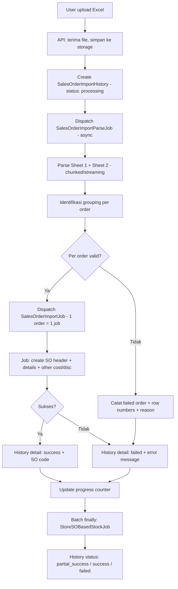

# [Improvement] Sales Order General Import — Bulk Handling (≥5.000 Row)

**Modul:** OmniChannel — Sales Order General Import  
**Tipe:** Improvement / Technical Debt  
**Prioritas:** High  
**Audience:** Developer, QA, PM, Operations

---

## Summary

Improve fitur **Import Sales Order General (Internal)** agar sistem dapat menangani upload file berisi **minimal 5.000 baris data** dalam satu sesi import, dengan pemrosesan per-order yang andal, pelaporan error yang jelas per baris Excel asli user, serta kemampuan **export ulang order yang gagal** dalam format template import yang siap di-re-import.

Saat ini, import ~2.000 baris mengalami **stuck tanpa progress** di UI dan **tidak ada informasi kegagalan di Horizon**. Status import sebelumnya baru ter-update menjadi `failed` setelah user meng-upload ulang file yang lebih kecil (~1.000 baris).

---

## Problem Statement (As-Is)

### Gejala yang dilaporkan

| # | Gejala | Dampak ke user |
|---|--------|----------------|
| 1 | Import file ~2.000 baris → UI **stuck**, progress **0%** | User tidak tahu apakah proses jalan atau gagal |
| 2 | Horizon **tidak menampilkan** job/batch gagal untuk sesi tersebut | Sulit debug; tim infra/dev tidak punya sinyal kegagalan |
| 3 | Import history sesi sebelumnya baru berubah `failed` **setelah** user upload ulang file 1.000 baris | Status misleading; user mengira import pertama masih jalan |
| 4 | Tidak ada cara export order gagal untuk perbaikan & re-import | User harus manual copas dari file asli |

### Akar masalah teknis (hasil analisis codebase)

| Area | Perilaku saat ini | Risiko pada data besar |
|------|-------------------|------------------------|
| **Parsing & validasi Sheet 1** | Seluruh baris Excel diproses **sinkron** di HTTP request (`SalesOrderImportSheet1::collection`) sebelum batch job di-dispatch | Timeout PHP/Octane, memory exhaustion, request mati sebelum job masuk queue |
| **Dispatch batch** | Batch `SalesOrderImportJob` baru jalan setelah parsing selesai | Jika request mati di tengah → **tidak ada job di Horizon**, progress tetap 0% |
| **Stale batch cleanup** | Upload baru menghapus batch lama & mark history `processing` → `failed` | Menjelaskan gejala #3: history lama baru failed saat upload baru |
| **Granularitas gagal** | `ImportSoLog` per baris, tapi `SalesOrderImportHistoryDetail` per **SKU** — bukan per **order/group** | Sulit memahami "1 order gagal" vs "1 baris gagal" |
| **All-or-nothing pada beberapa error** | Error validasi struktur / `max_child` dapat fail seluruh sesi import | Order valid ikut terblokir |
| **Export failed** | **Belum ada** endpoint/UI export order gagal | User tidak bisa re-import cepat |

### Kapasitas & rules yang tetap berlaku

| Rule | Nilai | Sumber |
|------|-------|--------|
| Max detail per order | **100 SKU/barisan** | `limitDetail = 100` di import + `config('general.max_child') = 100` |
| Format file | `.xlsx`, `.xls` | `SalesOrderController@uploadExcel` |
| Grouping 1 order | Customer + Store + Transaction Date + Platform Order ID + Shipper + Tracking | `SalesOrderImportSheet1` |
| SO hasil import sukses | `transaction_status = open`, `is_import = 1` | Existing behavior |
| Validasi bisnis | Semua validasi existing (customer, store General/Other, SKU, unit, fiscal period, uniqueness, dll.) | **Tidak boleh dilonggarkan** |

---

## Goals

| # | Goal |
|---|------|
| G1 | Sistem mampu memproses **≥5.000 baris** (row data, excl. header) dalam **1 file upload** tanpa stuck |
| G2 | Setiap **order (group)** = **1 job** terpisah di queue — rapi di Horizon & bisa di-monitor |
| G3 | Order yang melanggar rules → **1 order = 1 failed count**; order valid **tetap diproses** (partial success) |
| G4 | UI/API menampilkan daftar gagal dengan **nomor baris Excel asli** (row upload user) |
| G5 | Setiap kegagalan menyertakan **pesan error yang jelas** (why failed) |
| G6 | Order gagal dapat **di-export** ke file Excel format **identik template import** → user perbaiki & re-import langsung |

---

## Scope

### In Scope

- Import bulk header Sheet 1 + Sheet 2 (Sales Order General) di menu:
  - **Dev - Sales Order** (`/businessdevelopment/sales-order-general`)
  - **All Sales Order** (`/businessdevelopment/all-sales-order`)
- Backend: parsing, validation, job orchestration, history, log, progress, export failed
- Frontend: progress UX, import history, failed list, export failed button
- Horizon observability (batch name, tags, failed job visibility)

### Out of Scope

- Import detail per SO (`sales-order-detail/upload`) — tidak termasuk improvement ini kecuali disebutkan sebagai fast-follow
- Import Sales Order Platform / marketplace sync
- Perubahan rules bisnis (max 100 detail/order, validasi customer/store/SKU, dll.)
- Perubahan template kolom Sheet 1 & Sheet 2

---

## Proposed Solution (To-Be)

### Arsitektur pemrosesan baru

### Prinsip desain

1. **HTTP request cepat** — upload hanya simpan file + buat history + dispatch parse job; tidak parse 5.000 baris di request thread.
2. **1 order = 1 job** — `SalesOrderImportJob` sudah ada konsep per-group; distandarkan & diperkuat dengan metadata order (group key, first row, row list).
3. **Partial success** — kegagalan 1 order **tidak** menghentikan order lain dalam sesi yang sama.
4. **Validasi per order di parse phase** — termasuk rule **>100 detail = order gagal** (seluruh order, bukan hanya baris ke-101+).
5. **Row number = baris Excel asli user** — simpan `row_number` per baris saat parsing (header row = 1, data mulai row 2).

---

## Functional Requirements

### FR-1 — Kapasitas & performa

| ID | Requirement | Acceptance Criteria |
|----|-------------|---------------------|
| FR-1.1 | Sistem harus menerima file dengan **≥5.000 baris data** (excl. header Sheet 1) | Upload file test 5.000 baris tidak timeout di UI; history status bergerak dari `processing` |
| FR-1.2 | Parsing & validasi awal harus berjalan **async** (bukan blocking HTTP) | Setelah upload, API response < 10 detik; parse job terlihat di Horizon |
| FR-1.3 | Progress bar UI harus update secara berkala selama proses | Progress > 0% dalam 60 detik setelah upload untuk file 5.000 baris (dengan queue normal) |
| FR-1.4 | Jika proses gagal total (file corrupt, template salah), history **segera** `failed` dengan pesan jelas | Tidak perlu upload ulang untuk "membangunkan" status failed |

### FR-2 — Grouping & job per order

| ID | Requirement | Acceptance Criteria |
|----|-------------|---------------------|
| FR-2.1 | Sistem mengidentifikasi grouping order menggunakan key existing: `Customer + Store + Transaction Date + Platform Order ID + Shipper Service Code + Tracking Number` | Order dengan key sama → 1 job; key beda → job terpisah |
| FR-2.2 | **1 order = 1 `SalesOrderImportJob`** di Laravel batch | Horizon menampilkan N job untuk N order; batch name tetap `so_general_import` (atau versi baru dengan version suffix) |
| FR-2.3 | Sheet 2 (Other Cost/Discount) di-attach ke job order berdasarkan `Platform Order ID` | OC/OD hanya applied ke order yang match; mismatch → order gagal dengan alasan jelas |

### FR-3 — Validasi per order & partial failure

| ID | Requirement | Acceptance Criteria |
|----|-------------|---------------------|
| FR-3.1 | Jika 1 order memiliki **>100 baris detail (SKU)**, **seluruh order dianggap gagal** | Tidak ada SO terbuat untuk order tersebut; counter `total_so_failed` +1 |
| FR-3.2 | Pesan error order >100 detail: menyebutkan jumlah detail & row range (contoh: "Order at rows 2-103 has 102 detail lines. Maximum is 100.") | QA verifikasi pesan di log & history |
| FR-3.3 | Order yang valid **tetap diproses** meskipun ada order lain gagal di sesi yang sama | File test: 10 order, 2 invalid → 8 SO terbuat, status history = `partial_success` |
| FR-3.4 | Semua validasi existing per baris **tetap berlaku** (customer, store General/Other, SKU, unit, fiscal period, uniqueness Platform Order ID & Tracking, formula Excel, dll.) | Regression test validasi tidak berubah |
| FR-3.4a | Jika 1 baris dalam order invalid (mis. SKU tidak ada) → **seluruh order gagal** (atomic per order) | Tidak ada SO partial dengan sebagian detail; rollback order tersebut |

> **Catatan desain:** Gagal di level **order** (bukan per-baris partial) menjaga konsistensi data — 1 SO tidak boleh terbuat dengan detail setengah.

### FR-4 — Pelaporan error & row number

| ID | Requirement | Acceptance Criteria |
|----|-------------|---------------------|
| FR-4.1 | Setiap kegagalan order mencatat **nomor baris Excel** dari file user | Minimal `first_row_number`; idealnya `row_numbers[]` semua baris order |
| FR-4.2 | Import log menampilkan: `row_number`, `sheet_name`, `message`, `group_key` atau `platform_order_id` | API `import-log` & UI log slideover |
| FR-4.3 | Import history summary menampilkan: `total_row`, `total_so_success`, `total_so_failed`, `count_row_success`, `count_row_failed` | Kolom baru `total_so_failed` jika belum ada |
| FR-4.4 | Status history baru: `partial_success` bila ada SO sukses & ada SO gagal | UI menampilkan label "Partial Success" |
| FR-4.5 | Import history detail per sesi: list per **order** (bukan hanya per SKU) dengan status, SO code (jika sukses), error message (jika gagal), row range | Klik dari history → modal detail order-level |

### FR-5 — Export order gagal (re-importable)

| ID | Requirement | Acceptance Criteria |
|----|-------------|---------------------|
| FR-5.1 | Tersedia aksi **Export Failed Orders** per sesi import history | Tombol di import history / detail modal |
| FR-5.2 | Format export = **identik template import** (Sheet 1 + Sheet 2 structure) | Header kolom exact match template existing |
| FR-5.3 | Sheet 1 berisi **hanya baris** dari order yang gagal (semua detail row order tersebut) | User bisa langsung upload ulang file export tanpa edit struktur |
| FR-5.4 | Sheet 2 berisi other cost/discount untuk order gagal yang punya data Sheet 2 | Konsisten dengan file asli |
| FR-5.5 | Nama file export: `Import_SO_Failed_{history_code}_{timestamp}.xlsx` | Download via API |
| FR-5.6 | Endpoint baru (proposal): `GET omnichannel/sales-order/import-history/{historyId}/export-failed` | Authorized, scoped per company |

### FR-6 — Observability & reliability

| ID | Requirement | Acceptance Criteria |
|----|-------------|---------------------|
| FR-6.1 | Setiap job di Horizon punya **tag**: `so-import`, `history_id`, `company_id` | Memudahkan filter & debug |
| FR-6.2 | Jika parse job / import job gagal (exception), history **tidak** stuck `processing` selamanya | Timeout guard: auto-fail history setelah X jam + pesan |
| FR-6.3 | Upload baru **tidak** silently fail history lama tanpa audit | Jika cleanup batch stale: log reason; history lama → `failed` dengan message "Superseded by new import" atau `cancelled` |
| FR-6.4 | Progress API mengembalikan: `percent`, `total_orders`, `processed_orders`, `success_orders`, `failed_orders`, `status` | Frontend polling `GET .../progress` |

---

## Non-Functional Requirements

| ID | Requirement | Target |
|----|-------------|--------|
| NFR-1 | Throughput | 5.000 baris / ~50-500 order (tergantung grouping) selesai dalam waktu wajar (< 30 menit di staging dengan queue normal) |
| NFR-2 | Memory | Parse job tidak load seluruh collection ke memory sekaligus; gunakan chunked read (Laravel Excel `OnRow` / chunk) |
| NFR-3 | Idempotency | Re-upload file yang sama menghasilkan history baru; tidak corrupt history lama |
| NFR-4 | Concurrency | 1 active import batch per company per type (existing behavior boleh dipertahankan dengan UX blocking yang jelas) |
| NFR-5 | Backward compatible | Template Excel & validasi existing tidak berubah untuk user |

---

## Data Model Changes (Proposal)

### `omni_sales_order_import_histories` — kolom tambahan

| Kolom | Tipe | Keterangan |
|-------|------|------------|
| `total_so_failed` | integer, default 0 | Jumlah order gagal |
| `total_order` | integer, default 0 | Total order teridentifikasi dari file |
| `processed_order` | integer, default 0 | Order yang sudah selesai diproses |
| `parse_status` | string | `pending`, `parsing`, `parsed`, `failed` |
| `failed_file_path` | string, nullable | Path file export failed (optional, atau generate on-demand) |
| `failure_reason` | text, nullable | Pesan jika gagal total (template invalid, dll.) |

### `omni_sales_order_import_history_details` — refactor ke order-level

| Kolom | Tipe | Keterangan |
|-------|------|------------|
| `group_key` | string, nullable | Key grouping order |
| `platform_order_id` | string, nullable | Referensi order |
| `first_row_number` | integer | Baris Excel pertama order ini |
| `last_row_number` | integer | Baris Excel terakhir order ini |
| `row_numbers` | json, nullable | Array semua row number |
| `detail_count` | integer | Jumlah baris detail |
| `error_message` | text, nullable | Alasan gagal |
| `sheet2_data` | json, nullable | Other cost/discount untuk export failed |

> Alternatif: buat tabel baru `omni_sales_order_import_history_orders` agar tidak break struktur detail SKU existing. Pilih salah satu saat implementasi — **order-level tracking wajib ada**.

### `omni_sales_order_import_logs` (ImportSoLog) — enrichment

| Kolom | Tipe | Keterangan |
|-------|------|------------|
| `history_id` | FK, nullable | Link ke import history |
| `group_key` | string, nullable | Group order |
| `order_index` | integer, nullable | Urutan order dalam sesi |

---

## API Changes (Proposal)

| Method | Path | Keterangan |
|--------|------|------------|
| `POST` | `omnichannel/sales-order/upload` | Response langsung setelah file disimpan + parse job dispatched (tidak tunggu parse selesai) |
| `GET` | `omnichannel/sales-order/progress` | Extended: order counters + percent |
| `GET` | `omnichannel/sales-order/import-history` | Tambah kolom `total_so_failed`, status `partial_success` |
| `GET` | `omnichannel/sales-order/import-history/{id}/orders` | **Baru** — list per order (success/failed, rows, error) |
| `GET` | `omnichannel/sales-order/import-history/{id}/export-failed` | **Baru** — download Excel re-importable |
| `GET` | `omnichannel/sales-order/import-log` | Filter by `history_id`; include order-level errors |

---

## UI Changes (Proposal)

| Area | Perubahan |
|------|-----------|
| Import progress panel | Tampilkan: % progress, `processed_orders / total_orders`, success/failed count |
| Import history datalist | Kolom: Total SO Success, **Total SO Failed**, status Partial Success |
| Import history detail | Tab/view **per order**: row range, error message, SO code |
| Export button | **Export Failed Orders** — enabled jika `total_so_failed > 0` |
| Stuck state | Jika processing > N menit tanpa progress → warning + link ke log |

---

## Validation Rules (Tetap + Per Order)

### Validasi file-level (gagal seluruh sesi)

- Format file bukan `.xlsx` / `.xls`
- Header Sheet 1 tidak match template
- File kosong (hanya header)
- Sheet 1 tidak bisa dibaca (corrupt)

### Validasi order-level (gagal 1 order, order lain lanjut)

| Rule | Error message (contoh) |
|------|------------------------|
| Detail > 100 baris | `Order at rows {first}-{last} has {n} detail lines. Maximum is 100 per order.` |
| Customer invalid/inactive | `Row {n}: Invalid value in 'Customer' field...` |
| Store bukan General/Other | `Row {n}: Store {name} is not a 'General/Other' type store` |
| SKU tidak ditemukan | `Row {n}: Product SKU {sku} not found` |
| Unit invalid | `Row {n}: Unit {code} not valid` |
| Platform Order ID duplikat (sistem) | `Row {n}: Platform Order ID has already been taken` |
| Tracking Number duplikat | `Row {n}: Tracking Number has already been taken` |
| Platform Order ID inkonsisten antar baris | `Row {n}: Platform Order ID already used in another header (first seen at row {m})` |
| Transaction Date invalid / fiscal period | `Row {n}: Transaction Date format must be DD-MM-YYYY` / fiscal message |
| Formula Excel di cell | `Row {n}: {column} contains an Excel formula...` |
| Sheet 2: Platform Order ID tidak ada di Sheet 1 | `Row {n}: Platform Order ID [{id}] does not exist in Sheet 1` |
| Sheet 2: OC/OD code invalid/inactive | Sesuai pesan existing |
| Job create SO/detail gagal (runtime) | `{API error message dari controller}` |

---

## Test Scenarios (QA)

### TS-1 — Volume

| # | Skenario | Expected |
|---|----------|----------|
| 1 | Upload 5.000 baris, 50 order (100 baris/order) | Partial atau success; tidak stuck; Horizon show 50 jobs |
| 2 | Upload 5.000 baris, 500 order (10 baris/order) | 500 jobs; progress update; selesai dalam SLA |
| 3 | Upload 1.000 baris setelah 5.000 stuck (regression) | History lama tidak silent-fail tanpa pesan |

### TS-2 — Rule max 100 detail

| # | Skenario | Expected |
|---|----------|----------|
| 4 | 1 order dengan 101 baris SKU | Order gagal; 0 SO terbuat untuk order itu; error sebut row 2-102 |
| 5 | File: order A (101 baris, gagal) + order B (5 baris, valid) | Order B sukses; status `partial_success`; `total_so_failed=1`, `total_so_success=1` |

### TS-3 — Error reporting

| # | Skenario | Expected |
|---|----------|----------|
| 6 | SKU invalid di row 150 | Order containing row 150 gagal; log show row 150 |
| 7 | 3 order gagal dengan alasan berbeda | Masing-masing punya error message berbeda di history detail |

### TS-4 — Export failed

| # | Skenario | Expected |
|---|----------|----------|
| 8 | Export failed dari sesi partial_success | File Excel dengan Sheet 1+2; hanya order gagal |
| 9 | Perbaiki SKU di export → re-import | Order yang diperbaiki sukses |
| 10 | Header kolom export = template import | Tidak ada "unknown header" saat re-import |

### TS-5 — Observability

| # | Skenario | Expected |
|---|----------|----------|
| 11 | Kill parse job di tengah | History → failed dengan pesan; tidak stuck processing selamanya |
| 12 | Cek Horizon | Batch + jobs visible dengan tags |

---

## Implementation Notes (Developer)

### File terdampak (estimasi)

**Backend:**
- `Modules/OmniChannel/Import/SalesOrderImport.php`
- `Modules/OmniChannel/Import/SalesOrderImportSheet1.php`
- `Modules/OmniChannel/Import/SalesOrderImportSheet2.php`
- `Modules/OmniChannel/Jobs/SalesOrderImportJob.php`
- **Baru:** `SalesOrderImportParseJob.php`
- `Modules/OmniChannel/Http/Controllers/SalesOrderController.php` (upload, progress, export-failed)
- **Baru:** `SalesOrderImportFailedExport.php`
- Migration: history + order-level detail
- Entities: `SalesOrderImportHistory`, `SalesOrderImportHistoryDetail` atau model baru

**Frontend:**
- `SalesOrderGeneral/DataList.vue`
- `BusinessDevelopment/Report/AllSalesOrder/DataList.vue`
- `src/utils/imports.ts` (kolom history, export action)
- `ImportFileTable.vue` (progress extended)

### Rekomendasi teknis

1. **Pindahkan parsing ke queue** — pattern mirip `SettlementUpload` atau `SkipWaveProcessImport` yang sudah chunk-aware.
2. **Gunakan `Maatwebsite\Excel` chunk reading** (`WithChunkReading`, `OnRow`) untuk Sheet 1.
3. **Pisahkan fase validate vs persist** — validate order metadata di parse job; persist di `SalesOrderImportJob`.
4. **Batch per sesi** — satu `Bus::batch` berisi semua order jobs; `finally` trigger `StoreSOBasedStockJob`.
5. **Simpan raw row data** untuk order gagal (json/blob) agar export failed tidak perlu re-parse file original.
6. **Hapus double-dispatch** — saat ini batch di-dispatch di Sheet1 **dan** `AfterImport`; risiko race/duplikasi.

---

## Definition of Done

- [ ] Upload 5.000 baris berhasil diproses (staging) tanpa stuck progress
- [ ] 1 order = 1 job di Horizon
- [ ] Partial success berfungsi; status `partial_success` di UI
- [ ] Order >100 detail → failed dengan row number jelas
- [ ] Import log & history detail menampilkan error per order + row
- [ ] Export failed → file re-importable (Sheet 1 + 2)
- [ ] History tidak stuck `processing` tanpa alasan
- [ ] Unit/feature test untuk: grouping, max 100 rule, partial success, export format
- [ ] QA sign-off pada test scenarios TS-1 s/d TS-5
- [ ] Dokumentasi `sales-order-general-requirement.md` di-update (section import)

---

## Open Questions

| # | Pertanyaan | Default proposal jika tidak dijawab |
|---|-----------|-------------------------------------|
| OQ-1 | Apakah 1 baris invalid dalam order → seluruh order gagal, atau hanya baris itu? | **Seluruh order gagal** (atomic) |
| OQ-2 | Max order per file (bukan max row)? | Tidak dibatasi eksplisit; 5.000 row / ~10 row per order = ~500 jobs |
| OQ-3 | Status `partial_success` atau tetap `failed` jika ada 1 order gagal? | **`partial_success`** baru jika ada yang sukses |
| OQ-4 | Simpan file original di storage berapa lama? | 30 hari (untuk audit & re-export fallback) |
| OQ-5 | Concurrent import per company — boleh atau block? | **Block** (1 active per company) dengan pesan UX jelas |

---

## References

- Requirement existing: `docs/qa-docs/sales-order-general-requirement.md` (Section 4 — Import)
- Import code: `Modules/OmniChannel/Import/SalesOrderImportSheet1.php`
- Config: `config/general.php` → `max_child = 100`
- UI import: `olshoperp-frontend/src/pages/BusinessDevelopment/SalesOrderGeneral/DataList.vue`
