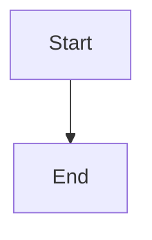
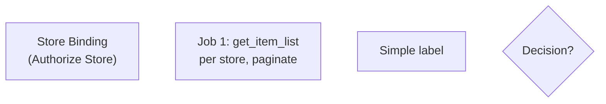
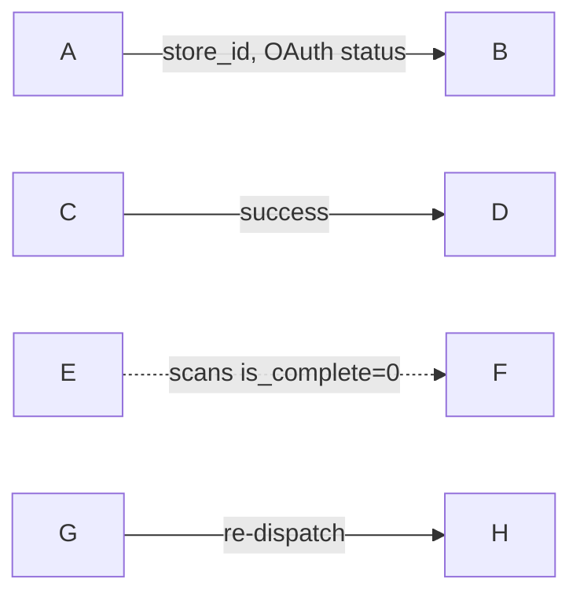
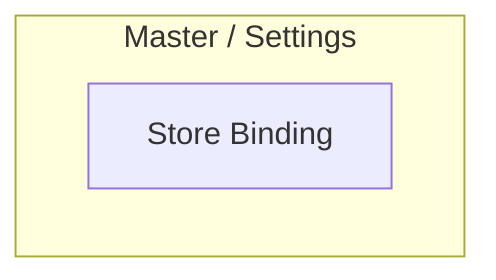
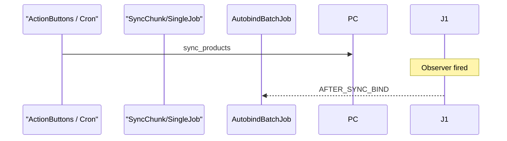
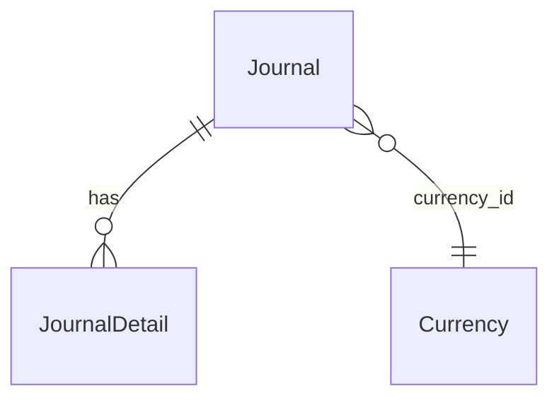
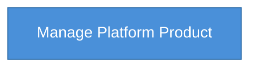
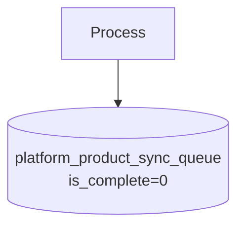

# Mermaid Style Guide — OlshopERP QA Docs

**Versi:** 1.0  
**Tanggal:** 2026-06-19  
**Renderer:** `mermaid@^11.15.0` (OlshopERP Help panel)  
**Target:** Semua file di `docs/qa-docs/{menu-slug}/` dan `docs/api/` yang memakai diagram.

---

## 1. Fence & struktur dasar

```markdown

```

| Aturan | Detail |
|--------|--------|
| Pembuka | Baris sendiri: ` ```mermaid ` (tanpa indent) |
| Penutup | ` ``` ` di baris sendiri |
| Satu diagram | Satu fence = satu diagram |
| Baris pertama | Wajib tipe diagram: `flowchart TD`, `sequenceDiagram`, `erDiagram`, dll. |

**Jangan** taruh diagram di YAML frontmatter atau nested di dalam fence code lain.

---

## 2. Jenis diagram yang didukung

| Jenis | Perintah | Dipakai untuk |
|-------|----------|---------------|
| Flowchart | `flowchart TD` / `LR` / `TB` | Alur proses, relasi menu, arsitektur |
| Sequence | `sequenceDiagram` | Interaksi API/job antar komponen |
| ER | `erDiagram` | Relasi entitas database |

Hindari `classDiagram`, `gantt`, `pie` kecuali sudah diverifikasi render di Help panel.

---

## 3. Label node (flowchart)

### ✅ Benar



### ❌ Hindari

| Pola | Masalah | Ganti dengan |
|------|---------|--------------|
| `<br/>` di label | Tidak konsisten di renderer | `\n` di dalam `["..."]` |
| `→` `←` di label | Unicode arrow rawan parse | `to` / `\nto` atau pisah node |
| Label panjang tanpa kutip | Koma/special char memecah parser | `["teks dengan, koma"]` |
| `()` di node ID | Ambigu | ID singkat `A`, `B`; teks di label |

---

## 4. Edge (panah) & label

### ✅ Benar



### ❌ Hindari

| Pola | Masalah |
|------|---------|
| `\|store_id, OAuth\|` tanpa kutip | Koma memecah label |
| `-.scans is_complete=0.->` | Format dotted label deprecated/rapuh |
| `&#123;id&#125;` HTML entity | Pakai `{id}` dalam label berkutip |
| `OUT & INV` sebagai satu target kompleks | Pisah: dua edge dari node yang sama |

**Format dotted aman:** `A -.->|"label text"| B`

---

## 5. Subgraph



- Judul subgraph **selalu berkutip** jika ada spasi, `/`, atau `-`
- Hindari em dash `—` di judul; pakai hyphen `-` (contoh: `Supply Chain - Fulfillment`)

---

## 6. Sequence diagram



| Aturan | Detail |
|--------|--------|
| Alias dengan `/` atau spasi | Wajib kutip: `as "ActionButtons / Cron"` |
| Participant harus dideklarasikan | Semua target arrow harus ada `participant` |
| Message text | Hindari karakter `<>` mentah jika tidak perlu |

---

## 7. ER diagram



- Nama relasi dengan spasi/underscore: **berkutip**
- Nama entity tanpa spasi (PascalCase atau snake_case)

---

## 8. Styling custom (`classDef`)



| Aturan | Detail |
|--------|--------|
| Warna | **Hex only** (`#4a90d9`) — jangan `oklch()`, `var(--*)`, atau rgb dari CSS Tailwind |
| classDef | Satu baris, koma sebagai pemisah properti |
| Makna diagram | classDef hanya styling; jangan ubah struktur flow untuk warna |

---

## 9. Database / cylinder node



Gunakan `[("label")]` untuk tabel/queue; label multi-baris pakai `\n` dalam kutip.

---

## 10. Contoh standar (copy-paste)

### Relasi menu (flowchart TB + subgraph)

Lihat: `manage-platform-product/requirement.md` §7 Diagram Relasi.

### Arsitektur komponen

Lihat: `manage-platform-product/technical.md` §1 Architecture Overview.

### Pipeline async (flowchart TD)

Lihat: `manage-platform-product/technical.md` §8.2 Flow Diagram Shopee.

### Siklus bisnis (flowchart LR + subgraph)

Lihat: `sales-order-general/requirement.md` §2.1.

### Entity relationship

Lihat: `general-ledger/requirement.md` §4.1.

---

## 11. Checklist sebelum commit

- [ ] Fence `mermaid` level 0
- [ ] Tidak ada `<br/>` — pakai `\n`
- [ ] Edge label dengan koma/spasi → berkutip `|"..."|`
- [ ] Tidak ada `→` di label — pakai teks ASCII
- [ ] classDef pakai hex
- [ ] Buka Help panel di app → diagram tampil (bukan teks mentah / error merah)
- [ ] File tetap readable di GitHub/editor tanpa renderer

---

## 12. File referensi yang sudah distandarisasi

| File | Diagram |
|------|---------|
| `manage-platform-product/requirement.md` | 1 flowchart relasi |
| `manage-platform-product/technical.md` | 4 (architecture, sequence, 2x sync flow) |
| `sales-order-general/requirement.md` | 3 flowchart |
| `sales-order-general/technical.md` | 2 flowchart |
| `general-ledger/requirement.md` | 1 erDiagram |
| `docs/api/omni_channel/webhook-shopee.md` | 1 flowchart |

**Catatan:** `docs/qa-docs/_legacy/` adalah referensi historis — **jangan** jadikan template; perbaiki hanya jika masih dipakai aktif.

---

## 13. Troubleshooting render di app

| Gejala | Penyebab umum | Fix |
|--------|---------------|-----|
| Teks ` ```mermaid ` mentah | Markdown tidak ter-parse | Cek API `content_html`; refresh Help |
| Error merah "Unsupported color format" | Bukan dari file .md — tema Tailwind oklch | classDef harus hex; tema app sudah diisolasi |
| Diagram kosong sebagian | Syntax edge/node invalid | Cek koma di label, `<br/>`, dotted arrow |
| sequenceDiagram error | Participant tidak dideklarasikan | Tambah `participant` |

Renderer: `MarkdownContent` → `useMermaidRender` → `mermaid.render()` per blok.
