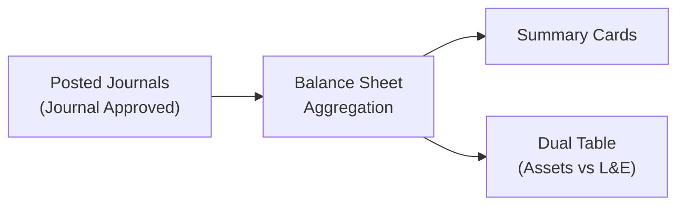
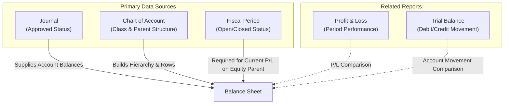

### 📦 Module/Feature: Balance Sheet

**Business definition:**
**Balance Sheet** is a read-only financial reporting module that shows the company’s financial position at a single point in time (**As at**). It presents cumulative information for **Assets**, **Liabilities**, and **Equity**.

### 🔑 Key Terms

| Term | Definition / Functional Meaning |
| :---- | :---- |
| **As at** | Cut-off date for the balance sheet. Unlike Profit & Loss (which uses a date range), **As at** locks balances to one specific date. |
| **Apply** | Executes refresh of summary cards and tables for the selected **As at** date. |
| **Ending Balance** | Column label for cumulative account balances up to the cut-off date. |
| **Current Profit/Loss** | Running profit/loss computed in real time that increases or decreases **Total Equity**. |
| **Parent Account** | Parent account in the **Chart of Account (COA)** hierarchy; value is aggregated from all child accounts. Shown bold with indentation. |
| **Liabilities and Equity** | Right side of the balance sheet combining total liabilities and total equity. |
| **Dual Table** | Side-by-side layout: left table for **Assets**, right table for **Liabilities and Equity**. |
| **Fiscal Period** | Active accounting period that must be **Open** so **Current Profit/Loss** on the Equity parent row can calculate accurately. |

### 📌 When & Why to Use

* **Financial position review** — monthly or yearly balance sheet for total assets, liabilities, and equity on a given date.
* **Balance equation check** — verify *Total Assets ≈ Total Liabilities + Total Equity*.
* **Running P/L monitoring** — see how **Current Profit/Loss** affects **Total Equity** before fiscal closing.
* **Date comparison** — compare financial position across different cut-off dates.

### 📋 System Prerequisites

* **Active Chart of Account (COA)** — accounts classified as **Assets**, **Liabilities**, and **Equity** configured. Revenue, Expense, and COGS do not appear as ordinary balance-sheet lines.
* **Structured COA hierarchy** — Parent–Child links set correctly so parent balances aggregate accurately.
* **Current Profit/Loss mapping** — running P/L account mapping recorded in Company Accounting configuration.
* **Approved journals** — only **Approved** journals feed ordinary account balances. Draft, Open, or Rejected are ignored.
* **Access privilege** — user must have *viewAny* for **Balance Sheet**.
* **Open Fiscal Period** — Fiscal Period must be **Open** and cover the **As at** date so the Equity-parent **Current Profit/Loss** path is valid (not zero).

### 📍 Position in the Business Flow

**Balance Sheet** aggregates approved journal data and presents it automatically without changing data state.

**Step notes:**

> 1. **Journal Approved** — financial transactions are entered and approved in Journal.
> 2. **Aggregation** — the system reads cumulative journal balances read-only for the **As at** filter.
> 3. **Presentation** — output appears simultaneously on Summary Cards and Dual Table.

**Fallback text:**

> 1. Daily transactions are recorded and approved in **Journal** (**Approved** status).
> 2. **Balance Sheet** reads cumulative COA balances up to the **As at** date.
> 3. The system calculates and shows **Summary Cards** and **Dual Table** (Assets left, Liabilities & Equity right).

### 📍 Menu Location

* **Navigation:** Finance & Accounting → Report → Balance Sheet
* **UI route:** `/accounting/balance-sheet`

🖼️ **[IMAGE PLACEHOLDER]** — Balance Sheet menu location in the Navigation Sidebar (Finance & Accounting > Report > Balance Sheet).  
🖼️ **[IMAGE PLACEHOLDER]** — Filter Bar: **As at** date field and **Apply** button.

### ⚙️ How to Use

> 1. Open **Balance Sheet**. By default, the system loads data for today’s date.
> 2. In the Filter Bar, set the desired **As at** date.
> 3. Click **Apply**.
>
> **Note:** Changing **As at** without clicking **Apply** does not refresh the screen.
>
> 4. Review **Summary Cards** (*Total Assets*, *Total L&E*, and *Current Profit/Loss*).
> 5. Compare detail on the **Left Table (Assets)** and **Right Table (Liabilities and Equity)**.

### 📊 Reading Summary Cards

🖼️ **[IMAGE PLACEHOLDER]** — Summary Cards (Total Assets, Total Liabilities & Equity, and Current Profit/Loss).

* **Total Assets:** cumulative balance of all Assets-class accounts.  
  `Total Assets = Σ Assets Account Balances`
* **Total Liabilities:** absolute value of cumulative Liabilities balances.  
  `Total Liabilities = |Σ Liabilities Account Balances|`
* **Current Profit/Loss:** running P/L from *Ending Profit/Loss* (signed: positive (+) increases Equity, negative (−) decreases Equity).
* **Total Equity:** absolute Equity balances plus Current Profit/Loss.  
  `Total Equity = |Σ Equity Account Balances| + Current Profit/Loss`
* **Total Liabilities & Equity:** combined liabilities and equity.  
  `Total Liabilities & Equity = Total Liabilities + Total Equity`

**Example figures:**

* Total Assets: Rp 500,000,000
* Total Liabilities: Rp 200,000,000
* Equity accounts total: Rp 280,000,000
* Current Profit/Loss: +Rp 20,000,000
* **Then Total Equity:** Rp 280,000,000 + Rp 20,000,000 = Rp 300,000,000
* **Total L&E:** Rp 200,000,000 + Rp 300,000,000 = Rp 500,000,000 (*Balanced*)

### 📊 Reading the Dual Tables (Assets vs Liabilities and Equity)

🖼️ **[IMAGE PLACEHOLDER]** — Dual Table: parent–child hierarchy for Assets (left) and Liabilities & Equity (right).

* **Left table (Assets):** COA hierarchy for class **Assets**.
* **Right table (Liabilities and Equity):** COA hierarchy for **Liabilities**, then **Equity**.

**Visual rules:**

* **Parent accounts:** bold, with child accumulation underneath.
* **Child/Leaf accounts:** indented under their parent.

### 🧮 How Ending Balance Is Calculated

> 1. **Ordinary (Leaf/Child) accounts:** absolute cumulative balance of **Approved** journals with transaction date **before** **As at** (`< As at`).
> 2. **Parent accounts:** aggregation of absolute values of all child accounts underneath.
> 3. **Equity parent accounts:** absolute Equity balance plus the **Current Profit/Loss** path (requires **Fiscal Period Open**).

### 📈 Current Profit/Loss and Its Effect on Equity

* **Running profit (+):** increases **Total Equity**.
* **Running loss (−):** decreases **Total Equity**.

> ⚠️ **Warning:** **Current Profit/Loss** mapping must be configured in Company Accounting. Without mapping, running P/L will not connect into **Total Equity**.

### 📅 As-at Day Cut-off Nuance

Difference in date coverage between ordinary account balances and running P/L (AS-IS):

| Calculation Path | Date Coverage (D = As at) | Operational Impact |
| :---- | :---- | :---- |
| **Ordinary account balances** | Transactions **before** D (`< As at`) | **Approved** journals on the **As at** day itself are not yet in ordinary *Ending Balance*. |
| **Current Profit/Loss** | Transactions **through** D (`≤ As at`) | **Approved** journals on the **As at** day are already included in **Current Profit/Loss**. |

> **Note:** This cut-off difference is a characteristic of the two internal paths today — **not a bug**.

### 🔀 Two P/L Paths (Card vs Parent Row)

| Display Area | Helper / Path | Status Dependency |
| :---- | :---- | :---- |
| **Summary Card & P/L mapping row** | **Ending P/L** | Accumulates history (`≤ As at`). Does **not** require Fiscal Period Open. |
| **Equity Parent row (table)** | **Current P/L** | Requires **Fiscal Period** **Open** covering **As at**. If Closed or not covering that date, this row is **0**. |

### 📊 Field Reference

#### Filter Options

| Field / Control | Data Type | Description / Behavior | Constraints |
| :---- | :---- | :---- | :---- |
| **As at** | Date Picker | Report cut-off date (yyyy-MM-dd). | Default: today on first load. |
| **Apply** | Button | Reprocesses data for the **As at** date. | Must be clicked; empty date → no-op. |

#### Grid Columns (Both Tables)

| Column | Technical Alias | Data Type | Description |
| :---- | :---- | :---- | :---- |
| **CODE** | account_code | String | Numeric COA account code. |
| **NAME** | account_name | String | COA account name. Bold + indent for parents. |
| **ENDING BALANCE** | ending_balance | Currency | Cumulative balance per cut-off rules. |

### 🛡️ Business Rules & Validation

> **Hard Rules:**

* **Rule 1 (Menu access):** Without *viewAny* privilege, data access is denied (**403 Forbidden**).
* **Rule 2 (Filter execution):** **Apply** with empty **As at** → **no-op**.
* **Rule 3 (Journal integrity):** Draft, Open, or Rejected journals are **not** included in ordinary account balances.
* **Rule 4 (Balance check):** If **Total Assets** ≠ **Total Liabilities & Equity**, figures are **still shown** without blocking the screen.
* **Rule 5 (Fiscal period status):** If Fiscal Period for **As at** is Closed, running P/L on the Equity Parent table row = **0**, while the Summary Card still shows Ending P/L.

### 🛑 Current Limitations

> 1. **As-at day cut-off difference** — ordinary balances (`< As at`) vs Current P/L (`≤ As at`) may show a visual gap when transactions exist on that date. *(Pending Decision)*
> 2. **Fiscal Period dependency on Equity parent** — card P/L vs parent-row P/L can differ if Fiscal Period is not Open. *(Pending Decision)*
> 3. **Approved filter on P/L path** — P/L path reads from journal history. *(Pending Decision)*
> 4. **Absolute formatting inconsistency on cards** — Assets use raw balance; Liabilities and Equity use absolute values. *(Documented)*
> 5. **API date-format validation** — backend does not explicitly validate non-standard date formats. *(Developer note)*
> 6. **No Export** — by design no Excel/PDF export and no Search Builder. *(Documented)*

### 🔗 Related Menus

**Notes:**

> 1. **Journal** — supplies **Approved** transaction balances.
> 2. **Chart of Account** — parent/child account hierarchy.
> 3. **Fiscal Period** — validity of running P/L on Equity.
> 4. **Profit & Loss / Trial Balance** — companion reports for reconciliation.

| Menu | Role |
| :---- | :---- |
| **Journal** | Primary balance data source (**Approved** only). |
| **Chart of Account (COA)** | Code order, names, classification, Parent–Child hierarchy. |
| **Fiscal Period** | Controls running P/L on the Equity Parent row. |
| **Profit & Loss & Trial Balance** | Sibling comparison reports. |

### 🛠️ Troubleshooting

| Symptom | Likely Cause | Resolution |
| :---- | :---- | :---- |
| Figures do not change after changing **As at** | **Apply** not clicked | Click **Apply** after selecting the new date. |
| **Apply** does nothing | **As at** is empty | Select an **As at** date before **Apply**. |
| **Total Assets** ≠ **Total L&E** | Unapproved journals, missing P/L mapping, or cut-off-day transactions | 1. Check Journal status. 2. Check Company Accounting mapping. 3. Ensure Fiscal Period is Open. |
| Card **Current P/L** has a value, table P/L row is **0** | Fiscal Period Closed or not configured for **As at** | Open Fiscal Period for that date. |
| No download (Export) button | View-only by design | No export feature; use screenshots or companion reports. |

### ❓ FAQ

* **Q: What does As at do?**
  * **A:** It is the cut-off point for balance-sheet position. Unlike P&L (date range), Balance Sheet shows accumulation up to one specific date.
* **Q: Must I click Apply after choosing a date?**
  * **A:** Yes. Changing **As at** does not refresh data until **Apply** is clicked.
* **Q: Why don’t Total Assets equal Total Liabilities + Equity?**
  * **A:** Possible causes: unapproved journals, missing Current Profit/Loss mapping, Fiscal Period not Open, or transactions posted on the cut-off date.
* **Q: Can I download Excel/PDF?**
  * **A:** No. By design this module is view-only with no export.
* **Q: Do Draft journals count?**
  * **A:** No. Only **Approved** journals are included.
* **Q: How does Fiscal Period affect Balance Sheet?**
  * **A:** It must be **Open** for Current Profit/Loss on the Equity Parent table row. If closed, that row is 0.
* **Q: Main difference vs Profit & Loss?**
  * **A:** P&L measures performance (Revenue − Expenses) over a **time range**; Balance Sheet measures assets, liabilities, and equity at a **single date**.
* **Q: Difference vs Trial Balance?**
  * **A:** Trial Balance shows all COA classes with debit/credit movement; Balance Sheet focuses on cumulative Assets, Liabilities, and Equity balances.

### 📚 See Also / References

* **Journal** — manage and verify journal approval.
* **Chart of Account** — account structure, hierarchy, and classification.
* **Profit & Loss** — revenue and expense performance by date range.
* **Fiscal Period** — open/close accounting periods.
* **Trial Balance** — debit/credit movement for all COA accounts.
