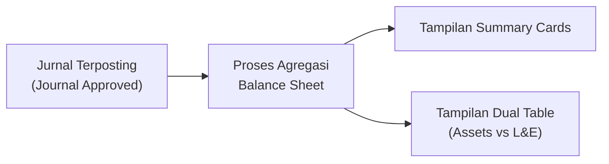
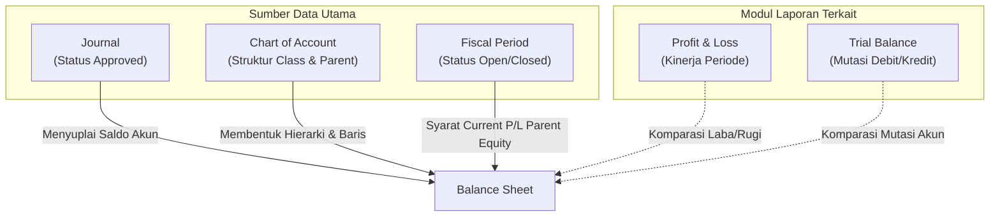

### 📦 Modul/Fitur: Balance Sheet (Laporan Neraca)

**Definisi Bisnis:**
**Balance Sheet** (Laporan Neraca) adalah modul pelaporan keuangan *read-only* yang menampilkan posisi keuangan perusahaan pada satu titik waktu tertentu (**As at**). Modul ini menyajikan informasi kumulatif mengenai Aset (**Assets**), Kewajiban/Utang (**Liabilities**), dan Modal/Ekuitas (**Equity**).

### 🔑 Istilah Kunci

| Istilah | Definisi / Arti Fungsional |
| :---- | :---- |
| **As at** | Tanggal patokan/cut-off neraca. Berbeda dari Profit & Loss yang menggunakan rentang periode, **As at** mengunci posisi saldo pada satu titik tanggal spesifik. |
| **Apply** | Tombol eksekusi untuk memperbarui data pada kartu ringkasan dan tabel berdasarkan tanggal **As at** yang dipilih. |
| **Ending Balance** | Label kolom saldo kumulatif akun pada tabel laporan hingga batas cut-off tanggal yang ditentukan. |
| **Current Profit/Loss** | Nilai laba/rugi berjalan yang dihitung secara *real-time* untuk menambah atau mengurangi **Total Equity** di neraca. |
| **Parent Akun** | Akun induk dalam hierarki **Chart of Account (COA)** yang nilainya merupakan hasil kalkulasi/agregasi dari seluruh akun anak (*child*). Tampil tebal (*bold*) dengan *indentation*. |
| **Liabilities and Equity** | Sisi kanan neraca yang menggabungkan total kewajiban/utang dan total modal/ekuitas perusahaan. |
| **Dual Table** | Tata letak tampilan berdampingan: tabel kiri khusus **Assets**, tabel kanan untuk **Liabilities and Equity**. |
| **Fiscal Period** | Periode akuntansi aktif yang statusnya harus **Open** agar nilai **Current Profit/Loss** pada baris parent Equity dapat dikalkulasi secara akurat. |

### 📌 Kapan & Kenapa Dipakai

* **Pemeriksaan posisi keuangan** — meninjau neraca bulanan atau tahunan untuk total aset, kewajiban, dan ekuitas pada tanggal tertentu.
* **Audit keseimbangan neraca** — memverifikasi persamaan dasar akuntansi (*Total Assets ≈ Total Liabilities + Total Equity*).
* **Pemantauan laba berjalan** — melihat akumulasi dampak **Current Profit/Loss** terhadap **Total Equity** sebelum tutup buku (*closing fiscal period*).
* **Analisis perbandingan tanggal** — membandingkan kondisi keuangan pada beberapa tanggal *cut-off* secara bergantian.

### 📋 Prasyarat Sistem

* **Chart of Account (COA) aktif** — akun berklasifikasi **Assets**, **Liabilities**, dan **Equity** sudah terkonfigurasi. Akun *Revenue*, *Expense*, dan *COGS* tidak muncul langsung sebagai baris akun biasa di neraca.
* **Hierarki COA terstruktur** — hubungan *Parent–Child* diset benar agar akumulasi saldo akun induk akurat.
* **Mapping Current Profit/Loss** — pemetaan akun laba/rugi berjalan sudah terekam pada konfigurasi *Company Accounting*.
* **Journal Approved** — hanya jurnal status **Approved** yang masuk kalkulasi saldo akun biasa. *Draft*, *Open*, atau *Rejected* diabaikan.
* **Hak akses (privilege)** — user harus punya akses *viewAny* untuk modul **Balance Sheet**.
* **Fiscal Period Open** — status **Fiscal Period** harus **Open** dan mencakup tanggal **As at** agar path **Current Profit/Loss** pada baris parent Equity valid (tidak nol).

### 📍 Posisi dalam Alur Bisnis

Proses **Balance Sheet** menerima agregasi data transaksi jurnal yang telah disetujui (*Approved*) dan menyajikannya secara otomatis tanpa mengubah *state* data.

**Keterangan langkah:**

> 1. **Journal Approved** — transaksi keuangan diinput dan disetujui pada modul Journal.
> 2. **Proses agregasi** — sistem membaca saldo kumulatif jurnal secara *read-only* berdasarkan filter **As at**.
> 3. **Penyajian data** — output ditampilkan secara simultan pada *Summary Cards* dan *Dual Table*.

**Fallback teks alur bisnis:**

> 1. Transaksi harian dicatat dan disetujui dalam modul **Journal** (status **Approved**).
> 2. Modul **Balance Sheet** membaca saldo kumulatif akun COA hingga tanggal **As at**.
> 3. Sistem mengkalkulasi dan menyajikan data pada **Kartu Ringkasan** dan **Dual Table** (Assets di kiri, Liabilities & Equity di kanan).

### 📍 Lokasi Menu

* **Navigasi:** Finance & Accounting → Report → Balance Sheet
* **Route UI:** `/accounting/balance-sheet`

🖼️ **[IMAGE PLACEHOLDER]** — Lokasi menu Balance Sheet pada Navigation Sidebar (Finance & Accounting > Report > Balance Sheet).  
🖼️ **[IMAGE PLACEHOLDER]** — Filter Bar: field tanggal **As at** dan tombol **Apply**.

### ⚙️ Cara Penggunaan

> 1. Buka menu **Balance Sheet**. Secara bawaan, sistem memuat data menggunakan tanggal hari ini (*today*).
> 2. Pada *Filter Bar*, tentukan tanggal **As at** yang diinginkan.
> 3. Klik tombol **Apply**.
>
> **Note:** Menentukan tanggal **As at** tanpa menekan **Apply** tidak akan memicu pembaruan data pada layar.
>
> 4. Tinjau angka pada **Kartu Ringkasan** (*Total Assets*, *Total L&E*, dan *Current Profit/Loss*).
> 5. Bandingkan detail nilai pada **Tabel Kiri (Assets)** dan **Tabel Kanan (Liabilities and Equity)**.

### 📊 Membaca Kartu Ringkasan

🖼️ **[IMAGE PLACEHOLDER]** — Kartu Ringkasan (Total Assets, Total Liabilities & Equity, dan Current Profit/Loss).

Kartu ringkasan memberikan gambaran agregat posisi keuangan:

* **Total Assets:** kumulatif saldo seluruh akun klasifikasi Assets.  
  `Total Assets = Σ Saldo Akun Assets`
* **Total Liabilities:** nilai mutlak dari kumulatif saldo akun Liabilities.  
  `Total Liabilities = |Σ Saldo Akun Liabilities|`
* **Current Profit/Loss:** laba/rugi berjalan dari kalkulasi *Ending Profit/Loss* (bertanda: positif (+) memperbesar Equity, negatif (−) memperkecil Equity).
* **Total Equity:** nilai mutlak akun Equity ditambah Current Profit/Loss.  
  `Total Equity = |Σ Saldo Akun Equity| + Current Profit/Loss`
* **Total Liabilities & Equity:** penggabungan total kewajiban dan total modal.  
  `Total Liabilities & Equity = Total Liabilities + Total Equity`

**Contoh angka:**

* Total Assets: Rp 500.000.000
* Total Liabilities: Rp 200.000.000
* Total Equity Akun: Rp 280.000.000
* Current Profit/Loss: +Rp 20.000.000
* **Maka Total Equity:** Rp 280.000.000 + Rp 20.000.000 = Rp 300.000.000
* **Total L&E:** Rp 200.000.000 + Rp 300.000.000 = Rp 500.000.000 (*Balanced*)

### 📊 Membaca Dua Tabel (Assets vs Liabilities and Equity)

🖼️ **[IMAGE PLACEHOLDER]** — Dual Table: hierarki parent-child pada Assets (kiri) dan Liabilities & Equity (kanan).

* **Tabel kiri (Assets):** hierarki COA class **Assets**.
* **Tabel kanan (Liabilities and Equity):** hierarki COA class **Liabilities**, disusul class **Equity**.

**Ketentuan visual:**

* **Akun induk (Parent):** ditebalkan (**bold**) dengan akumulasi sub-akun di bawahnya.
* **Akun anak (Child/Leaf):** ditampilkan dengan *indentation* di bawah parent-nya.

### 🧮 Cara Ending Balance Dihitung

> 1. **Akun biasa (Leaf/Child):** nilai mutlak (*absolute*) saldo kumulatif jurnal **Approved** dengan tanggal transaksi **sebelum** tanggal **As at** (`< As at`).
> 2. **Akun induk (Parent):** agregasi nilai mutlak seluruh akun anak di bawahnya.
> 3. **Akun induk Equity:** nilai mutlak saldo Equity ditambah path **Current Profit/Loss** (membutuhkan status **Fiscal Period Open**).

### 📈 Current Profit/Loss dan Dampaknya ke Equity

* **Laba berjalan (+):** menambah saldo modal pada **Total Equity**.
* **Rugi berjalan (−):** mengurangi saldo modal pada **Total Equity**.

> ⚠️ **Warning:** Mapping **Current Profit/Loss** harus dikonfigurasi di *Company Accounting*. Jika pemetaan belum ditentukan, laba/rugi berjalan tidak terhubung ke **Total Equity**.

### 📅 Nuansa Cut-off Hari As at

Perbedaan logika cakupan tanggal antara path akun biasa dan path laba/rugi berjalan (AS-IS):

| Path Perhitungan | Cakupan Tanggal (D = As at) | Dampak Operasional |
| :---- | :---- | :---- |
| **Saldo akun biasa** | Transaksi tanggal **sebelum** D (`< As at`) | Jurnal **Approved** tepat pada hari **As at** belum masuk *Ending Balance* akun biasa. |
| **Current Profit/Loss** | Transaksi tanggal **sampai dengan** D (`≤ As at`) | Jurnal **Approved** tepat pada hari **As at** sudah masuk **Current Profit/Loss**. |

> **Note:** Perbedaan *cut-off* ini karakteristik dua path internal saat ini — **bukan bug**.

### 🔀 Dua Path P/L (Kartu vs Baris Parent)

| Area Tampilan | Helper / Path | Syarat Dependensi Status |
| :---- | :---- | :---- |
| **Kartu Ringkasan & baris mapping P/L** | **Ending P/L** | Mengakumulasi riwayat transaksi (`≤ As at`). Tidak membutuhkan *Fiscal Period Open*. |
| **Baris Parent Equity (tabel)** | **Current P/L** | Membutuhkan **Fiscal Period** berstatus **Open** yang mencakup tanggal **As at**. Jika *Closed* atau tidak mencakup tanggal tersebut, baris ini bernilai **0**. |

### 📊 Referensi Field

#### Filter Options

| Nama Field / Control | Tipe Data | Deskripsi / Behavior | Batasan |
| :---- | :---- | :---- | :---- |
| **As at** | Date Picker | Tanggal patokan akhir laporan (yyyy-MM-dd). | Default: tanggal hari ini saat *first load*. |
| **Apply** | Button | Memproses ulang data berdasarkan tanggal **As at**. | Wajib diklik; jika tanggal kosong, tombol *no-op*. |

#### Grid Columns (Kedua Tabel)

| Nama Kolom | Technical Alias | Tipe Data | Deskripsi |
| :---- | :---- | :---- | :---- |
| **CODE** | account_code | String | Kode numerik akun COA. |
| **NAME** | account_name | String | Nama akun COA. Tampil *bold* + *indent* untuk parent. |
| **ENDING BALANCE** | ending_balance | Currency | Saldo kumulatif akun berdasarkan aturan cut-off. |

### 🛡️ Aturan Bisnis & Validasi

> **Hard Rules:**

* **Rule 1 (Akses menu):** Tanpa privilege *viewAny*, sistem menolak akses data (error **403 Forbidden**).
* **Rule 2 (Eksekusi filter):** **Apply** saat field **As at** kosong → sistem **tidak melakukan tindakan** (*no-op*).
* **Rule 3 (Integritas jurnal):** Jurnal *Draft*, *Open*, atau *Rejected* **tidak dihitung** ke saldo akun biasa.
* **Rule 4 (Pemeriksaan keseimbangan):** Jika **Total Assets** ≠ **Total Liabilities & Equity**, sistem **tetap menampilkan** angka tanpa memblokir layar.
* **Rule 5 (Status periode akuntansi):** Jika **Fiscal Period** pada tanggal **As at** *Closed*, nilai laba berjalan pada baris *Parent Equity* di tabel = **0**, sementara *Summary Card* tetap menampilkan *Ending P/L*.

### 🛑 Keterbatasan Saat Ini

> 1. **Perbedaan cut-off hari As at** — saldo akun biasa (`< As at`) vs *Current P/L* (`≤ As at`) berpotensi selisih visual jika ada transaksi di tanggal yang sama. *(Pending Decision)*
> 2. **Ketergantungan Fiscal Period pada Parent Equity** — nilai P/L di kartu vs baris parent tabel bisa beda jika Fiscal Period tidak *Open*. *(Pending Decision)*
> 3. **Filter Approved pada path P/L** — path P/L membaca riwayat dari *journal history*. *(Pending Decision)*
> 4. **Inkonsistensi formatisasi mutlak (Abs) pada kartu** — *Assets* dari saldo murni; *Liabilities* dan *Equity* dikonversi ke mutlak. *(Didokumentasikan)*
> 5. **Validasi format tanggal API** — backend belum memvalidasi eksplisit format tanggal non-standar. *(Catatan Pengembang)*
> 6. **Ketiadaan fitur Export** — by design tidak ada export Excel/PDF maupun *Search Builder*. *(Didokumentasikan)*

### 🔗 Hubungan dengan Menu Lain

**Keterangan:**

> 1. **Journal** — menyuplai data saldo transaksi **Approved**.
> 2. **Chart of Account** — hierarki akun induk dan anak.
> 3. **Fiscal Period** — keabsahan kalkulasi laba berjalan pada Equity.
> 4. **Profit & Loss / Trial Balance** — laporan pendamping untuk rekonsiliasi.

| Menu | Peran |
| :---- | :---- |
| **Journal** | Penyedia data saldo utama (hanya **Approved**). |
| **Chart of Account (COA)** | Urutan kode, nama, klasifikasi, dan hierarki *Parent–Child*. |
| **Fiscal Period** | Kontrol kalkulasi laba berjalan pada baris *Parent Equity*. |
| **Profit & Loss & Trial Balance** | Laporan pembanding (*sibling reports*). |

### 🛠️ Troubleshooting

| Gejala Masalah | Kemungkinan Penyebab | Solusi Penanganan |
| :---- | :---- | :---- |
| Angka neraca tidak berubah setelah ganti **As at** | Tombol **Apply** belum ditekan | Tekan **Apply** setelah memilih tanggal baru. |
| **Apply** tidak memicu pembaruan | Field **As at** kosong | Pilih tanggal **As at** dulu sebelum **Apply**. |
| **Total Assets** ≠ **Total L&E** | Jurnal belum Approved, mapping P/L belum set, atau transaksi di tanggal cut-off | 1. Verifikasi status jurnal. 2. Periksa mapping *Company Accounting*. 3. Pastikan **Fiscal Period** *Open*. |
| Kartu **Current P/L** ada nilai, baris P/L tabel = **0** | **Fiscal Period** *Closed* atau belum dikonfigurasi untuk tanggal **As at** | Buka **Fiscal Period** dan pastikan periode tanggal tersebut *Open*. |
| Tidak ada tombol unduh (Export) | Modul *view-only* by design | Tidak ada fitur ekspor; gunakan tangkapan layar atau laporan pendamping. |

### ❓ FAQ

* **Q: Apa fungsi tanggal As at?**
  * **A:** Batas titik waktu (*cut-off*) posisi keuangan neraca. Berbeda dari P&L yang memakai rentang periode, Balance Sheet menyajikan akumulasi hingga tanggal spesifik.
* **Q: Wajib tekan Apply setelah pilih tanggal?**
  * **A:** Ya. Perubahan **As at** tidak memperbarui data sampai **Apply** diklik.
* **Q: Mengapa Total Assets ≠ Total Liabilities + Equity?**
  * **A:** Bisa karena jurnal belum Approved, mapping *Current Profit/Loss* belum dikonfigurasi, Fiscal Period belum *Open*, atau transaksi diposting tepat pada tanggal cut-off.
* **Q: Bisa unduh Excel/PDF?**
  * **A:** Tidak. By design modul ini *view-only* tanpa opsi ekspor.
* **Q: Apakah Draft masuk perhitungan?**
  * **A:** Tidak. Hanya jurnal status **Approved**.
* **Q: Bagaimana pengaruh Fiscal Period?**
  * **A:** Harus **Open** agar path *Current Profit/Loss* pada baris *Parent Equity* menampilkan angka. Jika tertutup, baris tersebut = 0.
* **Q: Beda utama vs Profit & Loss?**
  * **A:** P&L mengukur kinerja (Pendapatan − Beban) dalam **rentang waktu**; Balance Sheet mengukur aset, utang, dan modal pada **satu titik tanggal**.
* **Q: Beda vs Trial Balance?**
  * **A:** Trial Balance menyajikan seluruh class COA beserta mutasi debit/kredit; Balance Sheet fokus akumulasi saldo *Assets*, *Liabilities*, dan *Equity*.

### 📚 Lihat Juga / Referensi

* **Journal** — pengelolaan dan verifikasi approval jurnal transaksi.
* **Chart of Account** — struktur, hierarki, dan klasifikasi akun.
* **Profit & Loss** — kinerja pendapatan dan beban berdasarkan rentang periode.
* **Fiscal Period** — status buka/tutup periode akuntansi.
* **Trial Balance** — mutasi saldo debit dan kredit seluruh akun COA.
