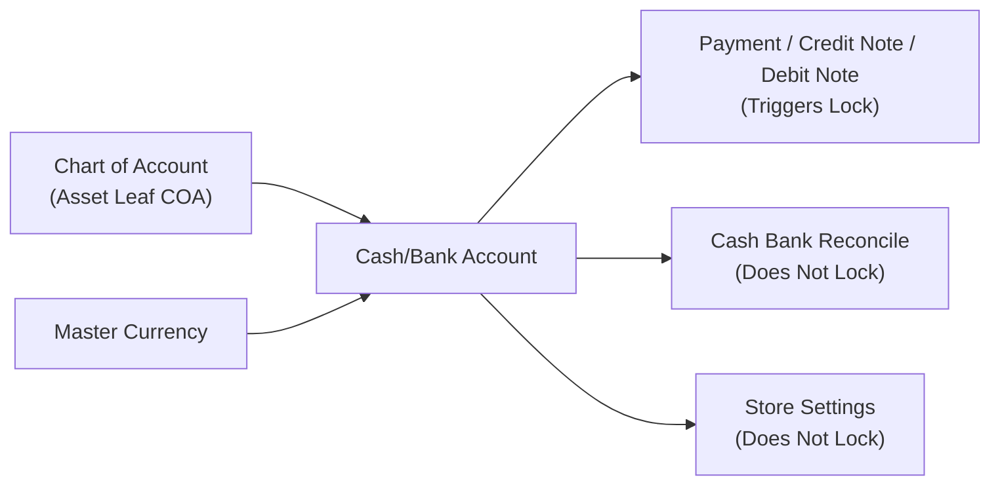
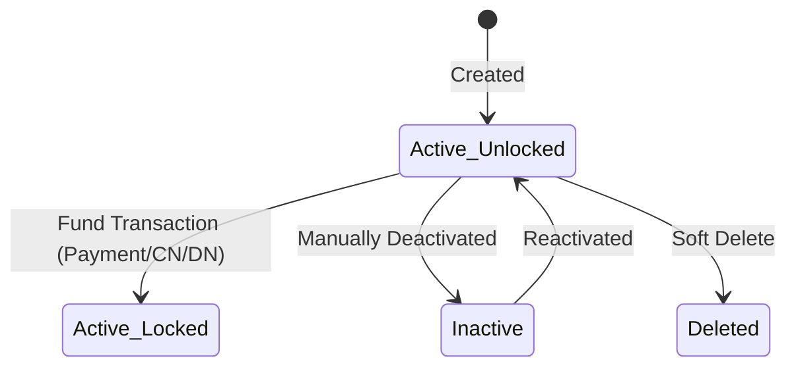
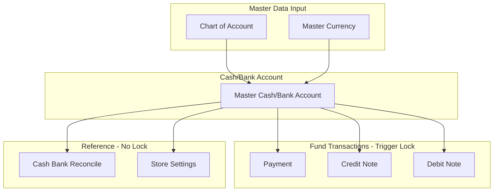

### 📦 Module/Feature: Cash/Bank Account

**Business definition:**
**Cash/Bank Account** is the master data for all operational cash and bank accounts of the company. It bridges the physical/operational account identity with a general-ledger account (**Chart of Account**) and a specific currency. This menu is **not** a financial journal itself and **not** a general-ledger account itself — it is the foundation for fund sources and destinations across business transactions.

### 🔑 Key Terms

* **COA Binding:** One-to-one link between a cash/bank account and a general-ledger (**Chart of Account**) account.
* **Leaf COA:** Lowest-level ledger account in the hierarchy with no further sub-accounts underneath.
* **Default Data:** Flag that marks one active cash/bank account as the automatic reference across transaction modules.
* **Locked:** Integrity protection where core attributes (**Type**, **Currency**, **COA Binding**) can no longer be changed and the **Delete** button is removed.
* **Fund:** Allocation of cash/non-cash receipt sources or payment destinations on financial transactions.

### 🎯 When & Why to Use

> 1. **Company setup initialization:** Register all operational physical bank and cash accounts at system configuration time.
> 2. **Operational expansion:** Add new cash/bank accounts when opening branches, splitting operational accounts, or using foreign currencies (*multi-currency*).

### 📋 Prerequisites

| Prerequisite | Source module | Notes |
| :---- | :---- | :---- |
| **Active Leaf COA** | Chart of Account | Lowest-level Asset-class account, active, and not already bound to another active cash/bank account. |
| **Active currency** | Master Currency | Active currency matching document transaction needs. |

### 🔄 Place in the Business Flow

**Cash/Bank Account** takes supporting input from **Chart of Account** and **Master Currency**, then supplies accounts to external and internal transactions.

**Steps:**

> 1. **Bind base data:** Link an Asset leaf account and a currency when registering a **Cash/Bank Account**.
> 2. **Main fund consumption:** **Payment**, **Credit Note**, and **Debit Note** use the account as fund source/destination. That usage **automatically locks** core attributes.
> 3. **Non-fund reference usage:** **Cash Bank Reconcile** and **Store** settings use the account as a reference **without** locking core attributes.

### 📍 Menu Location & Navigation

* **Navigation path:** Finance Accounting → Master → Cash/Bank Account
* **UI route:** `/accounting/company-detail-bank`

🖼️ **[IMAGE PLACEHOLDER]** — Cash/Bank Account list with Type, Currency, COA, and Default columns.

### 🏷️ Status Lifecycle & Data Protection

| Account status | Edit access | Scope / limits |
| :---- | :---- | :---- |
| **Active — Unlocked** | **Full** (all fields) | **Delete** button available. Account has never been used on a fund transaction. |
| **Active — Locked** | **Limited** | **Type**, **Currency**, and **COA Binding** are **fully locked**. **Delete** button is hidden. Triggered automatically after use on **Payment**, **Credit Note**, or **Debit Note**. |
| **Inactive** | **Limited** | Editable while unlocked. Cannot be set as **Default Data** and does not appear in new transaction picks. |
| **Deleted** | **None** | Soft-deleted. Only allowed if never bound to a fund transaction. |

### ⚙️ How to Use

#### 1. Create a new account

> 1. Go to **Cash/Bank Account**, then click **Create**.
> 2. Choose **Type** (Cash or Bank).
> 3. Fill required **Label**, **Currency**, and **COA Binding** (must be a free Asset *leaf* account).
> 4. *(Optional)* Add bank details: **Bank Name**, **Bank Branch**, **Account Holder**, **Account Number**, **Swift Code**, and **Description**.
> 5. Click **Save**.

🖼️ **[IMAGE PLACEHOLDER]** — Create form with Type, Label, Currency, and COA Binding.

#### 2. Set a default account

> 1. Make sure the target account is **Active**.
> 2. Turn on **Default Data** for that account.
> 3. The system automatically clears **Default Data** from the previous default account.

#### 3. Use the account on fund transactions

> 1. Pick the account on **Payment**, **Credit Note**, or **Debit Note** as fund source or destination.
> 2. After the transaction is saved, core attributes on that account lock automatically.

🖼️ **[IMAGE PLACEHOLDER]** — Locked account form (Type/Currency/COA Binding disabled) after use on a Payment.

### 📊 Field Reference

| Field | Required? | Rules & description |
| :---- | :---- | :---- |
| **Type** | Yes | Account kind: Cash or Bank. |
| **Label** | Yes | Alias/name marker for the account (max 30 characters). |
| **Bank Name** | No | Banking institution name. |
| **Bank Branch** | No | Bank branch name. |
| **Currency** | Yes | Operating currency (defaults to the entity’s main currency). |
| **COA Binding** | Yes | Active Asset-class **Leaf COA** not bound to another active account. |
| **Account Holder** | No | Official account holder name. |
| **Account Number** | No | Bank account number. |
| **Swift Code** | No | International bank identifier. |
| **Description** | No | Extra notes about the account’s purpose. |
| **Default Data** | Optional | Toggle for the company’s primary reference account. |
| **Active** | Optional | Operational status toggle. When off, the account does not appear in new transactions. |
| **Audit Log** | System | History of user changes. |

### 🛡️ Business Rules & Validations

* **If** **Label**, **Currency**, or **COA Binding** is empty, **then** save is rejected.
* **If** you pick a COA already used by another active **Cash/Bank Account**, **then** the system rejects it and warns that the account is already bound.
* **If** you turn on **Default Data** on an **Inactive** account, **then** the action is blocked.
* **If** you create a non-default account while the entity has no active **Default Data** account yet, **then** the system rejects until one active account is set as default.
* **If** you set **Default Data** on a new account, **then** the previous default is cleared automatically.
* **If** you try to change **Type**, **Currency**, or **COA Binding** on an account already used in fund transactions, **then** those form options stay locked.
* **If** you try to turn off **Active** on an account that has fund-transaction history, **then** the option is locked in the UI.
* **If** you try to delete an account that already has fund-transaction history (**Payment**, **Credit Note**, **Debit Note**), **then** the system rejects it and hides **Delete**.
* **If** you delete an account with no fund-transaction history, **then** the system soft-deletes it and frees the **COA Binding**.

### ⚠️ Locked After Use — Lock Path Limits

> ⚠️ **WARNING: DIFFERENT LOCK PATHS**  
> A **Cash/Bank Account** is **permanently locked** (**Type**, **Currency**, **COA Binding** locked and **Delete** removed) only when it has been used as a fund transaction on:

1. **Payment**
2. **Credit Note**
3. **Debit Note**

> Using the account as a report reference on **Cash Bank Reconcile** or as a default in **Store** settings **does not trigger a lock**. Accounts linked in Store or Cash/Bank Reconcile can still change **COA Binding** or be deleted as long as they have no history on the three main fund transactions above.

### 🔗 One-to-One COA Binding

* One Asset-class **Leaf COA** may connect to only **one** active **Cash/Bank Account** at a time.
* Soft-deleting an account clears the link, so that **Leaf COA** is **free to reuse** on a new account.

### 🛑 Current System Limitations

* **Possible multi-default inconsistency:** During a **Default Data** switch, a boundary case may leave more than one Default account at once. Periodically verify the master list.
* **No inactive balance check:** The system does not verify running balance when setting **Inactive**. Confirm zero running balance manually before deactivating.
* **Type validation at UI level:** Cash vs Bank type limits are currently enforced fully at the form UI layer.

### 🌐 Related Modules

| Related module | Role & relationship |
| :---- | :---- |
| **Chart of Account** | Supplies Asset-class **Leaf COA** candidates for **COA Binding**. |
| **Payment / Credit Note / Debit Note** | Consume the account as fund source/destination and **permanently lock** core attributes. |
| **Cash Bank Reconcile** | Uses the account as a balance-matching reference. **Does not lock**. |
| **Store** | Binds the account as the store’s main cash/bank. **Does not lock**. |

### 🛠️ Troubleshooting

| Symptom | Likely cause | What to do |
| :---- | :---- | :---- |
| Warning *"This account is already in use"* when binding COA. | The **Leaf COA** is already bound to another active cash/bank account. | Pick a free COA, or soft-delete an unused older account. |
| **Delete** button missing. | Account has fund-transaction history (**Payment/CN/DN**). | Set **Inactive** to stop use on new transactions. |
| **Currency** or **COA Binding** locked. | Account auto-locked after fund transactions. | Create a new master account if you need a different structure. |
| Cannot set **Default Data**. | Target account is **Inactive**. | Set **Active** first, then check Default. |
| Multiple **Default Data** indicators in the list. | Race/anomaly during a concurrent default switch. | Report to support/QA and fix one account manually. |

### ❓ FAQ

* **Q: Are bank name and account number required for Bank type?**
  * **A:** No. **Bank Name**, **Bank Branch**, and **Account Number** are optional. Required fields are only **Label**, **Currency**, and **COA Binding**.
* **Q: Why can’t I change COA Binding on an account used in reconciliation reports?**
  * **A:** If it cannot be changed, check whether it was used on **Payment**, **Credit Note**, or **Debit Note**. Use on **Cash Bank Reconcile** does not lock the account.
* **Q: What happens to the COA if a Cash/Bank Account is deleted?**
  * **A:** Soft-delete frees the **Leaf COA**, so it can be rebound to a new account master.

### 📑 See Also

* **Chart of Account (COA)** — account hierarchy and base Asset accounts
* **Cash Bank Reconcile** — matching internal cash records with bank summaries
* **Store Settings** — store-level default operational accounts
* **Product COA Group** — inventory and COGS account grouping
