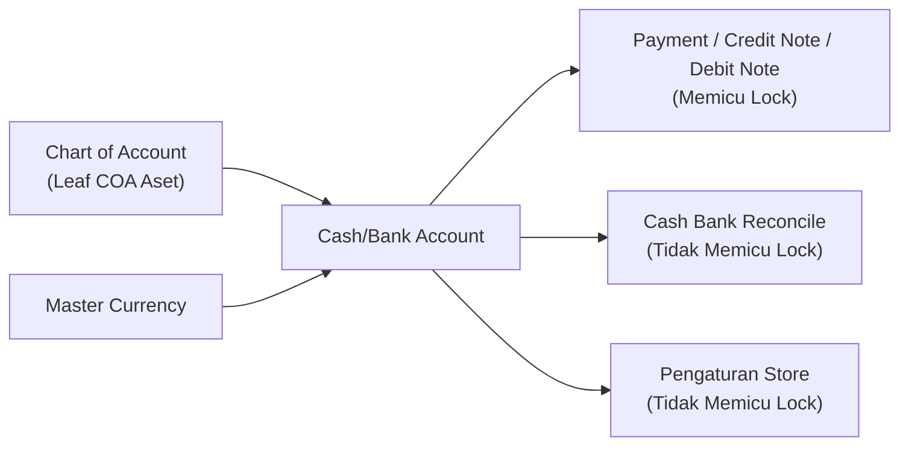
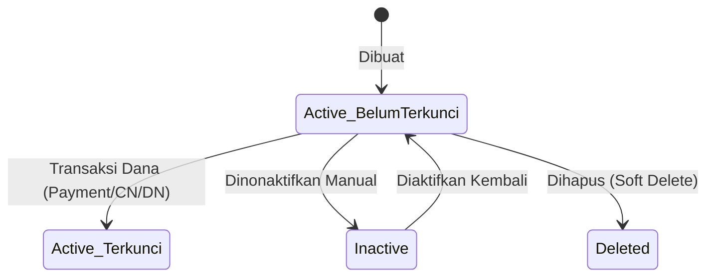
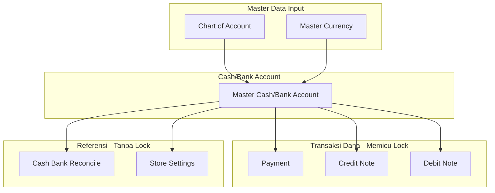

### 📦 Modul/Fitur: Cash/Bank Account

**Definisi Bisnis:**
Modul **Cash/Bank Account** adalah master data untuk mengelola seluruh rekening kas dan bank operasional perusahaan. Fitur ini berfungsi sebagai jembatan yang mengikat identitas fisik/operasional rekening dengan akun buku besar (**Chart of Account**) dan mata uang spesifik. Menu ini **bukan** jurnal keuangan itu sendiri dan **bukan** akun buku besar itu sendiri, melainkan fondasi sumber dan tujuan dana dalam ekosistem transaksi entitas usaha.

### 🔑 Istilah Kunci

* **COA Binding:** Pengikatan hubungan satu-banding-satu antara rekening kas/bank dengan akun buku besar (**Chart of Account**).
* **Leaf COA:** Akun buku besar tingkat paling bawah dalam hirarki akun yang tidak memiliki sub-akun lagi di bawahnya.
* **Default Data:** Indikator utama yang menandai satu rekening kas/bank aktif sebagai acuan otomatis di berbagai modul transaksi.
* **Locked (Terkunci):** Status proteksi integritas di mana atribut inti rekening (**Type**, **Currency**, **COA Binding**) tidak dapat diubah lagi serta tombol **Hapus** dihilangkan.
* **Fund:** Alokasi sumber penerimaan atau tujuan pengeluaran dana tunai/nontunai pada transaksi keuangan.

### 🎯 Kapan & Kenapa Dipakai

> 1. **Inisialisasi setup perusahaan:** Mendaftarkan seluruh rekening bank dan kas fisik operasional di awal konfigurasi sistem.
> 2. **Ekspansi operasional:** Menambahkan akun kas/bank baru saat ada pembukaan cabang, pemisahan rekening operasional, atau penggunaan mata uang asing (*multi-currency*).

### 📋 Prasyarat

| Prasyarat | Sumber modul | Catatan ringkas |
| :---- | :---- | :---- |
| **Leaf COA aktif** | Chart of Account | Akun kelas Aset level paling bawah, aktif, dan belum terikat ke rekening kas/bank aktif lain. |
| **Mata uang aktif** | Master Currency | Mata uang aktif yang disesuaikan dengan kebutuhan transaksi dokumen. |

### 🔄 Posisi dalam Alur Bisnis

Dokumen master **Cash/Bank Account** menerima input pendukung dari **Chart of Account** dan **Master Currency**, lalu menyediakannya untuk transaksi eksternal maupun internal.

**Keterangan langkah:**

> 1. **Pengikatan data dasar:** Akun Aset tingkat dasar (Leaf) dan Mata Uang dihubungkan pada registrasi rekening **Cash/Bank Account**.
> 2. **Konsumsi transaksi utama:** Modul **Payment**, **Credit Note**, dan **Debit Note** menggunakan rekening ini sebagai sumber/tujuan dana. Penggunaan pada alur ini **otomatis mengunci** atribut dasar rekening.
> 3. **Konsumsi non-transaksi dana:** Modul **Cash Bank Reconcile** dan pengaturan **Store** memanfaatkan rekening ini sebagai acuan tanpa memicu penguncian atribut inti.

### 📍 Lokasi Menu & Navigasi

* **Jalur navigasi:** Finance Accounting → Master → Cash/Bank Account
* **Route UI:** `/accounting/company-detail-bank`

🖼️ **[IMAGE PLACEHOLDER]** — Halaman daftar Cash/Bank Account dengan kolom Type, Currency, COA, dan Default.

### 🏷️ Siklus Status & Proteksi Data

| Status rekening | Aksesibilitas edit | Cakupan / batasan |
| :---- | :---- | :---- |
| **Active — Belum terkunci** | **Penuh** (semua field) | Tombol **Hapus** tersedia. Rekening belum pernah digunakan pada transaksi dana. |
| **Active — Terkunci** | **Terbatas** | Atribut **Type**, **Currency**, dan **COA Binding** **dikunci total**. Tombol **Hapus** hilang. Terpicu otomatis setelah digunakan pada **Payment**, **Credit Note**, atau **Debit Note**. |
| **Inactive** | **Terbatas** | Dapat diedit selama belum terkunci. Tidak dapat diset sebagai **Default Data** dan tidak muncul pada pilihan transaksi baru. |
| **Deleted** | **Tidak ada** | Soft delete. Hanya dapat dilakukan jika belum pernah terikat transaksi dana. |

### ⚙️ Cara Penggunaan

#### 1. Membuat rekening baru

> 1. Navigasi ke menu **Cash/Bank Account**, lalu klik **Create**.
> 2. Pilih **Type** (Cash atau Bank).
> 3. Isi atribut wajib **Label**, **Currency**, dan pilih **COA Binding** (harus akun Aset *leaf* yang bebas).
> 4. *(Opsional)* Lengkapi rincian bank: **Bank Name**, **Bank Branch**, **Account Holder**, **Account Number**, **Swift Code**, dan **Description**.
> 5. Klik **Save**.

🖼️ **[IMAGE PLACEHOLDER]** — Form Create dengan field Type, Label, Currency, dan COA Binding.

#### 2. Menetapkan rekening default

> 1. Pastikan rekening target berstatus **Active**.
> 2. Aktifkan penanda **Default Data** pada rekening tersebut.
> 3. Sistem secara otomatis melepas status **Default Data** dari rekening utama sebelumnya.

#### 3. Menggunakan rekening pada transaksi dana

> 1. Pilih rekening pada menu **Payment**, **Credit Note**, atau **Debit Note** sebagai sumber atau tujuan dana.
> 2. Setelah transaksi disimpan, atribut dasar pada rekening tersebut otomatis terkunci.

🖼️ **[IMAGE PLACEHOLDER]** — Form rekening yang sudah terkunci (Type/Currency/COA Binding nonaktif) setelah dipakai di Payment.

### 📊 Referensi Field

| Nama field | Wajib? | Ketentuan & deskripsi |
| :---- | :---- | :---- |
| **Type** | Ya | Pilihan jenis rekening: Cash atau Bank. |
| **Label** | Ya | Teks penanda/nama alias rekening (maks. 30 karakter). |
| **Bank Name** | Tidak | Nama lembaga perbankan penyelenggara. |
| **Bank Branch** | Tidak | Nama cabang kantor bank. |
| **Currency** | Ya | Mata uang operasional rekening (default mengikuti mata uang utama entitas). |
| **COA Binding** | Ya | Akun **Leaf COA** kelas Aset yang aktif dan belum terikat rekening aktif lain. |
| **Account Holder** | Tidak | Nama pemilik resmi rekening. |
| **Account Number** | Tidak | Nomor rekening perbankan. |
| **Swift Code** | Tidak | Kode identifikasi perbankan internasional. |
| **Description** | Tidak | Catatan atau keterangan tambahan terkait fungsi rekening. |
| **Default Data** | Opsional | Toggle penanda rekening acuan utama perusahaan. |
| **Active** | Opsional | Toggle status operasional. Jika mati, data tidak muncul di transaksi baru. |
| **Audit Log** | System | Catatan riwayat perubahan data oleh pengguna. |

### 🛡️ Aturan Bisnis & Validasi

* **Jika** Anda mengosongkan **Label**, **Currency**, atau **COA Binding**, **maka** sistem menolak penyimpanan.
* **Jika** Anda memilih akun COA yang sedang digunakan oleh **Cash/Bank Account** lain yang masih aktif, **maka** sistem menolak dan menampilkan peringatan bahwa akun sudah terikat.
* **Jika** Anda mengaktifkan **Default Data** pada rekening **Inactive**, **maka** aksi diblokir.
* **Jika** Anda membuat rekening baru berstatus non-default saat entitas belum punya satu pun rekening **Default Data** aktif, **maka** sistem menolak hingga ada satu rekening aktif yang diset sebagai default.
* **Jika** Anda menetapkan **Default Data** ke rekening baru, **maka** sistem otomatis mencabut default dari rekening lama.
* **Jika** Anda mencoba mengubah **Type**, **Currency**, atau **COA Binding** pada rekening yang sudah dipakai transaksi dana, **maka** opsi formulir terkunci.
* **Jika** Anda mencoba mematikan **Active** pada rekening yang pernah terikat transaksi, **maka** opsi dikunci dari antarmuka.
* **Jika** Anda mencoba menghapus rekening yang sudah punya histori transaksi dana (**Payment**, **Credit Note**, **Debit Note**), **maka** sistem menolak dan menyembunyikan tombol **Hapus**.
* **Jika** Anda menghapus rekening yang belum pernah punya relasi transaksi dana, **maka** sistem melakukan *soft delete* dan membebaskan tautan **COA Binding**.

### ⚠️ Terkunci Setelah Dipakai — Batasan Jalur Penguncian

> ⚠️ **WARNING: PERBEDAAN JALUR PENGUNCIAN REKENING**  
> Rekening **Cash/Bank Account** **hanya terkunci secara permanen** (field **Type**, **Currency**, **COA Binding** terkunci dan tombol **Hapus** hilang) apabila telah terikat sebagai transaksi dana pada modul:

1. **Payment**
2. **Credit Note**
3. **Debit Note**

> Penggunaan rekening sebagai acuan laporan pada **Cash Bank Reconcile** atau sebagai konfigurasi bawaan pada pengaturan **Store** **tidak memicu penguncian data**. Rekening yang terikat di Store atau Rekonsiliasi Kas/Bank masih dapat diubah **COA Binding**-nya atau dihapus selama belum memiliki histori pada tiga transaksi dana utama di atas.

### 🔗 Relasi Tunggal (1-to-1) COA Binding

* Satu **Leaf COA** kelas Aset hanya boleh terhubung ke **satu** master **Cash/Bank Account** aktif dalam satu rentang waktu.
* Penghapusan rekening (*soft-delete*) secara otomatis mematikan hubungan relasi, sehingga **Leaf COA** tersebut **bebas digunakan kembali** oleh rekening baru.

### 🛑 Keterbatasan Sistem Saat Ini

* **Potensi inkonsistensi multi-default:** Saat peralihan **Default Data**, ada kondisi batas di mana sistem berpotensi menyisakan lebih dari satu rekening berstatus Default sekaligus. Disarankan verifikasi berkala pada daftar master.
* **Absensi verifikasi saldo non-aktif:** Sistem belum mengecek saldo aktif saat menonaktifkan rekening (**Inactive**). Pastikan saldo berjalan nol secara manual sebelum menonaktifkan.
* **Validasi tipe rekening di tingkat antarmuka:** Pembatasan tipe Cash dan Bank saat ini baru ditegakkan penuh di tingkat UI formulir.

### 🌐 Hubungan dengan Modul Lain

| Modul terkait | Peran & keterkaitan |
| :---- | :---- |
| **Chart of Account** | Menyediakan kandidat akun **Leaf COA** kelas Aset untuk **COA Binding**. |
| **Payment / Credit Note / Debit Note** | Mengonsumsi rekening sebagai sumber/tujuan dana dan **memicu penguncian permanen** atribut data. |
| **Cash Bank Reconcile** | Menggunakan data rekening sebagai acuan pencocokan saldo. **Tidak memicu penguncian**. |
| **Store** | Mengikat rekening sebagai kas/bank utama toko. **Tidak memicu penguncian**. |

### 🛠️ Troubleshooting

| Gejala | Kemungkinan penyebab | Solusi operasional |
| :---- | :---- | :---- |
| Peringatan *"Akun ini sudah dipakai"* saat mendaftarkan COA. | **Leaf COA** sudah terikat rekening kas/bank aktif lain. | Gunakan akun COA lain yang bebas, atau soft-delete rekening lama yang tidak terpakai. |
| Tombol **Hapus** hilang dari daftar tindakan. | Rekening sudah punya histori transaksi dana (**Payment/CN/DN**). | Ubah status menjadi **Inactive** untuk menghentikan pemakaian pada transaksi baru. |
| Field **Currency** atau **COA Binding** terkunci. | Rekening sudah terkunci otomatis akibat transaksi dana. | Buat master rekening baru jika butuh konfigurasi struktur berbeda. |
| Gagal mengubah status menjadi **Default Data**. | Rekening target **Inactive**. | Aktifkan dulu menjadi **Active**, lalu centang Default. |
| Indikator **Default Data** ganda pada daftar. | Anomali saat peralihan status default bersamaan. | Laporkan ke dukungan/QA, dan perbaiki salah satu rekening secara manual. |

### ❓ FAQ

* **Q: Apakah nama bank dan nomor rekening wajib diisi untuk tipe Bank?**
  * **A:** Tidak. **Bank Name**, **Bank Branch**, dan **Account Number** opsional. Wajib hanya **Label**, **Currency**, dan **COA Binding**.
* **Q: Mengapa saya tidak bisa mengganti COA Binding pada rekening yang terikat laporan rekonsiliasi?**
  * **A:** Jika rekening tidak bisa diubah, cek apakah pernah dipakai di **Payment**, **Credit Note**, atau **Debit Note**. Penggunaan di **Cash Bank Reconcile** tidak memicu penguncian.
* **Q: Apa yang terjadi pada akun COA jika master Cash/Bank Account dihapus?**
  * **A:** Soft-delete membebaskan **Leaf COA**, sehingga bisa dihubungkan kembali ke master rekening baru.

### 📑 Lihat Juga

* **Chart of Account (COA)** — hirarki akun dan akun Aset dasar
* **Cash Bank Reconcile** — rekonsiliasi kas internal dengan rekapitulasi bank
* **Store Settings** — acuan rekening operasional bawaan tingkat toko
* **Product COA Group** — pengelompokan akun persediaan dan harga pokok penjualan
