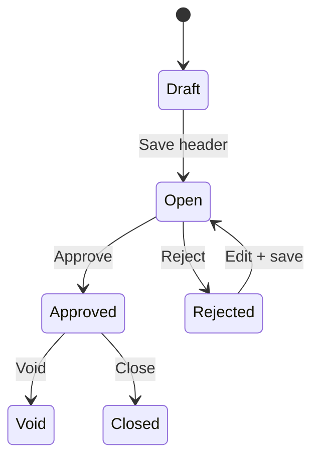

## Module/Feature: Credit Note

**Business definition.** A **Credit Note (CN)** records a **customer credit balance** — for example return value on an invoice that was already paid, or overpayment held as deposit. After approve, the balance can be selected in **Account Receive** as a deposit source so you do not have to refund cash first, or to reduce the next receivable settlement.

## Key terms

* **Credit Note (CN-):** Customer credit / deposit document.
* **Receiving Destination:** Cash/Bank lines that hold the CN value.
* **Total / Paid / Outstanding:** Total funds; amount used on approved AR; remaining on the list.
* **Billed return:** Sales return that auto-creates an approved CN (invoice was previously paid).
* **Unbilled return:** Does **not** create a CN — different accounting path.
* **Deposit COA:** Customer/store deposit account required to approve a CN.

## When to use

* Customer has credit that must be recorded and later applied in Account Receive.
* Finance completes a **Billed** sales return → CN is created automatically.
* Mass create for **General** (company) customers via import.

## When to avoid

* Relying on CN for **Unbilled** returns — no CN is created.
* Approving when Deposit COA is empty or fund amounts are still 0.
* Importing Platform/store customers — use the form instead.

## Prerequisites

| Requirement | Source | Rule |
| :---- | :---- | :---- |
| Active customer + Deposit COA | General Company / Store | Approve fails without Deposit COA |
| Active Cash/Bank for CN currency | Cash/Bank master | Required for manual create |
| Open fiscal period | Fiscal period | Create / edit date / approve |
| Primary company currency | Currency master | Required for import |
| Billed return: invoice previously paid + Sales COA | Sales Invoice / Product | Complete return may fail if Sales COA empty |

## Navigation

* **UI path:** Finance & Accounting → Account Receivable → Credit Note  
* **Route:** `/accounting/credit-note`

> Image placeholder — sidebar Accounting → Credit Note and DataList.

## Process flow

### Order of execution (manual)

1. **Create header** — date, customer, currency, rate.  
2. **Receiving Destination** — Use / Bulk Use Cash/Bank; set amount > 0.  
3. **Approve** — journal posts; balance ready for Account Receive.  
4. **Apply** — select CN as deposit in Account Receive.

## Transaction states

| Status | Meaning | Editable? |
| :---- | :---- | :---- |
| **Draft** / **Open** | Ready to fill funds / approve | Yes |
| **Rejected** | Can fix then approve again | Yes |
| **Approved** | Journal posted | No (Void/Close by privilege) |
| **Void** / **Closed** | Closed after approved | No |

## Step-by-step (happy path)

1. Open `/accounting/credit-note` → **Create**.  
2. Fill customer and currency → save (opens edit).  
3. Add **Receiving Destination** (fix Bulk Use amounts if they start at 0).  
4. **Approve**.  
5. Use remaining balance in **Account Receive** when needed.

## Common pitfalls

* Bulk Use leaves amount **0** — fill amounts before Approve.  
* Header locked after funds exist — clear Receiving Destination first.  
* Import: one bad row cancels the **entire** file.  
* Print button may not work yet — report to support.  
* Unbilled return expected to create CN — it will not.

## Related docs in Help Center

* Knowledge Base — operator SOP & troubleshooting  
* Feature Map — clickable sub-feature / Lingo index  
* User Guide — onboarding narrative  
* Requirement / Technical — QA & engineering detail  

**Related menus:** Sales Return Approval · Account Receive · Sales Invoice · Store Binding
