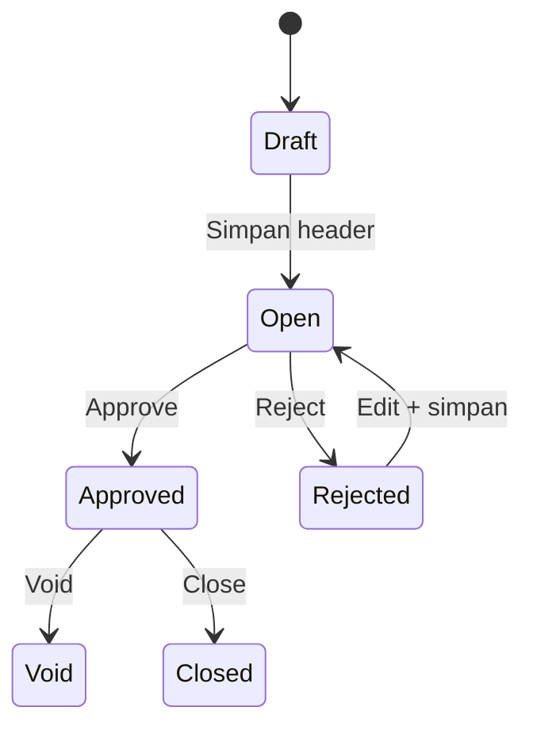

## Modul/Fitur: Credit Note

**Definisi bisnis.** **Credit Note (CN)** mencatat **saldo kredit customer** — misalnya nilai retur untuk invoice yang sudah pernah dibayar, atau kelebihan bayar yang disimpan sebagai deposit. Setelah approve, saldo bisa dipilih di **Account Receive** sebagai sumber deposit agar tidak perlu mengembalikan uang tunai dulu, atau untuk mengurangi pelunasan piutang berikutnya.

## Istilah penting

* **Credit Note (CN-):** Dokumen kredit / deposit customer.
* **Receiving Destination:** Baris fund yang menampung nilai CN — **Cash/Bank** dan/atau **Free COA** (COA leaf non-kas seperti Equity; TO-BE).
* **Total / Paid / Outstanding:** Total fund; yang sudah dipakai di AR approved; sisa di list.
* **Billed return:** Retur sales yang otomatis membuat CN approved (invoice pernah dibayar).
* **Unbilled return:** **Tidak** membuat CN — jalur akuntansi berbeda.
* **Deposit COA:** Akun deposit customer/store yang wajib terisi agar CN bisa di-approve (tidak boleh dipakai sebagai Free COA).

## Kapan dipakai

* Customer punya kredit yang harus dicatat lalu dipakai di Account Receive.
* Finance Complete retur **Billed** → CN terbentuk otomatis.
* Buat massal untuk customer **General** (perusahaan) via import.

## Kapan dihindari

* Mengandalkan CN untuk retur **Unbilled** — CN tidak dibuat.
* Approve saat Deposit COA kosong atau amount fund masih 0.
* Import customer Platform/store — pakai form.

## Prasyarat

| Persyaratan | Sumber | Aturan |
| :---- | :---- | :---- |
| Customer aktif + Deposit COA | General Company / Store | Approve gagal tanpa Deposit COA |
| Cash/Bank aktif untuk mata uang CN | Master Cash/Bank | Wajib untuk create manual |
| Periode fiskal terbuka | Fiscal period | Create / edit tanggal / approve |
| Mata uang utama company | Master Currency | Wajib untuk import |
| Retur billed: invoice pernah dibayar + Sales COA | Sales Invoice / Product | Complete retur bisa gagal jika Sales COA kosong |

## Navigasi

* **Jalur UI:** Finance & Accounting → Account Receivable → Credit Note  
* **Route:** `/accounting/credit-note`

*Sidebar Accounting → Credit Note dan DataList.*

## Alur proses

### Urutan eksekusi (manual)

1. **Buat header** — tanggal, customer, mata uang, kurs.  
2. **Receiving Destination** — Use / Bulk Use Cash/Bank dan/atau Free COA (TO-BE); amount > 0.  
3. **Approve** — jurnal terbit; saldo siap untuk Account Receive.  
4. **Pakai** — pilih CN sebagai deposit di Account Receive.

## Status transaksi

| Status | Arti | Bisa diedit? |
| :---- | :---- | :---- |
| **Draft** / **Open** | Siap isi fund / approve | Ya |
| **Rejected** | Bisa diperbaiki lalu approve lagi | Ya |
| **Approved** | Jurnal sudah ada | Tidak (Void/Close sesuai hak) |
| **Void** / **Closed** | Ditutup setelah approved | Tidak |

## Langkah singkat (happy path)

1. Buka `/accounting/credit-note` → **Create**.  
2. Isi customer dan mata uang → simpan (buka edit).  
3. Tambah **Receiving Destination** (isi amount Bulk Use jika masih 0).  
4. **Approve**.  
5. Pakai sisa di **Account Receive** bila perlu.

## Hal yang sering bikin bingung

* Bulk Use meninggalkan amount **0** — isi amount sebelum Approve.  
* Header terkunci setelah ada fund — clear Receiving Destination dulu.  
* Import: satu baris salah membatalkan **seluruh** file.  
* Tombol Print mungkin belum jalan — laporkan ke support.  
* Mengharapkan CN dari retur Unbilled — tidak akan ada.

## Dokumen terkait di Help Center

* Knowledge Base — SOP operator & troubleshooting  
* Feature Map — indeks sub-feature / Lingo  
* User Guide — narasi onboarding  
* Requirement / Technical — detail QA & engineering  

**Menu terkait:** Sales Return Approval · Account Receive · Sales Invoice · Store Binding
