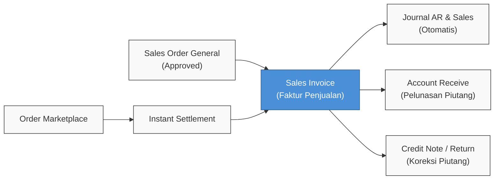
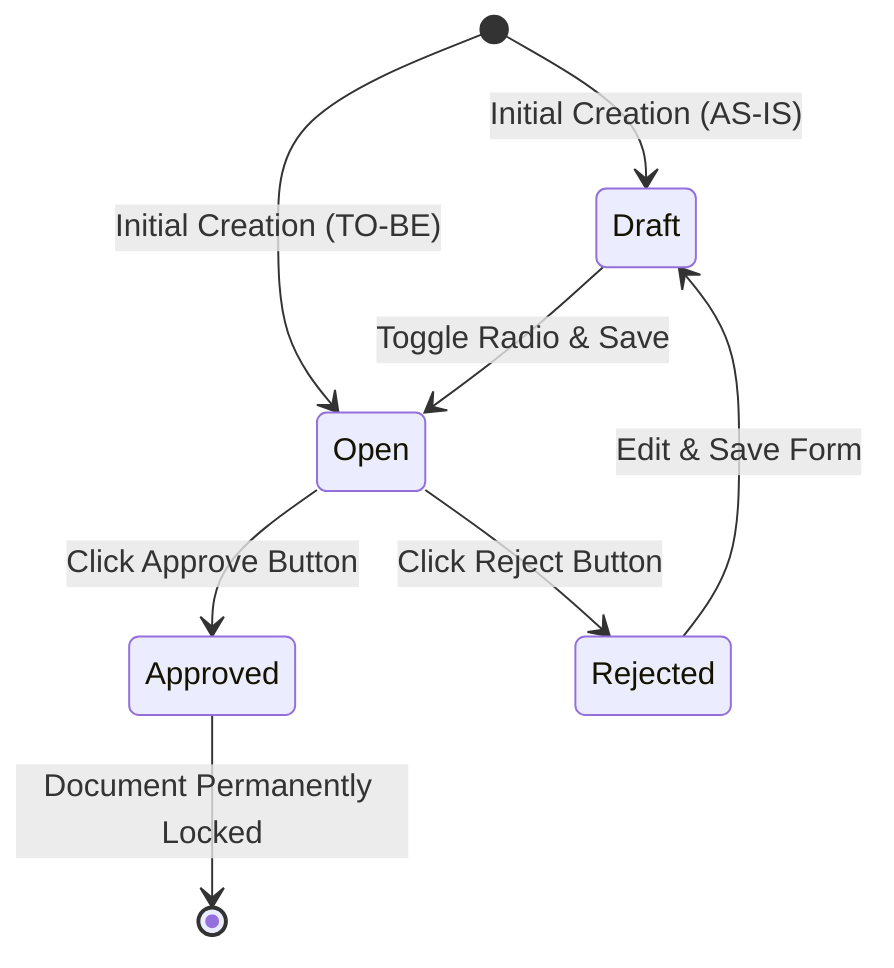
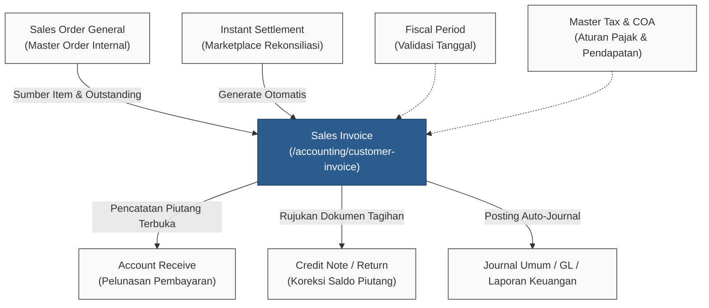

### 📦 Module/Feature: Sales Invoice

**Business Definition:** A **Sales Invoice (SI)** is a formal legal and commercial billing document issued to customers for the sale of goods or services. It serves as the authoritative basis for recognizing **Accounts Receivable (AR)** and **Sales Revenue** in the system. Issuing and approving a Sales Invoice also automatically records Value Added Tax (VAT / PPN), Additional Costs (*Other Cost*), and Additional Discounts (*Other Discount*) into the general ledger.

---

### 🔑 Key Terms & Glossary

| Term | Plain Definition & System Function |
| :--- | :--- |
| **Sales Invoice (SI)** | Official commercial invoice document issued to customers recognizing accounts receivable and sales revenue. |
| **Sales Order General** | Internal / non-marketplace sales order document that provides outstanding line quantities for manual invoicing. |
| **Instant Settlement** | Automated settlement upload workflow for marketplace payouts that generates platform-channel Sales Invoices. |
| **Outstanding** | Remaining quantity of items on an approved Sales Order that has not yet been invoiced. |
| **Prepared to Invoice** | Quantity of items allocated into a Sales Invoice that is currently in **Draft** or **Open** status (not yet approved). |
| **Processed to Invoice** | Quantity of items successfully included in a Sales Invoice that is in **Approved** status. |
| **Net Sales** | Final net invoice amount after accounting for product DPP, VAT, *Other Cost*, and *Other Discount*. |
| **Account Receive** | Downstream cash/bank receipt module used to record customer payments against approved Sales Invoices. |
| **Credit Note** | Downstream financial document used to record adjustments, deductions, or sales returns that reduce Sales Invoice receivables. |
| **AR COA** | *Chart of Accounts* mapping for Accounts Receivable assigned to a General Company or Store entity. |
| **Other Cost** | Header-level operational fee component (e.g. shipping fee) outside product VAT calculation. |
| **Other Discount** | Header-level commercial discount component outside product VAT calculation. |

---

### 🎯 When & Why to Use

#### ✅ Use Sales Invoice When
* **Invoicing Internal Orders:** An approved **Sales Order General** contains remaining uninvoiced quantities (*outstanding*).
* **Opening Balance Migration:** Migrating beginning accounts receivable balances using the bulk **Excel Import** utility for General Sales Orders.
* **Marketplace Sales:** Commercial invoices are automatically generated via the **Instant Settlement** reconciliation engine.
* **Official Financial Recognition:** Sales revenue and customer receivables need to be legally recognized in the accounting ledger.

#### ❌ Do Not Use Sales Invoice When
* **Manual Marketplace Invoicing:** Attempting to manually create invoices for marketplace e-commerce store orders via the Create button.
* **Incomplete COA Configuration:** Accounts Receivable (AR), Product Sales, or Tax Output accounts are missing (invoice approval will fail).
* **Closed Fiscal Period:** The invoice transaction date falls within an accounting period (*Fiscal Period*) that is already closed.
* **Order Fully Invoiced:** The referenced Sales Order has zero remaining outstanding quantity (*fully invoiced*).

---

### 📋 Prerequisites

Before creating or approving a Sales Invoice, ensure the following requirements are met:

* **User Privilege:** The user account has appropriate authorization (View, Create, Update, Delete, Approval) on the Sales Invoice module.
* **Active Fiscal Period:** The transaction date (**Transaction Date**) falls within an open and active fiscal period.
* **Primary Currency Setup:** The company's primary currency is configured with an exchange rate of exactly 1.00.
* **Valid Customer Data (Manual Channel):** Customer entity is a *General Company*, marked as an active customer, mapped to a valid **AR COA**, and has an *Approved* or *Processed* Sales Order General with outstanding quantity.
* **Valid Store Data (Platform Channel):** Master Store entity has a valid **AR COA** configuration mapped.
* **Product & Tax COA Setup:** Invoiced products are linked to active **Sales** revenue accounts in *Product COA Group*, and tax rates have corresponding output tax accounts in *Master Tax*.
* **Active Cost / Discount Masters:** Master *Other Cost* and *Other Discount* records are active if attached to the header.
* **Bulk Import Preconditions:** Uploaded data belongs exclusively to valid internal General Sales Orders, has not been fully invoiced, and contains no marketplace platform orders.

---

### 🔄 Position in Business Workflow

#### Workflow Steps:
> 1. **Transaction Source Initiation:** Invoicing starts from an approved Sales Order General or is triggered by a marketplace Instant Settlement reconciliation run.
> 2. **Sales Invoice Issuance:** Invoice document is generated, establishing legal claim and item quantities.
> 3. **Automatic Journal Posting:** Document approval immediately triggers general ledger entries for Accounts Receivable (AR), Sales Revenue, and Output VAT.
> 4. **Downstream Settlement:** Approved invoices become open receivables ready for payment collection in **Account Receive** or adjustment via **Credit Note / Sales Return**.

#### Text Workflow (Fallback):
> 1. General Sales Order or Instant Settlement file is prepared.
> 2. Sales Invoice is created and approved.
> 3. System automatically posts general ledger journals (Accounts Receivable & Sales).
> 4. Invoice flows downstream to Account Receive for payment collection or to Credit Note for returns.

---

### 📍 Menu Location

* **Navigation Path:** Finance & Accounting → Account Receivable → Sales Invoice
* **System UI Route:** `/accounting/customer-invoice`

---

### 🛡️ Status Lifecycle

#### Lifecycle Explanation:
> 1. **Initial Creation:** Newly created document is saved in **Draft** (AS-IS) or directly in **Open** (planned TO-BE).
> 2. **Approval Readiness:** Documents in **Draft** must be transitioned to **Open** and saved to activate verification buttons.
> 3. **Approval / Rejection:** An **Open** document can be approved (**Approved**) to post journals or rejected (**Rejected**) by the reviewer.
> 4. **Revision Cycle:** A **Rejected** document that is edited and re-saved automatically returns to **Draft** status.

#### Text Sequence (Fallback):
* [Create] → **Draft** → (Select Open & Save) → **Open** → (Approve) → **Approved**.
* **Open** → (Reject) → **Rejected** → (Edit & Save) → **Draft**.
* **Draft / Open** → (Delete) → Deleted from system.

#### Status Governance Matrix

| Status | Definition | Editable? | Available Actions |
| :--- | :--- | :--- | :--- |
| **Draft** | Initial saved state; not yet submitted for approval. | **Yes** | Edit, Delete, Print |
| **Open** | Complete and ready for verification / approval. | **Yes** | Edit, Delete, Print, Approve, Reject |
| **Approved** | Legally binding accounting document; journals posted, receivable active, locked. | **No** (View Only) | Show, Print |
| **Rejected** | Rejected by reviewer; saving changes resets status back to Draft. | **Yes** | Edit, Delete, Print |

> **Hard Rules:**
> * Platform Sales Invoices (**Instant Settlement**) are strictly blocked from **Reject** and **Delete** actions.
> * **[TO-BE CONDITION]:** Future versions plan for newly created documents to save directly as **Open**. Currently (**AS-IS**), newly created documents save as **Draft** and require manual transition to **Open** before approval.

---

### ⚖️ Manual General vs. Platform (Instant Settlement)

| Comparison Aspect | Manual (Sales Order General) | Platform (Instant Settlement) |
| :--- | :--- | :--- |
| **Source Document** | Approved *Sales Order General*. | Marketplace order transactions via settlement file. |
| **Creation Method** | Created manually through system UI form. | Generated automatically by the *Instant Settlement* engine. |
| **Customer Type** | *General Company* customer entity. | Marketplace sales channel entity (*Store*). |
| **Reject Action** | Allowed (from Open status). | **Blocked / Rejected** by system. |
| **Delete Action** | Allowed (on Draft, Open, or Rejected status). | **Blocked / Rejected** by system. |
| **Excel Import Support** | Allowed (specifically for internal orders). | **Rejected** (only via settlement pipeline). |
| **Datalist Column** | *Instant Settlement* column is empty. | *Instant Settlement* column displays settlement code. |

---

### ⚙️ Step-by-Step Guide — Manual General

> 1. **Open Creation Form:** Navigate to `/accounting/customer-invoice` and click **Create**. The system automatically pre-fills fields from the most recent invoice history.
> 2. **Complete Header Details:** Verify and select **Customer**, **Transaction Date**, **Currency**, **Exchange Rate**, and optionally enter external reference in **Your Ref**.
> 3. **Pull Items from Outstanding SO:** Open the **Outstanding Sales Order** panel, locate desired SKU lines, and use line-level or SO-level use buttons. The system automatically pulls all remaining outstanding quantity on the selected line.
> 4. **Add Optional Costs & Discounts:** Attach *Other Cost* or *Other Discount* components in the additional charges panel if applicable.
> 5. **Save & Switch to Open:** Set status radio button to **Open** and click **Save**.
> 6. **Execute Approval:** Click **Approve**. The system validates fiscal period, detail lines, prepared quantity limits, and AR/Sales/Tax account mappings.
> 7. **Verify Output:** Confirm status updates to **Approved**, processed quantity increments on the SO, and accounting journals are automatically posted.
> 8. **Downstream Payment:** Open **Account Receive** to process receipt of payment from the customer.

---

### 🧩 Partial Invoice Workflow

OlshopERP supports issuing multiple sales invoices from a single sales order (*partial invoicing across invoices*) under SKU line-level rules:

* **Full Remaining Line Extraction:** The system pulls the **entire remaining quantity** for the selected SKU line. Direct manual editing of quantity in the detail table is disabled (*read-only*).
* **Staged Invoicing Mechanism:** Staged invoicing is achieved by selecting a subset of SKU lines in the first invoice, and selecting the remaining SKU lines in subsequent invoices.

> **Example Scenario:** Order **SO-001** contains 2 item lines: **SKU-A (10 pcs)** and **SKU-B (10 pcs)**.
> 1. In **SI-1**, the operator selects only line **SKU-A**. Invoice quantity automatically populates as 10 pcs.
> 2. Line **SKU-B** remains in *outstanding* status.
> 3. The operator can later create **SI-2** specifically to bill **SKU-B** for 10 pcs.

#### Invoicing Progress Parameters:
* **Prepared to Invoice:** Total quantity currently referenced on other *Draft* or *Open* Sales Invoices.
* **Processed to Invoice:** Total quantity successfully approved on *Approved* Sales Invoices.

---

### 📥 Opening Balance Migration (Excel Import)

The spreadsheet import utility allows bulk creation of opening receivable balances from internal General Sales Orders.

#### 3-Column Template Structure:
The template consists of 3 primary columns: **Transaction Date** · **Order Number** · **Platform Order ID**.

| Import Technical Rule | System Boundary & Behavior |
| :--- | :--- |
| **File Format** | Primary interface format is `.xlsx` (backend also parses `.xls` and `.csv`). |
| **XOR Column Rule** | Must fill **exactly one** of *Order Number* OR *Platform Order ID* (fails if both empty or both populated). |
| **Order Type Restriction** | Strictly restricted to internal **Sales Order General** (marketplace platform orders are rejected). |
| **SO Document Criteria** | Must be in *Approved* or *Processed* status, not fully invoiced, and owned by the active company. |
| **Date Validation** | Invoice transaction date must be ≥ Sales Order document date. |
| **Line Mapping** | 1 row in Excel converts to 1 Sales Invoice (pulling all outstanding lines of that SO). |
| **Imported Status** | Successfully imported invoices land directly in **Open** status (not automatically *Approved*). |
| **Journal Impact** | General journals are **not posted** on import; journals post when each invoice is approved manually. |
| **Transaction Integrity** | Operates on an **All-or-Nothing** principle (if 1 row fails validation, the entire batch is aborted). |
| **Volume Limit** | Maximum recommended batch processing limit is ± 5,000 rows per file. |
| **Duplicate Prevention** | Duplicate rows within the same import file are rejected immediately. |

---

### 🗃️ Financial Journals on Approval

Upon approving a Sales Invoice (**Approved**), the system automatically generates and posts general ledger entries with *auto-approved* status:

| Position | General Ledger Account (COA) | Booking Value |
| :--- | :--- | :--- |
| **DEBIT** | **Accounts Receivable (AR)** — Company (General) / Store (Platform) Account | Net Total = Total Credit minus *Other Discount*. |
| **CREDIT** | **Sales Revenue** — Revenue account per product | Revenue value before VAT (in primary currency). |
| **CREDIT** | **VAT Output** — Output tax account | Accumulated VAT value from product lines. |
| **CREDIT** | **Other Cost** — Additional operational fee account (if present) | Header-level fee amount. |
| **DEBIT** | **Other Discount** — Additional discount account (if present) | Header-level discount amount. |

> Automated journal description format: `"Auto-Journal from {SI Code}"` annotated with Sales Order, platform, or customer reference.

---

### 📊 Field Reference — Header (Basic Information)

| Field Name | Mandatory? | Default / System Behavior | Validation Rules & Constraints |
| :--- | :--- | :--- | :--- |
| **Transaction Code** | Yes | Auto-generated by system. | Prefixed with **SI**; editable manually (max 50 chars, unique). |
| **Transaction Date** | Yes | Current server date. | Must fall within an open and active fiscal period. |
| **Due Date** | No | Defaults to Transaction Date if empty. | Invoice due date; not validated against fiscal period. |
| **Currency** | Yes | Primary currency (IDR) / last saved history. | Establishes base currency for transaction. |
| **Exchange Rate** | Yes | 1.00 | Locked to 1.00 for primary currency; editable for foreign currencies. |
| **Customer** | Yes (Manual) | Pre-filled from last transaction. | Displays active General Company customers with AR COA and SO; show-only for platform. |
| **AR COA** | Locked | Auto-populated by system. | Reads Accounts Receivable account from Company or Store master. |
| **Your Ref** | No | Empty. | Free-text external reference code (max 50 chars). |
| **Term and Condition** | No | Empty. | Commercial terms and notes (max 2,000 chars). |
| **Description** | No | Empty. | Internal remarks (max 150 chars). |
| **Transaction Status** | Yes | Radio options Draft / Open. | New records save as **Draft** (TO-BE: directly **Open**). |
| **Attachment** | No | Empty. | Supporting document upload with file extension filters. |

> ⚠️ **Critical Rule:** Once at least 1 item line is added to the detail table, the following header fields are **permanently locked**: *Customer*, *Currency*, *Exchange Rate*, *Transaction Date*, and *Due Date*. All item lines must be deleted first to re-enable header editing.

---

### 📋 Field Reference — Detail (Item Configuration)

| Detail Column / Element | Data Source / System Behavior |
| :--- | :--- |
| **Select Product** | Displays SKU lines originating from *Approved/Processed* Sales Orders with remaining quantity. |
| **Outstanding SO** | Search filter to locate order lines by internal Sales Order code. |
| **Bundle Handling** | Bundle-type products render only the **bundle header line**. |
| **Quantity** | Auto-filled with full remaining outstanding quantity on the SO line. Quantity input is **locked (disabled)**. |
| **Invoice Progress** | Visual indicators: *Prepared* (allocated on other draft/open SIs) and *Processed* (approved on prior SIs). |

---

### 💵 Field Reference — Additional Cost / Discount

| Component Attribute | Other Cost Panel | Other Discount Panel |
| :--- | :--- | :--- |
| **Master Data Source** | Active *Other Cost* master records. | Active *Other Discount* master records. |
| **COA Account Mapping** | Auto-populated from master; **can be adjusted manually**. | Auto-populated from master; **can be adjusted manually**. |
| **Impact on Net Sales** | **Increases** Net Sales total. | **Decreases** Net Sales total. |
| **Tax Calculation Base** | **Excluded** from product VAT DPP base. | **Excluded** from product VAT DPP base. |

---

### 🧮 Field Reference — Totals Panel

| Total Label | Formula & Calculation Logic |
| :--- | :--- |
| **Total Products** | Gross total of all products before VAT (Total Unit Price Before VAT × Qty). |
| **Disc Products** | Accumulated item-level discount amounts. |
| **Total VAT** | Accumulated VAT amount across all item lines. |
| **Total Other Cost / Discount** | Net sum of header Other Cost minus Other Discount. |
| **Net Sales** | Final invoice balance: Total Products − Disc Products + Total VAT + Other Cost − Other Discount. |

---

### 🛡️ Business Rules & Validations

* **If you** enter a transaction date in a closed fiscal period, **then** the system blocks saving, date editing, and approval.
* **If you** select an inactive customer entity, **then** the system displays a customer configuration warning.
* **If you** select an unregistered currency, **then** the system rejects the transaction with a missing currency error.
* **If you** set an Exchange Rate other than 1 for the primary currency, **then** the system displays an invalid rate error.
* **If you** enter a duplicate transaction code, **then** the system halts saving with a uniqueness constraint error.
* **If you** attempt to edit customer, date, or currency after detail items exist, **then** the system locks these fields until all lines are removed.
* **If you** click *Approve* on an invoice with no line items, **then** the system rejects approval with a "no detail items" error.
* **If you** approve an invoice whose remaining quantity has been depleted elsewhere, **then** the system flags an insufficient invoicable quantity error.
* **If you** approve an invoice where Company or Store lacks an AR COA mapping, **then** approval fails with an AR configuration error.
* **If you** approve an invoice containing products without sales revenue COA mappings, **then** approval fails with a Sales COA error.
* **If you** approve an invoice where the output tax account is missing in master Tax, **then** approval fails with a Tax Sales configuration error.
* **If you** attempt to click *Reject* or *Delete* on a marketplace platform invoice, **then** the system strictly blocks the action.
* **If you** upload an Excel file with mismatched column headers, **then** the system reports a format mismatch error.
* **If you** include marketplace platform order numbers in the Excel import file, **then** those lines are rejected.
* **If you** leave both or populate both *Order Number* and *Platform Order ID* in the import file, **then** the system rejects the file.
* **If you** import a Sales Order that is already fully invoiced, **then** the system rejects the line with an already invoiced error.
* **If you** enter an import transaction date earlier than the Sales Order creation date, **then** the system rejects the row.
* **If you** include duplicate rows within the same import file, **then** the entire import process is aborted.
* **If you** have even 1 invalid row in the Excel import file, **then** the entire batch is rolled back (*all-or-nothing*).

---

### 🛑 Limitations & Under-Review Behaviors

The items below describe current operational realities (*as-is*) objectively:

> 1. **Default Creation Status (TO-BE vs AS-IS):** Newly created documents currently save as **Draft** and require manual promotion to **Open** before approval. Future releases plan for direct creation in **Open** status.
> 2. **Import Journal Posting Lifecycle:** By design, imported invoices land in **Open** status and journals post upon manual approval. Residual auto-journal triggering during import is under technical review.
> 3. **Import File Compatibility:** The UI emphasizes `.xlsx` format, though backend parsers also support `.xls` and `.csv`.
> 4. **Currency Validation Notice Text:** Exchange rate validation notices occasionally display the phrase *"purchase order"* due to shared legacy validation wording.

---

### 🔗 Related Module Relationships

#### Interaction Flow:
> 1. **Input Data Ingestion:** Sales Invoice receives items from Sales Order General or is generated directly by Instant Settlement.
> 2. **Master Gate Validations:** Transactions are validated against Fiscal Period calendars and read account rules from Tax and Chart of Accounts masters.
> 3. **Downstream Distribution:** Approved invoices supply open receivable balances to Account Receive and Credit Note, and post debit/credit entries to General Ledger.

#### Text Flow (Fallback):
* **Sales Order General / Instant Settlement** → Upstream transaction source for Sales Invoice.
* **Sales Invoice** → Posts journals to **General Ledger / GL**, provides receivable data to **Account Receive**, and acts as reference for **Credit Note**.
* **Fiscal Period & Master Tax** → Act as validation gates for dates and account mappings.

---

### 🛠️ Troubleshooting

| Issue Symptom | Potential Root Cause | Corrective Action |
| :--- | :--- | :--- |
| *Approve* button is inactive or unresponsive. | Document transaction status is still set to **Draft**. | Change status radio to **Open**, click **Save**, then click **Approve**. |
| Outstanding SO search panel is empty when picking items. | SO is not yet approved, or all item quantities are already consumed on other invoices. | Verify SO approval status and inspect *Prepared / Processed* quantity tracking. |
| Approval fails with account configuration errors. | Accounts Receivable (AR), Sales Revenue, or VAT Output accounts are unmapped. | Configure required accounts in Company, Store, Product COA Group, or Tax masters. |
| *Delete* or *Reject* button does not appear on an invoice. | Document originated from marketplace Instant Settlement. | Normal system behavior; platform invoices are locked from direct deletion here. |
| Entire Excel import batch fails when only 1 row is invalid. | System enforces strict *all-or-nothing* transactional integrity. | Fix the invalid row in Excel using log details and re-upload the file. |
| Status reverts to *Draft* after editing a rejected invoice. | Default system behavior when saving modifications on a *Rejected* document. | Toggle status to **Open**, save, and resubmit for approval. |
| Customer, currency, or date fields are locked and cannot be edited. | Header fields automatically lock once detail item lines exist. | Remove all item lines from the detail table to unlock header fields. |
| Validation error message mentions *"purchase order"*. | Shared legacy validation wording in currency check routine. | Disregard the "purchase order" term; verify currency and exchange rate settings. |

---

### ❓ Frequently Asked Questions (FAQ)

* **Q: Why cannot I approve a Sales Invoice that is in Draft status?**
  * **A:** The system restricts approval actions strictly to documents in **Open** status. Switch the status to Open and save first.
* **Q: Can I invoice a partial quantity from a single SKU line (e.g. 5 out of 10 pcs)?**
  * **A:** No. The system draws the full remaining quantity for the selected SKU line. Staged invoicing is performed by selecting different SKU lines across separate invoices.
* **Q: Why cannot marketplace online store orders be invoiced manually via the Create button?**
  * **A:** Marketplace orders are processed exclusively and automatically through **Instant Settlement** to ensure exact financial reconciliation.
* **Q: Can marketplace sales reports be imported through the Excel Import menu here?**
  * **A:** No. The Excel Import facility on the Sales Invoice menu is strictly reserved for internal **Sales Order General** records.
* **Q: When do accounting journals post to the general ledger?**
  * **A:** General ledger journals are automatically posted the moment a Sales Invoice is **Approved**.
* **Q: How does the system populate Customer options on manual invoice creation?**
  * **A:** It filters active *General Company* entities configured as customers with valid AR COA mappings and outstanding Sales Orders.
* **Q: Are generated journals automatically approved?**
  * **A:** Yes, journals generated upon Sales Invoice approval carry *auto-approved* status.
* **Q: What happens if a Rejected invoice is edited and saved?**
  * **A:** The system resets its status back to **Draft**. The user must promote it to **Open** before submitting for approval again.
* **Q: Are Other Cost and Other Discount fields mandatory?**
  * **A:** No, both fields are optional based on commercial requirements.
* **Q: What is the primary difference between Sales Invoice and Instant Settlement?**
  * **A:** Sales Invoice is the official legal billing document recognizing receivables, while Instant Settlement is the marketplace reconciliation engine that automatically generates platform Sales Invoices.

---

### 📑 Related References & Next Steps

* [Sales Order General](/docs/omni/omni-all-orders/overview) — upstream internal sales order management and outstanding quantity tracking.
* [Instant Settlement](/docs/accounting/accounting-instant-settlement/overview) — marketplace payout reconciliation engine generating platform Sales Invoices.
* [Account Receive](/docs/accounting/accounting-customer-payment/overview) — downstream receipt module for collecting payment on approved Sales Invoices.
* [Credit Note](/docs/accounting/accounting-credit-note/overview) — sales return adjustments and accounts receivable credit notes.
* **General Ledger & Journal Report** — accounting reports and journal entry audits.
* [Fiscal Period](/docs/accounting/accounting-fiscal-period/overview) — financial period calendar governance.
* [Master Tax](/docs/accounting/accounting-tax/overview) & [Product COA Group](/docs/accounting/accounting-product-coa-group/overview) — VAT tax rate setup and product revenue account mapping.
