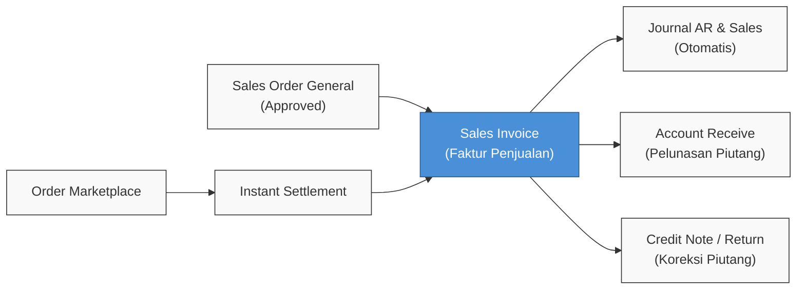
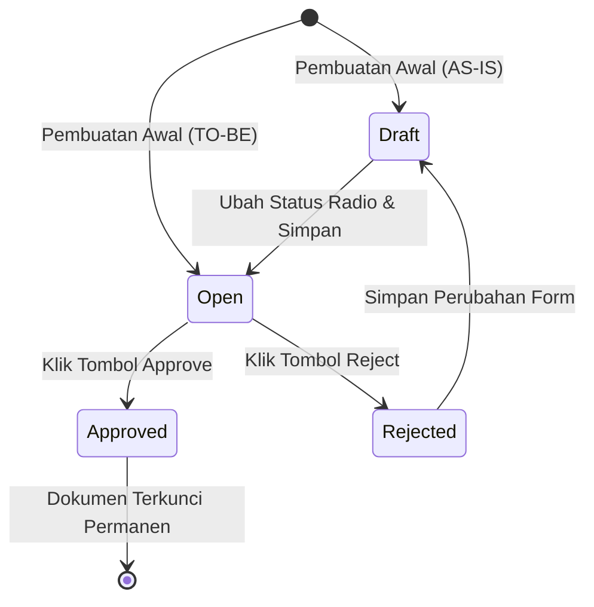
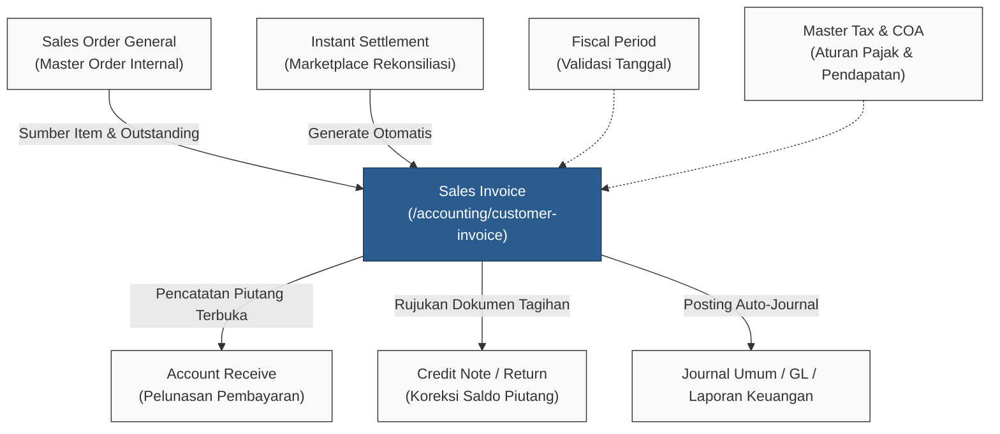

### 📦 Modul/Fitur: Sales Invoice (Faktur Penjualan)

**Definisi Bisnis:** **Sales Invoice (SI)** adalah dokumen faktur atau tagihan resmi yang diterbitkan kepada pelanggan atas penjualan barang atau jasa. Dokumen ini menjadi dasar legal pengakuan **piutang usaha (Account Receivable / AR)** serta **pendapatan penjualan (Sales Revenue)** di dalam sistem. Penerbitan dan persetujuan faktur ini juga mencatat komponen Pajak Pertambahan Nilai (PPN), biaya tambahan (*Other Cost*), dan diskon tambahan (*Other Discount*) ke dalam buku besar secara otomatis.

---

### 🔑 Istilah Kunci

| Istilah | Definisi Awam & Fungsi Sistem |
| :--- | :--- |
| **Sales Invoice (SI)** | Dokumen tagihan resmi ke pelanggan yang mencatat pengakuan piutang dagang dan pendapatan penjualan. |
| **Sales Order General** | Dokumen pesanan penjualan internal/non-marketplace yang menjadi sumber pengambilan barang (*outstanding*) untuk faktur manual. |
| **Instant Settlement** | Fitur unggah penyelesaian saldo pencairan dana marketplace yang secara otomatis menerbitkan dokumen Sales Invoice jalur platform. |
| **Outstanding** | Sisa kuantitas barang pada pesanan penjualan (Sales Order) yang belum ditagihkan ke dalam faktur. |
| **Prepared to Invoice** | Kuantitas barang yang sudah dimasukkan ke dalam Sales Invoice namun status fakturnya masih **Draft** atau **Open** (belum disetujui). |
| **Processed to Invoice** | Kuantitas barang yang sudah berada di dalam Sales Invoice yang berstatus **Approved**. |
| **Net Sales** | Nilai total tagihan bersih akhir setelah memperhitungkan DPP produk, PPN, *Other Cost*, dan *Other Discount*. |
| **Account Receive** | Modul penerimaan kas/bank downstream untuk mencatat pelunasan pembayaran dari pelanggan atas tagihan Sales Invoice yang telah disetujui. |
| **Credit Note** | Dokumen finansial downstream untuk mencatat koreksi, potongan saldo, atau retur penjualan yang mengurangi nilai piutang Sales Invoice. |
| **AR COA** | *Chart of Account* akun piutang usaha (*Account Receivable*) yang dipetakan pada entitas General Company atau Store. |
| **Other Cost** | Komponen biaya operasional tambahan di tingkat header faktur (misal: ongkos kirim) di luar perhitungan PPN produk. |
| **Other Discount** | Komponen potongan harga tambahan di tingkat header faktur di luar perhitungan PPN produk. |

---

### 🎯 Kapan & Kenapa Dipakai

#### ✅ Pakai Sales Invoice Jika
* **Penagihan Pesanan Internal:** Terdapat transaksi **Sales Order General** berstatus disetujui yang masih memiliki sisa kuantitas barang belum ditagih (*outstanding*).
* **Migrasi / Saldo Awal:** Ingin memasukkan saldo piutang awal melalui fasilitas **Import Excel** khusus untuk pesanan Sales Order General.
* **Transaksi Penjualan Marketplace:** Dokumen Sales Invoice terbentuk otomatis melalui proses **Instant Settlement**.
* **Pengakuan Finansial Resmi:** Nilai pendapatan penjualan dan piutang pelanggan perlu dicatat secara sah ke dalam buku besar akuntansi.

#### ❌ Jangan Pakai Sales Invoice Jika
* **Penagihan Manual Marketplace:** Ingin membuat penagihan untuk pesanan penjualan toko online marketplace lewat tombol Create manual.
* **Konfigurasi Akun Belum Lengkap:** Akun piutang (AR), akun penjualan produk, atau akun pajak belum diatur di sistem (approval faktur akan gagal).
* **Periode Fiskal Ditutup:** Tanggal transaksi faktur berada di dalam rentang periode akuntansi (*Fiscal Period*) yang sudah berstatus tutup/closed.
* **Pesanan Sudah Tertagih Penuh:** Dokumen Sales Order rujukan sudah habis kuantitasnya (*fully invoiced*).

---

### 📋 Prasyarat

Sebelum membuat atau menyetujui transaksi Sales Invoice, pastikan ketentuan berikut telah dipenuhi:

* **Hak Akses Pengguna (Privilege):** Akun pengguna telah memiliki otorisasi akses (View, Create, Update, Delete, Approval) pada modul Sales Invoice.
* **Periode Fiskal Terbuka (Active Fiscal Period):** Tanggal transaksi (**Transaction Date**) faktur berada dalam periode fiskal yang aktif.
* **Konfigurasi Mata Uang Utama:** Mata uang utama perusahaan (*primary currency*) telah disetel dengan nilai kurs konversi tepat 1.00.
* **Kelayakan Data Customer (Jalur Manual):** Entitas pelanggan bertipe *General Company*, ditandai sebagai customer aktif, memiliki pemetaan akun piutang (**AR COA**), dan memiliki dokumen *Sales Order General* berstatus *Approved* atau *Processed* dengan sisa kuantitas *outstanding*.
* **Kelayakan Data Store (Jalur Platform):** Master data Store telah memiliki konfigurasi pemetaan akun piutang (**AR COA**) yang valid.
* **Konfigurasi Akun Produk & Pajak:** Seluruh produk yang ditagihkan telah terhubung dengan akun penjualan (**Sales**) pada *Product COA Group* dan memiliki akun penampung pajak keluaran di master *Tax*.
* **Komponen Master Tambahan:** Master data *Other Cost* dan *Other Discount* berstatus aktif jika ingin disisipkan ke header.
* **Prasyarat Unggah Massal (Import):** Data yang diimpor murni berasal dari *Sales Order General* yang sah, belum pernah di-invoice penuh, dan bukan berasal dari order platform marketplace.

---

### 🔄 Posisi dalam Alur Bisnis

#### Keterangan langkah:
> 1. **Inisiasi Sumber Transaksi:** Penagihan dimulai dari dokumen Sales Order General yang disetujui atau hasil dari rekonsiliasi Instant Settlement marketplace.
> 2. **Penerbitan Sales Invoice:** Pembentukan faktur penjualan untuk mengakui hak tagih dan rincian kuantitas produk.
> 3. **Pencatatan Jurnal Otomatis:** Persetujuan dokumen faktur menerbitkan jurnal pengakuan Piutang (AR), Penjualan (Sales), dan PPN Keluaran secara langsung.
> 4. **Penyelesaian Hilir:** Faktur yang disetujui menjadi dokumen piutang terbuka untuk dilunasi melalui modul **Account Receive** atau dikoreksi melalui modul **Credit Note / Sales Return**.

#### Alur Teks (Fallback):
> 1. Dokumen Sales Order General atau proses rekonsiliasi Instant Settlement disiapkan.
> 2. Faktur Sales Invoice dibuat dan disetujui.
> 3. Sistem secara otomatis memposting jurnal umum (Piutang Usaha dan Penjualan).
> 4. Tagihan faktur mengalir ke modul Account Receive untuk proses pelunasan kas/bank, atau ke Credit Note jika ada retur penjualan.

---

### 📍 Lokasi Menu

* **Struktur Navigasi:** Finance & Accounting → Account Receivable → Sales Invoice
* **Route UI Sistem:** `/accounting/customer-invoice`

---

### 🛡️ Siklus Status

#### Keterangan langkah:
> 1. **Pembuatan Awal:** Dokumen yang baru dibuat tersimpan dengan status **Draft** (AS-IS) atau langsung **Open** (rencana TO-BE).
> 2. **Kesiapan Approval:** Dokumen berstatus **Draft** dipindahkan ke status **Open** dan disimpan agar tombol verifikasi aktif.
> 3. **Persetujuan / Penolakan:** Dokumen **Open** dapat disetujui (**Approved**) untuk menerbitkan jurnal atau ditolak (**Rejected**) oleh approver.
> 4. **Siklus Perbaikan:** Dokumen berstatus **Rejected** yang diedit dan disimpan akan kembali berstatus **Draft**.

#### Alur Teks (Fallback):
* [Create] → **Draft** → (Pilih Open & Simpan) → **Open** → (Approve) → **Approved**.
* **Open** → (Reject) → **Rejected** → (Edit & Simpan) → **Draft**.
* **Draft / Open** → (Delete) → Terhapus dari sistem.

#### Tabel Matriks Tata Kelola Status

| Status | Definisi Status | Bisa Diedit? | Aksi yang Tersedia |
| :--- | :--- | :--- | :--- |
| **Draft** | Dokumen awal tersimpan; data belum diajukan untuk disetujui. | **Ya** | Edit, Delete, Print |
| **Open** | Dokumen telah lengkap dan siap diverifikasi/disetujui. | **Ya** | Edit, Delete, Print, Approve, Reject |
| **Approved** | Dokumen sah secara akuntansi, jurnal terposting, piutang aktif, dan data terkunci. | **Tidak** (Hanya Lihat) | Show, Print |
| **Rejected** | Dokumen ditolak; menyimpan perubahan data akan mengembalikan status ke Draft. | **Ya** | Edit, Delete, Print |

> **Hard Rules:**
> * Dokumen Sales Invoice jalur **Platform (Instant Settlement)** diblokir mutlak dari aksi **Reject** dan **Delete**.
> * **[KONDISI TO-BE]:** Direncanakan proses pembuatan dokumen baru (*Create*) langsung menghasilkan status **Open**. Kondisi berjalan saat ini (**AS-IS**): pembuatan dokumen baru menghasilkan status **Draft** sehingga pengguna wajib memindahkannya ke status **Open** secara manual sebelum melakukan *Approve*.

---

### ⚖️ Manual General vs. Platform (Instant Settlement)

| Aspek Perbandingan | Manual (Sales Order General) | Platform (Instant Settlement) |
| :--- | :--- | :--- |
| **Sumber Dokumen** | Dokumen *Sales Order General* berstatus disetujui. | Transaksi pesanan marketplace via file settlement. |
| **Metode Pembuatan** | Dibuat secara manual melalui formulir antarmuka sistem. | Terbentuk secara otomatis oleh mesin *Instant Settlement*. |
| **Tipe Customer** | Entitas pelanggan *General Company*. | Entitas toko saluran penjualan (*Store*). |
| **Izin Aksi Reject** | Diizinkan (dari posisi status Open). | **Ditolak / Diblokir** oleh sistem. |
| **Izin Aksi Delete** | Diizinkan (pada status Draft, Open, atau Rejected). | **Ditolak / Diblokir** oleh sistem. |
| **Dukungan Import Excel** | Diizinkan (khusus pesanan internal). | **Ditolak** (hanya melalui alur settlement). |
| **Kolom Datalist Khusus** | Kolom *Instant Settlement* berstatus kosong. | Kolom *Instant Settlement* terisi kode referensi. |

---

### ⚙️ Langkah-Langkah Penggunaan — Manual General

> 1. **Buka Formulir Pembuatan:** Masuk ke menu `/accounting/customer-invoice`, lalu klik tombol **Create**. Sistem akan memuat data isian dari histori faktur terakhir secara otomatis.
> 2. **Lengkapi Data Header:** Periksa dan tentukan data **Customer**, **Transaction Date**, **Currency**, **Exchange Rate**, serta isi nomor referensi eksternal pada kolom **Your Ref** (opsional).
> 3. **Pilih Barang dari Outstanding SO:** Buka panel **Outstanding Sales Order**, lalu pilih baris SKU yang ingin ditagihkan. Gunakan tombol pemrosesan per baris SKU atau per nomor SO. Sistem akan otomatis menarik seluruh sisa kuantitas pada baris tersebut.
> 4. **Atur Biaya Tambahan & Diskon (Opsional):** Sisipkan komponen biaya lain (*Other Cost*) atau potongan lain (*Other Discount*) pada panel biaya tambahan jika diperlukan.
> 5. **Simpan dan Pindahkan ke Status Open:** Pindahkan penanda status ke posisi **Open**, lalu klik tombol **Save**.
> 6. **Eksekusi Approval:** Klik tombol **Approve**. Sistem akan memverifikasi periode fiskal, ketersediaan baris detail, kecukupan kuantitas *prepared*, serta pemetaan akun AR/Sales/Pajak.
> 7. **Verifikasi Output:** Pastikan status transaksi berubah menjadi **Approved**, kuantitas *processed* pada SO bertambah, dan jurnal akuntansi terbit secara otomatis.
> 8. **Proses Pelunasan Lanjutan:** Buka menu **Account Receive** untuk memproses transaksi penerimaan pembayaran dari pelanggan.

---

### 🧩 Partial Invoice — Cara Kerja

Sistem OlshopERP mendukung penerbitan beberapa faktur penjualan dari satu dokumen pesanan yang sama (*partial invoicing antar invoice*) dengan batasan teknis berbasis baris produk:

* **Penarikan Berbasis Baris SKU Penuh (Full Remaining Line):** Sistem menarik **seluruh sisa kuantitas** pada baris SKU yang dipilih. Sistem **tidak mendukung** pengubahan kuantitas parsial secara manual pada antarmuka (kolom input kuantitas dinonaktifkan / *disabled*).
* **Mekanisme Penagihan Parsial:** Penagihan bertahap dilakukan dengan cara memilih sebagian baris SKU pada faktur pertama, dan memilih sisa baris SKU lainnya pada faktur berikutnya.

> **Contoh Skenario:** Dokumen **SO-001** berisi 2 baris barang: **SKU-A (10 pcs)** dan **SKU-B (10 pcs)**.
> 1. Pada pembuatan **SI-1**, operator hanya memilih baris **SKU-A**. Kuantitas faktur otomatis terisi 10 pcs.
> 2. Baris **SKU-B** tetap berada di status *outstanding*.
> 3. Operator dapat menerbitkan **SI-2** di kemudian hari khusus untuk menagih **SKU-B** sejumlah 10 pcs.

#### Parameter Status Progres Faktur (Invoice Progress):
* **Prepared to Invoice:** Jumlah kuantitas barang yang telah ditarik ke dalam faktur berstatus *Draft* atau *Open*.
* **Processed to Invoice:** Jumlah kuantitas barang yang telah berhasil disetujui pada faktur berstatus *Approved*.

---

### 📥 Import Saldo Awal (Excel)

Fasilitas impor file spreadsheet digunakan untuk memasukkan saldo tagihan awal dari pesanan internal secara massal.

#### Struktur Template 3 Kolom:
Template impor terdiri dari 3 kolom utama: **Transaction Date** · **Order Number** · **Platform Order ID**.

| Aturan Teknis Impor | Penjelasan Batasan Sistem |
| :--- | :--- |
| **Format Berkas** | Format utama antarmuka adalah `.xlsx` (sistem backend juga mendukung `.xls` dan `.csv`). |
| **Aturan Kunci XOR** | Wajib mengisi **salah satu** antara kolom *Order Number* ATAU *Platform Order ID* (menolak jika keduanya kosong atau keduanya terisi). |
| **Batasan Tipe Order** | Hanya berlaku untuk **Sales Order General** internal (pesanan platform marketplace ditolak). |
| **Kriteria Dokumen SO** | Status pesanan wajib *Approved* atau *Processed*, belum pernah di-invoice penuh, dan milik perusahaan internal terkait. |
| **Validasi Tanggal** | Nilai tanggal transaksi faktur wajib ≥ tanggal dokumen Sales Order. |
| **Penyusunan Baris Data** | 1 baris di file Excel akan dikonversi menjadi 1 dokumen Sales Invoice (menarik seluruh baris outstanding SO tersebut). |
| **Status Hasil Impor** | Dokumen yang berhasil diimpor akan langsung berstatus **Open** (belum otomatis *Approved*). |
| **Pencatatan Jurnal** | Jurnal umum **belum terbit** saat impor selesai; jurnal baru terbit saat faktur di-Approve manual satu per satu. |
| **Integritas Transaksi** | Menerapkan prinsip **All-or-Nothing** (jika ditemukan 1 baris data tidak valid, seluruh isi file dibatalkan). |
| **Batasan Volume** | Batas maksimal pemrosesan data adalah ± 5.000 baris per berkas. |
| **Pencegahan Duplikasi** | Baris data ganda di dalam satu file impor yang sama akan langsung ditolak. |

---

### 🗃️ Jurnal Finansial saat Persetujuan (Journal on Approve)

Ketika dokumen Sales Invoice disetujui (**Approved**), sistem secara otomatis membentuk dan memposting jurnal umum dengan status *auto-approved*:

| Posisi Jurnal | Akun Buku Besar (COA) | Nilai Nominal Pembukuan |
| :--- | :--- | :--- |
| **DEBIT** | **Piutang Usaha (AR)** — Akun Company (General) / Store (Platform) | Total Bersih = Total Kredit dikurangi *Other Discount*. |
| **KREDIT** | **Penjualan (Sales)** — Akun pendapatan per produk | Nilai penjualan sebelum PPN (dalam mata uang lokal). |
| **KREDIT** | **PPN Keluaran (VAT Output)** — Akun pajak penjualan | Akumulasi nilai PPN dari baris produk. |
| **KREDIT** | **Other Cost** — Akun biaya tambahan (jika ada) | Nilai biaya tambahan di tingkat header. |
| **DEBIT** | **Other Discount** — Akun diskon tambahan (jika ada) | Nilai potongan harga di tingkat header. |

> Format penamaan deskripsi jurnal otomatis: `"Auto-Journal from {kode SI}"` disertai referensi nomor Sales Order, platform, atau nama pelanggan.

---

### 📊 Referensi Field — Header (Basic Information)

| Nama Field | Wajib? | Default / Perilaku Sistem | Aturan Validasi & Batasan |
| :--- | :--- | :--- | :--- |
| **Transaction Code** | Ya | Otomatis oleh sistem. | Menggunakan awalan prefix **SI**; dapat disesuaikan manual (maksimal 50 karakter, wajib unik). |
| **Transaction Date** | Ya | Tanggal server hari ini. | Wajib berada dalam masa periode fiskal yang aktif. |
| **Due Date** | Tidak | Mengikuti Transaction Date jika kosong. | Tanggal jatuh tempo faktur; tidak divalidasi ke periode fiskal. |
| **Currency** | Ya | Mata uang utama (IDR) / histori simpan terakhir. | Menentukan basis mata uang dokumen transaksi. |
| **Exchange Rate** | Ya | Nilai 1.00. | Terkunci pada nilai 1.00 jika memilih mata uang utama; dapat diubah untuk valuta asing. |
| **Customer** | Ya (Manual) | Mengambil data transaksi terakhir. | Menampilkan pelanggan General Company yang memiliki AR COA dan SO aktif; untuk platform bertipe *show-only*. |
| **AR COA** | Terkunci | Otomatis oleh sistem. | Mengambil akun piutang dari master *Company* atau *Store* terkait. |
| **Your Ref** | Tidak | Kosong. | Kolom teks bebas nomor referensi eksternal dari pelanggan (maksimal 50 karakter). |
| **Term and Condition** | Tidak | Kosong. | Catatan syarat ketentuan komersial (maksimal 2.000 karakter). |
| **Description** | Tidak | Kosong. | Catatan deskripsi internal tambahan (maksimal 150 karakter). |
| **Transaction Status** | Ya | Pilihan radio Draft / Open. | Pembuatan baru menghasilkan status **Draft** (rencana TO-BE: langsung **Open**). |
| **Attachment** | Tidak | Kosong. | Fasilitas unggah berkas bukti dokumen pendukung dengan filter ekstensi file. |

> ⚠️ **Peringatan Keras:** Begitu terdapat minimal 1 baris barang yang dimasukkan ke tabel detail, kolom header berikut akan **dikunci permanen**: *Customer*, *Currency*, *Exchange Rate*, *Transaction Date*, dan *Due Date*. Seluruh baris detail barang wajib dihapus terlebih dahulu jika ingin mengganti data header tersebut.

---

### 📋 Referensi Field — Detail (Item Configuration)

| Elemen / Kolom Detail | Sumber Data / Perilaku Sistem |
| :--- | :--- |
| **Select Product** | Menampilkan SKU barang yang berasal dari dokumen Sales Order berstatus *Approved/Processed* yang masih memiliki sisa kuantitas. |
| **Outstanding SO** | Filter pencarian baris pesanan berdasarkan nomor kode Sales Order internal. |
| **Bundle Handling** | Produk tipe *bundle* hanya akan menampilkan baris **header bundle** saja. |
| **Quantity** | Otomatis terisi sebesar seluruh sisa kuantitas *outstanding* pada baris SO tersebut. Kolom kuantitas **dikunci (disabled)** di antarmuka. |
| **Invoice Progress** | Informasi pelacak kuantitas barang: status *Prepared* (terdaftar pada SI berstatus draft/open lain) dan *Processed* (terdaftar pada SI yang sudah approved). |

---

### 💵 Referensi Field — Additional Cost / Discount

| Atribut Komponen | Panel Other Cost | Panel Other Discount |
| :--- | :--- | :--- |
| **Sumber Master Data** | Master *Other Cost* yang berstatus aktif. | Master *Other Discount* yang berstatus aktif. |
| **Pemetaan Akun COA** | Ditarik otomatis dari master data; **dapat diubah manual**. | Ditarik otomatis dari master data; **dapat diubah manual**. |
| **Pengaruh ke Net Sales** | **Menambah** nilai total Net Sales. | **Mengurangi** nilai total Net Sales. |
| **Dasar Perhitungan Pajak** | **Tidak dihitung** ke dalam basis DPP PPN produk. | **Tidak dihitung** ke dalam basis DPP PPN produk. |

---

### 🧮 Referensi Field — Panel Totals

| Label Total | Rumus & Definisi Perhitungan Sistem |
| :--- | :--- |
| **Total Products** | Akumulasi harga jual kotor seluruh produk sebelum PPN (Total Unit Price Before VAT × Qty). |
| **Disc Products** | Akumulasi seluruh nilai potongan harga per baris barang. |
| **Total VAT** | Akumulasi nilai PPN dari seluruh baris produk. |
| **Total Other Cost / Discount** | Total penjumlahan komponen *Other Cost* dikurangi komponen *Other Discount*. |
| **Net Sales** | Nilai tagihan akhir: Total Products − Disc Products + Total VAT + Other Cost − Other Discount. |

---

### 🛡️ Aturan Bisnis & Validasi

* **Kalau kamu** memasukkan tanggal transaksi di dalam periode fiskal yang sudah ditutup, **maka** sistem memblokir penyimpanan dokumen, pengubahan tanggal, dan proses *approval*.
* **Kalau kamu** memilih data pelanggan yang berstatus tidak aktif (*inactive*), **maka** sistem menampilkan pesan peringatan konfigurasi customer.
* **Kalau kamu** memilih mata uang yang tidak terdaftar di master data, **maka** sistem menolak transaksi dengan pesan *currency missing*.
* **Kalau kamu** mengisi nilai *Exchange Rate* selain angka 1 pada mata uang utama, **maka** sistem memunculkan pesan validasi *invalid rate*.
* **Kalau kamu** memasukkan kode transaksi yang sudah terpakai di formulir lain, **maka** sistem membatalkan simpan dengan pesan duplikasi.
* **Kalau kamu** mencoba mengubah data customer, tanggal, atau mata uang saat tabel detail telah terisi, **maka** sistem mengunci kolom tersebut sampai seluruh baris detail dihapus.
* **Kalau kamu** menekan tombol *Approve* pada dokumen yang tidak memiliki baris detail barang, **maka** sistem menolak persetujuan dengan pesan "tidak ada detail".
* **Kalau kamu** menyetujui faktur dengan sisa kuantitas yang sudah tidak mencukupi, **maka** sistem memunculkan pesan *insufficient invoicable quantity* pada SKU terkait.
* **Kalau kamu** melakukan *Approve* pada faktur di mana profil Company atau Store belum memiliki pemetaan akun piutang, **maka** sistem menggagalkan persetujuan dengan pesan konfigurasi AR.
* **Kalau kamu** melakukan *Approve* saat ada produk yang belum dipetakan akun penjualannya, **maka** proses persetujuan gagal dengan pesan konfigurasi *Sales COA*.
* **Kalau kamu** melakukan *Approve* saat akun pajak penjualan kosong pada master Tax, **maka** sistem menggagalkan proses dengan pesan konfigurasi *Tax Sales*.
* **Kalau kamu** mencoba mengeklik tombol *Reject* atau *Delete* pada faktur yang berasal dari platform marketplace, **maka** sistem memblokir tindakan tersebut.
* **Kalau kamu** mengunggah file impor yang struktur kolom headernya tidak sesuai template, **maka** sistem menampilkan pesan *format mismatch*.
* **Kalau kamu** memasukkan nomor order platform marketplace ke dalam file impor saldo awal, **maka** baris tersebut ditolak sistem.
* **Kalau kamu** mengosongkan atau mengisi kedua kolom *Order Number* dan *Platform Order ID* sekaligus di file impor, **maka** sistem menolak berkas tersebut.
* **Kalau kamu** mengimpor dokumen Sales Order yang status kuantitasnya sudah ditagih penuh, **maka** sistem menampilkan pesan *already been invoiced*.
* **Kalau kamu** menginput tanggal transaksi impor yang lebih awal dari tanggal pembuatan Sales Order, **maka** sistem menolak baris data tersebut.
* **Kalau kamu** memiliki data duplikat di dalam satu file berkas impor, **maka** seluruh proses impor dibatalkan.
* **Kalau kamu** memiliki 1 saja baris data yang salah pada berkas impor Excel, **maka** sistem membatalkan seluruh isi file secara total (*all-or-nothing*).

---

### 🛑 Keterbatasan & Hal dalam Tinjauan

Daftar di bawah ini mencerminkan kondisi operasional sistem saat ini (*as-is*) secara netral dan bukan merupakan komitmen perubahan sepihak:

> 1. **Status Default Pembuatan Dokumen (TO-BE vs AS-IS):** Saat ini dokumen baru tersimpan dalam status **Draft** dan membutuhkan pemindahan manual ke status **Open** sebelum dapat disetujui. Pengembangan ke depan direncanakan agar pembuatan dokumen langsung menghasilkan status **Open**.
> 2. **Perilaku Eksekusi Jurnal pada Jalur Impor:** Secara desain bisnis, faktur hasil impor berstatus **Open** dan jurnal baru terbit saat faktur disetujui secara manual. Tinjauan teknis dilakukan terhadap potensi adanya pemanggilan fungsi jurnal residu saat proses unggah berlangsung.
> 3. **Format Kompatibilitas Berkas Impor:** Antarmuka visual mengutamakan ekstensi file `.xlsx`, meskipun sistem pemrosesan belakang layar juga dapat membaca format `.xls` dan `.csv`.
> 4. **Redaksi Notifikasi Validasi Mata Uang:** Pesan kesalahan validasi kurs mata uang terkadang menampilkan istilah *"purchase order"* yang tidak sesuai dengan konteks transaksi penagihan penjualan.

---

### 🔗 Hubungan dengan Menu Lain

#### Keterangan langkah:
> 1. **Penerimaan Data Input:** Sales Invoice mengambil baris barang dari Sales Order General atau terbentuk langsung dari Instant Settlement.
> 2. **Validasi Master Penunjang:** Transaksi divalidasi silang terhadap kalender periode di modul Fiscal Period serta membaca konfigurasi akun pada master Tax dan Chart of Accounts.
> 3. **Distribusi Finansial Hilir:** Faktur yang berstatus *Approved* mendistribusikan data saldo piutang ke Account Receive, Credit Note, dan mengalirkan pencatatan debit/kredit ke Jurnal Umum / GL.

#### Alur Teks (Fallback):
* **Sales Order General / Instant Settlement** → Menjadi sumber data transaksi hulu untuk Sales Invoice.
* **Sales Invoice** → Menerbitkan jurnal ke **Jurnal Umum/GL**, menyuplai data piutang ke **Account Receive**, dan menjadi dasar rujukan **Credit Note**.
* **Fiscal Period & Master Tax** → Bertindak sebagai gerbang validasi tanggal dan aturan pemetaan akun.

---

### 🛠️ Troubleshooting

| Gejala Masalah | Kemungkinan Penyebab | Langkah Solusi Perbaikan |
| :--- | :--- | :--- |
| Tombol *Approve* tidak merespons atau tidak aktif. | Status dokumen transaksi masih berada di posisi **Draft**. | Ubah penanda status menjadi **Open**, klik tombol **Save**, lalu tekan tombol **Approve**. |
| Panel pencarian *Outstanding SO* kosong saat memilih barang. | Dokumen SO belum berstatus disetujui, atau kuantitas barang sudah terserap penuh di faktur lain. | Periksa status persetujuan SO dan audit riwayat kuantitas pada kolom *Prepared/Processed*. |
| Gagal melakukan *Approve* disertai pesan kesalahan konfigurasi akun. | Akun piutang (AR), akun penjualan (Sales), atau akun PPN belum dipetakan. | Lengkapi pengaturan bagan akun di menu Company, Store, Product COA Group, atau Tax. |
| Tombol *Delete* atau *Reject* tidak muncul pada faktur tertentu. | Dokumen Sales Invoice tersebut berasal dari proses transaksi marketplace (platform). | Perilaku normal sistem; faktur platform dikunci dari pembatalan langsung di menu ini. |
| Seluruh data impor Excel gagal masuk padahal hanya 1 baris yang bermasalah. | Sistem menerapkan mekanisme validasi transaksi *all-or-nothing*. | Perbaiki baris data yang salah pada berkas Excel berdasarkan catatan log, lalu unggah ulang. |
| Status dokumen otomatis berubah menjadi *Draft* setelah mengedit faktur yang ditolak. | Perilaku bawaan sistem saat menyimpan kembali dokumen berstatus *Rejected*. | Pindahkan opsi status radio ke **Open**, simpan data, lalu lakukan pengajuan *approval* ulang. |
| Kolom customer, mata uang, atau tanggal terkunci dan tidak bisa diubah. | Bagian header terkunci secara otomatis setelah ada minimal 1 baris barang di tabel detail. | Hapus seluruh baris produk pada tabel detail bawah untuk membuka kembali kunci isian header. |
| Pesan kesalahan validasi menyebut istilah *"purchase order"*. | Terdapat ketidaksesuaian label redaksi pesan pada modul validasi mata uang. | Abaikan istilah "purchase order"; pastikan mata uang dan nilai kurs pada faktur sudah valid. |

---

### ❓ Frequently Asked Questions (FAQ)

* **Q: Mengapa saya tidak bisa menyetujui (Approve) faktur yang berstatus Draft?**
  * **A:** Sistem membatasi proses otorisasi *approval* hanya untuk dokumen yang telah berstatus minimal **Open**. Pindahkan status ke Open lalu simpan dokumen terlebih dahulu.
* **Q: Apakah saya bisa menagihkan sebagian kuantitas dari satu baris SKU yang sama (misal 5 dari total 10 pcs)?**
  * **A:** Tidak bisa. Sistem menarik seluruh sisa kuantitas yang tersedia pada baris SKU tersebut. Penagihan bertahap dilakukan dengan cara memilih baris SKU yang berbeda antar dokumen faktur.
* **Q: Mengapa pesanan dari marketplace online tidak bisa dibuatkan faktur secara manual lewat tombol Create?**
  * **A:** Penagihan pesanan marketplace diproses secara eksklusif dan otomatis melalui modul **Instant Settlement** untuk menjamin kecocokan rekonsiliasi dana.
* **Q: Apakah file laporan penjualan dari marketplace dapat diunggah lewat menu Import Excel di sini?**
  * **A:** Tidak. Fasilitas Import Excel di menu Sales Invoice hanya diperuntukkan bagi pesanan internal **Sales Order General**.
* **Q: Kapan jurnal akuntansi faktur resmi terposting ke buku besar?**
  * **A:** Jurnal umum terposting secara otomatis pada saat dokumen Sales Invoice telah berhasil disetujui (**Approved**).
* **Q: Dari mana sistem mengambil data pilihan Customer pada pembuatan faktur manual?**
  * **A:** Dari data kontak entitas *General Company* yang berstatus aktif sebagai customer, memiliki konfigurasi akun piutang (AR COA), dan memiliki pesanan Sales Order General yang masih berstatus outstanding.
* **Q: Apakah jurnal langsung berstatus Approved setelah faktur disetujui?**
  * **A:** Ya, jurnal yang diterbitkan oleh sistem saat proses *Approve* faktur berstatus *auto-approved*.
* **Q: Apa yang terjadi jika dokumen berstatus Rejected diperbaiki lalu disimpan?**
  * **A:** Sistem akan menetapkan status dokumen tersebut kembali menjadi **Draft**. Pengguna wajib mengubahnya ke status **Open** sebelum mengajukan *approval* kembali.
* **Q: Apakah pengisian kolom Other Cost dan Other Discount wajib diisi?**
  * **A:** Tidak, kedua kolom tersebut bersifat opsional sesuai kebutuhan transaksi.
* **Q: Apa perbedaan mendasar antara Sales Invoice dengan Instant Settlement?**
  * **A:** Sales Invoice adalah dokumen tagihan/faktur resmi pengakuan piutang, sedangkan Instant Settlement adalah proses rekonsiliasi yang menghasilkan Sales Invoice platform secara otomatis.

---

### 📑 Lihat Juga / Referensi

* [Sales Order General](/docs/omni/omni-all-orders/overview) — modul hulu pengelolaan pesanan penjualan internal dan pemantauan kuantitas *outstanding*.
* [Instant Settlement](/docs/accounting/accounting-instant-settlement/overview) — modul rekonsiliasi pencairan dana toko online marketplace yang menerbitkan Sales Invoice platform secara otomatis.
* [Account Receive](/docs/accounting/accounting-customer-payment/overview) — modul hilir penerimaan dana kas/bank untuk pelunasan tagihan piutang Sales Invoice yang telah disetujui.
* [Credit Note](/docs/accounting/accounting-credit-note/overview) — penanganan retur penjualan dan penerbitan nota kredit pengurang saldo piutang.
* **General Ledger & Journal Report** — laporan pembukuan akuntansi dan mutasi jurnal dari transaksi faktur penjualan.
* [Fiscal Period](/docs/accounting/accounting-fiscal-period/overview) — pengaturan rentang kalender pembukuan akuntansi aktif perusahaan.
* [Master Tax](/docs/accounting/accounting-tax/overview) & [Product COA Group](/docs/accounting/accounting-product-coa-group/overview) — pusat konfigurasi tarif PPN serta pemetaan bagan akun pendapatan dan pajak penjualan.
