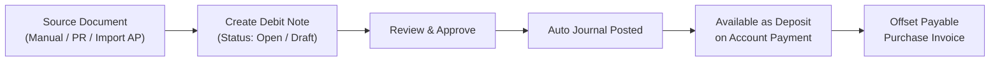
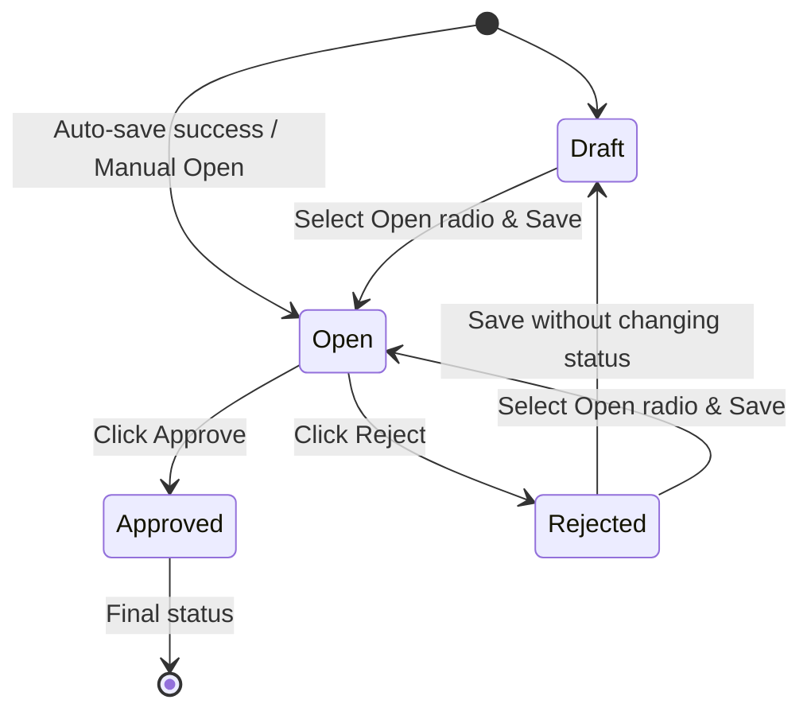
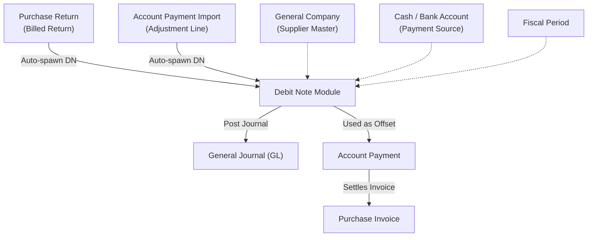

### 📦 Module/Feature: Debit Note

**Business definition:**
**Debit Note (DN)** is a company claim or credit deposit to a **Supplier** (Accounts Payable / AP side). It records value the supplier “owes back” to the company, later used in **Account Payment (AP)** to offset **Purchase Invoice (PI)** payment — with little or no direct cash/bank outlay.

Internally in OlshopERP, Debit Note is a *Payment* sub-type with code prefix **DN**. It mirrors **Credit Note (CN)** on the customer (Accounts Receivable / AR) side.

### 🔑 Key Terms

* **Payment Source:** Cash/bank detail lines that “fund” a manually created Debit Note.
* **Return Deposit:** Read-only detail line created automatically when the Debit Note comes from a *billed* Purchase Return.
* **Paid:** Accumulated DN value already used on *Approved* Account Payment transactions.
* **Outstanding:** Remaining DN balance still available to offset future payables.
* **Transaction Reference (Trx Ref):** System link to the source document (e.g. Purchase Return or Account Payment).
* **Reference Document (Ref Doc):** Free-text note for an external document number or manual remark.
* **Auto-Save Last Transaction:** On *Create*, the system fills data from the last Debit Note, auto-saves, then opens *Edit*.

### 🧮 Business Logic & Formulas

#### Total Amount, Paid & Outstanding

* **Manual DN total:** Total Amount = sum of Payment Source amounts.
* **Purchase Return DN total:** Total Amount = Purchase Return Grand Total.
* **Outstanding:** Outstanding = Total Amount − Paid.

#### Eligibility on Account Payment

To use a Debit Note as a payable offset on Account Payment, **all** of these must hold:

* Debit Note status is **Approved**.
* **Supplier** matches the Account Payment supplier.
* **Currency** matches the Account Payment currency.
* Debit Note **transaction date** ≤ Account Payment transaction date.
* **Outstanding** \> 0.

#### Journal impact on Approval

| Creation path | Debit account | Credit account |
| :---- | :---- | :---- |
| **Manual (Cash/Bank)** | Deposit to Supplier | Selected Cash/Bank account |
| **Purchase Return** | Deposit of Purchase Return | Inventory COA |

### 📊 Field Reference

#### Header & basic info

| Field | Type | Description | Rules |
| :---- | :---- | :---- | :---- |
| **Transaction Code** | String | Unique code with DN prefix. | Auto-generated; *disabled* after create. |
| **Transaction Date** | Date | Effective DN date. | Required; must fall in an *Open* Fiscal Period. |
| **Supplier** | Dropdown | Vendor receiving the deposit claim. | Required; General Company marked as Supplier only. |
| **Reference Doc** | String | External doc note/number. | Optional; max 150 chars; manual path. |
| **Trx Reference** | Link | Link to source PR or AP. | *Disabled*; auto-filled for PR or Import AP. |
| **Currency** | Dropdown | Transaction currency. | Required; needs an active Cash/Bank pair. |
| **Exchange Rate** | Numeric | Rate to base currency (IDR). | Required; \> 0. Forced to 1 for IDR. |
| **Description** | Text | Transaction notes. | Optional; max 150 chars. Auto-format for PR source. |
| **Attachment** | File | Supporting file. | Optional. |

#### Payment Source (Manual & Import AP)

| Field | Type | Description | Rules |
| :---- | :---- | :---- | :---- |
| **Cash/Bank Account** | Dropdown | Account funding the claim. | Required; active & same currency; no duplicates. |
| **Amount** | Numeric | Amount from that account. | Required; \> 0 and ≤ available Cash/Bank balance. |

#### Return Deposit (Purchase Return path)

| Field | Type | Description | Rules |
| :---- | :---- | :---- | :---- |
| **Deposit Value** | Numeric | Return claim value from Purchase Return. | *Read-only*; from return Grand Total. |

### 🔄 Workflow



**Steps:**

> 1. **Initiate:** Create manually, auto from an approved Purchase Return, or from Account Payment import *adjustment*.
> 2. **Review:** Check header, rate, and detail lines (Payment Source or Return Deposit).
> 3. **Approve:** Approver confirms; system validates fiscal period & COA, then posts the journal.
> 4. **Use deposit:** *Approved* DN appears as a payment source on Account Payment.
> 5. **Offset payable:** DN deposit value settles Purchase Invoice amounts.

🖼️ **[IMAGE PLACEHOLDER]** — Debit Note menu location in Finance & Account Payable sidebar.

### 🏷️ Status Lifecycle



| Status | Meaning | Next actions |
| :---- | :---- | :---- |
| **Draft** | Fully editable. | Move to **Open** then save; or **Delete**. |
| **Open** | Waiting for approval. | **Approve**, **Reject**, or **Delete**. |
| **Approved** | Final. Journal posted; deposit ready on Account Payment. | **Show** and **Print** only. (*Void/Closed not available yet*). |
| **Rejected** | Rejected; needs fixes. | Back to **Draft** (save without status change) or **Open** (select Open then save). |

> ⚠️ **Important:** Debit Note lifecycle currently ends at **Approved**. **Void** and **Closed** are **not available**. Approved documents cannot be cancelled, unapproved, or deleted.

#### Access matrix (example roles)

| Role / feature | Create | Read | Update | Delete | Approval |
| :---- | :---- | :---- | :---- | :---- | :---- |
| **AP Clerk** | Yes | Yes | Yes (Draft/Open/Rejected) | Yes (Draft/Open/Rejected) | No |
| **Finance Manager** | Yes | Yes | Yes (Draft/Open/Rejected) | Yes (Draft/Open/Rejected) | Yes |
| **System Administrator** | Yes | Yes | Yes (Draft/Open/Rejected) | Yes (Draft/Open/Rejected) | Yes |

### 📍 Menu Location

* **Navigation:** Finance → Account Payable → Debit Note
* **UI route:** `/accounting/debit-note`

### 🔀 Three Creation Paths

| Attribute | Path 1: Manual form | Path 2: Purchase Return | Path 3: Import AP |
| :---- | :---- | :---- | :---- |
| **Initial status** | Open / Draft | Open | Open |
| **Approval** | Manual Approve | Manual Approve | Manual Approve |
| **Detail structure** | **Payment Source** (Cash/Bank) | **Return Deposit** (*read-only*) | **Payment Source** (Deposit) |
| **Trx Reference** | Empty / manual note | Purchase Return code | Account Payment code |
| **Auto-Save** | Fills from last DN | N/A (PR event) | N/A (import) |

🖼️ **[IMAGE PLACEHOLDER]** — Debit Note header form (Supplier, Date, Currency, Rate).

#### Path 1 — Manual

> 1. Open **Finance → Account Payable → Debit Note**, click **Create**.
> 2. System runs **Auto-save**: if a prior DN exists, header is filled & saved, then you land on **Edit**.
> 3. Add **Payment Source** rows — pick an active Cash/Bank with matching currency.
> 4. Enter **Amount** (system checks available balance).
> 5. Select **Open**, click **Save**.
> 6. Click **Approve**.

🖼️ **[IMAGE PLACEHOLDER]** — Payment Source section (Cash/Bank & Amount).

> 🛑 **Warning: Auto-save on Create**  
> The system tries to save initial data from the last Debit Note. If background validation fails (closed Fiscal Period or no matching bank account), auto-save fails and you **stay on Create** with an error message.

#### Path 2 — From Purchase Return

> 1. A *billed* **Purchase Return** is approved.
> 2. The system auto-creates a Debit Note in **Open**.
> 3. **Return Deposit** is filled with the return value.
> 4. Open the document and **Approve** manually.

🖼️ **[IMAGE PLACEHOLDER]** — Return Deposit section (read-only) on a PR-sourced DN.

#### Path 3 — From Account Payment import

> 1. Upload an AP Import file with an *Adjustment* line of type DEBIT NOTE.
> 2. The system creates an **Open** Debit Note tied to that AP code.
> 3. Open Debit Note and **Approve**.

### 💳 Using DN on Account Payment

An **Approved** Debit Note with **Outstanding \> 0** can offset payables.

**Example:**

```text
Purchase Invoice total           : Rp 10,000,000
Debit Note offset (Approved)     : Rp  2,000,000
Remaining Cash/Bank payment      : Rp  8,000,000
DN Outstanding after transaction : Rp          0
Purchase Invoice status          : Paid
```

> 1. Open **Account Payment** and pick the same **Supplier**.
> 2. In AP Payment Source, add a **Debit Note** line.
> 3. Select the **Debit Note** number.
> 4. Enter an amount ≤ Outstanding.
> 5. Remaining invoice balance can combine with Cash/Bank (*multi-source*).
> 6. **Approve** Account Payment — **Paid** increases, **Outstanding** decreases.

🖼️ **[IMAGE PLACEHOLDER]** — Selecting Debit Note as a payment source on Account Payment.

### 📑 Datalist & Export

| Column | Notes |
| :---- | :---- |
| **Trx Code / Date** | Link to Detail / Edit. |
| **Supplier** | Supplier name (General Company). |
| **Description** | Truncated text; hover for full tooltip. |
| **Trx Ref** | Hyperlink to Purchase Return / Account Payment. |
| **Curr / Rate** | Currency and exchange rate. |
| **Total Amount** | DN total value. |
| **Paid** | Accumulated use on Approved AP. |
| **Outstanding** | Remaining usable deposit. |
| **Trx Status** | Draft / Open / Approved / Rejected badge. |
| **Journal** | Journal link after Approved. |

🖼️ **[IMAGE PLACEHOLDER]** — Debit Note datalist with status badges plus Paid & Outstanding columns.

**Export modes:**

* **Without Details** — one row per DN document.
* **With Details** — Payment Source (cash/bank) detail rows.
* **Active Page** — current page only.

> 🛑 **Warning: Exporting Purchase Return DNs**  
> **With Details** only reads the *Payment Source* table. PR-sourced DNs use *Return Deposit*, so detail rows are **empty** in Excel. Use **Without Details** for return DN summaries.

### 🛡️ Business Rules & Validations

* **If** the date is outside an *Open* Fiscal Period, **then** Create / Update / Approve are rejected.
* **If** Supplier is not a General Company or COA setup is incomplete, **then** the pick is rejected.
* **If** currency has no active Cash/Bank pair, **then** Create/Update is rejected.
* **If** exchange rate ≤ 0, **then** save is rejected.
* **If** you Approve with neither Payment Source nor Return Deposit, **then** Approve is rejected.
* **If** Payment Source Amount ≤ 0, **then** the detail row cannot be saved.
* **If** the same Cash/Bank account is duplicated on one DN, **then** a duplicate error is shown.
* **If** Amount exceeds available Cash/Bank balance, **then** *Entered amount exceeds available balance / Insufficient balance*.
* **If** you try to delete an **Approved** document, **then** it is rejected.

### 🛑 Known Limitations

* **Export With Details** only reads Payment Source — return DNs may have no detail rows in Excel.
* **Legacy supplier name:** older rows may still show a Store name; new DNs require a General Company Supplier.
* **Cash/Bank balance check** runs when adding/editing Payment Source, **not** automatically again on Approve.
* **Rejected → save without changing the status radio** returns the document to **Draft**.

### 🔗 Related Menus



| Menu | Role |
| :---- | :---- |
| **Purchase Invoice (PI)** | Payable offset via Account Payment using DN. |
| **Purchase Return (PR)** | Auto DN source from billed returns. |
| **Account Payment (AP)** | Where Approved DN is used to offset payables. |
| **General Journal** | Receives the journal when DN is approved. |
| **General Company** | Valid Supplier master. |
| **Cash/Bank Account** | Funding source for manual DNs. |
| **Fiscal Period** | Transaction date gate. |
| **Credit Note (CN)** | Mirror claim on the AR side. |

### 🛠️ Troubleshooting

| Symptom | Likely cause | What to do |
| :---- | :---- | :---- |
| Create / Auto-save fails | Date outside Open Fiscal Period, or no matching Cash/Bank currency | Use an open period date; create an active Cash/Bank with matching currency. |
| Approve not clickable | Status is not Open, or no Payment Source / Return Deposit | Set Open and complete details. |
| Cash/Bank missing from picker | Currency mismatch or inactive account | Match header currency; ensure account is active. |
| Amount rejected | Exceeds available Cash/Bank balance | Lower the amount or pick another account. |
| DN missing on Account Payment | Not Approved, Supplier/Currency mismatch, or Outstanding = 0 | Approve DN; align Supplier, Currency, and dates with AP. |

### ❓ FAQ

* **Q: Why does Create jump straight to Edit?**
  * **A:** *Auto-save* loads the last DN. If it fails, you stay on Create with an error.
* **Q: Can I create a DN for a marketplace store?**
  * **A:** No. Supplier must be a General Company marked as Supplier.
* **Q: Reference Doc vs Transaction Reference?**
  * **A:** **Reference Doc** is free manual text. **Transaction Reference** is the system link to the source PR or AP.
* **Q: When can a DN offset payables?**
  * **A:** After **Approved**, selected on Account Payment, matching Supplier & Currency, DN date ≤ AP date, Outstanding \> 0.
* **Q: What happens if I edit a Rejected DN and save?**
  * **A:** Without changing the status radio → back to **Draft**. Choose **Open** then save to resubmit.
* **Q: Can an Approved DN be Voided/Cancelled?**
  * **A:** Not yet. Lifecycle ends at **Approved**.
* **Q: Why is Payment Source empty on a Purchase Return DN?**
  * **A:** Expected — it uses **Return Deposit** (*read-only*), not Cash/Bank.
