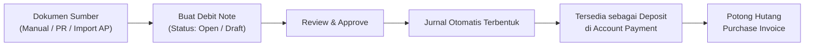
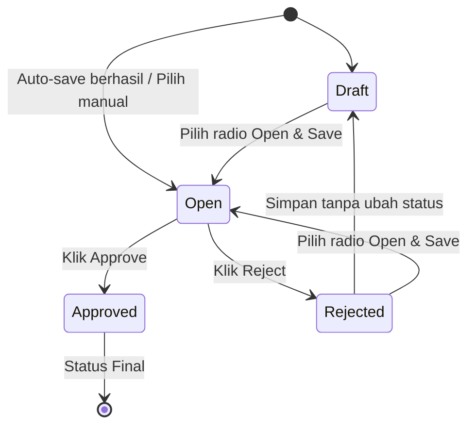
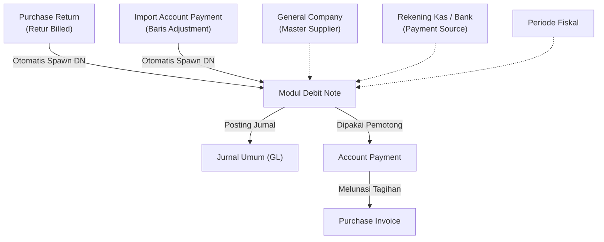

### 📦 Modul/Fitur: Debit Note

**Definisi Bisnis:**
**Debit Note (DN)** adalah dokumen klaim atau deposit kredit perusahaan kepada pihak **Supplier** (sisi *Account Payable* / AP). Dokumen ini mencatat nilai yang "berutang" balik oleh supplier kepada perusahaan, yang nantinya dipakai di menu **Account Payment (AP)** untuk memotong pembayaran **Purchase Invoice (PI)** tanpa (atau mengurangi) pengeluaran kas/bank secara langsung.

Secara internal OlshopERP, Debit Note adalah sub-tipe transaksi *Payment* dengan prefix kode **DN**. Fitur ini berfungsi sebagai cermin (*mirror*) dari **Credit Note (CN)** di sisi pelanggan (*Account Receivable* / AR).

### 🔑 Istilah Kunci

* **Payment Source:** Baris rincian kas/bank yang "mendanai" Debit Note yang dibuat secara manual.
* **Return Deposit:** Baris detail *read-only* yang otomatis terbentuk jika Debit Note berasal dari Purchase Return yang sudah *billed*.
* **Paid:** Total akumulasi nilai Debit Note yang sudah dipakai pada Account Payment berstatus *Approved*.
* **Outstanding:** Sisa saldo Debit Note yang masih belum dipakai dan tersedia untuk pemotongan hutang berikutnya.
* **Transaction Reference (Trx Ref):** Link referensi sistem ke dokumen asal (contoh: Purchase Return atau Account Payment).
* **Reference Document (Ref Doc):** Catatan teks bebas untuk nomor dokumen eksternal atau catatan manual.
* **Auto-Save Last Transaction:** Perilaku saat tombol *Create* diklik — sistem mengisi data dari Debit Note terakhir, menyimpan otomatis, lalu mengarahkan ke halaman *Edit*.

### 🧮 Logika Bisnis & Formula

#### Kalkulasi Total Amount, Paid, & Outstanding

* **Total DN Manual:** Total Amount = jumlah nilai baris Payment Source.
* **Total DN dari Purchase Return:** Total Amount = Grand Total Purchase Return.
* **Outstanding:** Outstanding = Total Amount − Paid.

#### Syarat kelayakan di Account Payment

Agar Debit Note bisa dipakai sebagai pemotong hutang di Account Payment, semua kondisi berikut **wajib** terpenuhi:

* Status Debit Note **Approved**.
* **Supplier** sama dengan Supplier di Account Payment.
* **Currency** sama dengan mata uang Account Payment.
* **Tanggal transaksi** DN ≤ tanggal transaksi Account Payment.
* **Outstanding** \> 0.

#### Dampak jurnal saat Approval

| Jalur pembuatan | Rekening Debit | Rekening Kredit |
| :---- | :---- | :---- |
| **Manual (Kas/Bank)** | Deposit to Supplier | Rekening Kas/Bank yang dipilih |
| **Purchase Return** | Deposit of Purchase Return | Akun COA Persediaan (Inventory) |

### 📊 Referensi Field

#### Header & informasi dasar

| Field | Tipe | Deskripsi | Batasan |
| :---- | :---- | :---- | :---- |
| **Transaction Code** | String | Kode unik dengan prefix DN. | Auto-generated; *disabled* setelah dibuat. |
| **Transaction Date** | Date | Tanggal efektif DN. | Wajib; harus di Fiscal Period *Open*. |
| **Supplier** | Dropdown | Vendor penerima klaim deposit. | Wajib; hanya General Company yang ditandai Supplier. |
| **Reference Doc** | String | Catatan / nomor dokumen eksternal. | Opsional; maks. 150 karakter; jalur manual. |
| **Trx Reference** | Link | Link ke PR atau AP asal. | *Disabled*; terisi otomatis untuk sumber PR atau Import AP. |
| **Currency** | Dropdown | Mata uang transaksi. | Wajib; harus punya pasangan rekening Kas/Bank aktif. |
| **Exchange Rate** | Numeric | Kurs ke mata uang utama (IDR). | Wajib; \> 0. Dipaksa 1 untuk IDR. |
| **Description** | Text | Keterangan transaksi. | Opsional; maks. 150 karakter. Auto-format untuk sumber PR. |
| **Attachment** | File | Lampiran pendukung. | Opsional. |

#### Payment Source (jalur Manual & Import AP)

| Field | Tipe | Deskripsi | Batasan |
| :---- | :---- | :---- | :---- |
| **Kas/Bank Account** | Dropdown | Rekening yang mendanai klaim. | Wajib; aktif & currency sama; tidak boleh duplikat. |
| **Amount** | Numeric | Nominal dari rekening tersebut. | Wajib; \> 0 dan ≤ sisa saldo Kas/Bank. |

#### Return Deposit (jalur Purchase Return)

| Field | Tipe | Deskripsi | Batasan |
| :---- | :---- | :---- | :---- |
| **Deposit Value** | Numeric | Nilai klaim retur dari Purchase Return. | *Read-only*; dari Grand Total retur. |

### 🔄 Workflow & Alur Sistem



**Keterangan langkah:**

> 1. **Inisiasi:** Dibuat manual, otomatis dari Purchase Return yang disetujui, atau hasil import *adjustment* Account Payment.
> 2. **Pemeriksaan:** Cek header, kurs, dan baris detail (Payment Source atau Return Deposit).
> 3. **Approval:** Approver menyetujui; sistem validasi fiscal period & COA, lalu membentuk jurnal.
> 4. **Penggunaan deposit:** DN *Approved* muncul sebagai sumber dana di Account Payment.
> 5. **Pemotongan hutang:** Nilai deposit DN dipakai melunasi Purchase Invoice.

🖼️ **[IMAGE PLACEHOLDER]** — Lokasi menu Debit Note pada sidebar Finance & Account Payable.

### 🏷️ Siklus Status



| Status | Definisi | Tindakan selanjutnya |
| :---- | :---- | :---- |
| **Draft** | Masih dapat diubah penuh. | Ubah ke **Open** lalu simpan; atau **Delete**. |
| **Open** | Menunggu approval. | **Approve**, **Reject**, atau **Delete**. |
| **Approved** | Final. Jurnal terbentuk; deposit siap di Account Payment. | Hanya **Show** dan **Print**. (*Void/Closed belum tersedia*). |
| **Rejected** | Ditolak; perlu perbaikan. | Kembali ke **Draft** (simpan tanpa ubah status) atau **Open** (pilih radio Open lalu simpan). |

> ⚠️ **Catatan penting:** Siklus Debit Note saat ini berakhir di **Approved**. Status **Void** maupun **Closed** **belum tersedia**. Dokumen Approved tidak dapat dibatalkan, di-unapprove, atau dihapus.

#### Matriks hak akses (contoh peran)

| Role / fitur | Create | Read | Update | Delete | Approval |
| :---- | :---- | :---- | :---- | :---- | :---- |
| **AP Clerk** | Ya | Ya | Ya (Draft/Open/Rejected) | Ya (Draft/Open/Rejected) | Tidak |
| **Finance Manager** | Ya | Ya | Ya (Draft/Open/Rejected) | Ya (Draft/Open/Rejected) | Ya |
| **System Administrator** | Ya | Ya | Ya (Draft/Open/Rejected) | Ya (Draft/Open/Rejected) | Ya |

### 📍 Lokasi Menu

* **Navigasi:** Finance → Account Payable → Debit Note
* **Route UI:** `/accounting/debit-note`

### 🔀 Tiga Jalur Pembuatan DN

| Atribut | Jalur 1: Form Manual | Jalur 2: Purchase Return | Jalur 3: Import AP |
| :---- | :---- | :---- | :---- |
| **Status awal** | Open / Draft | Open | Open |
| **Persetujuan** | Approve manual | Approve manual | Approve manual |
| **Struktur detail** | **Payment Source** (Kas/Bank) | **Return Deposit** (*read-only*) | **Payment Source** (Deposit) |
| **Trx Reference** | Kosong / catatan manual | Kode Purchase Return | Kode Account Payment |
| **Auto-Save** | Mengisi data DN terakhir | N/A (via event PR) | N/A (via import) |

🖼️ **[IMAGE PLACEHOLDER]** — Form header Debit Note (Supplier, Tanggal, Currency, Rate).

#### Jalur 1 — Manual

> 1. Buka **Finance → Account Payable → Debit Note**, klik **Create**.
> 2. Sistem menjalankan **Auto-save**: jika ada DN sebelumnya, header terisi & tersimpan, lalu dialihkan ke **Edit**.
> 3. Tambah baris **Payment Source** — pilih Kas/Bank aktif ber-currency sama.
> 4. Isi **Amount** (sistem validasi sisa saldo).
> 5. Pilih radio **Open**, klik **Save**.
> 6. Klik **Approve**.

🖼️ **[IMAGE PLACEHOLDER]** — Section Payment Source (Kas/Bank & Amount).

> 🛑 **Warning: Auto-save saat Create**  
> Sistem mencoba menyimpan data awal dari Debit Note terakhir. Jika validasi gagal (Fiscal Period tutup atau rekening bank tidak tersedia), auto-save gagal dan pengguna **tetap di form Create** dengan pesan error.

#### Jalur 2 — Dari Purchase Return

> 1. **Purchase Return** billed disetujui.
> 2. Sistem otomatis membentuk Debit Note berstatus **Open**.
> 3. Section **Return Deposit** terisi sebesar nilai retur.
> 4. Buka dokumen lalu **Approve** secara manual.

🖼️ **[IMAGE PLACEHOLDER]** — Section Return Deposit (read-only) pada DN dari Purchase Return.

#### Jalur 3 — Dari Import Account Payment

> 1. Upload Import AP berisi baris *Adjustment* bertipe DEBIT NOTE.
> 2. Sistem membuat Debit Note **Open** berpatokan kode AP tersebut.
> 3. Buka menu Debit Note dan **Approve**.

### 💳 Cara Pakai DN di Account Payment

Debit Note **Approved** dengan **Outstanding \> 0** dapat memotong hutang.

**Contoh:**

```text
Total Tagihan Purchase Invoice   : Rp 10.000.000
Pemotongan Debit Note (Approved) : Rp  2.000.000
Sisa Pembayaran Kas/Bank         : Rp  8.000.000
Sisa Outstanding DN post-trx     : Rp          0
Status Purchase Invoice          : Lunas (Paid)
```

> 1. Buka **Account Payment**, pilih **Supplier** yang sama.
> 2. Pada Payment Source AP, tambah baris bertipe **Debit Note**.
> 3. Pilih nomor **Debit Note**.
> 4. Masukkan nominal ≤ Outstanding.
> 5. Sisa tagihan bisa digabung Kas/Bank (*multi-source*).
> 6. **Approve** Account Payment — **Paid** naik, **Outstanding** turun.

🖼️ **[IMAGE PLACEHOLDER]** — Pemilihan Debit Note sebagai sumber dana di Account Payment.

### 📑 Datalist & Export

| Kolom | Catatan |
| :---- | :---- |
| **Trx Code / Date** | Link ke Detail / Edit. |
| **Supplier** | Nama Supplier (General Company). |
| **Description** | Potongan teks; hover = tooltip lengkap. |
| **Trx Ref** | Hyperlink ke Purchase Return / Account Payment. |
| **Curr / Rate** | Mata uang dan kurs. |
| **Total Amount** | Total nilai DN. |
| **Paid** | Akumulasi pemakaian di AP Approved. |
| **Outstanding** | Sisa deposit yang masih bisa dipakai. |
| **Trx Status** | Badge Draft / Open / Approved / Rejected. |
| **Journal** | Link jurnal setelah Approved. |

🖼️ **[IMAGE PLACEHOLDER]** — Datalist Debit Note dengan badge status serta kolom Paid & Outstanding.

**Mode export:**

* **Without Details** — 1 baris per dokumen DN.
* **With Details** — baris detail *Payment Source* (kas/bank).
* **Active Page** — hanya data di halaman aktif.

> 🛑 **Warning: Export DN dari Purchase Return**  
> Mode **With Details** hanya membaca tabel *Payment Source*. DN hasil Purchase Return memakai *Return Deposit*, jadi baris detailnya **kosong** di Excel. Gunakan **Without Details** untuk rekap DN retur.

### 🛡️ Aturan Bisnis & Validasi

* **Jika** tanggal di luar Fiscal Period *Open*, **maka** Create / Update / Approve ditolak.
* **Jika** Supplier bukan General Company atau COA belum lengkap, **maka** pilihan ditolak.
* **Jika** currency tidak punya Kas/Bank aktif, **maka** Create/Update ditolak.
* **Jika** kurs ≤ 0, **maka** penyimpanan ditolak.
* **Jika** Approve tanpa Payment Source maupun Return Deposit, **maka** Approve ditolak.
* **Jika** Amount Payment Source ≤ 0, **maka** baris tidak bisa disimpan.
* **Jika** rekening Kas/Bank sama diduplikasi dalam satu DN, **maka** error duplikasi.
* **Jika** Amount melebihi sisa saldo Kas/Bank, **maka** pesan *Entered amount exceeds available balance / Insufficient balance*.
* **Jika** mencoba hapus dokumen **Approved**, **maka** ditolak.

### 🛑 Keterbatasan yang Diketahui

* **Export With Details** hanya membaca Payment Source — DN retur bisa tanpa rincian di Excel.
* **Nama Supplier legacy:** data lama mungkin masih menampilkan nama Store; DN baru wajib Supplier General Company.
* **Validasi saldo Kas/Bank** dijalankan saat tambah/ubah Payment Source, **tidak** diulang otomatis saat Approve.
* **Rejected → simpan tanpa ubah radio status** mengembalikan dokumen ke **Draft**.

### 🔗 Hubungan dengan Menu Lain



| Menu | Peran |
| :---- | :---- |
| **Purchase Invoice (PI)** | Hutang yang dipotong di Account Payment memakai DN. |
| **Purchase Return (PR)** | Sumber DN otomatis dari retur billed. |
| **Account Payment (AP)** | Tempat DN Approved dipakai sebagai pemotong hutang. |
| **Jurnal Umum** | Menerima jurnal saat DN di-approve. |
| **General Company** | Master Supplier yang sah. |
| **Cash/Bank Account** | Sumber dana DN manual. |
| **Fiscal Period** | Gate tanggal transaksi. |
| **Credit Note (CN)** | Mirror klaim di sisi AR. |

### 🛠️ Troubleshooting

| Gejala | Penyebab | Solusi |
| :---- | :---- | :---- |
| Gagal Create / Auto-save error | Tanggal di luar Fiscal Period Open, atau tidak ada Kas/Bank currency cocok | Pastikan tanggal di periode terbuka; buat Kas/Bank aktif dengan currency sesuai. |
| Approve tidak bisa diklik | Status bukan Open, atau belum ada Payment Source / Return Deposit | Ubah ke Open dan lengkapi detail. |
| Kas/Bank tidak muncul | Currency beda atau rekening tidak aktif | Samakan currency header & rekening; pastikan aktif. |
| Nominal ditolak | Melebihi sisa saldo Kas/Bank | Kurangi amount atau pilih rekening lain. |
| DN tidak muncul di Account Payment | Belum Approved, beda Supplier/Currency, atau Outstanding = 0 | Approve DN; pastikan Supplier, Currency, tanggal sesuai AP. |

### ❓ FAQ

* **Q: Kenapa Create langsung ke halaman Edit?**
  * **A:** Fitur *Auto-save* mengambil data dari DN terakhir. Jika gagal, Anda tetap di form Create dengan pesan error.
* **Q: Bisa buat DN untuk toko marketplace?**
  * **A:** Tidak. Supplier wajib General Company yang ditandai sebagai Supplier.
* **Q: Beda Reference Doc vs Transaction Reference?**
  * **A:** **Reference Doc** = teks bebas manual. **Transaction Reference** = link otomatis ke PR atau AP asal.
* **Q: Kapan DN bisa memotong hutang?**
  * **A:** Setelah **Approved**, dipilih di Account Payment, Supplier & Currency sama, tanggal DN ≤ AP, Outstanding \> 0.
* **Q: Apa yang terjadi jika Rejected diedit lalu disimpan?**
  * **A:** Tanpa ubah radio status → kembali **Draft**. Pilih **Open** lalu simpan untuk ajukan ulang.
* **Q: Approved bisa Void/Cancel?**
  * **A:** Belum. Siklus berakhir di **Approved**.
* **Q: Kenapa Payment Source kosong pada DN dari Purchase Return?**
  * **A:** Normal — memakai section **Return Deposit** (*read-only*), bukan Kas/Bank.
