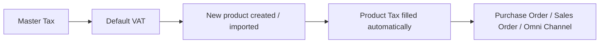
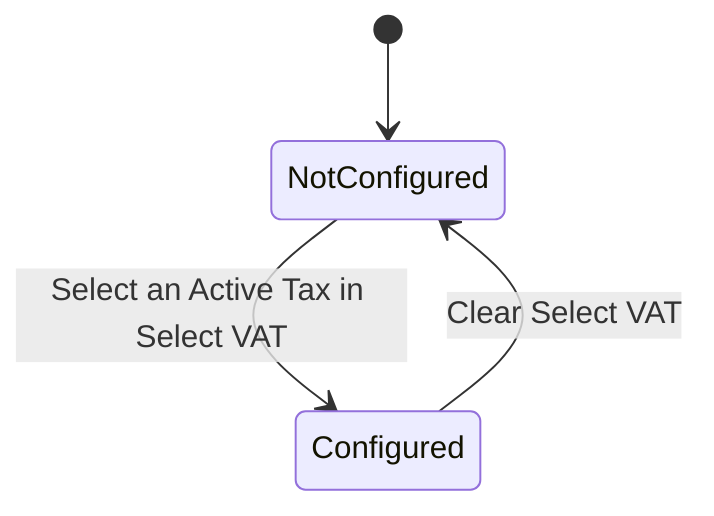
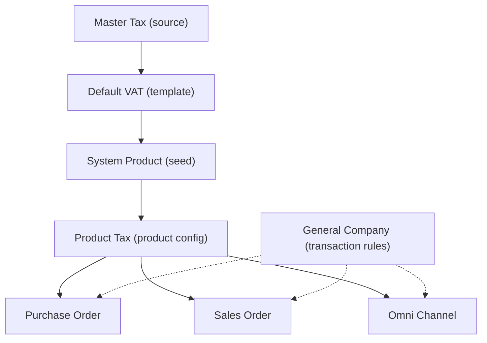

### 📦 Module/Feature: Default VAT

**Business definition:**
**Default VAT** is the company default tax template for **Purchase** and **Sales**, linked directly to master **Tax**. Finance and Accounting teams use it as a seed template. When a new item or **System Product** is created or imported, the system automatically copies Value Added Tax (**VAT** / **PPN**) settings from this module onto that product. It is only an initial product template — **not** a transaction tax calculator.

### 🔑 Key Terms

| Term | Definition & system role |
| :---- | :---- |
| **Select VAT** | Picker for the master **Tax** used as the default for Purchase or Sales. |
| **Mirror** | Display-only fields (Code, Name, Tariff, COA, etc.) that reflect master **Tax** and cannot be edited here. |
| **Auto Add Trx** | Toggle that controls whether tax is automatically attached on related product transactions. |
| **Include / Exclude** | Pricing mode: **Include** means price already includes VAT; **Exclude** means VAT is calculated separately outside the price. |
| **Seed** | Automatic copy of tax settings from **Default VAT** onto a newly created or imported **System Product**. |

### 🎯 When & Why to Use

Configure this module during first-time ERP setup, or when the organization changes its standard tax policy. It keeps every new product’s tax attributes consistent without entering them one by one.

### 📋 Prerequisites

| Prerequisite | Source module | Notes |
| :---- | :---- | :---- |
| Master Tax is **Active** | **Tax** | Soft-deleted or *Inactive* Tax rows are rejected when selected. |
| COA accounts configured | **Tax** | Purchase COA or Sales COA must already be mapped on master **Tax**. This module only **mirrors** those accounts. |

### 🔄 Place in the Business Flow

Settings flow from master **Tax** into **Default VAT**, then are copied automatically onto new **System Product** rows. Transaction documents later read the product’s own tax configuration.

**Steps:**

> 1. **Master Tax:** Main rate and Chart of Accounts (COA) setup.
> 2. **Default VAT:** Choose default templates for Purchase and Sales.
> 3. **New product created / imported:** Triggers seeding.
> 4. **Product Tax filled automatically:** Tax data stored on the product.
> 5. **Purchase Order / Sales Order / Omni Channel:** Read tax attached to the product.

### 📍 Menu Location & Workspace

* **Navigation:** Finance Accounting → Master → Default VAT
* **UI route:** `/accounting/default-vat`

🖼️ **[IMAGE PLACEHOLDER]** — Default VAT page with Purchase VAT and Sales VAT sections, plus sidebar checklist.

**Display note:** This page is **not** a datalist. It is a single form split into two blocks: **Purchase VAT** and **Sales VAT**.

### 🏷️ Status Lifecycle

There is no approval workflow. Form changes are saved automatically (*autosave*).

| Status | Editable? | System behavior |
| :---- | :---- | :---- |
| **Not configured** | No | Mirror fields inactive, Tax picker empty, sidebar checklist unchecked. |
| **Configured** | Yes | **VAT Type** and **Auto Add Trx** can be adjusted. Changes autosave. |

### ⚠️ Two Critical Rules

> ⚠️ **WARNING — two important Default VAT rules**

1. **Not a direct transaction calculator:** Documents such as **Purchase Order**, **Sales Order**, and **Omni Channel** transactions **do not** read **Default VAT** directly at runtime. They read tax already attached on each **System Product** (**Product Tax**).
2. **Not retroactive:** Changing or clearing **Default VAT** **only** affects products created or imported **after** that change. Existing products **do not** update automatically. Update older products manually in **System Product**.

### ⚙️ How to Use

#### A. Set Purchase VAT

> 1. Open **Default VAT** and focus on **Purchase VAT**.
> 2. In **Select VAT**, choose an *Active* Tax.
> 3. Set **VAT Type** (**Include** or **Exclude**) and **Auto Add Trx**. Changes save immediately.

🖼️ **[IMAGE PLACEHOLDER]** — Purchase VAT section with Select VAT, VAT Type, and Auto Add Trx.

#### B. Set Sales VAT

> 1. Open the **Sales VAT** section on the same page.
> 2. Choose a Tax in **Select VAT**. Mirror fields follow **Sales COA**.
> 3. Set **VAT Type** and **Auto Add Trx**.

🖼️ **[IMAGE PLACEHOLDER]** — Sales VAT section with the same fields, mirroring Sales COA.

#### C. Verify

> 1. Create a new **System Product** or import a test product.
> 2. Open the product in **System Product** and confirm Purchase and/or Sales tax rows were filled from the **Default VAT** template.

### 📊 Field Reference

#### Purchase VAT

| Field | Editable? | Type | Description & rules |
| :---- | :---- | :---- | :---- |
| **Select VAT** | Yes | Dropdown | Choose an Active **Tax**. Clearing this field **deletes** the Purchase VAT configuration. |
| **VAT Type** | Yes | Include/Exclude | Tax calculation mode. Default: *Include*. Enabled after Tax is selected. |
| **Auto Add Trx** | Yes | Toggle | Whether VAT attaches automatically on transactions. Default: *Active (Yes)*. Enabled after Tax is selected. |
| **Code** | No | Read-only (mirror) | Tax code from master **Tax**. |
| **Name** | No | Read-only (mirror) | Tax name from master **Tax**. |
| **Tariff** | No | Read-only (mirror) | Rate % from master **Tax**. |
| **Coefficient** | No | Read-only (mirror) | Coefficient flag from master **Tax**. |
| **Description** | No | Read-only (mirror) | Extra notes from master **Tax**. |
| **Purchase COA** | No | Read-only (mirror) | Input-tax account from master **Tax**. |

#### Sales VAT

| Field | Editable? | Type | Description & rules |
| :---- | :---- | :---- | :---- |
| **Select VAT** | Yes | Dropdown | Default **Tax** for Sales. |
| **VAT Type** | Yes | Include/Exclude | Same behavior as Purchase VAT. |
| **Auto Add Trx** | Yes | Toggle | Same behavior as Purchase VAT. |
| **Code** | No | Read-only (mirror) | Tax code from master **Tax**. |
| **Name** | No | Read-only (mirror) | Tax name from master **Tax**. |
| **Tariff** | No | Read-only (mirror) | Rate % from master **Tax**. |
| **Coefficient** | No | Read-only (mirror) | Coefficient flag from master **Tax**. |
| **Description** | No | Read-only (mirror) | Notes from master **Tax**. |
| **Sales COA** | No | Read-only (mirror) | Output-tax account from master **Tax** (different from Purchase COA). |

### 🛡️ Business Rules & Validations

* **If** you clear **Select VAT** for Purchase or Sales, **then** the system deletes that configuration entry (it does not keep an empty row).
* **If** you select a soft-deleted **Tax**, **then** the system rejects it and warns that the tax was deleted.
* **If** you select an *Inactive* **Tax**, **then** the system rejects it and warns that the tax is inactive.
* **If** you select a valid *Active* **Tax**, **then** the system saves and updates the configuration automatically.
* **If** you update **VAT Type** or **Auto Add Trx** while the attached **Tax** was changed to *Inactive* or deleted by someone else, **then** the background check rejects the update.

### 🗑️ Clearing Select VAT

Clearing **Select VAT** for Purchase or Sales tells the system to **delete the configuration row**, not store NULL or an empty string. After that, new **System Product** creates/imports no longer receive automatic tax for that type.

### 🛑 Known Limitations

* **Duplicate config possible in DB:** There is no strict unique constraint at database level for one active entry per type per company. The UI consistently shows the most recently updated configuration.
* **No educational UI notice yet:** The page does not yet show an explicit visual tip that template updates only apply to future new products.

### 🔗 Related Menus

| Related module | Role vs Default VAT |
| :---- | :---- |
| **Tax** | Single source of truth. **Default VAT** only mirrors this data. |
| **System Product** | Receives seeded tax template on create/import. |
| **Purchase Order** | Reads tax from **System Product**, not from **Default VAT**. |
| **Sales Order** | Reads tax from **System Product**, not from **Default VAT**. |
| **Omni Channel** | Reads tax from **System Product**, not from **Default VAT**. |
| **General Company** | Extra transaction-bound rules that run alongside **Auto Add Trx**. |

### 🛠️ Troubleshooting

| Symptom | Likely cause | What to do |
| :---- | :---- | :---- |
| New products have no automatic VAT. | **Default VAT** for that context is empty / not set. | Open **Default VAT** and set **Select VAT** for the relevant section. |
| **Default VAT** changed, but old products did not. | Expected: not retroactive. | Update tax manually in **System Product**. |
| A Tax option is missing from **Select VAT**. | Tax is *Inactive* or soft-deleted. | Reactivate it in **Tax**. |
| Save/select is rejected for a Tax. | That Tax became *Inactive* or was deleted by someone else. | Choose another *Active* **Tax**. |

### ❓ FAQ

* **Q: Do Purchase Order or Sales Order read Default VAT directly?**
  * **A:** No. Transaction documents read tax attached on each **System Product**.
* **Q: Can one company have two Purchase Default VAT templates?**
  * **A:** By design, one active template per context. The UI always shows the latest configuration entry.
* **Q: If I change the VAT rate in Default VAT, do old products update?**
  * **A:** No. Changes apply only to items created or imported after the change is saved.
* **Q: How do I stop automatic VAT on new products?**
  * **A:** Clear **Select VAT** for that context. The template row is deleted, so new products are created without a default VAT.
* **Q: Can I change COA or tariff on the Default VAT page?**
  * **A:** No. Code, tariff, and COA are read-only mirrors. Change master data in **Tax**.

### 📑 See Also

* **Tax (Master Tax)** — VAT rates, Purchase COA, and Sales COA
* **System Product** — product catalog and per-item **Product Tax**
* **Purchase Order & Sales Order** — purchase and sales documents
* **General Company** — company preferences and transaction tax limits
