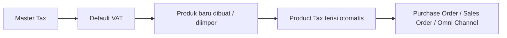
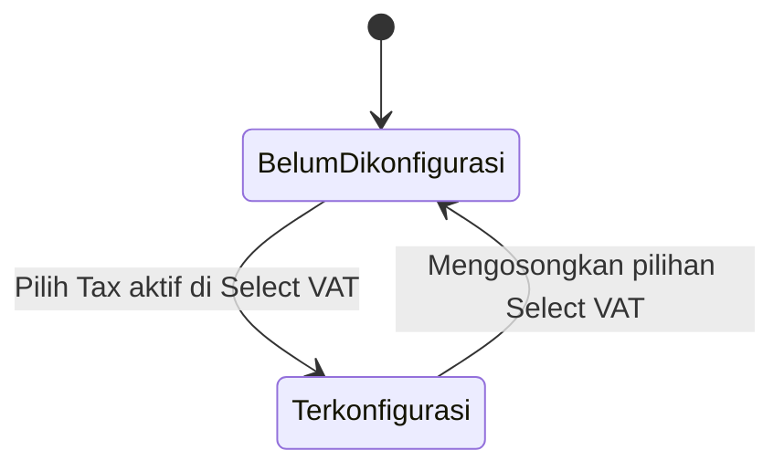
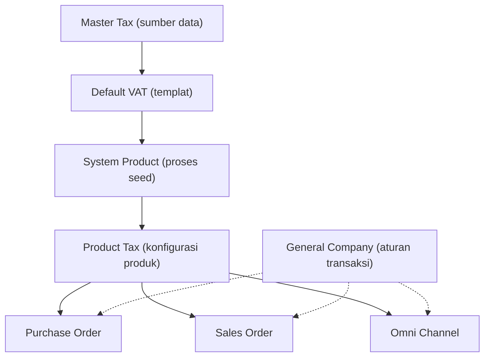

### 📦 Modul/Fitur: Default VAT

**Definisi Bisnis:**
**Default VAT** adalah modul templat pajak default perusahaan untuk konteks **Purchase** (pembelian) dan **Sales** (penjualan) yang terhubung langsung ke master **Tax**. Modul ini digunakan oleh tim Finance dan Accounting sebagai cetakan master (*seed template*). Saat item atau **System Product** baru dibuat atau diimpor, sistem secara otomatis menyalin konfigurasi Value Added Tax (**VAT**) / Pajak Pertambahan Nilai (**PPN**) dari modul ini ke produk tersebut. Modul ini murni berfungsi sebagai pembuat cetakan awal produk dan **bukan kalkulator pajak transaksi**.

### 🔑 Istilah Kunci

| Istilah | Definisi & fungsi sistem |
| :---- | :---- |
| **Select VAT** | Opsi pemilih master **Tax** yang difungsikan sebagai standar default untuk Purchase maupun Sales. |
| **Mirror** | Bidang tampilan data (seperti Code, Name, Tariff, COA) yang hanya mencerminkan data dari master **Tax** dan tidak dapat diedit di halaman ini. |
| **Auto Add Trx** | Sakelar otomatis untuk menentukan apakah pajak secara otomatis ditempelkan pada transaksi produk terkait. |
| **Include / Exclude** | Penentu mekanisme harga: **Include** berarti harga sudah termasuk PPN; **Exclude** berarti PPN dihitung terpisah di luar harga. |
| **Seed** | Proses otomatis menyalin konfigurasi pajak dari **Default VAT** ke data **System Product** yang baru dibuat atau diimpor. |

### 🎯 Kapan & Kenapa Dipakai

Modul ini dikonfigurasi saat pertama kali melakukan penyiapan (*setup*) sistem ERP perusahaan, atau ketika terjadi perubahan kebijakan pajak standar organisasi. Pengaturan ini memastikan setiap penambahan produk baru di dalam sistem secara otomatis memiliki atribut pajak yang konsisten tanpa perlu diinput secara manual satu per satu.

### 📋 Prasyarat

| Prasyarat | Sumber modul | Catatan khusus |
| :---- | :---- | :---- |
| Master Tax berstatus **Active** | Menu **Tax** | Entitas Tax yang dihapus (*soft-deleted*) atau berstatus *Inactive* akan ditolak saat dipilih. |
| Akun COA terkonfigurasi | Menu **Tax** | Purchase COA atau Sales COA harus sudah terhubung di master **Tax**. Modul ini hanya menampilkan (**mirror**) akun tersebut. |

### 🔄 Posisi dalam Alur Bisnis

Konfigurasi dari master **Tax** diteruskan ke **Default VAT**, lalu disalin secara otomatis ke **System Product** baru. Konfigurasi pajak produk inilah yang nantinya dibaca oleh dokumen transaksi.

**Keterangan langkah:**

> 1. **Master Tax:** Pengaturan tarif dan Chart of Accounts (COA) utama.
> 2. **Default VAT:** Pemilihan templat default untuk Purchase dan Sales.
> 3. **Produk baru dibuat / diimpor:** Pemicu proses *seeding*.
> 4. **Product Tax terisi otomatis:** Penyimpanan data pajak pada entitas produk.
> 5. **Purchase Order / Sales Order / Omni Channel:** Membaca data pajak yang melekat pada produk.

### 📍 Lokasi Menu & Workspace

* **Navigasi:** Finance Accounting → Master → Default VAT
* **Route UI:** `/accounting/default-vat`

🖼️ **[IMAGE PLACEHOLDER]** — Halaman Default VAT dengan dua bagian: Purchase VAT dan Sales VAT, beserta checklist di navigasi samping.

**Catatan tampilan:** Halaman ini **bukan** berbentuk daftar (*datalist*), melainkan satu formulir tunggal yang terbagi menjadi dua blok: **Purchase VAT** dan **Sales VAT**.

### 🏷️ Siklus Status

Modul ini tidak mengoperasikan alur persetujuan (*approval workflow*). Semua perubahan data pada formulir tersimpan secara otomatis (*autosave*).

| Status | Dapat diedit? | Perilaku sistem |
| :---- | :---- | :---- |
| **Belum dikonfigurasi** | Tidak | Opsi *mirror* nonaktif, pemilih Tax belum diatur, dan checklist navigasi belum tercentang. |
| **Terkonfigurasi** | Ya | Opsi **VAT Type** dan **Auto Add Trx** dapat disesuaikan. Perubahan tersimpan secara otomatis. |

### ⚠️ Dua Aturan Krusial

> ⚠️ **WARNING — dua aturan penting Default VAT**

1. **Bukan kalkulator transaksi langsung:** Dokumen transaksi seperti **Purchase Order**, **Sales Order**, maupun transaksi **Omni Channel** **tidak** membaca data dari modul **Default VAT** secara langsung saat transaksi berjalan. Sistem transaksi membaca konfigurasi pajak yang sudah melekat di masing-masing **System Product** (**Product Tax**).
2. **Tidak berlaku retroaktif:** Mengubah atau mengosongkan konfigurasi **Default VAT** **hanya** berdampak pada produk yang dibuat atau diimpor **setelah** perubahan tersebut. Produk yang sudah ada sebelumnya **tidak** mengalami perubahan konfigurasi pajak secara otomatis. Pembaruan produk lama harus dilakukan secara manual di modul **System Product**.

### ⚙️ Cara Penggunaan

#### A. Mengisi Purchase VAT

> 1. Buka menu **Default VAT**, lalu fokus pada bagian **Purchase VAT**.
> 2. Pada bidang **Select VAT**, pilih entitas pajak yang berstatus *Active*.
> 3. Sesuaikan opsi **VAT Type** (**Include** atau **Exclude**) dan sakelar **Auto Add Trx**. Perubahan akan langsung disimpan oleh sistem.

🖼️ **[IMAGE PLACEHOLDER]** — Bagian Purchase VAT dengan field Select VAT, VAT Type, dan Auto Add Trx.

#### B. Mengisi Sales VAT

> 1. Akses bagian **Sales VAT** pada halaman yang sama.
> 2. Pilih entitas pajak pada bidang **Select VAT**. Bidang *mirror* akan secara otomatis mengacu pada **Sales COA**.
> 3. Atur **VAT Type** dan sakelar **Auto Add Trx**.

🖼️ **[IMAGE PLACEHOLDER]** — Bagian Sales VAT dengan field yang sama, mengacu ke Sales COA.

#### C. Verifikasi pengujian

> 1. Buat satu data **System Product** baru atau lakukan impor produk uji coba.
> 2. Periksa detail produk pada modul **System Product** untuk memastikan baris konfigurasi pajak (*Purchase* dan/atau *Sales*) telah terisi secara otomatis sesuai templat **Default VAT**.

### 📊 Referensi Field

#### Purchase VAT

| Field | Status edit | Tipe / sifat | Deskripsi & batasan |
| :---- | :---- | :---- | :---- |
| **Select VAT** | Ya | Dropdown / editable | Memilih entitas **Tax** aktif. Mengosongkan bidang ini akan **menghapus** konfigurasi Purchase VAT. |
| **VAT Type** | Ya | Opsi (Include/Exclude) | Penentu perhitungan pajak. Default: *Include*. Aktif setelah Tax dipilih. |
| **Auto Add Trx** | Ya | Toggle | Menentukan PPN otomatis menempel di transaksi. Default: *Active (Yes)*. Aktif setelah Tax dipilih. |
| **Code** | Tidak | Read-only (mirror) | Kode pajak dari master **Tax**. |
| **Name** | Tidak | Read-only (mirror) | Nama pajak dari master **Tax**. |
| **Tariff** | Tidak | Read-only (mirror) | Persentase tarif dari master **Tax**. |
| **Coefficient** | Tidak | Read-only (mirror) | Koefisien pengali dari master **Tax**. |
| **Description** | Tidak | Read-only (mirror) | Catatan tambahan dari master **Tax**. |
| **Purchase COA** | Tidak | Read-only (mirror) | Akun Pajak Masukan dari master **Tax**. |

#### Sales VAT

| Field | Status edit | Tipe / sifat | Deskripsi & batasan |
| :---- | :---- | :---- | :---- |
| **Select VAT** | Ya | Dropdown / editable | Memilih entitas **Tax** default untuk konteks Sales. |
| **VAT Type** | Ya | Opsi (Include/Exclude) | Identik dengan konfigurasi Purchase VAT. |
| **Auto Add Trx** | Ya | Toggle | Identik dengan konfigurasi Purchase VAT. |
| **Code** | Tidak | Read-only (mirror) | Kode pajak dari master **Tax**. |
| **Name** | Tidak | Read-only (mirror) | Nama pajak dari master **Tax**. |
| **Tariff** | Tidak | Read-only (mirror) | Persentase tarif dari master **Tax**. |
| **Coefficient** | Tidak | Read-only (mirror) | Koefisien pengali dari master **Tax**. |
| **Description** | Tidak | Read-only (mirror) | Keterangan dari master **Tax**. |
| **Sales COA** | Tidak | Read-only (mirror) | Akun Pajak Keluaran dari master **Tax** (berbeda dari Purchase COA). |

### 🛡️ Aturan Bisnis & Validasi

* **Jika** Anda mengosongkan **Select VAT** pada bagian Purchase atau Sales, **maka** sistem menghapus seluruh data konfigurasi pada tipe tersebut (bukan menyimpan entri kosong).
* **Jika** Anda memilih **Tax** yang sudah dihapus (*soft-deleted*), **maka** sistem menolak dan menampilkan pesan bahwa pajak telah dihapus.
* **Jika** Anda memilih **Tax** berstatus *Inactive*, **maka** sistem menolak dan menampilkan pesan bahwa pajak tidak aktif.
* **Jika** Anda memilih **Tax** valid (*Active*), **maka** sistem langsung menyimpan dan memperbarui konfigurasi secara otomatis.
* **Jika** Anda memperbarui **VAT Type** atau **Auto Add Trx** ketika master **Tax** yang terpasang sudah diubah menjadi *Inactive* atau dihapus oleh pengguna lain, **maka** sistem menolak pembaruan tersebut saat verifikasi latar belakang.

### 🗑️ Semantik Mengosongkan Pilihan

Mengosongkan **Select VAT** pada salah satu konteks (Purchase atau Sales) menginstruksikan sistem untuk **menghapus entri tabel konfigurasi**, bukan menyimpan nilai *NULL* atau string kosong. Setelah itu, setiap pembuatan atau pengimporan **System Product** baru tidak akan lagi mendapatkan pengisian pajak otomatis untuk tipe tersebut.

### 🛑 Keterbatasan yang Diketahui

* **Izin konfigurasi ganda pada database:** Sistem belum menerapkan kunci unik (*strict constraint*) di tingkat database untuk mencegah lebih dari satu entri aktif pada tipe dan perusahaan yang sama. Namun di UI, sistem secara konsisten menampilkan entri konfigurasi yang paling terakhir diperbarui.
* **Belum ada notifikasi edukatif UI:** Halaman belum memuat petunjuk visual eksplisit bahwa pembaruan templat hanya berlaku untuk produk baru di masa mendatang.

### 🔗 Hubungan dengan Menu Lain

| Modul terkait | Peran terhadap Default VAT |
| :---- | :---- |
| **Tax** | Sumber data utama (*Single Source of Truth*). **Default VAT** hanya mencerminkan data dari modul ini. |
| **System Product** | Penerima hasil *seeding* templat pajak saat produk baru dibuat atau diimpor. |
| **Purchase Order** | Membaca data pajak dari **System Product**, bukan dari **Default VAT**. |
| **Sales Order** | Membaca data pajak dari **System Product**, bukan dari **Default VAT**. |
| **Omni Channel** | Membaca data pajak dari **System Product**, bukan dari **Default VAT**. |
| **General Company** | Menyediakan aturan batas transaksi tambahan yang berjalan paralel dengan sakelar **Auto Add Trx**. |

### 🛠️ Troubleshooting

| Gejala | Kemungkinan penyebab | Langkah solusi |
| :---- | :---- | :---- |
| Produk baru tidak memiliki PPN secara otomatis. | **Default VAT** untuk konteks terkait (Purchase/Sales) belum diatur atau kosong. | Buka **Default VAT** dan atur **Select VAT** pada bagian yang sesuai. |
| **Default VAT** diubah, tetapi pajak produk lama tidak berubah. | Perilaku standar: **Default VAT** tidak berlaku retroaktif. | Perbarui pajak secara manual di **System Product**. |
| Opsi pajak tertentu tidak muncul di **Select VAT**. | Tax berstatus *Inactive* atau sudah dihapus. | Aktifkan kembali status pajak di menu **Tax**. |
| Sistem menolak saat memilih/menyimpan pajak tertentu. | Tax yang dipilih berubah status menjadi *Inactive* atau dihapus oleh pengguna lain. | Pilih **Tax** lain yang berstatus *Active*. |

### ❓ FAQ

* **Q: Apakah Purchase Order atau Sales Order membaca Default VAT secara langsung?**
  * **A:** Tidak. Seluruh dokumen transaksi membaca konfigurasi pajak yang melekat pada masing-masing **System Product**.
* **Q: Apakah boleh ada dua templat Default VAT Purchase dalam satu perusahaan?**
  * **A:** Secara desain bisnis, satu perusahaan hanya memiliki satu templat aktif per konteks. UI selalu menampilkan entri konfigurasi terbaru.
* **Q: Jika saya mengubah tarif PPN di Default VAT, apakah produk lama ikut berubah?**
  * **A:** Tidak. Perubahan hanya berlaku untuk item baru yang dibuat atau diimpor setelah perubahan disimpan.
* **Q: Bagaimana cara membatalkan PPN otomatis untuk produk baru?**
  * **A:** Kosongkan **Select VAT** pada konteks yang diinginkan. Entri templat dihapus sehingga produk baru dibuat tanpa PPN bawaan.
* **Q: Apakah saya bisa mengganti COA atau tarif langsung di Default VAT?**
  * **A:** Tidak. Kode, tarif, dan akun COA bersifat *read-only* (cerminan). Perubahan master data wajib melalui menu **Tax**.

### 📑 Lihat Juga

* **Tax (Master Tax)** — master tarif PPN, Purchase COA, dan Sales COA
* **System Product** — katalog barang dan penyesuaian **Product Tax** per item
* **Purchase Order & Sales Order** — dokumen transaksi pembelian dan penjualan
* **General Company** — preferensi umum perusahaan dan batasan penambahan pajak transaksi
