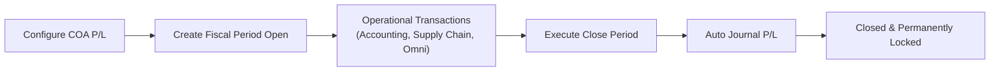
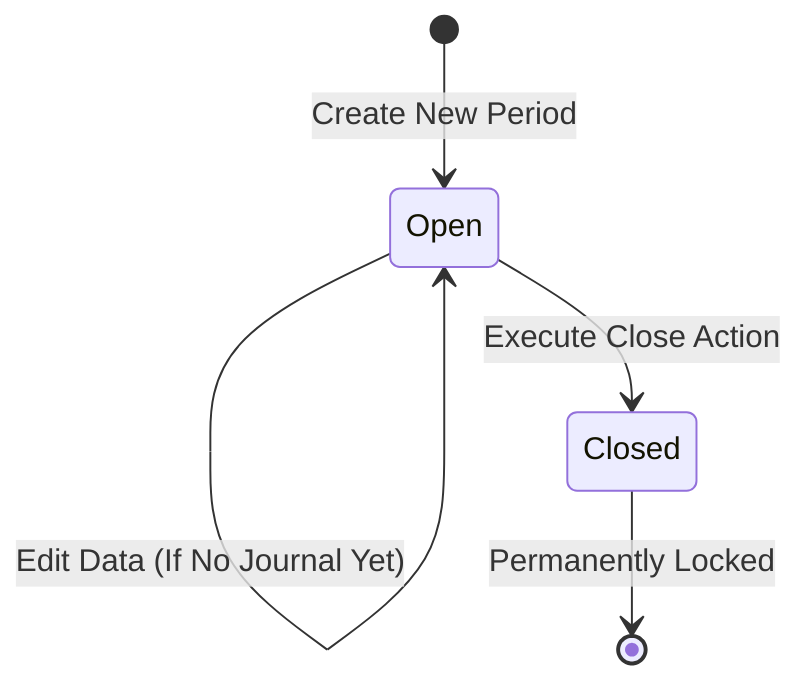
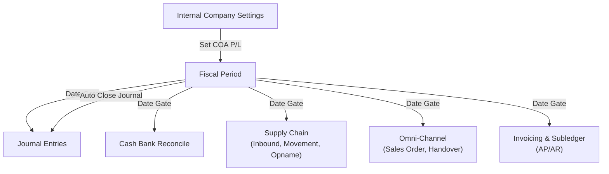

### 📦 Module/Feature: Fiscal Period

**Business definition:**
**Fiscal Period** is the official bookkeeping date-range master per company (*company login*) in OlshopERP. It acts as the main *global date gatekeeper* that controls whether transactions may be recorded across the system — including **Accounting**, **Supply Chain**, and **Omni-Channel**.

While a period is **Open**, transactions can be created and updated on dates inside that range. After the period is closed (**Closed**), the date range is locked **permanently** (it cannot be reopened). Closing a period automatically posts a closing journal (*auto-journal close*) that moves running profit/loss (**Current Profit/Loss**) into retained earnings (**Retained Profit/Loss**).

### 🔑 Key Terms

| Term | Definition |
| :---- | :---- |
| **Fiscal Period** | Bookkeeping date-range master that locks transaction posting per *company*. |
| **Open** | Active period status — transactions may be created/updated on dates in the range. |
| **Closed** | Permanently locked period — cannot be reopened, edited, or deleted. |
| **Current Profit/Loss** | Chart of Accounts (**COA**) running P/L account set in *Internal Company Settings*. |
| **Retained Profit/Loss** | **COA** retained earnings account holding accumulated P/L from prior periods. |
| **Auto Journal Close** | Auto-created *approved* journal formed when a period is closed. |
| **Transaction date gate** | Global validation that the transaction date falls in an **Open** period and is ≤ 6 months in the past. |
| **Overlap** | Date-range clash between a new period and an existing one (non-deleted, same *company*). |

### 🎯 When & Why to Use

* **Set the bookkeeping window:** Define the operational date range (monthly, quarterly, or yearly) where transactions may be recorded.
* **Close the books (period closing):** Lock historical transaction dates so they cannot be changed after financial reports are approved.
* **Automate P/L transfer:** Move running profit/loss into retained earnings without a manual adjusting journal.

### 📋 Prerequisites

| Prerequisite | Component / source | Setup notes |
| :---- | :---- | :---- |
| **COA Current Profit/Loss** | *Internal Company / Accounting Setting* | Required; if empty, create & close are rejected. |
| **COA Retained Profit/Loss** | *Internal Company / Accounting Setting* | Required; if empty, create & close are rejected. |
| **Access rights (privilege)** | Gate Role / user access | Needs *create*, *update*, *delete*, and *approval* (Close). |
| **Company context** | Store / *company login* | Data is isolated to the active company entity. |

### 🔄 Place in the Business Flow

Fiscal Period is the validation foundation before accounting or operational transactions are recorded.

**Steps:**

> 1. **Configure COA P/L:** Map *Current Profit/Loss* and *Retained Profit/Loss* in *Accounting Settings*.
> 2. **Create Fiscal Period Open:** Finance creates a new date range with status **Open**.
> 3. **Operational transactions:** *Journal*, *Invoice*, *Inbound*, *Sales Order*, etc. check dates against the *Fiscal Period* gate.
> 4. **Execute Close Period:** A user with *approval* closes periods in order.
> 5. **Auto journal P/L:** The system creates an *auto-approved* journal moving *Current P/L* to *Retained P/L*.
> 6. **Closed & permanently locked:** The period becomes **Closed**; dates in that range are locked from new transactions.

### 📍 Menu Location

* **Navigation:** Finance Accounting → Master → Fiscal Period
* **UI route:** `/accounting/fiscal-period`

🖼️ **[IMAGE PLACEHOLDER]** — Fiscal Period list (datalist) showing the period table, global search, and action buttons.

### 🏷️ Status Lifecycle

Fiscal Period uses a linear status flow to protect bookkeeping integrity:

| Status | Editable? | Datalist actions | Behavior |
| :---- | :---- | :---- | :---- |
| **Open** | Yes (if no Journal in range) | **Edit**, **Close**, **Delete** | Usable for transactions; editable/deletable if no journal exists. |
| **Closed** | No (permanent) | **Show** | Books locked; change actions are hidden. |

**Notes:**

> 1. Newly created periods always start as **Open**.
> 2. While **Open**, data can be updated or deleted (only if no journal transactions fall in the date range).
> 3. **Close** changes status to **Closed**.
> 4. **Closed** is permanent and has no reopen path.

### 📊 Fiscal Period vs Cash Bank Reconcile Period

| Parameter | Fiscal Period | Cash Bank Reconcile (CBR) period |
| :---- | :---- | :---- |
| **System scope** | Global (locks all OlshopERP modules) | Local (reconcile of specific cash/bank accounts) |
| **Validation order** | Checked first when creating a transaction | Checked during cash & bank reconcile |
| **Reopen action** | **Not possible** (Closed is final) | Follows CBR module rules and limits |
| **Impact on CBR create** | Creating CBR must pass the Fiscal Period gate | Bound by Fiscal Period date limits |

### ⚙️ How to Use

#### 1. Create a new Fiscal Period

> 1. Make sure *Current Profit/Loss* and *Retained Profit/Loss* COAs are set in **Internal Company Settings**.
> 2. Open **Fiscal Period**, then click **Create**.
> 3. Fill **Name**, **Start Date**, and **End Date** (**Description** optional).
> 4. Click **Save**. The system checks that dates do not *overlap* another period.
> 5. On success, the period is saved as **Open**.

🖼️ **[IMAGE PLACEHOLDER]** — Create Fiscal Period form with Name, Start Date, End Date, and Description.

#### 2. Use dates in daily transactions

> 1. Make sure the document date (Journal, Invoice, Stock Movement, etc.) falls inside an **Open** period range.
> 2. The system allows the transaction if the date is in an **Open** period and not older than 6 months.

#### 3. Close a period

> 1. Confirm the user has *approval* privilege.
> 2. In the Fiscal Period list, find the **Open** period to close, then click **Close**.
> 3. The system verifies no other **Open** period ends earlier.
> 4. The system posts the auto closing journal and sets status to **Closed**.

🖼️ **[IMAGE PLACEHOLDER]** — Close action on an Open fiscal period list row with confirmation dialog.

### ⚠️ Closing Is Final and Sequential

> ⚠️ **WARNING: CLOSING A FISCAL PERIOD IS PERMANENT AND MUST BE SEQUENTIAL**  
> Closing a fiscal period **cannot be undone or reopened (irreversible)**. The system also rejects closing a period if another **Open** period ends earlier. You **must** close the earliest open period first, in order.

### 🛑 Global Transaction Date Gate

Every transaction across OlshopERP must pass the global date gate.

> 🛑 **HARD RULE: GLOBAL TRANSACTION DATE GATE**  
> A transaction is rejected if:
>
> 1. The transaction date **does not fall** inside an **Open** Fiscal Period range.
> 2. The transaction date is **older than 6 months** from today.

| No | Condition found | System error message |
| :---- | :---- | :---- |
| 1 | Company not found | Company not found. |
| 2 | No Fiscal Period exists at all | To create any transaction in OlshopERP, an active fiscal period must exist. |
| 3 | Invalid date format invalid | Invalid transaction date format. |
| 4 | Transaction date older than 6 months | Transaction date must be within the past 6 months. |
| 5 | Date falls in an **Open** period (≤ 6 months) | **Validation passed** |
| 6 | Date falls in a **Closed** period | Fiscal period {date} is already closed. |
| 7 | Date outside all period ranges | Date must be in an active fiscal period. |

🖼️ **[IMAGE PLACEHOLDER]** — Example error when creating a transaction outside an active fiscal period or in a Closed period.

### 📋 Field Reference

| Field | Required? | Type | Rules | Description |
| :---- | :---- | :---- | :---- | :---- |
| **Name** | Yes | Text | Max 50 characters | Fiscal period label / title. |
| **Start Date** | Yes | Date | Valid date format | Period start date. |
| **End Date** | Yes | Date | Valid date format | Period end date. |
| **Description** | No | Text | Max 150 characters | Extra notes. |

* **Audit Log:** Available as a slide-over panel on the edit screen.

### 📑 Datalist Features

| Column | Shown by default | Notes |
| :---- | :---- | :---- |
| **Name** | Yes | Fiscal period name. |
| **Period** | Yes | Date range format: DD-Mmm-YYYY - DD-Mmm-YYYY. |
| **Description** | Yes | Short period notes. |
| **Status** | Yes | Visual badge (**Open** / **Closed**). |
| **Active** | Yes | Record active flag. |
| **Created By / At** | Yes | Creator and created time. |
| **Data Owner** | No | Owning *company* entity. |
| **Action** | Yes | **Edit**, **Close**, **Delete** for Open; **Show** for Closed. |

Supporting features: *Global Search*, *Show Deleted*, *Column Show/Hide*, *Export Data*, and *Bulk Delete*.

🖼️ **[IMAGE PLACEHOLDER]** — Open (green) and Closed (red/grey) status badges on the Fiscal Period datalist.

### 🛡️ Business Rules & Validations

* **If** you create or close a period before configuring P/L accounts in *Internal Company*, **then** the system shows: Please configure your Profit/Loss COA accounts in Accounting Settings first.
* **If** the date range *overlaps* another period, **then** the system shows: The selected date is already in use.
* **If** you edit or delete a period that already has *Journal* transactions in its date range, **then** the system shows: Cannot delete fiscal period data because there are existing transactions within this period's date range.
* **If** you close a period while an earlier-ending *Open* period still exists, **then** the system shows: Cannot close this fiscal period because there are earlier open periods. Please close all previous open periods first.
* **If** you try to modify a closed period, **then** the system shows: This fiscal perios and it's properties already closed, you can't modify this data anymore.

### 📄 Accounting Impact on Close Period

When closing an **Open** period is approved, the system:

> 1. **Posts an auto journal:** Creates 1 *Journal* entity with status **Approved**, dated at end of day on the period **End Date** (23:59:59).
> 2. **Builds two journal detail lines:**
>    * **If Current P/L balance \< 0 (Loss):**
>      * **Credit:** *Current Profit/Loss* COA (absolute balance)
>      * **Debit:** *Retained Profit/Loss* COA (absolute balance)
>    * **If Current P/L balance ≥ 0 (Profit or zero):**
>      * **Debit:** *Current Profit/Loss* COA (absolute balance)
>      * **Credit:** *Retained Profit/Loss* COA (absolute balance)
> 3. **Resets period balance:** *Current Profit/Loss* for that fiscal period is set to **0**.

### 🛑 Known Limitations

> AS-IS baseline — neutral framing, not a promise of change.

#### A. Awaiting business decisions

* **Edit/delete validation scope:** Today the system only checks for *Journal* transactions. Non-journal documents in other modules do not yet block period delete/edit.
* **Close journal direction:** Debit/Credit direction is chosen dynamically from the balance sign (\<0 or ≥0), while some business standards expect fixed account sides.
* **Learn More panel text:** Form help text describes a classic multi-account close, while the current system moves directly between *Current* and *Retained Profit/Loss*.

#### B. Inconsistencies & technical notes

* **Update error wording:** Rejecting an update when journals already exist uses the word *delete* (Cannot delete fiscal period data...).
* **System message typo:** The closed-period rejection message has a built-in typo (*fiscal perios*).
* **Start/End date order validation:** The create form does not yet explicitly reject Start Date \> End Date.

### 🔗 Related Menus

| Related menu | Interaction |
| :---- | :---- |
| **Internal / General Company** | Supplies *Current* & *Retained Profit/Loss* COA mapping. |
| **Journal Entries** | Subject to the date gate; receives auto journal posts when a period closes. |
| **Cash Bank Reconcile** | Creating a CBR record must first pass the *Fiscal Period* date gate. |
| **Supply Chain & Omni** | Receipt, shipment, and sales documents must fall in an **Open** period. |
| **Financial reports** | *Trial Balance* and *Balance Sheet* read balances adjusted after close. |

### 🛠️ Troubleshooting

| Symptom | Cause | What to do |
| :---- | :---- | :---- |
| Cannot save a new period | P/L accounts in *Internal Company* are empty | Open **Internal Company Settings** and map *Current* and *Retained P/L*. |
| *Date already in use* error | Dates overlap another period | Move *Start Date* or *End Date* so ranges do not clash. |
| Cannot Close period | An earlier *Open* period still exists | Close the *Open* period with the earliest end date first. |
| Transaction rejected *Fiscal closed* | Date falls in a closed period | Change the date to an **Open** period (**Closed** cannot be reopened). |
| Transaction rejected *Past 6 months* | Date is older than 6 months | Change the date to within the last 6 months. |
| Cannot delete Fiscal Period | Journals already exist in the date range | Cancel or remove related journals first. |

### ❓ FAQ

* **Q: Can a Closed period be reopened?**
  * **A:** **No.** **Closed** is permanent and irreversible. There is no reopen feature.
* **Q: What is the main difference between Fiscal Period and Cash Bank Reconcile (CBR) period?**
  * **A:** Fiscal Period locks transaction posting globally across the system. CBR period only locks cash/bank reconcile activity. Creating CBR still requires an **Open** fiscal period.
* **Q: Why is my transaction rejected even though a Fiscal Period exists?**
  * **A:** Confirm the date falls in an **Open** range, is not older than 6 months, and P/L COAs are configured in *Internal Company*.
* **Q: What happens to Profit/Loss balances when a period closes?**
  * **A:** *Current Profit/Loss* is moved to *Retained Profit/Loss* via an auto *approved* journal, then *Current Profit/Loss* for that period is zeroed.

### 📑 See Also

* **Internal Company Settings** — COA account mapping
* **General Ledger & Journal Entries**
* **Cash Bank Reconcile**
* **Supply Chain & Omni-Channel transaction date gate rules**
