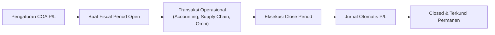
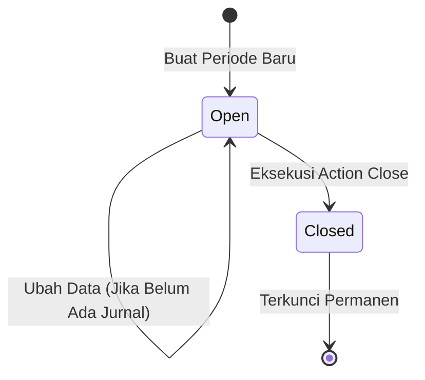
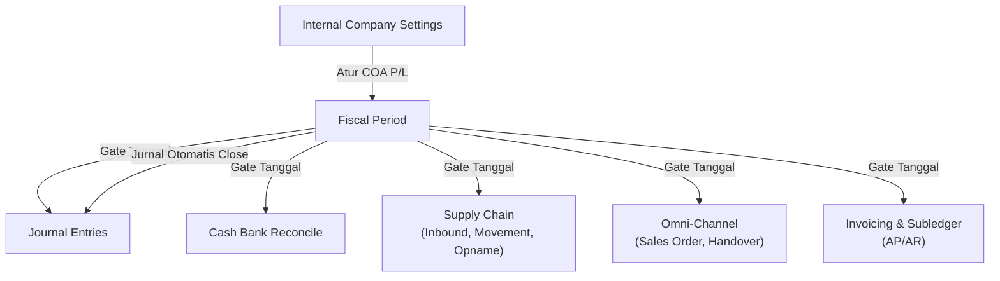

### 📦 Modul/Fitur: Fiscal Period

**Definisi Bisnis:**
**Fiscal Period** (Periode Fiskal) adalah master rentang tanggal pembukuan resmi per perusahaan (*company login*) di OlshopERP. Menu ini berfungsi sebagai gerbang utama (*global date gatekeeper*) yang mengontrol izin pencatatan transaksi di seluruh modul sistem, termasuk **Accounting**, **Supply Chain**, dan **Omni-Channel**.

Selama periode berstatus **Open**, transaksi dapat dibuat dan diperbarui pada tanggal di dalam rentang tersebut. Setelah periode ditutup (**Closed**), rentang tanggal terkunci secara **permanen** (tidak dapat dibuka kembali). Penutupan periode secara otomatis menerbitkan jurnal penutup (*auto-journal close*) yang memindahkan saldo laba/rugi berjalan (**Current Profit/Loss**) ke laba ditahan (**Retained Profit/Loss**).

### 🔑 Istilah Kunci

| Istilah | Definisi & arti |
| :---- | :---- |
| **Fiscal Period** | Master rentang tanggal pembukuan yang mengunci pencatatan transaksi per *company*. |
| **Open** | Status periode aktif — transaksi dapat dibuat/diubah pada tanggal di dalam rentang. |
| **Closed** | Status periode terkunci permanen — tidak dapat dibuka lagi, diedit, atau dihapus. |
| **Current Profit/Loss** | Akun *Chart of Accounts* (**COA**) laba/rugi berjalan yang diatur di *Internal Company Settings*. |
| **Retained Profit/Loss** | Akun **COA** laba ditahan yang menampung akumulasi laba/rugi dari periode terdahulu. |
| **Auto Journal Close** | Jurnal otomatis berstatus *approved* yang terbentuk saat proses tutup periode. |
| **Gate Tanggal Transaksi** | Validasi global sistem yang memastikan tanggal transaksi berada di periode **Open** dan ≤ 6 bulan ke belakang. |
| **Overlap** | Bentrokan rentang tanggal periode baru dengan periode yang sudah ada (non-deleted, *company* sama). |

### 🎯 Kapan & Kenapa Dipakai

* **Menentukan jendela pembukuan:** Menetapkan rentang tanggal operasional (bulanan, triwulanan, atau tahunan) di mana transaksi boleh dicatatkan.
* **Menutup buku (period closing):** Mengunci tanggal transaksi historis agar tidak dapat diubah setelah laporan keuangan disahkan.
* **Otomasi pemindahan laba/rugi:** Memindahkan saldo laba/rugi berjalan ke laba ditahan tanpa jurnal penyesuaian manual.

### 📋 Prasyarat

| Prasyarat | Komponen / sumber | Catatan pengaturan |
| :---- | :---- | :---- |
| **COA Current Profit/Loss** | *Internal Company / Accounting Setting* | Wajib terkonfigurasi; jika kosong, pembuatan & penutupan periode ditolak. |
| **COA Retained Profit/Loss** | *Internal Company / Accounting Setting* | Wajib terkonfigurasi; jika kosong, pembuatan & penutupan periode ditolak. |
| **Hak akses (privilege)** | Gate Role / akses pengguna | Membutuhkan wewenang *create*, *update*, *delete*, dan *approval* (Close). |
| **Konteks perusahaan** | Toko / *company login* | Data terisolasi sesuai entitas perusahaan yang sedang aktif. |

### 🔄 Posisi dalam Alur Bisnis

Fiscal Period berdiri sebagai fondasi validasi sebelum transaksi akuntansi maupun operasional dicatat ke dalam sistem.

**Keterangan langkah:**

> 1. **Pengaturan COA P/L:** Pastikan akun *Current Profit/Loss* dan *Retained Profit/Loss* telah dipetakan di *Accounting Settings*.
> 2. **Buat Fiscal Period Open:** Tim Finance membuat rentang periode baru dengan status **Open**.
> 3. **Transaksi operasional:** Modul *Journal*, *Invoice*, *Inbound*, *Sales Order*, dll. memeriksa tanggal ke gate *Fiscal Period*.
> 4. **Eksekusi Close Period:** Pengguna dengan wewenang *approval* menutup periode secara berurutan.
> 5. **Jurnal otomatis P/L:** Sistem membentuk jurnal *auto-approved* pemindahan *Current P/L* ke *Retained P/L*.
> 6. **Closed & terkunci permanen:** Periode menjadi **Closed**; tanggal pada rentang tersebut terkunci dari transaksi baru.

### 📍 Lokasi Menu

* **Navigasi:** Finance Accounting → Master → Fiscal Period
* **Route UI:** `/accounting/fiscal-period`

🖼️ **[IMAGE PLACEHOLDER]** — Tampilan layar utama daftar (datalist) menu Fiscal Period yang memperlihatkan tabel periode, pencarian global, dan tombol tindakan.

### 🏷️ Siklus Status

Fiscal Period memiliki alur status linier untuk menjaga integritas pembukuan:

| Status | Dapat diedit? | Tombol akses di datalist | Keterangan perilaku |
| :---- | :---- | :---- | :---- |
| **Open** | Ya (jika belum ada Journal di rentang) | **Edit**, **Close**, **Delete** | Boleh dipakai transaksi; boleh diedit/dihapus jika belum ada jurnal. |
| **Closed** | Tidak (permanen) | **Show** | Pembukuan terkunci; tombol perubahan disembunyikan. |

**Keterangan:**

> 1. Periode yang baru dibuat selalu mendapat status **Open**.
> 2. Selama **Open**, data dapat diperbarui atau dihapus (syarat: tidak ada transaksi jurnal di rentang tanggal).
> 3. Eksekusi **Close** mengubah status menjadi **Closed**.
> 4. Status **Closed** bersifat permanen dan tidak memiliki jalur pembukaan kembali (*reopen*).

### 📊 Fiscal Period vs Period Cash Bank Reconcile

| Parameter | Fiscal Period | Period Cash Bank Reconcile (CBR) |
| :---- | :---- | :---- |
| **Cakupan sistem** | Global (mengunci seluruh modul OlshopERP) | Lokal (rekonsiliasi rekening kas/bank tertentu) |
| **Hierarki validasi** | Diperiksa pertama kali saat pembuatan transaksi | Diperiksa saat proses rekonsiliasi kas & bank |
| **Aksi reopen** | **Tidak bisa** (Closed bersifat final) | Mengikuti ketentuan dan batasan di modul CBR |
| **Dampak pembuatan CBR** | Pembuatan CBR wajib lolos gate Fiscal Period | Terikat pada batasan tanggal Fiscal Period |

### ⚙️ Cara Penggunaan

#### 1. Membuat Fiscal Period baru (Create)

> 1. Pastikan COA *Current Profit/Loss* dan *Retained Profit/Loss* sudah terisi di **Internal Company Settings**.
> 2. Buka menu **Fiscal Period**, lalu klik **Create**.
> 3. Isi **Name**, **Start Date**, dan **End Date** (**Description** opsional).
> 4. Klik **Save**. Sistem memverifikasi agar tanggal tidak bentrok (*overlap*) dengan periode lain.
> 5. Jika berhasil, periode tersimpan dengan status **Open**.

🖼️ **[IMAGE PLACEHOLDER]** — Form Create Fiscal Period dengan field Name, Start Date, End Date, dan Description.

#### 2. Menggunakan tanggal dalam transaksi harian

> 1. Pastikan tanggal dokumen transaksi (Journal, Invoice, Stock Movement, dll.) berada dalam rentang periode berstatus **Open**.
> 2. Sistem meloloskan transaksi jika tanggal berada di periode **Open** dan tidak lebih tua dari 6 bulan.

#### 3. Menutup periode (Close Period)

> 1. Pastikan pengguna memiliki wewenang *approval*.
> 2. Pada daftar Fiscal Period, cari periode **Open** yang ingin ditutup, lalu klik **Close**.
> 3. Sistem memverifikasi bahwa tidak ada periode **Open** lain yang tanggal berakhirnya lebih awal.
> 4. Sistem memproses jurnal penutup otomatis dan mengubah status menjadi **Closed**.

🖼️ **[IMAGE PLACEHOLDER]** — Tombol Close pada daftar periode fiskal berstatus Open beserta dialog konfirmasi penutupan.

### ⚠️ Penutupan Bersifat Final & Berurutan

> ⚠️ **WARNING: CLOSE FISCAL PERIOD BERSIFAT PERMANEN DAN HARUS BERURUTAN**  
> Penutupan periode fiskal **tidak dapat dibatalkan atau dibuka kembali (irreversible)**. Selain itu, sistem menolak penutupan suatu periode jika masih terdapat periode berstatus **Open** lain yang tanggal berakhirnya lebih awal. Anda **wajib** menutup periode paling awal terlebih dahulu secara berurutan.

### 🛑 Gate Tanggal Transaksi Global

Setiap pencatatan transaksi di seluruh modul OlshopERP wajib melewati pemeriksaan gate tanggal global.

> 🛑 **HARD RULE: GATE TANGGAL TRANSAKSI GLOBAL**  
> Transaksi akan ditolak jika:
>
> 1. Tanggal transaksi **tidak masuk** ke dalam rentang Fiscal Period yang berstatus **Open**.
> 2. Tanggal transaksi **lebih tua dari 6 bulan** ke belakang dari hari ini.

| No | Kondisi yang ditemukan | Pesan error sistem |
| :---- | :---- | :---- |
| 1 | Perusahaan tidak ditemukan | Company not found. |
| 2 | Belum ada Fiscal Period sama sekali | To create any transaction in OlshopERP, an active fiscal period must exist. |
| 3 | Format tanggal transaksi tidak valid | Invalid transaction date format. |
| 4 | Tanggal transaksi lebih tua dari 6 bulan | Transaction date must be within the past 6 months. |
| 5 | Tanggal masuk di periode **Open** (≤ 6 bulan) | **Lolos validasi** |
| 6 | Tanggal masuk di periode **Closed** | Fiscal period {date} is already closed. |
| 7 | Tanggal di luar seluruh rentang periode | Date must be in an active fiscal period. |

🖼️ **[IMAGE PLACEHOLDER]** — Contoh pesan kesalahan saat mencoba membuat transaksi di luar periode fiskal aktif atau di periode yang sudah Closed.

### 📋 Referensi Field

| Field | Wajib? | Tipe | Aturan & batasan | Deskripsi |
| :---- | :---- | :---- | :---- | :---- |
| **Name** | Ya | Text | Maks. 50 karakter | Nama / judul penanda periode fiskal. |
| **Start Date** | Ya | Date | Format tanggal valid | Tanggal awal periode fiskal. |
| **End Date** | Ya | Date | Format tanggal valid | Tanggal akhir periode fiskal. |
| **Description** | Tidak | Text | Maks. 150 karakter | Catatan atau keterangan tambahan. |

* **Audit Log:** Tersedia dalam bentuk panel *slide-over* pada layar edit data.

### 📑 Fitur Daftar Data (Datalist)

| Kolom | Default tampil | Keterangan |
| :---- | :---- | :---- |
| **Name** | Ya | Nama periode fiskal. |
| **Period** | Ya | Format rentang: DD-Mmm-YYYY - DD-Mmm-YYYY. |
| **Description** | Ya | Keterangan singkat periode. |
| **Status** | Ya | Badge visual (**Open** / **Closed**). |
| **Active** | Ya | Penanda status keaktifan record. |
| **Created By / At** | Ya | Informasi pembuat dan waktu pembuatan. |
| **Data Owner** | Tidak | Entitas pemilik data *company*. |
| **Action** | Ya | **Edit**, **Close**, **Delete** untuk Open; **Show** untuk Closed. |

Fitur pendukung: *Global Search*, *Show Deleted*, *Column Show/Hide*, *Export Data*, dan *Bulk Delete*.

🖼️ **[IMAGE PLACEHOLDER]** — Badge status Open (hijau) dan Closed (merah/abu-abu) pada kolom status datalist Fiscal Period.

### 🛡️ Aturan Bisnis & Validasi

* **Jika** Anda membuat atau menutup periode sebelum mengatur akun P/L di *Internal Company*, **maka** sistem menampilkan: Please configure your Profit/Loss COA accounts in Accounting Settings first.
* **Jika** rentang tanggal bentrok (*overlap*) dengan periode lain, **maka** sistem menampilkan: The selected date is already in use.
* **Jika** Anda mengedit atau menghapus periode yang sudah memiliki transaksi *Journal* di rentang tanggalnya, **maka** sistem menampilkan: Cannot delete fiscal period data because there are existing transactions within this period's date range.
* **Jika** Anda menutup periode padahal masih ada periode *Open* lain yang berakhir lebih awal, **maka** sistem menampilkan: Cannot close this fiscal period because there are earlier open periods. Please close all previous open periods first.
* **Jika** Anda mencoba memodifikasi data periode yang sudah ditutup, **maka** sistem menampilkan: This fiscal perios and it's properties already closed, you can't modify this data anymore.

### 📄 Dampak Akuntansi saat Close Period

Saat penutupan periode **Open** disetujui, sistem mengeksekusi:

> 1. **Penerbitan jurnal otomatis:** Sistem membuat 1 entitas *Journal* berstatus **Approved** dengan tanggal transaksi setara akhir hari pada **End Date** periode (23:59:59).
> 2. **Formulasi baris jurnal (2 baris detail):**
>    * **Jika saldo Current P/L \< 0 (Rugi):**
>      * **Credit:** COA *Current Profit/Loss* (nilai absolut saldo)
>      * **Debit:** COA *Retained Profit/Loss* (nilai absolut saldo)
>    * **Jika saldo Current P/L ≥ 0 (Laba atau nol):**
>      * **Debit:** COA *Current Profit/Loss* (nilai absolut saldo)
>      * **Credit:** COA *Retained Profit/Loss* (nilai absolut saldo)
> 3. **Reset saldo periode:** Saldo *Current Profit/Loss* untuk periode fiskal tersebut diset menjadi **0**.

### 🛑 Keterbatasan yang Diketahui

> Baseline AS-IS — framing netral, bukan janji perubahan.

#### A. Menunggu keputusan bisnis

* **Cakupan validasi edit/hapus:** Saat ini sistem hanya memeriksa keberadaan transaksi *Journal*. Dokumen non-jurnal di modul lain belum memblokir hapus/edit periode.
* **Arah jurnal close:** Sistem menentukan arah Debit/Credit secara dinamis berdasarkan tanda saldo (\<0 atau ≥0), sementara beberapa standar bisnis mengharapkan posisi akun yang tetap.
* **Teks panel Learn More:** Teks penjelasan di form menggambarkan proses penutupan multi-akun klasik, sedangkan sistem saat ini menjalankan pemindahan langsung antara *Current* dan *Retained Profit/Loss*.

#### B. Inkonsistensi & catatan teknis

* **Wording pesan error update:** Pesan penolakan saat memperbarui data yang sudah punya jurnal memakai kata *delete* (Cannot delete fiscal period data...).
* **Typo pesan sistem:** Terdapat typo bawaan pada pesan penolakan periode tertutup (*fiscal perios*).
* **Validasi urutan tanggal input:** Form pembuatan periode belum punya validasi eksplisit yang menolak jika Start Date \> End Date.

### 🔗 Hubungan dengan Menu Lain

| Menu terkait | Bentuk interaksi |
| :---- | :---- |
| **Internal / General Company** | Menyediakan pemetaan akun COA *Current* & *Retained Profit/Loss*. |
| **Journal Entries** | Tunduk pada gate tanggal; menerima postingan jurnal otomatis saat periode ditutup. |
| **Cash Bank Reconcile** | Pembuatan record CBR wajib lolos gate tanggal *Fiscal Period* terlebih dahulu. |
| **Supply Chain & Omni** | Seluruh dokumen penerimaan, pengiriman, dan penjualan wajib berada di periode **Open**. |
| **Laporan keuangan** | *Trial Balance* dan *Balance Sheet* membaca saldo yang disesuaikan pasca penutupan. |

### 🛠️ Troubleshooting

| Gejala | Penjelasan / penyebab | Solusi |
| :---- | :---- | :---- |
| Gagal menyimpan periode baru | Akun P/L di *Internal Company* belum diisi | Buka **Internal Company Settings**, petakan akun *Current* dan *Retained P/L*. |
| Pesan *Date already in use* | Tanggal bentrok dengan periode lain | Geser *Start Date* atau *End Date* agar tidak berbenturan. |
| Gagal Close period | Masih ada periode *Open* yang lebih tua | Tutup dulu periode *Open* dengan tanggal berakhir paling awal. |
| Transaksi ditolak *Fiscal closed* | Tanggal ada di periode tertutup | Ubah tanggal ke periode **Open** (periode **Closed** tidak bisa dibuka). |
| Transaksi ditolak *Past 6 months* | Tanggal lebih tua dari 6 bulan | Ubah tanggal agar berada dalam 6 bulan terakhir. |
| Gagal menghapus Fiscal Period | Sudah ada jurnal di rentang tanggal | Batalkan atau hapus jurnal terkait terlebih dahulu. |

### ❓ FAQ

* **Q: Apakah periode Closed bisa dibuka kembali (Reopen)?**
  * **A:** **Tidak.** Status **Closed** bersifat permanen dan *irreversible*. Sistem tidak menyediakan fitur reopen.
* **Q: Apa perbedaan Fiscal Period dan periode Cash Bank Reconcile (CBR)?**
  * **A:** Fiscal Period mengunci seluruh pencatatan transaksi sistem secara global. Periode CBR hanya mengunci aktivitas rekonsiliasi kas/bank. Pembuatan CBR tetap wajib berada di periode fiskal **Open**.
* **Q: Mengapa transaksi ditolak padahal Fiscal Period sudah dibuat?**
  * **A:** Pastikan tanggal masuk rentang periode **Open**, tidak lebih tua dari 6 bulan, dan akun COA P/L di *Internal Company* sudah terkonfigurasi.
* **Q: Apa yang terjadi pada saldo Laba/Rugi saat periode ditutup?**
  * **A:** Saldo *Current Profit/Loss* dipindahkan ke *Retained Profit/Loss* melalui jurnal otomatis berstatus *approved*, lalu saldo *Current Profit/Loss* pada periode tersebut dinolkan.

### 📑 Lihat Juga

* **Internal Company Settings** — pemetaan akun COA
* **General Ledger & Journal Entries**
* **Cash Bank Reconcile**
* **Aturan gate tanggal transaksi Supply Chain & Omni-Channel**
