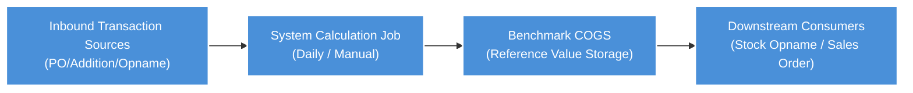
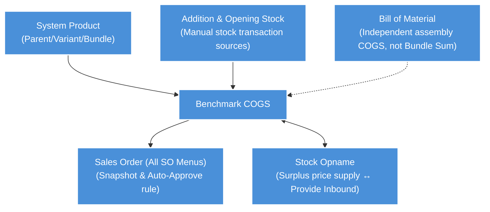

### 📦 Module/Feature: Benchmark COGS

**Benchmark COGS** displays the effective **COGS (Cost of Goods Sold)** reference value per **System Product**. This menu does not show accounting journal stock; instead, it provides an operational calculation reference that is updated automatically every day at **00:00 WIB (Asia/Jakarta)** or triggered manually.

---

### 🔑 Key Terms

| Term | Definition |
| :---- | :---- |
| **Benchmark COGS / COGS** | The effective COGS reference value per SKU, produced by automatic formula calculation or *Manual override*. |
| **Highest Price** | *Description* label when a valid transaction exists within the last ≤30 days, where the system takes the highest price (before tax / *before VAT*). |
| **Last Inbound** | *Description* label when no valid transaction exists within the last 30 days, where the system takes the price from the last transaction before that period. |
| **No Inbound** | *Description* label when there is no valid transaction history at all, so the COGS value is set to 0. |
| **Manual Input** | *Description* label when COGS is being *overridden* through the *Manual COGS* feature and has not yet expired *(TO-BE)*. |
| **Bundle Sum** | *(TO-BE)* COGS value specific to non-random *Product Bundle* headers, calculated from the total of (effective component COGS × *qty* in the bundle recipe). |
| **Highest Bundle Variant** | *(TO-BE)* COGS value specific to random *Bundle* headers, which automatically takes the highest value from all non-random *sibling headers*. |
| **Prepared to invoice** | Quantity of goods that has entered a *Sales Invoice* (SI) document that is not yet approved (in the *Sales Order* context; not directly tied to this menu). |
| **Show Detail** | Row display *toggle* feature (Off = shows *Single* and *Parent* only; On = shows all *Variant child* rows). |
| **Calculate** | Per-row manual action to trigger asynchronous recalculation of the COGS formula for that SKU and its related variants. |
| **Calculate Log** | Audit log history that records COGS value changes specifically (showing old-to-new values, date, and system/manual action). |
| **Snapshot** | Benchmark COGS value that is locked and stored statically on a *Sales Order* transaction when the order is created; it will not change even if the price in *master* data changes. |
| **Below Benchmark COGS** | *(TO-BE)* Red flag indicator (*Error Flag*) on *Sales Order* that warns that the selling price *before VAT* is below the *snapshot* Benchmark COGS value. |

---

### 🎯 When & Why to Use

| Operational Situation | Use This Menu If |
| :---- | :---- |
| **Check SKU COGS Reference** | You need to monitor the current effective COGS value and the status of its source (*Highest Price*, *Last Inbound*, etc.). |
| **After Stock Transaction** | A new approved stock inbound transaction (*Inbound PO*, *Addition*, *Opname IN*, or *Opening Stock*) has been recorded and you want to trigger recalculation manually (via the *Calculate* button) without waiting for the midnight update. |
| **COGS Change Audit** | You need to review historical changes (from old value to new value) through the *Calculate Log* panel. |
| **Override Correction** | *(TO-BE)* There is a promotional price, special correction, or *temporary cost* case that requires you to override the formula through the *Manual COGS* feature. |
| **Monitor Bundle Headers** | *(TO-BE)* You need to inspect COGS values for *Product Bundle* based on the accumulated recipe breakdown (*Bundle Sum*). |

> 🛑 **Warning:** Do not use this menu if you are looking for accounting general-ledger COGS values, because COA rules and financial *inventory* are handled in separate reporting modules. Also do not expect to edit price columns directly, because the production *AS-IS* function is currently *read-only* from the system formula.

---

### 📋 Prerequisites

* **Access Rights:** Users must have *view privilege* to access the Benchmark COGS menu.
* **Valid System Product:** SKUs (*Single*, *Parent*, *Variant*, or *Bundle*) must be registered in the System Product master data.
* **Stock Document Status:** To trigger normal formula calculation, there must be at least one approved inbound stock transaction from one of the 4 *allowlist* sources with *before VAT* price details.
* **Toggle Function:** Turn on the *Show Detail* toggle if you need to review or modify data down to the *Variant* level.
* **Manual Edit Level:** *(TO-BE)* The *Manual COGS* function is strictly limited to **Single** or **Variant** profiles; the system firmly rejects manual *override* attempts at the **Parent** level.

---

### 🔄 Position in the Business Flow

**Step notes:**

1. Physical goods addition transactions (*Purchase Inbound PO*, *Stock Addition*, *Opname IN*, or *Opening Stock*) reach *approved* status from the logistics department.
2. The *backend* system executes the 3-tier formula calculation at 00:00 WIB, or the user forces an immediate *async* calculation using the manual *Calculate* button.
3. The Benchmark COGS module records and publishes the latest operational COGS figure based on the formula or *Manual COGS* value intervention.
4. The updated COGS value is then supplied as the default fallback price for *Stock Opname* surplus, and encapsulated as a reference price *snapshot* when issuing a *Sales Order*.

---

### 📍 Menu Location

* **Navigation path:** Finance Accounting → Report → Benchmark COGS
* **UI Route:** `/accounting/product-benchmark-price`

> 🖼️ **[IMAGE PLACEHOLDER]** — Benchmark COGS menu location in the sidebar (FA → Report).

---

### ⚙️ How COGS Value Is Calculated (3-Tier Formula)

The system selects the COGS value mechanically following a 3-layer (*tier*) priority logic:

| Rule Tier | System Condition | Final Value Calculation | Description Label |
| :---- | :---- | :---- | :---- |
| **Tier 1** | A valid inbound transaction is found within the last **≤30 days**. | The system automatically takes the **highest (MAX)** *before VAT* price from all valid transaction sources. | **Highest Price** |
| **Tier 2** | Transaction history in the 30-day window is empty, but history older than **>30 days** still exists. | The system takes the price from the **last** historical transaction record, sorted *order by date desc*. | **Last Inbound** |
| **Tier 3** | No valid logistics transaction source trail is found at all. | The system applies a constant protection value of **0**. | **No Inbound** |

> *Time Calculation Note:* The 30-day period is calculated precisely using the Asia/Jakarta *timezone* (starting at today - 30 days startOfDay and ending at today endOfDay).

---

### 📥 Transaction Data Sources

Reference values are calculated from 4 valid source document types that produce inbound prices (*before VAT*):

1. **Purchase Inbound (PO):** *Mutation Inbound* receipt documents sourced from *Purchase Order* activity.
2. **Stock Addition:** *Adjustment Addition* documents entered through manual recording.
3. **Stock Opname IN:** *Adjustment Addition* documents automatically synthesized from positive surplus stock differences during opname.
4. **Opening Stock:** *Addition* documents automatically created by the system when the *opening stock* balance module is legally approved.

> 🛑 **Hard Rule:** Other sources—such as *return process inbound*, warehouse transfers (*transfer inbound*), *failed ship/scrap/lost adjustment*, goods received without supplier PO, and *Draft/Open* documents not yet approved—are **not counted**. In operational *AS-IS* status, the system code has not yet strictly separated this *allowlist*, so all approved inbound transactions are currently included in calculation. The 4-source *allowlist* arrangement is set as a *TO-BE* improvement target for the next release.

---

### 🏷️ Per Product Type

| Product Architecture Type | COGS Calculation Mechanism | Expected Description Label |
| :---- | :---- | :---- |
| **Single** | Runs the 3-Tier Formula independently. | *Highest Price* / *Last Inbound* / *No Inbound* |
| **Variant (child)** | Calculates value via the 3-Tier Formula at the variant row level itself. | *Highest Price* / *Last Inbound* / *No Inbound* |
| **Parent** | Extracts and displays the combined **MAX** value from all child variant *benchmark* prices (ignoring the presence of random-type variants). | *Highest Price* or *No Inbound* |
| **Random variant** | Adopts pure inheritance directly from the MAX calculation of *sibling* variants or the MAX value of the *parent*. | Follows the status held by its *parent* |
| **BOM / Assembly** | This physical commodity product runs the standard 3-Tier Formula per SKU like a *Single* type. | *Highest Price* / *Last Inbound* / *No Inbound* / *Manual Input* |
| **Product Bundle (non-random) *(TO-BE)*** | Calculated via the formula Σ combined (*component COGS × qty*). | **Bundle Sum** |
| **Product Bundle (random) *(TO-BE)*** | Takes the highest MAX value from the set of non-random *sibling header* prices. | **Highest Bundle Variant** |

---

### 📦 Product Bundle — Bundle Sum & Highest Bundle Variant (TO-BE)

Commodities of type **Product Bundle** are not *stockable items* that can be stored on physical warehouse shelves, so they have no logistics inbound history from *Purchase Order* (*SCM inbound*). As a result, *Highest/Last Inbound* reference for these products ends at **0**. The *TO-BE* v1.4 update target adds a dedicated deductive formula:

* **Bundle Sum:** Applied to non-random *header* bundle products. The formula is the combined total of all active components: COGS(header) = Σ (COGS_effective(component_i) × qty_i).
* **Highest Bundle Variant:** Applied specifically to random-labeled *Bundle headers*. The formula is a short derivative calculation: COGS = MAX(COGS sibling header non-random) without breaking down component line details.

**Case Example — Blue Keyboard Package (Bundle Sum):** If the *bundle* contains Keyboard (650k) + Mat (50k) + Mouse (130k), the *Bundle Sum* calculation on the main header automatically reflects **Rp830,000**. If the white *sibling Bundle* is valued at Rp835,000, the random Bundle variant in this family extracts the highest value, **Rp835,000**. If an admin applies a manual entry of Rp900,000 in the Blue Keyboard package *header* column, the *Manual Input* value takes final precedence and overrides the *SUM* logic behind it.

> 🛑 **Hard Rule:** Do not mix this scheme with the **BOM (Assembly)** product scheme. Assembly is a real physical *stockable* entity, so its calculation uses the 3-tier transaction record path (*Highest / Last Inbound*), **not** *Bundle Sum*.

---

### ✏️ Manual COGS Override (TO-BE)

The *TO-BE* system enhancement introduces a feature to manually *override* reference price calculation using the **Manual COGS** column and its expiry parameter in the **Manual COGS Expiry** column.

* **Product Level:** This *override* feature is strictly limited to **Single** and **Variant** product levels (including *Bundle* type *headers*). Editing *Manual COGS* on **Parent** product entities is guaranteed to fail and is hard-blocked.
* **Expiry Logic:** If the *Expiry* field is left completely empty, the manual price is set to apply **permanently**. However, if a specific date is set in (DD-MM-YYYY) format, the *override* value automatically expires at **23:59:59 WIB** on that calendar day, returning control to the mechanical system formula.
* **Return to Formula:** To forcibly stop intervention before *expiry*, simply *clear* the Manual COGS field contents, and the price immediately reverts to pure 3-Tier Formula data.
* **Zero Flexibility:** Setting the value to 0 is valid manually, but the system completely rejects negative values.
* **Sync Job Protection:** The daily automatic background price update job (00:00) is absolutely forbidden from overwriting effective COGS for commodities where this manual intervention column is still active and valid.
* **Bulk Import Facility:** Allows download and execution of a special *Excel spreadsheet* with three variables: SKU Code | Manual COGS | Manual COGS Expiry. Leaving manual column cells empty during import will *clear override* previous settings.

---

### 📊 Reading the Datalist

| Datalist Column Name | Function and Data Meaning |
| :---- | :---- |
| **System Product SKU / Name** | Displays internal company product identity code with a quick navigation *link* to the edit profile. |
| **Type** | Product architecture dimension classification divided into *Single*, *Parent*, or *Variant* levels. |
| **Retail Price** | Displays the current main retail price (sales master). |
| **COGS** | Core element of the menu. This is the latest (effective) reference value from formula computation or user intervention. |
| **Manual COGS / Expiry *(TO-BE)*** | Operational value *override* amount and its expiry deadline. |
| **Description** | COGS logic route label (*Highest Price*, *Last Inbound*, *No Inbound*, *Manual Input*, *Bundle Sum*, or *Highest Bundle Variant*). |
| **Audit Date & Action** | Provides *COGS Last Updated* stamp, *Created/Updated by/at* identity data, and a per-row **Calculate** trigger button in the form of a sync *icon*. |

> 🖼️ **[IMAGE PLACEHOLDER]** — Datalist with COGS, Description, and Show Detail toggle columns.

The **Show Detail** switch controls visual density on your monitor:

* *Off (Default):* The table strictly displays only *Single* and *Parent* products.
* *On:* The grid expands to render all *Variant child* rows on separate lines.

---

### 🔄 Calculate Button & Calculate Log

* **Triggering Calculate:** This button executes an asynchronous (*async background job*) calculation per specific SKU and its entire variant structure chain so it quickly reflects newly *approved* valid stock transaction data (without waiting for the *midnight* calendar cycle). This button does not erase COGS values when *Manual COGS* status is detected as active. You are strongly recommended to force a browser *refresh* after activation to see the latest COGS value once the *backend delay* completes.
* **Calculate Log:** Presents a visual history (*slideover*) that tells the price evolution story for each product: showing old-to-new value comparison, complete with action and system date records (systematic or user manual).

> 🖼️ **[IMAGE PLACEHOLDER]** — Row with Calculate action (sync icon).
> 🖼️ **[IMAGE PLACEHOLDER]** — Calculate Log slideover (change history).

---

### 📤 Export All

The *toolbar* is reinforced with an *Export All* control button to export the filtered *datalist* table into *Excel spreadsheet* format (*downloadable format*).

---

### 🔗 Stock Opname Integration

Regarding the *Stock Opname* system, cross-menu interaction follows a valid circular logic principle (two-way commodity cycle *circular dependency*) accepted in the operational business corridor:

* **Benchmark → Opname flow:** In the *Stock Opname* phase, when a positive surplus is found but the price is not intervened by the *operator*, the platform immediately takes the default nominal supplied purely from the latest *Benchmark COGS* document data.
* **Opname IN → Benchmark flow:** From that surplus, the *Opname IN* entity after *approved* status contributes its value back to be read in the next day's *Benchmark COGS* transaction source calculation cycle. Ultimately, circulation authority rests with the *operator*: entering manual correction from the opname panel, versus letting the system dig backward through COGS reference data.

---

### 🔗 Sales Order Integration

The application stores a **Benchmark COGS** digital trail in a hidden form column (exposable via *column picker*) on the *Sales Order* invoice body. This column is designed as a crucial automatic filter system for rejecting loss-margin prices.

* **Snapshot History Doctrine:** At the millisecond a SO invoice line is created, the Benchmark price is instantly recorded permanently as a static local *snapshot*. Even if you rush to modify the central COGS master menu after PO/SO issuance, the SO-level history will not change its nominal (*by design*). Platform product binding and manual detail line restructuring (*product change*) are among the valid routes that instruct SO to call (*re-fetch*) new master *benchmark* data.
* **Auto-Approval Block Validation:** The engine executes automatic margin protection checks. If mathematical comparison determines that the transaction selling rate *Price Before VAT* (using primary currency or calibrated via *exchange rate*) is lower (<) than the recorded *snapshot* Benchmark COGS, SO *auto-approve job schedule* processing is **blocked and systematically failed**. Administrator authorities must perform *manual approve* validation if the transaction is to be allowed through. The block is waived when the *benchmark* value is a constant **0** or exactly equal (==).
* **Below Benchmark COGS Tracking Flag (TO-BE):** This update preparation will provide an interactive red *Error Flag* icon (both at the general SO header level and targeting the accused SKU) so that margin leak tracing can be filtered efficiently in *Sales Platform*, *General*, and *All Sales Order* environments.

> 🖼️ **[IMAGE PLACEHOLDER]** — Integration example: Benchmark COGS column in Sales Order detail (hidden by default).

---

### 🛡️ Business Rules & Validation

* **If you** attempt to enter a negative value in the specific *Manual COGS* input column, **then** the system rejects the operation.
* **If you** insist on forcing *Manual COGS* column changes on **Parent** class products, **then** the system blocks it because absolute modification access is exclusively concentrated at the **Single/Variant** level only.
* **If you** register *Parent* class rows sneaking into bulk data injection via the **Import** facility, **then** those rogue rows fail with a row error message (while other valid routes proceed to the database).
* **If you** attach blank (empty) entries specifically in *Manual COGS* cells when running **Import** activity, **then** the algorithm removes previous intervention and delegates authority to the machine algorithm (*Clear override*).
* **If you** worry about the nightly *daily Job* while your *Manual COGS* intervention setting exists and is valid (not yet expired), **then** do not panic because the system algorithm procedure is not given access to demolish or forcibly change protected manual effective prices.
* **If you** skip browser *reload* expecting a quick reaction after ringing the *Calculate* bell, **then** be aware the value does not always appear instantly because the operational machine queue cycle is controlled via background (*async*) process, requiring the operator to press browser page refresh slowly some time afterward.
* **If you** make Benchmark value changes on the master system page while a *Sales Order* transaction note form has already been released and recorded, **then** inevitably the *snapshot* memory history inside the issued transaction note is untouched (*does not change at all*).

---

### ⚠️ Limitations & Items Under Review

The inventory list below is not an obligation for instant repair, but a reporting framework of operational limitations in the production platform version passively operating in the field (*AS-IS*):

* **Read-Only Menu *(TO-BE v1.3)*:** All levers for **Manual COGS, Expiry, plus Import upload method** are not yet written in *live code*, making the current interface module act entirely passively (*read-only*) serving system value reports without independent number modification capability.
* **Mystery of 0 in Bundle Feature *(TO-BE v1.4)*:** The logical mathematical concept of **Bundle Sum & Highest Bundle Variant** for bundle products is only approved at the *requirement* document level. Without release coding framework, *Product Bundle* headers in the field still display empty COGS constant 0 / *No Inbound* plaque because this physical commodity has no purchase order history.
* **Missing Auto-Approve Signal Flag *(TO-BE v1.2)*:** Cross-rate calculation parameters and red *Below Benchmark COGS* plaque icons are not fully presented at the *Sales Order* cross-module level, leaving operators to silently inspect order value gaps without massive *Error Flag* notification.
* **Insufficient 4-Source Allowlist Filter Algorithm *(TO-BE v1.1)*:** The tightening project for four legal inbound contributors is not yet operating optimally, so return inquiry transfer flows (*inbound return / transfer*) often break through and unofficially distort values presented by the forming algorithm.

---

### 🔗 Relationship with Other Menus

**Notes:**

1. **System Product / Random SKU:** Supplies the directory of the entire master reference structure for physical commodities ready for Benchmark system calculation.
2. **Stock Addition & Opening Stock:** Forms that trigger manual warehouse mutation recording, also mixing into the reference number determining history recipe (*Benchmark source*).
3. **Sales Order (General, Platform, All):** Absorbs COGS copy for locking like a *snapshot*, acting as a trigger for SO minimum margin protection algorithm.
4. **Stock Opname:** Symmetric circular pattern, where Benchmark value throws automatic price assistance when opname surplus occurs without operator *input*, while its warehouse clearance document (Opname IN) in turn affects Benchmark numbers after approval.
5. **Bill of Material:** Assembly-symbol products are forbidden from the bundle (*Bundle*) scheme territory; instead they ride the regular physical *inbound* route to tell their transaction number history purely personally.

---

### 🔧 Troubleshooting

| Symptom / Problem | Common Root Cause | Administrative Solution Suggestion |
| :---- | :---- | :---- |
| Price column shows figure 0 / *No Inbound* label | System detects empty historical trail (no valid inbound movement on that SKU at all). | Open verification documents; ensure at least one commodity inbound transaction form (*PO / Addition / Opname IN / Opening Stock*) successfully reaches commercial *approved* license level. |
| Bundle *(Bundle header)* price label stuck at 0 | *Bundle Sum* logical driver feature not yet released to *live server*, or underlying component breakdown values themselves are 0. | Navigate to check COGS at individual component level; wait patiently for *code release*, or click periodic *Calculate* trigger initiation after variants are filled. |
| COGS displays absolute 0 with *Manual Input* description status | This action indicates administrative intervention that deliberately delegates value 0 to the *Manual COGS* parameter. | Remove column status lever (*clear Manual*) if you want COGS value automatically brewed referring to Formula calculation rules again. |
| COGS frozen (refuses update) after new warehouse stock *Inbound* transaction emerges | Mechanical *daily Job* rhythm has not crossed execution broadcast hour, or active *Manual override* route intervention collision in master system. | Immediately fire per-row manual interruption **Calculate** button; and cross-check *Manual COGS* cell data allowance that disables automatic calculation. |
| Price gap (disparity) between *Parent* row and specific sub-*Variant* row | By centralized computation design, *Parent* label value is required to reach the aggregation *MAX* peak (embracing record peak price) among all sub-variant soldier numbers. | Absolutely common occurrence. Turn on **Show Detail** flashlight parameter to audit structure per row of descendant variant status layer by layer. |
| *Manual* parameter editing intervention rejection specifically restructuring *Parent* hierarchy row | System architecture limitation formulates rigid rules (*by design*) preventing direct parent row editing. | Shift modification and operate editing route to individual target sheet of linked *Variant* product entity rows below it. |
| SO algorithm fails order, barking margin rejection license issuance (*Below Benchmark COGS*) | Profit margin eroded because commercial offer *Price Before VAT (primary)* customer tariff is in collapse zone below product history *snapshot* safety limit number. | Activate hidden cell display curtain option column lever; fix commercial margin tariff increase, or force administrator manager manual approval. |

---

### ❓ FAQ

**Q: Is there really a facility to freely rework COGS entry parameters without conditions in this home module?**
A: **TO-BE target yes**—rework dimension is formulated via *Manual COGS* injection instrument. In current transitional operational status landscape (*AS-IS*), menu dimension is frozen passively static as formula recipe monitor reporting board only. Once v1.3 launch banner is planted, operators are allowed to slip *Manual COGS / Expiry* input parameters including rework relying on Excel file plug-and-play route (*import*).

**Q: What is the real implication of leaving the *Expiry* deadline time parameter cell space empty?**
A: Ignoring that time range recording is concluded absolutely placing *override* route number status instrument protection to apply **permanently throughout time** disabling system without destruction period cutoff, unless the user destroys *Manual COGS* block cell contents to break the forced curse.

**Q: So, is that entry value identical to accounting general ledger inventory commodity COGS stock parameter data in journal bookkeeping (*accounting*)?**
A: Refuses to be fully identical. Benchmark COGS matrix data instrument movement calculation is measured to provide tactical operational logistics daily trading reference navigation benchmark signal footing, backing separate tightly bound commercial COA journal COGS bookkeeping law and end-of-month closing book tracking inventory reporting safeguards.

**Q: In which logic architecture realm explanation causes random category group variants (*random*) to be annulled excluded leaving dark trace of failed MAX peak determination calculation on the *parent* status row?**
A: *Random*-identified Variant row classification matrix arrangement anatomy is rigidly configured as absolute shadow derivative following (*inherit*) inheriting patent figure value attributes of the guardian *parent*; forcing it to participate in *MAX parent* record battle calculation will confuse machine circular calculation (exception: when that instrument is elevated to pure random *header package* commodity guardian leader, it seizes dominant value title from *Highest Bundle Variant* algorithm awaiting *TO-BE* v1.4 release update).

**Q: What is the engineering reason why *Product Bundle* row headers commonly die stuck presenting chronic score identity nominal 0?**
A: Artificial assembly package row series bundle wrapper head cannot be rolled logistically as material substance to real goods order rack *inbound* route. After developer instrument *Bundle* system refinement hammer (*TO-BE*) is ratified hatching on server machine, assembler calculator massively sums all component COGS piece nominal recipe lock composition purely to main package realm.

**Q: What is the fundamental difference logic chasm boundary parameter between Bundle Sum and physical manufactured commodity assembly instrument (BOM)?**
A: Operational BOM manufacturing assembly material is legalized purely as physical substance moved and **stocked occupying physical warehouse rack volume**, printing independent single inbound transaction price book each like solitary goods entity identity. Artificial fictitious *Bundle* instrument wrapper product obeys taboo stock rule **not stocked inbound**, delegating reference calculation value crystallizing only as mathematical ratio piece price assembly component sum.

**Q: Does Stock Opname commodity value data activity *Inbound* cross-instrument path ignite COGS parameter computation on this menu home screen?**
A: **Affirmative, Yes.** Opname *IN* transmission cross-shipment after *approved* license ratification, counts absorbed merging fattening central system instrument computation reference source movement contributor parameter fund chain.

**Q: Does daily manual Stock Addition logistics commodity row pouring number injection activity contribute to that COGS reference number pulse?**
A: **Affirmative, Yes.** Price instrument chain determination copy released after *approve* license on *addition* form row, instantly transforms paving main pillar foundation basis home *benchmark* number calculator machine.

**Q: Why does parameter form menu number modification activity fail to seize automatic synchronization charging across old queue SO record documents?**
A: This rejection obeys absolute system defense design mandate. SO document instrument is designed to forcibly wrap imprison **snapshot price isolated moment memory trail measure** at the second order form row recording moment. Historical order transactions freely lock their history wrestling securing preservation of old customer offer transactions (*history order static* by design).

---

### 📚 See Also / References

* [System Product](/docs/scm/system-product/overview)
* [Dev - Sales Order](/docs/omni/sales-order-general/overview)
* [All Sales Order](/docs/businessdevelopment/all-sales-order/overview)
* [Stock Opname](/docs/scm/supplychain-stock-opname/overview)
* [Stock Addition](/docs/scm/supplychain-adjustment-addition/overview)
* [Opening Stock](/docs/accounting/accounting-opening-stock/overview)
* [Bill of Material](/docs/scm/bill-of-material/overview)
* [Random SKU](/docs/scm/random-sku/overview)
