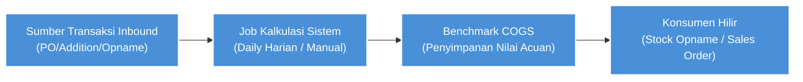
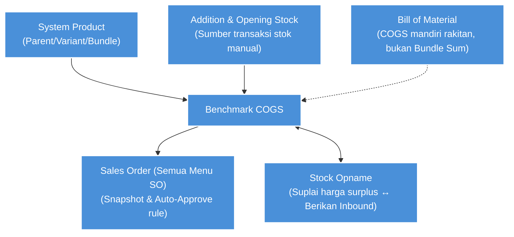

### 📦 Modul/Fitur: Benchmark COGS

**Benchmark COGS** menampilkan nilai acuan **HPP (Harga Pokok Penjualan)** efektif per **System Product**. Menu ini tidak menunjukkan stok jurnal *accounting*, melainkan referensi perhitungan operasional harian yang diperbarui secara otomatis setiap hari pada pukul **00:00 WIB (Asia/Jakarta)** atau dipicu secara manual.

---

### 🔑 Istilah Kunci

| Istilah | Definisi |
| :---- | :---- |
| **Benchmark COGS / COGS** | Nilai acuan HPP efektif per SKU yang merupakan hasil kalkulasi rumus otomatis atau *Manual override*. |
| **Highest Price** | Label *Description* ketika terdapat transaksi valid dalam ≤30 hari terakhir, yang mana sistem mengambil harga tertinggi (sebelum pajak / *before VAT*). |
| **Last Inbound** | Label *Description* ketika tidak terdapat transaksi valid dalam 30 hari terakhir, yang mana sistem mengambil harga transaksi terakhir sebelum periode waktu tersebut. |
| **No Inbound** | Label *Description* ketika belum ada riwayat transaksi valid sama sekali, sehingga nilai COGS ditetapkan menjadi 0. |
| **Manual Input** | Label *Description* ketika COGS sedang di-*override* melalui fitur *Manual COGS* dan belum kedaluwarsa (*expired*) *(TO-BE)*. |
| **Bundle Sum** | *(TO-BE)* Nilai COGS khusus pada *Header Product Bundle* non-random yang dihitung dari total jumlah (COGS efektif komponen × *qty* di resep paket). |
| **Highest Bundle Variant** | *(TO-BE)* Nilai COGS khusus pada *Header Bundle* acak (*random*), yang secara otomatis mengambil nilai tertinggi dari seluruh *sibling header* non-random. |
| **Prepared to invoice** | Kuantitas barang yang telah masuk ke dalam dokumen *Sales Invoice* (SI) yang belum disetujui (konteks *Sales Order*, tidak terikat langsung pada menu ini). |
| **Show Detail** | Fitur *toggle* tampilan baris (Off = menampilkan *Single* dan *Parent* saja; On = menampilkan semua *Variant child*). |
| **Calculate** | Aksi manual per baris untuk memicu penghitungan ulang nilai rumus COGS secara *asynchronous* untuk SKU tersebut beserta varian terkaitnya. |
| **Calculate Log** | Riwayat log audit yang merekam perubahan nilai COGS secara spesifik (menampilkan nilai lama ke baru, tanggal, dan aksi sistem/manual). |
| **Snapshot** | Nilai Benchmark COGS yang terkunci dan tersimpan statis pada transaksi *Sales Order* saat pesanan dibuat, tidak akan ikut berubah meskipun harga di data *master* mengalami perubahan. |
| **Below Benchmark COGS** | *(TO-BE)* Indikator bendera merah (*Error Flag*) di *Sales Order* yang memperingatkan bahwa harga jual *before VAT* berada di bawah nilai *snapshot* Benchmark COGS. |

---

### 🎯 Kapan & Kenapa Dipakai

| Situasi Operasional | Pakai Menu Ini Jika |
| :---- | :---- |
| **Cek Acuan HPP SKU** | Perlu memantau nilai COGS efektif saat ini beserta status sumber pembentuknya (*Highest Price*, *Last Inbound*, dll). |
| **Pasca Transaksi Stok** | Terdapat transaksi stok masuk baru (*Inbound PO*, *Addition*, *Opname IN*, atau *Opening Stock*) yang baru disetujui, lalu Anda ingin memicu hitung ulang secara manual (tombol *Calculate*) tanpa menunggu pembaruan tengah malam. |
| **Audit Perubahan HPP** | Membutuhkan tinjauan riwayat historis (dari nilai lama menuju nilai baru) melalui panel *Calculate Log*. |
| **Koreksi Override** | *(TO-BE)* Terdapat kasus harga promosi, koreksi khusus, atau *temporary cost* yang mewajibkan Anda untuk menimpa rumus melalui fitur *Manual COGS*. |
| **Pantau Header Paket** | *(TO-BE)* Memeriksa nilai COGS dari *Product Bundle* yang didasarkan pada perincian akumulasi resep pembentuknya (*Bundle Sum*). |

> 🛑 **Peringatan:** Jangan gunakan menu ini jika Anda sedang mencari nilai HPP buku besar jurnal *accounting*, karena aturan COA dan persediaan (*inventory*) finansial ditangani pada modul dan laporan pelaporan yang terpisah. Jangan pula mengharapkan edit kolom harga secara langsung, karena fungsi produksi *AS-IS* saat ini masih bersifat *read-only* dari rumus sistem.

---

### 📋 Prasyarat

* **Hak Akses:** Pengguna wajib memiliki *privilege view* untuk mengakses menu Benchmark COGS.
* **System Product Valid:** SKU (baik *Single*, *Parent*, *Variant*, atau *Bundle*) harus terdaftar pada master data Sistem Produk.
* **Status Dokumen Stok:** Khusus untuk memicu kalkulasi rumus normal, harus terdapat minimum satu dokumen transaksi masuk stok dari 4 sumber *allowlist* yang telah disetujui (*approved*) dengan rincian harga *before VAT*.
* **Fungsi Toggle:** Nyalakan *toggle Show Detail* apabila Anda perlu meninjau atau memodifikasi data terperinci hingga ke tingkat *Variant*.
* **Level Sunting Manual:** *(TO-BE)* Fungsi *Manual COGS* dibatasi ketat hanya untuk profil **Single** atau **Variant**; sistem menolak keras percobaan *override* manual pada tingkat **Parent**.

---

### 🔄 Posisi dalam Alur Bisnis

**Keterangan langkah:**

1. Transaksi penambahan fisik barang (*Purchase Inbound PO*, *Stock Addition*, *Opname IN*, atau *Opening Stock*) mencapai status *approved* dari departemen logistik.
2. Sistem *backend* mengeksekusi perhitungan rumus 3-tier pada pukul 00:00 WIB, atau pengguna memaksa kalkulasi *async* seketika menggunakan tombol *Calculate* manual.
3. Modul Benchmark COGS merekam dan menerbitkan angka HPP operasional terbaru berdasarkan rumus atau intervensi nilai *Manual COGS*.
4. Nilai COGS mutakhir tersebut kemudian disuplai sebagai harga bawaan (*default fallback*) saat stok *Stock Opname* surplus, dan dienkapsulasi sebagai *snapshot* harga referensi saat menerbitkan *Sales Order*.

---

### 📍 Lokasi Menu

* **Jalur navigasi:** Finance Accounting → Report → Benchmark COGS
* **Route UI:** `/accounting/product-benchmark-price`

> 🖼️ **[PLACEHOLDER GAMBAR]** — Lokasi menu Benchmark COGS di sidebar (FA → Report).

---

### ⚙️ Cara Nilai COGS Dihitung (Rumus 3-Tier)

Sistem menyeleksi nilai COGS secara mekanis menuruni urutan 3 lapis (*tier*) logika prioritas:

| Tier Aturan | Syarat Kondisi Sistem | Kalkulasi Nilai Akhir | Label Description |
| :---- | :---- | :---- | :---- |
| **Tier 1** | Ditemukan transaksi masuk valid dalam kurun waktu **≤30 hari** terakhir. | Sistem otomatis mengambil angka **tertinggi (MAX)** atas harga *before VAT* dari total keseluruhan sumber transaksi yang sah. | **Highest Price** |
| **Tier 2** | Riwayat transaksi di kurun 30 hari kosong, namun masih ditemukan histori transaksi berumur **>30 hari**. | Sistem mengambil harga pada catatan histori transaksi **terakhir** yang disusun menggunakan sortir *order by date desc*. | **Last Inbound** |
| **Tier 3** | Tidak berhasil menemukan riwayat jejak sumber transaksi logistik yang sah sama sekali. | Sistem memberikan proteksi nilai konstan **0**. | **No Inbound** |

> *Catatan Kalkulasi Waktu:* Hitungan rentang periode 30 hari ditarik dengan presisi menggunakan *timezone* Asia/Jakarta (bermula di titik today - 30 days startOfDay dan berakhir tepat pada today endOfDay).

---

### 📥 Sumber Data Transaksi

Nilai acuan dihitung berdasarkan 4 jenis dokumen sumber valid yang menghasilkan harga masuk (*before VAT*):

1. **Purchase Inbound (PO):** Dokumen penerimaan *Mutation Inbound* yang bersumber dari aktivitas *Purchase Order*.
2. **Stock Addition:** Formulir dokumen *Adjustment Addition* yang diinput melalui metode pencatatan manual.
3. **Stock Opname IN:** Formulir *Adjustment Addition* yang disintesis otomatis akibat selisih stok surplus positif saat proses opname.
4. **Opening Stock:** Catatan dokumen *Addition* yang dibuat secara otomatis oleh sistem saat modul saldo *opening stock* disetujui secara legal.

> 🛑 **Hard Rule:** Berbagai sumber lainnya—seperti *return process inbound*, perpindahan gudang (*transfer inbound*), *failed ship/scrap/lost adjustment*, barang masuk tanpa PO pemasok, hingga transaksi dokumen *Draft/Open* yang belum disetujui—sama sekali **tidak dihitung**. Di dalam status operasional *AS-IS*, kode sistem belum memisahkan *allowlist* ini dengan ketat sehingga seluruh inbound berstatus approved sementara ikut dikalkulasi. Penataan *allowlist* 4 lapis tersebut ditetapkan sebagai target *TO-BE* perbaikan rilis selanjutnya.

---

### 🏷️ Per Tipe Produk

| Tipe Arsitektur Produk | Mekanisme Kalkulasi COGS | Prediksi Label Description |
| :---- | :---- | :---- |
| **Single** | Menjalankan turunan Rumus 3-Tier secara independen. | *Highest Price* / *Last Inbound* / *No Inbound* |
| **Variant (child)** | Mengkalkulasi nilai via Rumus 3-Tier pada level baris varian tersebut sendiri. | *Highest Price* / *Last Inbound* / *No Inbound* |
| **Parent** | Mengekstrak dan menyajikan nilai **MAX** gabungan dari harga *benchmark* seluruh varian anaknya (mengabaikan total keberadaan varian tipe acak/*random*). | *Highest Price* atau *No Inbound* |
| **Random variant** | Mengadopsi sifat turunan murni (pewarisan/*inherit*) langsung dari nilai perhitungan MAX saudara kandung (*sibling*) atau nilai MAX sang *parent*. | Mengikuti status yang dimiliki oleh *parent*-nya |
| **BOM / Rakitan** | Produk komoditas fisik ini akan menjalankan Rumus 3-Tier biasa per SKU layaknya tipe *Single*. | *Highest Price* / *Last Inbound* / *No Inbound* / *Manual Input* |
| **Product Bundle (non-random) *(TO-BE)*** | Dikalkulasikan melalui rumus fungsi Σ gabungan nilai *COGS komponen × qty* masing-masing. | **Bundle Sum** |
| **Product Bundle (random) *(TO-BE)*** | Menarik nilai MAX tertinggi dari himpunan harga *sibling header* komoditas non-random. | **Highest Bundle Variant** |

---

### 📦 Product Bundle — Bundle Sum & Highest Bundle Variant (TO-BE)

Komoditas yang bertipe **Product Bundle** bukanlah *stockable item* yang bisa disimpan di fisik rak gudang, sehingga ia secara murni tidak memiliki riwayat logistik masuk dari *Purchase Order* (*SCM inbound*). Dampaknya, laju acuan untuk *Highest/Last Inbound* pada produk ini akan berujung di angka **0**. Target pembaruan *TO-BE* v1.4 menambahkan rumus deduktif khusus:

* **Bundle Sum:** Diterapkan untuk produk komoditas *header* paket non-random. Rumusnya adalah total gabungan seluruh komponen aktifnya: COGS(header) = Σ (COGS_efektif(komponen_i) × qty_i).
* **Highest Bundle Variant:** Diterapkan spesifik untuk *header Bundle* berlabel random. Rumusnya adalah kalkulasi turunan singkat: COGS = MAX(COGS sibling header non-random) tanpa memecah isi baris komponen detailnya.

**Contoh Kasus Paket Keyboard Biru (Bundle Sum):** Jika isi *bundle* memuat Keyboard (650rb) + Alas (50rb) + Mouse (130rb), maka nilai kalkulasi *Bundle Sum* di header utamanya otomatis mencerminkan **Rp830.000**. Jika *sibling Bundle* putih bernilai Rp835.000, maka varian Bundle Random dari keluarga ini akan mengekstrak nilai tertingginya yaitu **Rp835.000**. Apabila admin memberlakukan entri manual Rp900.000 di kolom *header* paket Keyboard Biru tersebut, maka nilai *Manual Input* akan langsung ditaati secara final sekaligus merusak dan menyingkirkan logika *SUM* di belakangnya.

> 🛑 **Hard Rule:** Jangan campur-adukkan skema ini dengan skema produk komoditas **BOM (Barang Rakitan / Assembly)**. Rakitan merupakan entitas fisik stok nyata (*stockable*) sehingga kalkulasinya menggunakan jalur rekam transaksi Rumus 3-tier (*Highest / Last Inbound*), **bukan** merupakan hasil *Bundle Sum*.

---

### ✏️ Manual COGS Override (TO-BE)

Peningkatan sistem *TO-BE* menghadirkan fitur untuk menimpa intervensi manual (*override*) terhadap kalkulasi harga acuan melalui penggunaan kolom **Manual COGS** beserta parameter kedaluwarsanya di kolom **Manual COGS Expiry**.

* **Tingkatan Produk:** Fitur *override* ini dibatasi keras dan hanya berlaku di level produk **Single** beserta **Variant** (termasuk *header* paket tipe *Bundle*). Mengedit *Manual COGS* pada entitas produk bertipe **Parent** dijamin gagal dan diblokir keras.
* **Logika Kedaluwarsa Expiry:** Apabila bidang *Expiry* dikosongkan secara total, harga manual ditetapkan berlaku secara **permanen**. Namun jika ditetapkan tanggal tertentu berformat (DD-MM-YYYY), nilai *override* itu akan otomatis meluruh terhapus tepat pada pukul **23:59:59 WIB** di hari kalender tersebut, mengembalikan kembali estafet kontrol kepada rumus mekanis sistem.
* **Kembali ke Rumus:** Untuk menghentikan paksa intervensi sebelum *expiry* terjadi, cukup bersihkan (*clear*) isi bidang Manual COGS tersebut, maka harga kembali murni menyerap data Rumus 3-tier secara seketika.
* **Fleksibilitas Nol:** Pengaturan angka 0 sah dieksekusi secara manual, tetapi sistem menolak total penggunaan nilai angka negatif.
* **Perlindungan Job Sync:** Pekerjaan pembaruan harga sistem otomatis harian (00:00) yang dilakukan latar belakang dilarang mutlak menimpa COGS efektif komoditas apabila kolom status intervensi manual ini masih berlaku dan aktif.
* **Fasilitas Impor Massal:** Mengizinkan pengunduhan dan eksekusi pembacaan *spreadsheet Excel* khusus tiga variabel: SKU Code | Manual COGS | Manual COGS Expiry. Pembiaran kekosongan isian pada kolom manual saat aktivitas import akan membersihkan (*clear override*) pengaturan sebelumnya.

---

### 📊 Membaca Datalist

| Nama Kolom Datalist | Fungsi dan Arti Data |
| :---- | :---- |
| **System Product SKU / Name** | Menyajikan kode identitas produk internal perusahaan disertai tuas navigasi (*link*) cepat menuju profil mode sunting. |
| **Type** | Klasifikasi dimensi arsitektur produk yang terbagi antara tipe *Single*, *Parent*, atau tingkatan *Variant*. |
| **Retail Price** | Menyuguhkan variabel harga retail utama (master penjualan) saat ini. |
| **COGS** | Elemen inti dari menu. Ini adalah angka nilai acuan yang paling mutakhir (efektif) dari rumus komputasi maupun intervensi pengguna. |
| **Manual COGS / Expiry *(TO-BE)*** | Status besaran penimpaan operasional angka (*override*) serta tenggat waktu kadaluwarsanya. |
| **Description** | Label penjelas rute logika COGS (*Highest Price*, *Last Inbound*, *No Inbound*, *Manual Input*, *Bundle Sum*, atau *Highest Bundle Variant*). |
| **Audit Tanggal & Aksi** | Menyediakan stempel *COGS Last Updated*, data identitas *Created/Updated by/at*, serta memuat kancing pemicu **Calculate** berwujud sinkronisasi (*icon sync*) per baris tabel. |

> 🖼️ **[PLACEHOLDER GAMBAR]** — Datalist dengan kolom COGS, Description, Show Detail toggle.

Fungsi sakelar **Show Detail** mengendalikan kepadatan visual layar monitor Anda:

* *Posisi Off (Bawaan):* Tabel secara ketat hanya menyajikan produk berstrata *Single* dan induk *Parent*.
* *Posisi On:* Grid meluas dengan merender seluruh kumpulan *Variant child* di baris tersendiri.

---

### 🔄 Tombol Calculate & Calculate Log

* **Memicu Tombol Calculate:** Tombol ini mengeksekusi perhitungan asinkron (*async background job*) per SKU spesifik beserta seluruh rentetan struktur varian di bawahnya agar lekas mematuhi masuknya data nilai valid pasca transaksi stok yang baru saja *approved* (tanpa terbebani menunggu perputaran kalender *midnight*). Tombol ini sama sekali tidak membunuh angka COGS apabila status *Manual COGS* terdeteksi sedang menyala (aktif). Anda sangat direkomendasikan memaksa penarikan ulangan *refresh browser* pasca aktivasi untuk menyaksikan nilai angka COGS termutakhir usai *delay backend* rampung.
* **Calculate Log:** Menyajikan histori visual (*slideover*) yang menceritakan riwayat evolusi harga setiap produk: menampilkan perbandingan lompatan nilai lama ke struktur nilai baru, dilengkapi pencatatan rekam jejak aksi dan tanggal sistem (sistematis maupun manual pengguna).

> 🖼️ **[PLACEHOLDER GAMBAR]** — Baris dengan aksi Calculate (icon sync).
> 🖼️ **[PLACEHOLDER GAMBAR]** — Slideover Calculate Log (riwayat perubahan).

---

### 📤 Export All

Bilah alat *toolbar* diperkuat dengan tombol kendali *Export All* untuk membongkar tabel *datalist* terfilter ke dalam ekstensi bentuk *spreadsheet Excel* (*downloadable format*).

---

### 🔗 Integrasi Stock Opname

Terkait sistem *Stock Opname*, interaksi antar-menu tersebut menaati prinsip logika sirkularitas tergambar (ketergantungan dua arah siklus komoditas / *circular dependency*) yang valid dan diterima sah secara koridor operasional bisnis:

* **Arus Benchmark → Opname:** Di fase *Stock Opname* manakala dijumpai selisih penambahan (*surplus* positif) namun harga tak diintervensi oleh si *operator*, platform langsung mengambil pasokan nominal *default* yang murni dipasok oleh data dari dokumen *Benchmark COGS* terkini ini.
* **Arus Opname IN → Benchmark:** Menjelma dari surplus tersebut, entitas *Opname IN* pasca disetujui (beranjak *approved*) kemudian menyumbang kembali angkanya untuk dibaca di fase penggodokan kalkulasi sumber transaksi komputasi *Benchmark COGS* di esok hari siklus berikutnya. Di tahap akhir, kuasa penentuan sirkulasi ada di tangan *operator*: memasukkan koreksi manual dari panel opname, versus membiarkan mesin menggali rekam data referensi COGS ke belakang.

---

### 🔗 Integrasi Sales Order

Aplikasi menyimpan rekaman jejak digital **Benchmark COGS** di kolom form bersembunyi (dapat diekspos melalui fungsional *column picker*) pada tubuh faktur *Sales Order*. Kehadiran kolom ini didesain krusial sebagai sistem filter otomatis penolakan harga marjin rugi.

* **Doktrin Snapshot History:** Pada milidetik pembuatan baris faktur di SO, harga Benchmark seketika direkam permanen menjadi *snapshot* lokal yang statis. Meskipun Anda bergegas memodifikasi master menu COGS pusat usai penerbitan PO/SO, riwayat tersebut di level SO tidak akan sudi merubah nominal miliknya (*by design*). Mekanisme pengikatan produk platform dan perombakan struktur detail manual dari baris pesanan (*ganti produk*) adalah segelintir rute pemicu sah yang merintahkan SO untuk memanggil (*re-fetch*) data master *benchmark* baru.
* **Validasi Pemblokiran Otomatis (Auto-Approval Block):** Mesin mengeksekusi pemeriksaan perlindungan marjin otomatis. Apabila perbandingan matematis menetapkan bahwa tarif jual *Price Before VAT* transaksi (menggunakan mata uang utama atau dikalibrasi via *exchange rate*) lebih inferior (<) ketimbang *snapshot* Benchmark COGS rekam, pemrosesan perizinan SO dari *job schedule auto-approve* langsung **diblokir dan digagalkan secara sistematis**. Pihak otoritas administrator diwajibkan untuk merealisasikan validasi persetujuan tangan (*manual approve*) jika transaksi itu ingin diizinkan lolos. Blokir batal berlaku di kasus nilai *benchmark* bernilai konstan **0** atau tepat seimbang (==).
* **Bendera Pelacak Below Benchmark COGS (TO-BE):** Persiapan pembaruan ini akan menyuguhkan *Error Flag* ikon merah interaktif (baik secara umum di tingkat kepala SO maupun menyasar SKU tertuduh) sehingga penelusuran marjin bocor sanggup disaring efisien di lingkungan *Sales Platform*, *General*, dan *All Sales Order*.

> 🖼️ **[PLACEHOLDER GAMBAR]** — Contoh integrasi: kolom Benchmark COGS di detail Sales Order (hidden default).

---

### 🛡️ Aturan Bisnis & Validasi

* **Kalau kamu** nekat merancang nominal negatif pada kolom masukan spesifik *Manual COGS*, **maka** operasi mesin menolaknya.
* **Kalau kamu** bersikeras memaksa eksekusi perombakan kolom *Manual COGS* tepat di tubuh produk kelas **Parent**, **maka** sistem menjegal karena akses modifikasi absolut terkonsentrasi eksklusif di jenjang **Single/Variant** semata.
* **Kalau kamu** mendaftarkan baris kelas *Parent* menyelinap ke dalam selubung injeksi data lewat fasilitas fungsi **Import massal**, **maka** rute baris nakal tersebut gugur memunculkan pesan gagal baris (meski rute valid lainnya melenggang lolos ke pangkalan data).
* **Kalau kamu** melampirkan entri blangko (kosong melompong) khusus di bidang sel *Manual COGS* saat menjalankan aktivitas **Import**, **maka** algoritma menghapus intervensi sebelumnya dan mendelegasikan otoritas kepada algoritma mesin (*Clear override*).
* **Kalau kamu** cemas menantikan *Job harian* yang aktif malam hari kala nilai setelan *Manual COGS* intervensimu eksis dan valid (belum kadaluwarsa), **maka** jangan panik karena prosedur algoritma sistem tidak diberikan akses merobohkan maupun mengubah paksa harga efektif manual berproteksi tersebut.
* **Kalau kamu** merenggut navigasi *reload browser* mengandalkan reaksi cepat setelah menderingkan lonceng *Calculate*, **maka** disadari nilai tidak otomatis selalu muncul murni sekejap mata karena antrean siklus operasional mesin dikendalikan via proses belakang layar (*async*) yang mengharuskan operator meremas ulang fungsi penyegaran laman browser perlahan beberapa saat setelahnya.
* **Kalau kamu** mencolok variasi perubahan nilai Benchmark di halaman sistem master tatkala formulir nota transaksi *Sales Order* terlanjur rilis direkam, **maka** tak pelak riwayat memori *snapshot* di dalam nota transaksi yang terbit tak terusik (*tidak berubah sama sekali*).

---

### ⚠️ Keterbatasan & Hal dalam Tinjauan

Daftar inventaris di bawah bukan wujud obligasi perbaikan waktu instan, melainkan pelaporan kerangka keterbatasan operasional kondisi (*AS-IS*) pada platform versi produksi yang beroperasi pasif di lingkungan lapangan:

* **Menu Berwujud Read-Only *(TO-BE v1.3)***: Seluruh perangkat tuas kolom **Manual COGS, Expiry, plus metode unggah Import** belum ditulis secara *live code*, menjadikan modul antarmuka saat ini bertindak sepenuhnya fasif (*read-only*) menghidangkan laporan nilai sistem tanpa kemampuan modifikasi angka mandiri.
* **Misteri Angka 0 di Fitur Paket *(TO-BE v1.4)***: Konsep matematis logis **Bundle Sum & Highest Bundle Variant** untuk komoditas paket produk status pengesahannya sebatas dokumen *requirement* disetujui. Tanpa kerangka logika koding rilis, kepala paket *Product Bundle* di lapangan masih disajikan kosong memamerkan COGS angka konstan 0 / tersemat plakat *No Inbound* akibat komoditas fisik ini hampa bukti surat sejarah pesanan.
* **Absen Bendera Sinyal Auto-Approve *(TO-BE v1.2)***: Parameter penghitung kurs silang dan ikon plakat merah *Below Benchmark COGS* urung tersajikan ke tingkat *Sales Order* lintas modul sepenuhnya, meninggalkan operator untuk memeriksa celah nilai pesanan secara sunyi tanpa notifikasi *Error Flag* masif.
* **Kekurangan Algoritma Filter Allowlist 4 Sumber *(TO-BE v1.1)***: Proyek perbaikan pengetatan empat penyumbang masuk legal belum beroperasi optimal, sehingga arus transfer retur inkuiri (*inbound return / transfer*) acap masuk menerobos dan secara tidak resmi mendistorsi nilai data yang disajikan oleh algoritma pembentuk.

---

### 🔗 Hubungan dengan Menu Lain

**Keterangan:**

1. **System Product / Random SKU:** Menyuplai direktori seluruh struktur rujukan master pembentuk fisik komoditas yang siap dikalkulasi sistem Benchmark.
2. **Stock Addition & Opening Stock:** Formulir pemicu pencatatan manual mutasi gudang yang turut mencampur resep histori penentu angka acuan (*sumber Benchmark*).
3. **Sales Order (General, Platform, All):** Menyerap transfer salinan COGS untuk dikunci mati layaknya sebuah *snapshot*, bertindak memicu perlindungan algoritma pembatas marjin minimum transaksi SO.
4. **Stock Opname:** Berpola simetri lingkaran, di mana nilai Benchmark melempar bantuan angka peninggi nilai otomatis saat opname surplus tanpa *input* operator, selagi dokumen kelolosan gudangnya (Opname IN) ganti memengaruhi angka Benchmark usai proses kelulusan.
5. **Bill of Material:** Produk bersimbol rakitan dilarang masuk wilayah skema paket (*Bundle*), melainkan menunggangi rute *inbound* fisikal reguler untuk menceritakan sejarah angka transaksinya secara murni personal.

---

### 🔧 Troubleshooting

| Simptom / Gejala Permasalahan | Akar Penyebab Biasa | Saran Tindakan Solusi Administratif |
| :---- | :---- | :---- |
| Kolom harga menampakkan figur 0 / Label tulisan *No Inbound* | Sistem mendeteksi riwayat historis kekosongan (sama sekali tiada pergerakan masuk valid pada SKU tersebut). | Buka dokumen verifikasi, pastikan setidaknya sebuah formulir transaksi masuk komoditas (*PO / Addition / Opname IN / Opening Stock*) sukses meraih level lisensi sah *approved* secara komersial. |
| Label harga paket *(Bundle header)* terus terjebak stagnan 0 | Fitur pendorong logis *Bundle Sum* belum rilis operasi ke *live server*, ataupun komponen rincian penyusun dasarnya sendiri bernilai angka 0. | Jalankan navigasi menengok COGS di level rincian komponen pembentuk tunggal; bersabar menanti *release code*, atau klik inisiasi pemicu panggil *Calculate* berkala usai varian diisi. |
| Terpampang COGS bernilai mutlak 0 diiringi status deskripsi *Manual Input* | Tindakan ini mengindikasikan ulah intervensi administrasi yang secara sadar mendelegasikan baris angka 0 pada parameter *Manual COGS*. | Hapus tuas status kolom (*clear Manual*) seandainya menghendaki nilai COGS digodok otomatis merujuk kaidah komputasi Rumus kembali. |
| Angka COGS mematung (menolak update) pasca *Inbound* transaksi stok gudang baru merembes terbit | Ritme proses mekanis *Job harian* belumlah melintasi jam eksekusi tayang, atau benturan intervensi rute *Manual override* terlampau aktif di master sistem. | Segera tembak tombol paksa interupsi manual **Calculate** sebaris terkait; dan kroscek pembiaran isian sel data *Manual COGS* yang mematikan kalkulasi otomatis. |
| Kesenjangan (disparitas) harga antara baris Induk *Parent* melawan spesifik baris sub-*Variant* tertentu | Secara rancangan komputasi terpusat, nilai label *Parent* diwajibkan menjulang menggapai titik langit agregasi *MAX* (memeluk harga puncak rekor) di tengah kerumunan angka seluruh serdadu sub-variannya. | Perkara absolut lazim. Nyalakan parameter instrumen senter **Show Detail** guna mengaudit struktur per baris deretan status turunan varian lapis demi lapis. |
| Penolakan intervensi penyuntingan parameter *Manual* khusus merombak baris hierarki *Parent* | Pembatasan limitasi arsitektur sistem merumuskan aturan kaku (*by design*) pencegah edit langsung baris induk. | Geser modifikasi dan operasikan rute penyuntingan ke lembar target individu baris produk entitas *Variant* yang bertautan terperinci di bawahnya. |
| Algoritma SO menggagalkan order, membentak penerbitan lisensi penolakan marjin merah (*Below Benchmark COGS*) | Selisih laba tergerus karena penawaran komersial tagihan tarif *Price Before VAT (primary)* pelanggan berada di wilayah kolaps jurang bawah angka pengaman batas *snapshot* riwayat produk. | Fungsikan tuas kolom opsi pembuka tirai tampilan sel hiasan penyembunyi nilai; perbaiki penaikan komersial marjin laba tarif, ataupun paksa persetujuan manual administrator pengelola. |

---

### ❓ FAQ

**Q: Benarkah tersemat fasilitas keleluasaan merombak entri parameter COGS mandiri tanpa syarat di modul beranda ini?**
A: **Target fungsi TO-BE ya**—dimensi perombakan dirumuskan via instrumen injeksi *Manual COGS*. Di lanskap status masa operasional transisi saat ini (*AS-IS*), dimensi menu dibekukan secara fasif statis sebatas papan pelaporan monitor resep rumus. Begitu panji peluncuran v1.3 ditancapkan kelak, operator dibolehkan menyelipkan paramater input *Manual COGS / Expiry* termasuk perombakan mengandalkan rute bongkar pasang berkas lembar Excel (*import*).

**Q: Apa implikasi nyata dari perlakuan pengosongan spasi parameter sel isian perihal waktu tenggat *Expiry*?**
A: Pengabaian pencatatan rentang waktu itu disimpulkan mutlak menempatkan proteksi instrumen status rute angka *override* berlaku **permanen sepanjang waktu** mematikan sistem tanpa batas periode hancur terputus, terkecuali pengguna memusnahkan sel isian blok *Manual COGS* guna membuyarkan kutukan paksa itu.

**Q: Lantas, identikkah wujud nilai entri tersebut melawan parameter data nilai stok akuntansi buku besar inventaris komoditas HPP di perbukuan kas jurnal (*accounting*)?**
A: Menolak identik sepenuhnya. Kalkulasi pergerakan instrumen data matriks Benchmark COGS diukur untuk memberikan pijakan sinyal rujukan patokan navigasi taktis logistik operasional keseharian dagang, membelakangi hukum perbukuan HPP jurnal yang diikat ketat terpisah memakai aturan COA komersial maupun pengamanan inventaris pelaporan pelacakan buku akhir penutup bulan.

**Q: Penjabaran logika arsitektur di ranah mana yang menyebabkan varian kelompok kategori acak (*random*) terhempas dianulir keluar menyisakan jejak kelam gagal kalkulasi penentuan rekor puncak titik MAX di baris status sang *parent* induk?**
A: Anatomi susunan matriks klasifikasi baris Varian beridentitas *random* dikonfigurasi kaku berwujud bayang-bayang mutlak turunan mengawal jejak (*inherit*) mewarisi atribut nilai paten figur pengawal sang induk (*parent*); memaksakannya ikut andil perhitungan rekor pertempuran *MAX parent* akan membingungkan komputasi lingkaran kalkulasi mesin (pengecualian: bilamana instrumen itu diangkat menjadi pimpinan komoditas pengawal *header paket random* murni merampas gelar nilai dominan dari algoritma *Highest Bundle Variant* menanti update rilis *TO-BE* v1.4).

**Q: Menyikap takbir ihwal rekayasa kenapa tajuk baris *Product Bundle* lazim mati tersangkut terjerat menyajikan skor angka kronis beridentitas nominal 0?**
A: Kepala bungkus jajaran rentetan paket rakitan artifisial tak sanggup ditukar guling secara logistik wujud materi ke rak pesanan barang nyata rute *inbound*. Usai palu penyempurnaan sistem instrumen pengembang *Bundle* (*TO-BE*) disahkan menetas di mesin peladen kelak, kalkulator perakit menjumlah masif segenap komponen nominal kepingan COGS racikan kuncian penyusun murni ke ranah paket utama.

**Q: Apa fondasi perbedaan mendasar logika jurang pembatas parameter Bundle Sum diadu tanding perakitannya melawan instrumen fisik komoditas manufaktur terpasang (BOM)?**
A: Material rakitan manufaktur operasional BOM dilegalkan murni secara wujud fisik dipindahkan dan **distok menyita ruang volume rak fisik gudang**, mencetak buku harga masuk transaksi tunggal independen dirinya masing-masing layaknya identitas entitas barang soliter mandiri. Parameter instrumen bungkusan buatan fiktif *Bundle* mematuhi aturan pembatas tabu haram stok **tidak distok masuk**, mendelegasikan nilai hitung acuan mengkristal sebatas jumlah matematika kepingan kepingan rasio rakitan harga penyangganya saja.

**Q: Berdampakkah lintasan instrumen komoditas pergerakan nilai data aktivitas Stock Opname masuk *Inbound* menyulut parameter komputasi COGS layar beranda menu ini?**
A: **Afirmatif, Ya.** Lintas pengiriman transmisi opname *IN* memetik kelulusan lisensi *approved*, terhitung terisap membaur menggendutkan parameter pundi data rentetan komputasi pencarian referensi sumber pergerakan komputasi penyumbang instrumen sistem pusat.

**Q: Terpaut perlakuan injeksi aktivitas penuangan angka baris logistik komoditas Stock Addition di manual harian berkontribusi terhadap denyut angka referensi COGS tersebut?**
A: **Afirmatif, Ya.** Salinan ketetapan rentetan instrumen harga yang dilepas pasca lisensi *approve* pada baris formulir *addition*, kontan bertransformasi merintis sumbangan pilar pokok pangkalan basis fondasi mesin kalkulasi komputator beranda angka *benchmark*.

**Q: Mengapa aktivitas modifikasi angka pada parameter form menu gagal merebut sinkronisasi otomatis menerjang melintasi dokumen antrean catatan SO berumur lama?**
A: Penolakan ini mematuhi mandat mutlak desain sistem pertahanan. Instrumen dokumen SO dirancang untuk meringkus paksa menjarah salinan data **snapshot harga sekejap terisolasi** mematri jejak ukur memori sejarah saat per detik momen baris formulir dicatatkan pesanan. Transaksi historis pesanan merdeka mengunci riwayatnya bergelut mengamankan kelestarian penawaran transaksi usang terhadap pelanggan (*history order statis* by design).

---

### 📚 Lihat Juga / Referensi

* [System Product](/docs/scm/system-product/overview)
* [Dev - Sales Order](/docs/omni/sales-order-general/overview)
* [All Sales Order](/docs/businessdevelopment/all-sales-order/overview)
* [Stock Opname](/docs/scm/supplychain-stock-opname/overview)
* [Stock Addition](/docs/scm/supplychain-adjustment-addition/overview)
* [Opening Stock](/docs/accounting/accounting-opening-stock/overview)
* [Bill of Material](/docs/scm/bill-of-material/overview)
* [Random SKU](/docs/scm/random-sku/overview)
