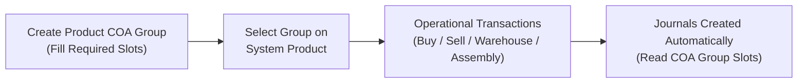
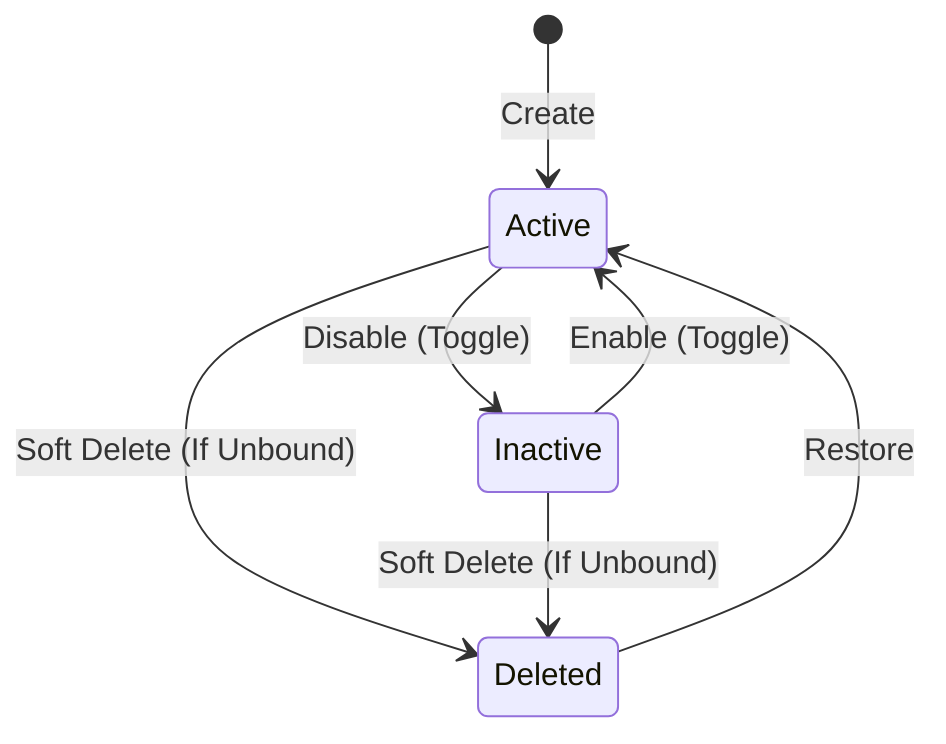
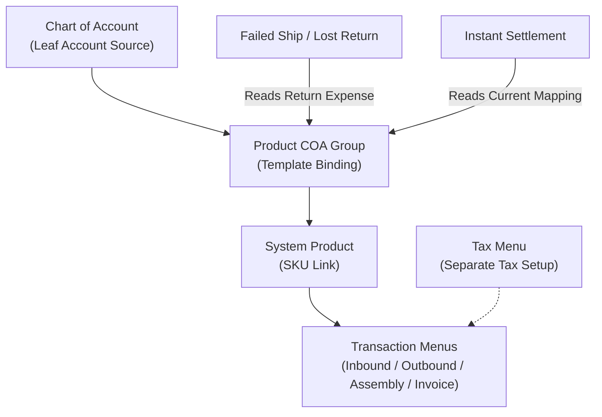

### 📦 Module/Feature: Product COA Group

**Business definition:**
**Product COA Group** is the template for mapping **Chart of Account (COA)** accounts per internal product type (**System Product**). It is the foundation for automatic transaction journals across OlshopERP. Finance and Accounting teams use it to set financial account slots (such as **Sales**, **Inventory**, **COGS**, and **Operational Expense**) before products are linked and used in day-to-day operations.

It groups accounting rules by four internal product types: **Purchased Item**, **Manufactured Item**, **Service**, and **Fix Asset**. This menu does **not** post transactions itself and does **not** auto-link products — it provides **Slot Transaction COA** structures that are called when sales, purchase, inventory, or production transactions run.

### 🔑 Key Terms

| Term | Definition & role |
| :---- | :---- |
| **Slot Transaction COA** | A specific account holder column (e.g. Sales, Inventory) that must be mapped for the product type. |
| **Unbilled Goods** | Temporary liability account for goods received before the supplier’s official *Purchase Invoice*. |
| **WIP (Work In Progress)** | Temporary inventory account for goods in manufacturing / *Assembly*. |
| **Return Expense** | Expense account for losses on missing goods (*Lost Items*) from failed shipment or returns. |
| **COA Leaf** | Lowest-level (child) Chart of Account row with no further sub-accounts, ready for journal posting. |
| **Default** | Flag that a group is auto-selected when a user creates a new **System Product**. |

### 🎯 When & Why to Use

* **Initial system setup:** Configure before transaction modules (Purchase Inbound, Sales Order, Inventory, Assembly) go live.
* **New product type/category:** Create when the company needs a new journal-mapping pattern different from existing templates.
* **Standard automatic journals:** Keep Debit/Credit postings consistent without picking accounts manually on every transaction.

### 📋 Prerequisites

| Prerequisite | Source / menu | Integration notes |
| :---- | :---- | :---- |
| **COA Leaf structure** | Chart of Account | Slot accounts must be active, *COA Leaf* (not header/parent), and not *Current Year Earnings*. |
| **Product entities** | System Product | Assigning a Product COA Group to a product is done in **System Product**, not on this form. |

### 🔄 Place in the Business Flow

Product COA Group bridges financial master data and operational transactions.

**Steps:**

> 1. **Master setup:** Finance builds the Product COA Group template and maps *COA Leaf* accounts into each slot.
> 2. **Product allocation:** Catalog/Inventory selects that group on **System Product**.
> 3. **Run transactions:** Operations run daily sales, purchases, returns, and inventory docs.
> 4. **Accounting automation:** The system posts journals using the Product COA Group slots on the related product.

### 📍 Menu Location & Workspace

* **Navigation:** Finance Accounting → Master → Product COA Group
* **UI route:** `/accounting/product-coa-group`

⚠️ **Important:** Linking products to a group is **not** done on this page. Assign the group from **System Product**.

🖼️ **[IMAGE PLACEHOLDER]** — Product COA Group list with Type and Default columns.

### 🏷️ Status Lifecycle

| Status | Editable? | Deletable? | Rules |
| :---- | :---- | :---- | :---- |
| **Active** | Yes | Yes (conditional) | Can be linked to new **System Product** rows and set as **Default**. |
| **Inactive** | Yes | Yes (conditional) | Hidden from new **System Product** picks. **A Default group cannot be deactivated.** |
| **Deleted** | No | No | Soft-deleted. View or *Restore* to **Active** only. |

### 📊 Four Product Types & Account Slots

Each product type has unique accounting needs. Required slots depend on the selected type:

| Account slot | Purchased Item | Manufactured Item | Service | Fix Asset |
| :---- | :---- | :---- | :---- | :---- |
| **Sales** | Required | Required | Required | — |
| **Sales Return** | Required | Required | Required | — |
| **COGS** | Required | Required | Required | — |
| **Inventory** | Required | Required | — | — |
| **Operational Expense** | Required | Required | Required | — |
| **Inventory Adjustment** | Required | Required | — | — |
| **Return Inventory** | Required | Required | — | — |
| **Unbilled Goods** | Required | Required | Required | Required |
| **Return Expense** | Optional (form)\* | Optional (form)\* | — | — |
| **Work In Progress (WIP)** | Required | Required | — | — |
| **Assets** | — | — | — | Required |
| **Depreciation / Accumulated Depreciation / Disposal Gain-Loss** | — | — | — | Required (form)\*\* |

\* **Return Expense:** Optional on the create form, but **practically required** for *Lost Items* scenarios.  
\*\* **Depreciation:** Required on Fix Asset forms for structure readiness, even though automated depreciation journals are not live yet.

### ⚙️ How to Use

#### Create a Product COA Group

> 1. Open **Product COA Group**, then click **Create**.
> 2. Choose **Type** (Purchased Item / Manufactured Item / Service / Fix Asset). Available slots follow that type.

🖼️ **[IMAGE PLACEHOLDER]** — Create form with Type and type-specific account slots.

> 3. Enter **Code**, **Name**, and pick a *COA Leaf* for every required slot.
> 4. Strongly recommended: fill **Return Expense** early to avoid failed approvals on returns / lost goods later.
> 5. Click **Save**.

#### Set as Default (optional)

> 1. On create/edit, check **Set as Default System Product**.
> 2. Save. This group becomes the automatic pick for new products.

#### Link to products

> 1. Open **System Product**.
> 2. Open the product form and assign **Product COA Group**.

🖼️ **[IMAGE PLACEHOLDER]** — Product COA Group picker on System Product form.

> 3. *For variant products (Parent SKU):* Assign once at Parent/Header level; it applies to all Child SKUs/variants.

### 📋 Field Reference

#### Informational header

| Field | Type | Constraint | Description |
| :---- | :---- | :---- | :---- |
| **Code** | String | Required, unique | Unique group code (per company). |
| **Name** | String | Required, unique | Descriptive group name (per company). |
| **Type** | Dropdown | Required | Purchased Item / Manufactured Item / Service / Fix Asset. Controls slot visibility. |
| **Description** | Text | Optional | Group purpose (max 150 characters). |
| **Set as Default System Product** | Switch | Optional | Company default template. Only one active across all product types. |
| **Active** | Switch | Optional | Active/inactive flag (default: on). |

#### Account slots (COA binding)

> **General rule:** Slots accept *COA Leaf* only and reject *Current Year Earnings*.

| Field | Technical key | Description |
| :---- | :---- | :---- |
| **Sales** | `sales_coa_id` | Revenue account from product sales. |
| **Sales Return** | `sales_return_coa_id` | Holder for sales returns. |
| **COGS** | `cogs_coa_id` | Cost of Goods Sold. |
| **Inventory** | `inventory_coa_id` | Current inventory asset value. |
| **Operational Expense** | `operational_expense_coa_id` | Operating expense for non-stock use/purchase. |
| **Inventory Adjustment** | `inventory_adjustment_coa_id` | Variance account for stock opname / adjustment. |
| **Return Inventory** | `return_inventory_coa_id` | Inventory receipt back from returns. |
| **Unbilled Goods** | `unbilled_goods_coa_id` | Temporary liability for inbound goods before invoice. |
| **Return Expense** | `return_expense_coa_id` | Loss expense for *Lost Items*. |
| **Work In Progress** | `wip_coa_id` | WIP inventory during *Assembly*. |
| **Assets** | `assets_coa_id` | Fixed-asset capitalization (*Fix Asset*). |
| **Depreciation** | `depreciation_coa_id` | Fixed-asset depreciation expense. |
| **Accumulated Depreciation** | `accumulated_depreciation_coa_id` | Accumulated depreciation. |
| **Disposal Gain/Loss** | `disposal_gain_loss_coa_id` | Gain/loss on fixed-asset disposal or sale. |

### 🛡️ Business Rules & Validations

* **If** Code or Name is already used by another group in the same company, **then** save is rejected.
* **If** you deactivate a group that is **Default**, **then** the action is rejected.
* **If** you clear **Default** without setting another group, **then** it is blocked (company must keep at least one default).
* **If** you change **Type** to/from Fix Asset while the group is linked to products that appeared on a *Sales Order*, **then** the change is rejected.
* **If** required slots for the type are empty, **then** the system lists empty slots and rejects save.
* **If** the account is inactive or a *Parent COA*, **then** the pick is rejected.
* **If** the account is *Current Year Earnings*, **then** the slot allocation is blocked.
* **If** you delete a group still linked to active products or marked **Default**, **then** delete is rejected.
* **If** required slots are empty when a related product transaction is approved, **then** approval is cancelled with a fill-account error.
* **If** **Return Expense** is empty and the transaction hits *Lost Items*, **then** approval is blocked.
* **If** a Service or Fix Asset product is used in Stock Opname / stock increase / decrease / remapping, **then** the transaction is blocked automatically.

### ⚠️ Return Expense: Optional on Form, Required for Lost Items

> ⚠️ **WARNING: HARD VALIDATION ON LOST ITEMS**  
> When creating a Product COA Group (*Purchased Item* & *Manufactured Item*), the form allows **Return Expense** to stay empty.  
> But if a linked product hits **Lost Items** — e.g. *Failed Ship* or a sales return that reduces stock — this account is required. If the slot is empty, **transaction approval fails**.  
> **Recommendation:** Always fill **Return Expense** when you first create the group.

### 🏷️ Only One Default Company-Wide

OlshopERP uses a **company-wide default**.  
Even with four product types, there is **only ONE default Product COA Group per company**, not one default per type.

Example: Group A (Purchased) is Default → user sets Default on Group B (Service) → Group A’s Default is **cleared automatically**.

**Impact:** Checking *Set as Default System Product* on a new group immediately removes Default from the previous group, regardless of type.

### 🔄 Editing a Group Used by Many Products

Account changes on a group linked to many **System Product** rows are not applied in hard real time.  
On save, the system runs a **background job sync**. Updates spread to linked products over seconds to minutes. A short *latency* window is expected before every product reflects the new mapping.

### 📄 How Each Slot Is Used in Journals

| COA slot | Main transaction use |
| :---- | :---- |
| **Sales** | Direct sales, receivables recognition, and *Sales Invoice*. |
| **Sales Return** | *Required on the form; current sales-return journals still post back to **Sales**.* |
| **COGS** | Cost of goods sold on sales Outbound. |
| **Inventory** | Inventory asset value on Inbound & Outbound. |
| **Operational Expense** | Direct expense for Service purchases or internal use. |
| **Inventory Adjustment** | Stock variance on Stock Opname & adjustments. |
| **Return Inventory** | Goods returned into warehouse inventory. |
| **Unbilled Goods** | Temporary liability for Inbound before supplier invoice. |
| **Return Expense** | Loss expense for *Lost Items* on Failed Ship & damaged returns. |
| **Work In Progress (WIP)** | Temporary inventory during *Assembly*. |
| **Assets** | Fixed-asset capitalization on Fix Asset receipt. |
| **Depreciation / Accumulation / Gain-Loss** | *Prepared for fixed-asset depreciation and disposal modules.* |

### 🛑 Known Limitations

* **Purchase Return slot hidden:** The field exists in master data but is **hidden from the UI**. Purchase-return logic uses system/company default accounts.
* **Sales Return usage:** Required on the form, but sales-return journals currently still post back to **Sales**. Filling the slot remains mandatory for form validation.
* **Cash/Bank restriction not strict yet:** The system does not auto-block Cash/Bank accounts in inventory/revenue slots. Pick relevant accounts carefully.
* **Fix Asset depreciation:** Depreciation / Accumulated / Disposal slots are required on Fix Asset forms, but periodic automated depreciation is not executed yet.
* **Tax (VAT):** Product COA Group does **not** manage tax accounts. Input/output VAT mapping lives in **Tax**.
* **Export:** Export is *grid-export* (only rows currently visible on screen).

### 🔗 Related Menus

| Menu | Interaction & role |
| :---- | :---- |
| **Chart of Account** | Supplies *COA Leaf* lists for Product COA Group slots. |
| **System Product** | Links products/SKUs to a Product COA Group. |
| **Purchase Inbound / Sales / Assembly** | Read account slots for automatic journals. |
| **Failed Ship & Sales Return** | Call **Return Expense** on *Lost Items*. |
| **Instant Settlement** | Uses the **latest** account mapping when retrying failed journals. |
| **Tax** | VAT accounts are managed separately in Tax. |

### 🛠️ Troubleshooting

| Symptom | Likely cause | What to do |
| :---- | :---- | :---- |
| Approve fails (Sales Invoice / Inbound / Outbound) with account-config error. | A required slot on the product’s Product COA Group is empty. | Open **Product COA Group** and fill the indicated slots. |
| **Failed Ship** approval blocked. | **Return Expense** is empty. | Fill **Return Expense**, save, retry approval. |
| Delete or Inactive toggle blocked. | Group still linked to active **System Product**, or is **Default**. | Unassign in **System Product**, or move **Default** to another group. |
| Product missing from Stock Opname / Adjustment search. | Group type is Service or Fix Asset. | *Expected.* Service and fixed-asset products are blocked from stock adjustment. |
| Excel/CSV export incomplete. | Export only downloads currently visible rows (*Grid Export*). | Raise rows per page or filter first, then export. |

### ❓ FAQ

* **Q: Where do I configure VAT (PPN) accounts for products?**
  * **A:** In **Tax**, not Product COA Group.
* **Q: Where does Accounts Payable come from on Purchase Inbound?**
  * **A:** From Supplier/Company accounting setup. **Unbilled Goods** is only a temporary liability before Purchase Invoice.
* **Q: Can I link products from inside Product COA Group?**
  * **A:** No. Assign the group from **System Product**.
* **Q: Why don’t edits apply to linked products in the same second?**
  * **A:** Updates run via *background job sync* so performance stays stable when a group covers thousands of SKUs.
* **Q: Can I have two defaults (e.g. Purchased + Service)?**
  * **A:** No. **Default** is company-wide — one default for all product types.

### 📑 See Also

* **System Product** — assign Product COA Group to parent SKU & variants
* **Chart of Account (COA)** — parent and *COA Leaf* structure
* **Tax** — VAT account mapping
* **Purchase Inbound & Outbound** — warehouse flow and automatic journals
* **Assembly** — WIP account usage
* **Instant Settlement** — fixing failed journal posts
