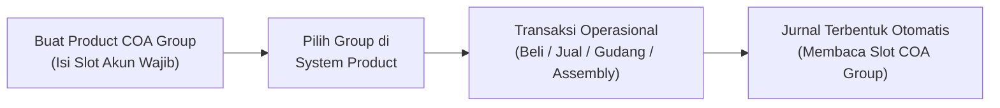
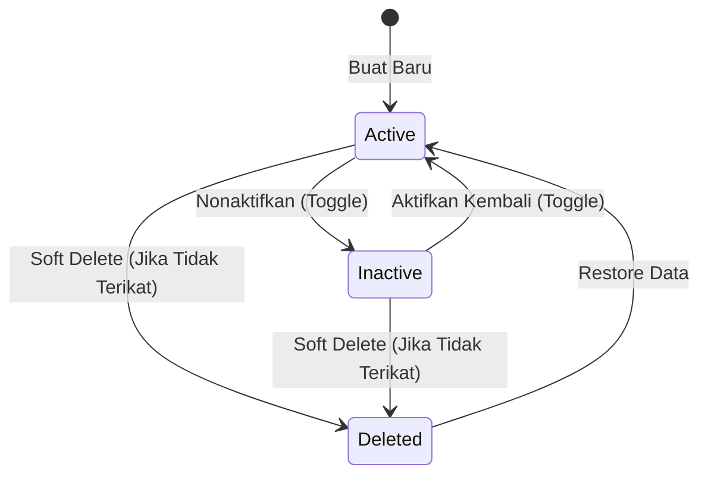
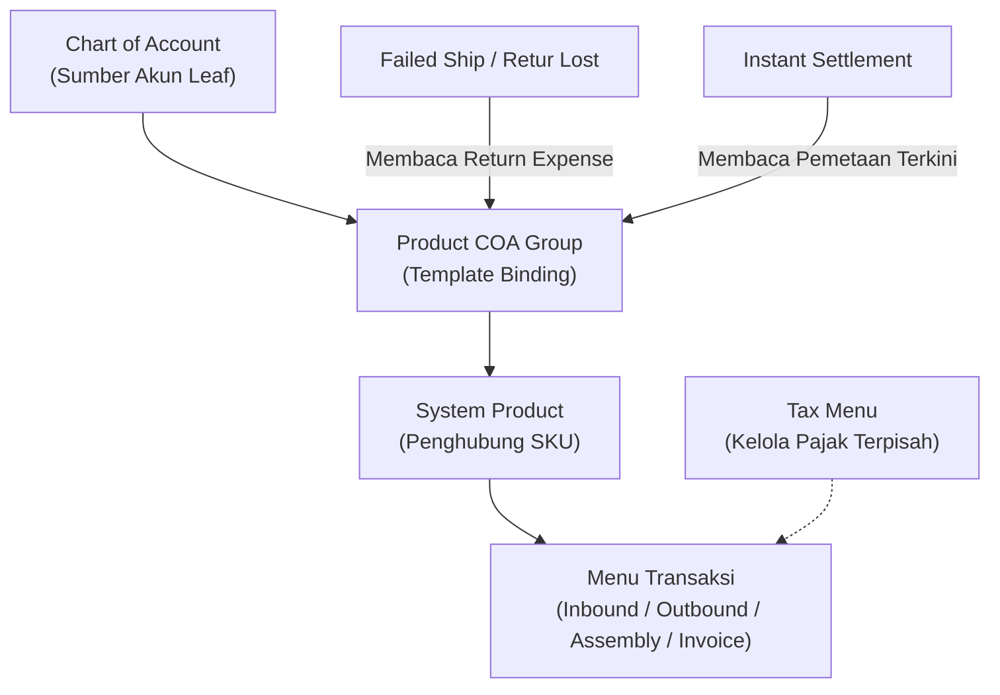

### 📦 Modul/Fitur: Product COA Group

**Definisi Bisnis:**
**Product COA Group** adalah menu template pemetaan akun **Chart of Account (COA)** per tipe produk internal (**System Product**) yang menjadi fondasi penentuan jurnal transaksi otomatis di OlshopERP. Tim Finance dan Accounting memakai menu ini untuk menentukan slot akun finansial (seperti **Sales**, **Inventory**, **COGS**, hingga **Operational Expense**) sebelum produk dihubungkan dan dipakai dalam transaksi operasional.

Menu ini berfungsi sebagai cetakan (template) pemetaan akun yang mengelompokkan aturan akuntansi berdasarkan empat tipe produk internal: **Purchased Item**, **Manufactured Item**, **Service**, dan **Fix Asset**. Menu ini **tidak** mencatat transaksi secara langsung dan **tidak** menghubungkan produk secara otomatis — melainkan menyediakan struktur **Slot Transaction COA** yang dipanggil saat transaksi penjualan, pembelian, persediaan, maupun produksi berlangsung.

### 🔑 Istilah Kunci

| Istilah | Definisi & fungsi |
| :---- | :---- |
| **Slot Transaction COA** | Kolom penampung akun spesifik (misal: Sales, Inventory) yang harus dipetakan sesuai tipe produk. |
| **Unbilled Goods** | Akun kewajiban/utang sementara untuk mencatat penerimaan barang sebelum tagihan resmi (*Purchase Invoice*) diterbitkan supplier. |
| **WIP (Work In Progress)** | Akun persediaan sementara untuk nilai barang yang sedang dalam proses manufaktur/perakitan (*Assembly*). |
| **Return Expense** | Akun beban untuk kerugian atas barang yang hilang (*Lost Items*) akibat kegagalan pengiriman atau retur. |
| **COA Leaf** | Akun tingkat paling bawah (anak) dalam Chart of Account yang tidak punya sub-akun lagi dan siap menerima posting jurnal. |
| **Default** | Penanda bahwa suatu group terpilih otomatis saat pengguna membuat **System Product** baru. |

### 🎯 Kapan & Kenapa Dipakai

* **Inisialisasi sistem (initial setup):** Dikonfigurasi di awal implementasi sebelum modul transaksi (Purchase Inbound, Sales Order, Inventory, Assembly) dioperasikan.
* **Penambahan tipe/kategori produk baru:** Dibuat saat perusahaan membutuhkan pola pemetaan jurnal baru yang berbeda dari template yang sudah ada.
* **Standardisasi jurnal otomatis:** Memastikan transaksi operasional menghasilkan posting Debit/Kredit yang konsisten tanpa memilih akun manual di setiap transaksi.

### 📋 Prasyarat

| Prasyarat | Sumber / menu | Catatan integrasi |
| :---- | :---- | :---- |
| **Struktur COA Leaf** | Chart of Account | Akun di slot harus aktif, berposisi *COA Leaf* (bukan header/parent), dan bukan *Current Year Earnings*. |
| **Entitas produk** | System Product | Assign Product COA Group ke produk dilakukan di **System Product**, bukan dari form Product COA Group ini. |

### 🔄 Posisi dalam Alur Bisnis

Product COA Group menjadi jembatan antara master data keuangan dengan transaksi operasional.

**Keterangan langkah:**

> 1. **Konfigurasi master:** Tim Finance menyusun template Product COA Group dan memetakan akun *COA Leaf* ke masing-masing slot.
> 2. **Pengalokasian produk:** Tim Catalog/Inventory memilih Product COA Group pada master **System Product**.
> 3. **Eksekusi transaksi:** User operasional menjalankan transaksi harian (penjualan, pembelian, retur, persediaan).
> 4. **Automasi akuntansi:** Sistem membukukan jurnal ke ledger dengan merujuk pemetaan slot akun di Product COA Group produk terkait.

### 📍 Lokasi Menu & Workspace

* **Navigasi:** Finance Accounting → Master → Product COA Group
* **Route UI:** `/accounting/product-coa-group`

⚠️ **Penting:** Menghubungkan produk ke group **tidak dilakukan di halaman ini**. Assign group ke produk dilakukan melalui menu **System Product**.

🖼️ **[IMAGE PLACEHOLDER]** — Halaman daftar Product COA Group dengan kolom Type dan Default.

### 🏷️ Siklus Status

| Status | Boleh diedit? | Boleh dihapus? | Aturan & constraint |
| :---- | :---- | :---- | :---- |
| **Active** | Ya | Ya (bersyarat) | Dapat dihubungkan ke **System Product** baru dan dijadikan **Default**. |
| **Inactive** | Ya | Ya (bersyarat) | Tidak muncul dalam pilihan pembuatan **System Product** baru. **Group Default dilarang dinonaktifkan.** |
| **Deleted** | Tidak | Tidak | Soft-delete. Hanya dapat dilihat atau di-*Restore* ke **Active**. |

### 📊 Empat Tipe Produk & Slot Akun

Setiap tipe produk punya karakteristik akuntansi unik. Pengisian slot akun spesifik berdasarkan tipe yang dipilih:

| Slot akun | Purchased Item | Manufactured Item | Service | Fix Asset |
| :---- | :---- | :---- | :---- | :---- |
| **Sales** | Wajib | Wajib | Wajib | — |
| **Sales Return** | Wajib | Wajib | Wajib | — |
| **COGS** | Wajib | Wajib | Wajib | — |
| **Inventory** | Wajib | Wajib | — | — |
| **Operational Expense** | Wajib | Wajib | Wajib | — |
| **Inventory Adjustment** | Wajib | Wajib | — | — |
| **Return Inventory** | Wajib | Wajib | — | — |
| **Unbilled Goods** | Wajib | Wajib | Wajib | Wajib |
| **Return Expense** | Opsional (form)\* | Opsional (form)\* | — | — |
| **Work In Progress (WIP)** | Wajib | Wajib | — | — |
| **Assets** | — | — | — | Wajib |
| **Depreciation / Akumulasi Penyusutan / Laba-Rugi Pelepasan Aset** | — | — | — | Wajib (form)\*\* |

\* **Return Expense:** Opsional pada form awal, namun **wajib secara praktis** untuk skenario barang hilang (*Lost Items*).  
\*\* **Depreciation:** Wajib diisi pada form Fix Asset sebagai kesiapan struktur, meskipun logika otomatisasi jurnal penyusutan belum berjalan.

### ⚙️ Cara Penggunaan

#### Membuat Product COA Group baru

> 1. Masuk ke **Product COA Group**, lalu klik **Create**.
> 2. Pilih **Type** (Purchased Item / Manufactured Item / Service / Fix Asset). Form menyesuaikan ketersediaan slot akun.

🖼️ **[IMAGE PLACEHOLDER]** — Form Create dengan pilihan Type dan daftar slot akun sesuai Type.

> 3. Masukkan **Code**, **Name**, serta pilih akun *COA Leaf* pada setiap slot wajib.
> 4. Sangat disarankan mengisi **Return Expense** agar menghindari gagal *approval* retur/barang hilang di kemudian hari.
> 5. Klik **Save**.

#### Menetapkan sebagai Default (opsional)

> 1. Pada form create/edit, centang **Set as Default System Product**.
> 2. Simpan. Group ini menjadi acuan otomatis saat pembuatan produk baru.

#### Menghubungkan ke produk

> 1. Buka menu **System Product**.
> 2. Buka form produk, lalu alokasikan **Product COA Group** pada kolom yang tersedia.

🖼️ **[IMAGE PLACEHOLDER]** — Pemilihan Product COA Group di form System Product.

> 3. *Untuk produk varian (Parent SKU):* Alokasi cukup **satu kali** di level Parent/Header; berlaku otomatis untuk seluruh Child SKU/varian.

### 📋 Referensi Field

#### Informational header

| Field | Type | Constraint | Description |
| :---- | :---- | :---- | :---- |
| **Code** | String | Wajib, unik | Kode unik group (per perusahaan). |
| **Name** | String | Wajib, unik | Nama deskriptif group (per perusahaan). |
| **Type** | Dropdown | Wajib | Purchased Item / Manufactured Item / Service / Fix Asset. Menentukan visibilitas slot. |
| **Description** | Text | Opsional | Penjelasan fungsi group (maks. 150 karakter). |
| **Set as Default System Product** | Switch | Opsional | Template default perusahaan. Hanya 1 data aktif untuk seluruh tipe produk. |
| **Active** | Switch | Opsional | Status aktif/nonaktif (default: aktif). |

#### Slot akun (COA binding)

> **Aturan umum:** Seluruh slot hanya menerima *COA Leaf* dan menolak akun *Current Year Earnings*.

| Field | Technical key | Description |
| :---- | :---- | :---- |
| **Sales** | `sales_coa_id` | Akun pendapatan dari penjualan produk. |
| **Sales Return** | `sales_return_coa_id` | Akun penampung retur penjualan. |
| **COGS** | `cogs_coa_id` | Akun Biaya Pokok Penjualan (HPP). |
| **Inventory** | `inventory_coa_id` | Akun nilai persediaan aset lancar gudang. |
| **Operational Expense** | `operational_expense_coa_id` | Akun beban operasional atas penggunaan/pembelian produk non-stok. |
| **Inventory Adjustment** | `inventory_adjustment_coa_id` | Akun penyesuaian selisih nilai persediaan (Stok Opname / Adjustment). |
| **Return Inventory** | `return_inventory_coa_id` | Akun penerimaan persediaan kembali akibat retur. |
| **Unbilled Goods** | `unbilled_goods_coa_id` | Akun utang sementara atas barang masuk yang belum terbit faktur. |
| **Return Expense** | `return_expense_coa_id` | Akun biaya kerugian barang hilang (*Lost Items*). |
| **Work In Progress** | `wip_coa_id` | Akun persediaan barang dalam proses produksi (*Assembly*). |
| **Assets** | `assets_coa_id` | Akun kapitalisasi nilai aset tetap (*Fix Asset*). |
| **Depreciation** | `depreciation_coa_id` | Akun beban penyusutan aset tetap. |
| **Accumulated Depreciation** | `accumulated_depreciation_coa_id` | Akun akumulasi penyusutan aset tetap. |
| **Disposal Gain/Loss** | `disposal_gain_loss_coa_id` | Akun laba/rugi pelepasan atau penjualan aset tetap. |

### 🛡️ Aturan Bisnis & Validasi

* **Jika** Code atau Name sudah dipakai group lain di perusahaan yang sama, **maka** penyimpanan ditolak.
* **Jika** Anda menonaktifkan group yang sedang **Default**, **maka** tindakan ditolak.
* **Jika** Anda melepas centang **Default** tanpa menetapkan pengganti, **maka** proses diblokir (perusahaan wajib punya minimal satu default).
* **Jika** Anda mengganti **Type** ke/dari Fix Asset sementara group sudah terikat produk yang pernah tercatat di *Sales Order*, **maka** perubahan ditolak.
* **Jika** slot akun wajib kosong sesuai tipe, **maka** sistem menampilkan daftar slot kosong dan menolak simpan.
* **Jika** akun tidak aktif atau merupakan *Parent COA*, **maka** pilihan ditolak.
* **Jika** akun adalah *Current Year Earnings*, **maka** alokasi slot diblokir.
* **Jika** Anda menghapus group yang masih terhubung produk aktif atau sedang **Default**, **maka** penghapusan ditolak.
* **Jika** slot wajib kosong saat transaksi produk akan di-*Approve*, **maka** approval dibatalkan dengan error instruksi pengisian akun.
* **Jika** **Return Expense** kosong dan transaksi menghadapi *Lost Items*, **maka** approval diblokir.
* **Jika** produk tipe Service atau Fix Asset dimasukkan ke Stok Opname / penambahan / pengurangan / remapping stok, **maka** transaksi diblokir otomatis.

### ⚠️ Return Expense: Opsional di Form, Wajib untuk Barang Hilang

> ⚠️ **WARNING: HARD VALIDATION ON LOST ITEMS**  
> Saat membuat Product COA Group (tipe *Purchased Item* & *Manufactured Item*), sistem mengizinkan mengosongkan **Return Expense** tanpa error form.  
> Namun jika produk terkait mengalami **barang hilang (Lost Items)** — misalnya *Failed Ship* atau retur penjualan yang mengurangi stok — sistem membutuhkan akun ini. Jika slot kosong, **approval transaksi akan gagal**.  
> **Rekomendasi:** Selalu isi **Return Expense** saat pertama kali membuat Product COA Group.

### 🏷️ Hanya Satu Default untuk Seluruh Perusahaan

Sistem menerapkan aturan **Company-Wide Default**.  
Meskipun ada 4 tipe produk, sistem **hanya mengizinkan SATU Product COA Group default per perusahaan**, bukan satu default per tipe.

Contoh: Group A (Purchased) sedang Default → user mengaktifkan Default pada Group B (Service) → status Default Group A **otomatis lepas**.

**Dampak:** Saat Anda mencentang *Set as Default System Product* pada group baru, default group lama **langsung dilepas**, tanpa peduli apakah tipenya sama atau berbeda.

### 🔄 Mengedit Group yang Sudah Dipakai Banyak Produk

Perubahan akun pada group yang terhubung ke banyak **System Product** tidak sinkron seketika (*real-time*).  
Saat Anda menyimpan perubahan akun, sistem menjalankan **background job sync**. Perubahan disebarkan ke produk terikat secara bertahap (detik hingga menit). Ada potensi jeda singkat (*latency*) sebelum semua produk mencerminkan pemetaan baru.

### 📄 Bagaimana Tiap Slot Dipakai di Jurnal

| Slot COA | Area penggunaan utama |
| :---- | :---- |
| **Sales** | Penjualan langsung, pengakuan piutang, dan *Sales Invoice*. |
| **Sales Return** | *Wajib di form, namun jurnal retur penjualan saat ini merujuk slot **Sales**.* |
| **COGS** | Beban Pokok Penjualan saat Outbound penjualan. |
| **Inventory** | Nilai aset persediaan saat Inbound & Outbound. |
| **Operational Expense** | Beban langsung pembelian Service atau pemakaian internal. |
| **Inventory Adjustment** | Selisih nilai persediaan pada Stok Opname & penyesuaian stok. |
| **Return Inventory** | Penerimaan kembali nilai barang ke gudang dari retur. |
| **Unbilled Goods** | Utang sementara atas Inbound sebelum tagihan supplier. |
| **Return Expense** | Beban kerugian *Lost Items* pada Failed Ship & retur rusak. |
| **Work In Progress (WIP)** | Persediaan sementara selama *Assembly*. |
| **Assets** | Kapitalisasi aset tetap saat penerimaan tipe Fix Asset. |
| **Depreciation / Accumulation / Gain-Loss** | *Disiapkan untuk modul penyusutan dan pelepasan aset tetap.* |

### 🛑 Keterbatasan yang Diketahui

* **Slot Purchase Return disembunyikan:** Field terdaftar di master data tetapi **disembunyikan dari UI**. Logika retur pembelian memakai konfigurasi akun bawaan sistem/pengaturan umum perusahaan.
* **Penggunaan Sales Return:** Wajib di form, namun jurnal retur penjualan saat ini masih memposting balik ke slot **Sales**. Pengisian tetap wajib untuk validasi form.
* **Restriksi akun Kas/Bank belum ketat:** Sistem belum memblokir otomatis jika user memilih akun Kas/Bank ke slot persediaan/pendapatan. Pilih akun yang relevan dengan cermat.
* **Fitur penyusutan Fix Asset:** Slot Depreciation / Accumulated / Disposal wajib di form Fix Asset, tetapi mesin kalkulasi otomatisasi penyusutan periodik belum dieksekusi.
* **Pengaturan pajak (PPN):** Product COA Group **tidak** mengelola akun pajak. Pemetaan PPN Masukan/Keluaran di menu **Tax**.
* **Ekspor data:** Fitur Export bersifat *Grid-Export* (hanya baris yang sedang tampil di layar).

### 🔗 Hubungan dengan Menu Lain

| Nama menu | Bentuk interaksi & peran |
| :---- | :---- |
| **Chart of Account** | Menyediakan daftar *COA Leaf* untuk slot Product COA Group. |
| **System Product** | Menghubungkan produk/SKU ke Product COA Group. |
| **Purchase Inbound / Sales / Assembly** | Membaca slot akun untuk jurnal otomatis. |
| **Failed Ship & Retur Penjualan** | Memanggil **Return Expense** pada skenario *Lost Items*. |
| **Instant Settlement** | Memakai pemetaan akun **terkini** saat retry jurnal yang gagal. |
| **Tax** | Akun PPN dikelola mandiri di Tax, tidak dari menu ini. |

### 🛠️ Troubleshooting

| Gejala | Kemungkinan penyebab | Langkah solusi |
| :---- | :---- | :---- |
| Gagal *Approve* (Sales Invoice / Inbound / Outbound) dengan error konfigurasi akun. | Slot wajib pada Product COA Group produk terkait masih kosong. | Buka **Product COA Group**, lengkapi slot yang diindikasi error. |
| Approval **Failed Ship** diblokir. | **Return Expense** kosong. | Isi **Return Expense**, simpan, lalu ulangi approval. |
| Delete atau toggle Inactive tidak bisa. | Group masih terikat **System Product** aktif, atau sedang **Default**. | Lepas assign di **System Product**, atau alihkan **Default** ke group lain. |
| Produk tidak muncul di Stok Opname / Adjustment. | Group bertipe Service atau Fix Asset. | *Perilaku normal.* Produk jasa dan aset tetap diblokir dari penyesuaian stok. |
| Export Excel/CSV tidak lengkap. | Export hanya mengunduh baris yang sedang tampil (*Grid Export*). | Naikkan rows per page atau filter dulu sebelum export. |

### ❓ FAQ

* **Q: Di mana konfigurasi akun PPN untuk produk?**
  * **A:** Di menu **Tax**, bukan Product COA Group.
* **Q: Dari mana akun Utang Usaha (AP) diambil saat Purchase Inbound?**
  * **A:** Dari konfigurasi akuntansi Supplier/Company. Slot **Unbilled Goods** hanya penampung utang sementara sebelum Purchase Invoice.
* **Q: Bisakah menghubungkan produk langsung dari Product COA Group?**
  * **A:** Tidak. Assign group ke produk dari menu **System Product**.
* **Q: Mengapa edit group tidak langsung berdampak di detik yang sama?**
  * **A:** Pembaruan berjalan bertahap via *background job sync* agar performa tetap stabil jika group dipakai ribuan SKU.
* **Q: Bisakah dua default (misal Purchased + Service)?**
  * **A:** Tidak. **Default** berlaku *company-wide* — satu perusahaan hanya satu default untuk seluruh tipe.

### 📑 Lihat Juga

* **System Product** — alokasi Product COA Group ke SKU induk & varian
* **Chart of Account (COA)** — struktur akun induk dan *COA Leaf*
* **Tax** — pemetaan akun PPN
* **Purchase Inbound & Outbound** — alur gudang dan jurnal otomatis
* **Assembly** — penggunaan akun WIP
* **Instant Settlement** — perbaikan kegagalan posting jurnal
