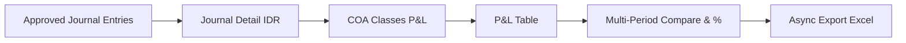
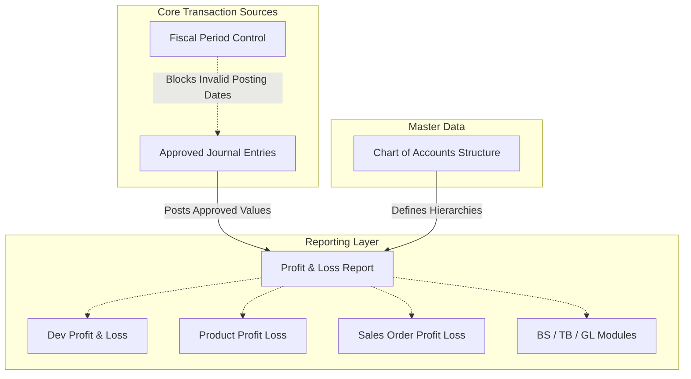

### 📦 Module/Feature: Profit & Loss

**Business definition:**
**Profit & Loss** (Income Statement) in OlshopERP is a *read-only* report that summarizes company financial performance over a chosen period. It aggregates activity from four main **Chart of Accounts (COA)** classes: **Revenue**, **Other Revenue & Expenses**, **Cost Of Goods Sold (COGS)**, and **Expense**.

Balances are calculated dynamically in the base currency (**IDR**) from **Approved** **Journal** transactions. Key features: side-by-side *multi-period* comparison (up to 12 total period columns), variance percentages, and *asynchronous* Excel export for audit and management decisions.

### 📊 Field Reference

| Field | Type | Description | Rules |
| :---- | :---- | :---- | :---- |
| **From Date** | Date | Start of the report period. | Required; valid date. |
| **To Date** | Date | End of the report period. | Required; must be ≥ From Date. |
| **Preset** | Select | Quick ranges relative to the start of the current month (1, 2, 3 weeks, or 1 month). | Optional; auto-fills the date range. |
| **Compared Period** | Integer | How many prior periods to show side by side (0 to 11). | Default: 0 (None); max: 11. |
| **Search Builder** | Filter | Interactive filter for COA accounts or classes. | Optional. |
| **Account Name / Code** | Hierarchy | Parent and Leaf account tree from COA. | *Read-only*; grouped by class. |
| **Period Amount** | Currency | Account balance in **IDR** for that period. | *Read-only*; 2 decimal places. |
| **Variance Percentage** | Percentage | Relative change between the newer period and the column to its right. | Hidden when 0% or Compared Period = 0. |

### 🧮 Business Logic & Formulas

#### Journal ingest rules

**Profit & Loss** is *read-only* (no create, edit, approve, or delete of transactions). Figures come dynamically from **Journal** status:

> ⚠️ **Hard Rule:** Only **Approved** journals count toward Leaf and Parent balances. Draft, Open, or Rejected journals **do not** enter the normal report.

**Steps:**

> 1. Only **Approved** journals are processed.
> 2. Journal lines convert to **IDR** using the FX rate stored at posting time.
> 3. Accounts map into the four P&L classes (Revenue, Other Revenue & Expenses, COGS, Expense).
> 4. Balances appear on the report table.
> 5. Variance formulas compare multi-period columns.
> 6. Excel export runs in the background (*async*).

**Aggregation detail:**

> 1. Verify all **Approved** journal details in the selected date range.
> 2. Foreign-currency lines use the rate stored when the journal was created.
> 3. Accounts are filtered to the four P&L classes.
> 4. **Leaf** amounts are calculated; **Parent** sums children (no double-counting).
> 5. Dynamic period windows compute % change on comparison columns.

#### Multi-period window logic

* **Fixed-duration path (non-whole-month):**  
  If the range is not a full calendar month, duration D = (To Date − From Date) + 1 day. Each comparison column steps back continuously by D days with no gap and no overlap.  
  *Example (45 days):* Main period 01-Apr-2026 to 15-May-2026 → Comparison 1 = 15-Feb-2026 to 31-Mar-2026 (45 days).

* **Whole-month path:**  
  If From Date is the 1st and To Date is the last day of the same month, comparison columns step back by **full calendar months** (28/30/31 days as applicable).

#### Variance % formula

Variance % = (Amount_New − Amount_Old) / |Amount_Old| × 100%

* **\> 0%** — shown in **green**.
* **\< 0%** — shown in **red**.
* **= 0%** — % is not shown.
* **Edge case** (Amount_Old = 0 and Amount_New ≠ 0) — system shows ±100%.

> ⚠️ **Warning — Revenue sign (Debit minus Credit):**  
> Production shows raw **Debit minus Credit**. Because **Revenue** normally has a *Credit* balance, income appears **negative (-)**. This is AS-IS behavior (unlike *Dev Profit & Loss*, which flips to positive) and is **not a bug**.

### ⚙️ How to Use

> 1. Open `/accounting/profit-loss`.
> 2. Set **From Date** / **To Date** or pick a **Preset**.
> 3. Set **Compared Period** (0 = one column; up to 11 for multi-period).
> 4. Click **Apply** to load the table.
> 5. Hover amounts for basic journal and FX tooltips.
> 6. Click **Export All** for async Excel download.

🖼️ **[IMAGE PLACEHOLDER]** — Profit & Loss menu in Finance & Accounting Report sidebar.  
🖼️ **[IMAGE PLACEHOLDER]** — Period filters: From/To, Preset, Compared Period, Apply.  
🖼️ **[IMAGE PLACEHOLDER]** — P&L table after Apply (multi-period, %, COA hierarchy).  
🖼️ **[IMAGE PLACEHOLDER]** — Hover tooltip on an amount.  
🖼️ **[IMAGE PLACEHOLDER]** — Export All button and async progress/log.

### 📍 Menu Location

* **Navigation:** Finance Accounting → Report → Profit & Loss
* **UI route:** `/accounting/profit-loss`

### 📊 Profit & Loss vs Dev Profit & Loss

| Parameter | Profit & Loss (production) | Dev Profit & Loss (legacy) |
| :---- | :---- | :---- |
| **Route** | `/accounting/profit-loss` | `/accounting/profit-loss-v1` |
| **Interface** | One dynamic multi-period table | Summary cards + two separate tables |
| **Compare** | Yes (up to 11 comparison periods) | No |
| **Export** | Yes (async Excel) | No |
| **Filter All Time** | No | Yes |
| **Revenue sign** | Raw (Debit − Credit) → **negative** | Flipped → **positive** |

### 🛡️ Business Rules & Validations

| User condition / action | System behavior |
| :---- | :---- |
| Empty / invalid dates | Rejects; dates are required. |
| Change filters without **Apply** | Table stays unchanged until **Apply**. |
| **Export All** with empty data | Cancels export; message *"There is no data to export"*. |
| Very long date range | Still processed (may load slower). |

### 🔜 Not Available Yet (TO-BE)

These items are **not in production** and still await business decisions:

* **Advanced period dropdown** — Last Month, This Month, Quarter (today only week/month presets from month start).
* **Gross Profit & Net Profit rows** — automatic GP/NP lines (today only per-class totals).
* **% color by account nature** — green/red currently follow math sign only (e.g. falling expense is not yet green).
* **Hide account detail (summary only)** — option to hide leaves and show parents only.
* **Tag / Store filter** — use **Product Profit Loss** or **Sales Order Profit Loss** for product/SO dimensions.

### 🛑 Known Technical Limitations

* **Current Profit/Loss account:** uses a separate history query that currently **does not filter** Approved journal status — still under Finance/Dev review.
* **Non-month column date headers:** possible 1-day label mismatch between FE display and BE calculation for free-duration ranges.

### 🔗 Related Menus

**Notes:**

> 1. **Approved Journal** is the main number source for P&L.
> 2. **Fiscal Period** gates journal posting dates; it does **not** block report date filters.
> 3. **COA** defines parent-child hierarchy and classes.
> 4. P&L sits alongside BS / TB / GL and Product P&L / SO P&L.

| Menu | Role |
| :---- | :---- |
| **Journal** | Number source (must be Approved). |
| **Chart of Accounts** | Row names, classes, parent-child. |
| **Fiscal Period** | Journal posting gate; does not cancel P&L date filters. |
| **Product Profit Loss / Sales Order Profit Loss** | Profitability by SKU or SO. |
| **Dev Profit & Loss** | Legacy without multi-period/export. |

### 🛠️ Troubleshooting

| Symptom | Likely cause | What to do |
| :---- | :---- | :---- |
| Table stays empty | **Apply** not clicked or dates empty | Fill dates, then click **Apply**. |
| Amounts are 0 despite activity | Journals not Approved, or account outside the four P&L classes | Approve journals; map to Revenue/COGS/Expense/Other. |
| Revenue shows negative (-) | Raw Debit minus Credit | Expected AS-IS behavior; not a calculation error. |
| Export fails / empty file | No data, or missing Export privilege | Ensure table has data after Apply; check Export access. |
| Report feels slow | Very long range + max Compared Period | Narrow the range or reduce Compared Period. |

### ❓ FAQ

* **Q: Main difference vs Dev Profit & Loss?**
  * **A:** Production supports multi-period compare, Excel export, and one dynamic table. Dev (legacy) has no compare/export and flips the balance sign.
* **Q: Why is Revenue negative?**
  * **A:** Amounts show raw Debit − Credit. Revenue is normally Credit, so the result is negative.
* **Q: Max comparison columns?**
  * **A:** 11 comparison periods + 1 main period = 12 amount columns.
* **Q: Can I filter by Store?**
  * **A:** Not yet. For store/SKU analysis, use **Product Profit Loss** or **Sales Order Profit Loss**.
