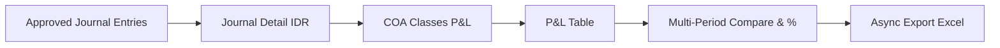
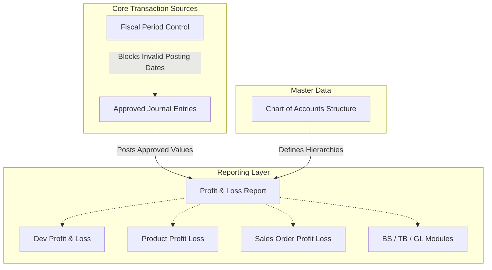

### 📦 Modul/Fitur: Profit & Loss

**Definisi Bisnis:**
Modul **Profit & Loss** (Laporan Laba Rugi) di OlshopERP adalah laporan *read-only* yang menyajikan ringkasan kinerja keuangan perusahaan dalam periode waktu tertentu. Modul ini mengagregasi transaksi dari 4 *class* akun utama pada **Chart of Accounts (COA)**: **Revenue**, **Other Revenue & Expenses**, **Cost Of Goods Sold (COGS)**, dan **Expense**.

Laporan menghitung saldo secara dinamis dalam mata uang utama (**IDR**) dari transaksi **Journal** berstatus **Approved**. Fitur utama: analisis komparatif *multi-period* berdampingan (hingga 12 total periode), kalkulasi persentase perbandingan (*variance*), serta *export* Excel *asynchronous* untuk audit dan keputusan manajemen.

### 📊 Referensi Field

| Field | Tipe | Deskripsi | Batasan |
| :---- | :---- | :---- | :---- |
| **From Date** | Date | Tanggal awal rentang periode laporan. | Wajib; format tanggal valid. |
| **To Date** | Date | Tanggal akhir rentang periode laporan. | Wajib; harus ≥ From Date. |
| **Preset** | Select | Rentang tanggal cepat relatif terhadap awal bulan berjalan (1, 2, 3 minggu, atau 1 bulan). | Opsional; mengisi otomatis rentang tanggal. |
| **Compared Period** | Integer | Jumlah periode pembanding terdahulu (0 sampai 11). | Default: 0 (None); maksimal: 11. |
| **Search Builder** | Filter | Filter interaktif untuk menyaring akun COA atau *Class* tertentu. | Opsional. |
| **Account Name / Code** | Hierarchy | Hierarki akun Induk (*Parent*) dan *Leaf* dari COA. | *Read-only*; dikelompokkan per *Class*. |
| **Period Amount** | Currency | Total saldo akun dalam **IDR** untuk periode tertentu. | *Read-only*; format 2 desimal. |
| **Variance Percentage** | Percentage | Persentase perubahan relatif antara periode lebih baru vs periode di sebelah kanannya. | Sembunyi jika 0% atau Compared Period = 0. |

### 🧮 Logika Bisnis & Formula

#### Aturan ingest Journal

Menu **Profit & Loss** bersifat *read-only* (tidak ada create, edit, approve, atau delete transaksi). Angka diambil dinamis dari status **Journal**:

> ⚠️ **Hard Rule:** Hanya **Journal** berstatus **Approved** yang dihitung ke saldo akun *Leaf* maupun *Parent*. Draft, Open, atau Rejected **tidak masuk** perhitungan laporan normal.

**Keterangan langkah:**

> 1. Sistem hanya memproses jurnal **Approved**.
> 2. Rincian jurnal dikonversi ke **IDR** dengan kurs (*FX rate*) saat transaksi dibuat.
> 3. Akun dipetakan ke 4 *class* P&L (Revenue, Other Revenue & Expenses, COGS, Expense).
> 4. Saldo ditampilkan pada tabel laporan.
> 5. Rumus varians membandingkan saldo antar kolom *multi-period*.
> 6. Export Excel diproses di latar belakang (*async*).

**Detail agregasi:**

> 1. Verifikasi seluruh detail **Journal** Approved pada rentang tanggal.
> 2. Mata uang asing dihitung dengan kurs tersimpan saat jurnal dibuat.
> 3. Akun disaring ke 4 *class* P&L.
> 4. **Leaf** dihitung nilainya; **Parent** menjumlahkan anak di bawahnya (hindari *double-counting*).
> 5. Jendela periode dinamis menghitung % perubahan pada kolom pembanding.

#### Logika jendela Multi-Period

* **Jalur durasi tetap (non-whole-month):**  
  Jika rentang tidak pas satu bulan kalender penuh, durasi D = (To Date − From Date) + 1 hari. Kolom pembanding mundur kontinyu sebesar D hari tanpa *gap* dan tanpa *overlap*.  
  *Contoh (45 hari):* Periode utama 01-Apr-2026 s.d. 15-Mei-2026 → Pembanding 1 = 15-Feb-2026 s.d. 31-Mar-2026 (45 hari).

* **Jalur bulan kalender penuh (whole-month):**  
  Jika From Date = tanggal 1 dan To Date = tanggal terakhir bulan yang sama, kolom pembanding mundur per **bulan kalender penuh** (28/30/31 hari sesuai bulan).

#### Rumus Variance %

Variance % = (Amount_Baru − Amount_Lama) / |Amount_Lama| × 100%

* **\> 0%** — tampil **hijau**.
* **\< 0%** — tampil **merah**.
* **= 0%** — angka % tidak ditampilkan.
* **Edge case** (Amount_Lama = 0 dan Amount_Baru ≠ 0) — sistem menampilkan ±100%.

> ⚠️ **Warning — tanda Revenue (Debit minus Credit):**  
> Laporan produksi menampilkan angka berdasarkan **Debit dikurangi Credit mentah**. Karena **Revenue** bersaldo normal *Credit*, pendapatan terlihat **negatif (-)**. Ini kondisi AS-IS (berbeda dari *Dev Profit & Loss* yang sudah di-*flip* positif) dan **bukan bug**.

### ⚙️ Cara Penggunaan

> 1. Buka menu via `/accounting/profit-loss`.
> 2. Tentukan rentang dengan **From Date** / **To Date** atau **Preset**.
> 3. Atur **Compared Period** (0 = satu kolom saja; hingga 11 untuk multi-period).
> 4. Klik **Apply** untuk memuat data ke tabel.
> 5. *Hover* pada nominal untuk tooltip jurnal dasar dan konversi FX.
> 6. Klik **Export All** untuk unduh Excel (*async*).

🖼️ **[IMAGE PLACEHOLDER]** — Lokasi menu Profit & Loss di sidebar Finance & Accounting Report.  
🖼️ **[IMAGE PLACEHOLDER]** — Kontrol filter: From/To, Preset, Compared Period, Apply.  
🖼️ **[IMAGE PLACEHOLDER]** — Tabel P&L setelah Apply (multi-period, %, hierarki COA).  
🖼️ **[IMAGE PLACEHOLDER]** — Tooltip hover pada nominal saldo akun.  
🖼️ **[IMAGE PLACEHOLDER]** — Tombol Export All dan progress/log unduhan async.

### 📍 Lokasi Menu

* **Navigasi:** Finance Accounting → Report → Profit & Loss
* **Route UI:** `/accounting/profit-loss`

### 📊 Profit & Loss vs Dev Profit & Loss

| Parameter | Profit & Loss (produksi) | Dev Profit & Loss (legacy) |
| :---- | :---- | :---- |
| **Route** | `/accounting/profit-loss` | `/accounting/profit-loss-v1` |
| **Interface** | 1 tabel dinamis *multi-period* | Kartu ringkasan + 2 tabel terpisah |
| **Compare** | Ya (hingga 11 periode pembanding) | Tidak |
| **Export** | Ya (*async* Excel) | Tidak |
| **Filter All Time** | Tidak | Ya |
| **Tanda Revenue** | Mentah (Debit − Credit) → **negatif** | Dibalik → **positif** |

### 🛡️ Aturan Bisnis & Validasi

| Kondisi / aksi pengguna | Perilaku sistem |
| :---- | :---- |
| Tanggal kosong / format salah | Menolak proses; tanggal wajib diisi. |
| Mengubah filter tanpa **Apply** | Tabel tidak berubah sampai **Apply** diklik. |
| **Export All** saat data kosong | Membatalkan export; pesan *"There is no data to export"*. |
| Rentang tanggal sangat panjang | Tetap diproses (bisa lebih lambat). |

### 🔜 Fitur Belum Tersedia (TO-BE)

Semua poin berikut **belum tersedia** di produksi dan menunggu keputusan bisnis:

* **Dropdown periode lanjutan** — *Bulan Lalu*, *Bulan Ini*, *Kuartal* (saat ini hanya preset minggu/bulan dari awal bulan berjalan).
* **Baris Laba Kotor & Laba Bersih** — Gross Profit / Net Profit otomatis (saat ini hanya total per *class*).
* **Warna % berdasarkan nature akun** — hijau/merah saat ini hanya mengikuti tanda matematis (belum: beban turun = hijau).
* **Sembunyikan detail akun (summary only)** — opsi sembunyikan *leaf*, tampilkan *parent* saja.
* **Filter Tag / Store / Toko** — gunakan **Product Profit Loss** atau **Sales Order Profit Loss** untuk dimensi produk/SO.

### 🛑 Keterbatasan Teknis yang Diketahui

* **Akun Current Profit/Loss:** jalur *query history* tersendiri yang saat ini **belum memfilter** status jurnal Approved — masih tinjauan Finance/Dev.
* **Header tanggal kolom non-month:** potensi selisih tipis 1 hari antara label FE dan kalkulasi BE untuk rentang durasi bebas.

### 🔗 Hubungan dengan Menu Lain

**Keterangan:**

> 1. **Journal** Approved = sumber angka utama P&L.
> 2. **Fiscal Period** mengatur izin tanggal *posting* jurnal, **tidak** memblokir filter tanggal laporan.
> 3. **COA** menentukan hierarki *parent-child* dan *class*.
> 4. P&L sejajar dengan BS / TB / GL serta Product P&L / SO P&L.

| Menu | Peran |
| :---- | :---- |
| **Journal** | Sumber angka (harus Approved). |
| **Chart of Accounts** | Nama baris, *class*, parent-child. |
| **Fiscal Period** | Gate posting jurnal; tidak membatalkan filter tanggal P&L. |
| **Product Profit Loss / Sales Order Profit Loss** | Profitabilitas per SKU atau SO. |
| **Dev Profit & Loss** | Legacy tanpa multi-period/export. |

### 🛠️ Troubleshooting

| Gejala | Penyebab | Solusi |
| :---- | :---- | :---- |
| Tabel tidak memuat data | **Apply** belum diklik atau tanggal kosong | Isi tanggal lalu klik **Apply**. |
| Angka 0 padahal ada transaksi | Jurnal belum Approved, atau akun di luar 4 *class* P&L | Approve jurnal; pastikan class Revenue/COGS/Expense/Other. |
| Revenue negatif (-) | Debit minus Credit mentah | Perilaku standar AS-IS; bukan error kalkulasi. |
| Export gagal / file kosong | Tidak ada data, atau tidak ada privilege Export | Pastikan tabel terisi setelah Apply; cek izin Export. |
| Laporan lambat | Rentang sangat panjang + Compared Period maksimal | Perkecil rentang atau kurangi Compared Period. |

### ❓ FAQ

* **Q: Beda Profit & Loss vs Dev Profit & Loss?**
  * **A:** Produksi punya *multi-period*, export Excel, dan 1 tabel dinamis. Dev (legacy) tanpa compare/export dan tanda saldo di-*flip*.
* **Q: Mengapa Revenue negatif?**
  * **A:** Saldo ditampilkan Debit − Credit mentah. Pendapatan normalnya Credit, jadi hasilnya negatif.
* **Q: Maksimal berapa kolom pembanding?**
  * **A:** 11 periode pembanding + 1 periode utama = 12 kolom amount.
* **Q: Bisa filter per Toko / Store?**
  * **A:** Belum. Untuk analisis per toko/SKU, pakai **Product Profit Loss** atau **Sales Order Profit Loss**.
