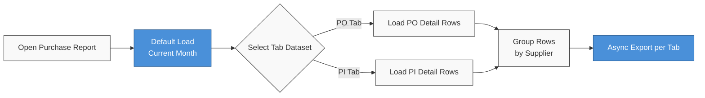

### 📦 Module/Feature: Purchase Report

**Business Definition:** **Purchase Report** is a *read-only* reporting module that presents a line-by-line SKU recap grouped centrally by **Supplier**. The module isolates data into two main tabs or points of view: **Purchase Order** (covering both *With PR* and *Without PR* orders) and **Purchase Invoice**. This report is **not** an *Account Payable Report* and is intentionally designed not to merge or link PO and PI data in a single table grid.

---

### 📊 Field Reference

| Field Name | Type | Description | Constraints |
| :---- | :---- | :---- | :---- |
| **Trx. Date** | Date | Transaction date of the upstream source document. | Default filter automatically highlights the current calendar month (start to end). |
| **Trx. Code** | Link | PO or invoice reference number. | Hyperlink to open the source document edit form. |
| **SKU / Name** | Link | *System Product* identifier. | Link to product master plus SKU *copy* action. |
| **Total Price** | Currency | Pure line product amount. | Strictly calculated **without** upstream *Other Cost* or *Other Discount*. |
| **Total Tagihan (Baris)** | Currency | Total billing amount per SKU row. | Line-specific value, not a cumulative running total. |
| **Total Tagihan (Header)** | Currency | Sum of row *Total Price* for one vendor. | Shown on the right of the Supplier *group header* for the active filter range. |
| **Trx. Status** | Enum | Source document lifecycle indicator. | All upstream statuses inclusive (including *Draft*). |

---

### 🧮 Business Logic & Formula

The module applies *dataset isolation*: switching tabs replaces the entire dataset with no PO ↔ PI cross-relation. **Total Price** is computed from line qty × unit price only, so it differs from the source document *grand total* that includes additional costs/discounts.

> 🛑 **Warning:** Do **not** use this module for *aging* or supplier *settlement*. Use **Account Payable Report** for payable completion workflows.

---

### 🔄 System Workflow

**Steps:**

1. On open, data loads for the current calendar month with **Purchase Order** tab active by default.
2. The grid groups rows by **Supplier** with Total Tagihan summary on the right of each group header.
3. For invoice detail, switch to **Purchase Invoice** — the old grid is cleared and the PI dataset loads fully.
4. *Export All* and *This Page* run asynchronously; download files are separated per active tab.

---

### 📍 Menu Location

* **Navigation:** Finance Accounting → Report → **Purchase Report**
* **UI route:** `/accounting/purchase-report`

> 🖼️ **[IMAGE PLACEHOLDER]** — Accounting sidebar → Report → Purchase Report; Purchase Order / Purchase Invoice tabs.

---

### ✅ Can / ❌ Cannot

| ✅ Can | ❌ Cannot |
| :---- | :---- |
| View all PO and PI statuses (including *Draft*) | Merge PO + PI in one table |
| PO *With PR* and *Without PR* on PO tab | Use this report as AP aging |
| Hyperlink to source documents (PO / PI) and product master | Edit transactions from the report |
| Export *All* / *This Page* per tab | Link PI rows to PO numbers in this grid |

---

### 📚 See Also

* [Purchase Order](/docs/scm/supplychain-purchase-order/overview)
* [Purchase Invoice](/docs/accounting/accounting-supplier-invoice/overview)
