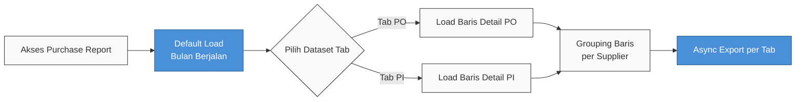

### 📦 Modul/Fitur: Purchase Report

**Definisi Bisnis:** **Purchase Report** adalah modul pelaporan *read-only* yang menyajikan rekapitulasi per baris SKU barang dan dikelompokkan (*grouping*) secara terpusat berdasarkan entitas **Supplier**. Modul ini memisahkan dataset secara terisolasi ke dalam dua *tab* atau sudut pandang utama: **Purchase Order** (mencakup pesanan *With PR* maupun *Without PR*) dan **Purchase Invoice**. Laporan ini bukan merupakan *Account Payable Report* sehingga sengaja didesain untuk tidak menggabungkan atau menghubungkan data PO dan PI di dalam satu *grid* tabel yang sama.

---

### 📊 Referensi Field

| Field Name | Type | Description | Constraints |
| :---- | :---- | :---- | :---- |
| **Trx. Date** | Date | Tanggal transaksi dokumen sumber hulu. | *Filter default* otomatis menyorot awal hingga akhir bulan kalender berjalan. |
| **Trx. Code** | Link | Nomor referensi transaksi faktur atau pesanan. | Berfungsi sebagai *hyperlink* untuk membuka *edit form* dokumen sumber asli. |
| **SKU / Name** | Link | Identifikasi pendaftaran *System Product*. | Memuat tautan navigasi ke master produk beserta fitur salin (*copy*) SKU. |
| **Total Price** | Currency | Nilai tagihan nominal murni dari *line* produk terkait. | Secara ketat dihitung **tanpa** memasukkan komponen *Other Cost* atau *Other Discount* dokumen hulu. |
| **Total Tagihan (Baris)** | Currency | Angka kalkulasi total tagihan per baris (*row*) SKU. | Menampilkan nilai khusus pada *line* tersebut, bukan *running total* akumulasi bertahap. |
| **Total Tagihan (Header)** | Currency | Akumulasi total *Total Price* baris untuk satu vendor. | Ditampilkan tepat pada sisi kanan *group header* Supplier sesuai dengan rentang *filter*. |
| **Trx. Status** | Enum | Indikator posisi siklus dokumen sumber. | Memuat dan menampilkan seluruh status dokumen hulu secara inklusif (termasuk *Draft*). |

---

### 🧮 Logika Bisnis & Formula

Arsitektur modul ini menerapkan aturan *dataset isolation* di mana pertukaran *tab* akan langsung mengganti seluruh memori dataset tanpa adanya relasi persilangan PO ↔ PI. Angka finansial yang tertera pada kolom **Total Price** sengaja diformulasikan khusus dari kuantitas dikali harga baris produk saja, sehingga angkanya akan berbeda dari nilai *grand total* dokumen form utama yang memuat tambahan biaya/diskon.

> 🛑 **Peringatan:** Pengguna **tidak dapat** menggunakan modul pelaporan ini untuk keperluan peninjauan *aging* (umur utang) atau *settlement* tagihan pemasok. Seluruh aktivitas penyelesaian kewajiban utang piutang wajib dilakukan secara khusus melalui menu **Account Payable Report**.

---

### 🔄 Alur Kerja Sistem

**Keterangan langkah:**

1. Modul segera memuat data pada parameter awal bulan kalender berjalan saat layar diakses, dengan memposisikan fokus secara bawaan pada *tab* **Purchase Order**.
2. Sistem mengonstruksi tampilan *grid* ke dalam hierarki *grouping* **Supplier**, lengkap dengan *summary* Total Tagihan pada sudut kanan *header group*.
3. Pengguna yang memerlukan peninjauan rincian faktur memindahkan navigasi ke *tab* **Purchase Invoice**, yang memicu sistem untuk menghapus set *grid* lama dan memuat dataset PI baru secara utuh.
4. Proses ekstraksi data melalui fitur *Export All* maupun *This Page* dieksekusi oleh mesin secara asinkron (*asynchronous*); file unduhan dipisahkan per *tab* aktif.

---

### 📍 Lokasi Menu

* **Jalur navigasi:** Finance Accounting → Report → **Purchase Report**
* **Route UI:** `/accounting/purchase-report`

> 🖼️ **[PLACEHOLDER GAMBAR]** — Sidebar Accounting → Report → Purchase Report; tab Purchase Order / Purchase Invoice.

---

### ✅ Bisa / ❌ Tidak Bisa

| ✅ Bisa | ❌ Tidak Bisa |
| :---- | :---- |
| Lihat semua status PO dan PI (termasuk *Draft*) | Menggabungkan PO + PI dalam satu tabel |
| PO *With PR* dan *Without PR* dalam tab PO | Menggunakan report ini sebagai aging AP |
| Hyperlink ke dokumen sumber (PO / PI) dan master produk | Mengedit transaksi langsung dari report |
| Export *All* / *This Page* terpisah per tab | Menghubungkan baris PI ke nomor PO di grid ini |

---

### 📚 Lihat Juga

* [Purchase Order](/docs/scm/supplychain-purchase-order/overview)
* [Purchase Invoice](/docs/accounting/accounting-supplier-invoice/overview)
