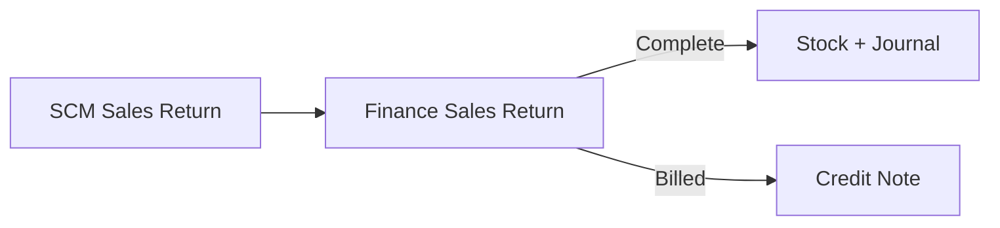

## Module/Feature: Sales Return Approval (Finance)

**Business definition.** The Finance **Sales Return** menu is where the finance team **reviews price/COGS and Completes** a sales return that warehouse already entered. Completing posts stock movements, journals, and — when the return is **Billed** — an automatic **Credit Note**. Warehouse quantity entry lives in a separate SCM Sales Return menu.

## Key terms

* **Complete:** Finance approval that finalizes the return.
* **Billed / Unbilled:** Accounting type from invoice payment history (CN vs sales/AR journal).
* **Restock / Broken / Lost:** Three quantity fates with different stock outcomes.
* **Order / Return Price & COGS:** Finance-only value columns for review.
* **Auto-approve:** Optional background Complete after a configured open duration.

## When to use

* Warehouse saved an open sales return and finance should close it.
* You need to review return values before posting journals / Credit Note.

## When to avoid

* Order never outbound / still pre-settlement → use **Failed Ship**, not Sales Return.
* Expecting Complete on the SCM menu — button is Finance-only.
* Completing Lost lines without Return Expense COA on the product.

## Prerequisites

| Requirement | Source | Rule |
| :---- | :---- | :---- |
| Open SR with qty > 0 | SCM / same form | At least one Restock/Broken/Lost |
| Approval privilege | Gate | Required for Complete |
| Open fiscal period | Accounting | Required on approve |
| Valid product COA | Product COA | Required |
| Return Expense COA if Lost | Product COA Group | Blocks Complete if missing |

## Navigation

* **UI path:** Finance & Accounting → **Sales Return**  
* **Route:** `/accounting/sales-return`  
* **Warehouse menu:** `/supplychain/sales-returns`

> Image placeholder — Accounting Sales Return list and Complete button.

## Process flow

### Order of execution

1. Warehouse enters Restock/Broken/Lost and saves (**open**).  
2. Finance opens the same document on `/accounting/sales-return`.  
3. Review Price/COGS columns.  
4. Click **Complete**.  
5. If Billed → verify Credit Note; if Unbilled → expect sales/AR journals only.

## Transaction states

| Status | Meaning | Editable qty? |
| :---- | :---- | :---- |
| **Open** | Waiting for Complete | Yes |
| **Completed / Approved** | Stock + journal done | No |

## Step-by-step (happy path)

1. Open `/accounting/sales-return` and find the SR.  
2. Review Restock/Broken/Lost and Return Price/COGS.  
3. Click **Complete**.  
4. For Billed returns, open **Credit Note** to confirm auto document.

## Common pitfalls

* Looking for Complete on SCM — use Accounting route.  
* Lost without expense COA — Complete blocked.  
* Expecting Credit Note on Unbilled — none is created.  
* Ignoring auto-approve — old open SRs may complete themselves.  
* Reject / print summary — not available yet.

## Related docs in Help Center

* Knowledge Base · Feature Map · User Guide · Requirement / Technical  

**Related menus:** Sales Return (SCM) · Credit Note · Failed Ship · Sales Invoice
