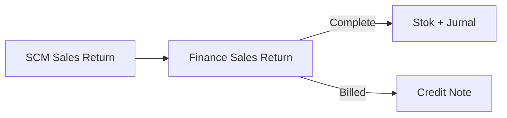

## Modul/Fitur: Sales Return Approval (Finance)

**Definisi bisnis.** Menu **Sales Return** di Finance dipakai tim keuangan untuk **mereview harga/COGS dan Complete** retur yang sudah diinput gudang. Complete memposting pergerakan stok, jurnal, dan — jika retur **Billed** — **Credit Note** otomatis. Input qty gudang ada di menu Sales Return SCM terpisah.

## Istilah penting

* **Complete:** Persetujuan Finance yang menuntaskan retur.
* **Billed / Unbilled:** Tipe akuntansi dari riwayat payment invoice (CN vs jurnal sales/AR).
* **Restock / Broken / Lost:** Tiga nasib qty dengan dampak stok berbeda.
* **Order / Return Price & COGS:** Kolom nilai khusus Finance untuk review.
* **Auto-approve:** Complete otomatis opsional setelah SR open melewati durasi setting.

## Kapan dipakai

* Gudang sudah simpan SR open dan Finance perlu menutupnya.
* Perlu review nilai retur sebelum jurnal / Credit Note.

## Kapan dihindari

* Order belum outbound / masih pre-settlement → pakai **Failed Ship**, bukan Sales Return.
* Mengharapkan Complete di menu SCM — tombol hanya di Finance.
* Complete baris Lost tanpa Return Expense COA pada produk.

## Prasyarat

| Persyaratan | Sumber | Aturan |
| :---- | :---- | :---- |
| SR open dengan qty > 0 | SCM / form yang sama | Minimal satu Restock/Broken/Lost |
| Privilege approval | Gate | Wajib untuk Complete |
| Periode fiskal terbuka | Accounting | Wajib saat approve |
| COA produk valid | Product COA | Wajib |
| Return Expense COA jika Lost | Product COA Group | Memblok Complete jika kosong |

## Navigasi

* **Jalur UI:** Finance & Accounting → **Sales Return**  
* **Route:** `/accounting/sales-return`  
* **Menu gudang:** `/supplychain/sales-returns`

> Placeholder gambar — list Accounting Sales Return dan tombol Complete.

## Alur proses

### Urutan eksekusi

1. Gudang isi Restock/Broken/Lost lalu simpan (**open**).  
2. Finance buka dokumen yang sama di `/accounting/sales-return`.  
3. Review kolom Price/COGS.  
4. Klik **Complete**.  
5. Jika Billed → cek Credit Note; jika Unbilled → jurnal sales/AR saja.

## Status transaksi

| Status | Arti | Qty bisa diedit? |
| :---- | :---- | :---- |
| **Open** | Menunggu Complete | Ya |
| **Completed / Approved** | Stok + jurnal selesai | Tidak |

## Langkah singkat (happy path)

1. Buka `/accounting/sales-return` dan temukan SR.  
2. Review Restock/Broken/Lost serta Return Price/COGS.  
3. Klik **Complete**.  
4. Untuk Billed, buka **Credit Note** untuk konfirmasi dokumen otomatis.

## Hal yang sering bikin bingung

* Mencari Complete di SCM — pakai route Accounting.  
* Lost tanpa expense COA — Complete ditolak.  
* Mengharapkan Credit Note pada Unbilled — tidak dibuat.  
* Mengabaikan auto-approve — SR open lama bisa Complete sendiri.  
* Reject / print summary — belum tersedia.

## Dokumen terkait di Help Center

* Knowledge Base · Feature Map · User Guide · Requirement / Technical  

**Menu terkait:** Sales Return (SCM) · Credit Note · Failed Ship · Sales Invoice
