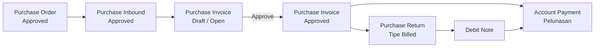
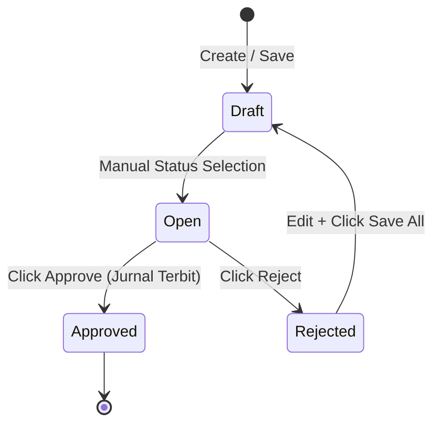
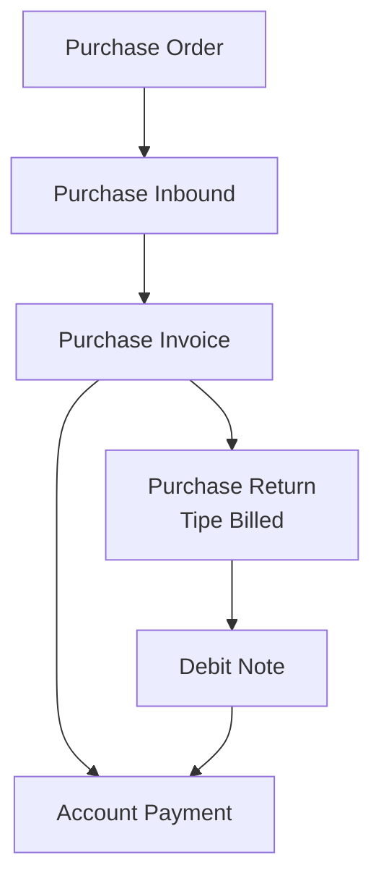

## 📦 Module/Feature: Purchase Invoice (Supplier Invoice)
**Business Definition** A **Purchase Invoice (PI)**—internally referenced as a **Supplier Invoice**—is a formal legal and accounting document used to recognize a definitive **Account Payable (AP)** (supplier debt) following the successful receipt and verification of goods via an approved **Purchase Inbound** transaction. Functionally, it serves as the operational mechanism to transition temporary liabilities from **Unbilled Goods** (goods received but not yet invoiced) into finalized **Account Payable** balances. Furthermore, the Purchase Invoice acts as the official tax point where **PPN Masukan** (Value Added Tax / VAT Input) is formally recognized and claimed within the system, rather than at the initial physical goods receipt phase. Consequently, an approved Purchase Invoice establishes the definitive financial baseline required to execute downstream **Account Payment** disbursements.

## 🔑 Key Terms & Glossary
* **Purchase Invoice (PI):** The official system document recognizing a legally binding commercial debt to a vendor, prefixed with PI-.  
* **Account Payable (AP):** The definitive financial liability account representing obligations owed to suppliers for purchased inventory or services.  
* **Unbilled Goods:** A temporary clearing account used during the physical inbound process to track inventory received before the corresponding vendor invoice is formally processed.  
* **DPP (*Dasar Pengenaan Pajak*):** The taxable base amount used to calculate applicable taxes on goods or services sold.  
* **PPN Masukan (VAT Input):** Value Added Tax levied on purchases, which can be legally credited against output tax obligations.  
* **Prepared / Processed:** System states tracking the outstanding quantity progression of inventory lines as they transition from receiving to final invoicing.  
* **Debit Note:** A financial document issued following a **Billed Purchase Return** that reduces the outstanding liability to the vendor in subsequent payments.

## 🎯 Strategic Business Context
### Triggering Scenarios: When to Execute
* **Approved Inbound Realization:** Physical inventory has arrived at the warehouse, the corresponding **Purchase Inbound** document is marked as **Approved**, and the supplier has issued their official commercial invoice.  
* **Outstanding Quantities Remain:** The inbound transaction contains item lines with non-zero outstanding balances that have not yet been fully invoiced or returned.  
* **Validated Product COA Configurations:** The relevant products have complete **Chart of Account (COA)** groupings properly mapped (Unbilled Goods, Tax, AP) to ensure seamless downstream ledger postings.  
* **Compliant Currency Alignments:** The transaction involves a single foreign currency paired alongside the local currency, maintaining standard fiscal parameters.

### Prohibited Scenarios: When to Avoid
* **Draft Inbound References:** Do not initialize a Purchase Invoice if the underlying inbound records are still in a **Draft** status. While the supplier may appear in dropdown selectors, no inventory lines will be available for billing extraction.  
* **Depleted Inbound Balances:** Do not create a transaction if the inbound quantities have been entirely consumed by prior invoices or offset by preceding returns.  
* **Incomplete Product Account Setup:** Avoid initiating invoices if the underlying inventory items lack fully configured operational and tax accounts, as the approval sequence will experience an accounting failure.  
* **Multi-Foreign Currency Mixtures:** Do not attempt to blend two distinct foreign currencies within a single document header.

## 📋 Prerequisites & Operational Boundaries
| Requirement | Originating Source | Operational Rule & Constraint |
| :---- | :---- | :---- |
| **Purchase Order Approval** | Purchase Order Module | Dictates the authoritative SKU lines, unit pricing structures, tax classifications, and baseline Additional Costs or Discounts. |
| **Purchase Inbound Approval** | Purchase Inbound Module | Establishes the precise physical quantities eligible for commercial invoicing. Only records marked as **Approved** are accessible. |
| **Active Supplier Mappings** | General Company Master | The vendor selection dropdown dynamically filters based on suppliers possessing an inbound transaction link in **any status** (including Draft). However, lines remain locked until inbound records transition to **Approved**. |
| **Product COA Integrations** | Product COA Group / Company Settings | Validates that Unbilled Goods, Tax, and AP accounts are completely configured prior to triggering the final approval sequence. |

## 📍 Navigation & Workspace
The Purchase Invoice management interfaces are accessed via the core accounting workspace.

* **UI Navigation Path:** Finance & Accounting → Account Payable → Purchase Invoice  
* **System UI Route:** /accounting/supplier-invoice

*Sidebar navigasi Accounting → Purchase Invoice, dan tampilan halaman list (DataList) kosong/terisi.*

## 🔄 System Workflow & Document Lifecycle

### Order of Execution
> 1. **Header Generation:** The user defines the core metadata parameters including the Supplier, Transaction Date, Currency, and manual Due Date.  
> 2. **Status State Shift:** The user manually switches the document status from **Draft** to **Open** to prepare the system environment for operational entry.  
> 3. **Inventory Line Extraction:** The user utilizes either **Bulk Use** or **Single Use** modals to extract eligible SKU lines from approved inbound documents.  
> 4. **Cost & Discount Consolidation:** The system pulls original Purchase Order fees, allowing the user to clean up lines intended for subsequent invoicing cycles.  
> 5. **Net Verification:** The system computes the **Net Purchase Invoice** totals, serving as the definitive verification point for financial users.  
> 6. **Ledger Execution:** Upon triggering **Approve**, the system permanently locks the transaction, decrements open quantities, and logs appropriate accounting entries.

## 🛡️ Governance & Lifecycle: Transaction States

| Status Name | Definition | Editable? | Active UI Operations & Functional Triggers |
| :---- | :---- | :---- | :---- |
| **Draft** | Initial creation state or the outcome of saving a previously rejected invoice. | **Yes** | Save & Next, Save All, Delete |
| **Open** | The mandatory preparatory state required before any authorization sequences can be executed. | **Yes** | Save All, Approve, Reject, Delete |
| **Rejected** | Assigned when an authorized user denies the open transaction. | **Yes** | Accessible for changes via Save All (reverts to Draft) or total elimination via Delete. |
| **Approved** | The final, legally binding state. All accounting journals are processed and entries are locked down. | **No** | Print, Show Only (Read-only data browsing) |

⚠️ **HARD RULE:** The system does not currently support Void, Processed, or Closed states at the header level. Once a document reaches **Approved**, its path terminates.

## ⚙️ Step-by-Step Operational Guide
### Task 1: Initialize New Document Header
> 1. Navigate to /accounting/supplier-invoice and initiate a new document creation.  
> 2. Input the target **Supplier**. *Note: The system may automatically reference the last selected vendor; verify accuracy manually.*  
> 3. Set the **Transaction Date** and complete the optional **Supplier's Reference** text field.  
> 4. Define the transaction **Currency**. If a foreign currency is selected, input the applicable **Exchange Rate**.  
> 5. Manually populate the **Due Date** parameter if a specific deadline is required.

*Form Create Purchase Invoice, bagian Basic Information (Supplier, Tanggal, Mata Uang, Due Date, Supplier's Reference).*

### Task 2: Transition to Open Status
> 1. Locate the primary status dropdown selector within the active header space.  
> 2. Advance the status field from **Draft** to **Open**.  
> 3. Click Save All to lock down the primary metadata parameters.

⚠️ **CRITICAL CONSTRAINT:** The document header fields lock permanently the moment a single inventory item line is added below. All items must be cleared to modify header inputs.

### Task 3: Extract Inventory Elements from Inbound Records
> 1. Scroll down to the **Inbound Transaction Panel** to view lines from approved supplier receipts.  
> 2. For rapid processing, utilize **Bulk Use** by checking multiple lines; the system automatically extracts the total remaining outstanding quantities.  
> 3. For precise control, use **Single Use** to launch a dedicated modal window, adjust the entry value, and hit save.

*Panel Inbound Transaction dengan tombol Bulk Use dan modal Single Use.*

### Task 4: Audit Additional Costs & Discounts
> 1. Review the **Additional Cost & Discount** sub-panel. Lines originating from the initial Purchase Order populate automatically upon item insertion.  
> 2. Remove individual fee lines if they need to be deferred to a subsequent invoicing run.

*Panel Additional Cost / Discount dengan baris yang auto-terisi dari PO.*

### Task 5: Finalize and Authorize Ledger Entry
> 1. Navigate to the **Totals Panel** and audit the summary metrics, ensuring the final calculated values line up with expectation.  
> 2. Click Save All to secure the grid arrays.  
> 3. Select the Approve control to seal the record and broadcast the financial journal entries.

*Panel Total (Total Products, Total VAT, Net Purchase Invoice).*

*Tombol Approve.*

*Status transaksi berubah jadi Approved.*

## 📊 Data Attributes & Field Reference
### 1\. Basic Information Block
| Field Name | Wajib? | Default Value | Value Source | Validation & Processing Constraints |
| :---- | :---- | :---- | :---- | :---- |
| **Transaction Code** | Yes | Automated System Generation | Internal Sequence Engine | Applies a strict PI- prefix. Enforces uniqueness across the corporate profile. |
| **Transaction Date** | Yes | Current System Timestamp | System Clock | Establishes the operational posting window. |
| **Due Date** | No | NULL / Blank | Manual Entry | Requires manual entry. *Note: System does not calculate auto-deadlines from Terms of Payment (TOP).* |
| **Currency** | Yes | Primary Company Currency | Currency Master Setup | Defines the financial currency context for all linked rows. |
| **Exchange Rate** | Yes | 1.00 | Exchange Configuration | Remains locked at 1.00 if using primary currency. Fully editable for foreign inputs. |
| **Supplier** | Yes | Blank | Company Account List | Filters for entities tied to an inbound voucher. Accepts draft connections but remains dependent on approved items. |
| **Supplier's Reference** | No | Blank | Supplier Invoice Text | Alphanumeric text field capturing physical vendor invoice reference codes. |
| **Supplier's Invoice Amount** | No | NULL / Blank | User Entry | **\[FUTURE FEATURE — DEACTIVATED\]** Planned as an explicit physical total comparison field. |
| **Description** | No | Blank | User Entry | Text field for internal context or operational notes. |
| **Term and Condition** | No | Blank | User Entry | Field for tracking legal text or special payment clauses. |
| **Attachment** | No | NULL | File System Upload | Supports digital file attachments for verification tracking. |

### 2\. Detail — Inbound Transaction Grid Columns
| Field Name | Description | Value Source / Logic Rules |
| :---- | :---- | :---- |
| **Inbound Code / PO Code** | Identifies the source documents. | Direct pull from linked **Purchase Inbound** and **Purchase Order** records. |
| **SKU & Item Name** | The specific inventory stock keeping unit details. | Extracted from the physical warehouse entry line. |
| **Quantity & Satuan** | Item billing volume and transactional unit. | Default matches remaining outstanding volume. Modifiable via Single Use modal. |
| **Harga Satuan & Diskon** | Base unit cost and line-item specific discount. | Locked directly to the initial authorized **Purchase Order** rates. Non-editable. |
| **DPP (*Dasar Pengenaan Pajak*)** | Net value baseline subject to tax computations. | Computed line product values minus item-level discount structures. |
| **PPN (VAT)** | Calculated value-added tax entry per line. | Derived from Purchase Order tax parameters applied against line DPP. |
| **Total PO / Total Invoice** | Source vs Target line tracking metrics. | Summary metrics of item lines across original order state and invoice target. |
| **Exchange Gain** | Measures value fluctuations on foreign items. | Calculated row-by-row if currency variances manifest against base values. |

### 3\. Additional Cost & Discount Parameters
| Field Name | Wajib? | Default Value | Processing Rules & Constraints |
| :---- | :---- | :---- | :---- |
| **Pilih Cost/Disc** | Yes | Blank Selection | Pulled from master registers or auto-populated via linked Purchase Order lines. |
| **Nominal** | Yes | Derived from Source | **Locked / Non-Editable** if generated by an active Purchase Order. Read-only by design. |
| **Deskripsi** | No | Blank | Captures contextual details regarding the application of the fee or discount. |
| **Akun (COA)** | Yes | Derived Account | Mapped from source settings. Changeable prior to approval, targeting active accounts without sub-accounts. |

### 4\. Totals Visualization Panel
| Grid Metric Element | Definition & Calculation Logic |
| :---- | :---- |
| **Total Products** | Aggregate raw item values before applying effective systemic line taxes. |
| **Disc Products** | Consolidated value reduction summing up all item row discounts. |
| **Total VAT (PPN)** | Consolidated tax obligations aggregating individual item VAT lines. |
| **Additional Cost / Disc** | Operational net adjustments calculating additional charges against miscellaneous savings. |
| **Net Purchase Invoice** | **The Definitive Financial Base Amount.** Final corporate liability value encompassing all taxes, in invoice currency. |
| **Invoice Diff** | **\[FUTURE FEATURE — DEACTIVATED\]** Tracks variances: $\\text{Supplier's Invoice Amount} \- \\text{Net Purchase Invoice}$. |
| **Net (Mata Uang Lokal)** | The Net Purchase Invoice figure converted directly into the primary company currency using the exchange rate. |

## 🧮 Core Business Logic & Calculations
### Outstanding Billing Quantity Equation
The maximum volume permitted for line extraction within an active invoice session is defined by the following standard:

`Sisa Qty Outstanding = Qty Inbound Approved - ( Qty Invoiced + Qty Returned )`

* All computations run strictly within base storage units to maintain complete precision, regardless of the display units used on screen.  
* If open quantities drop to zero while active incomplete documents (**Prepared**) claim references, the system flags the line as **"Already Prepared"** to prevent duplicate draws.

### Tax Coefficient Adjustment Behaviours
ℹ️ **SYSTEM CALCULATION NOTE:** When processing specific tax profiles using coefficient multipliers, the displayed **Total Products** metric may reflect a lower value than basic manual multiplication indicates. This is by design to align the overall transaction value with legal VAT requirements (e.g., executing a 12% effective obligation inside an 11% standard baseline calculation framework).

### Display Rounding Deviations
⚠️ **KNOWN BEHAVIOR (NOT A BUG):** Manually adding up the rounded 2-desimal **DPP** and **VAT** numbers displayed on the item lines can sometimes result in a sum that is **1 sen higher** than the official **Net Purchase Invoice** total. The financial modules use unrounded back-end values for ledger precision. The true financial liability and journal postings always match the **Net Purchase Invoice** header total rather than manual on-screen row additions.  
*Example:* Line item calculation generates a displayed DPP of 855.855,86 alongside a VAT display of 94.144,15. Manual cross-addition results in 950.000,01, yet the formal system **Net** remains locked at 950.000,00.

## 🛡️ Business Rules & Validation Matrices
* **If you** try to alter key document header variables (such as Supplier choices or Currency definitions) after adding at least one item line to the lower grid arrays, **then** the system blocks the interaction, enforcing a strict header lock. *Resolution:* Clear out all item lines to adjust header data.  
* **If you** attempt to add an item line or introduce an Additional Cost/Discount mapped to a second foreign currency that differs from the currency defined in the header, **then** the system rejects the line entry. One document only supports one foreign currency combined with the local currency.  
* **If you** enter an item billing quantity that exceeds the calculated remaining outstanding balance for that specific inbound line, **then** the system blocks the update, requiring you to lower the quantity.  
* **If you** completely invoice an inbound item line through approved transactions, **then** that specific inventory pool is blocked from being selected for **Unbilled Purchase Returns**.  
* **If you** return an inbound item line completely via an **Unbilled Purchase Return**, **then** that inventory line is blocked from appearing in any future Purchase Invoices.  
* **If you** click the Approve button on an invoice that contains zero item rows, or if the underlying items lack complete **Product COA** ledger routing configurations, **then** the approval fails.  
* **If you** attempt to increase or manually adjust the monetary value of an Additional Cost or Discount that was automatically pulled from a Purchase Order, **then** the system blocks the edit to protect the integrity of the source document.  
* **If you** select a vendor who only has inbound records in **Draft** status, **then** the supplier name populates the field normally, but the **Inbound Transaction Panel** remains completely blank. This is expected behavior.  
* **If you** attempt to execute an Approve action while the document status remains set to **Draft**, **then** the action button remains locked or fails. The status must explicitly transition to **Open** first.  
* **If you** try to approve a transaction at the exact moment another user triggers an approval request on the same record, **then** the database concurrency lock blocks the second user, returning a processing message without duplicating entries.  
* **If you** attempt to authorize and approve an invoice after the target fiscal period has been officially closed by accounting, **then** the system blocks the entry to prevent past ledger contamination.  
* **If you** input a manual total value in the **Supplier's Invoice Amount** field that falls below the system calculated Net total *\[Applicable upon Future Feature Activation\]*, **then** the system will reject the document. Initial activation phases only accept variances greater than or equal to zero ($\\Delta \\ge 0$).  
* **If you** try to manually alter unit item prices or tax metrics within the invoice workspace lines, **then** the system blocks the attempt. Item costs and tax rules remain locked to the authorized Purchase Order settings.  
* **If you** process a downstream payment in the **Account Payment** interface and run into fractional cent remainder variances, **then** the payment screen will block manual fractional entries. You must use the **Allocate Full Amount** option to resolve the remaining balance.

## 🗃️ Accounting Impact & General Ledger Postings
### Upstream Context: Physical Inbound Phase
Before a Purchase Invoice is generated, the physical receipt of goods triggers an initial entry in the **Purchase Inbound** module. This entry updates inventory asset values while establishing a temporary clearing balance. **No tax tracking occurs at this stage.**

`Debit: Inventory / Asset / Operational Expense Credit: Unbilled Goods Clearing Account`

### Core Operational Stage: Purchase Invoice Approval
Approving the Purchase Invoice triggers the official recognition of the supplier debt and formalizes tax tracking. The temporary clearing balances are reversed, and the actual liability is logged:

| Entry Direction | Target General Ledger Account Type | Functional Description |
| :---- | :---- | :---- |
| **DEBIT** | **Unbilled Goods Clearing Account** | Closes out and reverses the temporary liability created during the physical inbound phase. |
| **DEBIT** | **PPN Masukan / Input Tax Account** | Formally registers the claimable purchase value-added tax entry on the corporate books. |
| **DEBIT** | **Additional Cost Account** *(If applicable)* | Allocates miscellaneous logistical fees to their respective assigned expense lines. |
| **CREDIT** | **Additional Discount Account** *(If applicable)* | Records operational savings to the designated revenue or offset account. |
| **CREDIT** | **Account Payable (Supplier Debt)** | Establishes the final, authoritative liability total representing the actual corporate debt. |

### Planned Accounting Logic: Supplier Value Variances
🔮 **FUTURE SPECIFICATION — DEACTIVATED:** Once the **Supplier's Invoice Amount** field is fully implemented, if an allowed variance occurs (Invoice Diff > 0), the system will automatically post an additional entry alongside the standard breakdown above to balance the manual vendor variance:

`Debit: Cash Diff (Expense Offset) Credit: Account Payable (Supplier Debt Value Adjustment)`  
*Prerequisite:* The designated "Cash Diff" account must be defined within the company settings profile prior to execution, or the approval routine will fail.

## 🔗 Upstream & Downstream System Relations

| Linked Module Name | Functional Interdependence & Core Role |
| :---- | :---- |
| **Purchase Order** | Direct source for authoritative item costs, base item tax models, and original systemic Additional Costs or Discounts. |
| **Purchase Inbound** | The physical baseline filter. Controls item line eligibility by requiring records to be in an **Approved** status. |
| **Account Payment** | The primary downstream payment destination. Consumes approved Purchase Invoices to execute cash disbursements. |
| **Purchase Return (Billed)** | Provides a corrective downstream loop. Processes inventory returns *after* invoice approval, generating an official **Debit Note**. |
| **Debit Note** | Financial credit voucher stemming from billed returns, applied to lower overall vendor debt in future payment runs. |
| **Master Other Cost / Discount** | The secondary master register source providing miscellaneous fee options not included in the original Purchase Order. |
| **Chart of Accounts (COA)** | The master ledger repository providing active, non-sub-account ledger destinations for custom cost distributions. |

## 🛑 Known System Limitations & Roadmap Gaps
The following capabilities are **currently unavailable** within the production environment. These items represent design boundaries and should not be reported as software bugs:

* **Transactional Void Capabilities:** Users cannot void or cancel a Purchase Invoice once it is marked as **Approved**. The lifecycle terminates at approval. Any subsequent corrections must be managed manually through downstream adjustments.  
* **Automated Due Date Configurations:** The system does not calculate payment deadlines automatically based on vendor payment terms (Terms of Payment / TOP). All due dates must be populated manually by the user.  
* **Header Status Progression Constraints:** The header records do not support Processed or Closed status indicators, even after downstream payments are fully settled.  
* **Supplier Invoice Amount Field Disabling:** The **Supplier's Invoice Amount** input field and its accompanying **Invoice Diff** ledger logic are currently non-functional and deactivated.  
* **Two-Decimal Export Limitations:** Financial reporting data exports for DPP and PPN amounts are restricted to a standard two-decimal precision format. Expanded four-decimal precision outputs are planned for a future release.

## 🛠️ Troubleshooting Guide
| Observed System Symptom | Potential Root Cause Analysis | Corrective Action Steps |
| :---- | :---- | :---- |
| A specific vendor name does not appear within the header Supplier selection dropdown. | The vendor has no historical connection to any **Purchase Inbound** document profiles within the system. | Initialize and save at least one inbound record for the vendor before starting the invoice. |
| The Supplier is successfully selected, but the lower Inbound Transaction Panel shows no items. | The source inbound records for this supplier are still in a **Draft** status. | Navigate to the inbound module and complete the formal approval sequence for those items. |
| An expected item row displays a remaining outstanding quantity value of zero. | The item line has already been fully invoiced or entirely processed via an unbilled return. | Check historical Purchase Invoice registries or past return logs to verify quantity consumption. |
| Triggering the invoice Approve button returns a validation failure message. | The item lacks complete **Product COA** ledger rules, or the invoice contains zero item lines. | Complete the account mapping setup for the product group and verify that item lines are present. |
| A Purchase Order fee or discount fails to appear when generating a subsequent invoice. | The item rows linked to that Purchase Order were fully invoiced or returned before the fee lines were selected. | Ensure important fee lines are distributed early in the invoicing cycle, or coordinate order closes manually. |
| The system rejects an entry when trying to save a multi-currency transactional model. | The user added item rows or miscellaneous fees utilizing a second distinct foreign currency. | Restructure the inputs. The system only supports one foreign currency alongside the local currency per document. |
| The total sum of row DPP and VAT values shows a **1 sen deviation** against the header Net calculation. | This is an expected artifact of on-screen display rounding for fractional currencies. | No action required. The ledger engine processes the transaction using the correct header **Net** total. |
| The calculated **Net / Invoice Total** header value shows a significant deviation from manual $\\text{Price} \\times \\text{Qty}$ calculations. | This indicates a data structure exception or an active precision calculation bug. | Flag the instance immediately and escalate the issue to the QA and Development teams. |
| An active Additional Cost line remains locked, preventing manual modifications to its value. | The fee line was pulled directly from a Purchase Order, which locks the value by design. | If pricing corrections are required, the adjustment must be handled back within the source Purchase Order. |
| A user needs to reverse or undo an invoice that was accidentally moved to **Approved**. | The system does not currently feature a native transactional void or cancellation routine. | Coordinate manual adjustment entries directly with your internal finance and accounting team. |

## ❓ Frequently Asked Questions (FAQ)
**Q: Can I manually adjust item unit prices or applied tax rules directly inside the Purchase Invoice screen?** A: No. Item costs, structural parameters, and tax configurations are drawn from the initial authorized Purchase Order and cannot be edited here.  
**Q: Does the system support partial invoicing if a supplier bills an order across multiple separate shipments?** A: Yes. Users can modify the invoicing quantity to match the vendor's bill, provided it remains below the outstanding balance. The remaining items can be drawn into later invoices.  
**Q: At what point does the system officially log the PPN Masukan (VAT Input) within the financial ledger?** A: PPN Masukan is recognized when the Purchase Invoice is **Approved**. It is not recorded during the initial physical inbound warehouse phase.  
**Q: Can the system automatically compute the invoice Due Date based on standard vendor credit profiles?** A: No. Automated term calculations are not yet supported. Users must manually define the appropriate due date within the header fields during creation.  
**Q: What is the primary purpose of the Supplier's Reference field on the document header?** A: This is an optional alphanumeric text field used to record the physical invoice number provided by the vendor, making it easier to cross-reference transactions later.  
**Q: How should I handle an inventory return if the corresponding Purchase Invoice has already been approved?** A: You must use the **Purchase Return (Billed)** document type. This action generates a **Debit Note**, which can be applied to reduce your overall vendor liability during the next payment run.  
**Q: Why does the calculated Total Products metric sometimes show a lower value than basic manual multiplication indicates?** A: This occurs when processing item lines linked to specific tax profiles that use coefficient adjustments. The system shifts the base values on screen to ensure the final calculation aligns with official VAT requirements.

## 📑 Related Documentation Links
* [Purchase Order](/docs/scm/supplychain-purchase-order/knowledge-base) — source prices, tax, additional cost/discount  
* [Purchase Inbound](/docs/scm/supplychain-new-purchase-inbound/knowledge-base) — eligible quantities after approval  
* [Account Payment](/docs/accounting/accounting-supplier-payment/knowledge-base) — pay approved Purchase Invoices  
* Purchase Return (Billed) & Debit Note — reduce vendor liability after invoicing
