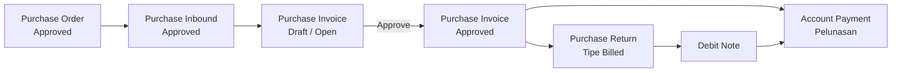
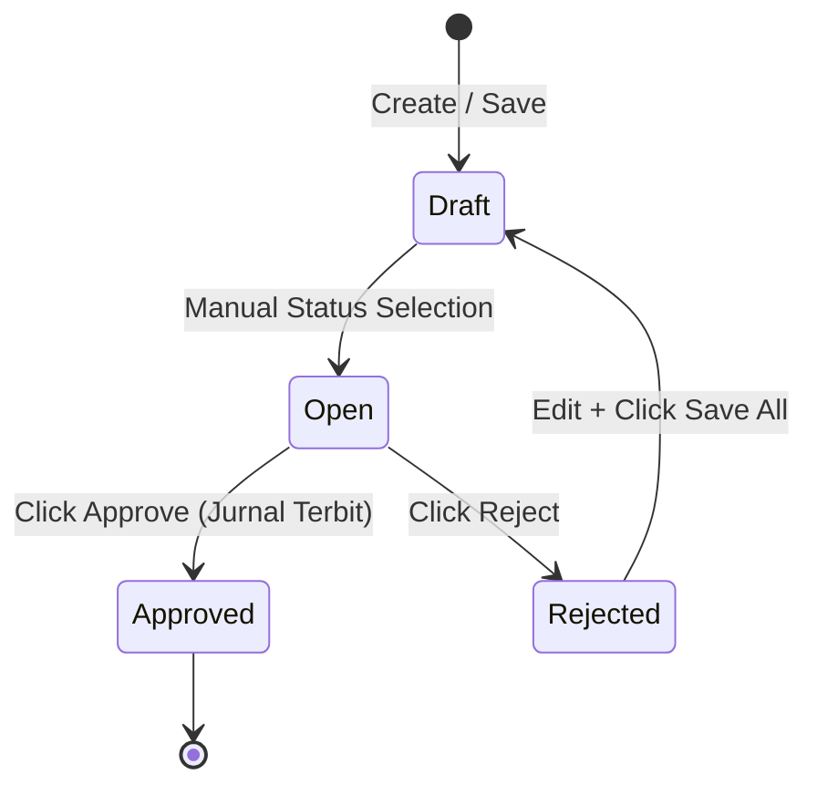

### 📦 Modul/Fitur: Purchase Invoice (Faktur Pembelian / Supplier Invoice)

**Definisi Bisnis:** **Purchase Invoice (PI)**—atau yang sering disebut secara internal sebagai **Supplier Invoice**—adalah dokumen hukum dan akuntansi resmi yang digunakan untuk mengakui **Account Payable (AP)** (hutang dagang resmi) kepada pihak supplier. Dokumen ini baru bisa dibuat setelah barang kiriman supplier sukses diterima dan diverifikasi melalui transaksi **Purchase Inbound** yang sudah berstatus **Approved**.

Secara fungsi, PI memindahkan saldo kewajiban sementara dari akun **Unbilled Goods** (barang sudah diterima, tetapi faktur supplier belum diproses) ke saldo **Account Payable** final yang siap dibayar. Purchase Invoice juga menjadi titik ketika **PPN Masukan** (pajak pembelian yang dapat dikreditkan) resmi dicatat oleh sistem, bukan saat barang pertama kali masuk ke gudang. Setelah PI berstatus **Approved**, nominal finalnya menjadi dasar untuk memproses pelunasan di modul **Account Payment**.

---

### 🔑 Istilah Kunci & Glosarium
* **Purchase Invoice (PI):** Dokumen sistem resmi untuk mengakui hutang dagang komersial kepada vendor/supplier, ditandai dengan kode awalan `PI-`.
* **Account Payable (AP):** Akun kewajiban/hutang finansial riil yang mencatat total kewajiban perusahaan kepada supplier atas barang atau jasa yang telah dibeli.
* **Unbilled Goods:** Akun perantara (clearing account) sementara untuk mencatat nilai barang yang sudah masuk gudang secara fisik tetapi nota tagihan resminya belum diproses.
* **DPP (Dasar Pengenaan Pajak):** Nilai basis/harga neto yang digunakan sebagai acuan untuk menghitung pungutan pajak barang atau jasa.
* **PPN Masukan (VAT Input):** Pajak Pertambahan Nilai yang dikenakan supplier kepada perusahaan kita saat membeli barang, yang nantinya bisa dikreditkan untuk mengurangi PPN Keluaran.
* **Prepared / Processed:** Status sistem untuk memantau perkembangan jumlah (*quantity*) barang inbound yang sedang atau sudah selesai ditagihkan ke dalam invoice.
* **Debit Note:** Nota pemotongan hutang yang terbit setelah kita membuat **Purchase Return** tipe **Billed**, digunakan untuk mengurangi nilai pembayaran ke supplier pada transaksi berikutnya.

---

### 🎯 Skenario Penggunaan & Aturan Batasan

#### ✅ Kapan Harus Membuat PI?
* **Inbound Sudah Approved:** Barang fisik sudah aman di gudang, dokumen **Purchase Inbound** terkait sudah di-**Approve**, dan supplier telah mengirimkan nota tagihan fisik mereka.
* **Masih Ada Sisa Qty Outstanding:** Transaksi inbound tersebut masih memiliki sisa kuantitas barang yang belum seluruhnya ditagihkan atau diretur.
* **COA Produk Sudah Siap:** Pengaturan **Chart of Account (COA)** untuk produk terkait (Unbilled Goods, Tax, AP) sudah dipetakan dengan lengkap agar jurnal akuntansi tidak *error* saat disimpan.
* **Kombinasi Mata Uang Sesuai Aturan:** Transaksi menggunakan maksimal 1 jenis mata uang asing yang dipasangkan dengan mata uang lokal perusahaan.

#### ❌ Kapan Jangan Membuat PI?
* **Status Inbound Masih Draft:** Jangan buat PI jika dokumen inbound pendukungnya masih berstatus **Draft**. Meskipun nama supplier muncul di pilihan, baris barang belum bisa ditarik ke dalam invoice.
* **Qty Inbound Sudah Habis:** Jangan membuat transaksi jika kuantitas barang inbound sudah habis total karena telah ditagihkan di PI sebelumnya atau sudah habis diretur.
* **Setup Akun Produk Belum Lengkap:** Hindari membuat invoice jika akun operasional dan pajak barang belum dikonfigurasi, karena sistem pasti akan menolak proses **Approval** akibat gagal menjurnal.
* **Mencampur Dua Mata Uang Asing Berbeda:** Jangan mencoba memasukkan dua jenis mata uang asing yang berbeda dalam satu dokumen invoice yang sama.

---

### 📋 Prasyarat Sistem & Batasan Operasional

| Kebutuhan Sistem | Sumber Modul | Aturan Operasional & Batasan |
| :--- | :--- | :--- |
| **Approval Purchase Order** | Modul Purchase Order  | Menentukan SKU barang, harga satuan, tipe pajak, serta biaya tambahan (*Additional Cost*) atau diskon bawaan yang sah. |
| **Approval Purchase Inbound** | Modul Purchase Inbound  | Menentukan jumlah fisik barang yang berhak ditagihkan. Hanya dokumen inbound berstatus **Approved** yang bisa ditarik datanya. |
| **Mapping Supplier Aktif** | Master Company Umum  | Pilihan supplier di dropdown otomatis memfilter vendor yang punya riwayat inbound dengan **status apa saja** (termasuk Draft). Namun, item barang baru terkunci dan terbuka setelah inbound berubah jadi **Approved**. |
| **Integrasi COA Produk** | Setup COA Group / Perusahaan  | Memastikan akun Unbilled Goods, Pajak, dan AP sudah terisi penuh sebelum user menekan tombol persetujuan akhir (**Approval**). |

---

### 📍 Navigasi Menu & Tampilan Workspace

Halaman kelola Purchase Invoice dapat diakses melalui menu akuntansi utama.

* **Jalur Navigasi Menu:** `Finance & Accounting` → `Account Payable` → `Purchase Invoice`
* **Rute URL UI Sistem:** `/accounting/supplier-invoice`

> 🖼️ **[PLACEHOLDER GAMBAR]** — Sidebar navigasi Accounting → Purchase Invoice, dan tampilan halaman list (DataList) kosong/terisi.

---

### 🔄 Alur Kerja Sistem & Siklus Dokumen

#### Urutan Teks (Prosedur Kerja):

> 1. **Pembuatan Header:** User mengisi data utama seperti nama Supplier, Tanggal Transaksi, Mata Uang, dan batas jatuh tempo (*Due Date*) manual.
> 2. **Mengubah Status:** User mengubah status dokumen dari **Draft** menjadi **Open** agar panel pencarian barang aktif dan siap diisi.
> 3. **Penarikan Baris Barang:** User mengambil baris SKU barang dari dokumen inbound yang sudah sah via fitur modal **Bulk Use** atau **Single Use**.
> 4. **Konsolidasi Biaya & Diskon:** Sistem otomatis menarik biaya tambahan dari PO asal. Di sini user bisa merapikan atau menghapus baris biaya yang tagihannya ingin ditunda ke PI berikutnya.
> 5. **Verifikasi Angka Final:** Sistem menghitung otomatis nilai **Net Purchase Invoice** sebagai titik validasi akhir sebelum disetujui.
> 6. **Eksekusi Pembukuan:** Saat tombol **Approve** diklik, dokumen dikunci permanen, sisa kuantitas outstanding langsung berkurang, dan jurnal akuntansi resmi diterbitkan ke buku besar.

### 🛡️ Tata Kelola Siklus Status Transaksi

| Nama Status | Arti / Kondisi Status | Masih Bisa Diedit? | Tombol Aksi UI & Pemicu Fungsi |
| :---- | :---- | :---- | :---- |
| **Draft** | Tahap awal pembuatan dokumen atau hasil perubahan dari invoice yang sebelumnya ditolak (*Rejected*). |  **Bisa** |  Save & Next, Save All, Delete |
| **Open** | Status wajib yang menandakan dokumen sudah siap dan matang untuk diperiksa sebelum diajukan proses persetujuan. |  **Bisa** |  Save All, Approve, Reject, Delete |
| **Rejected** | Kondisi saat pemeriksa/approver menolak isi dokumen transaksi yang diajukan. |  **Bisa** | Data bisa diperbaiki lewat tombol Save All (status otomatis balik ke Draft) atau dihapus total via Delete. |
| **Approved** | Tahap final yang sah secara hukum akuntansi. Seluruh jurnal keuangan terbit dan data dikunci mati. |  **Tidak Bisa** |  Print, Show Only (hanya untuk baca/lihat data) |

⚠️ **PENTING:** Sistem saat ini tidak menyediakan status Void, Processed, atau Closed di level header. Siklus dokumen selesai ketika statusnya menjadi **Approved**.

### ⚙️ Panduan Langkah Demi Langkah Penggunaan

#### Langkah 1: Buat Dokumen Header Baru

> 1. Masuk ke menu /accounting/supplier-invoice dan klik tombol buat dokumen baru.
> 2. Pilih nama **Supplier** tujuan. Tips: Sistem biasanya otomatis mengingat vendor terakhir yang Anda gunakan, jadi pastikan cek kembali agar tidak salah input.
> 3. Tentukan **Transaction Date** (Tanggal Transaksi) dan isi kolom **Supplier's Reference** jika ada nomor nota fisik dari vendor.
> 4. Tentukan **Currency** (Mata Uang). Jika memilih mata uang asing selain rupiah, masukkan angka **Exchange Rate** (Kurs) terbaru.
> 5. Isi kolom **Due Date** secara manual jika ada kesepakatan batas waktu pembayaran.

🖼️ **[PLACEHOLDER GAMBAR]** — Form Create Purchase Invoice, bagian Basic Information (Supplier, Tanggal, Mata Uang, Due Date, Supplier's Reference).

#### Langkah 2: Ubah Status Dokumen ke Open

> 1. Cari dropdown status di area atas form invoice Anda.
> 2. Ganti pilihan status dari **Draft** menuju **Open**.
> 3. Klik tombol Save All agar data header tersimpan dan terkunci ke sistem.

⚠️ **PENTING:** Seluruh kolom di bagian header akan terkunci setelah satu barang dimasukkan ke tabel detail. Jika ada data header yang perlu diperbaiki, hapus seluruh baris barang terlebih dahulu untuk membuka kembali bagian header.

#### Langkah 3: Masukkan Barang dari Bukti Inbound Gudang

> 1. Geser layar ke panel **Inbound Transaction** untuk melihat daftar barang masuk yang sudah disetujui gudang.
> 2. Jika ingin memasukkan semua barang sekaligus, centang kotaknya lalu pilih **Bulk Use**. Sistem otomatis menarik seluruh sisa jumlah outstanding barang yang tersedia.
> 3. Jika ingin mencatat kuantitas tertentu saja secara presisi, gunakan tombol **Single Use** untuk memunculkan jendela modal, ketik jumlah angkanya, lalu klik simpan.

🖼️ **[PLACEHOLDER GAMBAR]** — Panel Inbound Transaction dengan tombol Bulk Use dan modal Single Use.

#### Langkah 4: Cek Ulang Biaya Tambahan & Diskon

> 1. Periksa bagian kolom **Additional Cost & Discount**. Seluruh komponen biaya dari PO asal otomatis ikut ditarik ke sini saat Anda memasukkan barang.
> 2. Hapus baris biaya atau diskon tertentu jika tagihan ongkos tersebut ingin Anda tunda pembayarannya ke dokumen PI berikutnya.

🖼️ **[PLACEHOLDER GAMBAR]** — Panel Additional Cost / Discount dengan baris yang auto-terisi dari PO.

#### Langkah 5: Validasi dan Approve Transaksi

> 1. Lihat panel **Totals** di bagian bawah layar. Periksa kembali total rangkuman nilai untuk memastikan angkanya cocok dengan nota fisik supplier.
> 2. Klik tombol Save All untuk mengamankan data grid detail Anda.
> 3. Klik tombol Approve untuk merilis jurnal pembukuan dan mengunci dokumen secara permanen.

🖼️ **[PLACEHOLDER GAMBAR]** — Panel Total (Total Products, Total VAT, Net Purchase Invoice). 🖼️ **[PLACEHOLDER GAMBAR]** — Tombol Approve dan status transaksi berubah jadi Approved.

### 📊 Panduan Field Referensi Lengkap

#### 1\. Bagian Informasi Dasar (Basic Information Block)

| Nama Field / Kolom | Wajib? | Nilai Bawaan (Default) | Sumber Pengambilan Data | Validasi Sistem & Aturan Batasan |
| :---- | :---- | :---- | :---- | :---- |
| **Transaction Code** | Ya | Otomatis dari Sistem | Engine Penomoran Internal | Format kode otomatis menggunakan awalan `PI-` dan unik untuk setiap perusahaan. |
| **Transaction Date** | Ya | Waktu Server Saat Ini | Jam Sistem Internal | Menentukan tanggal pencatatan jurnal akuntansi di buku besar. |
| **Due Date** | Tidak | Kosong / NULL | Input Manual User | Harus diisi manual oleh user. **Ingat:** Sistem belum bisa menghitung tanggal jatuh tempo otomatis dari master TOP (*Terms of Payment*) supplier. |
| **Currency** | Ya | Mata Uang Utama Perusahaan | Pengaturan Master Kurs | Menentukan basis mata uang yang digunakan untuk menghitung seluruh nilai baris detail. |
| **Exchange Rate** | Ya | 1.00 | Konfigurasi Nilai Kurs | Angka terkunci di 1.00 jika memakai mata uang lokal utama. Kolom baru bisa diedit jika memilih mata uang asing. |
| **Supplier** | Ya | Kosong | Daftar Kontak Rekanan | Menampilkan daftar supplier yang punya nota inbound. Menerima data inbound berstatus draft, tapi barangnya baru bisa ditarik kalau status inbound sudah approved. |
| **Supplier's Reference** | Tidak | Kosong | Nota Tagihan Vendor | Kolom teks bebas untuk mengetik nomor faktur fisik cetakan dari supplier Anda. |
| **Supplier's Invoice Amount** | Tidak | Kosong / NULL | Input Manual User |  **[FITUR MASA DEPAN — BELUM AKTIF]** Direncanakan sebagai kolom pembanding nominal fisik tagihan. |
| **Description** | Tidak | Kosong | Input Manual User | Kolom catatan teks bebas jika ada informasi tambahan yang ingin disisipkan. |
| **Term and Condition** | Tidak | Kosong | Input Manual User | Kolom untuk mencatat syarat ketentuan atau klausa khusus terkait pembayaran. |
| **Attachment** | Tidak | Kosong / NULL | Upload File Lokal | Digunakan untuk mengunggah bukti foto/scan dokumen pendukung dari komputer Anda. |

#### 2\. Kolom Tabel Detail Transaksi Inbound (Detail Grid)

| Nama Kolom Tabel | Deskripsi & Fungsi Kolom | Aturan Logika & Sumber Nilai |
| :---- | :---- | :---- |
| **Inbound Code / PO Code** | Menampilkan kode dokumen asal. | Otomatis ditarik dari dokumen Purchase Inbound dan PO rujukan. |
| **SKU & Item Name** | Kode stok barang dan nama produk. | Diambil langsung dari data fisik barang yang dicatat gudang. |
| **Quantity & Satuan** | Jumlah barang yang ditagih dan satuannya. | Otomatis memuat sisa jumlah outstanding barang, namun angkanya bisa diedit lewat modal Single Use. |
| **Harga Satuan & Diskon** | Nilai harga per unit produk dan diskon baris. | Terkunci mati mengikuti nilai nominal asli yang tertera di dokumen **Purchase Order**. Tidak bisa diganti. |
| **DPP (Dasar Pengenaan Pajak)** | Nilai bersih barang sebelum dihitung pajak. | Rumus hitungan: Total nilai barang dikurangi nilai diskon di baris tersebut. |
| **PPN (VAT)** | Nominal hitungan Pajak Pertambahan Nilai. | Hasil perhitungan persentase pajak PO yang dikalikan dengan nilai kolom DPP. |
| **Total PO / Total Invoice** | Indikator pembanding nilai belanja. | Rangkuman total angka belanja barang dari kondisi awal PO dibandingkan target invoice. |
| **Exchange Gain** | Nilai keuntungan/kerugian selisih kurs. | Otomatis dihitung baris demi baris jika ada fluktuasi mata uang asing terhadap mata uang lokal. |

#### 3\. Parameter Biaya & Diskon Tambahan (Additional Cost & Discount)

| Nama Field | Wajib? | Nilai Bawaan (Default) | Cara Kerja Sistem & Aturan Validasi |
| :---- | :---- | :---- | :---- |
| **Pilih Cost/Disc** | Ya | Kosong | Bisa dipilih manual dari master biaya aktif atau otomatis terisi dari komponen biaya bawaan PO asal. |
| **Nominal** | Ya | Mengikuti Data Asal | **Terkunci & Tidak Bisa Diedit** jika biayanya otomatis ditarik dari PO rujukan. Nilainya read-only. |
| **Deskripsi** | Tidak | Kosong | Kolom teks bebas untuk menulis alasan pemberian biaya atau diskon tersebut. |
| **Akun (COA)** | Ya | Akun Terhubung | Otomatis mengarah ke akun bawaan sistem. Bisa diubah selama PI belum di-Approve, asalkan memilih akun aktif yang tidak memiliki sub-akun. |

#### 4\. Panel Rangkuman Total Akhir (Totals Panel)

| Nama Baris Total | Arti Angka & Logika Perhitungan Sistem |
| :---- | :---- |
| **Total Products** | Gabungan total harga kotor seluruh item barang sebelum dipotong diskon dan pajak efektif. |
| **Disc Products** | Akumulasi total nilai potongan harga dari seluruh baris item barang. |
| **Total VAT (PPN)** | Akumulasi nilai nominal pajak PPN dari gabungan seluruh baris detail produk. |
| **Additional Cost / Disc** | Hasil penjumlahan bersih dari penambahan biaya lain-lain dikurangi komponen diskon tambahan diluar produk. |
| **Net Purchase Invoice** |  **Nilai Utama Hutang Resmi Perusahaan.** Angka total akhir kewajiban hutang yang sudah bersih (termasuk pajak) dalam mata uang invoice. |
| **Invoice Diff** |  **[FITUR MASA DEPAN]** Menampilkan selisih angka: `Supplier's Invoice Amount - Net Purchase Invoice`. |
| **Net (Mata Uang Lokal)** | Hasil konversi nilai Net Purchase Invoice ke mata uang rupiah menggunakan Kurs yang diinput di header. |

### 🧮 Logika Bisnis & Rumus Perhitungan Sistem

#### Rumus Menghitung Sisa Qty Outstanding Barang

Batas maksimal jumlah kuantitas barang yang boleh ditarik ke dalam satu dokumen invoice diatur menggunakan rumus berikut:

`Sisa Qty Outstanding = Qty Inbound Approved - (Qty yang sedang/sudah ditagih + Qty yang sedang/sudah diretur)`

* Seluruh proses hitungan berjalan di server menggunakan satuan penyimpanan terkecil (*base unit*) untuk menjaga akurasi, apa pun jenis satuan yang tampil di layar.
* Jika sisa kuantitas sudah nol karena barang sedang diproses di dokumen lain yang belum final (**Prepared**), sistem menampilkan label **Already Prepared** agar barang tidak ditagih dua kali.

#### Perilaku Pajak Khusus (*Coefficient*)

ℹ️ **CATATAN SISTEM:** Apabila Anda memproses barang yang menggunakan metode hitungan pajak koefisien khusus, nilai **Total Products** di layar bisa terlihat lebih kecil dari hasil perkalian manual biasa. Hal ini wajar dan disengaja oleh sistem agar nilai total akhir tetap sinkron dan patuh pada regulasi PPN yang berlaku (misal: memproses pajak efektif 12% di dalam kerangka hitungan standar basis pajak 11%).

#### Toleransi Selisih Desimal Layar

⚠️ **BUKAN BUG (PERILAKU WAJAR):** Jika Anda menjumlahkan angka desimal di kolom **DPP** + **VAT** yang tampil pada baris-baris barang di layar komputer menggunakan kalkulator secara manual, hasilnya kadang-kadang bisa **lebih besar 1 sen** dibanding angka **Net Purchase Invoice** resmi di bawah.
Modul keuangan sistem menggunakan angka desimal murni tanpa pembulatan di sistem belakang untuk menjaga presisi akuntansi. Angka jurnal kewajiban hutang resmi akan selalu patuh dan mengikuti angka nominal **Net Purchase Invoice** yang ada di header total, bukan hasil penjumlahan manual baris layar.
**Contoh kasus:** Di baris detail tertera DPP sebesar 855.855,86 dan VAT sebesar 94.144,15. Jika dijumlah manual hasil kalkulator Anda menjadi 950.000,01, namun nilai resmi sistem pada kolom **Net** akan tetap bernilai bulat dan sah sebesar 950.000,00.

### 🛡️ Matriks Aturan Bisnis & Validasi Sistem

* **Jika Anda** mencoba mengubah data di bagian header (seperti mengganti nama Supplier atau tipe Mata Uang) padahal sudah ada minimal 1 baris barang yang masuk ke tabel bawah, **maka** sistem otomatis menolak perubahan tersebut dan mengunci area header. *Solusi:* Hapus semua baris barang terlebih dahulu.
* **Jika Anda** mencoba memasukkan produk atau biaya lain-lain dengan mata uang asing yang berbeda dari mata uang di header, **maka** sistem akan memblokir baris tersebut. Satu dokumen PI hanya boleh menggunakan satu mata uang asing bersama mata uang lokal.
* **Jika Anda** mengetik angka jumlah kuantitas penagihan barang yang melebihi batas sisa kuantitas outstanding dari nota gudang terkait, **maka** sistem otomatis menggagalkan proses simpan dan meminta Anda mengecilkan angka kuantitas.
* **Jika Anda** sudah menagihkan suatu baris barang inbound ke dalam invoice yang sah dan disetujui, **maka** sisa kuantitas pool stok tersebut otomatis terkunci dan tidak bisa dipilih untuk transaksi **Unbilled Purchase Return**.
* **Jika Anda** sudah meretur suatu barang inbound secara penuh menggunakan menu **Unbilled Purchase Return**, **maka** baris produk tersebut otomatis dihapus dari daftar dan tidak akan bisa ditarik lagi ke menu Purchase Invoice mana pun.
* **Jika Anda** menekan tombol **Approve** saat tabel detail masih kosong atau pengaturan akun produk (**Product COA**) belum lengkap, **maka** proses approval akan gagal.
* **Jika Anda** mencoba menaikkan atau mengubah nominal angka pada baris Biaya Tambahan (*Additional Cost*) atau Diskon yang datanya otomatis ditarik dari Purchase Order rujukan, **maka** sistem akan mengunci kolom tersebut demi menjaga keaslian kontrak PO.
* **Jika Anda** memilih nama supplier yang ternyata hanya memiliki riwayat dokumen inbound berstatus Draft (belum disetujui gudang), **maka** nama supplier tetap muncul di dropdown, tetapi panel pencarian barang masuk akan **kosong**. Ini normal dan bukan merupakan error sistem.
* **Jika Anda** menekan tombol aksi Approve padahal status dokumen transaksi di sistem saat itu masih disetel di status Draft, **maka** tombol tersebut tidak akan merespons. Status dokumen wajib dipindahkan dahulu ke status **Open**.
* **Jika Anda** mencoba mengklik tombol Approve di detik yang bersamaan dengan user lain yang sedang menyetujui dokumen yang sama, **maka** sistem keamanan database akan mengunci salah satu user dan menampilkan pesan antrean proses agar data jurnal tidak ganda.
* **Jika Anda** mengajukan proses persetujuan (Approval) faktur invoice pada tanggal transaksi di mana periode pembukuan bulanan (*fiscal period*) di modul akuntansi sudah ditutup oleh manajemen, **maka** sistem otomatis memblokir transaksi tersebut agar laporan keuangan masa lalu tidak berubah.
* **Jika Anda** mengisi nominal angka pada kolom Supplier's Invoice Amount yang nilainya lebih rendah dari total kalkulasi Net sistem *[Berlaku jika fitur masa depan ini sudah aktif]*, **maka** sistem akan menolaknya karena untuk tahap awal sistem hanya menerima nilai selisih bernilai nol atau lebih besar (selisih nol atau lebih).
* **Jika Anda** mencoba mengubah harga satuan produk atau mengganti aturan persentase pajak langsung dari dalam tabel item barang invoice, **maka** sistem akan memblokir aktivitas tersebut. Nilai harga dan jenis pajak terkunci mutlak dari Purchase Order.
* **Jika Anda** memproses pembayaran di menu Account Payment dan mendapati ada sisa sisa pecahan rupiah (nilai sen) yang menggantung akibat pembulatan bank, **maka** kolom bayar manual akan menolak input pecahan desimal manual. Anda wajib menggunakan fitur **Allocate Full Amount** agar sisa pecahan sen tersebut ikut dibersihkan otomatis oleh sistem.

### 🗃️ Dampak Akuntansi & Struktur Jurnal Buku Besar

#### Tahap Awal: Kondisi Saat Gudang Melakukan Inbound (Konteks Pendukung)

Sebelum Purchase Invoice dibuat, penerimaan barang secara fisik di gudang telah memicu jurnal otomatis di modul **Purchase Inbound**. Jurnal ini mencatat pertambahan nilai aset/stok, tetapi lawannya masih ditampung di akun hutang sementara (*clearing*), serta **belum mencatat pajak pembelian (PPN)**.

`Debit: Inventory / Asset / Operational Expense | Credit: Unbilled Goods Clearing Account`

#### Tahap Inti: Kondisi Saat Purchase Invoice Di-Approve

Begitu dokumen Purchase Invoice Anda klik **Approve**, hutang resmi perusahaan kepada pihak luar resmi diakui secara hukum keuangan. Akun hutang perantara (Unbilled Goods) dibalik/ditutup bersih, dan PPN Masukan resmi dicatat di buku besar pajak:

| Arah Entri Jurnal | Tipe Akun Buku Besar (General Ledger) | Penjelasan Fungsi Jurnal Finansial |
| :---- | :---- | :---- |
| **DEBIT** | **Unbilled Goods Clearing Account** | Menutup dan menolkan kembali saldo hutang sementara yang sempat terbit di modul penerimaan gudang sebelumnya. |
| **DEBIT** | **PPN Masukan / Input Tax Account** | Mencatat saldo klaim pajak pertambahan nilai pembelian yang berhak dikreditkan ke negara. |
| **DEBIT** | **Additional Cost Account** *(Jika ada)* | Mengalokasikan pos pengeluaran biaya ongkir/logistik tambahan ke akun beban yang sesuai. |
| **CREDIT** | **Additional Discount Account** *(Jika ada)* | Mencatat nilai keuntungan potongan harga tambahan di luar produk ke pos pengurang beban. |
| **CREDIT** | **Account Payable (Hutang Dagang Supplier)** | Membuka saldo hutang riil utama perusahaan yang wajib dilunasi kepada vendor mitra. |

#### Rencana Logika Jurnal Masa Depan (Selisih Faktur Fisik)

🔮 **SPESIFIKASI TO-BE (BELUM AKTIF):** Jika fitur **Supplier's Invoice Amount** nanti sudah diaktifkan penuh, apabila ditemukan selisih harga faktur fisik yang lebih mahal dari hitungan sistem (**Invoice Diff > 0**), server otomatis memunculkan sepasang jurnal tambahan di samping jurnal standar di atas untuk menampung selisih desimal tersebut:

`Debit: Cash Diff (Expense Offset) | Credit: Account Payable (Supplier Debt Value Adjustment)`

**Prasyarat mutlak:** Akun penampung "Cash Diff" harus sudah dipilih di menu setelan perusahaan sebelum mengklik tombol setuju, atau proses approval akan langsung dibatalkan sistem.

### 🔗 Hubungan Keterkaitan Antar Menu Sistem

| Nama Menu Terkait | Peran Operasional & Hubungan Kerja Terhadap Dokumen PI |
| :---- | :---- |
| **Purchase Order** | Sumber rujukan utama untuk mengambil data harga barang yang sah, jenis pajak produk, serta biaya ongkos tambahan bawaan kontrak awal. |
| **Purchase Inbound** | Pintu penyaring fisik barang masuk. Menu PI hanya mau memproses item barang jika nota inbound gudangnya sudah berstatus **Approved**. |
| **Account Payment** | Menu hilir downstream utama. Menjadi tempat eksekusi pembayaran kas/bank untuk melunasi nilai tagihan PI yang sudah Approved. |
| **Purchase Return (Billed)** | Menu koreksi setelah faktur terbit. Digunakan jika ada barang rusak yang mau dikembalikan setelah status dokumen PI disetujui, menghasilkan Nota Debit. |
| **Debit Note** | Voucher potongan harga yang lahir dari retur berstatus billed, berguna untuk memotong nilai transfer tunai di menu Account Payment selanjutnya. |
| **Master Other Cost / Discount** | Daftar referensi global yang menyediakan pilihan kode beban biaya ongkir atau diskon umum di luar kontrak PO asal. |
| **Chart of Accounts (COA)** | Daftar bagan akun resmi perusahaan untuk mengarahkan alokasi pembebanan biaya tambahan ke nomor akun yang tepat. |

### 🛑 Daftar Batasan Sistem & Celah Pengembangan (Gaps)

Daftar di bawah ini merupakan batasan fitur sistem yang **memang belum tersedia** pada versi produksi saat ini. Batasan ini dirancang karena model arsitektur sistem dan bukan merupakan error/bug aplikasi:

* **Ketiadaan Tombol Void Pembatalan:** Pengguna tidak bisa melakukan pembatalan (*void/cancel*) secara mandiri jika dokumen Purchase Invoice sudah terlanjur berstatus **Approved**. Lifecycle terkunci mati di tahap approval, dan koreksi wajib dilakukan manual lewat jurnal penyesuaian akuntansi.
* **Due Date Belum Otomatis:** Sistem belum mendukung penarikan tanggal jatuh tempo otomatis berdasarkan rekam jejak Terms of Payment (TOP) di master data supplier. Seluruh pengisian tanggal jatuh tempo wajib diketik manual oleh staff keuangan.
* **Ketiadaan Status Pembayaran Pada Header:** Dokumen invoice ini tidak memiliki status kelanjutan seperti label Processed atau Closed di bagian atas formulir, meskipun tagihan hutang tersebut sudah dibayar lunas di menu kas.
* **Kolom Nominal Invoice Fisik Masih Nonaktif:** Kolom input **Supplier's Invoice Amount** beserta fungsi hitung selisih jurnal **Invoice Diff** saat ini posisinya masih dimatikan (deactivated) di menu UI.
* **Batasan Cetak Laporan 2 Desimal:** Menu unduh ekspor data laporan DPP dan PPN saat ini format output filenya masih dibatasi pada standar akurasi 2 angka di belakang koma desimal. Format laporan ekspor 4 desimal baru akan diluncurkan pada rilis versi mendatang.

### 🛠️ Panduan Solusi Masalah Pembukuan (Troubleshooting)

| Gejala Masalah yang Terjadi | Kemungkinan Besar Akar Masalahnya | Langkah Solusi Koreksi untuk Pengguna |
| :---- | :---- | :---- |
| Nama Supplier tertentu tidak muncul sama sekali di pilihan dropdown header invoice. | Vendor terkait belum pernah memiliki riwayat pencatatan dokumen **Purchase Inbound** di sistem gudang. | Pastikan buat dan simpan minimal satu dokumen barang masuk (inbound) atas nama vendor tersebut. |
| Supplier berhasil dipilih, tetapi panel barang masuk masih kosong. | Dokumen penerimaan barang dari supplier tersebut masih berstatus **Draft**. | Buka modul Purchase Inbound, lalu selesaikan proses approval agar statusnya menjadi **Approved**. |
| Baris barang muncul di layar, tetapi nilai kuantitas outstanding-nya bernilai nol (0). | Kuantitas barang dari nota gudang tersebut sudah habis total ditagihkan di transaksi PI lain atau sudah habis diretur. | Buka rekam jejak history transaksi Purchase Invoice terdahulu atau periksa nota retur lama produk terkait. |
| Ketika mengklik tombol Approve, sistem memunculkan pop-up error kegagalan validasi. | Produk yang dimasukkan belum dipetakan kode akun keuangannya (Product COA), atau Anda belum memasukkan satu barang pun. | Lengkapi setelan akun pembukuan di menu pengaturan grup produk dan pastikan isi tabel detail tidak kosong. |
| Komponen biaya tambahan ongkir PO tidak muncul saat membuat invoice baru untuk sisa barang. | Baris barang utama dari PO tersebut sudah terlanjur di-invoice-kan secara penuh atau diretur sebelum baris biayanya sempat Anda centang. | Biasakan untuk menarik komponen biaya penting di awal pembuatan invoice, atau koordinasikan penutupan PO dengan tim terkait. |
| Aplikasi memunculkan pesan error saat menyimpan transaksi dengan mata uang asing. | User mencoba mencampurkan item produk atau komponen biaya yang menggunakan dua mata uang asing berbeda di satu form. | Atur ulang input data Anda. Kebijakan sistem membatasi transaksi hanya boleh berisi 1 mata uang asing bersama mata uang lokal. |
| Hasil pertambahan manual kolom DPP + VAT di layar kalkulator berselisih 1 sen dengan total Net. | Adanya efek pembulatan tampilan visual 2 desimal di layar monitor untuk nilai pecahan rupiah baku. | Tidak perlu melakukan apa pun. Mesin akuntansi sistem di belakang layar otomatis memproses angka pembukuan yang benar sesuai total Net. |
| Angka total **Net / Invoice Total** di layar bawah melenceng jauh dari hasil rumus dasar Harga × Kuantitas barang. | Terjadi kegagalan struktur data server atau adanya gangguan bug akurasi perhitungan pada sistem aplikasi. | Catat nomor dokumennya, ambil tangkapan layar, lalu segera laporkan temuan ini kepada tim QA atau tim Programmer. |
| Kolom nominal uang pada tabel biaya tambahan terkunci abu-abu dan tidak bisa diketik manual. | Baris biaya tersebut merupakan bawaan dari dokumen PO asli, sehingga angkanya sengaja dikunci demi keamanan sistem. | Jika nilai ongkos tersebut salah dan ingin diperbaiki, Anda harus merevisi angkanya langsung dari dalam dokumen Purchase Order asal. |
| User tidak sengaja mengklik Approve pada faktur yang datanya salah dan ingin membatalkannya. | Aplikasi saat ini belum dilengkapi dengan fitur tombol hapus atau tombol pembatalan faktur otomatis jika sudah berstatus Approved. | Lakukan koordinasi dengan tim akuntansi senior untuk membuatkan voucher jurnal koreksi manual di buku besar. |

### ❓ Pertanyaan yang Sering Diajukan (FAQ)

**Q: Apakah staf finance boleh mengubah atau menawar harga barang langsung dari dalam halaman detail Purchase Invoice?** A: Tidak bisa. Seluruh komponen harga beli per unit serta pengaturan persentase nilai pajak dikunci mutlak mengikuti kesepakatan awal yang tertulis di dalam dokumen **Purchase Order**.
**Q: Jika supplier mengirimkan barang secara bertahap dalam beberapa kali pengiriman, apakah faktur pembayarannya bisa dicicil?** A: Bisa. Ubah kuantitas penagihan melalui **Single Use**, selama jumlahnya tidak melebihi qty outstanding. Sisa barang yang belum ditagih tetap tersedia untuk Purchase Invoice berikutnya.
**Q: Kapan waktu pasti sistem mencatat PPN Masukan ke dalam laporan perpajakan perusahaan?** A: PPN Masukan baru resmi diakui dan dicatat oleh jurnal akuntansi pada saat Anda mengklik tombol **Approve** pada Purchase Invoice, bukan di saat barang fisik diturunkan dari truk gudang.
**Q: Apakah kolom tanggal jatuh tempo bisa terisi otomatis jika kita sudah melengkapi data TOP di profil supplier?** A: Belum bisa. Sistem OlshopERP saat ini belum mendukung otomasi penarikan tanggal jatuh tempo dari master vendor. Staf keuangan wajib melihat ketentuan nota lalu memilih tanggal kalender jatuh temponya secara manual.
**Q: Apa fungsi utama dari kolom isian bernama Supplier's Reference di area atas halaman?** A: Kolom tersebut berfungsi sebagai wadah untuk mengetik nomor invoice fisik asli bawaan vendor. Tujuannya agar tim auditor internal mudah mencocokkan dokumen digital sistem dengan tumpukan berkas kertas di lemari arsip.
**Q: Bagaimana cara memproses retur barang jika posisi dokumen Purchase Invoice-nya sudah terlanjur berstatus Approved?** A: Anda tidak boleh lagi menggunakan retur tipe unbilled. Anda wajib menggunakan menu **Purchase Return** dengan memilih tipe **Billed**. Transaksi ini nantinya otomatis menerbitkan dokumen **Debit Note** yang bisa memotong nilai transfer tunai pada pelunasan hutang berikutnya.
**Q: Mengapa Total Products terkadang lebih kecil dari hasil hitung manual?** A: Hal ini dapat terjadi jika barang memakai aturan pajak dengan koefisien penyesuaian. Sistem menyesuaikan nilai dasarnya agar total akhir tetap mengikuti aturan PPN yang berlaku.

### 📑 Tautan Referensi Dokumen Terkait

* [Purchase Order](/docs/scm/supplychain-purchase-order/overview) — sumber harga, pajak, serta biaya dan diskon tambahan.
* [Purchase Inbound](/docs/scm/supplychain-new-purchase-inbound/overview) — sumber qty barang yang dapat ditagihkan setelah **Approved**.
* [Account Payment](/docs/accounting/accounting-supplier-payment/overview) — tempat melunasi Purchase Invoice yang sudah **Approved**.
* **Purchase Return (Billed) & Debit Note** — alur koreksi untuk mengurangi hutang supplier setelah invoicing.
