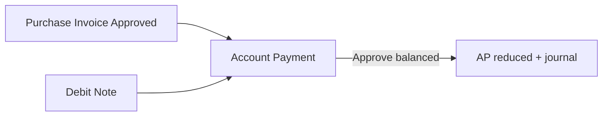
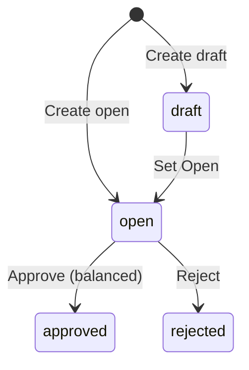

## Module/Feature: Account Payment

**Business definition.** **Account Payment** records **settlement of supplier payables** that arise from approved **Purchase Invoice** documents. You pay with **Cash/Bank**, **Debit Note** (credit from returns/overpayment), or a **combination**. On approve, the system journals a reduction of Account Payable and posts the selected funding sources. **Void after approve is not available** — review carefully before approving.

## Key terms

* **Account Payment (PY-):** Payment document that clears supplier AP.
* **Payment Source:** Cash/Bank rows and/or Debit Note rows funding the payment.
* **Outstanding Purchase Invoice:** Approved/processed PIs with remaining unpaid amount.
* **Strict balancing:** Total Source must equal Total Detail (after adjustments) to approve.
* **Partial payment:** Pay part of a PI now; pay the rest in a later payment.
* **Already Prepared:** PI amount locked on another draft/open payment.

## When to use

* There is an approved Purchase Invoice with outstanding > 0.
* Cash/Bank has sufficient available balance and/or an approved Debit Note for the same supplier.
* Company settings include AP COA, Exchange Diff COA, and Cash Diff COA.

## When to avoid

* No approved PI outstanding for the supplier.
* Expecting to void an approved payment from the UI — not supported yet.
* Approving while Source total ≠ Detail total.

## Prerequisites

| Requirement | Source | Rule |
| :---- | :---- | :---- |
| Supplier | Master | Required on header — UI shows **supplier code** only (search still matches name+code; name on Print only; no read-only Name on Basic Info) |
| Approved PI with outstanding | Purchase Invoice | Appears in Outstanding PI modal |
| AP / Exchange Diff / Cash Diff COA | Company settings | Required for approve journal |
| Cash/Bank account (if used) | Company bank/cash | Active; amount ≤ available balance |
| Approved Debit Note (if used) | Debit Note | Same supplier & currency; remaining balance |
| Open fiscal period | Accounting period | Valid for transaction date |

## Navigation

* **UI path:** Finance & Accounting → Account Payable → Account Payment  
* **Route:** `/accounting/supplier-payment`

*Sidebar Accounting → Account Payment and DataList.*

## Process flow

### Order of execution

1. **Create header** — Supplier (**code** on screen), date, currency, rate; set **Open**.  
2. **Add Payment Source** — Cash/Bank and/or Debit Note.  
3. **Allocate Outstanding PI** — Use / Bulk Use / Allocate Full (partial allowed).  
4. **Optional Adjustment** — manual Debit/Credit COA lines.  
5. **Balance** — Total Source = Total Detail → **Approve**.

## Transaction states

| Status | Meaning | Editable? |
| :---- | :---- | :---- |
| **Draft** | Not ready to approve | Yes |
| **Open** | Ready if balanced | Yes |
| **Approved** | Journal posted; AP reduced | No |
| **Rejected** | Rejected | — |

## Step-by-step (happy path)

1. Open `/accounting/supplier-payment` → **Create**.  
2. Fill Supplier, Date, Currency → status **Open**.  
3. Add **Payment Source** (check bank balance / DN remaining).  
4. Open **Outstanding Purchase Invoice** → **Use** or **Bulk Use**.  
5. Confirm Source = Detail → **Save All** → **Approve**.  
6. Confirm PI outstanding decreased.

## Common pitfalls

* Approve fails on balance — equalize Source and Detail (including adjustments).  
* Header locked after details exist — clear source/detail/adjustment first.  
* PI shows **Already Prepared** — finish or delete the other open payment.  
* Bulk Debit Note clearing errors — add DN one by one.  
* Relying on Void after approve — not available; double-check before Approve.  
* Import results are **Open** — review each payment before approving.

## Related docs in Help Center

* Knowledge Base — operator SOP & troubleshooting  
* Feature Map — clickable sub-feature / Lingo index  
* User Guide — onboarding narrative  
* Requirement / Technical — QA & engineering detail  

**Related menus:** Purchase Invoice · Debit Note · Purchase Return · Cash Bank Reconcile
