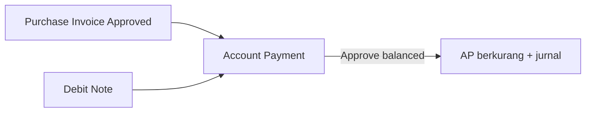
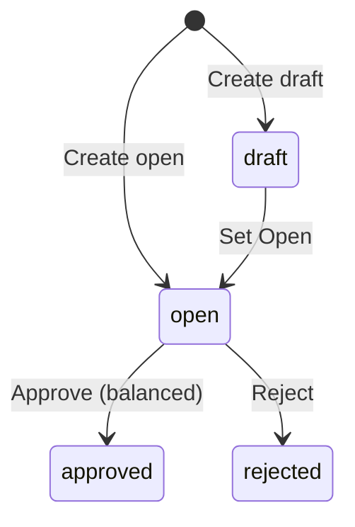

## Modul/Fitur: Account Payment

**Definisi bisnis.** **Account Payment** mencatat **pelunasan hutang supplier** yang muncul dari **Purchase Invoice** yang sudah di-approve. Pembayaran bisa dari **Cash/Bank**, **Debit Note** (potongan retur/kelebihan bayar), atau **kombinasi**. Saat approve, sistem menjurnal pengurangan Account Payable dan memposting sumber dana yang dipilih. **Void setelah approve belum tersedia** — review teliti sebelum Approve.

## Istilah penting

* **Account Payment (PY-):** Dokumen pembayaran yang mengurangi hutang AP.
* **Payment Source:** Baris Cash/Bank dan/atau Debit Note sebagai sumber dana.
* **Outstanding Purchase Invoice:** PI approved/processed yang masih punya sisa hutang.
* **Strict balancing:** Total Source harus sama dengan Total Detail (setelah adjustment) agar bisa Approve.
* **Partial payment:** Bayar sebagian PI sekarang; sisanya di payment berikutnya.
* **Already Prepared:** Amount PI terkunci di payment draft/open lain.

## Kapan dipakai

* Ada Purchase Invoice approved dengan outstanding > 0.
* Cash/Bank punya saldo cukup dan/atau Debit Note approved untuk supplier yang sama.
* Setting company punya AP COA, Exchange Diff COA, dan Cash Diff COA.

## Kapan dihindari

* Tidak ada PI outstanding untuk supplier tersebut.
* Mengharapkan Void payment approved dari UI — belum didukung.
* Approve saat Total Source ≠ Total Detail.

## Prasyarat

| Persyaratan | Sumber | Aturan |
| :---- | :---- | :---- |
| Supplier | Master | Wajib di header |
| PI approved + outstanding | Purchase Invoice | Muncul di modal Outstanding PI |
| AP / Exchange Diff / Cash Diff COA | Setting company | Wajib untuk jurnal approve |
| Rekening Cash/Bank (jika dipakai) | Master kas/bank | Aktif; amount ≤ saldo tersedia |
| Debit Note approved (jika dipakai) | Debit Note | Supplier & currency sama; sisa balance |
| Periode fiskal terbuka | Accounting period | Valid untuk tanggal transaksi |

## Navigasi

* **Jalur UI:** Finance & Accounting → Account Payable → Account Payment  
* **Route:** `/accounting/supplier-payment`

> Placeholder gambar — sidebar Accounting → Account Payment dan DataList.

## Alur proses

### Urutan eksekusi

1. **Buat header** — Supplier, tanggal, mata uang, kurs; set **Open**.  
2. **Tambah Payment Source** — Cash/Bank dan/atau Debit Note.  
3. **Alokasi Outstanding PI** — Use / Bulk Use / Allocate Full (partial boleh).  
4. **Adjustment opsional** — baris Debit/Credit COA manual.  
5. **Balance** — Total Source = Total Detail → **Approve**.

## Status transaksi

| Status | Arti | Bisa diedit? |
| :---- | :---- | :---- |
| **Draft** | Belum siap approve | Ya |
| **Open** | Siap jika sudah balance | Ya |
| **Approved** | Jurnal terbit; AP berkurang | Tidak |
| **Rejected** | Ditolak | — |

## Langkah singkat (happy path)

1. Buka `/accounting/supplier-payment` → **Create**.  
2. Isi Supplier, Tanggal, Mata Uang → status **Open**.  
3. Tambah **Payment Source** (cek saldo bank / sisa DN).  
4. Buka **Outstanding Purchase Invoice** → **Use** atau **Bulk Use**.  
5. Pastikan Source = Detail → **Save All** → **Approve**.  
6. Pastikan outstanding PI sudah berkurang.

## Hal yang sering bikin bingung

* Approve gagal karena balance — samakan Source dan Detail (termasuk adjustment).  
* Header terkunci setelah ada detail — kosongkan source/detail/adjustment dulu.  
* PI **Already Prepared** — selesaikan atau hapus payment open lain.  
* Bulk clearing Debit Note error — tambah DN satu per satu.  
* Mengandalkan Void setelah approve — belum ada; cek ulang sebelum Approve.  
* Hasil import berstatus **Open** — review tiap payment sebelum approve.

## Dokumen terkait di Help Center

* Knowledge Base — SOP operator & troubleshooting  
* Feature Map — indeks sub-feature / Lingo  
* User Guide — narasi onboarding  
* Requirement / Technical — detail QA & engineering  

**Menu terkait:** Purchase Invoice · Debit Note · Purchase Return · Cash Bank Reconcile
