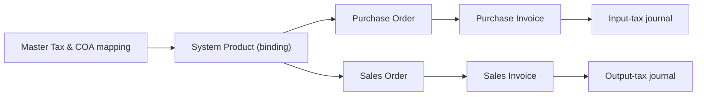
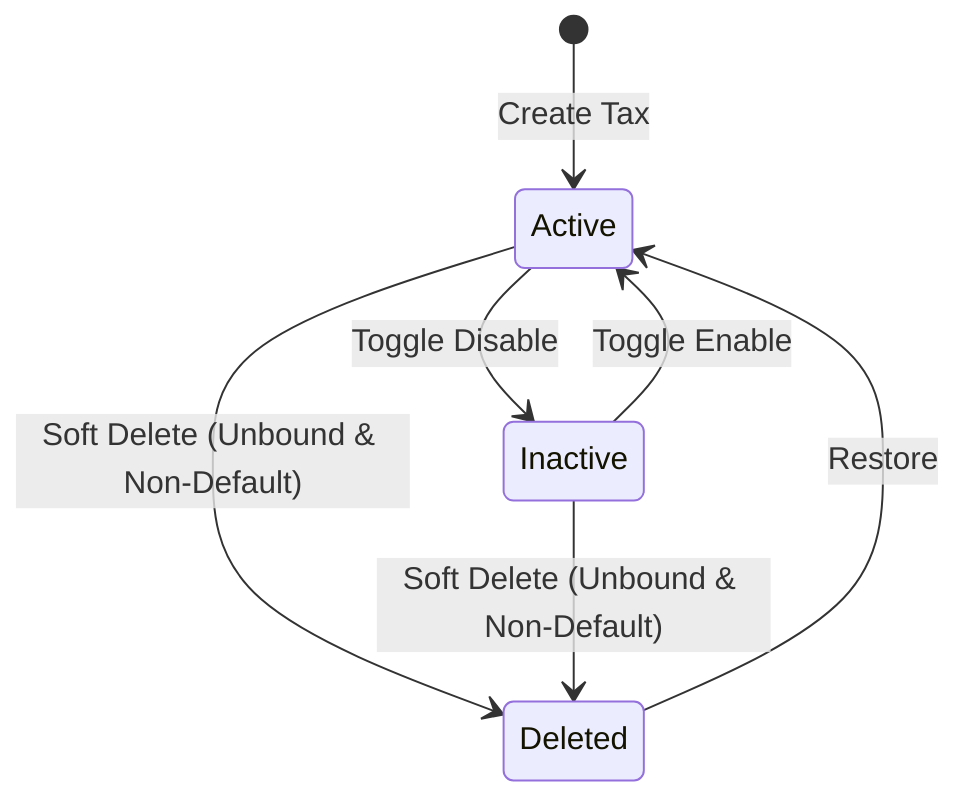
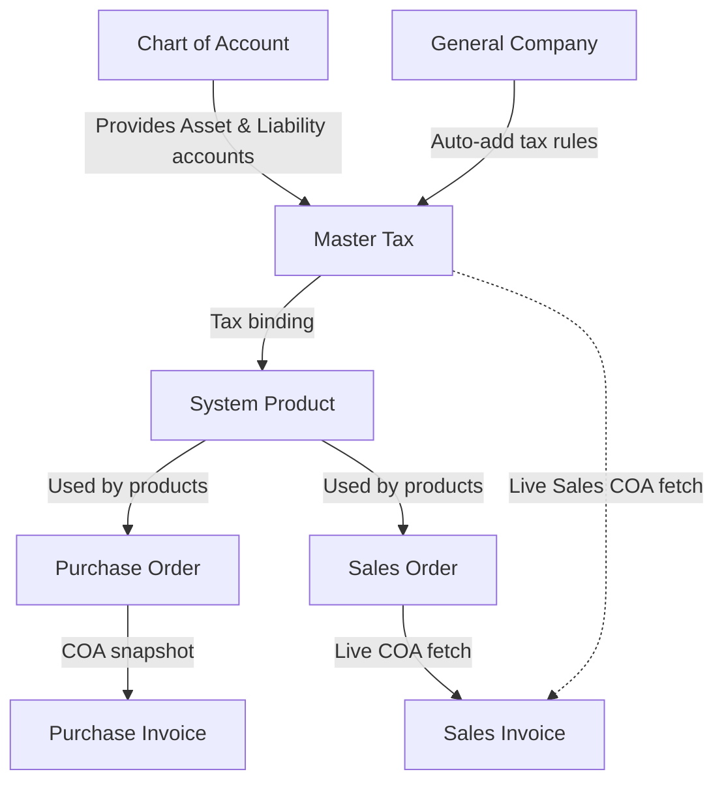

### 📦 Module/Feature: Tax (Master Tax)

**Business definition:**
**Tax (Master Tax)** is the master-data module for Value Added Tax (**VAT / PPN**) rates per company in OlshopERP. It is the central place to configure tax rates and journal account mapping — **Purchase COA** (input tax) and **Sales COA** (output tax). Finance and Accounting teams use it so purchase and sales transactions calculate tax correctly and post valid tax journals.

### 🔑 Key Terms

* **Tax / Master Tax:** Tax-rate master data plus journal account mapping.
* **Purchase COA (Chart of Account):** Journal account for input tax from purchase transactions.
* **Sales COA (Chart of Account):** Journal account for output tax from sales transactions.
* **DPP (Tax Base):** Selling price / value of goods or services before tax.
* **Coefficient 11/12:** Special calculation mode where the document shows **12%**, but the tax actually collected uses an effective **11%** base.
* **Snapshot:** Tax data is locked when a transaction document is created, so later Master Tax changes do not affect that document.
* **Live:** Tax data is read in real time from Master Tax when an action (such as approval) runs.
* **Default Tax POS:** Default flag prepared for future Point of Sale (POS) integration.

### 🎯 When & Why to Use

Use Master Tax when:

* The company needs a new tax rate (for example after a government VAT rate change).
* Binding a tax rate to products in **System Product**.
* Making sure input-tax and output-tax accounts are mapped correctly to **Chart of Account (COA)**.
* Troubleshooting Purchase Invoice / Sales Invoice approval failures caused by incomplete tax account setup.

### 📋 Prerequisites

| Prerequisite | Source module | Notes |
| :---- | :---- | :---- |
| **Input-tax account** | Chart of Account | **Asset** account that is not Current Year Earnings. |
| **Output-tax account** | Chart of Account | **Liability** account that is not Current Year Earnings. |
| **Product data** | System Product | Products that will be bound to purchase/sales tax. |
| **Company tax policy** | General Company | Optional setting for whether tax is auto-added on supplier/customer transactions. |

### 🔄 Place in the Business Flow

Master Tax is the foundation before purchase and sales tax transactions can go through to general journal posting.

**Steps:**

> 1. **Master Tax & COA mapping:** Create Tax and map Purchase COA (Asset) and Sales COA (Liability).
> 2. **System Product (binding):** Link Tax to products on purchase, sales, or both sides.
> 3. **Purchase Order / Sales Order:** When products are added, tax values/config are applied.
> 4. **Invoice approval:** Purchase Invoice locks COA snapshot from PO; Sales Invoice reads live COA from Master Tax.
> 5. **Tax journal:** The system posts automatic tax journals from each COA mapping.

### 📍 Menu Location & Workspace

* **UI Navigation Path:** Finance Accounting → Master → Tax
* **System UI Route:** `/accounting/tax`

🖼️ **[IMAGE PLACEHOLDER]** — Tax list with Purchase COA, Sales COA, Tariff, and Coefficient columns.

### 🏷️ Status Lifecycle & Data Governance

#### Status reference

| Status | Editable? | Description & transition rules |
| :---- | :---- | :---- |
| **Active** | Yes | Default on create. Available for new transactions and product binding. |
| **Inactive** | Yes | Hidden from new transaction/product picks; historical documents stay intact. |
| **Deleted** | No | Soft-deleted. Cannot edit or use. **Can be restored to Active via Restore.** |

⚠️ **Hard Rule:**  
The system **rejects** soft delete if the Tax is still **Default Tax POS** OR still bound to one or more **System Product** rows. If it is unbound from all products and not the POS default, delete is allowed even if it was used on historical transactions.

### ⚙️ How to Use

#### A. Create a new Master Tax

> 1. Go to **Finance Accounting** → **Master** → **Tax**.
> 2. Click **Create**.
> 3. Fill **Code**, **Name**, and **Tariff** (%).
> 4. Choose **Purchase COA** (Asset accounts only) and **Sales COA** (Liability accounts only).
> 5. *(Optional)* If you use indicative 12% VAT with an 11% collection base, turn on **Coefficient**.
> 6. Click **Save**, or **Save & Next** for more details.

🖼️ **[IMAGE PLACEHOLDER]** — Create Tax form with Code, Name, Tariff, Purchase COA, Sales COA, and Coefficient.

#### B. Bind Tax to products

> 1. Open **System Product**.
> 2. Edit the target product.
> 3. In tax configuration, link Master Tax to *Purchase Tax* and/or *Sales Tax*.
> 4. Save the System Product.

🖼️ **[IMAGE PLACEHOLDER]** — Purchase/sales tax configuration on System Product form.

#### C. Test on transactions

> 1. Create a **Purchase Order** or **Sales Order** with a product bound to that Tax.
> 2. Confirm tax calculation appears (depending on General Company rules).
> 3. Continue through Invoice create/approval to confirm journals post correctly.

### 📊 Field Reference

| Field | Required? | Type | Description | Constraints / rules |
| :---- | :---- | :---- | :---- | :---- |
| **Code** | Yes | String | Unique Tax code. | Max 50 chars. Unique among non-deleted rows. |
| **Name** | Yes | String | Tax rate label. | Max 50 chars. |
| **Purchase COA** | Yes | Dropdown | Input-tax account (purchases). | **Asset** accounts only; not Current Year Earnings. |
| **Sales COA** | Yes | Dropdown | Output-tax account (sales). | **Liability** accounts only; not Current Year Earnings. |
| **Tariff** | Yes | Numeric | Tax rate (%). | Minimum 1. Locked to **12** when Coefficient is ON. |
| **Description** | No | Text | Extra notes. | Free text. |
| **Default Tax POS** | No | Toggle | Default tax flag for future POS. | **Not operational yet**. Auto-ON for the company’s first Tax if no default exists. |
| **Coefficient** | No | Toggle | Enables 11/12 special calculation. | Default OFF. When ON, locks Tariff to 12% and changes the tax base. |
| **Active** | No | Toggle | Active/inactive status. | Default ON (Active). |
| **Audit Log** | — | System | Create/update history. | System-managed. |

### 🛡️ Business Rules & Validations

#### Create rules

* **If** Code, Name, or Tariff is empty, or Code already exists, **then** create is rejected.
* **If** Purchase COA or Sales COA is empty, **then** save is blocked.
* **If** Purchase COA is not an **Asset** account, **then** it is rejected.
* **If** Sales COA is not a **Liability** account, **then** it is rejected.
* **If** the chosen COA is Current Year Earnings, **then** it is rejected.
* **If** this is the company’s first Tax with no default yet, **then** it becomes **Default Tax POS** automatically.

#### Update rules

* **If** you turn off **Default Tax POS** on the only default Tax, **then** the change is rejected (at least one default must remain).
* **If** you turn off Default Tax POS without choosing a replacement, **then** the action is blocked.
* **If** you set another Tax as Default Tax POS, **then** the previous default in the same company is turned off automatically.
* **If** you update Purchase/Sales COA to Current Year Earnings, **then** the update is rejected.

#### Delete rules

* **If** you delete a Tax that is **Default Tax POS**, **then** delete is rejected.
* **If** you delete a Tax still bound on **System Product**, **then** delete is rejected.

### 🧮 Coefficient Mode (11/12)

**Coefficient** mode prints **12%** on tax documents, but the tax actually calculated/collected uses an effective **11%** base.

⚠️ **Warning:**  
When **Coefficient** is ON, **Tariff** is **locked to 12** and cannot be edited manually. 12% is the administrative document rate; the calculation engine uses the 11/12 coefficient.

#### Example calculation

Given:

* **Price including tax:** Rp 100,000
* **Coefficient:** ON

* **DPP** = Price × (100 / 121) = Rp 100,000 × (100 / 121) ≈ **Rp 82,582.58**
* **VAT collected (effective 11% base)** ≈ **Rp 9,909.91**
  (equivalent to DPP × 12%, or Price × 12/121 × 11/12)
* **Transaction total** = DPP + VAT = Rp 82,582.58 + Rp 9,909.91 = **Rp 100,000.00**

*Note:* Tax that is not a clean 12% of the gross price is intentional under coefficient-based compliance rules.

### 📄 Snapshot vs Live (Journal Reading)

OlshopERP uses two different ways to read tax journal accounts on invoices. **Both are intentional accounting designs, not bugs.**

⚠️ **Warning:**  
Changing accounts on Master Tax affects Purchase Invoice and Sales Invoice differently.

| Document | Read mode | Mechanism & impact |
| :---- | :---- | :---- |
| **Purchase Invoice** | **Snapshot** (locked) | Uses tax accounts **locked** since the tax line was created on **Purchase Order**. Changing **Purchase COA** on Master Tax **does NOT** change accounts on Purchase Invoices (approved or not). |
| **Sales Invoice** | **Live** (current) | Uses **current** tax accounts from Master Tax at **approval** time. Changing **Sales COA** on Master Tax **DOES** affect Sales Invoices that are **not yet** approved. |

### 🗑️ Deleting Tax That Was Used on Transactions

Historical transactions (PO, SO, Purchase Invoice, Sales Invoice) that used a Tax **stay safe and unchanged** even if that Master Tax is soft-deleted.

Tax attributes were already captured on each document when created. Soft delete is allowed only when:

> 1. The Tax is unbound from all **System Product** links.
> 2. The Tax is not **Default Tax POS**.

### 🛑 Known Limitations

* **Default Tax POS is not operational yet:** It is data prep for future POS. Toggling it does not affect current backend transactions.
* **Cosmetic table typo:** List header may show *"Puchase COA Code"* instead of *"Purchase COA Code"*. Search and processing still work.
* **Account-type validation is stricter on Create:** Asset/Liability group checks are enforced strictly on **Create**. On **Update**, that group re-check is not repeated (Current Year Earnings rejection still applies).

### 🔗 Related Menus

| Related menu | Role vs Master Tax |
| :---- | :---- |
| **Chart of Account** | Provides holding accounts. Asset → Purchase COA, Liability → Sales COA. Accounts used by Tax are locked from COA delete. |
| **System Product** | Where Master Tax is bound to buy/sell products. |
| **General Company** | Company policy for auto-adding tax on documents. |
| **Purchase Order** | Takes Tax from products and snapshots Purchase COA. |
| **Purchase Invoice** | Posts input-tax journal from the PO snapshot. |
| **Sales Order & Sales Invoice** | Take Tax from products. Sales Invoice reads Sales COA live at approval. |

### 🛠️ Troubleshooting

| Symptom | Likely cause | What to do |
| :---- | :---- | :---- |
| Approve fails on Purchase Invoice / Sales Invoice with tax-account error. | Purchase COA or Sales COA is empty or removed from COA. | Open Master Tax, map valid Purchase/Sales COA, save. |
| Cannot delete Master Tax. | Still bound on **System Product**, or is **Default Tax POS**. | Unbind from all products and/or move Default Tax POS to another Tax. |
| VAT amount is not exactly 12% of total price. | **Coefficient** is ON (effective 11% base). | Check Coefficient toggle. If intended, the amount is correct — see Coefficient section. |
| Tax does not appear in System Product tax picks. | Tax is **Inactive** or **Deleted**. | Set status to **Active**. |
| Tariff field is locked. | **Coefficient** is ON. | Turn Coefficient OFF if you need a free tariff %. |

### ❓ FAQ

* **Q: What happens to old transactions if the Master Tax they used is deleted?**
  * **A:** Old transactions stay safe and unchanged. Rate/account values were already stored (snapshot) on each document when created.
* **Q: What does Default Tax POS do?**
  * **A:** It is prepared for a future POS module. It has no direct operational effect on cashier/backend transactions today.
* **Q: Why can’t I delete a Tax that is no longer used on new transactions?**
  * **A:** Make sure it is unbound from all products in **System Product** and is not **Default Tax POS**.
* **Q: Why is Tariff locked at 12?**
  * **A:** **Coefficient** is ON. Document rate is locked at 12% while calculation uses the 11% effective base.
* **Q: If I change Sales COA on Master Tax today, do yesterday’s Sales Invoices change accounts?**
  * **A:** Yes, if those Sales Invoices are **not yet approved**, because Sales Invoice reads Sales COA live at approval. Purchase Invoice uses snapshot and does not behave the same way.

### 📑 See Also

* **Chart of Account (COA)** — company account hierarchy
* **System Product** — product master and product tax mapping
* **Purchase Order (PO)** — purchase ordering and tax snapshot lock
* **Purchase Invoice (PI)** — purchase billing and input-tax posting
* **General Company** — global company parameters and transaction policies
