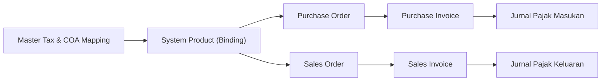
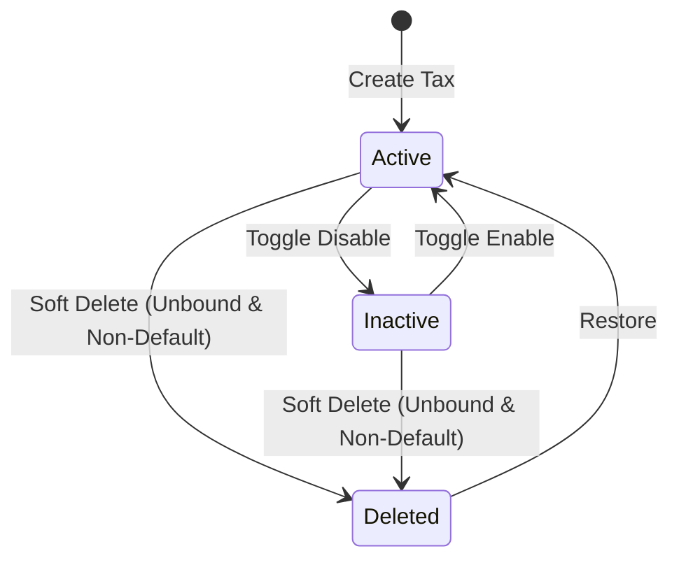
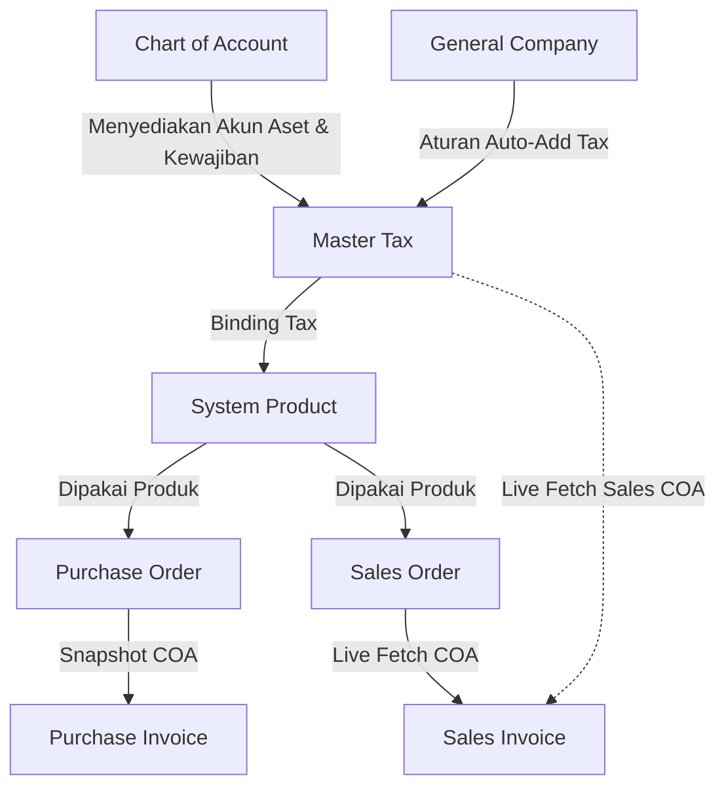

### 📦 Modul/Fitur: Tax (Master Tax)

**Definisi Bisnis:**
**Tax (Master Tax)** adalah modul pengelolaan master data tarif Pajak Pertambahan Nilai (**PPN** / **VAT**) per perusahaan dalam sistem OlshopERP. Modul ini bertindak sebagai pusat konfigurasi tarif pajak dan pemetaan akun jurnal akuntansi—terdiri dari **Purchase COA** (pajak masukan) dan **Sales COA** (pajak keluaran). Modul ini digunakan oleh tim Finance dan Accounting untuk memastikan setiap transaksi pembelian dan penjualan memiliki penghitungan pajak dan pengakuan jurnal akuntansi yang valid.

### 🔑 Istilah Kunci

* **Tax / Master Tax:** Data induk tarif pajak beserta pemetaan akun jurnal akuntansinya.
* **Purchase COA (Chart of Account):** Akun jurnal akuntansi untuk menampung Pajak Masukan yang berasal dari transaksi pembelian.
* **Sales COA (Chart of Account):** Akun jurnal akuntansi untuk menampung Pajak Keluaran yang berasal dari transaksi penjualan.
* **DPP (Dasar Pengenaan Pajak):** Nilai jual atau harga barang/jasa sebelum dikenakan pajak.
* **Coefficient 11/12:** Mode perhitungan pajak khusus di mana tarif yang tercetak secara resmi di dokumen/kertas adalah 12%, namun pajak aktual yang dihitung dan dipungut menggunakan basis efektif 11%.
* **Snapshot:** Mekanisme penguncian data pajak pada saat dokumen transaksi dibuat, sehingga perubahan pada Master Tax setelahnya tidak mempengaruhi nilai/akun transaksi tersebut.
* **Live:** Mekanisme pembacaan data pajak secara real-time langsung dari Master Tax saat suatu tindakan (seperti proses persetujuan/approval) dijalankan.
* **Default Tax POS:** Penanda bawaan untuk kebutuhan integrasi modul kasir (Point of Sale / POS) di masa mendatang.

### 🎯 Kapan & Kenapa Dipakai

Modul Master Tax digunakan ketika:

* Perusahaan perlu mengkonfigurasi tarif pajak baru (misalnya saat terjadi perubahan regulasi tarif PPN pemerintah).
* Melakukan pemetaan (binding) tarif pajak ke produk-produk tertentu di katalog **System Product**.
* Memastikan akun penampung Pajak Masukan dan Pajak Keluaran terhubung dengan benar ke **Chart of Account (COA)**.
* Melakukan pemecahan masalah (troubleshooting) ketika terjadi kegagalan persetujuan (*approval*) pada Purchase Invoice atau Sales Invoice akibat konfigurasi akun pajak yang tidak lengkap.

### 📋 Prasyarat

| Prasyarat | Sumber Modul | Catatan / Persyaratan |
| :---- | :---- | :---- |
| **Akun Pajak Masukan** | Chart of Account | Akun kelompok **Aset** yang belum ditetapkan sebagai akun Laba/Rugi Berjalan (*Current Year Earnings*). |
| **Akun Pajak Keluaran** | Chart of Account | Akun kelompok **Kewajiban** (*Liability*) yang belum ditetapkan sebagai akun Laba/Rugi Berjalan. |
| **Data Produk** | System Product | Produk target yang akan dihubungkan (*binding*) dengan tarif pajak pembelian/penjualan. |
| **Kebijakan Pajak Perusahaan** | General Company | Konfigurasi opsional yang menentukan apakah pajak ditambahkan secara otomatis pada transaksi *supplier* atau *customer*. |

### 🔄 Posisi dalam Alur Bisnis

Master Tax berfungsi sebagai fondasi utama sebelum transaksi pembelian dan penjualan yang melibatkan pajak/pajak dapat diproses hingga ke pembentukan jurnal umum.
Membuat Master Tax + Memilih Purchase/Sales COA dari Chart of Account -> Menghubungkan (Binding) Tax ke System Product -> Penerapan Tarif Tax di Purchase Order / Sales Order -> Pembentukan Invoice (Purchase Invoice / Sales Invoice) -> Pembentukan Jurnal Pajak Otomatis.

**Keterangan Langkah:**

> 1. **Master Tax & COA Mapping:** User membuat data Tax baru dan menentukan pemetaan Purchase COA (Aset) serta Sales COA (Kewajiban).
> 2. **System Product (Binding):** Tax dihubungkan ke data master produk di sisi pembelian, penjualan, atau keduanya.
> 3. **Purchase Order / Sales Order:** Saat produk dimasukkan ke transaksi PO/SO, nilai dan konfigurasi pajak dipanggil.
> 4. **Invoice Approval:** Dokumen invoice diterbitkan. Purchase Invoice mengunci snapshot COA dari PO, sementara Sales Invoice membaca live COA dari Master Tax.
> 5. **Jurnal Pajak:** Sistem membentuk jurnal akuntansi otomatis sesuai pemetaan COA masing-masing.

### 📍 Lokasi Menu & Workspace

* **UI Navigation Path:** Finance Accounting → Master → Tax
* **System UI Route:** `/accounting/tax`

🖼️ **[PLACEHOLDER GAMBAR]** — Halaman daftar Tax dengan kolom Purchase COA, Sales COA, Tariff, dan Coefficient.

### 🏷️ Siklus Status & Data Governance

Status pada Master Tax mengatur ketersediaan data untuk digunakan dalam transaksi baru maupun keterhubungannya dengan modul lain.

#### Tabel Referensi Status

| Status | Dapat Diedit? | Deskripsi & Aturan Transisi |
| :---- | :---- | :---- |
| **Active** | Ya | Status bawaan saat data dibuat. Tersedia untuk dipilih dalam transaksi baru dan *binding* produk. |
| **Inactive** | Ya | Non-aktif. Data tidak akan muncul sebagai pilihan pada transaksi atau relasi produk baru, namun data historis tidak terganggu. |
| **Deleted** | Tidak | Status hapus-lunak (*soft delete*). Data tidak dapat diedit atau digunakan. **Dapat dipulihkan kembali ke status Active via tombol Restore.** |

⚠️ **Hard Rule:**
Sistem akan **menolak** penghapusan data Tax (Soft Delete) apabila data tersebut masih berstatus sebagai **Default Tax POS** ATAU masih terhubung (*bound*) ke satu atau lebih produk di **System Product**. Jika data sudah dilepas dari seluruh produk dan bukan merupakan default POS, penghapusan diizinkan meskipun data tersebut pernah digunakan pada transaksi historis.

### ⚙️ Langkah-Langkah Penggunaan

#### A. Membuat Master Tax Baru

> 1. Navigasi ke menu **Finance Accounting** → **Master** → **Tax**.
> 2. Klik tombol **Create**.
> 3. Isi field **Code**, **Name**, dan **Tariff** (Persentase tarif).
> 4. Pilih **Purchase COA** (hanya menampilkan akun kelompok Aset) dan **Sales COA** (hanya menampilkan akun kelompok Kewajiban).
> 5. *(Opsional)* Jika menggunakan skema PPN indikatif 12% dengan dasar pemungutan 11%, aktifkan toggle **Coefficient**.
> 6. Klik **Save** untuk menyimpan, atau **Save & Next** untuk mengedit rincian lanjutan.

🖼️ **[PLACEHOLDER GAMBAR]** — Form Create Tax dengan field Code, Name, Tariff, Purchase COA, Sales COA, dan toggle Coefficient.

#### B. Binding Tax ke Produk

> 1. Buka menu **System Product**.
> 2. Pilih produk yang ingin dikonfigurasi, lalu masuk ke mode Edit.
> 3. Pada bagian konfigurasi pajak, hubungkan data Master Tax yang telah dibuat ke sisi *Purchase Tax* dan/atau *Sales Tax*.
> 4. Simpan perubahan pada System Product.

🖼️ **[PLACEHOLDER GAMBAR]** — Bagian konfigurasi pajak (purchase/sales) di form System Product.

#### C. Pengujian pada Transaksi

> 1. Buat dokumen **Purchase Order** atau **Sales Order** baru dengan memasukkan produk yang telah terhubung dengan Tax tersebut.
> 2. Pastikan baris kalkulasi pajak muncul secara otomatis (tergantung pada aturan di General Company).
> 3. Lanjutkan alur transaksi hingga pembuatan dan persetujuan (*approval*) Invoice untuk memastikan pengakuan jurnal tidak terkendala.

### 📊 Referensi Field Lengkap

| Field Name | Mandatory? | Type | Description | Constraints / Rules |
| :---- | :---- | :---- | :---- | :---- |
| **Code** | Ya | String | Kode unik pengenal data Tax. | Maksimal 50 karakter. Harus unik di antara data yang belum dihapus. |
| **Name** | Ya | String | Nama/label dari tarif pajak. | Maksimal 50 karakter. |
| **Purchase COA** | Ya | Dropdown | Akun penampung Pajak Masukan (pembelian). | Hanya menampilkan akun kelompok **Aset** yang bukan akun *Current Year Earnings*. |
| **Sales COA** | Ya | Dropdown | Akun penampung Pajak Keluaran (penjualan). | Hanya menampilkan akun kelompok **Kewajiban** yang bukan akun *Current Year Earnings*. |
| **Tariff** | Ya | Numeric | Persentase tarif pajak (%). | Nilai minimal 1. Otomatis terkunci pada angka **12** jika mode *Coefficient* aktif. |
| **Description** | Tidak | Text | Catatan tambahan mengenai Tax. | Bebas. |
| **Default Tax POS** | Tidak | Toggle | Penanda pajak bawaan untuk fitur Kasir (POS). | **Belum memiliki fungsi operasional saat ini** (persiapan fitur mendatang). Otomatis aktif pada data pertama perusahaan jika belum ada default. |
| **Coefficient** | Tidak | Toggle | Mengaktifkan skema perhitungan khusus 11/12. | Bawaan: OFF. Jika ON, terkunci ke Tariff 12% dan mengubah dasar perhitungan pajak. |
| **Active** | Tidak | Toggle | Menentukan status aktif/non-aktif data Tax. | Bawaan: ON (Active). |
| **Audit Log** | - | System | Catatan riwayat pembuatan dan perubahan data. | Dikelola otomatis oleh sistem. |

### 🛡️ Aturan Bisnis & Validasi

#### Aturan Create

* **Kalau kamu** mengosongkan **Code**, **Name**, atau **Tariff**, atau memasukkan **Code** yang sudah terdaftar pada sistem, **maka sistem** akan menolak pembuatan data dan menampilkan pesan error.
* **Kalau kamu** mengosongkan **Purchase COA** atau **Sales COA**, **maka sistem** akan memblokir proses penyimpanan.
* **Kalau kamu** memilih **Purchase COA** dari luar kelompok akun **Aset**, **maka sistem** akan menolak data tersebut.
* **Kalau kamu** memilih **Sales COA** dari luar kelompok akun **Kewajiban**, **maka sistem** akan menolak data tersebut.
* **Kalau kamu** memilih akun COA yang telah ditetapkan sebagai akun *Current Year Earnings* (Laba/Rugi Berjalan), **maka sistem** akan menolak pemilihan akun tersebut.
* **Kalau kamu** membuat data Tax pertama di perusahaan yang belum memiliki rujukan default, **maka sistem** akan menetapkan data tersebut sebagai **Default Tax POS** secara otomatis.

#### Aturan Update

* **Kalau kamu** mematikan status **Default Tax POS** pada satu-satunya data yang berstatus default, **maka sistem** akan menolak perubahan tersebut (harus ada minimal satu default).
* **Kalau kamu** mencoba mematikan status **Default Tax POS** tanpa memilih data pengganti, **maka sistem** akan memblokir tindakan tersebut.
* **Kalau kamu** menetapkan data Tax lain sebagai **Default Tax POS** baru, **maka sistem** akan otomatis mematikan status default pada data lama di perusahaan yang sama.
* **Kalau kamu** memperbarui **Purchase COA** atau **Sales COA** mengarahkan ke akun *Current Year Earnings*, **maka sistem** akan menolak pembaruan data.

#### Aturan Delete

* **Kalau kamu** menghapus data Tax yang sedang berstatus sebagai **Default Tax POS**, **maka sistem** akan menolak proses penghapusan.
* **Kalau kamu** menghapus data Tax yang masih terhubung (*bound*) pada produk di **System Product**, **maka sistem** akan menolak proses penghapusan.

### 🧮 Mode Coefficient (11/12)

Mode **Coefficient** adalah fitur kalkulasi pajak di mana tarif resmi yang tercantum pada dokumen/kertas perpajakan adalah **12%**, namun besaran nilai pajak yang benar-benar dihitung dan dipungut secara riil menggunakan basis efektif **11%**.
⚠️ **Warning:**
Saat toggle **Coefficient** diaktifkan, field **Tariff** pada form akan secara **otomatis terkunci pada angka 12** dan tidak dapat diubah secara manual. Hal ini menandakan bahwa angka 12 adalah representasi administratif dokumen, sementara mesin kalkulasi sistem akan menggunakan koefisien 11/12.

#### Simulasi & Contoh Angka

Diberikan contoh transaksi penjualan/pembelian barang dengan kondisi:

* **Harga Barang (Termasuk Pajak):** Rp 100.000
* **Status Coefficient:** Aktif (ON)

**Rumus & Hasil Perhitungan Sistem:**

* **DPP** = Harga × (100 / 121) = Rp 100.000 × (100 / 121) ≈ **Rp 82.582,58**
* **VAT / Pajak dipungut (basis efektif 11%)** ≈ **Rp 9.909,91**
  (setara dengan DPP × 12%, atau Harga × 12/121 × 11/12)
* **Total transaksi** = DPP + VAT = Rp 82.582,58 + Rp 9.909,91 = **Rp 100.000,00**
*Penjelasan:* Pemotongan nilai pajak yang secara nominal tidak genap 12% dari harga total adalah perilaku sistem yang sengaja dirancang untuk memenuhi kepatuhan regulasi perpajakan berbasis koefisien efektif.

### 📄 Snapshot vs Live (Jurnal)

Sistem OlshopERP memiliki dua pendekatan berbeda dalam membaca akun jurnal pajak pada dokumen Invoice. **Kedua pendekatan ini dirancang secara sengaja berdasarkan kebutuhan akuntansi dan bukan merupakan kesalahan (*bug*) sistem.**
⚠️ **Warning:**
Perubahan akun pada Master Tax akan memberikan dampak yang berbeda pada dokumen Purchase Invoice dibanding Sales Invoice.

| Jenis Dokumen | Sifat Pembacaan Data | Mekanisme & Dampak Operasional |
| :---- | :---- | :---- |
| **Purchase Invoice** | **Snapshot** *(Terkunci)* | Menggunakan akun pajak yang telah **dikunci (snapshot)** sejak baris pajak terbentuk di **Purchase Order**. Mengubah **Purchase COA** di Master Tax **TIDAK AKAN** mengubah pemetaan akun pada Purchase Invoice yang sudah maupun belum disetujui (*approved*). |
| **Sales Invoice** | **Live** *(Terkini)* | Menggunakan akun pajak **terkini (live)** yang dibaca langsung dari Master Tax pada saat proses persetujuan (*approval*) dijalankan. Mengubah **Sales COA** di Master Tax **AKAN** langsung mempengaruhi Sales Invoice yang statusnya **belum** disetujui. |

### 🗑️ Menghapus Data yang Pernah Dipakai Transaksi

Transaksi historis (Purchase Order, Sales Order, Purchase Invoice, Sales Invoice) yang pernah menggunakan suatu data Tax **akan tetap aman dan nilainya tidak akan berubah** meskipun data Master Tax tersebut dihapus (*Soft Delete*) dari sistem.
Hal ini terjadi karena seluruh atribut dan nilai kalkulasi pajak pada transaksi historis telah disimpan secara permanen (*snapshot/capture*) pada masing-masing dokumen transaksi saat transaksi dibuat. Syarat utama agar Master Tax dapat dihapus hanyalah:

> 1. Data Tax telah dilepas dari seluruh keterhubungan (*unbound*) di **System Product**.
> 2. Data Tax tidak sedang menjabat sebagai **Default Tax POS**.

### 🛑 Keterbatasan yang Diketahui

Berikut adalah kondisi perilaku sistem saat ini yang perlu diperhatikan oleh tim operasional:

* **Default Tax POS Belum Berdampak Operasional:** Pengaturan status *Default Tax POS* saat ini murni merupakan persiapan struktur data untuk modul Kasir (POS) di masa mendatang. Mengaktifkan atau mengalihkannya tidak mempengaruhi jalannya transaksi backend saat ini.
* **Teks Kosmetik pada Kolom Tabel:** Terdapat kesalahan pengetikan kosmetik pada label header kolom tabel daftar Tax (tertulis *"Puchase COA Code"* yang seharusnya *"Purchase COA Code"*). Hal ini tidak mempengaruhi fungsi pencarian maupun pengolahan data.
* **Validasi Tipe Akun Terbatas pada Mode Create:** Pengecekan tipe kelompok akun (Aset untuk Purchase COA dan Kewajiban untuk Sales COA) **hanya dilakukan secara ketat saat pembuatan data baru (Create)**. Saat pembaruan data (Update), sistem tidak mengulang pengecekan tipe kelompok akun tersebut (namun validasi penolakan akun *Current Year Earnings* tetap berjalan normal).

### 🔗 Hubungan Antar Menu

| Menu Terkait | Peranan / Hubungan Terhadap Master Tax |
| :---- | :---- |
| **Chart of Account** | Menyediakan master akun penampung. Account Aset dipetakan ke Purchase COA dan Kewajiban ke Sales COA. Akun yang digunakan di Tax terkunci dari penghapusan di COA. |
| **System Product** | Modul tempat mengaitkan (*binding*) Master Tax ke katalog produk jual/beli. |
| **General Company** | Menentukan preferensi kebijakan otomatisasi penambahan pajak pada dokumen transaksi. |
| **Purchase Order** | Mengambil rujukan Tax dari produk dan mengunci (*snapshot*) data Purchase COA. |
| **Purchase Invoice** | Menerbitkan jurnal Pajak Masukan berdasarkan *snapshot* akun dari Purchase Order. |
| **Sales Order & Sales Invoice** | Mengambil rujukan Tax dari produk. Sales Invoice membaca *Sales COA* secara *live* dari Master Tax saat *approval*. |

### 🛠️ Troubleshooting

| Gejala Masalah | Kemungkinan Penyebab | Solusi Operasional |
| :---- | :---- | :---- |
| Process *Approve* pada Purchase Invoice / Sales Invoice gagal dengan pesan kesalahan akun pajak. | Field **Purchase COA** atau **Sales COA** pada Master Tax belum diisi atau terhapus dari COA. | Buka menu Master Tax terkait, lengkapi pemetaan Purchase COA dan Sales COA dengan akun yang valid, lalu simpan. |
| Gagal menghapus data Master Tax. | Data Tax masih terhubung (*bound*) pada salah satu produk di **System Product**, atau berstatus **Default Tax POS**. | Lepaskan keterikatan Tax pada seluruh produk di System Product, dan/atau alihkan status Default Tax POS ke data Tax lain. |
| Nilai pajak (VAT) yang dihasilkan tidak presisi 12% dari total harga. | Fitur **Coefficient** pada data Tax tersebut sedang aktif (perhitungan berbasis efektif 11%). | Periksa status toggle Coefficient. Jika sesuai regulasi koefisien, nilai tersebut sudah benar (bukan bug). Lihat **Section 10**. |
| Data Tax tidak muncul pada pilihan konfigurasi pajak di System Product. | Data Tax tersebut berstatus **Inactive** atau **Deleted**. | Ubah status Tax menjadi **Active** melalui toggle pada halaman daftar Tax. |
| Field Tariff terkunci dan tidak dapat diubah angkanya. | Toggle **Coefficient** dalam kondisi aktif (ON). | Matikan toggle **Coefficient** terlebih dahulu jika ingin menginput tarif persentase secara bebas. |

### ❓ FAQ

**Q: Apa yang terjadi pada dokumen transaksi lama jika Master Tax yang digunakan dihapus?**
A: Transaksi lama tetap aman dan nilainya tidak berubah. Seluruh data tarif dan akun pajak telah tersimpan secara permanen (*snapshot*) di dalam dokumen transaksi masing-masing saat transaksi dibuat.
**Q: Apa fungsi dari toggle Default Tax POS?**
A: Fitur tersebut disiapkan sebagai konfigurasi bawaan untuk modul Point of Sale (POS) yang akan datang. Saat ini belum ada efek operasional langsung pada transaksi kasir maupun *backend*.
**Q: Mengapa saya tidak bisa menghapus suatu data Tax padahal sudah tidak digunakan di transaksi baru?**
A: Pastikan data Tax tersebut sudah dilepas dari konfigurasi semua produk pada menu **System Product** dan pastikan data tersebut tidak ditandai sebagai **Default Tax POS**.
**Q: Mengapa kolom Tariff otomatis terisi angka 12 dan tidak bisa diganti?**
A: Hal ini terjadi karena opsi **Coefficient** sedang aktif. Mode ini secara otomatis mengunci tarif dokumen pada angka 12% dan menerapkan rumus kalkulasi berbasis 11%.
**Q: Jika saya mengubah Sales COA pada Master Tax hari ini, apakah Sales Invoice yang dibuat kemarin ikut berubah akunnya?**
A: Ya, jika Sales Invoice tersebut **belum di-approve**, karena Sales Invoice membaca akun Sales COA secara *live* dari Master Tax saat tombol *approve* ditekan. Hal ini tidak berlaku untuk Purchase Invoice yang menggunakan sistem *snapshot*.

### 📑 Lihat Juga

* **Chart of Account (COA):** Pengelolaan hirarki akun akuntansi perusahaan.
* **System Product:** Pengelolaan katalog produk induk dan konfigurasi pemetaan pajak produk.
* **Purchase Order (PO):** Pembuatan dokumen pemesanan pembelian dan penguncian *snapshot* pajak.
* **Purchase Invoice (PI):** Penerbitan tagihan pembelian dan penagihan Pajak Masukan.
* **General Company:** Pengaturan parameter global dan kebijakan transaksi perusahaan.
