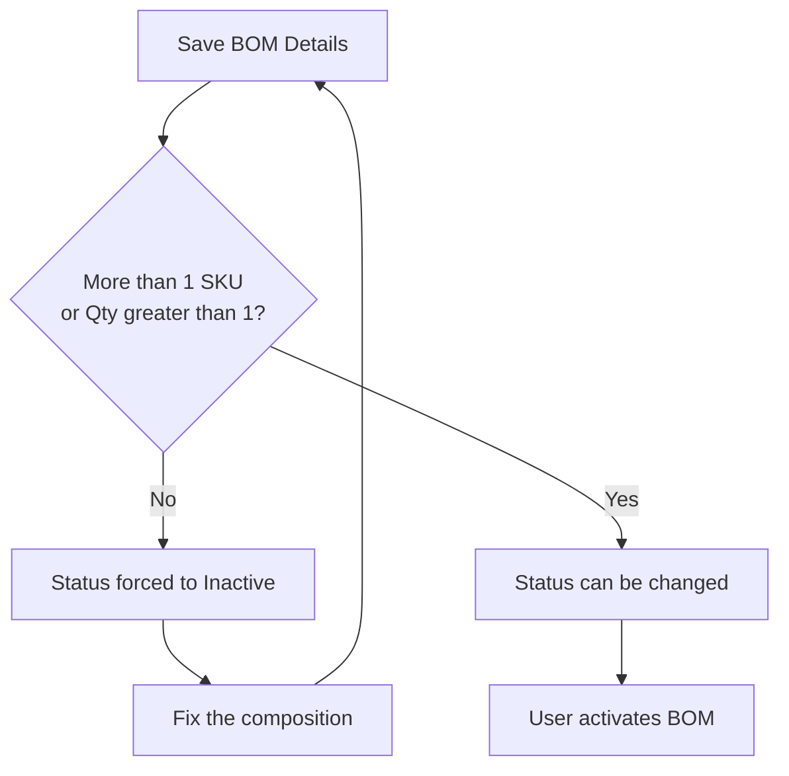
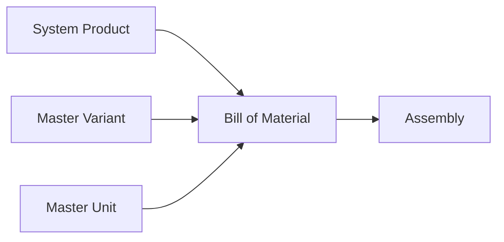

### 📦 Module/Feature: Bill of Material (BOM)

**Business definition:**
**Bill of Material (BOM)** is a master-data menu in **OlshopERP** used to mark a SKU as a **Header BOM** (finished good) and define its **Detail BOM** (components or raw materials and their quantities). A BOM is the production “recipe” and a basic requirement for manufacturing. This menu **does not create transactions, accounting journals, or physical stock movements**. The **Assembly** module later uses the BOM as its official production reference.

### 🔑 Key Terms (Glossary)

* **Header BOM:** An active SKU marked as a finished good that can be produced through Assembly.
* **Detail BOM:** A component line containing the SKU, quantity, and unit needed to make the finished good.
* **Composition Rule:** The minimum component requirement before a BOM can be activated.
* **Nested BOM / Sub-assembly:** A component that is also a Header BOM with its own lower-level recipe.
* **Variant BOM:** Each product variant has its own Detail BOM and does not automatically inherit another variant’s formula.
* **Random SKU:** A virtual, non-stock product that cannot be used as a Header or Detail BOM.
* **Bundle Product:** A group of SKUs used for sales that is not stored as independent stock, so it cannot be used in a BOM.

### 🎯 When & Why to Use It

| ✅ Create a BOM when | ❌ Don’t create a BOM when |
| :---- | :---- |
| A new finished good needs a raw-material formula before internal production can begin. | The finished-good SKU or its component is a *Bundle Product* or *Random SKU*. |
| You want an assembled SKU to appear as a finished-good option in Assembly. | You need to move stock or post an inventory journal directly — use Assembly instead. |

### 📋 Prerequisites

* **Valid product type:** Header and Detail BOM items must be **Single** or **Variant** products.
* **Complete Master Unit:** The component unit must already exist in **Master Unit** and be connected to the product.
* **Unique SKU:** For **Create New**, the SKU code must not already belong to another product.

### 📍 Menu Location & Workspace

* **UI navigation path:** Supply Chain → Bill of Material
* **System UI route:** `/supplychain/bill-of-material`

> 🖼️ **[IMAGE PLACEHOLDER]** — Supply Chain → Bill of Material sidebar and list page.

### 🔄 Two Ways to Create a BOM

The system provides two methods:

> 1. **Refer from System Product**
>    * Use this when the finished good already exists in the product master.
>    * Choose a SKU from the dropdown. The system only shows Single/Variant products that are not Bundles.
> 2. **Create New**
>    * Use this when the finished good does not exist yet.
>    * Enter the SKU code and product name. The system creates the product and marks it as a Header BOM.
>    * **Enable Variations ON:** Creates a parent product and its variants; each variant becomes an independent Header BOM.
>    * **Enable Variations OFF:** Creates one Single product.

> 🖼️ **[IMAGE PLACEHOLDER]** — Create BOM form, Refer from System Product / Create New choices, and Variations toggle.

### 🛡️ Header & Component Rules

* **Product type:** Header and Detail BOM only accept **Single** or **Variant** products. Bundle and Random SKUs are blocked.
* **Strict 1:1 relationship:** One Header SKU can only have **one BOM**. There is no alternate recipe or version history for the same SKU.
* **No self-reference:** A Header BOM cannot be added as its own component.
* **Nested BOM is supported:** Another Header BOM can be used as a component. Production must be done in stages in Assembly — produce the sub-assembly first, then produce the parent item.

### ⚙️ Composition Rule — When a BOM Can Be Active

A BOM must meet at least one condition:

1. It has **more than one unique component SKU**, or
2. It has one component SKU with a **Qty greater than 1**.

Details that do not meet the rule can still be saved because each line uses autosave, but the BOM is forced to **Inactive**. The toggle cannot be turned on until the composition is fixed. An Inactive BOM does not appear as a finished-good option in Assembly.

### ⚙️ Step-by-Step Guide

#### Task 1: Create the BOM Header

1. Open `/supplychain/bill-of-material`, then create a new document.
2. Choose **Refer from System Product** if the product exists, or **Create New** if it does not.
3. For Create New, enter the SKU code, product name, and choose whether to **Enable Variations**.

#### Task 2: Add Components

1. Open the **Detail BOM** section.
2. Add a **Component SKU**.
3. Enter the **Qty** as a positive whole number.
4. Choose a valid **Unit** for the product.

> 🖼️ **[IMAGE PLACEHOLDER]** — Detail BOM with SKU, Qty, and Unit.

#### Task 3: Activate the BOM

1. Make sure the components meet the Composition Rule.
2. Switch the status toggle to **Active**.

> 🖼️ **[IMAGE PLACEHOLDER]** — Active/Inactive toggle and composition warning.

### 📊 Field Reference

#### 1. Refer from System Product Mode

| Field | Required? | Rule |
| :---- | :---- | :---- |
| **Select Product** | Yes | Only active Single/Variant SKUs that are not Bundles. |

#### 2. Create New Mode

| Field | Required? | Rule |
| :---- | :---- | :---- |
| **SKU Code** | Yes | Must be unique and unused by another product. |
| **Product Name** | Yes | The new product’s name. |
| **Enable Variations** | No | OFF creates one Single product; ON creates a parent and its variants. |

#### 3. Detail BOM

| Field | Required? | Rule |
| :---- | :---- | :---- |
| **Component SKU** | Yes | Cannot be the Header itself, a Bundle, or a Random SKU. |
| **Qty** | Yes | Positive whole number greater than 0; decimals, zero, and negative values are blocked. |
| **Unit** | Yes | Defaults to the primary unit; an alternate unit connected to the product is also allowed. |

#### 4. Status

| Field | Rule |
| :---- | :---- |
| **Active/Inactive** | Manually controlled, but forced to Inactive when the Composition Rule is not met. |

### 🛡️ Business Rules & Validation

* If you choose a Bundle or Random SKU as a Header/Detail, the system hides it from the dropdown.
* If you try to change a Header BOM into a Bundle in System Product, the system rejects the change.
* If you create a second BOM for the same Header, the system rejects it because of the 1:1 rule.
* If a Create New SKU code is already used, the BOM cannot be saved.
* If the Header is added as its own component, the system blocks the self-reference.
* If Qty is a decimal, zero, or negative, the system rejects the input.
* If the composition is invalid, the Active toggle returns to Inactive.
* If a unit is still used in a Detail BOM, the system blocks deleting that unit.

### 🔄 Edit, Deactivate, and Delete

| Action | Behavior |
| :---- | :---- |
| **Edit** | Components, Qty, and Unit can be updated. An Assembly still in Draft/Open may refresh its snapshot based on its process stage; an Approved Assembly does not change. |
| **Inactive** | Hides the Header BOM from Assembly without deleting the recipe. It can be activated again when the composition is valid. |
| **Delete** | Only allowed when the Header BOM has never been used in Assembly. Removes the Header BOM flag, not the product from System Product. |

💡 Creation, component changes, status changes, and deletion are recorded in the **Audit Log**.

### 🔗 Impact on Assembly (Snapshot)

* Assembly only shows **Active** Header BOMs with valid compositions.
* When Assembly moves to **Open**, the system creates a **BoM Snapshot** from the current formula.
* If the BOM changes while Assembly is not finished, the snapshot may refresh according to the Assembly process stage. An **Approved** Assembly keeps its locked data and does not change.
* A Nested BOM is not expanded automatically. The sub-assembly must be produced first so its stock is available.

### 📥 Data Export

Header and Detail BOM data can be exported from the list page to a spreadsheet.

> 🖼️ **[IMAGE PLACEHOLDER]** — Export button on the list page.

### 🔗 How This Menu Connects to Others

| Menu | Role |
| :---- | :---- |
| **System Product** | Source of Header/Detail SKUs and the place to change product identity. |
| **Master Variant** | Provides variation options for Create New + Enable Variations. |
| **Master Unit** | Provides primary/alternate units and their conversion factors. |
| **Assembly** | Main BOM consumer; creates a component snapshot during production. |
| **Random SKU** | Virtual product excluded from Header and Detail BOM. |

### 🛑 System Limitations

* **No multiple recipes:** One Header SKU only has one BOM. An alternate recipe needs a different Header SKU.
* **Qty must be whole:** For 0.5 Kg, use a smaller unit such as 500 Grams.
* **Independent variants:** Each variant needs its own Detail BOM; formulas are not inherited automatically.

### 🛠️ Troubleshooting

| Symptom | Likely Cause | Fix |
| :---- | :---- | :---- |
| A SKU does not appear as a Header/Detail. | It is a Bundle, Random SKU, or not a Single/Variant product. | Check its product type in System Product. |
| The toggle keeps returning to Inactive. | The Composition Rule is not met. | Add a second component SKU or increase one component’s Qty to at least 2. |
| Create New fails with a code conflict. | The SKU is already used by another product. | Use a new, unique SKU code. |
| The Delete button is locked. | The BOM has already been used in Assembly. | Use Inactive instead. |
| A Master Unit cannot be deleted. | The unit is still used by a Detail BOM. | Change the unit in the related BOM, then try again. |

### ❓ Frequently Asked Questions

**Q: Does creating a BOM immediately deduct stock?**
A: No. A BOM only stores the recipe. Stock moves only when an Assembly is processed and approved.

**Q: Can component Qty use decimals?**
A: No. Use a smaller unit so the quantity becomes a whole number, such as Grams instead of Kg.

**Q: What is the difference between Inactive and Delete?**
A: Inactive only hides the BOM from Assembly and keeps its data. Delete removes the Header BOM flag and is only allowed if the BOM has never been used.

**Q: Does changing a BOM update an old Assembly?**
A: An Approved Assembly does not change because it uses locked snapshot data. For Draft/Open transactions, the formula may refresh according to the Assembly process stage.

### 📑 See Also

* **System Product** — SKU catalog and product identity.
* **Assembly** — production transaction that uses the BOM.
* **Master Unit** — unit and conversion setup.
* **Master Variant** — product-variant characteristics.
