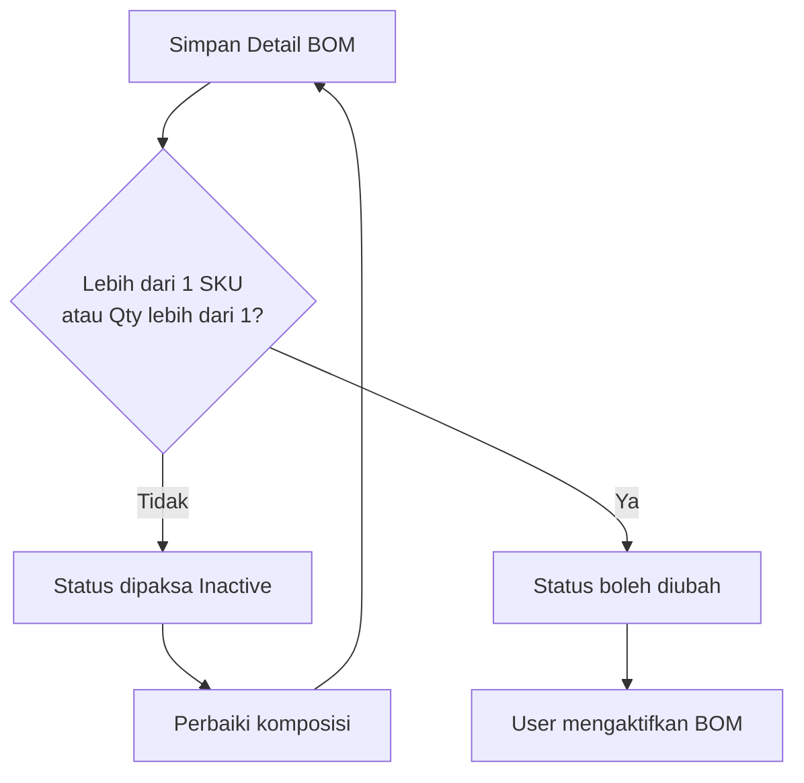
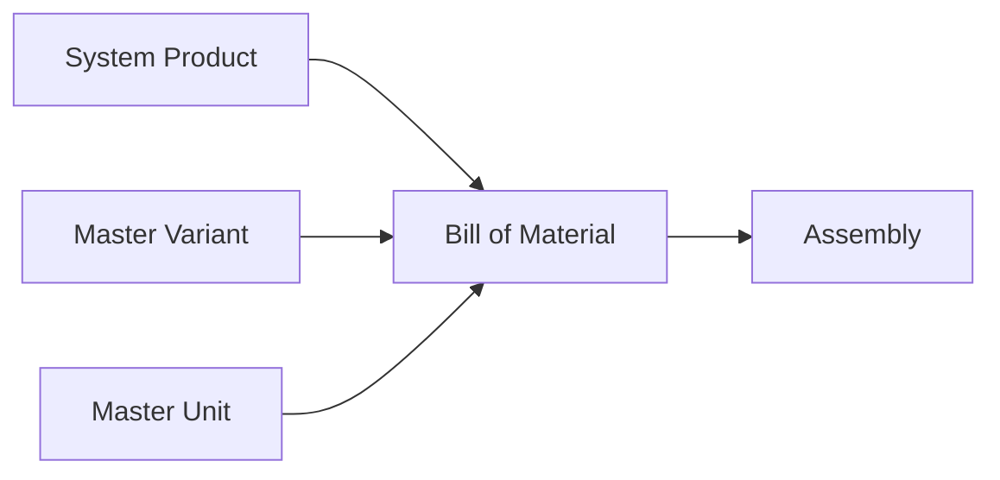

### 📦 Modul/Fitur: Bill of Material (BOM)

**Definisi bisnis:**
**Bill of Material (BOM)** adalah menu master data di **OlshopERP** untuk menandai sebuah SKU sebagai **Header BOM** (barang jadi) dan mendefinisikan **Detail BOM** (komponen atau bahan baku beserta kuantitasnya). BOM berfungsi sebagai “resep” dan prasyarat produksi. Menu ini **tidak membuat transaksi, jurnal akuntansi, atau pergerakan stok**. Konfigurasi BOM baru digunakan oleh modul **Assembly** sebagai acuan produksi internal.

### 🔑 Istilah Kunci (Glosarium)

* **Header BOM:** SKU aktif yang ditandai sebagai barang jadi (*finished goods*) untuk diproduksi melalui Assembly.
* **Detail BOM:** Baris komponen penyusun yang berisi SKU, kuantitas, dan satuan.
* **Composition Rule:** Syarat minimum komposisi agar BOM boleh diaktifkan.
* **Nested BOM / Sub-assembly:** Salah satu komponen merupakan Header BOM lain yang memiliki resepnya sendiri.
* **Variant BOM:** Setiap anak varian memiliki Detail BOM sendiri dan tidak otomatis mewarisi formula dari varian lain.
* **Random SKU:** Produk virtual non-stock yang tidak boleh menjadi Header maupun Detail BOM.
* **Bundle Product:** Produk gabungan untuk kebutuhan penjualan yang tidak disimpan sebagai stok mandiri, sehingga tidak boleh digunakan dalam BOM.

### 🎯 Kapan & Kenapa Dipakai

| ✅ Buat BOM jika | ❌ Jangan buat BOM jika |
| :---- | :---- |
| Ada barang jadi baru yang perlu didefinisikan komposisi bahan bakunya agar siap diproduksi. | SKU barang jadi atau komponennya berupa *Bundle Product* atau *Random SKU*. |
| Ingin mendaftarkan SKU hasil rakitan agar muncul sebagai target *Finish Goods* di Assembly. | Ingin langsung mencatat mutasi stok atau jurnal persediaan — gunakan Assembly. |

### 📋 Prasyarat Operasional

* **Jenis produk valid:** Header dan Detail BOM harus berupa produk **Single** atau **Variant**.
* **Master Unit lengkap:** Satuan komponen harus sudah tersedia di **Master Unit** dan terhubung ke produk.
* **SKU unik:** Pada metode **Create New**, kode SKU belum boleh dipakai produk lain.

### 📍 Lokasi Menu & Workspace

* **Jalur navigasi UI:** Supply Chain → Bill of Material
* **Route UI sistem:** `/supplychain/bill-of-material`

> 🖼️ **[PLACEHOLDER GAMBAR]** — Sidebar Supply Chain → Bill of Material dan halaman daftar.

### 🔄 Dua Cara Membuat BOM

Sistem menyediakan dua metode:

> 1. **Refer from System Product**
>    * Gunakan jika barang jadi sudah terdaftar di master produk.
>    * Pilih SKU dari dropdown. Sistem hanya menampilkan produk Single/Variant yang bukan Bundle.
> 2. **Create New**
>    * Gunakan jika barang jadi belum ada di sistem.
>    * Isi kode SKU dan nama produk. Sistem membuat produk baru sekaligus menandainya sebagai Header BOM.
>    * **Enable Variations ON:** Membuat produk induk dan anak variannya; setiap varian menjadi Header BOM independen.
>    * **Enable Variations OFF:** Membuat satu produk Single.

> 🖼️ **[PLACEHOLDER GAMBAR]** — Form Create BOM, pilihan Refer from System Product / Create New, dan toggle Variations.

### 🛡️ Aturan Header & Komponen

* **Tipe produk:** Header dan Detail BOM hanya menerima produk **Single** atau **Variant**. Bundle dan Random SKU ditolak.
* **Hubungan 1:1:** Satu SKU Header hanya boleh memiliki **satu BOM**. Tidak ada resep alternatif atau versioning untuk SKU yang sama.
* **Anti self-reference:** Header BOM tidak boleh menjadi komponen dirinya sendiri.
* **Nested BOM didukung:** Header BOM lain boleh menjadi komponen. Proses produksinya dilakukan bertahap di Assembly — rakit sub-assembly lebih dulu, lalu rakit produk induk.

### ⚙️ Composition Rule — Syarat BOM Bisa Aktif

BOM wajib memenuhi minimal salah satu kondisi:

1. Memiliki **lebih dari satu SKU komponen unik**, atau
2. Memiliki satu SKU komponen dengan **Qty lebih dari 1**.

Detail yang belum memenuhi aturan tetap dapat tersimpan karena setiap baris memakai autosave, tetapi status BOM dipaksa **Inactive**. Toggle tidak bisa diaktifkan sampai komposisinya diperbaiki. BOM Inactive tidak muncul sebagai pilihan barang jadi di Assembly.

### ⚙️ Panduan Penggunaan

#### Task 1: Buat Header BOM

1. Buka `/supplychain/bill-of-material`, lalu buat dokumen baru.
2. Pilih **Refer from System Product** jika produk sudah ada, atau **Create New** jika belum ada.
3. Jika memakai Create New, isi kode SKU, nama produk, dan tentukan **Enable Variations**.

#### Task 2: Tambahkan Komponen

1. Buka bagian **Detail BOM**.
2. Tambahkan **SKU Komponen**.
3. Isi **Qty** dengan bilangan bulat positif.
4. Pilih **Unit** yang valid untuk produk tersebut.

> 🖼️ **[PLACEHOLDER GAMBAR]** — Detail BOM dengan SKU, Qty, dan Unit.

#### Task 3: Aktifkan BOM

1. Pastikan komponen memenuhi Composition Rule.
2. Geser toggle status ke **Active**.

> 🖼️ **[PLACEHOLDER GAMBAR]** — Toggle Active/Inactive dan peringatan komposisi.

### 📊 Referensi Field

#### 1. Mode Refer from System Product

| Field | Wajib? | Aturan |
| :---- | :---- | :---- |
| **Pilih Produk** | Ya | Hanya SKU aktif bertipe Single/Variant dan bukan Bundle. |

#### 2. Mode Create New

| Field | Wajib? | Aturan |
| :---- | :---- | :---- |
| **Kode SKU** | Ya | Harus unik dan belum dipakai produk lain. |
| **Nama Produk** | Ya | Nama produk baru. |
| **Enable Variations** | Tidak | OFF membuat satu produk Single; ON membuat induk dan anak varian. |

#### 3. Detail BOM

| Field | Wajib? | Aturan |
| :---- | :---- | :---- |
| **SKU Komponen** | Ya | Tidak boleh Header itu sendiri, Bundle, atau Random SKU. |
| **Qty** | Ya | Bilangan bulat positif lebih dari 0; desimal, nol, dan negatif ditolak. |
| **Unit** | Ya | Default satuan utama; bisa memakai satuan alternatif yang terhubung ke produk. |

#### 4. Status

| Field | Aturan |
| :---- | :---- |
| **Active/Inactive** | Aktivasi manual; dipaksa Inactive jika Composition Rule tidak terpenuhi. |

### 🛡️ Aturan Bisnis & Validasi

* Jika memilih Bundle atau Random SKU sebagai Header/Detail, sistem tidak menampilkannya di dropdown.
* Jika Header BOM diubah menjadi Bundle dari System Product, sistem menolak perubahan.
* Jika membuat BOM kedua untuk Header yang sama, sistem menolak karena hubungan 1:1.
* Jika kode SKU pada Create New sudah digunakan, BOM gagal disimpan.
* Jika Header dimasukkan sebagai komponennya sendiri, sistem memblokir self-reference.
* Jika Qty berupa desimal, nol, atau negatif, sistem menolak input.
* Jika komposisi tidak memenuhi syarat, toggle Active dikembalikan ke Inactive.
* Jika satuan masih digunakan di Detail BOM, sistem memblokir penghapusan satuan tersebut.

### 🔄 Edit, Nonaktifkan, dan Hapus

| Aksi | Perilaku |
| :---- | :---- |
| **Edit** | Komposisi, Qty, dan Unit dapat diperbarui. Assembly yang masih Draft/Open dapat mengambil ulang snapshot sesuai tahap prosesnya; Assembly yang sudah Approved tidak berubah. |
| **Inactive** | Menyembunyikan Header BOM dari pilihan Assembly tanpa menghapus resep. Dapat diaktifkan kembali jika komposisi valid. |
| **Delete** | Hanya boleh jika Header BOM belum pernah dipakai di Assembly. Menghapus flag Header BOM, bukan produk dari System Product. |

💡 Pembuatan, perubahan komponen, perubahan status, dan penghapusan tercatat di **Audit Log**.

### 🔗 Dampak ke Assembly (Snapshot)

* Assembly hanya menampilkan Header BOM **Active** dengan komposisi valid.
* Saat Assembly berubah ke **Open**, sistem membuat **BoM Snapshot** dari formula terkini.
* Jika BOM diedit ketika Assembly belum selesai, snapshot dapat diperbarui sesuai fase proses Assembly. Assembly yang sudah **Approved** tetap memakai data yang sudah dikunci dan tidak berubah.
* Nested BOM tidak diurai otomatis. Sub-assembly harus diproduksi lebih dulu agar stoknya tersedia.

### 📥 Export Data

Data Header dan Detail BOM dapat diekspor dari halaman daftar ke spreadsheet.

> 🖼️ **[PLACEHOLDER GAMBAR]** — Tombol Export di halaman daftar.

### 🔗 Hubungan Antar Menu

| Menu | Peran |
| :---- | :---- |
| **System Product** | Sumber SKU Header/Detail dan tempat mengubah identitas produk. |
| **Master Variant** | Sumber opsi variasi pada Create New + Enable Variations. |
| **Master Unit** | Sumber satuan utama/alternatif dan faktor konversinya. |
| **Assembly** | Konsumen utama BOM; membuat snapshot komponen saat proses produksi. |
| **Random SKU** | Produk virtual yang dikecualikan dari Header dan Detail BOM. |

### 🛑 Batasan Sistem

* **Tidak ada multi-resep:** Satu Header SKU hanya punya satu BOM. Resep alternatif harus memakai Header SKU berbeda.
* **Qty harus bulat:** Untuk kebutuhan 0,5 Kg, gunakan satuan lebih kecil seperti 500 Gram.
* **Varian independen:** Setiap varian harus memiliki Detail BOM sendiri; formula tidak diwariskan otomatis.

### 🛠️ Troubleshooting

| Gejala | Kemungkinan Penyebab | Solusi |
| :---- | :---- | :---- |
| SKU tidak muncul sebagai Header/Detail. | Produk berupa Bundle, Random SKU, atau bukan Single/Variant. | Periksa tipe produk di System Product. |
| Toggle selalu kembali ke Inactive. | Composition Rule belum terpenuhi. | Tambahkan SKU komponen kedua atau naikkan Qty satu komponen menjadi minimal 2. |
| Create New gagal karena konflik kode. | SKU sudah dipakai produk lain. | Gunakan kode SKU baru yang unik. |
| Tombol Delete terkunci. | BOM sudah pernah dipakai di Assembly. | Gunakan status Inactive sebagai alternatif. |
| Master Unit tidak bisa dihapus. | Unit masih digunakan pada Detail BOM. | Ganti unit pada BOM terkait, lalu coba hapus lagi. |

### ❓ FAQ

**Q: Apakah membuat BOM langsung memotong stok?**
A: Tidak. BOM hanya menyimpan resep. Stok baru bergerak ketika Assembly diproses dan disetujui.

**Q: Bolehkah Qty komponen berupa desimal?**
A: Tidak. Gunakan satuan lebih kecil agar nilainya menjadi bilangan bulat, misalnya Gram alih-alih Kg.

**Q: Apa beda Inactive dan Delete?**
A: Inactive hanya menyembunyikan BOM dari Assembly dan datanya tetap ada. Delete mencopot flag Header BOM dan hanya boleh jika BOM belum pernah digunakan.

**Q: Apakah perubahan BOM mengubah Assembly lama?**
A: Assembly yang sudah Approved tidak berubah karena memakai snapshot yang dikunci. Untuk transaksi Draft/Open, formula dapat diambil ulang sesuai tahap proses Assembly.

### 📑 Lihat Juga

* **System Product** — katalog dan identitas SKU.
* **Assembly** — transaksi produksi yang menggunakan BOM.
* **Master Unit** — pengaturan satuan dan konversi.
* **Master Variant** — karakteristik varian produk.
