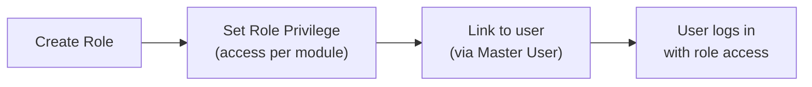
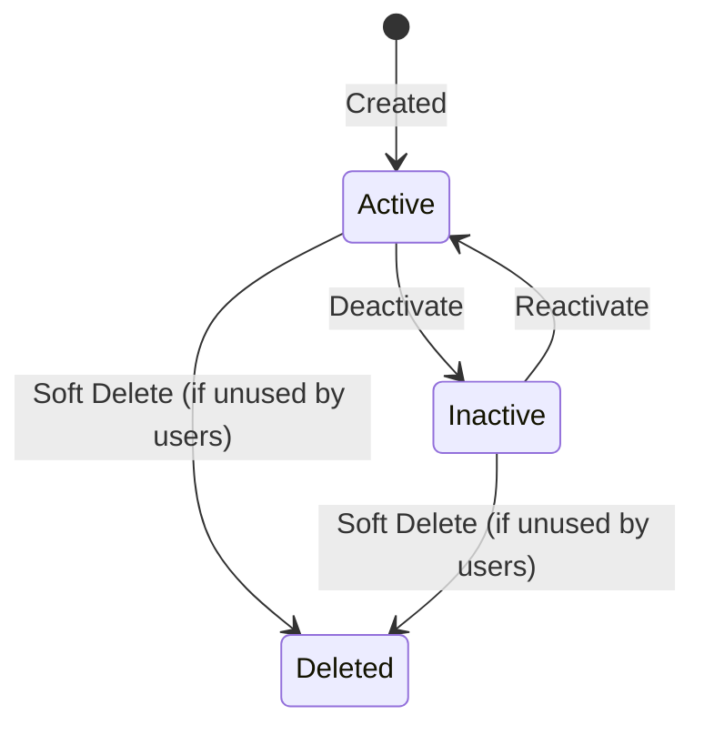
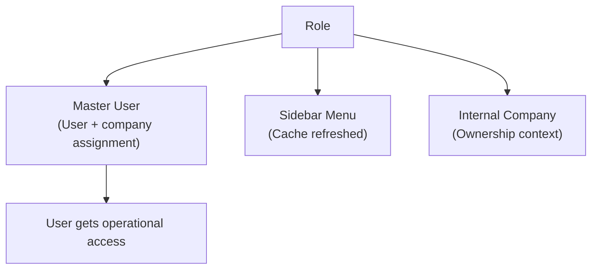

### 📦 Module/Feature: Role

**Business definition:**
**Role** defines an **access-rights bundle** (module → menu → access level) that is later linked to users through **Master User** — per **user + company** combination. System/IT admins use this menu to set up access structure.

⚠️ **Important:** The Role menu **only defines** access bundles. It does **not** link users to roles. User ↔ company ↔ role assignment is done in **Master User**, not here.

### 🔑 Key Terms

| Term | Meaning |
| :---- | :---- |
| **Role** | Role name plus active/inactive settings and whether it can be used by all companies. |
| **Role Privilege** | Per-menu access checkboxes (View/Add/Update/Delete/etc.). |
| **Module** | Sidebar menu group — e.g. Supply Chain, Human Resources. |
| **Show for All Company** | Setting so this role can be used by other companies, not only the company that created it. |
| **Role system** | Role provided directly by the system administrator — ordinary (tenant) companies generally cannot change its privileges. |
| **Assignment** | User ↔ company ↔ role link — managed in **Master User**, not in Role. |

### 🎯 When & Why to Use

Use when setting up a new access structure (for example a new job role), or when access policy needs to change (add/remove menu access for a group of users).

### 📋 Prerequisites

No other menu prerequisite is required — only access to the Role menu itself. Linking a role to a user needs **Master User**, but that is a later step, not a prerequisite before a Role can be created.

### 🔄 Place in the Access Management Flow

Roles are created and privileged here; linking to users happens in another menu.

**Steps:**

> 1. **Create Role** in the Role menu (name, description, Active, Show for All Company).
> 2. **Set Role Privilege** — check access per menu within each module.
> 3. **Link to user** via **Master User** (outside this Role menu).
> 4. **User logs in** with access matching the assigned role.

**Text fallback:** Create Role → set Role Privilege → link user in **Master User** → user logs in with that role’s access.

### 📍 Menu Location

* **Navigation:** General Settings → Developer Setting → Role
* **UI route:** `/gate/role`

🖼️ **[IMAGE PLACEHOLDER]** — Role list page with Role Name and Active columns.

### 🏷️ Status Lifecycle

| Status | Editable? | Notes |
| :---- | :---- | :---- |
| **Active** | Yes | Default on create; appears in the picker when linking users to roles. |
| **Inactive** | Yes | No longer appears for new assignments. **But** users already using this role **do not automatically log out or lose access** — see the current-behavior section. |
| **Deleted** | — | Soft delete; **rejected** if the role is still assigned to one or more users. |

### 👤 One User, One Role per Company

**Core rule:** within **one** company, a user may have only **one** role. If the user is registered in **more than one** company, they may have a **different** role in each company.

| Situation | What happens |
| :---- | :---- |
| User has never been registered in Company A | System creates a new link (company + role). |
| User is already in Company A with one role, then linked again to another role in the same Company A | The old role is **replaced** by the new one — **not** added as a second role. |
| User is registered in Company A **and** Company B | **Allowed**, and the role in A may differ from the role in B (two separate links). |

**Example:** Budi is registered as **Admin** at PT Alpha and as **Staff** at PT Beta. If Budi is then re-linked to the **Manager** role at PT Alpha, Budi still has only **one** role at PT Alpha (now Manager, no longer Admin) — the Staff role at PT Beta is unaffected.

### ⚙️ How to Use

#### Create a new Role

> 1. Open **Role** → **Create**.
> 2. Fill **Role Name** (required) and **Description** (optional).
> 3. Turn on **Active** (on by default) and **Show for All Company** if this role should be usable by all companies.
> 4. Click **Save & Review** to continue setting privileges, or **Save** to create and return to the list.

🖼️ **[IMAGE PLACEHOLDER]** — Create Role form with Role Name, Description, Active, and Show for All Company.

#### Set Role Privilege

> 1. Open the **Role Privilege** tab (available only after the role is saved — via Save & Review, or by reopening an existing role).
> 2. Select a **Module** on the left (e.g. Supply Chain, Human Resources).
> 3. Check **View** for each menu that may be accessed (required first so other access columns become selectable), then check Add/Update/Delete/Print/Approval as needed.
> 4. Use **Check All** to quickly check every menu in the active module.
> 5. Click **Save**.

🖼️ **[IMAGE PLACEHOLDER]** — Role Privilege tab with modules on the left and an access checkbox matrix (View/Add/Update/Delete/Print/Approval) on the right, plus Check All.

⚠️ **Before saving:** saving Role Privilege changes will **force-logout all users who use this role** — see the next section before doing this during peak hours.

### ⚠️ When Users Actually Auto-Logout

> ⚠️ **WARNING — the most important section before managing Role**

| Action | Do users on this role auto-logout? |
| :---- | :---- |
| Save changes on the **Role Privilege** tab (changing access rights) | **Yes — all users on this role are force-logged out (mass)** |
| Change name, description, or Active status via **Update** on the Role tab (not Role Privilege) | **No** — users stay logged in as usual |

This is **not a bug** — it is **confirmed official system behavior**. Mass logout is intentionally limited to real privilege changes so user sessions refresh to the latest access. Identity-only changes (name, description, active status) are not considered worth forcing logout.

**Practical implication:** if you need to force users on a role to “refresh” their login session (e.g. after a security incident), the effective way is to re-save on the **Role Privilege** tab — renaming the role alone **does not** trigger that effect.

### 📊 Field Reference

#### Header fields (Role tab)

| Field | Required? | Notes |
| :---- | :---- | :---- |
| **Role Name** | Yes | Max 50 characters. |
| **Description** | No | Max 150 characters. |
| **Active** | — (toggle) | On by default. |
| **Show for All Company** | — (toggle) | Off by default; shown only if this role belongs to the logged-in company (or the super/system company). |

#### Access levels on Role Privilege (per menu, within a module)

| Access type | When it appears / is active |
| :---- | :---- |
| **View** | Always available; **must** be checked first so other access columns for that menu become selectable. |
| **Add** | Appears if the menu supports create. |
| **Update** | Appears if the menu supports edit. |
| **Delete** | Appears if the menu supports delete. |
| **Print** | Appears if the menu supports print. |
| **Approval Level 1 to N** | Appears for menus that need approval — level count varies by menu. |

### 🛡️ Business Rules & Validations

* **If** Role Name is empty or longer than 50 characters, **then** the system rejects.
* **If** Description is longer than 150 characters, **then** the system rejects.
* **If** you turn on the “default/built-in role” marker without also turning on Show for All Company, **then** the system rejects — that marker is only allowed for roles usable by all companies.
* **If** you try to delete a role still assigned to one or more users, **then** the system rejects and shows that the role is already in use.
* **If** you turn Active off on a role still used by users, **then** it is allowed — the system does not check for active users still using it.
* **If** you turn off Show for All Company on a role already used by other companies, **then** it is not blocked — the system does not check whether other companies still use it.
* **If** you save changes on the Role Privilege tab, **then** all users logged in with this role are force-logged out (mass).
* **If** you save header changes (name/description/status) via Update, **then** users on this role **do not** log out.
* **If** you save Role Privilege without checking View on at least one menu in that module, **then** the system rejects — at least one View-checked menu is required per module save.
* **If** an ordinary company (not super/system) tries to change privileges on a system-provided role, **then** it is rejected — a message says the role is provided by the system administrator and cannot be changed.

### 📑 Multi-Level Approval: Level 1 to N, Not Always Two Levels

The number of approval levels available to check **varies by menu** — it is not always fixed at two. Some menus may have only one level; others may have two or more.

**Examples of menus that need two approval levels** (Human Resources area):

* Employee Payroll
* Propose Leave
* Propose Overtime

Most other menus that need approval (Accounting, Supply Chain, and similar) generally need only **one** approval level.

### 🏢 Access Limits Based on the Logged-In Company

**1. Ordinary companies can only set privileges within their own access boundary.**  
An ordinary company (not super/system) can only grant access to menus that are already part of that company’s primary user (master user) access. Super/system companies have no such limit — they can set access for every menu in the system.

**2. Ordinary companies cannot change privileges on system roles.**  
Roles provided directly by the system administrator (not created by a specific company) are **locked** for ordinary companies — they see a message that the role is provided by the system administrator for their company and cannot be changed.

### 📌 Current System Behavior Still Awaiting Decisions

> Note: this is the **current system baseline** until further business decisions. It is not a promise that the three items below will change soon.

#### 1. Role picker when linking users is not filtered yet

When linking a user to a role (in Master User), the role picker shows **all** active roles across the whole system — not yet limited to private (company-only) vs public (all-company) roles. Which rule should apply is still under discussion.

#### 2. Deactivating a role still used by users is not rejected

Admins **can** deactivate (Active OFF) a role even if it is still assigned to one or more users. Effect: the role no longer appears for new assignments, but users already using it **do not** auto-logout and can keep using their access as usual. Whether this should be rejected, or allowed with extra effects, is still under discussion.

#### 3. Turning off “usable by all companies” is not pre-checked

Turning off Show for All Company on a role **always succeeds** without checking whether other companies (outside the creator) still use that role. Whether it should be blocked when still used elsewhere is still under discussion.

### 🧩 Backend Features Without UI Yet

> Findings that are **not confirmed** as bugs — they may still be unfinished, or intentionally unused. Do not claim they will definitely be fixed or are definitely intentional.

#### 1. “Default/built-in role” marker with no form control

Behind the scenes, the system stores a “default/built-in role” marker (only one allowed system-wide) — but there is **no** button or control on the Role form to manage it. No other part of the system has been found that truly uses this marker during login or user assignment.

#### 2. “Process” access type with no checkbox

Behind the scenes, the system supports an extra access type named “Process” (conceptually similar to Add/Update), and some Human Resources menus are marked as needing it. But the Role Privilege UI **does not** show a checkbox for this type — every ordinary UI save leaves this access type empty.

### 🔗 Related Menus

| Menu | Role vs this menu |
| :---- | :---- |
| **Master User** | Where users are assigned to a Role per user + company; assigned users are mass-logged-out when that role’s privileges are saved. |
| **Sidebar Menu** | Sidebar menu list cache is refreshed after a role’s privileges are saved. |
| **Internal Company** | Company context that owns a role and limits which access that company can configure. |

### 🛠️ Troubleshooting

| Symptom | Cause | Solution |
| :---- | :---- | :---- |
| Role Privilege tab missing | Role not saved yet (still being created) | Save first (use Save & Review) before setting privileges. |
| Module menu list looks short | Logged in as an ordinary company (not super/system) | Normal — only a subset of that company’s primary-user access; contact admin if more is needed. |
| Message “this role is provided by the system administrator” | Trying to change a system role’s privileges as an ordinary company | Contact the system administrator if a change is truly needed. |
| Cannot delete role | Role still assigned to one or more users | Move those users to another role via Master User first. |
| Many users logout at once after an admin save | Normal — privilege changes were just saved on Role Privilege | Users simply log in again. |
| Users do not logout after the role name was changed | Intentional behavior — see auto-logout section | To force a session refresh, re-save on Role Privilege; do not only rename. |
| Roles from other companies appear when linking a user | Current system condition, still under discussion | No permanent fix yet; coordinate manually for now. |

### ❓ FAQ

* **Q: When do users auto-logout?**
  * **A:** Only when access-right changes are saved on the **Role Privilege** tab — not when changing name/status on the regular Role tab.
* **Q: Can one user have many roles?**
  * **A:** One role **per company**. If the user is registered in many companies, they may have a different role in each.
* **Q: What are Approval Level 1 and Level 2?**
  * **A:** Some menus (especially Human Resources) need multi-level approval — check the matching levels. Most other menus need only one level.
* **Q: Can I delete a role still used by users?**
  * **A:** No — the system rejects with a message that the role is already in use.
* **Q: Are there technical features with unclear purpose?**
  * **A:** Two: a default/built-in role marker with no UI control, and a “Process” access type with no checkbox — neither is confirmed as a bug.

### 📑 See Also

* **Master User** — user ↔ company ↔ role assignment
* **Sidebar Menu** — sidebar menu list and access cache
* **Internal Company** — company context and role ownership
