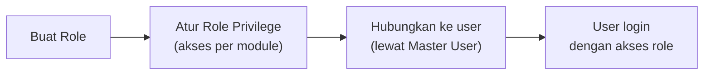
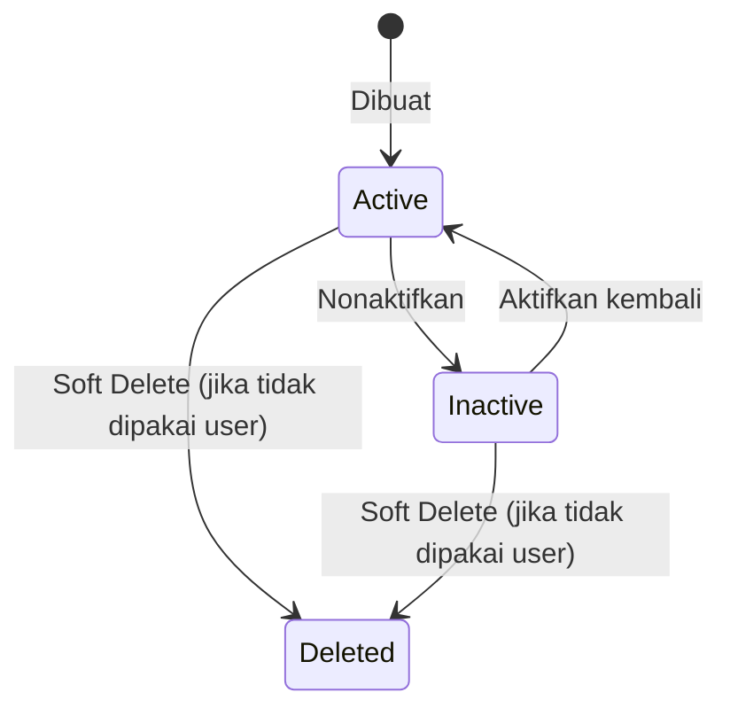
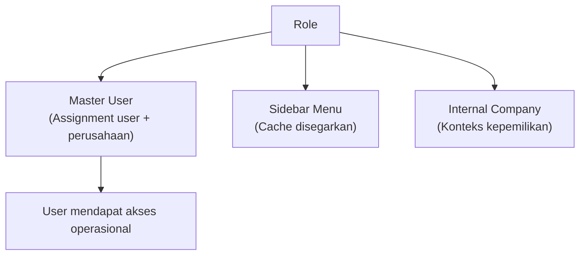

### 📦 Modul/Fitur: Role

**Definisi Bisnis:**
**Role** mendefinisikan **bundel hak akses** (module → menu → level akses) yang nantinya dihubungkan ke user lewat menu **Master User** — per kombinasi **user + perusahaan**. Menu ini dipakai oleh admin sistem/IT untuk menyiapkan struktur akses.

⚠️ **Penting:** Menu Role **hanya mendefinisikan** bundel akses. Menu ini **tidak** menghubungkan user ke role. Assignment user ↔ perusahaan ↔ role dilakukan di menu **Master User**, bukan di sini.

### 🔑 Istilah Kunci

| Istilah | Artinya |
| :---- | :---- |
| **Role** | Nama peran beserta pengaturan aktif/nonaktif dan apakah bisa dipakai semua perusahaan. |
| **Role Privilege** | Daftar centang akses per menu (Lihat/Tambah/Ubah/Hapus/dll.). |
| **Module** | Kelompok menu di sidebar aplikasi — misalnya Supply Chain, Human Resources. |
| **Show for All Company** | Pengaturan supaya role ini boleh dipakai perusahaan lain, bukan cuma perusahaan yang membuatnya. |
| **Role system** | Role yang disediakan langsung oleh administrator sistem — perusahaan biasa (tenant) umumnya tidak bisa mengubah hak aksesnya. |
| **Assignment** | Hubungan user ↔ perusahaan ↔ role — diatur di menu **Master User**, bukan di menu Role. |

### 🎯 Kapan & Kenapa Dipakai

Dipakai saat menyiapkan struktur hak akses baru (misalnya jabatan baru di perusahaan), atau saat kebijakan akses perlu diubah (menambah/mengurangi akses ke menu tertentu untuk sekelompok user).

### 📋 Prasyarat

Tidak ada prasyarat menu lain yang eksplisit — yang dibutuhkan hanyalah hak akses ke menu Role itu sendiri. Menghubungkan role ke user membutuhkan menu **Master User**, tapi itu langkah setelahnya, bukan prasyarat sebelum Role bisa dibuat.

### 🔄 Posisi dalam Alur Pengelolaan Akses

Role dibuat dan diprivilege di sini; menghubungkan ke user terjadi di menu lain.

**Keterangan langkah:**

> 1. **Buat Role** di menu Role (nama, deskripsi, Active, Show for All Company).
> 2. **Atur Role Privilege** — centang akses per menu dalam tiap module.
> 3. **Hubungkan ke user** lewat menu **Master User** (di luar menu Role ini).
> 4. **User login** dengan akses sesuai role yang ter-assign.

**Fallback teks:** Buat Role → atur Role Privilege → hubungkan ke user di **Master User** → user login dengan akses role-nya.

### 📍 Lokasi Menu

* **Navigasi:** General Settings → Developer Setting → Role
* **Route UI:** `/gate/role`

🖼️ **[IMAGE PLACEHOLDER]** — Halaman daftar Role dengan kolom Role Name dan Active.

### 🏷️ Siklus Status

| Status | Bisa diedit? | Catatan |
| :---- | :---- | :---- |
| **Active** | Ya | Bawaan saat dibuat; muncul di pilihan saat menghubungkan user ke role. |
| **Inactive** | Ya | Tidak muncul lagi sebagai pilihan untuk assignment baru. **Tapi** user yang sudah memakai role ini **tidak otomatis logout atau kehilangan akses** — detail di section perilaku sistem saat ini. |
| **Deleted** | — | Soft delete; **ditolak** kalau role masih ter-assign ke satu atau lebih user. |

### 👤 Satu User, Satu Role per Perusahaan

**Aturan inti:** dalam **satu** perusahaan, seorang user hanya boleh punya **satu** role. Kalau user terdaftar di **lebih dari satu** perusahaan, dia boleh punya role yang **berbeda** di tiap perusahaan.

| Situasi | Apa yang terjadi |
| :---- | :---- |
| User belum pernah terdaftar di Perusahaan A | Sistem membuat hubungan baru (perusahaan + role). |
| User sudah terdaftar di Perusahaan A dengan satu role, lalu dihubungkan lagi ke role lain di Perusahaan A yang sama | Role lamanya **diganti** oleh role baru — **bukan** ditambahkan sebagai role kedua. |
| User terdaftar di Perusahaan A **dan** Perusahaan B | **Boleh**, dan role di A boleh berbeda dari role di B (dua hubungan terpisah). |

**Contoh:** Budi terdaftar sebagai **Admin** di PT Alpha, dan sebagai **Staff** di PT Beta. Kalau Budi kemudian dihubungkan ulang ke role **Manager** di PT Alpha, maka Budi tetap hanya punya **satu** role di PT Alpha (sekarang Manager, bukan lagi Admin) — role Staff-nya di PT Beta tidak terpengaruh.

### ⚙️ Cara Penggunaan

#### Membuat Role baru

> 1. Buka menu **Role** → **Create**.
> 2. Isi **Role Name** (wajib) dan **Description** (opsional).
> 3. Nyalakan **Active** (bawaan sudah menyala) dan **Show for All Company** kalau role ini memang untuk dipakai semua perusahaan.
> 4. Klik **Save & Review** untuk langsung lanjut mengatur hak akses, atau **Save** untuk sekadar membuat lalu kembali ke daftar.

🖼️ **[IMAGE PLACEHOLDER]** — Form Create Role dengan field Role Name, Description, Active, dan Show for All Company.

#### Mengatur Role Privilege

> 1. Buka tab **Role Privilege** (hanya tersedia setelah role tersimpan — lewat Save & Review, atau membuka kembali role yang sudah ada).
> 2. Pilih **Module** di sisi kiri (misalnya Supply Chain, Human Resources).
> 3. Centang **View** untuk tiap menu yang boleh diakses (wajib dicentang dulu supaya kolom akses lain bisa dipilih), lalu centang Tambah/Ubah/Hapus/Cetak/Persetujuan sesuai kebutuhan.
> 4. Bisa pakai tombol **Check All** untuk mencentang cepat semua menu di module yang sedang aktif.
> 5. Klik **Save**.

🖼️ **[IMAGE PLACEHOLDER]** — Tab Role Privilege dengan daftar module di sisi kiri dan matriks kotak centang akses (View/Add/Update/Delete/Print/Approval) di sisi kanan, beserta tombol Check All.

⚠️ **Sebelum menyimpan:** menyimpan perubahan di tab Role Privilege akan **membuat semua user yang memakai role ini logout otomatis** — lihat section berikut sebelum melakukan ini di jam sibuk.

### ⚠️ Kapan User Benar-benar Logout Otomatis

> ⚠️ **WARNING — bagian paling penting sebelum mengelola Role**

| Aksi | Apakah user yang memakai role ini logout otomatis? |
| :---- | :---- |
| Menyimpan perubahan di tab **Role Privilege** (mengubah hak akses) | **Ya — semua user yang memakai role ini logout otomatis (massal)** |
| Mengubah nama, deskripsi, atau status Active lewat tombol **Update** di tab Role (bukan tab Role Privilege) | **Tidak** — user tetap login seperti biasa |

Ini **bukan bug** — ini **perilaku resmi sistem yang sudah dikonfirmasi**. Logout massal sengaja hanya terjadi saat hak akses (privilege) benar-benar berubah, supaya sesi user segera menyesuaikan ke akses terbaru. Perubahan identitas role (nama, deskripsi, status aktif) dianggap tidak perlu memaksa user logout.

**Implikasi praktis:** kalau Anda perlu memaksa user dengan role tertentu untuk "refresh" sesi login (misalnya setelah insiden keamanan), cara yang efektif adalah menyimpan ulang di tab **Role Privilege** — mengubah nama role saja **tidak** memicu efek itu.

### 📊 Referensi Field

#### Field header (tab Role)

| Field | Wajib? | Catatan |
| :---- | :---- | :---- |
| **Role Name** | Ya | Maksimal 50 karakter. |
| **Description** | Tidak | Maksimal 150 karakter. |
| **Active** | — (toggle) | Bawaan menyala. |
| **Show for All Company** | — (toggle) | Bawaan mati; hanya tampil kalau role ini milik perusahaan yang sedang login (atau perusahaan super/sistem). |

#### Jenis level akses di Role Privilege (per menu, dalam satu module)

| Jenis akses | Kapan muncul/aktif |
| :---- | :---- |
| **View** (Lihat) | Selalu tersedia; **wajib** dicentang dulu supaya kolom akses lain untuk menu itu bisa dipilih. |
| **Add** (Tambah) | Muncul kalau menu tersebut mendukung fitur tambah data. |
| **Update** (Ubah) | Muncul kalau menu tersebut mendukung fitur ubah data. |
| **Delete** (Hapus) | Muncul kalau menu tersebut mendukung fitur hapus data. |
| **Print** (Cetak) | Muncul kalau menu tersebut mendukung fitur cetak. |
| **Approval Level 1 sampai N** | Muncul untuk menu yang membutuhkan proses persetujuan — jumlah level berbeda-beda per menu. |

### 🛡️ Aturan Bisnis & Validasi

* **Jika** Role Name dikosongkan atau lebih dari 50 karakter, **maka** sistem menolak.
* **Jika** Description lebih dari 150 karakter, **maka** sistem menolak.
* **Jika** Anda menyalakan penanda "role bawaan/default" tanpa juga menyalakan Show for All Company, **maka** sistem menolak — penanda ini hanya boleh berlaku untuk role yang bisa dipakai semua perusahaan.
* **Jika** Anda mencoba menghapus role yang masih ter-assign ke satu atau lebih user, **maka** sistem menolak dan menampilkan pesan bahwa role ini sudah dipakai user.
* **Jika** Anda mematikan status Active pada role yang masih dipakai user, **maka** diizinkan — sistem tidak memeriksa apakah masih ada user aktif yang memakainya.
* **Jika** Anda mematikan Show for All Company pada role yang sudah dipakai perusahaan lain, **maka** tidak diblokir — sistem tidak memeriksa apakah perusahaan lain masih memakainya.
* **Jika** Anda menyimpan perubahan di tab Role Privilege, **maka** semua user yang login dengan role ini logout otomatis (massal).
* **Jika** Anda menyimpan perubahan header (nama/deskripsi/status) lewat tombol Update, **maka** user yang memakai role ini **tidak** logout.
* **Jika** Anda menyimpan tab Role Privilege tanpa mencentang View pada minimal satu menu di module tersebut, **maka** sistem menolak — minimal harus ada satu menu yang dicentang View per penyimpanan module.
* **Jika** perusahaan biasa (bukan perusahaan super/sistem) mencoba mengubah hak akses role yang disediakan administrator sistem, **maka** ditolak — muncul pesan bahwa role ini disediakan administrator sistem dan tidak bisa diubah.

### 📑 Persetujuan Bertingkat: Level 1 sampai N, Bukan Selalu Dua Tingkat

Jumlah tingkat persetujuan (approval) yang tersedia untuk dicentang **berbeda-beda tergantung menu** — bukan selalu tetap dua tingkat. Beberapa menu mungkin hanya punya satu tingkat, sementara menu lain bisa punya dua tingkat atau lebih.

**Contoh menu yang membutuhkan dua tingkat persetujuan** (area Sumber Daya Manusia):

* Employee Payroll (Penggajian Karyawan)
* Propose Leave (Pengajuan Cuti)
* Propose Overtime (Pengajuan Lembur)

Kebanyakan menu lain yang membutuhkan persetujuan (di area Akuntansi, Supply Chain, dan sejenisnya) umumnya hanya membutuhkan **satu** tingkat persetujuan.

### 🏢 Batasan Akses Berdasarkan Perusahaan yang Login

**1. Perusahaan biasa hanya bisa mengatur privilege dalam batas akses mereka sendiri.**  
Perusahaan biasa (bukan perusahaan super/sistem) hanya bisa memberi akses ke menu-menu yang memang jadi bagian dari akses pengguna utama (master user) di perusahaan itu sendiri. Perusahaan super/sistem tidak punya batasan ini — bisa mengatur akses ke seluruh menu yang ada di sistem.

**2. Role sistem tidak bisa diubah hak aksesnya oleh perusahaan biasa.**  
Role yang disediakan langsung oleh administrator sistem (bukan dibuat oleh satu perusahaan tertentu) **terkunci** hak aksesnya dari sudut pandang perusahaan biasa — mereka akan melihat pesan bahwa role ini disediakan oleh administrator sistem untuk perusahaan mereka, dan tidak bisa diubah.

### 📌 Perilaku Sistem Saat Ini yang Masih Menunggu Keputusan

> Catatan: ini **baseline perilaku sistem sekarang**, sampai ada keputusan bisnis lebih lanjut. Bukan janji bahwa ketiga hal berikut akan segera berubah.

#### 1. Daftar pilihan role saat menghubungkan user belum dibatasi

Saat menghubungkan user ke role (di menu Master User), daftar pilihan role menampilkan **semua** role aktif di seluruh sistem — belum dibatasi mana yang seharusnya hanya untuk perusahaan tertentu (privat) versus yang untuk semua perusahaan (publik). Masih jadi bahan diskusi soal aturan mana yang seharusnya berlaku.

#### 2. Menonaktifkan role yang masih dipakai user tidak ditolak

Admin **bisa** menonaktifkan (Active OFF) sebuah role meskipun role itu masih ter-assign ke satu atau lebih user. Efeknya: role itu tidak lagi muncul untuk assignment baru, tapi user yang sudah memakainya **tidak** otomatis logout dan tetap bisa menggunakan aksesnya seperti biasa. Masih jadi bahan diskusi apakah seharusnya ditolak, atau diizinkan dengan efek tambahan tertentu.

#### 3. Mematikan "boleh dipakai semua perusahaan" tidak dicek dulu

Mematikan Show for All Company pada sebuah role **selalu berhasil** tanpa sistem memeriksa dulu apakah perusahaan lain (di luar pembuatnya) masih memakai role tersebut. Masih jadi bahan diskusi apakah seharusnya diblokir kalau ternyata masih dipakai perusahaan lain.

### 🧩 Fitur Backend yang Belum Punya Tampilan

> Temuan yang **belum pasti** berstatus bug — bisa jadi belum selesai dikembangkan, bisa juga sengaja tidak dipakai. Jangan diklaim pasti akan diperbaiki atau pasti disengaja.

#### 1. Penanda "role bawaan/default" tanpa kontrol di tampilan

Di balik layar, sistem menyimpan penanda "role bawaan/default" (hanya boleh ada satu di seluruh sistem) — tapi **tidak ada** tombol atau kontrol di tampilan form Role untuk mengatur penanda ini. Belum ditemukan bagian lain dari sistem yang benar-benar memakai penanda ini saat proses login atau assignment user.

#### 2. Jenis akses "Process" tanpa kotak centang

Di balik layar, sistem mendukung jenis akses tambahan bernama "Process" (mirip konsepnya dengan Tambah/Ubah), dan beberapa menu di area Sumber Daya Manusia memang ditandai membutuhkan akses jenis ini. Tapi tampilan Role Privilege **tidak** menampilkan kotak centang untuk jenis akses ini — setiap kali disimpan lewat tampilan biasa, nilai untuk jenis akses ini selalu kosong.

### 🔗 Hubungan dengan Menu Lain

| Menu | Perannya terhadap Role |
| :---- | :---- |
| **Master User** | Tempat menghubungkan (assign) user ke Role, per kombinasi user + perusahaan; user yang terhubung terdampak logout massal saat hak akses role disimpan. |
| **Sidebar Menu** | Daftar menu di sidebar ikut disegarkan (cache) setelah hak akses role disimpan. |
| **Internal Company** | Konteks perusahaan yang menentukan kepemilikan sebuah role, dan batasan akses mana yang bisa diatur perusahaan tersebut. |

### 🛠️ Troubleshooting

| Gejala | Penyebab | Solusi |
| :---- | :---- | :---- |
| Tab Role Privilege tidak muncul | Role belum tersimpan (masih dalam proses pembuatan) | Simpan dulu (pakai Save & Review) sebelum mengatur privilege. |
| Daftar menu di module terlihat sedikit | Login sebagai perusahaan biasa (bukan super/sistem) | Normal — hanya subset dari akses pengguna utama perusahaan tersebut; hubungi admin kalau perlu tambahan. |
| Muncul pesan "role ini disediakan administrator sistem" | Mencoba mengubah hak akses role sistem sebagai perusahaan biasa | Hubungi administrator sistem kalau memang perlu perubahan. |
| Gagal menghapus role | Role masih ter-assign ke satu atau lebih user | Alihkan dulu user tersebut ke role lain lewat Master User. |
| Banyak user logout bersamaan setelah admin menyimpan sesuatu | Normal — perubahan hak akses baru disimpan di tab Role Privilege | User cukup login ulang. |
| User tidak logout meski nama role baru saja diganti | Perilaku yang disengaja — lihat section logout otomatis | Kalau perlu memaksa refresh sesi, simpan ulang di tab Role Privilege, bukan sekadar ubah nama. |
| Role dari perusahaan lain muncul saat menghubungkan user ke role | Kondisi sistem saat ini, masih dalam diskusi | Belum ada solusi permanen; koordinasikan secara manual sementara ini. |

### ❓ FAQ

* **Q: Kapan user logout otomatis?**
  * **A:** Hanya saat perubahan hak akses disimpan di tab **Role Privilege** — bukan saat mengubah nama/status di tab Role biasa.
* **Q: Bisa satu user punya banyak role?**
  * **A:** Satu role **per perusahaan**. Kalau user terdaftar di banyak perusahaan, boleh punya role berbeda di tiap perusahaan.
* **Q: Apa itu Approval Level 1 dan Level 2?**
  * **A:** Beberapa menu (terutama Sumber Daya Manusia) membutuhkan persetujuan bertingkat — centang level yang sesuai. Menu lain kebanyakan hanya butuh satu tingkat.
* **Q: Bisa menghapus role yang masih dipakai user?**
  * **A:** Tidak — sistem menolak dengan pesan bahwa role tersebut sudah dipakai user.
* **Q: Ada fitur teknis yang belum jelas fungsinya?**
  * **A:** Ada dua: penanda role bawaan/default tanpa kontrol di tampilan, dan jenis akses "Process" tanpa kotak centang — keduanya belum pasti berstatus bug.

### 📑 Lihat Juga

* **Master User** — assignment user ↔ perusahaan ↔ role
* **Sidebar Menu** — daftar menu sidebar dan cache akses
* **Internal Company** — konteks perusahaan dan kepemilikan role
