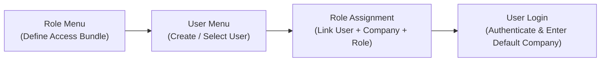
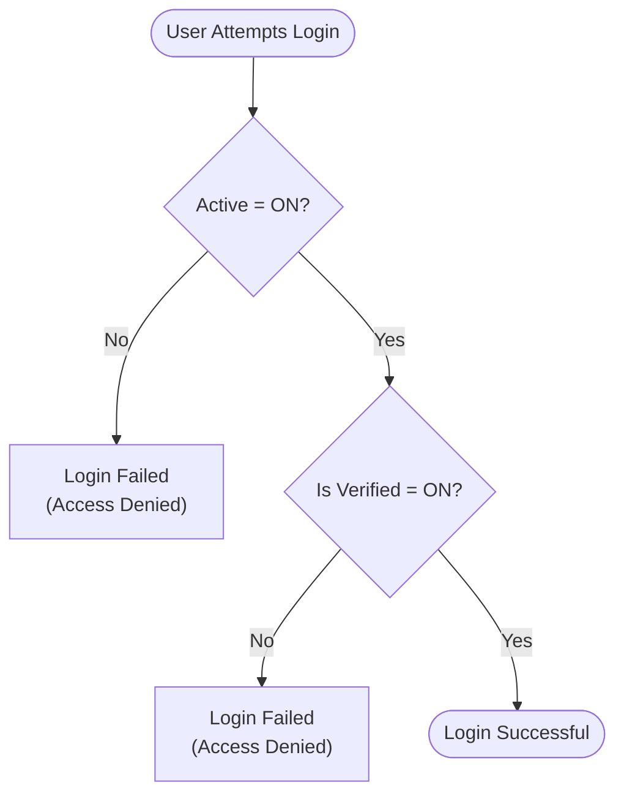
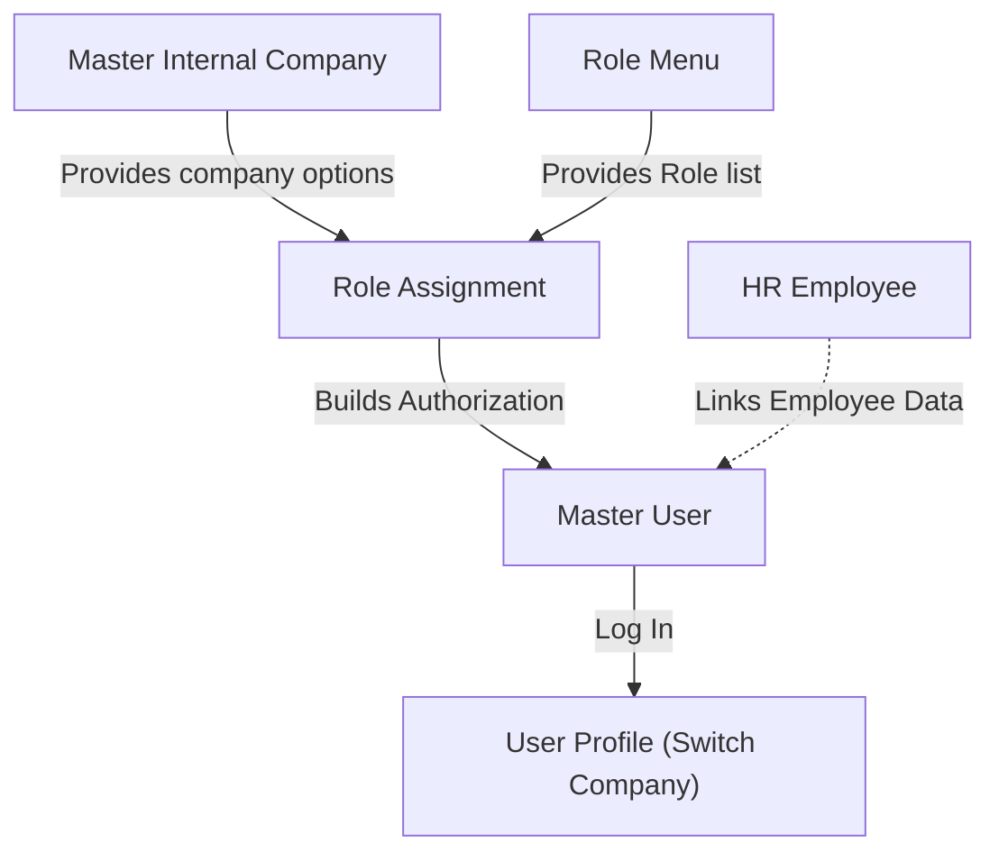

### 📦 Module/Feature: Master User (User Gate)

**Business definition:**
**Master User** is the core Gate module (**General Settings → Developer Setting**) in OlshopERP for managing user accounts, identity, login credentials, and access mapping to one or more business entities.

It bridges a **User** account to access bundles configured in **Role**. While Role *defines* permission groups, Master User *links* users to one or more Roles via internal company combinations (**Internal Company**). This module is intended for System Administrators and IT Admin teams.

### 🔑 Key Terms

| Term | Definition & system role |
| :---- | :---- |
| **Role Assignment** | A mapping row that links one user account to a specific Internal Company and **Role**. |
| **Default Company** | The primary company auto-selected at login when the user has access to more than one company. |
| **Active** | Main account active toggle. Must be **ON** for the user to enter the system. |
| **Is Verified** | Account verification toggle. Must be **ON** to log in; secondary security gate. |
| **Show for All Company** | Visibility setting for whether the user profile can be seen by other company entities (public). |
| **Allow Multi-Device Login** | Session license that allows the same account to stay logged in on more than one device/browser. |
| **Assigned Employee** | Link column reflecting the relationship between the user account and an **HR Employee** profile. |

### 🎯 When & Why to Use

* **New employee onboarding:** Register a login account, set initial credentials, and configure company access plus role.
* **Transfer / access change:** Add, change, or revoke **Role Assignment** on promotion, division move, or responsibility change.
* **Termination / access block:** Freeze login access instantly or long-term for security threats or employment end.

### 📋 Prerequisites

| Prerequisite | Source module | Dependency notes |
| :---- | :---- | :---- |
| Role definition | **Gate → Role** | At least one active **Role** for **Role Assignment**. |
| Internal company data | **Master Internal Company** | Target company entities must exist and be active. |

### 🔄 Place in the Access Management Flow

Access rights are defined in **Role** → account create/select in **User** → link Company + **Role** (**Role Assignment**) → user logs in with automatic **Default Company**.

**Steps:**

> 1. **Define Role:** IT sets privileges on the Role menu.
> 2. **Register User:** Admin creates the user identity in Master User.
> 3. **Role Assignment:** Admin maps the user to one or more Company + Role combinations.
> 4. **Login:** User authenticates; the system validates status gates and routes to **Default Company**.

### 📍 Menu Location

* **Navigation path:** Setting → User
* **UI route:** `/gate/user`

🖼️ **[IMAGE PLACEHOLDER]** — User list with Name, Username, Email, and Active — no Delete button in Action.

**UI structure note:** The Master User list consistently **does not provide a Delete button**, to protect audit-trail integrity.

### ⚠️ Two Gates Must Be Open to Log In

OlshopERP authorization uses two authentication layers. For a successful login, **both status gates must be ON**.

**Steps:**

> 1. The system checks **Active**. If OFF, authentication stops.
> 2. If **Active** is ON, it checks **Is Verified**. If OFF, login is still rejected.
> 3. If both gates are ON, the user may enter.

| Status gate | Effect if OFF | Practical use |
| :---- | :---- | :---- |
| **Active** | Login fails | Permanent or long-term deactivation (e.g. resigned employee or unpaid leave). |
| **Is Verified** | Login fails | Emergency/temporary block **without removing** **Role Assignment** history. When turned back ON, access mapping returns without reconfiguration. |

> ⚠️ **WARNING: BOTH GATES MUST BE ON**  
> Either gate OFF (**Active** or **Is Verified**) rejects login completely, even with a correct username and password.

### ⚙️ How to Use

#### A. Create a new User

> 1. Go to **Setting → User**, then click **Create**.
> 2. Fill **First Name**, **Last Name**, **Email**, **Username**, **Password**, and **Re-type Password**.

🖼️ **[IMAGE PLACEHOLDER]** — Create User form with identity, credentials, and Active/Is Verified/Show for All Company/Allow Multi-Device Login toggles.

> 3. Configure status controls:
>    * **Active:** Leave **ON**.
>    * **Is Verified:** Leave **ON**.
>    * **Show for All Company:** Match visibility needs.
>    * **Allow Multi-Device Login:** Off or on per security policy.
> 4. Upload a profile photo under **Upload Image** (optional).
> 5. Click **Save & Next** to save identity and open **Role Assignment**.

#### B. Role Assignment

> 1. In the **Role Assignment** table, pick an active **Company**.
> 2. Pick the **Role** for that company.

🖼️ **[IMAGE PLACEHOLDER]** — Role Assignment table with Company, Role, and Is Default Company toggle.

> 3. *(Optional)* Turn on **Is Default Company** if this entity should be the primary company at login.
> 4. Click **Save** to store the mapping row.
> 5. Repeat steps 1–4 for additional internal companies.

#### C. Edit or deactivate a User

* **Temporary access block:** Open the user, set **Is Verified** to **OFF**, save.
* **Long-term deactivation:** Set **Active** to **OFF**, or use *Bulk Action Deactivate* on the list.
* **Change Default Company:** On **Role Assignment**, turn on **Is Default Company** for the new target. The previous default clears automatically.
* **Revoke company access:** Delete the related **Role Assignment** row (not while it is the active **Default Company**).

### 👤 One User, Many Companies, Different Roles Allowed

One **User** account can map to **several Internal Companies** at once, each with a different **Role**.

**Example:**

* User A → Company 1 (Role: Finance Manager)
* User A → Company 2 (Role: Warehouse Staff)

> **Single-role restriction:** A user may have **exactly one active Role within the same company**. Two dedicated roles on the same company are not allowed.

### 🏢 Default Company: How the System Picks It

> 1. **Default mutex (mutual exclusion):** Turning on **Is Default Company** on one **Role Assignment** row automatically clears default on all other rows for that user. Exactly **one** **Default Company** stays active.
> 2. **Auto-set first row:** If the user has **no** **Default Company** yet, and Admin adds a **Role Assignment** without checking **Is Default Company**, the system **automatically sets** that new row as **Default Company**.

> 🛑 **HARD RULE: CANNOT DELETE DEFAULT COMPANY**  
> A **Role Assignment** row marked **Default Company** **cannot be deleted** directly. First move **Default Company** to another company row, or block with **Is Verified = OFF**.

### 📊 Field Reference

#### A. User Information

| Field | Required? | Default | Constraints & rules |
| :---- | :---- | :---- | :---- |
| **First Name** | Yes | — | Max 50 characters. |
| **Last Name** | Yes | — | Max 50 characters. |
| **Email** | Yes | — | Valid email, unique system-wide, max 50 characters. |
| **Username** | Yes | — | Unique system-wide; alphanumeric plus underscore (_) and hyphen (-); max 50 characters. |
| **Password** | Yes (on Create) | — | Required on first registration. |
| **Re-type Password** | Yes (on Create) | — | Must match **Password**; minimum 8 characters. |
| **Description** | No | — | Free text, max 150 characters. |
| **Active** | Yes (toggle) | **ON** | General account active status. |
| **Is Verified** | Yes (toggle) | **ON** | Secondary login authorization status. |
| **Assign to Employee** | No (toggle) | **OFF (Locked)** | **Read-only / disabled.** Cannot change from User. Linked automatically from **HR Employee**. |
| **Show for All Company** | Yes (toggle) | **OFF** | Cross-company profile visibility. |
| **Allow Multi-Device Login** | Yes (toggle) | **OFF** | Concurrent multi-device login limit. |
| **Upload Image** | No | — | Supported image extensions with standard size limits. |

#### B. Role Assignment

| Field | Required? | Constraints & rules |
| :---- | :---- | :---- |
| **Company** | Yes | Active **Master Internal Company** dropdown. |
| **Role** | Yes | Active **Role** dropdown. |
| **Is Default Company** | Yes (toggle) | Sets the initial business entity at login. Follows Default Company automation rules. |

### 🛡️ Business Rules & Validations

* **If** Email is already registered on another user, **then** save is rejected with a duplicate error.
* **If** Username is already used, **then** registration is rejected.
* **If** Re-type Password does not match Password, **then** the form is blocked.
* **If** you try to log in with **Active** = OFF, **then** authentication is rejected.
* **If** you try to log in with **Is Verified** = OFF, **then** authentication is rejected.
* **If** you try to delete a **Role Assignment** row marked **Is Default Company**, **then** delete is hidden/blocked.
* **If** you mark **Is Default Company** on a new company mapping, **then** the previous default is cleared automatically.
* **If** you add a **Role Assignment** for a user with no default and leave the default toggle off, **then** the system auto-sets that new mapping as **Default Company**.
* **If** privileges on a **Role** are changed in the Role module, **then** the system force-logs out all users on that role.
* **If** you try to change **Role Assignment** on your own currently logged-in account, **then** the system rejects it for security.

### ⚠️ When Login Sessions Actually Stop (Force Logout)

Config changes can trigger force logout. Response speed **varies by trigger**:

| Trigger | Users affected | Session response speed |
| :---- | :---- | :---- |
| **Role Assignment** change on a specific user | That user only | **Instant / real-time**. Asked to log in again immediately. |
| **Role Privilege** change in Role module | All users on that Role | **Instant mass logout**. All related users are kicked together. |
| **Is Verified** or **Active** set to **OFF** | That user only | **Not instant (delayed check)**. Session ends on the next navigation / page request. |

> ⚠️ **WARNING: DEACTIVATION EFFECT IS DELAYED**  
> Turning off **Is Verified** or **Active** does not immediately cut the active session. Status is checked on the next page request. If the user stays on the same page, it can remain visible until the next navigation.

### 📱 Multi-Device Login: One Session vs Many

* **Default mode (OFF):** Only **one active session**. Login on a new device/browser ends the previous session.
* **Open mode (ON):** Multiple parallel sessions across devices are allowed without ending each other.

### 💡 "Assign to Employee" Visible but Not Clickable

> 💡 **NOTE: SYSTEM DESIGN BEHAVIOR**  
> The **Assign to Employee** toggle on the **User** form is locked (*disabled*) and cannot be changed interactively. This is **not a bug** — it is integrated design (*by design*).  
> Linking a user account to an employee profile is done in **HR Employee**. The **Assigned Employee** column on the Master User list is a mirror indicator. If not linked from HR yet, the system shows a dash (-).

### 🗑️ Deleting a User: Not Available in the UI

The system **does not provide a Delete button** for Master User, per row or bulk.  
If an account should no longer be used, Administrators must:

* Set **Is Verified = OFF** for temporary suspension.
* Set **Active = OFF** for long-term deactivation.

### 📌 Current System Behavior Still Awaiting Decisions

> Current baseline behavior — not a promise of change.

#### 1. Cross-company Role picker scope

On **Role Assignment**, the **Role** dropdown lists all active roles in the system without limiting ownership to a specific company. *Aligned with the role-scope issue discussed in Role documentation.*

#### 2. Cross-company visibility validation

**Show for All Company** can be turned off anytime without checking whether the user profile is already used or processed by another company entity.

#### 3. Password length validation path

The minimum password length rule (at least 8 characters) on new-user create is enforced via **Re-type Password**, not directly on the main **Password** field. Functionally it still requires 8+ characters, but the error message can be unclear.

### 🔗 Related Menus

| Module | Role vs Master User |
| :---- | :---- |
| **Role** | Defines access bundles; role config changes trigger mass logout of related users. |
| **Internal Company** | Supplies internal companies for **Role Assignment**. |
| **HR Employee** | Source for linking employee profiles to **User** accounts. |
| **User Profile** | End-user UI to *Switch Company* from the user’s **Role Assignment** list. |

### 🛠️ Troubleshooting

| Symptom | Likely cause | What to do |
| :---- | :---- | :---- |
| Cannot log in even though **Active** is ON. | **Is Verified** is OFF. | Set **Is Verified** ON, then save. |
| Company row on **Role Assignment** cannot be deleted. | That row is the active **Default Company**. | Move **Default Company** to another row first, then delete. |
| Unexpected logout. | **Role Privilege** update, **Role Assignment** change, or another device login (Multi-Device OFF). | Log in again. This is standard security behavior. |
| Error when Admin edits access on their own account. | Users cannot change their own **Role Assignment**. | Use another equivalent Administrator account. |
| **Assigned Employee** shows only a dash (-). | Not linked from the employee form yet. | Open **HR Employee**, select the employee, link to this user. |
| Deactivated user can still click menus briefly. | Deactivation session check is delayed. | Auto-logout happens on the next menu click or page change. |

### ❓ FAQ

* **Q: Why can’t an Active user still get in?**
  * **A:** **Is Verified** must also be ON. Both gates are required, plus at least one valid **Role Assignment**.
* **Q: How do I revoke access without deleting Role Assignment history?**
  * **A:** Set **Is Verified** to OFF. Blocks login without breaking company/role configuration.
* **Q: Why can’t I delete the Default Company row?**
  * **A:** Default Company is the initial authorization anchor. At least one active default entity is required.
* **Q: Why do users get sudden logouts?**
  * **A:** Often because Admin updated **Role Privilege**, changed that user’s **Role Assignment**, or someone logged in elsewhere with Multi-Device OFF.
* **Q: Can a user have different Roles per company?**
  * **A:** Yes, via multiple **Role Assignment** rows.
* **Q: Why can’t I click Assign to Employee?**
  * **A:** It is system-managed. Linking is done only through **HR Employee**.

### 📑 See Also

* **Role (Gate)** — access-bundle / authorization definition
* **Master Internal Company** — internal company entities
* **HR Employee** — link employee profiles to user accounts
* **User Profile & Switch Company** — switch between companies
