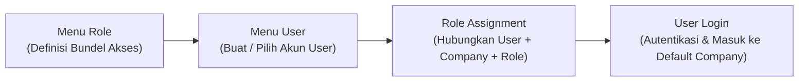
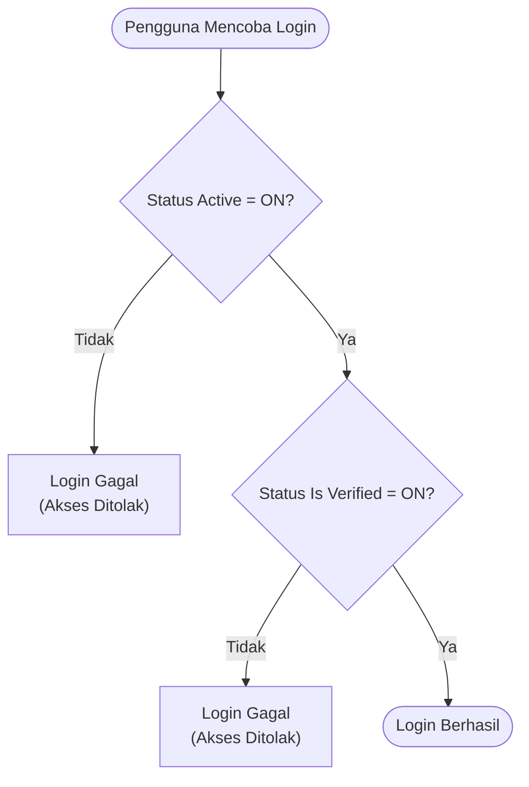
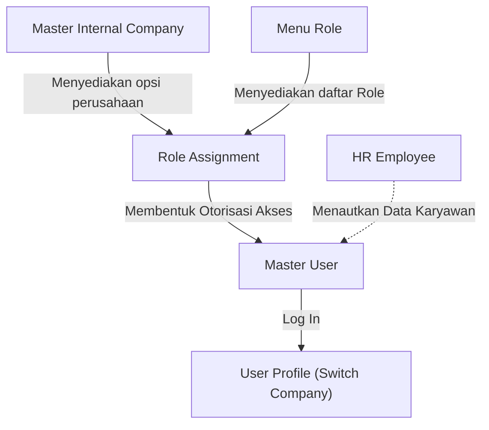

### 📦 Modul/Fitur: Master User (User Gate)

**Definisi Bisnis:**
**Master User** adalah modul inti pada domain **Gate (General Settings → Developer Setting)** di OlshopERP yang mengelola akun pengguna (user account), identitas, kredensial login, dan pemetaan hak akses ke satu atau beberapa entitas bisnis.

Menu ini bertindak sebagai jembatan yang menghubungkan akun **User** dengan bundel hak akses yang dikonfigurasi pada menu **Role**. Sementara menu Role *mendefinisikan* grup izin akses, menu Master User *menghubungkan* pengguna ke satu atau beberapa Role berdasarkan kombinasi perusahaan internal (**Internal Company**). Pengelolaan modul ini dikhususkan bagi Administrator Sistem dan Tim IT Administrator.

### 🔑 Istilah Kunci

| Istilah | Definisi & fungsi sistem |
| :---- | :---- |
| **Role Assignment** | Baris konfigurasi yang menghubungkan satu akun user ke Perusahaan Internal dan **Role** tertentu. |
| **Default Company** | Perusahaan utama yang otomatis dipilih sistem saat pengguna login, jika pengguna punya akses ke lebih dari satu perusahaan. |
| **Active** | Toggle status keaktifan akun utama. Harus **ON** agar pengguna dapat masuk ke sistem. |
| **Is Verified** | Toggle status verifikasi akun. Harus **ON** agar pengguna dapat login; gerbang keamanan sekunder. |
| **Show for All Company** | Pengaturan visibilitas apakah data profil user dapat dilihat oleh entitas perusahaan lain (bersifat publik). |
| **Allow Multi-Device Login** | Pengaturan yang mengizinkan akun user login aktif bersamaan di lebih dari satu perangkat/peramban. |
| **Assigned Employee** | Kolom penautan yang mencerminkan hubungan antara akun user dan data profil karyawan pada modul **HR Employee**. |

### 🎯 Kapan & Kenapa Dipakai

* **Onboarding karyawan baru:** Mendaftarkan akun login baru, menetapkan kredensial awal, dan mengonfigurasi akses perusahaan beserta role.
* **Rotasi mutasi & perubahan akses:** Mengubah, menambah, atau mencabut **Role Assignment** saat promosi, perpindahan divisi, atau perubahan tanggung jawab.
* **Terminasi / pemblokiran akses:** Membekukan akses login secara instan atau permanen saat ancaman keamanan atau pemutusan hubungan kerja.

### 📋 Prasyarat

| Prasyarat | Sumber modul | Catatan dependensi |
| :---- | :---- | :---- |
| Definisi Role | **Gate → Role** | Minimal satu **Role** berstatus aktif untuk dipilih di **Role Assignment**. |
| Data Perusahaan Internal | **Master Internal Company** | Entitas perusahaan target sudah terdaftar dan berstatus aktif. |

### 🔄 Posisi dalam Alur Pengelolaan Akses

Konfigurasi hak akses dibuat di **Role** → pembuatan/pemilihan akun di **User** → penautan kombinasi Perusahaan + **Role** (**Role Assignment**) → pengguna login dengan **Default Company** otomatis.

**Keterangan langkah:**

> 1. **Definisi Role:** Tim IT menyusun daftar izin akses (*privileges*) pada menu Role.
> 2. **Registrasi User:** Admin membuat identitas pengguna di menu Master User.
> 3. **Role Assignment:** Admin memetakan user ke satu atau lebih kombinasi Perusahaan dan Role.
> 4. **Autentikasi Login:** Pengguna login; sistem memvalidasi gerbang status dan mengarahkan ke **Default Company**.

### 📍 Lokasi Menu

* **Path navigasi:** Setting → User
* **Route UI:** `/gate/user`

🖼️ **[IMAGE PLACEHOLDER]** — Halaman daftar User dengan kolom Name, Username, Email, dan Active — tanpa tombol Hapus di kolom Action.

**Catatan struktur UI:** Pada tabel daftar Master User, sistem secara konsisten **tidak menyediakan tombol Hapus** (Delete Action) untuk menjaga integritas jejak audit (*audit trail*).

### ⚠️ Dua Gerbang yang Wajib Terbuka Supaya Bisa Login

Sistem otorisasi OlshopERP menerapkan kontrol autentikasi dua lapis. Agar pengguna berhasil login, **kedua gerbang status wajib ON**.

**Keterangan langkah:**

> 1. Sistem mengecek status **Active**. Jika OFF, autentikasi langsung dihentikan.
> 2. Jika **Active** ON, sistem mengecek **Is Verified**. Jika OFF, login tetap ditolak.
> 3. Jika kedua gerbang ON, pengguna diizinkan masuk.

| Gerbang status | Dampak jika OFF | Kasus penggunaan praktis |
| :---- | :---- | :---- |
| **Active** | Login gagal | Nonaktifkan akun secara permanen atau jangka panjang (contoh: karyawan *resign* atau cuti di luar tanggungan). |
| **Is Verified** | Login gagal | Pemblokiran login darurat/sementara **tanpa menghapus** histori **Role Assignment**. Saat diaktifkan kembali, pemetaan akses langsung pulih tanpa diset ulang. |

> ⚠️ **WARNING: KEDUA GERBANG WAJIB ON**  
> Kegagalan salah satu gerbang (**Active** = OFF atau **Is Verified** = OFF) menyebabkan login ditolak sepenuhnya, meskipun nama pengguna dan kata sandi benar.

### ⚙️ Cara Penggunaan

#### A. Membuat User baru

> 1. Navigasi ke **Setting → User**, lalu klik **Create**.
> 2. Lengkapi formulir: **First Name**, **Last Name**, **Email**, **Username**, **Password**, dan **Re-type Password**.

🖼️ **[IMAGE PLACEHOLDER]** — Form Create User dengan field identitas, kredensial, dan toggle Active/Is Verified/Show for All Company/Allow Multi-Device Login.

> 3. Konfigurasi kontrol status:
>    * **Active:** Biarkan **ON**.
>    * **Is Verified:** Biarkan **ON**.
>    * **Show for All Company:** Sesuaikan kebutuhan visibilitas.
>    * **Allow Multi-Device Login:** Matikan atau nyalakan sesuai kebijakan keamanan.
> 4. Unggah foto profil pada **Upload Image** (opsional).
> 5. Klik **Save & Next** untuk menyimpan identitas dan masuk ke panel **Role Assignment**.

#### B. Melakukan Role Assignment

> 1. Pada tabel **Role Assignment**, pilih **Company** dari daftar perusahaan internal yang aktif.
> 2. Pilih **Role** yang akan dialokasikan untuk perusahaan tersebut.

🖼️ **[IMAGE PLACEHOLDER]** — Tabel Role Assignment dengan pilihan Company, Role, dan toggle Is Default Company.

> 3. *(Opsional)* Nyalakan **Is Default Company** jika entitas ini ditargetkan sebagai perusahaan utama saat login.
> 4. Klik **Save** untuk menyimpan baris pemetaan.
> 5. Ulangi langkah 1–4 jika pengguna membutuhkan akses ke perusahaan internal lainnya.

#### C. Mengedit atau menonaktifkan User

* **Pemblokiran akses sementara:** Buka data user, ubah **Is Verified** menjadi **OFF**, lalu simpan.
* **Penonaktifan akun permanen:** Ubah **Active** menjadi **OFF**, atau gunakan *Bulk Action Deactivate* pada halaman tabel utama.
* **Pengalihan Default Company:** Buka tab **Role Assignment**, aktifkan **Is Default Company** pada entitas target baru. Status default pada entitas lama dialihkan otomatis.
* **Pencabutan akses perusahaan:** Hapus baris **Role Assignment** terkait (dengan catatan baris tersebut bukan **Default Company** aktif).

### 👤 Satu User, Banyak Perusahaan, Role Boleh Berbeda

Satu akun **User** dapat dipetakan ke **beberapa Perusahaan Internal** sekaligus dengan jenis **Role** yang berbeda di masing-masing perusahaan.

**Contoh:**

* User A → Perusahaan 1 (Role: Finance Manager)
* User A → Perusahaan 2 (Role: Warehouse Staff)

> **Aturan restriksi tunggal:** Satu pengguna **hanya diperbolehkan memiliki tepat satu Role aktif dalam satu entitas Perusahaan yang sama**. Pengguna tidak dapat memiliki dua Role pada entitas perusahaan yang sama.

### 🏢 Default Company: Bagaimana Sistem Menentukannya

> 1. **Aturan mutex (mutual exclusion) default:** Mengaktifkan **Is Default Company** pada sebuah baris **Role Assignment** otomatis mematikan status default pada seluruh baris lain milik user tersebut. Hanya ada tepat **satu** **Default Company** aktif.
> 2. **Aturan penetapan otomatis baris pertama:** Apabila pengguna **belum memiliki** **Default Company**, dan Admin menambahkan baris **Role Assignment** baru tanpa menandai **Is Default Company**, sistem **otomatis menetapkan** baris baru tersebut sebagai **Default Company**.

> 🛑 **HARD RULE: RESTRIKSI HAPUS DEFAULT COMPANY**  
> Baris **Role Assignment** yang berstatus **Default Company** **tidak dapat dihapus** secara langsung. Untuk menghapusnya, Admin harus mengalihkan **Default Company** ke baris perusahaan lain terlebih dahulu, atau menggunakan pemblokiran **Is Verified = OFF**.

### 📊 Referensi Field

#### A. User Information

| Field | Wajib? | Default | Constraints & aturan |
| :---- | :---- | :---- | :---- |
| **First Name** | Ya | — | Maks. 50 karakter. |
| **Last Name** | Ya | — | Maks. 50 karakter. |
| **Email** | Ya | — | Format email valid, unik di seluruh sistem, maks. 50 karakter. |
| **Username** | Ya | — | Unik di seluruh sistem; alfanumerik plus underscore (_) dan hyphen (-); maks. 50 karakter. |
| **Password** | Ya (saat Create) | — | Wajib diisi saat pendaftaran awal. |
| **Re-type Password** | Ya (saat Create) | — | Wajib identik dengan **Password**, minimal 8 karakter. |
| **Description** | Tidak | — | Teks bebas, maks. 150 karakter. |
| **Active** | Ya (toggle) | **ON** | Status keaktifan akun secara umum. |
| **Is Verified** | Ya (toggle) | **ON** | Status otorisasi login sekunder. |
| **Assign to Employee** | Tidak (toggle) | **OFF (Locked)** | **Read-only / disabled.** Tidak dapat diubah dari menu User. Ditautkan otomatis dari **HR Employee**. |
| **Show for All Company** | Ya (toggle) | **OFF** | Visibilitas profil user lintas perusahaan. |
| **Allow Multi-Device Login** | Ya (toggle) | **OFF** | Batasan login bersamaan di beberapa perangkat. |
| **Upload Image** | Tidak | — | Ekstensi gambar yang didukung dengan batas ukuran standar. |

#### B. Role Assignment

| Field | Wajib? | Constraints & aturan |
| :---- | :---- | :---- |
| **Company** | Ya | Dropdown **Master Internal Company** berstatus aktif. |
| **Role** | Ya | Dropdown **Role** berstatus aktif. |
| **Is Default Company** | Ya (toggle) | Menentukan entitas bisnis awal saat login. Mengikuti aturan otomatisasi Default Company. |

### 🛡️ Aturan Bisnis & Validasi

* **Jika** Email sudah terdaftar pada akun user lain, **maka** sistem menolak penyimpanan dengan pesan duplikasi.
* **Jika** Username sudah digunakan pengguna lain, **maka** sistem menolak pendaftaran.
* **Jika** Re-type Password tidak identik dengan Password, **maka** sistem memblokir formulir.
* **Jika** Anda mencoba login dengan **Active** = OFF, **maka** autentikasi ditolak.
* **Jika** Anda mencoba login dengan **Is Verified** = OFF, **maka** autentikasi ditolak.
* **Jika** Anda mencoba menghapus baris **Role Assignment** yang **Is Default Company**, **maka** aksi hapus disembunyikan/diblokir.
* **Jika** Anda menandai **Is Default Company** pada pemetaan perusahaan baru, **maka** status default pada pemetaan sebelumnya dicabut otomatis.
* **Jika** Anda menambahkan **Role Assignment** baru pada user yang belum punya default tanpa mengaktifkan toggle default, **maka** sistem otomatis menetapkan pemetaan baru sebagai **Default Company**.
* **Jika** hak akses (*privileges*) pada suatu **Role** diubah dari modul Role, **maka** sistem memutus seluruh sesi login (*force logout*) semua user yang memakai role tersebut.
* **Jika** Anda mencoba mengubah **Role Assignment** pada akun Anda sendiri yang sedang dipakai untuk login, **maka** sistem menolak demi keamanan.

### ⚠️ Kapan Sesi Login Benar-benar Berhenti (Logout Paksa)

Perubahan konfigurasi dapat memicu *force logout*. Kecepatan respon **bervariasi berdasarkan pemicu**:

| Pemicu | Pengguna terdampak | Kecepatan respon sesi |
| :---- | :---- | :---- |
| Perubahan **Role Assignment** pada user spesifik | Hanya pengguna bersangkutan | **Seketika (instant / real-time)**. Langsung diminta login ulang. |
| Perubahan **Role Privilege** di modul Role | Seluruh pengguna yang memakai Role terkait | **Seketika (instant mass logout)**. Semua user terkait terlempar bersamaan. |
| **Is Verified** atau **Active** menjadi **OFF** | Hanya pengguna bersangkutan | **Tidak seketika (delayed check)**. Sesi terputus saat navigasi/pindah halaman berikutnya. |

> ⚠️ **WARNING: EFEK PENONAKTIFAN BERSIFAT DELAYED**  
> Mematikan **Is Verified** atau **Active** tidak langsung memutus koneksi/sesi aktif saat itu juga. Pengecekan status dilakukan saat ada pergerakan atau permintaan halaman baru. Jika pengguna tidak berpindah halaman, halaman yang dibuka masih dapat terlihat sampai navigasi berikutnya.

### 📱 Multi-Device Login: Satu Sesi vs Banyak Sesi

* **Mode default (OFF):** Sistem membatasi ke **satu sesi aktif**. Login di perangkat/browser baru memutus sesi perangkat sebelumnya.
* **Mode terbuka (ON):** Pengguna boleh mempertahankan beberapa sesi aktif paralel di berbagai perangkat tanpa saling memutus.

### 💡 "Assign to Employee" Terlihat Ada Tapi Tidak Bisa Diklik

> 💡 **NOTE: DESAIN PERILAKU SISTEM**  
> Toggle **Assign to Employee** pada formulir **User** terkunci (*disabled*) dan tidak dapat diubah secara interaktif. Ini **bukan bug**, melainkan batasan desain terintegrasi (*by design*).  
> Penautan akun pengguna dan profil karyawan dilakukan melalui modul **HR Employee**. Kolom **Assigned Employee** pada daftar Master User adalah indikator cerminan (*mirroring*). Jika belum ditautkan dari HR, sistem menampilkan strip (-).

### 🗑️ Menghapus User: Tidak Tersedia di Tampilan

Sistem **tidak menyediakan tombol Hapus** untuk Master User, baik per baris maupun *bulk action*.  
Jika akun tidak lagi digunakan, Administrator wajib:

* Atur **Is Verified = OFF** untuk penangguhan sementara.
* Atur **Active = OFF** untuk penonaktifan jangka panjang.

### 📌 Perilaku Sistem Saat Ini yang Masih Menunggu Keputusan

> Baseline perilaku sistem sekarang — bukan janji perubahan.

#### 1. Cakupan pilihan Role lintas perusahaan

Pada panel **Role Assignment**, dropdown **Role** menampilkan seluruh role aktif di sistem tanpa membatasi kepemilikan role terhadap perusahaan tertentu. *Selaras dengan isu batas cakupan role di dokumentasi modul Role.*

#### 2. Validasi visibilitas lintas perusahaan

**Show for All Company** dapat dinonaktifkan kapan saja tanpa pengecekan dependensi apakah profil pengguna telah digunakan atau diproses oleh entitas perusahaan lain.

#### 3. Jalur validasi panjang kata sandi

Aturan panjang minimal kata sandi (minimal 8 karakter) pada pembuatan user baru diproses melalui validasi **Re-type Password**, bukan langsung pada field **Password** utama. Secara fungsional tetap mengharuskan minimal 8 karakter, namun pesan error dapat menimbulkan ketidakjelasan.

### 🔗 Hubungan dengan Menu Lain

| Nama modul | Peranan terhadap Master User |
| :---- | :---- |
| **Role** | Mendefinisikan bundel hak akses; perubahan konfigurasi role memicu *mass logout* pada user terkait. |
| **Internal Company** | Menyediakan daftar perusahaan internal untuk **Role Assignment**. |
| **HR Employee** | Sumber penautan data profil karyawan dengan akun **User**. |
| **User Profile** | Antarmuka pengguna akhir untuk *Switch Company* sesuai daftar **Role Assignment**. |

### 🛠️ Troubleshooting

| Gejala | Kemungkinan penyebab | Langkah solusi |
| :---- | :---- | :---- |
| Tidak bisa login meskipun **Active** ON. | **Is Verified** OFF. | Aktifkan **Is Verified** menjadi ON, lalu simpan. |
| Baris perusahaan di **Role Assignment** tidak bisa dihapus. | Baris tersebut adalah **Default Company** aktif. | Alihkan **Default Company** ke baris lain dulu, lalu hapus. |
| Logout tiba-tiba (*unexpected logout*). | Pembaruan **Role Privilege**, perubahan **Role Assignment**, atau login dari perangkat lain (Multi-Device OFF). | Login kembali. Perilaku ini mekanisme keamanan standar. |
| Error saat Admin mengedit akses pada akunnya sendiri. | User tidak diizinkan mengubah **Role Assignment** miliknya sendiri. | Gunakan akun Administrator lain yang setara. |
| Kolom **Assigned Employee** hanya menampilkan strip (-). | Belum ditautkan dari formulir karyawan. | Buka **HR Employee**, pilih karyawan, tautkan ke akun user ini. |
| User yang dinonaktifkan masih bisa mengklik menu sebentar. | Validasi penonaktifan sesi bersifat *delayed check*. | User akan logout otomatis begitu mengklik menu atau pindah halaman. |

### ❓ FAQ

* **Q: Mengapa user Active tetap tidak bisa masuk?**
  * **A:** Pastikan **Is Verified** juga ON. Kedua gerbang wajib ON, dan minimal ada satu baris **Role Assignment** valid.
* **Q: Bagaimana mencabut akses tanpa menghapus histori Role Assignment?**
  * **A:** Ubah **Is Verified** menjadi OFF. Memblokir login tanpa merusak konfigurasi perusahaan dan role.
* **Q: Mengapa hapus Default Company ditolak?**
  * **A:** Default Company adalah jangkar otorisasi awal. Sistem mewajibkan minimal satu entitas default aktif.
* **Q: Mengapa sering logout mendadak?**
  * **A:** Bisa karena Admin memperbarui **Role Privilege**, mengubah **Role Assignment**, atau ada login dari perangkat lain saat Multi-Device OFF.
* **Q: Bisakah punya Role berbeda di tiap perusahaan?**
  * **A:** Ya, melalui beberapa baris **Role Assignment**.
* **Q: Mengapa Assign to Employee tidak bisa diklik?**
  * **A:** Diatur otomatis oleh sistem. Penautan hanya melalui **HR Employee**.

### 📑 Lihat Juga

* **Role (Gate)** — definisi bundel hak akses / otorisasi
* **Master Internal Company** — entitas perusahaan internal
* **HR Employee** — penautan profil karyawan ke akun user
* **User Profile & Switch Company** — beralih antar perusahaan
