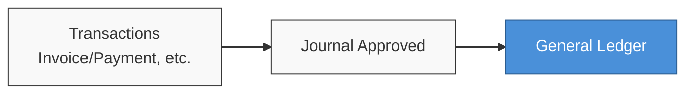
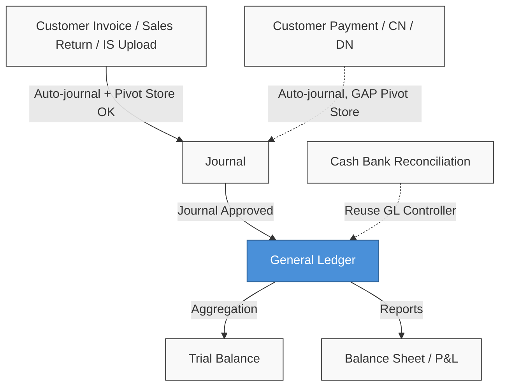

### 🚀 Report: General Ledger

**General Ledger Report** is a *read-only* report that lists journal transaction lines per **Chart of Account (COA)** for a selected period. Data comes from **journal detail** whose *journal header* status is **Approved**. Transaction rows are grouped systematically by COA.

---

### 🔑 Key Terms

| Term | Definition |
| :---- | :---- |
| **COA** | **Chart of Account**, the general-ledger account. |
| **Opening Balance (Beginning)** | Balance before the period start date; includes all **Approved** journal mutations before *start date*. |
| **Ending Balance** | **Opening Balance** plus mutations in the current period (*start–end*). |
| **Activa / Passiva** | COA classification that drives the balance formula. |
| **Running balance** | Cumulative balance per transaction row (TO-BE *export*, not AS-IS UI). |
| **Primary currency** | Company main currency; always used in Debit/Credit columns. |
| **Foreign** | Journal foreign-currency amount, if a *foreign currency* is used. |
| **Current Profit/Loss** | Special COA that shows current P&L mutations via a *UNION query*. |
| **Pivot store** | Relation from journal *header* to *store* (`journal store pivot`); source of the Store column. |
| **Supplier code-only** | If a structured Supplier column exists, the UI shows **supplier code** only (hide name). Auto-created journal **DESCRIPTION** text stays **as stored** (Phase 1 — not rewritten). |
| **Row group** | Row grouping per COA in the report table. |

---

### 🎯 When & Why to Use

| Use When | Do Not Use When |
| :---- | :---- |
| Auditing debit/credit mutations per account. | You only need a compact per-COA aggregate (use Trial Balance). |
| Tracing a line to the source *journal*. | You need to edit a *journal* (use Journal). |
| Filtering by *store* via *journal header*. | You expect *store* pulled directly from an *invoice* without the *journal pivot*. |
| *Exporting* journal line detail. | You need a non-journal report such as AP aging. |

---

### 📋 Prerequisites

* *Privilege* to view the **General Ledger** menu.
* Related journal transactions already **Approved**.
* Company scope: the report only shows data for the active *company login*.
* *Soft-deleted journals* are not shown.
* Know the date range and COA needed for *filters*.

---

### 🔄 Position in Business Flow

**Flow notes:** Operational transactions create journal documents. After a journal reaches **Approved**, its detail lines appear in **General Ledger**.

---

### 📍 Menu Location

* **Navigation:** Accounting → Report → **General Ledger**
* **UI route:** `/accounting/general-ledger`

> 🖼️ **[IMAGE PLACEHOLDER 1]** — Accounting sidebar → Report → General Ledger.

---

### 🔒 Not a Document Status Cycle

> ⚠️ **Hard Rule:** General Ledger is strictly *read-only*. There is no *create*, *edit*, or *approve* flow in this menu. The only entry condition is that the source *journal* is **Approved**.

---

### 📁 Grouping per COA

The report uses DataTables RowGroup by **COA**.

* **AS-IS:** The *group* header currently shows only COA code | name (bold), with no debit, credit, or *ending balance* totals. The *backend* calculates opening and ending for the *group title*, but they are not rendered in HTML.
* **TO-BE:** Totals will be shown directly on the *group header* row.

---

### 📊 Grid Column Reference

| Column | Description |
| :---- | :---- |
| **TRX. DATE** | *Journal* transaction date. |
| **TRX. CODE** | *Journal* number (hyperlink to *edit Journal*). |
| **STORE** | Store name from *journal header* (*pivot*); `-` if empty, or truncated text plus *tooltip* if *multi-store*. |
| **JOURNAL TYPE** | Journal origin type (manual, *sales invoice*, *payment*); hidden by default. |
| **TRX. REF.** | Original reference document number (*invoice*, stock mutation). |
| **DESCRIPTION** | Note on the *journal detail* line. |
| **FOREIGN** | Amount in foreign currency (if any). |
| **DEBIT / CREDIT** | Amount in **primary currency**, converted when the *journal* was saved. |

*Note:* **Currency**, **Foreign numeric**, **Debit/Credit numeric**, **Opening Balance**, and **Ending Balance** appear only in *Export*, not in the UI table. Default UI column order: TRX. DATE → TRX. CODE → STORE → TRX. REF. → DESCRIPTION → FOREIGN → DEBIT → CREDIT.

---

### 🏪 Store Column

The **Store** column shows *store* from the **journal header** (via *journal store pivot*), **not** from the reference document such as *invoice* or *payment*.

* If a *store* name exists on the *pivot header journal*, it is shown. If empty (normal for transactions without a store context), a `-` is shown.
* If one *header* links to several stores (*multi-store*), names are comma-separated with a full-list *tooltip* on hover.

> 🖼️ **[IMAGE PLACEHOLDER 3]** — STORE column + *multi-store tooltip*.

---

### 🏷️ Supplier display (code-only)

* If a **structured Supplier** column exists on the grid, it shows **supplier code** only (name hidden; no name hover).
* The **DESCRIPTION** column stays as stored on the journal line — Phase 1 does **not** rewrite auto-created narration (it may still mention a supplier name in free text).
* Export omits a separate supplier-name column if one exists; description cells preferably stay as-is.
* Print may still show supplier name per the global print policy.

---

### 🔍 Period, COA & Store Filters

Search is implemented via *SearchBuilder* on the API request.

* **Trx. Date:** Defaults to the current month.
* **COA:** Optional advanced filter for one or more accounts.
* **Store:** *Global search* and *Advanced Filter* only read the *journal header pivot*. If the *pivot* is empty, the row will not match a "contains store name" filter.

> 🖼️ **[IMAGE PLACEHOLDER 4]** — Advanced Filter (Trx Date + Store).

---

### 🧮 Opening & Ending Balance

All balance calculations use **primary currency**.

> 🛑 **Warning:** In AS-IS UI and export (except partial *ending* export), **Opening** and **Ending Balance** show the **same amount on every row** in a COA group. The system currently does **not** show a *running balance* per transaction.

**Example (Activa, Opening 0):**

| Row | Debit | Credit | Ending (AS-IS — same on every row) |
| :---- | :---- | :---- | :---- |
| Trx 1 | 100,000 | 0 | 115,000 (COA total) |
| Trx 2 | 0 | 30,000 | 115,000 (COA total) |
| Trx 3 | 45,000 | 0 | 115,000 (COA total) |

*Note:* *TO-BE* will change *export* to a cumulative per-row *running balance* that is *position-aware*.

---

### ⚖️ Activa vs Passiva

The system recognizes 7 COA classes (**Activa**: Assets, Expense, COGS | **Passiva**: Liabilities, Equity, Revenue, Other Revenue & Expenses).

* **Activa:** Balance = Debit − Credit.
* **Passiva:** Balance = Credit − Debit.

**AS-IS inconsistency:** Passiva adjustment is applied **partially** (only on *export ending balance* and hidden group titles), not on UI *opening/ending* columns. *TO-BE* requires all *output* to be consistent (*position-aware*).

---

### 💱 Debit/Credit vs Foreign Currency

The system converts *foreign currency* journal amounts to primary currency (Debit/Credit) using the *exchange rate* at document save. General Ledger Report does not reconvert rates; it uses the *persisted* values.

---

### 📈 Current Profit/Loss COA

For companies that use a "Current Profit/Loss" COA, the system runs a *special UNION query*. Current P&L history is remapped to that *coa_id* so mutations appear in this COA group.

---

### 📤 Excel Export (Async)

*Export All* runs as an *async batch*; progress is visible on the *Export File* tab.

* Produces a *flat list* repeating COA information on each transaction row.
* Export includes hidden columns (including Store in column D).
* Exported balances remain *COA-level* (same on each row, not *running*), with Passiva adjustment only on *Ending* (partial).

> 🖼️ **[IMAGE PLACEHOLDER 5]** — Export All + Export File tab.

---

### 🛠️ TO-BE Features

Planned (not yet in *production*):

* **Group header totals:** *Group header* will show Total Debit, Total Credit, and Ending Balance in the UI.
* **Running export:** Export will recalculate *Ending Balance* as a progressive *running balance* row by row in date order.
* **Passiva consistency:** All balance *output* will follow the Activa/Passiva formula.

---

### 🛡️ Business Rules & Validation

* Only journals with status **Approved** appear in the report.
* Transactions are strictly selected by the date *filter* range.
* Users must have an active *privilege* (otherwise *Access denied*).
* Absolute data isolation: users only see entries for the active *company login*.
* If a *journal* is *unapproved* after an *export* has run, the export file still shows data as of the job snapshot.

---

### ⚠️ Limitations & Gaps

* **Pivot Store gap (AS-IS):** Downstream transactions such as *Customer Payment (AR Receive)*, *Credit Note (CN)*, and *Debit Note (DN)* do not inject location into the *journal header*, so Store shows `-` on General Ledger even when the source document has a store.
* **Settlement Reject:** If *settlement* is rejected, the AR *journal* is not issued. SI/OB journals from *upload* remain and still appear in General Ledger.
* **TO-BE pending:** *Running balance* on export and UI *group header* totals are still pending.

---

### 🔗 Related Menus

**Flow notes:** General Ledger summarizes per-COA mutations from Approved journals. There is a *gap* injecting *store* names from payment/CN/DN into the journal. General Ledger is the line-level foundation for Trial Balance and Balance Sheet.

---

### 🔧 Troubleshooting

| Case | Likely cause | What to do |
| :---- | :---- | :---- |
| A specific transaction does not appear. | *Journal* is not Approved or is outside the period *filter*. | Confirm the journal is Approved and check *Trx Date* range. |
| Store column is `-` on a payment. | *Store pivot* missing on AR/CN/DN (AS-IS gap). | System limitation; report to *developer* if integration is required. |
| *Filter Store* returns nothing. | Empty *pivot* on *journal header*, so the filter cannot match. | GL only reads *journal header* data. |
| *Ending Balance* is identical on every row. | By-design *COA-level balance*. | Not a *bug*; wait for TO-BE *running balance*. |
| Odd amounts in a Passiva group. | Partial *adjustment* calculation. | Compare UI with the *export* file. |

---

### ❓ FAQ

**Q: Where does the Store column come from?**
A: Store text is taken only from the *journal header* (Basic Information tab on Journal), not from the *invoice* or payment document.

**Q: Why do some rows miss a Store search?**
A: The *journal header* has no Store (*pivot* empty). GL filters do not read the original source document.

**Q: How does General Ledger differ from Trial Balance?**
A: Trial Balance is a cumulative summary per COA. General Ledger shows mutation at each *journal detail* line.

**Q: What happens when Settlement is Rejected?**
A: The AR *journal* is not issued, but earlier SI/OB *upload* journals remain on GL.

**Q: Why are Opening/Ending not cumulative per row?**
A: The current UI shows the same *COA-level* total on every row in the group.

**Q: How are multi-store journals shown?**
A: All store names are listed, comma-separated, truncated with a hover *tooltip* if too long.

**Q: How does General Ledger handle P&L entries?**
A: A special *Current Profit/Loss* account shows mutations via a *backend UNION query*.

**Q: Why can DESCRIPTION still show a supplier name under code-only?**
A: Phase 1 only masks a structured Supplier UI column (if present). Auto-created journal description text is left unchanged for audit trail.

---

### 📚 See Also

* [Journal](/docs/accounting/journal/overview)
* [Trial Balance](/docs/accounting/accounting-trial-balance/overview)
* [Balance Sheet](/docs/accounting/accounting-balance-sheet/overview)
* [Profit & Loss](/docs/accounting/accounting-profit-loss/overview)
* [Customer Invoice](/docs/accounting/accounting-customer-invoice/overview)
* [Customer Payment](/docs/accounting/accounting-customer-payment/overview)
* [Credit Note](/docs/accounting/accounting-credit-note/overview)
* [Debit Note](/docs/accounting/accounting-debit-note/overview)
