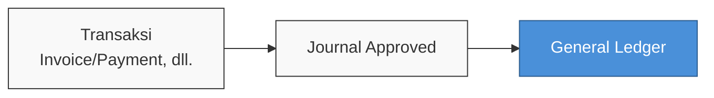
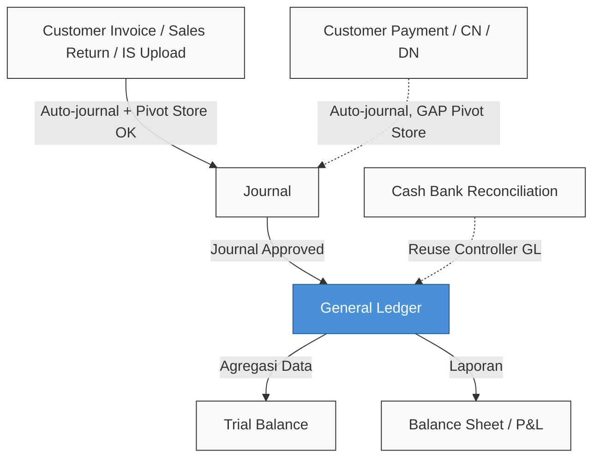

### 🚀 Laporan: General Ledger

**General Ledger Report** (Buku Besar) adalah laporan *read-only* yang menampilkan baris transaksi jurnal per **Chart of Account (COA)** dalam periode terpilih. Data bersumber dari **journal detail** yang *journal header*-nya berstatus **Approved**. Baris transaksi digroup secara sistematis per COA.

---

### 🔑 Istilah Kunci

| Istilah | Definisi |
| :---- | :---- |
| **COA** | **Chart of Account**, akun buku besar akuntansi. |
| **Opening Balance (Beginning)** | Saldo sebelum tanggal awal periode; mencakup seluruh mutasi jurnal **Approved** sebelum *start date*. |
| **Ending Balance** | **Opening Balance** ditambah dengan mutasi periode berjalan (*start–end*). |
| **Activa / Passiva** | Posisi klasifikasi COA yang mempengaruhi formula saldo. |
| **Running balance** | Saldo kumulatif per baris transaksi (TO-BE *export*, bukan AS-IS UI). |
| **Primary currency** | Nilai mata uang utama; selalu digunakan pada kolom Debit/Credit. |
| **Foreign** | Nilai mata uang asing jurnal, jika menggunakan *foreign currency*. |
| **Current Profit/Loss** | COA khusus untuk menampilkan mutasi laba rugi berjalan via *query UNION*. |
| **Pivot store** | Relasi *header* jurnal ke entitas *store* (`journal store pivot`) sebagai sumber kolom Store. |
| **Row group** | Pengelompokan baris per COA di tabel laporan. |

---

### 🎯 Kapan & Kenapa Dipakai

| Pakai Jika | Jangan Jika |
| :---- | :---- |
| Audit mutasi debit/kredit per akun. | Butuh agregasi ringkas per COA saja (pakai menu Trial Balance). |
| Trace transaksi ke *journal* sumber. | Butuh edit *journal* (pakai menu Journal). |
| Filter per *store* via *header journal*. | Expect *store* ditarik langsung dari *invoice* tanpa *pivot journal*. |
| *Export* detail baris jurnal. | Butuh laporan non-jurnal seperti AP aging. |

---

### 📋 Prasyarat

* Memiliki *privilege* untuk melihat (view) menu **General Ledger**.
* Transaksi jurnal yang terkait sudah berstatus **Approved**.
* Berada dalam *company scope*; laporan hanya menampilkan data milik *company login* aktif.
* Paham bahwa *soft-deleted journal* tidak akan ditampilkan.
* Mengetahui rentang tanggal dan COA untuk kebutuhan *filter*.

---

### 🔄 Posisi dalam Alur Bisnis

**Keterangan alur:** Transaksi operasional menghasilkan dokumen jurnal. Jurnal yang telah mencapai status **Approved** kemudian datanya (baris detail) disajikan dalam laporan **General Ledger**.

---

### 📍 Lokasi Menu

* **Jalur navigasi:** Accounting → Report → **General Ledger**
* **Route UI:** `/accounting/general-ledger`

> 🖼️ **[PLACEHOLDER GAMBAR 1]** — Sidebar Accounting → Report → General Ledger.

---

### 🔒 Bukan Siklus Status Report

> ⚠️ **Hard Rule:** Laporan General Ledger bersifat mutlak *read-only*. Tidak ada alur *create*, *edit*, atau *approve* di dalam menu ini. Satu-satunya syarat data masuk adalah *journal* sumber harus sudah berstatus **Approved**.

---

### 📁 Grouping per COA

Laporan ini menggunakan mekanisme pengelompokan DataTables RowGroup berdasarkan **COA**.

* **Kondisi AS-IS:** Header *group* saat ini hanya menampilkan kode | nama COA (cetak tebal), tanpa adanya total debit, kredit, maupun *ending balance*. *Backend* menghitung nilai awal dan akhir untuk *group title*, tetapi belum di-*render* ke HTML.
* **Kondisi TO-BE:** Ke depannya akan ditambahkan informasi total perhitungan secara langsung di baris *header group*.

---

### 📊 Referensi Kolom Grid

| Kolom | Penjelasan |
| :---- | :---- |
| **TRX. DATE** | Tanggal transaksi *journal*. |
| **TRX. CODE** | Nomor *journal* (menyediakan *hyperlink* ke *edit Journal*). |
| **STORE** | Nama *store* ditarik dari *header journal* (*pivot*); berisi `-` jika kosong, atau teks dipotong beserta *tooltip* jika *multi-store*. |
| **JOURNAL TYPE** | Tipe asal *journal* (manual, *sales invoice*, *payment*), secara bawaan disembunyikan (*hidden*). |
| **TRX. REF.** | Nomor dokumen rujukan asli (*invoice*, mutasi stok). |
| **DESCRIPTION** | Keterangan pada baris *journal detail*. |
| **FOREIGN** | Nilai nominal dalam mata uang asing (jika ada). |
| **DEBIT / CREDIT** | Nilai transaksi dalam **primary currency**, telah dikonversi saat penyimpanan *journal*. |

*Catatan:* Kolom **Currency**, **Foreign numeric**, **Debit/Credit numeric**, **Opening Balance**, dan **Ending Balance** hanya muncul pada format *Export*, tidak di UI tabel. Urutan kolom UI bawaan: TRX. DATE → TRX. CODE → STORE → TRX. REF. → DESCRIPTION → FOREIGN → DEBIT → CREDIT.

---

### 🏪 Kolom Store

Kolom **Store** menampilkan *store* dari **header journal** (melalui relasi *journal store pivot*), **bukan** menembak langsung ke dokumen referensi seperti *invoice* atau *payment*.

* Jika nama *store* terisi di *pivot header journal*, akan ditampilkan. Jika kosong (normal untuk transaksi tanpa konteks toko), akan menampilkan strip `-`.
* Jika satu *header* terkait beberapa toko (*multi-store*), nama akan dipisah koma dengan *tooltip* daftar lengkap saat di-*hover*.

> 🖼️ **[PLACEHOLDER GAMBAR 3]** — Kolom STORE + *tooltip multi-store*.

---

### 🔍 Filter Periode, COA & Store

Fitur pencarian diimplementasikan via *SearchBuilder* pada *request API*.

* **Trx. Date:** Default berada pada bulan berjalan.
* **COA:** Filter lanjutan opsional untuk menyaring satu atau beberapa akun.
* **Store:** *Global search* dan *Advanced Filter* hanya membaca *pivot header journal*. Jika *pivot* kosong, baris tersebut tidak akan cocok dengan filter "contains store name".

> 🖼️ **[PLACEHOLDER GAMBAR 4]** — Advanced Filter (Trx Date + Store).

---

### 🧮 Opening & Ending Balance

Semua perhitungan saldo dalam sistem secara fundamental diproses menggunakan **primary currency**.

> 🛑 **Peringatan:** Pada UI AS-IS dan ekspor (kecuali ekspor *ending* parsial), nilai **Opening** dan **Ending Balance** akan muncul dengan nominal yang **sama di setiap baris** dalam satu grup COA. Sistem saat ini **tidak** menyajikan tampilan *running balance* per transaksi.

**Contoh perhitungan (Activa, Opening 0):**

| Row | Debit | Credit | Ending (AS-IS — sama semua baris) |
| :---- | :---- | :---- | :---- |
| Trx 1 | 100.000 | 0 | 115.000 (total COA) |
| Trx 2 | 0 | 30.000 | 115.000 (total COA) |
| Trx 3 | 45.000 | 0 | 115.000 (total COA) |

*Catatan:* Sistem *TO-BE* akan memperbaiki fungsi *export* menjadi kumulatif per baris (*running balance*) secara *position-aware*.

---

### ⚖️ Activa vs Passiva

Sistem mengenali 7 kelas COA (**Activa**: Assets, Expense, COGS | **Passiva**: Liabilities, Equity, Revenue, Other Revenue & Expenses).

* **Activa:** Balance = Debit − Credit.
* **Passiva:** Balance = Credit − Debit.

**Inkonsistensi AS-IS:** Penyesuaian perhitungan Passiva saat ini diproses secara **parsial** (hanya pada *export ending balance* dan titel grup tersembunyi), namun belum diterapkan pada kolom UI *opening/ending*. Desain *TO-BE* mewajibkan semua *output* bersifat konsisten (*position-aware*).

---

### 💱 Debit/Credit vs Foreign Currency

Sistem mengonversi nilai jurnal *foreign currency* ke mata uang utama (Debit/Credit) dengan *exchange rate* saat dokumen disimpan. General Ledger Report tidak melakukan konversi kurs ulang, melainkan menggunakan nilai yang sudah tersimpan (*persisted*).

---

### 📈 Current Profit/Loss COA

Untuk perusahaan yang menggunakan COA "Current Profit/Loss", sistem menjalankan *UNION query khusus*. Riwayat laba rugi berjalan akan diubah *coa_id*-nya menjadi akun *Current Profit/Loss* agar mutasi tersebut dapat tampil di grup COA ini secara transparan.

---

### 📤 Export Excel (Async)

Fitur *Export All* berjalan secara *async batch* dan progresnya dapat dipantau di *tab Export File*.

* Menghasilkan format daftar datar (*flat list*) yang merepetisi informasi COA per baris transaksi.
* Ekspor ini menampilkan kolom tersembunyi (termasuk kolom Store pada posisi D).
* Saldo yang diekspor masih setara *COA-level* (sama tiap baris, bukan *running*), dengan penyesuaian Passiva yang hanya berlaku pada *Ending* (parsial).

> 🖼️ **[PLACEHOLDER GAMBAR 5]** — Export All + tab Export File.

---

### 🛠️ Fitur TO-BE

Pembaruan terencana (belum *production*):

* **Group header totals:** *Group header* akan menampilkan Total Debit, Total Credit, dan Ending Balance secara nyata di UI.
* **Running export:** Fitur ekspor akan mengkalkulasi ulang *Ending Balance* menjadi kumulatif progresif (*running balance*) baris demi baris secara urut waktu.
* **Konsistensi Passiva:** Segala bentuk *output* saldo dipastikan mematuhi formula fundamental Activa/Passiva.

---

### 🛡️ Aturan Bisnis & Validasi

* Hanya *journal* dengan status **Approved** yang masuk ke dalam laporan.
* Transaksi diseleksi secara ketat sesuai rentang *filter* tanggal.
* Pengguna diwajibkan memiliki *privilege* aktif (atau ditolak dengan *Akses ditolak*).
* Isolasi data absolut diberlakukan; pengguna hanya bisa melihat entri milik *company login* yang sedang aktif.
* Jika sebuah *journal* dibatalkan persetujuannya (*unapprove*) setelah aksi *export* dijalankan, maka berkas *export* akan tetap menyajikan data sesuai status waktu pemotretan awal (*snapshot saat job jalan*).

---

### ⚠️ Keterbatasan & Gap

* **Gap Pivot Store (AS-IS):** Transaksi hilir seperti *Customer Payment (AR Receive)*, *Credit Note (CN)*, dan *Debit Note (DN)* belum menginjeksikan data lokasi ke *header journal*, yang berimbas pada tampilnya simbol `-` pada kolom Store di General Ledger meskipun dokumen rujukannya memiliki referensi toko.
* **Settlement Reject:** Jika *settlement* ditolak, *journal* AR tidak diterbitkan. Namun, *journal* SI/OB yang bersumber dari *upload* akan tetap tertinggal dan terlihat di General Ledger.
* **TO-BE Pending:** Fitur komputasi *running balance* di ekspor dan perhitungan total *header group* UI masih dalam penundaan pengerjaan.

---

### 🔗 Hubungan Menu Lain

**Keterangan alur:** General Ledger merangkum detail mutasi per COA yang dipasok oleh Journal Approved. Terdapat celah (*gap*) integrasi nama *store* dari transaksi pelunasan/CN/DN ke jurnal. Hasil dari General Ledger berfungsi sebagai pondasi detail bagi laporan makro seperti Trial Balance dan Balance Sheet.

---

### 🔧 Troubleshooting

| Kasus | Analisis Penyebab | Langkah Solusi |
| :---- | :---- | :---- |
| Transaksi spesifik tidak tampil. | *Journal* belum disetujui (Approved) atau di luar *filter* periode. | Pastikan *journal* di menu utama berstatus Approved dan cek rentang *Trx Date*. |
| Kolom Store kosong (-) untuk pembayaran. | Kegagalan *pivot* *store* pada sumber transaksi AR/CN/DN (Gap AS-IS). | Ini adalah keterbatasan tersistem; lapor *developer* jika integrasi wajib ada. |
| Hasil *Filter Store* nihil. | *Pivot* di *header journal* kosong sehingga filter gagal mencocokkan. | Ingat bahwa GL murni membaca informasi *header journal* saja. |
| *Ending Balance* semua baris bernilai identik. | Perilaku *by-design* dari sistem saat ini (*COA-level balance*). | Bukan merupakan *bug*; tunggu perbaikan *running balance* pada rilis TO-BE. |
| Angka aneh pada grup Passiva. | Kalkulasi *adjustment* yang masih parsial. | Bandingkan data UI dengan dokumen *export* untuk referensi akurat. |

---

### ❓ FAQ

**Q: Dari mana sumber data utama kolom Store?**
A: Teks Store murni diambil dari *header journal* (Tab Basic Information di menu Journal), bukan ditarik paksa dari dokumen transaksi *invoice* atau pembayaran.

**Q: Jika saya mencari transaksi berdasarkan Store, mengapa baris tertentu luput?**
A: Hal ini terjadi jika form *header journal*-nya tidak diisi parameter Store (*pivot* kosong). Filter GL tidak menembus batas pembacaan dokumen asli.

**Q: Apa perbedaan fundamental General Ledger dan Trial Balance?**
A: Trial Balance fokus menyajikan ringkasan kumulatif per satu akun (COA). General Ledger membedah mutasi hingga tataran baris per baris transaksi (*journal detail*).

**Q: Bagaimana nasib transaksi saat proses Settlement berstatus Reject?**
A: *Journal* AR dibatalkan penerbitannya, tetapi entri *journal* pendahulu seperti SI/OB bawaan skema *upload* akan tetap eksis secara permanen di layar GL.

**Q: Mengapa angka Opening/Ending tidak berurutan kumulatif di setiap baris?**
A: Arsitektur UI saat ini menampilkan rangkuman absolut pada tingkatan *COA-level* di seluruh baris kelompok.

**Q: Bagaimana sistem merespons Multi-store dalam satu jurnal?**
A: Semua nama Store akan ditampilkan, dipisahkan dengan koma, serta dipangkas dengan tambahan *hover tooltip* jika teks terlalu panjang.

**Q: Bagaimana General Ledger memproses entri laba/rugi?**
A: Terdapat akun *Current Profit/Loss* khusus yang menampilkan mutasi berkat fungsi *query UNION* di tingkat *backend*.

---

### 📚 Lihat Juga

* [Journal](/docs/accounting/journal/overview)
* [Trial Balance](/docs/accounting/accounting-trial-balance/overview)
* [Balance Sheet](/docs/accounting/accounting-balance-sheet/overview)
* [Profit & Loss](/docs/accounting/accounting-profit-loss/overview)
* [Customer Invoice](/docs/accounting/accounting-customer-invoice/overview)
* [Customer Payment](/docs/accounting/accounting-customer-payment/overview)
* [Credit Note](/docs/accounting/accounting-credit-note/overview)
* [Debit Note](/docs/accounting/accounting-debit-note/overview)
