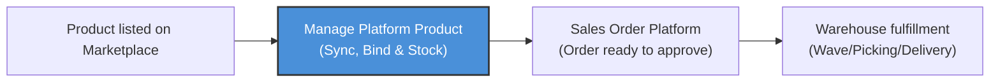
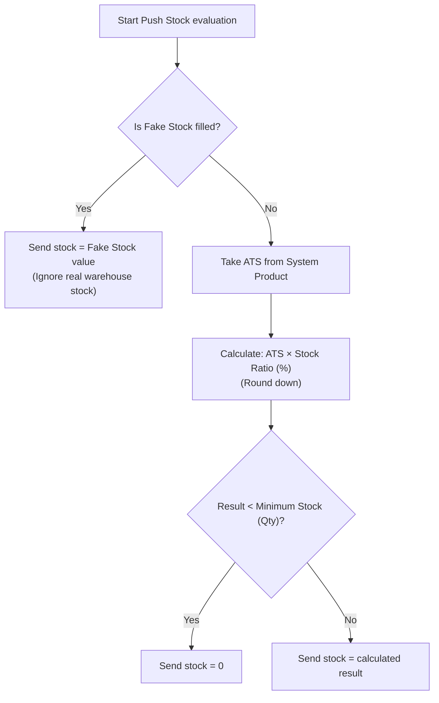
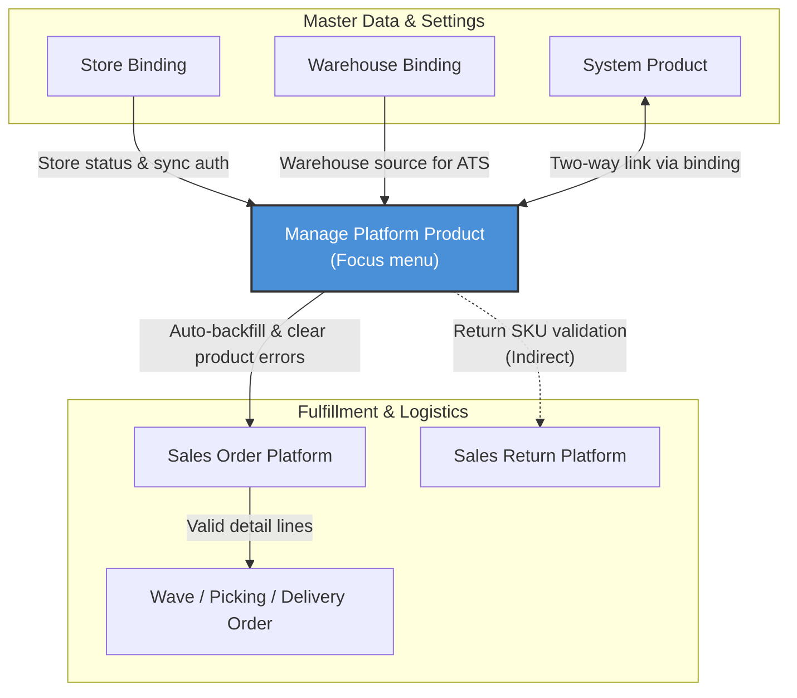

### 📦 Module/Feature: Manage Platform Product

**Business definition:**
**Manage Platform Product** is the main OmniChannel workspace for keeping your marketplace catalog aligned with your company’s internal product master. It connects marketplace SKUs to internal products so orders can be fulfilled — without using a formal Draft/Open/Approved document cycle.

### 🔑 Key Terms (Glossary)

* **Platform Product:** A product or variant synced from an external marketplace catalog (Shopee, Lazada, TikTok Shop), shown as one row per store.
* **System Product:** The internal OlshopERP product master. It is the source of truth for stock and the base for order fulfillment.
* **Store:** An active marketplace store account that is already authorized and connected in OlshopERP.
* **Binding:** The official link that maps one Platform Product to one System Product. **Binded** means linked; **Not Binded** means not linked yet.
* **Pull Products:** Pull product catalog data from the marketplace API into OlshopERP.
* **Push Stock:** Send stock updates from OlshopERP to the marketplace storefront.
* **Fake Stock:** A fixed manual stock number used for Push Stock instead of real warehouse stock.
* **Available To Sell (ATS):** Real sellable warehouse stock used for Push Stock when Fake Stock is empty.
* **SINGLE / VARIANT / PARENT:** Product hierarchy levels — **SINGLE** is a standalone product, **VARIANT** is an option under a parent (color/size), and **PARENT** is the parent shell that groups variants.
* **Sync Log:** Audit history for sync activity, queue failures, binding actions, and Push Stock.

### 🎯 When to Use This Menu

| ✅ Use this menu when | ❌ Do not use this menu when |
| :---- | :---- |
| A new **Store** is connected and you need the first product pull and catalog binding. | You want to create a new product master from scratch (use **System Product** — this menu has no manual create). |
| You do daily checks on Binded/Not Binded status and need to run **Push Stock**. | You want to change selling prices on the marketplace (price update is hidden from this screen). |
| Sales Order Platform shows errors like “product is not bound”. | You need to authorize a new store or marketplace logistics API (use **Store Binding**). |
| You need to troubleshoot catalog sync issues using **Sync Log**. | You need warehouse stock moves or accounting journals (use SCM / Accounting menus). |

### 🔄 Place in the Business Flow

Catalog management sits between marketplace listing and warehouse fulfillment. Products must be synced and bound here before marketplace orders can be approved and fulfilled.

**Business steps:**

> 1. **Marketplace listing:** The product exists in the external seller center.
> 2. **Catalog alignment (this menu):** Pull data, bind to System Product, and set stock rules.
> 3. **Downstream validation:** Sales Order Platform checks binding before approval.
> 4. **Warehouse execution:** Logistics runs Wave, Picking, and Delivery Order.

### 📍 Menu Location & Store Filter

* **UI path:** OmniChannel → Platform Catalog → Manage Platform Product
* **Route:** `/omni/platform-product`

🖼️ **[IMAGE PLACEHOLDER]** — Main Manage Platform Product page with the Store multi-select filter at the top of the grid.
⚠️ **HARD RULE:** Most main actions (**Pull Products**, **Push Stock**, **Auto Binding**) stay disabled until you select at least one **Store** in the top filter.

### 📥 Where Platform Product Data Comes From

There is no manual create button. Platform Product rows come from these paths only:

| Data source | When it runs | Boundary |
| :---- | :---- | :---- |
| **Pull Products** (manual button) | When a user clicks the header button. | Pulls only for stores selected in the **Store** filter. |
| **Automatic sync** | Background schedule, about **every hour**. | Updates all active stores (new products and changed details). |
| **New store onboarding queue** | Right after store authorization succeeds in Store Binding. | You do **not** need a manual first Pull Products for that first catalog load. |
| **Automatic webhook** | Near real-time when the marketplace sends SKU changes. | Catalog webhooks are currently available for **TikTok Shop** only. |

### 🏢 Three Product Levels: SINGLE, VARIANT, PARENT

| Level | What it is | Binding rule | Bulk / row actions |
| :---- | :---- | :---- | :---- |
| **SINGLE** | Standalone product with no color/size options. | Can be bound directly to a System Product. | Full access to row sync actions. |
| **VARIANT** | Child option under a parent (example: Size L, Color Red). | Must be bound **one by one** on each variant row. | No row sync button. In bulk sync, variants are **skipped**. |
| **PARENT** | Parent shell that groups VARIANT children. | **Cannot be bound directly** (bind button hidden). Shows Binded (green) only when **all** VARIANT children are bound. | Row sync is available. In bulk stock edit, PARENT rows are **skipped** with a “parent product” message. |

🖼️ **[IMAGE PLACEHOLDER]** — Badges for SINGLE / VARIANT / PARENT and Binded (green) / Not Binded (grey) indicators.

### 🔄 Three Ways to Bind

| Comparison | Path 1: Manual Binding | Path 2: Auto Binding | Path 3: Bulk Binding |
| :---- | :---- | :---- | :---- |
| **Scope** | 1 Platform Product × 1 store. | All unbound products × stores selected in the filter. | 1 platform SKU × **all active company stores**. |
| **Matching logic** | User picks the System Product in a search modal. | Auto-match when platform SKU equals System Product SKU (**case-insensitive**). | User picks 1 platform SKU, then 1 target System Product. |
| **Best for** | Special cases or when marketplace SKU names differ from internal SKUs. | After a large first sync when SKUs already match. | The same SKU sold in many stores — bind once for all. |
| **Blocks / skips** | Blocks Fix Asset System Products and random SKU mismatches. | Skips PARENT rows and Fix Asset System Products (no hard error). | Currently weaker validation — Fix Asset / random checks are not as strict as manual binding. |

**After a successful bind (all three methods):**
Base stock unit is copied from the System Product, related Sales Order “not bound” errors are cleared automatically, and the action is written to audit log.

**Mapping limit:**
One System Product **can** link to many Platform Products (multi-listing). One Platform Product **can only** have **one** active System Product bind per store.

### ⚙️ Common Usage Scenarios

#### **Scenario A: First setup for a new store**

> 1. Open `/omni/platform-product`.
> 2. Select the new **Store** in the top filter.
> 3. Click **Pull Products** → wait for the background job success message.
> 4. Click **Auto Binding** for SKUs that already match by name.

#### **Scenario B: Manual bind for one SKU**

> 1. Select the store and find a **Not Binded** row (not a **PARENT**).
> 2. Click the bind (chain) icon to open **Specification Product**.
> 3. In **Binding Product**, choose the System Product → click **Save**.

🖼️ **[IMAGE PLACEHOLDER]** — Specification Product modal, Binding Product section.

#### **Scenario C: Bind one SKU across many stores**

> 1. Click **Bulk Binding** (top right) to open the right drawer.
> 2. Choose **Platform Product SKU** → preview shows active stores that have that SKU.
> 3. Choose the target System Product (Single or Variant) → click **Save**.

🖼️ **[IMAGE PLACEHOLDER]** — Bulk Binding drawer with store preview and System Product picker.

#### **Scenario D: Push Stock**

> 1. Filter to rows that are **Binded** or have **Fake Stock** filled.
> 2. Tick one or more rows.
> 3. Click bulk **Push Stock** to send stock to the marketplace.

🖼️ **[IMAGE PLACEHOLDER]** — Bulk Push Stock button and Stock Management fields in Specification modal.

### 📊 Push Stock: Quantity Priority Rules

🛑 **WARNING:** **PARENT** rows are always skipped for Push Stock. Stock is controlled only by bound **VARIANT** or **SINGLE** rows.
📄 **Eligibility:** A row can be pushed only if it is **Binded** **or** has a valid **Fake Stock** value. Otherwise it is skipped in bulk Push Stock.

### 📊 Field Reference

#### 1. Specification Product modal

| Field label | Technical key | Type | What it does | Constraints |
| :---- | :---- | :---- | :---- | :---- |
| **System Product** | system_product_id | Dropdown | Target product for binding. Clearing it and saving means **unbind**. | Blocks Fix Asset products. |
| **Fake Stock** | fake_stock_qty | Numeric | Fixed stock override. If filled, ATS calculation is ignored. | Integer ≥ 0. Leave empty to use real warehouse stock. |
| **Minimum Stock (Qty)** | minimum_stock_threshold | Numeric | Safety floor. If calculated stock is below this, storefront stock becomes 0. | Optional integer ≥ 0. |
| **Stock Ratio** | stock_push_ratio | Percent | Percent of ATS allowed to push to the store. | Integer from **0 to 100**. |

#### 2. Header & main datalist

| Element | UI type | What it does | Limits |
| :---- | :---- | :---- | :---- |
| **Store filter** | Multi-select | Chooses which marketplace stores appear in the workspace. | **At least one store** is required to enable header actions. |
| **Advanced Filter** | Search panel | Search by platform SKU, product name, bind status, and more. | Free text. |
| **Export** | Button | Downloads current platform product rows to Excel. | `.xlsx` output. |
| **Random Confirmation Toggle** | Modal checkbox | Extra confirmation in Bulk Binding when random SKU mismatch is detected. | Shown only for random SKU cases. |

### 🛡️ Business Rules & Validations

* **If** you open this menu without permission, **then** the system blocks access with **HTTP 403 Forbidden**.
* **If** you click Pull Products / Push Stock / Auto Binding while Store filter is empty, **then** buttons stay disabled or you see “Store is required”.
* **If** you try to bind to a **Fix Asset** System Product, **then** save is rejected.
* **If** one side is a random SKU and the other is regular, without random confirmation checked, **then** save is blocked.
* **If** you click bind on a **PARENT** row, **then** no modal opens — bind is hidden for parents.
* **If** you unbind by clearing System Product and saving, **then** the link is removed and platform stock info is cleared, **but** existing Sales Order Platform rows are not deleted or reset.
* **If** you save Stock Ratio / Minimum Stock without Fake Stock on a Not Binded product, **then** local save is allowed, but a warning shows that stock will not push until the product is bound.
* **If** Stock Ratio is decimal, negative, or outside 0–100, **then** validation error is shown.
* **If** Auto Binding is already running for that store, **then** a second run is blocked with “Previous process is still running, please wait”.
* **If** you run Auto Binding, **then** the system only matches Not Binded platform products to active System Products with the **same SKU (case-insensitive)**, and skips PARENT and Fix Asset rows.
* **If** Bulk Binding targets a System Product from another company, **then** the whole queue is cancelled (all-or-nothing).
* **If** you run Bulk Binding, **then** only active stores under the same company are processed, and SKU matching is **case-sensitive**.
* **If** Pull Products runs on a store with expired API auth or catalog sync disabled, **then** that store is skipped and counted in the result summary.
* **If** Pull Products finishes successfully for a store, **then** Auto Binding is triggered automatically in the background.
* **If** Push Stock includes rows that are not Binded, have no Fake Stock, or link to an inactive System Product, **then** those rows are skipped.
* **If** you look for a row sync button on a **VARIANT**, **then** it is not available (row sync is for SINGLE/PARENT only).
* **If** VARIANT rows are included in bulk sync, **then** they are skipped and counted in the result summary.
* **If** PARENT rows are included in bulk stock edit, **then** they are skipped with reason “this is a parent product”.
* **If** you try to delete a **VARIANT** row, **then** delete is rejected — delete via the **PARENT** instead.
* **If** you try to delete a **PARENT** that still has VARIANT children, or a product that is not yours, **then** delete is blocked.

### ⏳ Background Processing

Pull Products, Push Stock, and Auto Binding usually run as **background jobs** because they call external marketplace APIs.

While a job is running for a store, action buttons for that store turn **grey/disabled**. This is **not a bug** — it means the server is busy.

**What to do:**

1. Do not keep clicking the same button again and again.
2. Wait a short time (a few minutes if there are thousands of products).
3. Refresh the page. Buttons become active again when the job finishes.

### 🛡️ Deleting Products: Manual vs Sync Auto-Delete

| Level | Manual delete allowed? | Rule |
| :---- | :---- | :---- |
| **SINGLE** | ✅ Yes | Can delete one or many rows if the data belongs to your company. |
| **VARIANT** | ❌ No | Delete the **PARENT** instead. |
| **PARENT** | ✅ Conditional | Allowed only when it has **no VARIANT children** left. |

#### Auto-delete during sync

After a successful scheduled sync or manual Pull Products, OlshopERP compares the latest marketplace batch. Local platform products for that store that are **missing from the latest API batch are deleted automatically**.

🛑 **Hard limit:** Auto-delete only works inside that active sync batch. Old products removed long ago from seller center and never reached by sync again will **not** auto-delete — clean them up manually.

### 🔗 Impact on Sales Order Platform

* **Orders still arrive:** Marketplace sales orders can still enter OlshopERP even if the SKU is not bound yet.
* **Approve is blocked:** Unbound order lines cannot be approved. The system shows an error like “product is not connected”.
* **Auto-backfill:** After you bind the SKU (manual / Auto / Bulk), the system fills System Product on stuck order lines in the background and clears the error.
* **No need to re-sync orders:** Staff do **not** need to manually re-sync the sales order after binding.

### 📊 Activity / Audit Logs

| Log panel | What it shows | Where to open |
| :---- | :---- | :---- |
| **Sync Log — Action Log** | User actions (pull, bulk stock edit, push, manual delete). | **Log** button on the main page. |
| **Sync Log — Product Sync** | Technical API response details per product during sync. | Same Log modal, second tab. |
| **Bulk Binding Log** | Which platform SKUs were bound across which stores. | Inside the **Bulk Binding** drawer after Save. |

🖼️ **[IMAGE PLACEHOLDER]** — Sync Log modal with Action Log and Product Sync tabs.

### 🛡️ Access Rights (Role Permissions)

Access is controlled by Gate / Role Menu settings. Admin role does not automatically mean full access.

> 1. **View:** Open the list, use advanced search, Export, Sync Log, and Bulk Binding history.
> 2. **Update:** Manual binding, Stock Management settings, Pull Products, Push Stock, Auto Binding, Bulk Binding.
> 3. **Delete:** Delete one row or bulk delete catalog rows.

### 🛑 Known Limitations (AS-IS)

* **No manual create:** Products must come from marketplace pull/sync.
* **Weaker Bulk Binding validation:** Bulk Binding does not block Fix Asset / random mismatches as strictly as manual binding.
* **No bulk unbind:** Unbind one by one by clearing System Product in each modal.
* **Bulk Binding Log can lose older history:** Re-binding the same platform SKU to a different System Product may replace older log rows.
* **Realtime webhook is limited:** Full realtime catalog webhook is for **TikTok Shop** today. Shopee/Lazada still use hourly schedule or manual pull.
* **Price update is hidden:** The system can push price changes, but the control is intentionally hidden from this main screen.

### 🔗 Related Menus

| Related menu | Direction | What is shared |
| :---- | :---- | :---- |
| **Store Binding** | → Into this menu | Store active status, API token validity, and whether product sync is enabled. |
| **System Product** | ↔ Two-way | Internal product master, base UOM, ATS, Product COA Group, Fix Asset / random flags. |
| **Warehouse Binding** | → Into this menu | Which warehouses are used as ATS stock sources. |
| **Sales Order Platform** | ← Out from this menu | Binding status and auto-backfill to clear stuck order errors. |
| **Wave / Picking / Delivery Order** | ← Indirect | Uses cleaned Sales Order lines so warehouse fulfillment can continue. |
| **Sales Return Platform** | ← Indirect | Uses platform–system SKU mapping when validating returns. |

### 🛠️ Troubleshooting

| Symptom | Likely cause | What to do |
| :---- | :---- | :---- |
| SKU is missing from the grid even though orders already appear. | Catalog not pulled yet. | Select **Store** → **Pull Products** → check **Sync Log**. |
| Row stays **Not Binded** after repeated save. | Target System Product inactive, Fix Asset, or random mismatch without confirmation. | Check System Product status/type and bind to a valid regular product. |
| Auto Binding says “no products to bind”. | Everything is already bound, or SKU names differ. | Use manual bind or **Bulk Binding**. |
| Push Stock fails or marketplace stock becomes 0. | Not bound and Fake Stock empty, or ATS × ratio is below Minimum Stock. | Bind first or fill Fake Stock; check real warehouse ATS. |
| Header buttons stay grey and do nothing. | Store filter empty, or a background job is still running. | Select at least one Store; wait and refresh. |
| Sales Order is locked with “product not connected”. | Binding was not done when the order arrived. | Bind the SKU here → error clears automatically; do **not** re-sync the order. |
| Bulk Binding updates only some stores in the preview. | SKU text is not exactly the same across stores (space / case). | Fix SKU in seller center and pull again, or bind remaining stores manually. |

### ❓ FAQ

* **Q: Can I type a new platform product row here?**
  * **A:** No. Products must exist in the marketplace seller center first, then be pulled or synced into OlshopERP.
* **Q: Why must I always choose Store first?**
  * **A:** This is a multi-store catalog workspace. Without a store selection, Pull / Push / Auto Binding stay blocked to avoid mixing store data.
* **Q: What is the difference between Auto Binding and Bulk Binding?**
  * **A:** Auto Binding works on one selected store and auto-matches unbound SKUs that are equal (**case-insensitive**). Bulk Binding takes **one SKU** and binds it across **all active company stores** to one System Product you choose.
* **Q: Why can’t I bind a PARENT row directly?**
  * **A:** Buyers and warehouse stock moves use **VARIANT** (or SINGLE). PARENT is only a summary shell; its Binded status follows the children.
* **Q: When should I use Fake Stock?**
  * **A:** When you need a fixed storefront stock number that ignores warehouse ATS — for example before binding is ready, or for a special promo quota.
* **Q: Is it safe to delete platform product rows?**
  * **A:** Only **SINGLE** and childless **PARENT** can be deleted manually. **VARIANT** cannot be deleted alone. Manual delete removes the local catalog row only, not the marketplace listing.
* **Q: Should I use Pull Products or wait for automatic sync?**
  * **A:** Both use the same API path. Use manual Pull when you need fresh data right away. For normal daily work, hourly auto sync is enough.
* **Q: Does PARENT storefront stock get updated?**
  * **A:** No. Push Stock is controlled by VARIANT and SINGLE rows only.
* **Q: After binding, must I re-sync the sales order?**
  * **A:** No. Backend auto-backfill clears the order error for you.
* **Q: Can one System Product bind to many Platform Products?**
  * **A:** Yes — that is normal multi-listing.
* **Q: Can one Platform Product bind to many System Products?**
  * **A:** No. Per store, binding is strict **1:1**.

### 📑 See Also

* System Product catalog & master data guide
* Store Binding authorization & token sync guide
* Warehouse Binding setup guide
* Sales Order Platform stuck-order handling guide
