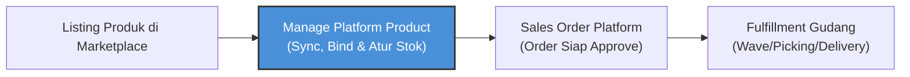
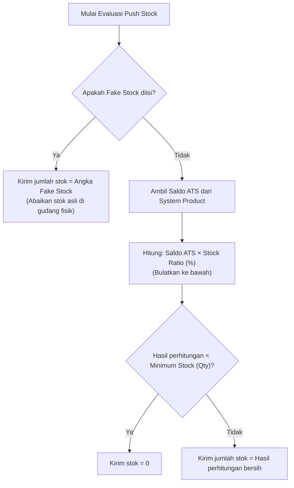

### 📦 Modul/Fitur: Manage Platform Product

**Definisi Bisnis:**
**Manage Platform Product** adalah workspace sentral dalam modul **OmniChannel** yang berfungsi sebagai dashboard manajemen katalog berkelanjutan untuk menyelaraskan data produk dari marketplace eksternal dengan master data internal perusahaan. Modul ini menjadi jembatan operasional untuk menghubungkan Stock Keeping Unit (**SKU**) toko digital dengan sistem internal tanpa melibatkan pencatatan dokumen transaksi formal bersiklus *Draft/Open/Approved*.

### 🔑 Istilah Kunci (Glosarium)

* **Platform Product:** Produk atau varian unit barang yang dihasilkan dari proses sinkronisasi katalog marketplace eksternal (Shopee, Lazada, TikTok Shop) dan ditampilkan satu baris per satu entitas toko.
* **System Product:** Master data produk internal OlshopERP yang bertindak sebagai satu-satunya sumber validitas saldo stok dan basis utama penanganan pemenuhan pesanan (*fulfillment*).
* **Store:** Entitas akun toko *marketplace* aktif milik korporasi yang status otorisasi dan integrasinya sudah terhubung secara legal di OlshopERP.
* **Binding:** Ikatan status atau hubungan resmi yang memetakan satu entitas *Platform Product* ke satu *System Product* tujuan. Status **Binded** berarti produk telah terhubung, sedangkan **Not Binded** menandakan pemetaan belum terbentuk.
* **Pull Products:** Aksi penarikan data katalog produk secara langsung dari *Application Programming Interface* (**API**) *marketplace* menuju ke dalam basis data lokal OlshopERP.
* **Push Stock:** Aksi pengiriman pembaruan volume stok secara real-time dari sistem OlshopERP menuju etalase komersial toko *marketplace*.
* **Fake Stock:** Angka stok manual konstan yang dikonfigurasi khusus pada platform untuk mengabaikan stok gudang fisik riil saat menjalankan rutinitas *Push Stock*.
* **Available To Sell (ATS):** Saldo stok riil gudang internal yang tersedia bebas untuk dijual dan dijadikan basis kalkulasi pengiriman stok jika fitur *Fake Stock* dikosongkan.
* **SINGLE / VARIANT / PARENT:** Tiga tingkatan hierarki produk di mana **SINGLE** adalah produk tunggal tanpa opsi, **VARIANT** merupakan opsi turunan (warna/ukuran) dari produk induk, dan **PARENT** adalah cangkang produk induk yang memayungi varian-varian tersebut.
* **Sync Log:** Rekam jejak riwayat audit fungsional yang mencatat seluruh aktivitas sinkronisasi data, kegagalan antrean, operasional *binding*, dan aktivitas *Push Stock*.

### 🎯 Kapan & Kenapa Dipakai

| ✅ Gunakan menu ini jika | ❌ Jangan gunakan menu ini jika |
| :---- | :---- |
| Terhubung akun **Store** baru yang telah selesai diotorisasi dan membutuhkan penarikan data produk awal sekaligus *binding* katalog perdana. | Ingin membuat master produk baru secara mandiri dari nol (Gunakan menu *System Product* karena menu ini tidak mendukung input manual). |
| Melakukan kontrol harian berkala untuk memantau status pemetaan produk (*Binded/Not Binded*) serta memicu pengiriman data pembaruan stok (*Push Stock*). | Mengubah skema harga jual produk secara operasional di etalase toko digital (Fitur pembaruan harga disembunyikan dari antarmuka menu utama ini). |
| Muncul indikasi gangguan (*error*) pada transaksi masuk di menu *Sales Order Platform* dengan keterangan kegagalan sistem berupa "produk belum ter-bind". | Mengelola otorisasi akun toko baru atau menghubungkan hak akses API logistik *marketplace* (Gunakan menu *Store Binding*). |
| Melakukan pelacakan (*troubleshooting*) kegagalan sinkronisasi berkala data etalase melalui visualisasi antarmuka panel *Sync Log*. | Memproses pergerakan stok fisik antar rak gudang atau memposting jurnal akuntansi pembukuan keuangan (Gunakan modul SCM). |

### 🔄 Posisi dalam Alur Bisnis

Proses manajemen katalog *OmniChannel* diposisikan sebagai jembatan penentu di mana data produk divalidasi tepat setelah barang listing di *seller center* eksternal dan wajib diselesaikan secara valid sebelum transaksi pesanan masuk dapat dieksekusi di area pergudangan.



**Keterangan langkah bisnis:**

> 1. **Listing Asal:** Produk terdaftar resmi di *seller center* masing-masing *marketplace* eksternal.
> 2. **Penyelarasan Katalog (Menu Fokus):** Data ditarik masuk, diikat melalui skema *binding* ke produk internal, dan dikonfigurasi rasio stoknya di menu **Manage Platform Product**.
> 3. **Validasi Transaksi Hilir:** Sistem membaca status *binding* untuk meloloskan status persetujuan dokumen pesanan pada *Sales Order Platform*.
> 4. **Eksekusi Gudang:** Tim logistik menjalankan proses pemenuhan barang fisik (*fulfillment*) menggunakan *Wave*, *Picking*, hingga cetak *Delivery Order*.

### 📍 Lokasi Menu & Filter Store

Akses operasional dashboard pengelolaan katalog terintegrasi diatur melalui jalur navigasi berikut:

* **UI Navigation Path:** OmniChannel → Platform Catalog → Manage Platform Product
* **System UI Route:** /omni/platform-product

🖼️ **[PLACEHOLDER GAMBAR]** — Tampilan utama Halaman Manage Platform Product dengan filter Store (multi-select) di bagian paling atas grid data.
⚠️ **HARD RULE:** Hampir seluruh tombol aksi utama (*Pull Products, Push Stock, Auto Binding*) akan tampak nonaktif (disabled) secara sistematis sebelum pengguna memilih minimal satu entitas toko pada filter **Store** di bagian atas halaman.

### 📥 Dari Mana Data Produk Ini Muncul

Sistem sengaja dirancang tanpa tombol pembuatan data manual. Seluruh records *Platform Product* murni dipasok secara *asynchronous pipeline* dari jalur berikut:

| Sumber Pasokan Data | Kapan Terjadi / Mekanisme Pemicu | Operational Boundary |
| :---- | :---- | :---- |
| **Pull Products** (Tombol Manual) | Dipicu sadar oleh interaksi klik pengguna pada tombol header halaman. | Hanya menarik data untuk entitas toko yang aktif dipilih pada filter **Store** di atas grid. |
| **Sinkronisasi Otomatis** | Eksekusi penjadwalan latar belakang (*scheduler job*) yang berjalan sekitar **tiap jam**. | Memperbarui seluruh records toko aktif, mencakup penambahan produk baru maupun revisi detail lama. |
| **Antrean Onboarding Toko Baru** | Berjalan otomatis seketika saat proses koneksi otorisasi toko sukses di *Store Binding*. | Pengguna **tidak perlu** mengklik tombol *Pull Products* manual untuk siklus penarikan katalog pertama kali. |
| **Webhook Otomatis** | Pengiriman data *real-time* instan dari server *marketplace* begitu ada perubahan SKU. | Saat ini kapabilitas *webhook* otomatis katalog **baru tersedia eksklusif untuk platform TikTok Shop**. |

### 🏢 Tiga Tingkat Produk: SINGLE, VARIANT, PARENT

Karakteristik data produk hasil tarikan *marketplace* terbagi ke dalam hierarki arsitektur dengan ketentuan mekanis *binding* yang berbeda mutlak:

| Tingkat Produk | Deskripsi Struktural | Mekanisme & Aturan Binding | Dampak Aksi Massal / Fungsional |
| :---- | :---- | :---- | :---- |
| **SINGLE** | Produk berdiri sendiri secara tunggal tanpa memiliki pilihan warna, ukuran, atau tipe. | Dapat langsung diikat (*bind*) secara mandiri dari baris datalist terkait menuju *System Product*. | Memiliki akses penuh terhadap tombol sinkronisasi individual per baris dokumen. |
| **VARIANT** | Opsi turunan terperinci dari cangkang produk induk (contoh: Ukuran L, Warna Merah). | Wajib diikat **satu per satu secara individual** pada tiap baris variannya sendiri. | Tombol *sync* individual per baris **tidak disediakan**. Jika dipilih dalam aksi massal *bulk sync*, baris ini akan **dilewati otomatis** oleh sistem. |
| **PARENT** | Produk induk/cangkang yang bertindak memayungi baris-baris anak *VARIANT*. | **Tidak bisa di-bind langsung**. Tombol *binding* sengaja disembunyikan. Status *Binded* (Hijau) otomatis didapat **hanya jika seluruh anak VARIANT telah sukses ter-bind**. | Tombol *sync* individual tersedia. Namun, jika dilibatkan dalam aksi ubah stok massal (*bulk stock edit*), baris *PARENT* akan **dilewati otomatis** dengan pesan gagal "produk induk". |

🖼️ **[PLACEHOLDER GAMBAR]** — Tampilan badge visual penanda status hierarki SINGLE, VARIANT, PARENT serta indikator warna Binded (Hijau) dan Not Binded (Abu-abu) pada kolom datalist.

### 🔄 Tiga Cara Melakukan Binding

OlshopERP menyediakan tiga alternatif jalur pemetaan untuk mengakomodasi berbagai skenario kompleksitas manajemen SKU di lapangan:

| Parameter Perbandingan | Jalur 1: Manual Binding | Jalur 2: Auto Binding | Jalur 3: Bulk Binding |
| :---- | :---- | :---- | :---- |
| **Cakupan Operasional** | 1 baris *Platform Product* × 1 entitas toko tunggal. | Seluruh data produk belum ter-bind × entitas toko yang dipilih di filter. | 1 Kode SKU platform tertentu × **seluruh toko aktif** perusahaan sekaligus. |
| **Logika Pencocokan** | Pemilihan manual oleh user via modal window pencarian produk internal. | Sistem mencocokkan otomatis jika string SKU platform **sama persis** (*case-insensitive*). | User memilih 1 SKU platform, lalu menunjuk secara manual **1 System Product** tujuan. |
| **Kasus Penggunaan Ideal** | Kasus satuan khusus atau saat penamaan SKU di toko digital sengaja dibedakan dengan SKU internal. | Pasca sinkronisasi massal katalog awal, di mana penamaan SKU antar sistem sudah seragam sejak awal. | Satu SKU barang identik dijual di belasan toko berbeda dan ingin diikat sekaligus tanpa mengulang manual. |
| **Kondisi Khusus & Blokir** | Memblokir tipe produk internal "*Fix Asset*" dan ketidakcocokan tipe SKU acak (*random*). | Baris bertipe *PARENT* dan *System Product* berkategori "*Fix Asset*" otomatis **dilewati tanpa error**. | Saat ini belum dilengkapi dengan validasi ketat pengecekan tipe akun "*Fix Asset*" maupun proteksi produk acak. |

**Efek Sistemik Pasca Keberhasilan Akses (Berlaku untuk Ketiga Metode):**
Satuan stok dasar otomatis disalin mengikuti konfigurasi *System Product*, tanda peringatan *error* pada pesanan komersial yang tersangkut di hilir langsung dibersihkan otomatis, serta seluruh aktivitas tercatat rapi pada sistem audit log internal perubahan katalog.
**Batasan Pemetaan Akurat:**
Satu *System Product* **diizinkan** dihubungkan ke banyak *Platform Product* sekaligus (skema multi-listing). Namun, satu *Platform Product* **hanya boleh** memiliki **satu** ikatan *System Product* aktif per toko.

### ⚙️ Panduan Skenario Penggunaan Umum

#### **Skenario A: Penyelarasan Perdana Produk Toko Baru**

> 1. Buka area kerja halaman /omni/platform-product.
> 2. Arahkan kursor ke filter atas, tentukan **Store** baru yang dimaksud.
> 3. Klik tombol header **Pull Products** → Sistem memicu *background job* penarikan katalog. Tunggu hingga pop-up sukses terbit.
> 4. Klik tombol **Auto Binding** untuk membersihkan antrean pemetaan awal bagi SKU yang penamaannya identik.

#### **Skenario B: Eksekusi Bind Manual Satu SKU Spesifik**

> 1. Pilih toko pada filter atas dan temukan baris produk berstatus *Not Binded* (pastikan tingkatannya **bukan PARENT**).
> 2. Klik ikon rantai **binding** di baris data tersebut untuk memunculkan modal window **Specification Product**.
> 3. Di dalam section **Binding Product**, cari dan klik *System Product* internal yang sesuai sebagai target pemetaan → Klik **Save**.

🖼️ **[PLACEHOLDER GAMBAR]** — Jendela modal window Specification Product, menyorot area section Binding Product untuk pencarian System Product tujuan.

#### **Skenario C: Mengikat SKU Identik Lintas Banyak Toko sekaligus**

> 1. Klik tombol **Bulk Binding** pada pojok kanan atas halaman daftar untuk memunculkan panel *drawer* kanan.
> 2. Ketik dan pilih kode pada kolom **Platform Product SKU** → Sistem menampilkan pratinjau daftar toko aktif yang mendeteksi keberadaan SKU tersebut.
> 3. Tentukan *System Product* internal (bertipe *Single* atau *Variant*) pada kolom tujuan → Klik **Save**.

🖼️ **[PLACEHOLDER GAMBAR]** — Tampilan panel drawer Bulk Binding sebelah kanan beserta pratinjau matriks toko terdeteksi dan pilihan produk sistemnya.

#### **Skenario D: Sinkronisasi Pengiriman Stok (Push Stock)**

> 1. Gunakan filter untuk menyaring data, pastikan baris target sudah berstatus *Binded* atau memiliki konfigurasi nilai nominal *Fake Stock*.
> 2. Centang satu atau beberapa kotak di sebelah kiri baris barang komersial tersebut.
> 3. Klik tombol aksi massal **Push Stock** pada area atas datalist untuk menembakkan volume stok ke etalase *marketplace*.

🖼️ **[PLACEHOLDER GAMBAR]** — Lokasi penempatan Tombol Push Stock massal di header datalist dan section parameter Stock Management di dalam modal Specification.

### 📊 Push Stock: Aturan Prioritas Perhitungan Jumlah

Volume stok final yang ditembakkan oleh mesin arsitektur OlshopERP menuju etalase komersial toko digital ditentukan secara ketat oleh sistem melalui urutan prioritas logika berikut:




🛑 **WARNING:** Ketentuan pengiriman stok untuk baris produk tingkat **PARENT akan selalu diabaikan secara total** oleh sistem belakang layar. Pengiriman nilai stok murni dikendalikan oleh tiap-tiap baris *VARIANT* atau produk tipe *SINGLE* yang ter-bind secara valid.
📄 **Syarat Mutlak Kelolosan Aksi:** Supaya proses *Push Stock* dinyatakan *eligible* (lolos syarat), satu baris produk wajib memenuhi minimal salah satu kondisi: Berstatus **Binded**, ATAU kolom **Fake Stock** terisi angka valid. Jika tidak memenuhi salah satu, baris produk dilewati otomatis saat aksi massal berjalan.

### 📊 Referensi Field Lengkap

#### 1. Blok Spek Produk (Modal Specification Product)

| Nama Label Field | Technical Key / Alias | Tipe Data | Deskripsi Fungsional & Aturan Sistem | Parameter Constraints |
| :---- | :---- | :---- | :---- | :---- |
| **System Product** | system_product_id | Dropdown | Menu pencarian produk internal tujuan *binding*. Jika kolom yang terisi dihapus menjadi kosong lalu di-save, sistem mengartikannya sebagai aksi **melepas ikatan (unbind)**. | Memblokir tipe akun produk internal bertipe "*Fix Asset*". |
| **Fake Stock** | fake_stock_qty | Numeric | Nilai volume stok statis manual. Mengalahkan mutlak perhitungan berbasis *ATS* jika diisi angka. | Wajib bilangan bulat positif ≥ 0. Kosongkan jika ingin pakai stok gudang riil. |
| **Minimum Stock (Qty)** | minimum_stock_threshold | Numeric | Nilai ambang batas pengaman stok etalase bawah. Jika hitungan stok bersih jatuh di bawah angka ini, etalase dipaksa menjadi 0. | Opsional, diisi angka bulat positif ≥ 0. |
| **Stock Ratio** | stock_push_ratio | Percent | Rasio persentase volume alokasi stok *ATS* internal yang diizinkan untuk dikirim ke toko digital. | Harus berupa bilangan bulat dalam rentang **0 hingga 100**. |

#### 2. Blok Header Panel & Datalist Utama

| Nama Komponen Elemen | Tipe Elemen UI | Keterangan Fungsional Aturan Kerja | Constraints / Batasan |
| :---- | :---- | :---- | :---- |
| **Filter Store** | Multi-Select Dropdown | Filter penyaring utama penentu data toko *marketplace* mana saja yang ingin dimunculkan di workspace. | **Wajib diisi minimal satu** toko agar tombol fungsional header dapat diaktifkan. |
| **Advanced Filter** | Search Panel Grid | Fitur pencarian lanjutan berbasis kolom teks terperinci (Nama SKU platform, nama produk, status ikatan). | Kapasitas karakter bebas teks dinamis. |
| **Export** | Button Link | Mengunduh seluruh manifes baris produk platform yang tampil di grid ke spreadsheet eksternal. | Output dokumen berformat biner standard Excel (.xlsx). |
| **Random Confirmation Toggle** | Modal Checkbox | Tanda persetujuan tambahan khusus pada menu *Bulk Binding* saat terdeteksi indikasi tidak cocoknya tipe data. | Muncul kondisional jika jenis SKU bertipe "random/acak". |

### 🛡️ Aturan Bisnis & Validasi Sistem

* **Kalau kamu** membuka halaman kerja dashboard tanpa didukung kepemilikan hak akses (*permission*) menu *Manage Platform Product*, **maka sistem** otomatis memblokir akses secara ketat dengan menerbitkan respon penolakan protokol **HTTP Error 403 (Forbidden)**.
* **Kalau kamu** menekan tombol fungsional *Pull Products, Push Stock*, atau *Auto Binding* dalam kondisi kolom filter *Store* di area atas masih kosong, **maka sistem** akan menonaktifkan respon tombol atau memunculkan peringatan "*Field Store wajib diisi*".
* **Kalau kamu** mencoba menjalankan pemetaan manual (*bind*) dengan mengarahkan target ke *System Product* yang memiliki karakteristik klasifikasi akun finansial berupa **Fix Asset**, **maka sistem** langsung menolak simpan untuk memproteksi aset operasional tetap internal korporasi.
* **Kalau kamu** melakukan ikatan barang di mana salah satu sisi terdeteksi sebagai "produk acak/random" sementara sisi lainnya bertipe regular tanpa menyertakan tanda centang *random confirmation*, **maka sistem** memblokir proses penyimpanan data.
* **Kalau kamu** mencoba mengklik ikon rantai pemetaan pada baris produk yang memiliki penanda tingkat hierarki berupa **PARENT**, **maka sistem** tidak akan memunculkan jendela modal apa pun karena tombol *binding* memang sengaja disembunyikan mutlak untuk produk induk.
* **Kalau kamu** melakukan pelepasan ikatan katalog (*unbind*) dengan mengosongkan kolom *System Product* lalu menekan *Save*, **maka sistem** berhasil memutus hubungan data dan mengosongkan info stok platform, **tetapi** records transaksi pada *Sales Order Platform* terdahulu yang telanjur terbentuk tidak ikut terhapus atau di-reset.
* **Kalau kamu** mengonfigurasi setelan *Stock Management* (seperti *Stock Ratio* atau *Minimum Stock*) tanpa diisi komponen *Fake Stock* pada produk katalog yang statusnya masih *Not Binded*, **maka sistem** tetap mengizinkan penyimpanan data lokal, namun menerbitkan notifikasi peringatan (*warning badge*) bahwa data stok tidak akan pernah terkirim ke *marketplace* selama belum ter-bind valid.
* **Kalau kamu** mengetik nilai parameter kolom *Stock Ratio* menggunakan format pecahan desimal, tanda minus, atau memasukkan angka di luar rentang batas baku 0–100, **maka sistem** langsung menolak *entry* dan memunculkan *error validation layout*.
* **Kalau kamu** memicu perintah *Auto Binding* untuk satu entitas toko di mana proses antrean *Auto Binding* siklus sebelumnya **masih berjalan aktif di background job**, **maka sistem** membatalkan eksekusi kedua dan mengeluarkan pesan "*Proses sebelumnya masih berjalan, mohon tunggu sebentar*".
* **Kalau kamu** mengaktifkan rutinitas *Auto Binding* toko, **maka sistem** belakang layar hanya akan menyeleksi produk platform berstatus *Not Binded*, mencocokkannya eksklusif dengan *System Product* berstatus aktif yang penamaan SKU-nya **sama persis (case-insensitive)**, serta otomatis melompati (*skip*) baris bertipe *PARENT* maupun komoditas *Fix Asset*.
* **Kalau kamu** memicu proses aksi massal *Bulk Binding* lintas toko, namun setelah divalidasi sistem mendeteksi bahwa data *System Product* target yang kamu tunjuk ternyata bukan milik entitas perusahaan yang sama, **maka sistem** langsung **membatalkan seluruh isi antrean dokumen secara massal (all-or-nothing)**.
* **Kalau kamu** menjalankan *Bulk Binding*, **maka sistem** hanya memproses entitas toko yang statusnya aktif dan berada di bawah naungan payung korporasi yang sama, serta mewajibkan string kode pencocokan SKU bernilai **cocok persis secara sensitif huruf (case-sensitive)**.
* **Kalau kamu** menekan tombol *Pull Products* manual pada akun toko yang status otorisasi API-nya telah kedaluwarsa (belum di-reconnect) atau yang parameter opsi tarik katalognya sengaja dinonaktifkan di menu pengaturan toko, **maka sistem** mengategorikan entitas tersebut sebagai toko yang gagal diproses dan menampilkan ringkasan notifikasi jumlah toko yang dilewati.
* **Kalau kamu** mendapati proses rutinitas *Pull Products* (tarik katalog manual/otomatis) untuk satu toko telah selesai dikerjakan secara sukses oleh server, **maka sistem** secara cerdas akan langsung memicu otomatisasi *Auto Binding background job* untuk toko tersebut tanpa meminta user mengklik tombol manual lagi.
* **Kalau kamu** melakukan aksi massal *Push Stock* di mana baris terpilih terbukti belum berstatus *Binded*, tidak memiliki data *Fake Stock*, atau terikat pada *System Product* yang dinonaktifkan, **maka sistem** akan melewati baris produk tersebut dari proses pengiriman stok etalase.
* **Kalau kamu** mencari tombol sinkronisasi individual per baris (*row sync button*) pada baris data yang memiliki penanda tingkat hierarki berbentuk **VARIANT**, **maka sistem** tidak menyediakan opsi tersebut karena tombol *sync* baris hanya dialokasikan khusus untuk tingkat *SINGLE* atau *PARENT*.
* **Kalau kamu** menyertakan baris berjenis *VARIANT* ke dalam centangan kotak aksi massal *bulk sync* katalog, **maka sistem** secara arsitektur otomatis melewati (*skip*) baris tersebut dan tetap melanjutkan pemrosesan baris *SINGLE/PARENT* serta merangkum jumlah data yang dilewati pada laporan hasil akhir.
* **Kalau kamu** mengeksekusi perintah ubah stok massal (*bulk stock edit*) dengan turut mencentang baris produk berjenis tingkat **PARENT**, **maka sistem** melewati baris induk tersebut dari antrean pembentukan data stok etalase dan mencatatnya di log sebagai gagal dengan alasan "*produk ini adalah produk induk*".
* **Kalau kamu** menekan tombol aksi hapus manual pada baris produk hasil tarikan katalog yang bertipe tingkat **VARIANT**, **maka sistem** langsung menolak perintah tersebut karena varian tidak diizinkan dihapus satuan secara individual dan wajib dikelola via hapus produk induk (*PARENT*).
* **Kalau kamu** mencoba menghapus data *Platform Product* berjenis tingkat **PARENT** yang statusnya **masih menaungi anak-anak VARIANT** di bawahnya, atau mencoba menghapus produk platform yang secara data bukan milik perusahaannya sendiri, **maka sistem** mengunci tombol atau menggagalkan perintah hapus.

### ⏳ Pemrosesan Latar Belakang

Hampir seluruh fungsionalitas utama pada workspace modul *OmniChannel* ini—terutama rutinitas **Pull Products, Push Stock, dan Auto Binding**—tidak diselesaikan dalam hitungan detik instan karena melibatkan komputasi API eksternal jarak jauh. Sistem melempar seluruh tugas tersebut ke antrean latar belakang (*background job pipeline*).
**Indikator UX & Solusi Operasional Harian Staf:**
Selama proses berjalan di belakang layar untuk satu toko spesifik, seluruh tombol kendali fungsional untuk toko tersebut akan otomatis berubah tampilan visualnya menjadi warna **abu-abu nonaktif (disabled)**. Kondisi ini **bukan merupakan error/bug software**, melainkan indikator bahwa server sedang sibuk.
**Langkah Tindakan Operator Toko:**

1. Jangan panik atau menekan tombol secara berulang-ulang, karena akan memperbanyak beban antrean data tak berguna di server.
2. Berikan jeda waktu beberapa saat (beberapa menit jika produk berjumlah ribuan).
3. Lakukan penyegaran antarmuka monitor secara berkala dengan mengklik tombol **Refresh halaman web**. Tombol kendali akan otomatis menyala aktif kembali setelah *job background* tuntas dikerjakan.

### 🛡️ Menghapus Produk: Manual vs Sinkronisasi Batch

Mekanisme pembersihan berkas records produk platform diatur secara tegas berdasarkan arsitektur struktur hierarki produk serta jenis pemicu aksinya:

| Tingkat Hierarki | Boleh Dihapus Manual User? | Kondisi Syarat & Mekanisme Pengamanan Sistem |
| :---- | :---- | :---- |
| **SINGLE** | ✅ **Boleh** | Dapat dihapus kapan saja baik satuan maupun massal, dengan syarat kepemilikan data perusahaan terbukti valid. |
| **VARIANT** | ❌ **Tidak Boleh** | Tombol hapus individu diblokir ketat. Proses penghapusan wajib dilakukan dengan mengeksekusi hapus cangkang produk induknya (**PARENT**). |
| **PARENT** | ✅ **Boleh Bersyarat** | Hanya diizinkan dihapus secara manual **jika terbukti sudah tidak memiliki anak-anak VARIANT lagi** di bawahnya. |

#### **Perilaku Penghapusan Otomatis oleh Mesin Sistem (Auto-Delete Saat Sync):**

Ketika siklus sinkronisasi otomatis terjadwal (atau *Pull Products* manual) sukses diselesaikan untuk satu toko, arsitektur sistem OlshopERP akan mendeteksi seluruh ID produk *marketplace* unik yang masuk dalam manifes *batch* terbaru tersebut.
Jika ada data produk platform lama di database lokal yang memiliki ID toko sama **tetapi tidak lagi ditemukan/dihapus di dalam respon batch API marketplace terbaru tersebut, maka sistem akan menghapusnya secara otomatis** demi menjaga kebersihan data.
🛑 **WARNING Hard Limitation:** Mekanisme *auto-delete* ini murni bekerja dalam satu siklus lingkaran *batch sync* aktif yang sama. Produk-produk platform usang yang sudah lama sekali dihapus total dari seller center eksternal serta tidak lagi tersentuh atau terjangkau oleh proses penjadwalan sinkronisasi apa pun **tidak akan otomatis ikut terhapus** dari database OlshopERP dan harus dibersihkan manual oleh admin.

### 🔗 Dampak ke Sales Order Platform

Proses pemetaan (*binding*) katalog produk pada menu ini memegang peranan krusial yang berdampak langsung terhadap kelancaran arus operasional *fulfillment* transaksi penjualan hilir:

* **Penerimaan Data Transaksi:** Transaksi pesanan penjualan komersial dari *marketplace* **tetap diizinkan masuk dan tercatat** ke dalam sistem OlshopERP meskipun kode SKU barang digital yang dibeli pelanggan **belum ter-bind** sama sekali ke master data produk internal.
* **Pemblokiran Status Otorisasi:** Namun, dokumen pesanan penjualan yang tersangkut tersebut **tidak akan pernah bisa disetujui (Approve)** oleh staf finance/gudang. Sistem mengunci dokumen secara otomatis dan menyematkan label tanda *error* bertuliskan "*produk belum terhubung*" pada baris detail order transaksi.
* **Otomatisasi Perbaikan Data (Backfill):** Begitu staf katalog menyelesaikan proses *binding* untuk SKU bermasalah tersebut (baik via jalur manual, *Auto Binding*, maupun *Bulk Binding*), **sistem secara cerdas langsung mengalirkan data (auto-backfill) di latar belakang**. Nilai kolom *System Product* internal pada baris pesanan penjualan yang tadinya *error* otomatis terisi murni, dan tanda peringatan merah hilang dengan sendirinya.
* **Bebas Sinkron Ulang:** Staf operasional **tidak perlu melakukan sinkronisasi ulang order secara manual** setelah proses *binding* katalog sukses diselesaikan, karena sistem backend sudah menyelesaikan perbaikan tersebut secara otomatis.

### 📊 Riwayat Aktivitas Log Audit

Untuk kebutuhan pemantauan teknis serta audit internal pergeseran data katalog operasional, sistem menyediakan tiga tabulasi pencatatan riwayat terpisah:

| Nama Panel Log | Konten Cakupan Informasi Riwayat | Lokasi Akses Link UI |
| :---- | :---- | :---- |
| **Sync Log — Tab Action Log** | Riwayat interaksi audit pengguna (Kapan tombol pull diklik, eksekusi ubah stok massal, operasional *push*, hingga riwayat hapus manual). | Klik Tombol **Log** di bagian atas halaman utama Platform Product. |
| **Sync Log — Tab Product Sync** | Detail teknis muatan data respon API per produk saat siklus sinkronisasi berkala latar belakang berjalan. | Berada di dalam modal window tombol **Log** yang sama, pada tabulasi sekunder. |
| **Bulk Binding Log** | Laporan audit terperinci mengenai daftar SKU platform mana saja yang sukses di-bind massal beserta daftar toko aktif tujuannya. | Tersemat di dalam antarmuka panel samping kanan *drawer* **Bulk Binding** setelah user menekan tombol *Save*. |

🖼️ **[PLACEHOLDER GAMBAR]** — Layout tampilan Panel Sync Log, menyorot pembagian tab Action Log dan tab Product Sync beserta log rincian data barisnya.

### 🛡️ Hak Akses (Role Permissions)

Kemampuan kontrol menu ini dikendalikan secara granular berbasis pemetaan manajemen *Gate/Role Menu* sistem korporasi masing-masing perusahaan, sehingga hak eksekusi tidak didasarkan atas asumsi mutlak seperti "Role Admin otomatis bisa segalanya".
Tiga tingkatan hak akses independen yang dapat dikonfigurasi meliputi:

> 1. **Lihat (View):** Hak akses membaca grid halaman utama datalist, menggunakan fitur pencarian lanjutan, memanfaatkan fungsi *Export* Excel, serta membuka visualisasi panel *Sync Log* dan riwayat *Bulk Binding*.
> 2. **Ubah (Update):** Hak otoritas mengeksekusi pemetaan *binding* manual, mengonfigurasi setelan *Stock Management*, memicu tombol *Pull Products*, menembakkan stok via *Push Stock*, serta mengaktifkan perintah *Auto Binding* dan *Bulk Binding*.
> 3. **Hapus (Delete):** Hak eksklusif untuk melakukan penghapusan baris data katalog baik secara satuan individual (*row delete*) maupun pembersihan massal (*bulk delete*).

### 🛑 Keterbatasan Sistem (Known Gaps)

Berikut adalah daftar dokumentasi celah kebijakan teknis serta batasan fungsionalitas yang berjalan pada server produksi saat ini apa adanya (kondisi *AS-IS*), bukan merupakan malfungsi program (*software bug*), dan wajib dipatuhi sebagai batasan operasional harian staff:

* **Nol Tombol Pembuatan Manual:** Sistem tidak menyediakan sarana *interface* apa pun untuk mengetik atau menyisipkan baris produk baru secara manual langsung di dalam menu ini. Data katalog murni bergantung penuh pada hasil tarikan API *marketplace*.
* **Kesenjangan Validasi Jalur Bulk Binding:** Fitur *Bulk Binding* lintas toko saat ini belum dilengkapi validasi seketat jalur *manual binding*. Sistem belum mampu memblokir otomatis jika ada pengarahan ikatan ke produk internal bertipe "*Fix Asset*" maupun memproteksi ketidakcocokan tipe SKU acak (*random*) secara instan.
* **Ketiadaan Fitur Lepas Ikatan Massal:** Menu aksi massal untuk memutuskan ikatan katalog secara bersamaan (**bulk unbind**) belum tersedia di sistem. Proses pelepasan *binding* harus dikerjakan satu per satu dengan mengosongkan kolom *System Product* di modal spek masing-masing barang.
* **Risiko Kehilangan Jejak Riwayat Bind Ulang:** Catatan riwayat pada panel *Bulk Binding Log* berpotensi menjadi tidak lengkap atau terhapus jejaknya apabila suatu SKU platform yang sama di-bind ulang secara berulang-kali menuju *System Product* internal yang berbeda-beda. Sistem menghapus record log lama sebelum menyusun baris log baru.
* **Keterbatasan Webhook Real-time Lintas Platform:** Penangkapan data perubahan katalog etalase secara langsung tanpa jeda waktu antrean (**real-time webhook update**) baru didukung penuh untuk platform **TikTok Shop**. Sinkronisasi katalog untuk Shopee dan Lazada masih mengandalkan penjadwalan otomatis per jam atau tarikan tombol manual.
* **Penyembunyian Opsi Update Harga:** Modul *OmniChannel* sebenarnya memiliki mesin arsitektur untuk menembakkan perubahan harga jual ke toko digital, namun demi alasan keamanan kebijakan komersial harian, opsi kontrol harga tersebut **sengaja disembunyikan total** dari layout antarmuka halaman utama menu ini.

### 🔗 Hubungan Antar Menu

```mermaid
flowchart TB
    subgraph Master_Settings["Master Data & Settings (Sub-system)"]
        E["Store Binding"]
        F["Warehouse Binding"]
        G["System Product"]
    end

    subgraph Fulfillment_Logistics["Fulfillment & Logistics (Downstream)"]
        H["Sales Order Platform"]
        I["Wave / Picking / Delivery Order"]
        J["Sales Return Platform"]
    end

    E -->|"Status Toko & Otorisasi Sync"| A["Manage Platform Product<br/>(Menu Fokus OmniChannel)"]
    F -->|"Definisi Gudang Sumber ATS"| A
    G ↔|"Hubungan Dua Arah<br/>via Pemetaan Binding"| A

    A -->|"Auto-Backfill & Bersihkan<br/>Error Status Produk"| H
    H -->|"Baris Detail Valid"| I
    A -.->|"Validasi SKU Retur<br/>(Tidak Langsung)"| J

    style A fill:#4a90d9,stroke:#333,stroke-width:2px,color:#fff
```

| Nama Menu Terkait | Arah Aliran Data | Muatan Materi / Data yang Dipertukarkan |
| :---- | :---- | :---- |
| **Store Binding** | → Menuju Menu Ini | Informasi keaktifan akun toko, status validitas token otorisasi API, serta parameter flag apakah izin sinkronisasi produk dinyalakan untuk toko tersebut. |
| **System Product** | ↔ Dua Arah Pemetaan | Data master barang internal, konversi opsi satuan dasar stok, saldo angka *ATS*, klasifikasi *Product COA Group*, serta penanda tipe produk (*Fix Asset* atau acak). |
| **Warehouse Binding** | → Menuju Menu Ini | Pemetaan koordinat jaringan lokasi gudang fisik mana saja yang disetujui perusahaan sebagai basis kalkulasi penarikan saldo stok *ATS*. |
| **Sales Order Platform** | ← Keluar Dari Menu Ini | Pengiriman status kelolosan *binding* produk platform dan otomatisasi perbaikan data barang (*auto-backfill*) untuk membersihkan tanda *error* pesanan tersangkut. |
| **Wave / Picking / Delivery Order** | ← Keluar (Tidak Langsung) | Memanfaatkan kelolosan data barang yang sudah bersih pada *Sales Order* agar unit fisik persediaan di rak gudang diizinkan dicetak dokumen pemenuhannya. |
| **Sales Return Platform** | ← Keluar (Tidak Langsung) | Menyuplai validasi keaslian hubungan SKU produk platform dengan produk internal saat konsumen mengajukan komplain retur barang dari toko digital. |

### 🛠️ Troubleshooting

| Gejala Masalah yang Terjadi | Kemungkinan Besar Akar Masalahnya | Langkah Tindakan Koreksi untuk Pengguna |
| :---- | :---- | :---- |
| Kode SKU produk tertentu tidak kunjung muncul di grid datalist padahal pesanan barunya sudah masuk di *Sales Order Platform*. | Data katalog produk dari toko *marketplace* eksternal belum ditarik masuk (*pull*) menuju basis data lokal OlshopERP. | Filter **Store** toko yang dimaksud pada area atas header → Klik tombol **Pull Products** → Periksa status suksesnya pada menu panel *Sync Log*. |
| Status warna indikator baris barang tetap tertahan di posisi **Not Binded** (Abu-abu) padahal sudah berulang kali dicoba klik *save binding* manual. | *System Product* internal yang ditunjuk dalam kondisi tidak aktif, bertipe dilarang seperti *Fix Asset*, atau terdeteksi ketidakcocokan tipe SKU acak tanpa toggle konfirmasi. | Periksa status keaktifan barang di master *System Product*, pastikan kategorinya bukan aset tetap operasional, dan arahkan pemetaan ke produk regular yang tepat. |
| Layar monitor menampilkan pesan "*tidak ada produk untuk di-bind*" pada saat pengguna mengklik tombol **Auto Binding**. | Seluruh produk platform untuk toko tersebut memang sudah sukses ter-bind 100%, atau penulisan kode SKU di toko digital sengaja dibedakan dengan SKU internal. | Manfaatkan fasilitas pemetaan manual satu per satu lewat ikon rantai baris, atau jalankan fitur panel samping **Bulk Binding** lintas toko sekaligus. |
| Proses eksekusi massal **Push Stock** mengalami kegagalan sistem, atau kuantitas stok yang terbit di etalase toko digital justru bernilai 0. | Baris produk terbukti belum memiliki ikatan *binding* valid dan kolom *Fake Stock* kosong; atau akumulasi saldo *ATS* internal dikali rasio berada di bawah angka *Minimum Stock*. | Selesaikan proses *binding* katalog terlebih dahulu atau isi kolom *Fake Stock* dengan angka bulat positif; lakukan audit ketersediaan saldo stok riil di gudang. |
| Seluruh tombol operasional header (*Pull, Push, Auto Binding*) membeku berwarna abu-abu nonaktif dan menolak merespon klik. | Kolom filter **Store** di bagian paling atas halaman belum dipilih sama sekali; atau antrean komputasi siklus sebelumnya masih berjalan sibuk di *background job server*. | Tentukan minimal satu nama toko aktif pada multi-select filter **Store**; berikan jeda waktu beberapa menit bagi server untuk menyelesaikan antrean lalu **refresh halaman**. |
| Dokumen transaksi masuk pada *Sales Order Platform* tertahan dalam status terkunci dengan keterangan *error* berupa "produk belum terhubung". | Proses pemetaan *binding* untuk SKU produk platform eksternal tersebut belum diselesaikan pada saat data transaksi pesanan terlempar masuk dari sistem API. | Cari SKU tersebut di halaman menu ini → Lakukan *binding* secara valid → Peringatan *error* di nota SO otomatis hilang bersih, **staf tidak perlu mengklik sync ulang order**. |
| Eksekusi panel **Bulk Binding** gagal meng-update status ikatan pada beberapa akun toko yang tertera di pratinjau panel *drawer*. | String penulisan kode SKU pada data katalog antar toko digital tersebut tidak 100% sama identik (terdapat selisih spasi gaib atau perbedaan huruf besar/kecil). | Lakukan perbaikan penamaan nama SKU langsung di seller center pusat *marketplace* asal lalu jalankan *pull* ulang; atau lakukan *binding* manual khusus untuk toko yang meleset. |

### ❓ FAQ

* **Q: Apakah staf katalog bisa menambah atau mengetik baris produk baru secara langsung di dalam workspace menu ini?**
  * **A:** Tidak bisa. Sistem tidak menyediakan tombol pembuatan manual. Seluruh data produk platform wajib terdaftar terlebih dahulu di *seller center marketplace* luar, baru kemudian ditarik masuk ke basis data lokal OlshopERP lewat mekanisme *Pull Products* manual atau penjadwalan otomatis.
* **Q: Kenapa saya diwajibkan selalu mengisi kolom filter Store di area atas sebelum bekerja?**
  * **A:** Karena menu ini bertindak sebagai dashboard manajemen katalog berbasis integrasi multi-toko. Tanpa adanya kejelasan entitas toko mana yang ingin dieksekusi, sistem secara arsitektur memblokir seluruh tombol fungsi (*Pull, Push, Auto Binding*) demi menghindari kontaminasi silang data antar toko rekanan.
* **Q: Apa perbedaan mendasar antara fitur Auto Binding dengan fitur Bulk Binding?**
  * **A:** *Auto Binding* bekerja memproses satu toko spesifik yang dipilih di filter atas untuk menyapu seluruh SKU yang belum ter-bind secara otomatis dengan syarat penulisan kode SKU platform dan sistem **sama persis (case-insensitive)**. Sementara *Bulk Binding* bekerja memproses **satu kode SKU khusus untuk langsung diikat secara massal ke seluruh toko aktif perusahaan** dengan penunjukan *System Product* yang dipilih manual oleh user.
* **Q: Mengapa sistem menolak proses binding langsung pada baris data produk yang bertipe PARENT?**
  * **A:** Karena secara hukum logistik komersial, entitas barang jadi yang benar-benar ditransaksikan oleh pembeli dan mengalami pemotongan stok fisik di rak gudang adalah tingkat anak variannya (**VARIANT**). Baris *PARENT* murni bertindak sebagai cangkang visual ringkasan data, sehingga status *Binded*-nya otomatis mengikuti kelengkapan ikatan anak-anaknya.
* **Q: Apa kegunaan utama dari fitur Fake Stock dan pada kondisi operasional seperti apa kolom ini harus diisi?**
  * **A:** *Fake Stock* adalah angka volume stok manual yang disetel konstan untuk mengabaikan kalkulasi stok asli gudang. Fitur ini sangat ideal digunakan jika produk komersial tersebut belum memiliki ikatan *binding* ke sistem internal namun etalasenya di toko digital harus tetap menyala aktif agar bisa dibeli konsumen, atau saat toko sedang mengadakan promo eksklusif dengan kuota stok terpisah.
* **Q: Apakah aman jika staf operasional menghapus baris data produk platform langsung dari halaman datalist?**
  * **A:** Penghapusan manual hanya diizinkan secara ketat untuk tipe produk **SINGLE** serta tingkat **PARENT** yang terbukti sudah tidak memiliki anak varian lagi. Baris berjenis **VARIANT** diblokir total dari penghapusan satuan. Tindakan hapus manual murni membersihkan *record* katalog lokal dan tidak menghapus fisik produk di server *marketplace*.
* **Q: Lebih baik mengandalkan tombol Pull Products manual atau menunggu jadwal Sinkronisasi Otomatis sistem?**
  * **A:** Keduanya memproses muatan jalur data pipa API yang sama. Gunakan tombol *Pull Products* manual jika ada kebutuhan operasional mendesak yang membutuhkan data katalog segar secara instan (misal: baru saja mengedit SKU di seller center Shopee). Untuk rutinitas operasional harian biasa, biarkan penjadwalan otomatis sistem yang berjalan tiap jam di latar belakang.
* **Q: Apakah saldo persediaan stok yang tertera pada baris produk tingkat PARENT di etalase toko digital akan ikut ter-update?**
  * **A:** Tidak. Seluruh pengiriman data mutasi volume stok pada etalase toko digital murni dikendalikan secara eksklusif oleh hasil kalkulasi pada tiap baris produk tingkat *VARIANT* atau tipe *SINGLE* saja. Sistem turut menyediakan banner peringatan visual di layar monitor untuk mengingatkan ketentuan mutlak ini.
* **Q: Apakah kita wajib memicu sinkronisasi ulang dokumen transaksi order setelah proses binding katalog selesai?**
  * **A:** Tidak perlu. Arsitektur backend OlshopERP secara otomatis mendeteksi keberhasilan *binding* katalog terbaru lalu langsung mengalirkan data produk internal (*auto-backfill*) untuk membereskan serta menghapus tanda *error* pada nota *Sales Order Platform* terkait yang sempat tersangkut di hilir.
* **Q: Apakah diperbolehkan jika satu master data System Product dihubungkan ke dalam banyak baris Platform Product yang berbeda?**
  * **A:** Sangat diperbolehkan. Kondisi ini wajar terjadi di lapangan dalam skema *multi-listing*, di mana satu produk internal yang sama sengaja dijual lintas toko digital memanfaatkan banyak nama listing katalog yang berbeda-beda.
* **Q: Apakah diperbolehkan jika satu baris katalog Platform Product diikat sekaligus ke beberapa master data System Product?**
  * **A:** Tidak bisa dan diblokir ketat oleh sistem. Untuk satu entitas toko digital spesifik, garis pemetaan hubungan *binding* dikunci ketat menganut prinsip **Strict 1:1** — satu produk platform hanya diizinkan memiliki satu ikatan master *System Product* internal yang aktif.

### 📑 Lihat Juga

* **Buku Pedoman Pemetaan Katalog & Manajemen Master System Product**
* **Panduan Otorisasi Akun Toko & Sinkronisasi Token Modul Store Binding**
* **Tata Prosedur Konfigurasi Gudang Logistik Jaringan Modul Warehouse Binding**
* **Pedoman Verifikasi Transaksi & Penanganan Pesanan Tersangkut Modul Sales Order Platform**
