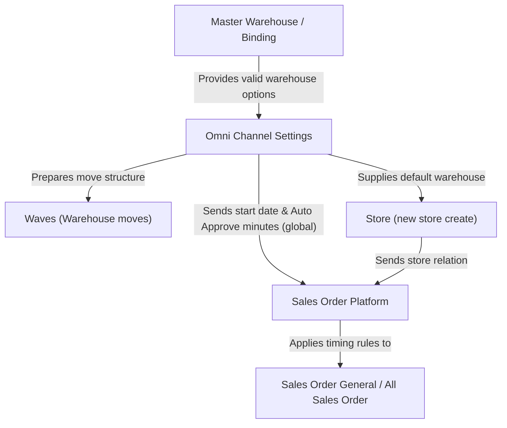

### 📦 Module/Feature: Omni Channel Settings

**Business definition:**
**Omni Channel Settings** is a single-page configuration menu that defines default operational parameters for marketplace integration, warehouse allocation, and order automation per company. It is non-transactional (no Draft/Open/Approved cycle). Each save updates the active values and is recorded in the Audit Log.

### 🔑 Key Terms

* **Default Building Process:** The default process warehouse that is auto-filled when a user creates a new **Store**.
* **Default Building Stock:** One or more warehouses used as the combined stock source (*Available to Sell*) sent to the marketplace.
* **Order Sync Start Date:** The date and time when the system starts pulling marketplace orders. Orders created before this time are never pulled.
* **Auto Approve (Minutes):** Waiting time in minutes before the system auto-approves incoming sales orders.

### 🎯 When & Why to Use

Fill this menu **once during initial setup** when a new internal company is registered in OlshopERP. Update it later only when company policy changes — for example, moving the main warehouse or changing auto-approve timing.

### 📋 Prerequisites

| Prerequisite | Source | Notes |
| :---- | :---- | :---- |
| **Active Internal Company** | Master Internal Company | Warehouse and order sync settings apply only to the company you are logged into. |
| **Complete warehouse structure** | Master Warehouse / Warehouse Binding | Warehouses need complete location setup (*Out Rack*, *Scrap*, *Return*) to appear in the dropdown. |
| **Menu permission** | Role / Menu settings | Users need view/update rights for OmniChannel configuration. |

### 📍 Menu Location & Workspace

* **UI Navigation Path:** OmniChannel → Omni Channel Settings
* **System UI Route:** `/omni/global-settings`

🖼️ **[IMAGE PLACEHOLDER]** — Omni Channel Settings page: one form, no datalist.

### ⚙️ Two Main Setting Groups

| Setting group | Fields | Scope |
| :---- | :---- | :---- |
| **Warehouse Setting** | *Default Building Process*, *Default Building Stock* | Isolated per company currently logged in. |
| **Order Setting (Order Automation)** | *Order Sync Start Date*, *Set Auto Approve All Sales Order* | *Order Sync Start Date* is per company. **Set Auto Approve All Sales Order is global (across companies).** |

### ⚠️ Per-Company vs Global Scope

⚠️ **WARNING: CROSS-COMPANY OPERATIONAL RISK**  
Check data scope carefully before changing values here:

1. **Per company scope:** *Default Building Process*, *Default Building Stock*, and *Order Sync Start Date* affect only the company you currently have open.
2. **Global system scope:** **Set Auto Approve All Sales Order (Minutes)** is **GLOBAL across companies**. The minutes value you save becomes the single shared reference used by **ALL** companies in the system.

**Important:** Do not change the Auto Approve minutes without clear coordination and agreement across teams/companies. A unilateral change can alter auto-approve timing for other companies on the same system.

### ⚙️ How to Use

#### **A. Fill Warehouse Setting**

> 1. Open **Omni Channel** → **Omni Channel Settings**.
> 2. Under *Warehouse Setting*, choose **Default Building Process**. The list shows only warehouses for the active company with complete location setup.
> 3. After you choose *Default Building Process*, the system auto-adds that warehouse into **Default Building Stock**.
> 4. (Optional) Add more warehouses in **Default Building Stock** if combined stock should come from several warehouses.
> 5. Click **Save**.

🖼️ **[IMAGE PLACEHOLDER]** — Default Building Process and Default Building Stock fields with Save.

#### **B. Fill Order Setting**

> 1. Go to *Order Setting*.
> 2. Set **Order Sync Start Date**. The value saves when you close the date/time picker.
> 3. (Optional) Enter minutes in **Set Auto Approve All Sales Order**. The value saves on blur. *Remember: Auto Approve is global.*

🖼️ **[IMAGE PLACEHOLDER]** — Order Sync Start Date and Set Auto Approve All Sales Order, including the daily batch warning text.

#### **C. Check change history (Audit Log)**

> 1. Open the side navigation **Audit Log**.
> 2. The system shows a combined history of when values changed, old/new values, and which user updated them.

🖼️ **[IMAGE PLACEHOLDER]** — Audit Log panel from the side navigation.

### 📊 Field Reference

| UI field | Required? | Default | Unit / type | Notes & limits |
| :---- | :---- | :---- | :---- | :---- |
| **Default Building Process** | Yes | Empty | Dropdown / warehouse | Default process warehouse for new Stores. Saving also prepares warehouse move (*wave*) structure. |
| **Default Building Stock** | Yes (min. 1) | Follows *Default Building Process* | Multi-select / warehouse | Combined stock source for marketplace. The warehouse chosen in *Default Building Process* is locked and cannot be removed from this list. |
| *Default Warehouse Void* | No | — | Hidden technical field | **Not shown in UI.** Internal field for technical cancellation handling. |
| **Order Sync Start Date** | Yes | Current system time | Date & time | Start of order pull window. Scope is **per company**. Maximum lookback is 14 days. |
| **Set Auto Approve All Sales Order** | Yes | — | Integer / minutes | Auto-approve delay. **GLOBAL across companies**. System disclaimer: this value may be overridden when it conflicts with the daily mass-approval schedule at 19:00. |

### 🛡️ Business Rules & Validations

* **If** you leave *Default Building Process* empty and click Save, **then** save is rejected with a required-field error.
* **If** you clear *Default Building Stock* or submit invalid data, **then** the system requires at least one active warehouse.
* **If** you look for a warehouse owned by another company, **then** it will not appear in the dropdown.
* **If** you choose a warehouse with a hierarchy level outside allowed ERP limits, **then** validation rejects it.
* **If** a warehouse is missing complete internal locations (*Out Rack*, *Scrap*, or *Return*), **then** it will not appear in *Default Building Process* or *Default Building Stock*.
* **If** you leave *Set Auto Approve All Sales Order* empty or enter a decimal/non-integer, **then** the update is blocked.
* **If** *Order Sync Start Date* has an invalid date format, **then** the system rejects it.
* **If** you try to move *Order Sync Start Date* more than 14 days into the past, **then** the change is rejected with a max lookback warning.

### 🔄 Extra Effect When Saving Warehouse Setting

When you click **Save** on Warehouse Setting, the system does more than store text values. In the background it checks, validates, and prepares warehouse move (*Waves*) structure for the selected process warehouse — so fulfillment paths are ready without extra manual setup.

### 🔗 Impact on Other Modules

* **New Store registration:** When creating a new Store under the same company, the process warehouse field is **auto-filled** from *Default Building Process*. If this menu is empty, new Store creation may fail due to missing warehouse relation. Changes here **do not update** Stores that already exist (*no retroactive effect*).
* **Order synchronization:** The system only pulls marketplace orders created on/after *Order Sync Start Date*. Older orders are **never pulled**, by auto sync or manual sync. This is a permanent cut-off, not a delayed queue.
* **Auto Approve:** The background job uses the global minutes value set here to approve orders. Some orders still stay pending for manual approval (for example: order detail was manually edited, or selling price is below a fair/HPP threshold). *Those exception rules live in Sales Order modules, not this menu.*

### 🛑 Exceptions & Limits

* **Cost/Discount error message:** Order sync may show a pop-up asking users to “complete global settings”. That missing field is about owner profile for extra cost/discount rules — **not part of this Omni Channel Settings page**. Contact a system Administrator; do not search for it here.
* **Auto Approve Return:** Backend support for marketplace sales-return auto-approve exists, but **it is intentionally not shown on this UI** yet.
* **Order Split UI remnant:** You may see leftover UI scaffolding for *Order Split*. It is an empty shell with **no backend function** yet — not a broken/missing feature.

### 🔗 Related Menus

**Data flow notes:**

> 1. **Master Warehouse / Warehouse Binding** supplies warehouses with complete locations to **Omni Channel Settings**.
> 2. **Omni Channel Settings** sends warehouse defaults to **Store** for new store creation, and prepares logistics structure in **Waves**.
> 3. *Order Sync Start Date* and *Auto Approve* minutes become control logic in **Sales Order Platform**.
> 4. **Sales Order Platform** then applies those timing standards in **Sales Order General / All Sales Order**.

### 🛠️ Troubleshooting

| Symptom | Likely cause | What to do |
| :---- | :---- | :---- |
| Process warehouse is empty when creating a new Store. | Settings for the active internal company were never saved here. | Open Omni Channel Settings, set *Default Building Process*, click Save. |
| Target warehouse does not appear in the dropdown. | Warehouse belongs to another company, or location setup is incomplete. | Check warehouse ownership in Master Warehouse and complete Out Rack/Scrap/Return. |
| Older marketplace orders never enter ERP. | Order create time is earlier than *Order Sync Start Date*. | Move start date back (max 14 days) or enter the order manually if it is too old. |
| Sync error asks to complete “global settings”, but the field is not on this form. | The required field is on another menu (cost/discount ownership), not warehouse/order settings. | Do not change this form. Contact the system Admin. |
| Auto Approve seems idle and orders stay pending. | Daily mass approval at 19:00 takes priority, order is in an exception case, or another company changed the global minutes. | Check the daily batch notice, HPP/exception cases, and confirm the active global minutes across companies. |

### ❓ FAQ

* **Q: If I switch to another child company, do these settings apply automatically?**
  * **A:** For Warehouse Setting and Order Sync Start Date — **No** (per company). For **Set Auto Approve All Sales Order** — **Yes**. One minutes value binds all companies in the system.
* **Q: Why can Default Building Stock include more than one warehouse?**
  * **A:** So the system can combine physical stock from several warehouses into one Available-to-Sell total for the marketplace.
* **Q: What happens internally when I click Save on Warehouse Setting?**
  * **A:** Besides saving the warehouse names, the system runs background setup to prepare stock-move (*wave*) paths for the selected process warehouse.
* **Q: Why does changing Auto Approve minutes sometimes not feel instant?**
  * **A:** It can conflict with the daily mass-approval job at 19:00. Outside that schedule, your minutes value still applies.
* **Q: Why was a marketplace order never pulled into ERP?**
  * **A:** Check *Order Sync Start Date*. If the order was created even one minute earlier than that cut-off, the system will permanently skip it.

### 📑 See Also

* Store Management documentation
* Sales Order Platform & General operations
* Warehouse & Warehouse Binding guide
* Waves Management documentation
