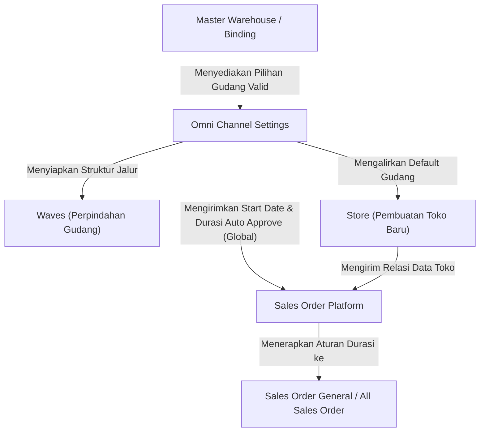

### 📦 Modul/Fitur: Omni Channel Settings

**Definisi Bisnis:**
**Omni Channel Settings** merupakan menu konfigurasi terpusat satu halaman (*single-form configuration*) yang mendefinisikan parameter operasional *default* untuk integrasi *marketplace*, pengelolaan alokasi gudang, dan otomatisasi pesanan per perusahaan (*company*). Menu ini bersifat statis tanpa siklus status transaksi (*non-transactional data*), di mana setiap penyimpanan baru akan memperbarui nilai aktif yang ada dan terekam langsung di dalam *Audit Log*.

### 🔑 Istilah Kunci

Sebelum mengonfigurasi sistem, pahami beberapa istilah teknis utama berikut:

* **Default Building Process:** Gudang proses *default* yang otomatis terisi saat pengguna membuat data toko baru (*Store*) di dalam sistem.
* **Default Building Stock:** Satu atau beberapa gudang yang digunakan sebagai acuan gabungan untuk menghitung total stok tersedia (*Available to Sell*) yang akan dikirimkan ke *marketplace*.
* **Order Sync Start Date:** Titik acuan tanggal dan jam mulainya sistem menarik data pesanan secara otomatis dari *marketplace*. Pesanan yang tercipta sebelum waktu ini tidak akan pernah ditarik oleh sistem.
* **Auto Approve (Menit):** Jeda durasi waktu tunggu (dalam satuan menit) sebelum sistem mengeksekusi persetujuan otomatis (*automatic approval*) terhadap pesanan yang masuk.

### 🎯 Kapan & Kenapa Dipakai

Menu ini diakses dan diisi **satu kali di awal *setup*** ketika sebuah perusahaan internal baru selesai didaftarkan di dalam ekosistem OlshopERP. Pembaruan data setelah *setup* awal hanya dilakukan secara berkala apabila terjadi perubahan kebijakan operasional internal perusahaan, seperti pemindahan gudang utama atau perubahan strategi durasi otomatisasi pemenuhan pesanan.

### 📋 Prasyarat Sistem

Sebelum melakukan konfigurasi pada halaman Omni Channel Settings, pastikan komponen berikut telah terpenuhi:

| Prasyarat | Komponen Sumber | Catatan Fungsional |
| :---- | :---- | :---- |
| **Internal Company Aktif** | Master Internal Company | Pengaturan gudang dan tanggal sinkronisasi pesanan terikat dan hanya berlaku khusus untuk perusahaan yang sedang *login*. |
| **Kelengkapan Struktur Gudang** | Master Warehouse / Warehouse Binding | Gudang harus sudah memiliki konfigurasi lokasi yang lengkap (*Out Rack*, *Scrap*, *Return*) agar dapat muncul dalam daftar pilihan. |
| **Hak Akses Menu** | Pengaturan Role / Menu | Pengguna wajib memiliki izin akses otorisasi untuk membaca dan mengubah konfigurasi pada modul OmniChannel. |

### 📍 Lokasi Menu & Workspace

Untuk mengakses halaman ini, silakan ikuti jalur navigasi berikut:
* **UI Navigation Path:** OmniChannel → Omni Channel Settings
* **System UI Route:** `/omni/global-settings`
🖼️ **[PLACEHOLDER GAMBAR]** — Halaman Omni Channel Settings, satu form tanpa datalist.

### ⚙️ Dua Kelompok Pengaturan Utama

Komponen di dalam halaman konfigurasi ini dibagi menjadi dua kluster fungsional dengan karakteristik cakupan data yang berbeda:

| Kelompok Pengaturan | Komponen Field | Cakupan Wilayah Kerja (Scope) |
| :---- | :---- | :---- |
| **Warehouse Setting** | *Default Building Process*, *Default Building Stock* | Terisolasi per perusahaan (*Per Company*) yang sedang *login*. |
| **Order Setting (Order Automation)** | *Order Sync Start Date*, *Set Auto Approve All Sales Order* | *Order Sync Start Date* berlaku per perusahaan. **Set Auto Approve All Sales Order berlaku secara global (lintas perusahaan).** |

### ⚠️ Cakupan Per Perusahaan vs Global

⚠️ **PERINGATAN: RISIKO OPERASIONAL LINTAS PERUSAHAAN**
Perhatikan dengan seksama perbedaan cakupan hukum data (*data scope*) sebelum melakukan perubahan di halaman ini:

1. **Cakupan Spesifik Perusahaan (*Per Company Scope*):** Parameter *Default Building Process*, *Default Building Stock*, dan *Order Sync Start Date* hanya berdampak pada perusahaan yang sedang Anda buka saat ini. Mengubah data ini tidak akan memengaruhi data operasional perusahaan lain di dalam sistem.
2. **Cakupan Global (*Global System Scope*):** Parameter **Set Auto Approve All Sales Order (Menit)** bersifat **GLOBAL LINTAS PERUSAHAAN**. Nilai menit yang Anda masukkan di sini menjadi satu-satunya acuan tunggal yang dipakai bersama oleh **SEMUA** perusahaan lain di dalam sistem.

**Penting:** Jangan mengubah angka pada field *Auto Approve* tanpa adanya koordinasi, persetujuan tertulis, dan konfirmasi matang lintas tim atau lintas manajemen perusahaan. Perubahan sepihak dapat mengubah ritme otomatisasi persetujuan pesanan di perusahaan lain yang berada dalam satu sistem.

### ⚙️ Langkah-Langkah Penggunaan

#### **A. Mengisi Warehouse Setting**

> 1. Masuk ke menu **Omni Channel** kemudian pilih **Omni Channel Settings**.
> 2. Pada bagian *Warehouse Setting*, pilih **Default Building Process** melalui menu *dropdown*. Sistem hanya menampilkan gudang milik perusahaan yang aktif dan telah lengkap konfigurasi internal lokasinya.
> 3. Setelah *Default Building Process* dipilih, sistem secara otomatis akan memasukkan gudang tersebut ke dalam daftar **Default Building Stock**.
> 4. (Opsional) Tambahkan gudang pendukung lainnya pada field **Default Building Stock** jika penghitungan stok gabungan diambil dari beberapa gudang.
> 5. Klik **Save**.

🖼️ **[PLACEHOLDER GAMBAR]** — Field Default Building Process dan Default Building Stock beserta tombol Save.

#### **B. Mengisi Order Setting**

> 1. Arahkan ke bagian *Order Setting*.
> 2. Tentukan tanggal dan jam pada field **Order Sync Start Date**. Data akan langsung tersimpan secara otomatis begitu Anda menutup jendela kalender pemilih.
> 3. (Opsional) Isi durasi pada field **Set Auto Approve All Sales Order** dalam satuan menit. Sistem akan langsung menyimpan nilai secara otomatis saat kursor Anda keluar dari field tersebut (*blur event*). *Selalu ingat bahwa pengaturan Auto Approve ini berdampak global.*

🖼️ **[PLACEHOLDER GAMBAR]** — Field Order Sync Start Date dan Set Auto Approve All Sales Order, termasuk teks peringatan terkait batch harian.

#### **C. Memeriksa Riwayat Perubahan (Audit Log)**

> 1. Untuk melihat rekam jejak aktivitas, klik panel navigasi samping pada bagian **Audit Log**.
> 2. Sistem akan menampilkan tabel riwayat gabungan yang melacak waktu perubahan, nilai lama, nilai baru, serta akun pengguna yang melakukan pembaruan pada konfigurasi ini.

🖼️ **[PLACEHOLDER GAMBAR]** — Panel Audit Log dari navigasi samping.

### 📊 Referensi Field Lengkap

| Nama Field UI | Wajib? | Nilai Bawaan (Default) | Satuan / Tipe Data | Keterangan Fungsional & Batasan Sistem |
| :---- | :---- | :---- | :---- | :---- |
| **Default Building Process** | Ya | Kosong | Dropdown / Objek Gudang | Menentukan gudang proses utama untuk *Store* baru. Menyimpan field ini otomatis memicu penyiapan struktur alur perpindahan barang (*wave*). |
| **Default Building Stock** | Ya (Min. 1) | Otomatis mengikuti *Default Building Process* | Multi-Select Dropdown / Objek Gudang | Tempat konsolidasi stok gabungan untuk *marketplace*. Gudang yang dipilih di *Default Building Process* terkunci dan tidak bisa dihapus dari daftar ini. |
| *Default Warehouse Void* | Tidak | — | Hidden Technical Object | **Tidak ditampilkan di UI (Disembunyikan).** Field internal untuk kebutuhan penanganan pembatalan teknis sistem. |
| **Order Sync Start Date** | Ya | Waktu sistem saat ini | Tanggal & Jam (*Datetime*) | Batas awal penarikan pesanan. Cakupan berlaku **per perusahaan**. Batas maksimal penarikan mundur adalah 14 hari ke belakang. |
| **Set Auto Approve All Sales Order** | Ya | — | Angka Bulat / Menit | Batas jeda otomatisasi persetujuan pesanan. **CAKUPAN GLOBAL LINTAS PERUSAHAAN**. Terdapat *disclaimer* sistem bahwa nilai ini dapat terabaikan jika bentrok dengan jadwal *mass approval* harian pukul 19:00. |

### 🛡️ Aturan Bisnis & Validasi Sistem

Sistem menerapkan validasi ketat dengan pola konsekuensi sebagai berikut:

* **Kalau kamu** mengosongkan field *Default Building Process* saat menekan tombol simpan, **maka sistem** akan menolak proses penyimpanan dan menampilkan pesan error bahwa field wajib diisi.
* **Kalau kamu** mengosongkan isi *Default Building Stock* atau memasukkan format data yang rusak, **maka sistem** akan menolak input dan mewajibkan minimal ada satu gudang aktif terdaftar.
* **Kalau kamu** mencari gudang yang bukan milik perusahaan yang sedang *login*, **maka sistem** secara otomatis tidak akan menampilkan gudang tersebut pada daftar pilihan.
* **Kalau kamu** memilih gudang yang memiliki tingkatan level struktur (*hierarchy level*) di luar batas yang diizinkan oleh arsitektur ERP, **maka sistem** akan menolak gudang tersebut saat divalidasi.
* **Kalau kamu** memilih gudang yang belum dikonfigurasi secara lengkap lokasi internalnya (*Out Rack*, *Scrap*, atau *Return*), **maka sistem** tidak akan memunculkan gudang tersebut di pilihan *Default Building Process* maupun *Default Building Stock*.
* **Kalau kamu** mengosongkan field *Set Auto Approve All Sales Order* atau mengisinya dengan angka desimal/bukan angka bulat, **maka sistem** akan memblokir proses pembaruan data secara otomatis.
* **Kalau kamu** memasukkan format penanggalan yang tidak valid pada *Order Sync Start Date*, **maka sistem** akan mendeteksi *corrupted date format* dan menolak data tersebut.
* **Kalau kamu** mencoba menggeser *Order Sync Start Date* lebih dari 14 hari ke belakang dihitung mundur dari hari ini, **maka sistem** akan menolak perubahan dan menampilkan pesan peringatan bahwa batas maksimal penarikan data lawas adalah 14 hari.

### 🔄 Efek Tambahan Saat Menyimpan Warehouse Setting

Setiap kali Anda menekan tombol **Save** pada kluster *Warehouse Setting*, sistem tidak hanya menyimpan baris kode data teks saja. Di balik layar, sistem secara **otomatis** langsung memeriksa, memvalidasi, dan menyiapkan struktur jaringan logistik perpindahan barang antar-gudang (*Waves*) khusus untuk gudang proses yang baru saja ditunjuk. Seluruh proses ini berjalan secara otomatis demi memastikan alur pemenuhan pesanan siap pakai tanpa memerlukan tindakan manual tambahan dari pengguna.

### 🔗 Dampak terhadap Modul Lain

Pengisian data pada Omni Channel Settings akan langsung memengaruhi ekosistem modul OlshopERP lainnya dengan ketentuan sebagai berikut:

* **Dampak ke Pendaftaran Toko (*Store* Baru):** Ketika pengguna mendaftarkan toko (*Store*) baru di bawah perusahaan yang sama, kolom pilihan gudang proses pada form toko tersebut akan **otomatis terisi** mengikuti nilai *Default Building Process* yang diatur di sini. Jika menu ini dibiarkan kosong, pembuatan *Store* baru berisiko mengalami error akibat kegagalan relasi data gudang. Namun perlu diingat, perubahan di halaman settings ini **tidak akan mengubah** konfigurasi *Store* yang sudah terlanjur dibuat sebelumnya (*no retroactive effect*).
* **Dampak ke Sinkronisasi Pesanan (*Order Synchronization*):** Sistem hanya akan menarik pesanan *marketplace* yang dibuat tepat pada atau setelah waktu yang tertera di *Order Sync Start Date*. Semua pesanan historis yang dibuat sebelum tanggal tersebut **tidak akan pernah ditarik ke dalam ERP**, baik lewat penarikan otomatis sistem maupun melalui tombol sinkronisasi manual. Status ini bersifat pemotongan permanen, bukan penundaan antrean.
* **Dampak ke Persetujuan Otomatis (*Auto Approve*):** Mesin otomatisasi (*automated background job*) akan menggunakan durasi menit global yang diisi di sini untuk mengeksekusi konfirmasi pesanan menjadi *Approved*. Namun, terdapat beberapa kondisi pengecualian di mana pesanan tetap tertahan dan wajib disetujui secara manual (misalnya: detail pesanan sempat diubah manual oleh staf, atau harga jual terdeteksi berada di bawah batas wajar/HPP). *Aturan teknis pengecualian ini dikelola sepenuhnya di dalam modul Sales Order, bukan di menu ini.*

### 🛑 Pengecualian & Batasan Fitur

Pengguna sering kali salah memahami beberapa aspek visual dan sistemik pada halaman ini. Berikut adalah klasifikasi batasan fitur yang wajib dipahami agar tidak keliru:

* **Pesan Error Biaya/Diskon:** Terkadang proses sinkronisasi pesanan gagal dan menampilkan *pop-up error* yang meminta pengguna untuk "melengkapi global settings". Perlu dicatat, field yang dimaksud dalam error tersebut berkaitan dengan hak kepemilikan (*owner profile*) untuk aturan biaya tambahan dan diskon. **Field tersebut bukan bagian dari halaman Omni Channel Settings ini.** Jika kendala ini muncul, jangan mencari field-nya di sini, melainkan hubungi Administrator utama sistem.
* **Fitur Auto Approve Retur:** Pengaturan otomatisasi persetujuan untuk retur penjualan dari *platform marketplace* sebetulnya telah selesai dibangun secara arsitektur sistem backend. Namun, **fitur ini sengaja belum dipasang dan disembunyikan dari UI halaman ini**. Oleh sebab itu, Anda belum dapat mengonfigurasi otomatisasi retur melalui layar tersemat saat ini.
* **Bagian Pemisahan Pesanan (*Order Split*):** Di dalam struktur komponen halaman, Anda mungkin melihat adanya komponen atau sisa kerangka kerja terkait fitur *Order Split*. Bagian ini statusnya masih murni **kerangka kosong tanpa fungsi operasional backend**. Komponen tersebut bukan fitur rusak atau hilang, melainkan aset masa depan yang belum diaktifkan.

### 🔗 Hubungan Antar Menu

Berikut adalah visualisasi bagaimana data konfigurasi dari Omni Channel Settings mengalir dan memengaruhi komponen modul lainnya di dalam OlshopERP:

**Keterangan Langkah Aliran Data:**

> 1. **Master Warehouse / Warehouse Binding** berfungsi sebagai penyaring awal yang menyuplai data gudang dengan syarat lokasi komplit ke menu **Omni Channel Settings**.
> 2. **Omni Channel Settings** kemudian mendistribusikan konfigurasi gudang ke modul **Store** saat ada pendaftaran toko baru, sekaligus memerintahkan sistem backend untuk menyiapkan struktur logistik di modul **Waves**.
> 3. Parameter waktu *Order Sync Start Date* serta durasi menit *Auto Approve* yang dikonfigurasi di halaman utama akan ditembak langsung sebagai *logic control* di dalam modul **Sales Order Platform**.
> 4. Modul **Sales Order Platform** selanjutnya meneruskan standar parameter waktu konfirmasi otomatis tersebut untuk dieksekusi di ranah **Sales Order General / All Sales Order**.

### 🛠️ Troubleshooting

| Gejala Masalah | Kemungkinan Penyebab | Tindakan Solusi Penyelesaian |
| :---- | :---- | :---- |
| Pilihan gudang proses pada saat membuat *Store* baru kosong secara otomatis. | Konfigurasi untuk perusahaan internal yang sedang aktif belum pernah diisi atau disimpan di menu pengaturan ini. | Masuk ke Omni Channel Settings, pilih perusahaan yang sesuai, isi field *Default Building Process*, lalu klik *Save*. |
| Gudang fisik yang dituju tidak muncul di dalam daftar pilihan *dropdown*. | Gudang tersebut terdaftar di bawah perusahaan internal lain, atau kelengkapan lokasinya (*Out Rack/Scrap/Return*) belum disetting. | Periksa kepemilikan gudang di Master Warehouse dan pastikan semua parameter titik lokasi internal sudah dikonfigurasi penuh. |
| Pesanan lama dari *marketplace* tidak kunjung masuk ke dalam antrean dokumen ERP. | Waktu penciptaan pesanan di *marketplace* lebih tua dari tanggal yang tertera pada *Order Sync Start Date*. | Geser posisi *Order Sync Start Date* mundur ke belakang (maksimal batasan sistem 14 hari) atau input pesanan secara manual jika sudah kadaluwarsa. |
| Muncul peringatan *error* sinkronisasi untuk melengkapi "global settings", namun field terkait tidak ditemukan di halaman form ini. | Field yang memicu error tersebut berada di lokasi menu lain dan membahas hak akses pengelolaan potongan biaya, bukan parameter gudang/order. | Jangan lakukan perubahan di form ini. Segera hubungi Admin Utama sistem untuk dibukakan akses ke menu konfigurasi biaya yang dimaksud. |
| Fitur *Auto Approve* terasa tidak bekerja dan pesanan tetap berstatus tertahan. | Sistem sedang mendahului antrean dengan jadwal *mass approval* harian (jam 19:00), pesanan masuk ke dalam kategori pengecualian, atau ada perusahaan lain yang mengubah nilai menit global tersebut. | Periksa papan pengumuman *batch harian*, cek apakah harga barang berada di bawah HPP (kasus pengecualian), dan lakukan konfirmasi lintas perusahaan terkait nilai aktif menit global. |

### ❓ FAQ

* **Q: Apakah pengisian data konfigurasi di halaman ini akan otomatis langsung diterapkan jika saya berpindah akun ke anak perusahaan lain?**
  * *A:* Untuk kluster *Warehouse Setting* dan *Order Sync Start Date*, jawabannya adalah **Tidak**. Keduanya bersifat privat per perusahaan. Namun, untuk nilai durasi **Set Auto Approve All Sales Order**, jawabannya adalah **Ya**. Satu angka menit yang disimpan akan langsung mengikat seluruh anak perusahaan yang terdaftar di dalam sistem tanpa terkecuali.
* **Q: Mengapa pada opsi Default Building Stock kita diizinkan untuk memilih dan memasukkan lebih dari satu gudang sekaligus?**
  * *A:* Fitur multi-gudang ini dirancang agar sistem dapat melakukan kalkulasi konsolidasi stok gabungan. Dengan demikian, total akumulasi ketersediaan fisik barang dari berbagai cabang gudang dapat disatukan nilainya untuk dilempar sebagai stok siap jual di halaman etalase *marketplace*.
* **Q: Apa yang sebenarnya dikerjakan oleh sistem secara internal saat saya menekan tombol Save pada kluster Warehouse Setting?**
  * *A:* Selain mengunci nama gudang di database, sistem secara otomatis akan menjalankan *script background* untuk mendirikan, memetakan, dan memastikan kesiapan jalur perpindahan logistik stok (*wave structure*) yang melekat pada gudang operasional pilihan Anda tersebut.
* **Q: Mengapa pengubahan durasi menit Auto Approve terkadang terasa tidak langsung memberikan dampak instan pada pesanan masuk?**
  * *A:* Hal tersebut disebabkan adanya benturan prioritas dengan jadwal rutin sistem yang melakukan eksekusi persetujuan massal (*mass approval*) setiap hari pada pukul 19:00. Meskipun demikian, angka yang Anda masukkan tetap sah mengikat sistem di luar jam krusial tersebut.
* **Q: Saya mendapati ada pesanan dari pelanggan di marketplace yang sama sekali tidak tersedot masuk ke sistem ERP, mengapa demikian?**
  * *A:* Pastikan untuk memeriksa field *Order Sync Start Date*. Apabila waktu transaksi pesanan tersebut tercatat satu menit saja lebih tua dari batas tanggal mulai yang Anda kunci di halaman ini, maka sistem selamanya akan mengabaikan dan tidak menarik pesanan tersebut.

### 📑 Lihat Juga

* Dokumen Konfigurasi Toko (*Store Management*)
* Dokumen Operasional Sales Order Platform & General
* Panduan Tata Kelola Gudang (*Warehouse & Warehouse Binding*)
* Dokumen Pengelolaan Alur Distribusi (*Waves Management*)
