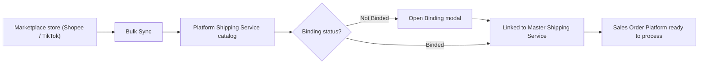
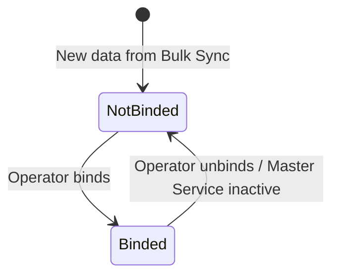
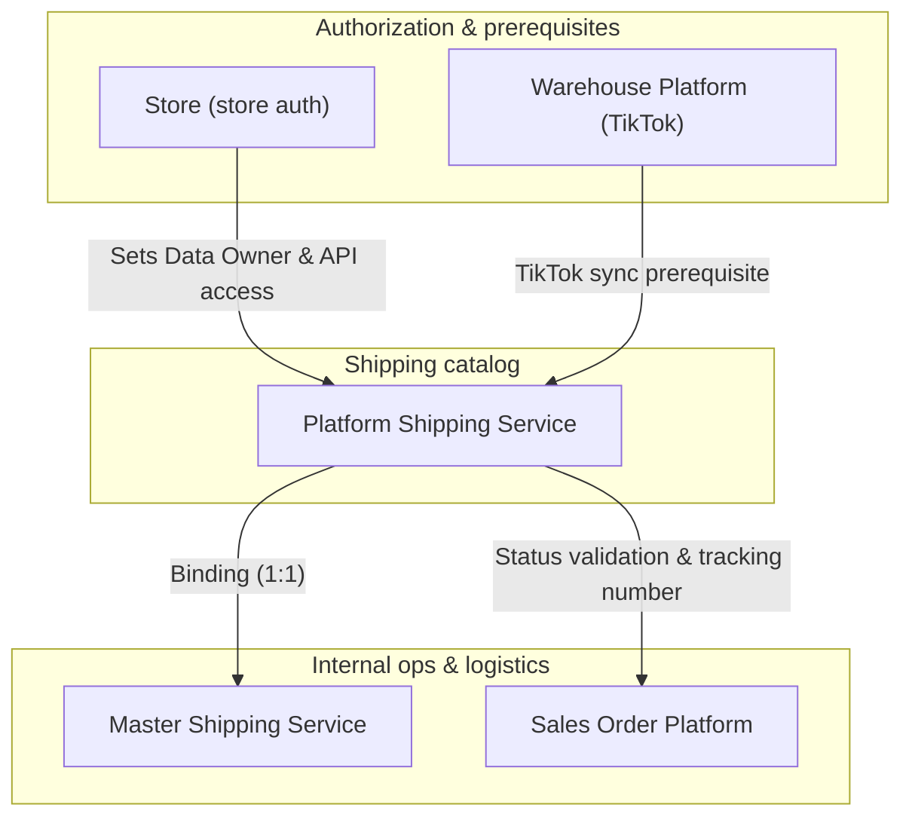

### 📦 Module/Feature: Platform Shipping Service

**Business definition:**
**Platform Shipping Service** is a read-only catalog of shipping services used on marketplace storefronts (such as Shopee and TikTok Shop). The catalog is collected automatically through **Bulk Sync** from authorized stores — operators do not create rows manually. Omni Channel teams use this page to monitor shipping options and **bind** marketplace shipping services to the internal **Master Shipping Service**, so marketplace sales orders can be processed without shipping-map blockers.

### 🔑 Key Terms

| Term | Definition |
| :---- | :---- |
| **Platform Shipping Service** | Read-only shipping-service catalog synced from marketplace platforms. |
| **Master Shipping Service** | Internal company shipping-service master used as the binding target. |
| **Bulk Sync** | Mass pull that refreshes marketplace shipping services into this catalog. |
| **Binding** | Linking one marketplace shipping-service row to one **Master Shipping Service**. |
| **Not Binded / Binded** | Connection status: **Not Binded** (not linked) and **Binded** (linked). |
| **Drop Off (-DO)** | Handover method where the seller drops the parcel at a courier agent/outlet. |
| **Pick Up (-PU)** | Handover method where the courier picks up the parcel from the warehouse. |
| **Data Owner** | The company that owns the data, based on which business entity authorized the related marketplace store. |

### 🎯 When & Why to Use

Use this menu when:

* **New store authorization:** After a new marketplace store is authorized, run **Bulk Sync** to pull shipping services for the first time.
* **Routine catalog maintenance:** Keep marketplace shipping options up to date.
* **Stuck marketplace orders:** When **Sales Order Platform** fails because the shipping service is not bound to **Master Shipping Service**.

### 📋 Prerequisites

| Prerequisite | Source / module | Notes |
| :---- | :---- | :---- |
| Active Shopee / TikTok Shop store | **Store** | Store must be authorized and active. Expired tokens require re-auth. |
| Warehouse sync (TikTok only) | **Warehouse Platform** | TikTok shipping options need platform warehouse data synced first. |
| No running Bulk Sync | System engine | Another **Bulk Sync** must not be running at the same time. |
| Valid access token | Store authorization | Marketplace OAuth token must be active. |

### 🔄 Place in the Business Flow

**Steps:**

> 1. **Receive data:** Pull marketplace shipping services via **Bulk Sync**.
> 2. **Catalog:** Rows land in **Platform Shipping Service** as **Not Binded**.
> 3. **Resolve binding:** Operator links each row to an internal **Master Shipping Service**.
> 4. **Process orders:** **Sales Order Platform** validates binding status before processing.

### 📍 Menu Location & Workspace

* **UI Navigation Path:** OmniChannel → Platform Shipping Service
* **System UI Route:** `/omni/shipping-service-platform`

🖼️ **[IMAGE PLACEHOLDER]** — Platform Shipping Service list page, with no Create button.
⚠️ **Hard rule:** This menu is a read-only catalog. There is no **Create** button or manual input form. Data enters only through **Bulk Sync**.

### 🏷️ Binding Status

#### Binding status table

| Status | Meaning | Direct edit? | How to change |
| :---- | :---- | :---- | :---- |
| **Not Binded** | Marketplace shipping service is not linked to **Master Shipping Service**. | No (read-only) | Click **Binding** in Action, then choose the target Master Shipping Service. |
| **Binded** | Marketplace shipping service is actively linked to one **Master Shipping Service**. | No (read-only) | Click **Binding** again on the Binded row to unbind. |

### 📦 Why One Channel Often Shows Two Rows (-DO and -PU)

During **Bulk Sync**, one courier name from the marketplace can become two separate rows:

> 1. **Suffix -DO (Drop Off):** Seller drops the parcel at a courier outlet/agent.
> 2. **Suffix -PU (Pick Up):** Courier picks up the parcel from the warehouse.

The system treats these as two different operational services. Each row must be bound separately to the matching internal **Master Shipping Service**.

### ⚙️ How to Use

#### Run Bulk Sync

> 1. Open **Platform Shipping Service**.
> 2. Open the side **Bulk Sync** panel.
> 3. Make sure no other sync is already running.
> 4. Click **Start Sync**.

🖼️ **[IMAGE PLACEHOLDER]** — Bulk Sync panel with Start Sync.

> 5. Wait until the job finishes. If sync fails, check **Sync Log** and re-authorize the store if needed.

#### Bind (and Unbind)

> 1. Filter the list to **Not Binded**.
> 2. Click **Action** on the row you want to link.

🖼️ **[IMAGE PLACEHOLDER]** — Binding modal with Master Shipping Service picker.

> 3. In the modal, choose the target **Master Shipping Service**, then click **Save**.
> 4. Status becomes **Binded**.
> 5. To **Unbind**, click **Action** again on a **Binded** row and confirm.

💡 **Best practice:** Binding can also be managed from the **Master Shipping Service** menu.

### 📊 Field Reference

| Column | Shown by default? | Type / source | Description |
| :---- | :---- | :---- | :---- |
| **Code** | Yes | String (sync) | Marketplace shipping-service code (often ends with -DO or -PU). |
| **Service Name** | Yes | String (sync) | Official shipping-service name from the marketplace. |
| **Type Service** | Yes | Internal mapping | Shipping type category (see known limits). |
| **Max Weight** | Yes | Numeric (grams) | Maximum parcel weight allowed by the service. |
| **Max Dimensions** | Yes | Text format (cm) | Maximum package size: Length × Width × Height. |
| **Platform Name** | Yes | String | Marketplace source (Shopee or TikTok Shop). |
| **Binding Status** | Yes | Status tag | **Not Binded** or **Binded**. |
| **Active** | Yes | Boolean | Active flag. Soft-deleted rows appear inactive. |
| **Created By / At** | Yes | Audit | Who/what pulled the data and when. |
| **Action** | Yes | UI control | Opens Binding / Unbind modal. |
| **ID** | Hidden | Database key | Internal row ID. |
| **Store Name** | Hidden | System reference | Shows the first active store for that platform (see known limits). |

### 🛡️ Business Rules & Validations

| No | Operator action / condition | System behavior |
| :---- | :---- | :---- |
| 1 | Run **Bulk Sync** with no authorized active Shopee store. | Shopee sync is rejected with a re-auth warning. |
| 2 | Run **Bulk Sync** with no authorized active TikTok Shop store. | TikTok sync is rejected with a re-auth warning. |
| 3 | Run **Bulk Sync** when no marketplace store meets prerequisites. | Execution is logged, but result can be empty. |
| 4 | Marketplace API failure or job collision during sync. | Sync failure notification with error-log detail. |
| 5 | Marketplace API sync completes successfully. | Success dialog; catalog table refreshes. |
| 6 | Open binding modal on a row that is already **Binded**. | New bind is rejected; row is already bound. |
| 7 | Save binding without choosing **Master Shipping Service**. | Save is rejected; Master Shipping Service is required. |
| 8 | Unbind without selecting the relation to remove. | Unbind is rejected until the relation is selected. |
| 9 | Process a new order whose shipping service is **Not Binded**. | **Sales Order Platform** blocks processing until binding is done. |
| 10 | Choose a **Master Shipping Service** owned by another company. | Save is rejected due to cross-company access limits. |

### ⚠️ Limit: One Active Binding Per Row

Binding is strict **1:1**. One synced shipping-service row can have **only one active Master Shipping Service binding** at a time.

To switch to another Master Shipping Service, **Unbind** first, then bind again to the new target. Direct overwrite is rejected.

### 🏢 Why Two Rows Can Look Identical (Data Owner)

You may see two rows with the same service name, code, and platform.

⚠️ **Important:** This is **not a bug or duplicate**.

It happens because of **Data Owner**. If two companies in the ERP both authorize stores on the same marketplace, **Bulk Sync** pulls shipping services for each company. The rows look the same, but they belong to different companies and access scopes.

### 📄 Where Order Tracking Numbers Come From

Even after a row is **Binded** to **Master Shipping Service**, marketplace order logistics still use this catalog.

Sales order processing takes shipping data and the **tracking number** from **Platform Shipping Service**, **not** from **Master Shipping Service**. Keeping this catalog accurate is critical for tracking.

### 🛑 Known Limitations

* **Type Service category:** *Type Service* does not yet auto-separate Drop Off vs Pick Up. Use the -DO / -PU suffix on code or name as the main hint.
* **Store Name column:** The hidden *Store Name* field shows only the first active store for that platform — **not** the exact store that sourced the row. Do not rely on it for source audit.
* **Platform coverage:** **Bulk Sync** currently supports **Shopee and TikTok Shop** only. Lazada and Tokopedia auto-sync are not supported here yet.
* **No manual create:** There is no manual add UI. All rows come from marketplace **Bulk Sync**.

### 🔗 Related Menus

#### Related module roles

| Related module | Role vs Platform Shipping Service |
| :---- | :---- |
| **Store** | Provides OAuth store auth that determines **Data Owner** during **Bulk Sync**. |
| **Warehouse Platform** | Provides TikTok platform warehouse options required before TikTok shipping sync. |
| **Master Shipping Service** | Binding target directory. |
| **Sales Order Platform** | Reads binding status and tracking-number reference to process marketplace shipments. |

### 🛠️ Troubleshooting

| Symptom | Likely cause | What to do |
| :---- | :---- | :---- |
| **Start Sync** asks to re-authorize the store. | Shopee/TikTok token expired or disconnected. | Re-authorize the store in **Store**. |
| New store is authorized, but shipping list is still empty. | Sync does not run automatically after auth. | Run **Start Sync** manually in the **Bulk Sync** panel. |
| Marketplace order is stuck/blocked in **Sales Order Platform**. | Shipping service is **Not Binded**. | Bind the shipping service to **Master Shipping Service**. |
| *Type Service* looks the same on every row. | Current mapping limitation. | Use -DO (Drop Off) / -PU (Pick Up) suffixes. |
| Two rows have identical service name and platform. | Different **Data Owner** companies. | Check company ownership per row — not a duplicate error. |
| TikTok shipping sync always returns empty. | TikTok **Warehouse Platform** data not synced yet. | Sync **Warehouse Platform** first, then rerun **Bulk Sync**. |

### ❓ FAQ

* **Q: Why is there no Create button to add a shipping service?**
  * **A:** All data comes from marketplace **Bulk Sync**. Manual create is not allowed, so API shipping data stays consistent.
* **Q: Why do I see two rows with the exact same name and platform?**
  * **A:** Different **Data Owner** companies authorized stores on the same marketplace.
* **Q: I added a new store — why don’t shipping options appear yet?**
  * **A:** Sync is not automatic. Run **Bulk Sync** manually.
* **Q: Where does the order tracking number come from?**
  * **A:** From this **Platform Shipping Service** catalog, not from **Master Shipping Service**, even after binding.
* **Q: Why doesn’t Type Service separate Drop Off and Pick Up?**
  * **A:** Current system limit. Use code/name suffixes (-DO / -PU).
* **Q: Why can’t the marketplace order be processed?**
  * **A:** Check the shipping service on that order. If it is still **Not Binded**, bind it to **Master Shipping Service** first.

### 📑 See Also

* **Master Shipping Service** — internal shipping-service master maintenance
* **Store** — marketplace store authorization and API access
* **Sales Order Platform** — marketplace order processing and monitoring
