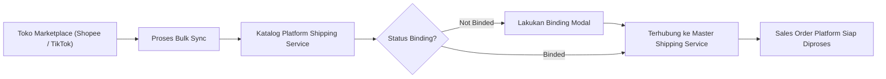
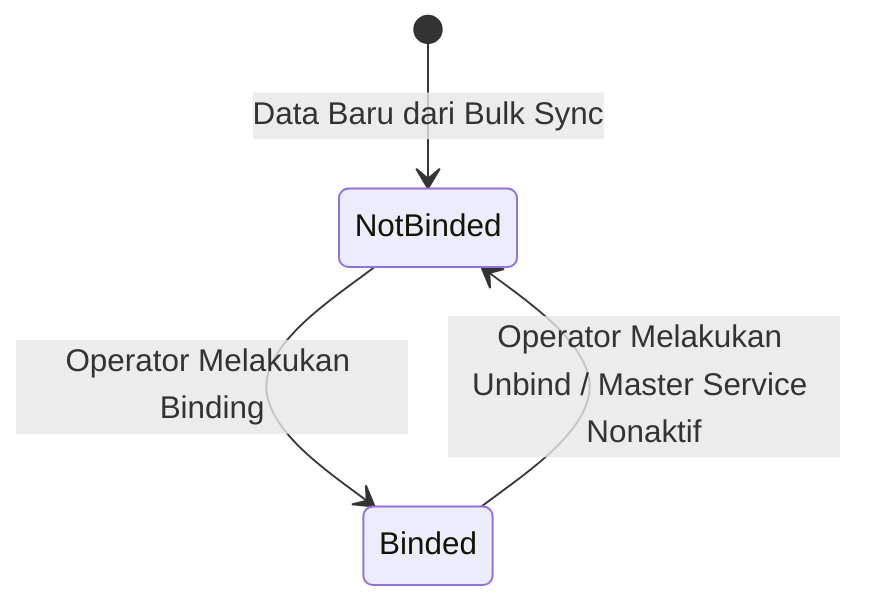
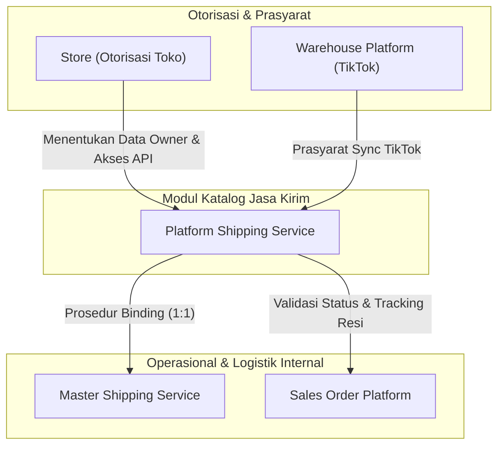

### 📦 Modul/Fitur: Platform Shipping Service

**Definisi Bisnis:**
**Platform Shipping Service** adalah katalog read-only berisi daftar jasa pengiriman yang digunakan di etalase marketplace (seperti Shopee dan TikTok Shop). Katalog ini dikumpulkan secara otomatis melalui proses **Bulk Sync** dari toko-toko yang sudah diotorisasi, bukan diinput manual oleh operator. Tim operasional Omni Channel menggunakan halaman ini untuk memantau status pengiriman serta melakukan **Binding** (penyambungan) antara jasa kirim marketplace dengan **Master Shipping Service** internal agar order transaksi dapat diproses tanpa kendala.

### 🔑 Istilah Kunci

| Istilah | Definisi |
| :---- | :---- |
| **Platform Shipping Service** | Katalog jasa kirim read-only hasil sinkronisasi data dari platform marketplace. |
| **Master Shipping Service** | Daftar referensi jasa kirim standar internal perusahaan yang menjadi target *binding*. |
| **Bulk Sync** | Proses penarikan data masal secara langsung untuk memperbarui daftar jasa kirim dari marketplace. |
| **Binding** | Proses menyambungkan satu baris data jasa kirim marketplace ke satu jasa kirim internal (**Master Shipping Service**). |
| **Not Binded / Binded** | Status keterhubungan data: **Not Binded** (belum tersambung) dan **Binded** (sudah tersambung). |
| **Drop Off (-DO)** | Metode penyerahan barang di mana pihak penjual mengantar paket secara mandiri ke agen/gerai pengiriman. |
| **Pick Up (-PU)** | Metode penyerahan barang di mana penjemputan paket dilakukan langsung oleh kurir ekspedisi. |
| **Data Owner** | Perusahaan pemilik data yang sah, diidentifikasi berdasarkan entitas bisnis yang mengotorisasi toko marketplace terkait. |

### 🎯 Kapan & Kenapa Dipakai

Modul ini digunakan dalam skenario berikut:

* **Otorisasi Toko Baru:** Setiap kali toko marketplace baru selesai diotorisasi, **Bulk Sync** harus dijalankan untuk menarik daftar jasa kirim marketplace untuk pertama kali.
* **Pemeliharaan Katalog Rutin:** Memastikan bahwa varian dan opsi pengiriman terbaru dari platform marketplace selalu tersinkronisasi.
* **Penanganan Order Tertahan:** Ketika transaksi marketplace (*Sales Order Platform*) gagal diproses akibat jasa kirim terkait belum terhubung ke **Master Shipping Service**.

### 📋 Prasyarat

Sebelum mengoperasikan modul ini, pastikan prasyarat sistem berikut telah terpenuhi:

| Prasyarat | Sumber / Modul | Catatan Operasional |
| :---- | :---- | :---- |
| Toko Shopee / TikTok Shop Aktif | **Master Store** | Toko wajib terotorisasi dan aktif. Jika token kedaluwarsa, sistem akan meminta re-otentikasi. |
| Sinkronisasi Gudang (Khusus TikTok) | **Warehouse Platform** | Data opsi pengiriman TikTok membutuhkan data gudang platform yang tersinkron terlebih dahulu. |
| Antrean Bulk Sync Kosong | System Engine | Tidak boleh ada proses **Bulk Sync** lain yang sedang berjalan secara bersamaan. |
| Token Akses Valid | Otorisasi Store | Token OAuth toko marketplace dalam kondisi aktif. |

### 🔄 Posisi dalam Alur Bisnis

Proses **Platform Shipping Service** menghubungkan otorisasi platform hingga tahap pemrosesan order.
Berikut adalah diagram alur pengolahan data jasa kirim:

**Keterangan langkah:**

> 1. **Penerimaan Data:** Sistem menarik jasa kirim marketplace via **Bulk Sync**.
> 2. **Katalogisasi:** Data masuk ke katalog **Platform Shipping Service** dengan status awal **Not Binded**.
> 3. **Resolusi Binding:** Operator menghubungkan entitas tersebut ke **Master Shipping Service** internal.
> 4. **Eksekusi Order:** Sistem **Sales Order Platform** memvalidasi *binding status* untuk memproses pesanan.

### 📍 Lokasi Menu & Workspace

Akses modul ini melalui jalur navigasi berikut:

* **Navigasi UI:** OmniChannel ➔ Platform Shipping Service
* **URL Route:** /omni/shipping-service-platform

🖼️ **[PLACEHOLDER GAMBAR]** — Halaman daftar Platform Shipping Service, tanpa tombol Create.
⚠️ **Hard Rule:** Menu ini murni katalog read-only. Tidak ada tombol **Create** atau formulir input manual. Data hanya dapat dimasukkan melalui prosedur **Bulk Sync**.

### 🏷️ Status Binding

Setiap baris data jasa kirim platform mengikuti siklus status (*lifecycle*) yang sederhana:

#### Tabel Status Keterhubungan Data

| Status | Arti | Dapat Diedit Secara Direct? | Prosedur Perubahan |
| :---- | :---- | :---- | :---- |
| **Not Binded** | Data jasa kirim marketplace belum terhubung ke **Master Shipping Service**. | Tidak (Read-Only) | Klik ikon **Binding** pada kolom *Action* lalu pilih *Master Shipping Service* sasaran. |
| **Binded** | Data jasa kirim marketplace sudah terhubung aktif ke satu **Master Shipping Service**. | Tidak (Read-Only) | Klik ikon **Binding** pada baris terkait untuk melakukan prosedur *Unbind*. |

### 📦 Kenapa Satu Channel Muncul Dua Baris (-DO dan -PU)

Saat penarikan data melalui **Bulk Sync**, satu nama layanan ekspedisi dari platform marketplace dapat menghasilkan dua baris entitas terpisah:

> 1. **Suffix -DO (Drop Off):** Digunakan jika skema penyerahan paket dilakukan dengan mengantar barang ke gerai/agen ekspedisi.
> 2. **Suffix -PU (Pick Up):** Digunakan jika skema penyerahan paket dilakukan melalui penjemputan oleh kurir ke lokasi gudang.

Sistem memperlakukan kedua metode ini sebagai dua layanan yang berbeda secara operasional. Oleh karena itu, masing-masing baris wajib di-bind secara terpisah ke **Master Shipping Service** internal yang sesuai.

### ⚙️ Langkah-Langkah Penggunaan

#### Menjalankan Bulk Sync

> 1. Buka halaman **Platform Shipping Service**.
> 2. Buka panel **Bulk Sync** yang berada di sisi samping halaman.
> 3. Pastikan tidak ada indikasi proses sinkronisasi lain yang sedang berlangsung.
> 4. Klik tombol **Start Sync**.

🖼️ **[PLACEHOLDER GAMBAR]** — Panel Bulk Sync dengan tombol Start Sync.

> 5. Tunggu hingga status proses selesai. Jika sinkronisasi gagal, periksa **Sync Log** untuk penanganan re-otorisasi toko.

#### Melakukan Binding (dan Unbind)

> 1. Pada daftar tabel, filter data dengan status **Not Binded**.
> 2. Klik tombol pada kolom **Action** di baris yang ingin dihubungkan.

🖼️ **[PLACEHOLDER GAMBAR]** — Modal Binding dengan pilihan Master Shipping Service.

> 3. Pada popup modal yang muncul, pilih entitas **Master Shipping Service** internal tujuan, lalu tekan **Save**.
> 4. Indikator status akan berubah menjadi **Binded**.
> 5. Untuk melepaskan keterhubungan (*Unbind*), klik kembali tombol **Action** pada baris yang berstatus **Binded**, lalu konfirmasi pelepasan sambungan.

💡 **Best Practice:** Prosedur *binding* juga dapat dilakukan secara terpusat dari menu **Master Shipping Service**.

### 📊 Referensi Field Lengkap

Berikut adalah daftar seluruh parameter data pada tabel katalog **Platform Shipping Service**:

| Nama Kolom | Default Tampil? | Tipe / Sumber Data | Deskripsi / Keterangan |
| :---- | :---- | :---- | :---- |
| **Code** | Ya | String (Sync Data) | Kode unik layanan pengiriman dari marketplace (umumnya memiliki akhiran -DO atau -PU). |
| **Service Name** | Ya | String (Sync Data) | Nama resmi layanan pengiriman sesuai deskripsi marketplace. |
| **Type Service** | Ya | Internal Mapping | Kategori tipe pengiriman (lihat batasan sistem pada Section 15). |
| **Max Weight** | Ya | Numeric (Gram) | Batas bobot maksimum paket yang diizinkan oleh layanan pengiriman terkait. |
| **Max Dimensions** | Ya | Format Text (cm) | Batas dimensi maksimum paket dengan batasan Panjang × Lebar × Tinggi. |
| **Platform Name** | Ya | String (Platform) | Nama platform marketplace asal data (Shopee atau TikTok Shop). |
| **Binding Status** | Ya | Status Tag | Status keterhubungan data (**Not Binded** atau **Binded**). |
| **Active** | Ya | Boolean Status | Indikator keaktifan entitas. Data yang dihapus secara *soft-delete* bertanda tidak aktif. |
| **Created By / At** | Ya | Audit Log | Metadata identitas akun/sistem penarik data beserta stempel waktu *sync*. |
| **Action** | Ya | Interface Control | Tombol aksi untuk membuka modal formulir *Binding* / *Unbind*. |
| **ID** | Tersembunyi | Database Key | Identifikasi unik internal baris data pada sistem ERP. |
| **Store Name** | Tersembunyi | System Reference | Menampilkan nama toko aktif pertama pada platform terkait (lihat penjelasannya pada Section 15). |

### 🛡️ Aturan Bisnis & Validasi

Setiap interaksi user dan kondisi sistem tunduk pada aturan berikut:

| No | Kondisi / Aksi Operator | Perilaku Sistem (System Action) |
| :---- | :---- | :---- |
| 1 | Menjalankan **Bulk Sync** tanpa toko Shopee yang terotorisasi dan aktif. | Sistem menolak sinkronisasi Shopee dan menerbitkan *warning* otorisasi ulang toko Shopee. |
| 2 | Menjalankan **Bulk Sync** tanpa toko TikTok Shop yang terotorisasi dan aktif. | Sistem menolak sinkronisasi TikTok dan menerbitkan *warning* otorisasi ulang toko TikTok. |
| 3 | Menjalankan **Bulk Sync** saat seluruh toko marketplace tidak memenuhi prasyarat. | Sistem tetap mencatat eksekusi di log, tetapi proses berakhir dengan data kosong (*zero result*). |
| 4 | Terjadi kegagalan koneksi API marketplace atau *job collision* saat sinkronisasi. | Sistem menampilkan notifikasi kegagalan *sync* beserta detail error log terkait. |
| 5 | Sinkronisasi API marketplace berhasil dieksekusi penuh. | Sistem menampilkan dialog sukses dan memperbarui entitas tabel katalog secara otomatis. |
| 6 | Membuka modal *binding* pada baris data yang **sudah** berstatus **Binded**. | Sistem menolak pembuatan sambungan baru dan memberikan notifikasi bahwa entitas telah ter-bind. |
| 7 | Menyimpan konfirmasi *binding* tanpa memilih entitas **Master Shipping Service**. | Sistem menolak eksekusi dan memberikan instruksi validasi kolom *Master Shipping Service*. |
| 8 | Memproses aksi *unbind* tanpa menentukan target relasi yang akan dilepas. | Sistem menolak eksekusi dan mewajibkan penentuan entitas relasi secara eksplisit. |
| 9 | Memproses transaksi pesanan baru yang memiliki ekspedisi berstatus **Not Binded**. | Sistem menghentikan pemrosesan pesanan pada **Sales Order Platform** hingga jasa kirim di-bind. |
| 10 | Memilih entitas **Master Shipping Service** milik entitas perusahaan (*Data Owner*) lain. | Sistem menolak otorisasi simpan akibat kendala batasan hak akses antar-perusahaan. |

### ⚠️ Batasan: Satu Baris Hanya Satu Binding Aktif

Sistem mengaplikasikan batasan rasio keterhubungan **1:1 (One-to-One)** secara ketat. Satu baris entitas jasa kirim hasil *sync* **hanya diizinkan memiliki satu relasi binding aktif** ke **Master Shipping Service** dalam satu waktu.
Jika operator ingin mengubah rute keterhubungan ke **Master Shipping Service** lain, sistem akan menolak aksi pembaharuan secara langsung. Operator wajib melakukan proses **Unbind** terlebih dahulu pada relasi eksisting sebelum dapat menyambungkannya ke entitas **Master Shipping Service** yang baru.

### 🏢 Kenapa Dua Baris Bisa Terlihat Sama (Data Owner)

Dalam penggunaan operasional, dapat ditemukan dua baris data jasa kirim yang memiliki nama layanan, kode, dan nama platform yang identik secara visual.
⚠️ **Penting:** Kondisi ini **bukan merupakan kesalahan sistem (bug) ataupun data ganda (duplicate data)**.
Hal ini terjadi karena struktur arsitektur **Data Owner** (pemilik entitas data). Jika dua perusahaan yang berbeda dalam sistem ERP sama-sama mengotorisasi toko marketplace di platform yang sama, proses **Bulk Sync** akan menarik entitas jasa pengiriman untuk masing-masing perusahaan. Walaupun terlihat sama, kedua baris data tersebut dipisahkan oleh batasan hak akses dan kepemilikan entitas perusahaan yang berbeda.

### 📄 Dari Mana Nomor Resi (Tracking Number) Diambil

Meskipun suatu baris jasa pengiriman platform sudah terhubung (**Binded**) ke entitas **Master Shipping Service** internal, pemrosesan logistik pesanan tetap mengacu pada katalog asal.
Sistem pemrosesan pesanan marketplace tetap mengambil seluruh data pengiriman dan **Nomor Resi (Tracking Number)** secara langsung dari katalog **Platform Shipping Service** ini, dan **bukan** dari data referensi **Master Shipping Service**. Oleh karena itu, konsistensi data pada katalog ini merupakan hal yang krusial bagi kelancaran operasional pelacakan pesanan.

### 🛑 Keterbatasan yang Diketahui

Berikut adalah keterbatasan sistem saat ini (*current system limitations*):

* **Kategorisasi Tipe Layanan (Type Service):** Kolom *Type Service* saat ini belum membedakan secara otomatis antara skema pengiriman *Drop Off* dan *Pick Up*. Untuk mengidentifikasi jenis penyerahan paket, jadikan akhiran kode atau nama layanan (-DO atau -PU) sebagai acuan utama.
* **Tampilan Kolom Store Name:** Parameter *Store Name* yang tersembunyi secara *default* hanya menampilkan toko aktif pertama dari platform yang sesuai, **bukan** toko spesifik yang menjadi sumber penarikan data tersebut. Kolom ini tidak direkomendasikan untuk kebutuhan audit asal data.
* **Cakupan Platform:** Fitur **Bulk Sync** saat ini **baru mendukung platform Shopee dan TikTok Shop**. Sinkronisasi otomatis untuk platform Lazada dan Tokopedia belum didukung pada modul ini.
* **Ketiadaan Input Manual:** Tidak tersedia opsi penambahan data secara manual melalui antarmuka modul. Seluruh entitas data murni bersumber dari hasil **Bulk Sync** marketplace.

### 🔗 Hubungan Antar Menu

Katalog **Platform Shipping Service** berinteraksi dengan berbagai modul lain dalam ekosistem sistem ERP:

#### Tabel Peran Modul Terkait

| Modul Terkait | Peran & Relasi Terhadap Platform Shipping Service |
| :---- | :---- |
| **Store** | Menyediakan otorisasi OAuth toko yang menentukan kepemilikan data (**Data Owner**) saat **Bulk Sync**. |
| **Warehouse Platform** | Menyediakan data opsi lokasi gudang platform yang menjadi prasyarat sinkronisasi jasa kirim khusus platform TikTok Shop. |
| **Master Shipping Service** | Menjadi direktori tujuan utama dalam proses penyambungan data (*Binding*). |
| **Sales Order Platform** | Membaca *binding status* dan mengambil referensi nomor resi (*tracking number*) untuk memproses pengiriman pesanan marketplace. |

### 🛠️ Troubleshooting

| Gejala Masalah | Kemungkinan Penyebab Utama | Langkah Solusi Operasional |
| :---- | :---- | :---- |
| Tombol **Start Sync** meminta otorisasi ulang toko. | Token akses toko Shopee/TikTok telah kedaluwarsa atau terputus. | Lakukan otorisasi ulang (*re-authorization*) pada toko terkait di menu **Store**. |
| Toko baru berhasil diotorisasi tetapi daftar jasa kirim masih kosong. | Sinkronisasi data tidak berjalan secara otomatis setelah otorisasi. | Buka modul dan jalankan **Start Sync** secara manual pada panel **Bulk Sync**. |
| Pesanan marketplace tertahan (*error/blocked*) di **Sales Order Platform**. | Ekspedisi yang digunakan pada transaksi berstatus **Not Binded**. | Periksa *Binding Status* dari jasa kirim terkait, lalu lakukan proses *binding* ke **Master Shipping Service**. |
| Nilai pada kolom *Type Service* tampak seragam untuk semua baris. | Keterbatasan fungsionalitas pemeta visual saat ini. | Gunakan penanda akhiran kode/nama (-DO untuk Drop Off, -PU untuk Pick Up) sebagai pembeda. |
| Terlihat dua baris data dengan nama layanan dan platform yang identik. | Perbedaan kepemilikan entitas (*Data Owner*) dari dua toko perusahaan berbeda. | Periksa entitas perusahaan (*Data Owner*) pada masing-masing baris. Ini bukan data duplikat/error. |
| Penarikan data sinkronisasi untuk platform TikTok Shop selalu kosong. | Data gudang platform (*Warehouse Platform*) toko belum tersinkronisasi. | Jalankan proses sinkronisasi pada modul **Warehouse Platform** terlebih dahulu, kemudian ulangi proses **Bulk Sync**. |

### ❓ FAQ

* **Q: Mengapa saya tidak menemukan tombol Create untuk menambah jasa kirim baru?**
  * **A:** Seluruh data pada modul ini bersumber dari penarikan otomatis via **Bulk Sync** dari sistem marketplace. Input manual tidak diizinkan untuk menjaga integritas data pengiriman API marketplace.
* **Q: Mengapa terdapat dua baris jasa kirim dengan nama dan platform yang sama persis?**
  * **A:** Hal ini terjadi akibat perbedaan hak akses kepemilikan data (**Data Owner**). Kondisi ini muncul apabila dua perusahaan yang berbeda mengotorisasi toko di marketplace yang sama.
* **Q: Saya sudah menambah toko baru, mengapa opsi pengirimannya tidak langsung muncul?**
  * **A:** Pembaruan data tidak berlangsung secara otomatis. Operator wajib menjalankan prosedur **Bulk Sync** secara manual pada panel yang tersedia.
* **Q: Dari mana sistem mengambil informasi Nomor Resi (Tracking Number) pesanan?**
  * **A:** Nomor resi diambil secara langsung dari katalog **Platform Shipping Service** ini, bukan dari entitas **Master Shipping Service**, meskipun statusnya telah terhubung (*Binded*).
* **Q: Mengapa kolom Type Service tidak membedakan Drop Off dan Pick Up?**
  * **A:** Hal ini merupakan keterbatasan sistem saat ini. Untuk mengidentifikasi tipe pengiriman, periksa penanda kodenya (akhiran -DO untuk *Drop Off* dan -PU untuk *Pick Up*).
* **Q: Mengapa transaksi pesanan marketplace tidak dapat diproses oleh sistem?**
  * **A:** Periksa jasa kirim yang digunakan pada pesanan tersebut. Jika statusnya masih **Not Binded**, lakukan proses *binding* terlebih dahulu ke **Master Shipping Service**.

### 📑 Lihat Juga

* **Master Shipping Service** — Pemeliharaan direktori referensi jasa kirim internal perusahaan.
* **Store** — Pengaturan otorisasi dan akses API toko marketplace.
* **Sales Order Platform** — Pemrosesan dan pemantauan transaksi pesanan dari marketplace.
