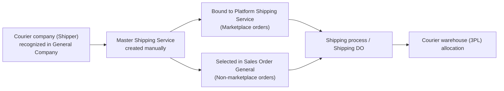
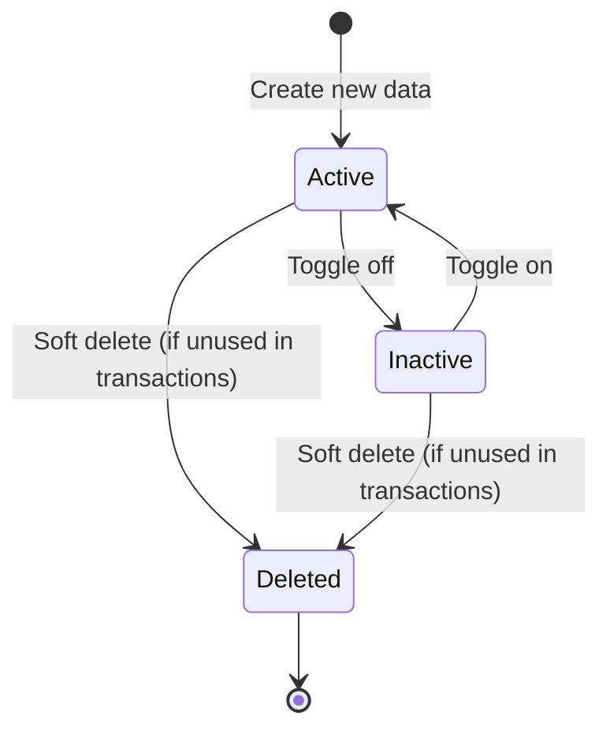
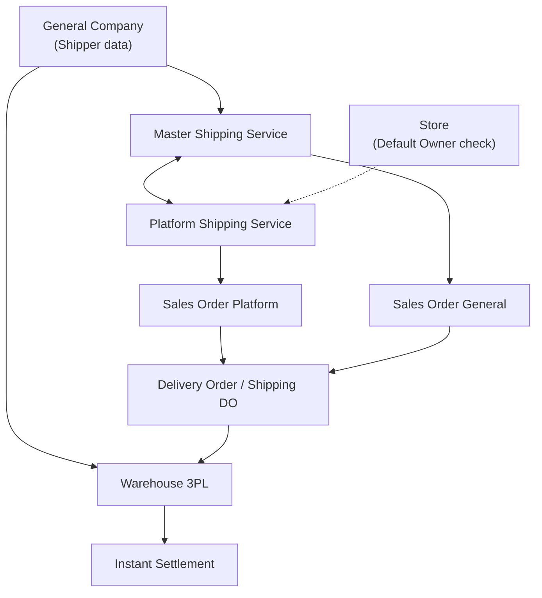

### 📦 Module/Feature: Master Shipping Service

**Business definition:**
**Master Shipping Service** is the company’s internal shipping-service catalog, managed manually by users (not auto-synced). It is the internal reference for courier company (**Shipper**), service type, and courier warehouse (**Warehouse 3PL**) used for fulfillment.

Unlike **Platform Shipping Service** (a read-only catalog synced from marketplaces), **Master Shipping Service** is fully maintained by the company. Omni Channel, Warehouse, and Finance teams use it to **bind** marketplace shipping services to internal standards, or to pick a courier option on non-marketplace sales (**Sales Order General**).

### 🔑 Key Terms

| Term | Definition |
| :---- | :---- |
| **Master Shipping Service** | Internal shipping-service standard created and managed manually in OlshopERP. |
| **Shipper** | Courier / logistics company (a **General Company** recognized and activated as a shipper). |
| **Warehouse 3PL** | Third-party logistics warehouse owned by the courier, where goods are held before delivery to the recipient. |
| **Binding** | Mapping one or more **Platform Shipping Service** rows to one **Master Shipping Service**. |
| **Default Shipping Service** | The default shipping service auto-selected when creating an order for the first time. |
| **Show for all company** | Visibility setting so child companies can view the data, but cannot edit it. |
| **Not Binded / Binded** | Whether a marketplace shipping service is linked to a Master Shipping Service. |

### 🎯 When & Why to Use

Use this menu when:

* **New courier setup:** The company starts working with a new courier and needs to register its services.
* **Marketplace integration:** Binding new marketplace shipping options so incoming orders are recognized internally.
* **Sales Order General operations:** Providing official courier options for manual / non-marketplace orders.
* **Shipping troubleshooting:** Fixing orders that fail because of 3PL warehouse or courier mapping issues.

### 📋 Prerequisites

| Prerequisite | Source | Notes |
| :---- | :---- | :---- |
| Courier company (**Shipper**) registered and active | **General Company** | Recognizing an entity as shipper usually also creates related 3PL warehouses. |
| Courier warehouse (**Warehouse 3PL**) available | **General Company** / **Warehouse 3PL** | Not validated when saving Master; checked later at Shipping DO approval. |
| Service type (*Pick Up* / *Drop Off*) decided | — | Only one service type; **locked** after first save. |
| Company is the store’s *Default Data Owner* | **Store** | **Required** before Binding is allowed. |

### 🔄 Place in the Business Flow

**Steps:**

> 1. Recognize and activate the courier as a **Shipper** in **General Company**.
> 2. Create a new **Master Shipping Service** for that courier service type.
> 3. Bind it to marketplace shipping services, **or** select it directly on **Sales Order General**.
> 4. At **Delivery Order / Shipping DO**, the system reads Master data to route goods to **Warehouse 3PL**.

### 📍 Menu Location & Workspace

* **UI Navigation Path:** OmniChannel → Settings → Master Shipping Service
* **System UI Route:** `/omni/shipping-service`

🖼️ **[IMAGE PLACEHOLDER]** — Master Shipping Service list, grouped by Shipper, with warning icons on some rows.

### 🏷️ Status Lifecycle

#### Status details

| Status | Editable? | Behavior |
| :---- | :---- | :---- |
| **Active** | Yes | Active and usable for binding and new transactions. |
| **Inactive** | Yes | Disabled for normal operations. |
| **Deleted** | No | Soft-deleted from the system. |

⚠️ **WARNING: INACTIVE STATUS**  
The system currently **does not block** deactivating a Master that is still linked to active orders, and bindings are **not cleared automatically**. Turning a Master inactive without checking can leave shipping info empty on orders or fail packing steps.

### ⚙️ How to Use

#### Task 1: Create a new Master Shipping Service

> 1. Make sure the courier is activated as a **Shipper** in **General Company**.
> 2. Open **Master Shipping Service**, then click **Create**.

🖼️ **[IMAGE PLACEHOLDER]** — Create form with Code, Shipper, Service Type, Min/Max Weight, and Dimensions.

> 3. Fill **Code**, **Shipper**, **Shipper Service**, **Service Type** (*Pick Up* / *Drop Off*), **Minimum Weight**, **Maximum Weight**, and **Max Dimensions**.
> 4. Click **Save**.

📌 **Note:** **Service Type** cannot be changed after the first save.

#### Task 2: Bind to Platform Shipping Service

> 1. Open the **Master Shipping Service** you want to link.
> 2. Scroll to **Shipping Binding**.

🖼️ **[IMAGE PLACEHOLDER]** — Shipping Binding section with multi-select Platform Shipping Service.

> 3. Choose one or more **Platform Shipping Service** rows that are *Not Binded*.
> 4. Click **Save**. If it fails, confirm your company is the store’s *Default Data Owner* in **Store**.

#### Task 3: Deactivate or delete a Master

> 1. **Deactivate:** Toggle status to **Inactive**. Make sure no running transactions depend on this Master.
> 2. **Delete:** Click **Delete**. The system rejects delete if the Master was already used in transactions.

### 📊 Field Reference

#### 9.1 Basic Information

| Field | Required? | Type | Description | Constraints |
| :---- | :---- | :---- | :---- | :---- |
| **Code** | Yes | String | Unique Master shipping-service code. | Unique among non-deleted rows. |
| **Shipper Name** | Yes | Dropdown | Courier company. | Only active General Companies marked as Shipper. |
| **Shipper Service** | Yes | String | Official courier service name (e.g. Reguler, YES). | — |
| **Service Type** | Yes | Dropdown | Handover type (*Pick Up* / *Drop Off*). | One choice only; **locked** after save. |
| **Minimum Weight** | Yes | Numeric | Minimum parcel weight in grams. | ≥ 0. |
| **Maximum Weight** | Yes | Numeric | Maximum parcel weight in grams. | ≥ 0. |
| **Max Dimensions** | Yes | Numeric | Max package size (L × W × H in cm). | ≥ 0. |
| **Logistic Label Template** | No | String | Shipping label print template. | ⚠️ **Non-functional:** shown in UI but changes are not saved. |
| **Description** | No | Text | Extra notes. | Max 150 characters. |
| **Available Insurance** | No | Boolean | Shipping insurance availability flag. | Informational only. |
| **Set as Default** | No | Boolean | Mark as company default shipping service. | Max one active default per company. |
| **Active** | No | Boolean | Operational status (default: Active). | — |
| **Show for all company** | No | Boolean | Cross-company visibility. | Read-only for other entities when enabled. |

#### 9.2 Shipping Binding

| Field | Type | Description |
| :---- | :---- | :---- |
| **Shipper Service** | Read-only | Name of the Master service currently open. |
| **Select Shipping Service** | Multi-select | **Platform Shipping Service** rows that can be linked to this Master. |

#### 9.3 Warehouse Shipper

This section shows the Shipper’s **Warehouse 3PL** structure as a tree view.  
📌 **Note:** View only. If empty, the Shipper has no linked 3PL warehouse yet.

### 🛡️ Business Rules & Validations

* **Scenario 1:** If **Code** is already used, save is rejected with a duplicate-code error.
* **Scenario 2:** If **Shipper** is missing or inactive, save is rejected.
* **Scenario 3:** If **Service Type** is empty on create, save is rejected (required).
* **Scenario 4:** If **Shipper + Shipper Service + Service Type** already exists, duplicate save is rejected.
* **Scenario 5:** If you edit a Master whose **Shipper** is inactive, update is rejected until an active Shipper is chosen.
* **Scenario 6:** If your company is not the store’s *Default Data Owner*, Binding is rejected.
* **Scenario 7:** If the selected **Platform Shipping Service** is already bound to another Master under the same data owner, binding is rejected and the owning Master code is shown.
* **Scenario 8:** If you try to delete a Master already used in order transactions, delete is blocked.

### ⚠️ Courier Warehouse (3PL) Is Checked Only at Shipping Approval

🖼️ **[IMAGE PLACEHOLDER]** — Warehouse Shipper section (3PL warehouse tree) on the Master form.

⚠️ **HARD WARNING: LATE OPERATIONAL VALIDATION**  
When saving **Master Shipping Service** (Create/Update), the system **does NOT validate** whether the selected Shipper already has a linked **Warehouse 3PL**. The Master can still be saved.

**Warehouse 3PL** is fully checked only when approving shipment (**Shipping DO / Delivery Order**). If the Shipper has no 3PL warehouse, **Shipping DO fails immediately**.

**Practical tip:** Before using a Master in production, open **Warehouse Shipper** on the form and make sure the 3PL tree is not empty.

### 🔄 Shipper Data Is Read Real-time

On **Delivery Order (DO)**, OlshopERP always reads the **latest Master Shipping Service** data (real-time), not a snapshot from order creation.

* **Impact:** If Shipper name or Master parameters change later, in-progress orders **follow the latest data**.

### 🛑 Known Limitations

> 1. **Inactive without hard block:** Deactivating a Master linked to active orders is allowed, and bindings are not auto-cleared.
> 2. **Marketplace usage detection gap:** Delete checks for “already used in transactions” may miss marketplace-order usage (references can sit on platform IDs), so a Master may be deleted unintentionally.
> 3. **Binding ownership inconsistency:** From the Master side, one Platform row can be bound by different data owners. From **Platform Shipping Service**, locking is stricter 1:1 across owners — statuses can disagree.
> 4. **Non-functional label field:** **Logistic Label Template** appears in UI but is not saved to the database.

### 📤 Export Data

| Export option | Output structure |
| :---- | :---- |
| **Without Details** | One row per Master Shipping Service. Marketplace platform columns are empty. |
| **With Details** | One row **per binding**. If one Master has 3 platform bindings, export has 3 rows. |

### 🔗 Related Menus

#### Module roles

| Menu / module | Role vs Master Shipping Service |
| :---- | :---- |
| **General Company** | Provides courier (**Shipper**) master data. |
| **Platform Shipping Service** | Marketplace shipping catalog used as Binding objects. |
| **Sales Order Platform** | Marketplace orders whose courier is resolved via Binding. |
| **Sales Order General** | Manual orders that select Master Shipping Service directly. |
| **Delivery Order / Shipping DO** | Main validation point for **Warehouse 3PL** completeness. |
| **Store** | Validates *Default Data Owner* before Binding is allowed. |
| **Instant Settlement** | Settlement that depends on goods receipt at Warehouse 3PL. |

### 🛠️ Troubleshooting

| Symptom | Likely cause | Fix |
| :---- | :---- | :---- |
| Binding fails | Logged-in company is not *Default Data Owner* in **Store**. | Set the company as Default Data Owner for that store. |
| Binding error: “Already bound” | Platform Shipping Service is linked to another Master. | Unbind it from the old Master first. |
| **Shipping DO** fails: “No 3PL warehouse” | Shipper has no Warehouse 3PL configured. | Complete Shipper profile and **Warehouse 3PL** mapping in **General Company**. |
| Warning icon on list row | Master max weight/dimensions exceed the platform service limits. | Adjust Maximum Weight / Dimensions to match. |
| Shipper field on order suddenly empty | Related Master was set to **Inactive**. | Set the Master back to **Active**. |
| **Service Type** cannot be changed | Field is locked after first save. | Create a new Master with the correct Service Type. |

### ❓ FAQ

* **Q: Why did the courier name on running orders change after I edited Master Shipping Service?**
  * **A:** The system reads Master data in real time during shipping, not as a snapshot from order creation.
* **Q: When is Default Shipping Service used?**
  * **A:** Only as auto-fill when a user creates a new order **for the first time**.
* **Q: Why is Warehouse Shipper empty on my Master form?**
  * **A:** The selected Shipper has no linked 3PL warehouse yet. Fix this in **General Company**, not on this Master form.

### 📑 See Also

* **Platform Shipping Service** — marketplace shipping catalog from sync
* **General Company** — business partners, shippers, and 3PL warehouses
* **Sales Order General** — internal / non-marketplace sales orders
* **Delivery Order / Shipping DO** — shipment execution and approval
